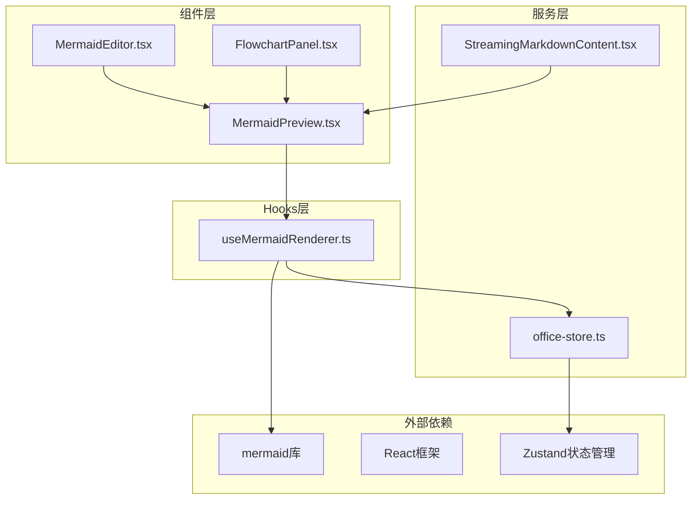
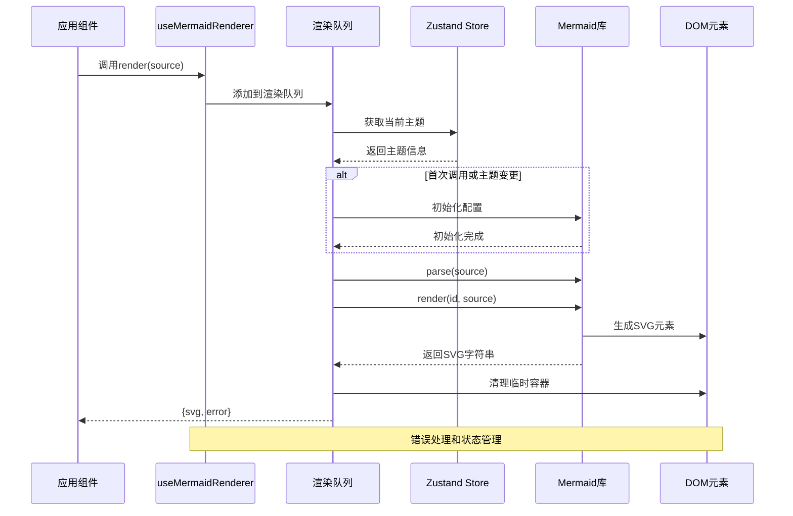
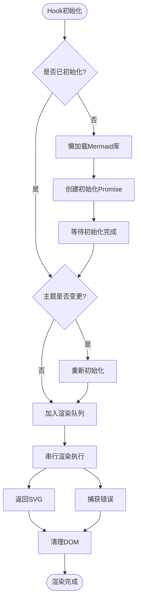
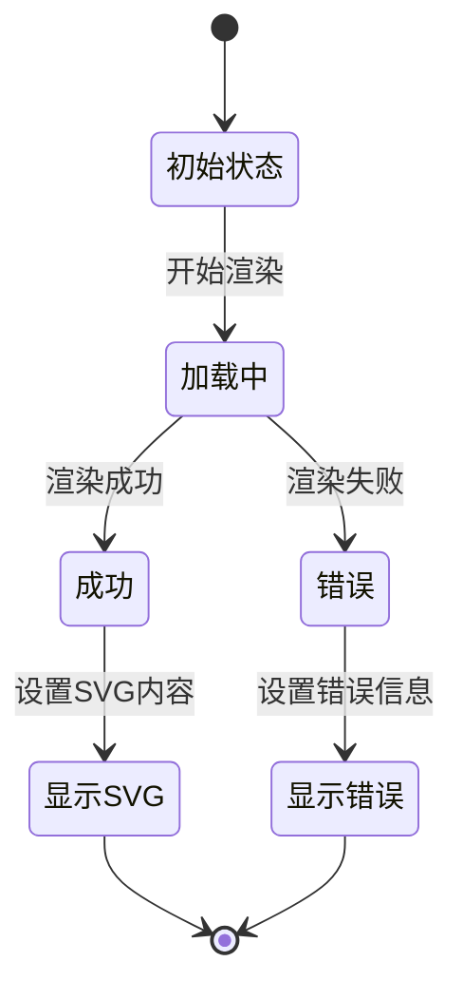

# Mermaid图表渲染Hook

<cite>
**本文档引用的文件**
- [useMermaidRenderer.ts](file://src/hooks/useMermaidRenderer.ts)
- [MermaidPreview.tsx](file://src/components/shared/MermaidPreview.tsx)
- [MermaidEditor.tsx](file://src/components/console/skills/MermaidEditor.tsx)
- [StreamingMarkdownContent.tsx](file://src/components/chat/StreamingMarkdownContent.tsx)
- [FlowchartPanel.tsx](file://src/components/console/skills/FlowchartPanel.tsx)
- [office-store.ts](file://src/store/office-store.ts)
- [MermaidPreview.test.tsx](file://src/components/shared/__tests__/MermaidPreview.test.tsx)
- [package.json](file://package.json)
</cite>

## 更新摘要
**变更内容**
- 更新了渲染机制分析，反映新的序列化渲染队列系统
- 新增了性能优化章节，重点介绍渲染队列和并发控制
- 更新了错误处理策略，强调预验证和DOM清理机制
- 新增了内存泄漏防护的具体实现细节
- 更新了架构概览，展示简化的组件关系

## 目录
1. [简介](#简介)
2. [项目结构](#项目结构)
3. [核心组件](#核心组件)
4. [架构概览](#架构概览)
5. [详细组件分析](#详细组件分析)
6. [性能考虑](#性能考虑)
7. [故障排除指南](#故障排除指南)
8. [结论](#结论)

## 简介

useMermaidRenderer是一个专门用于Mermaid图表渲染的React Hook，它提供了完整的图表渲染解决方案，包括Mermaid语法解析、DOM元素管理、图表实例化流程以及生命周期管理。该Hook通过懒加载方式引入Mermaid库，支持主题切换，并提供错误处理和降级机制。

**更新** 新的渲染系统采用了更直接和高效的架构，通过渲染队列确保图表渲染的串行化，避免了并发渲染导致的DOM污染问题。

## 项目结构

该项目采用模块化的组织方式，Mermaid渲染功能分布在多个文件中：

**图表来源**
- [useMermaidRenderer.ts:1-82](file://src/hooks/useMermaidRenderer.ts#L1-L82)
- [MermaidPreview.tsx:1-66](file://src/components/shared/MermaidPreview.tsx#L1-L66)
- [MermaidEditor.tsx:1-47](file://src/components/console/skills/MermaidEditor.tsx#L1-L47)
- [StreamingMarkdownContent.tsx:1-200](file://src/components/chat/StreamingMarkdownContent.tsx#L1-L200)

**章节来源**
- [useMermaidRenderer.ts:1-82](file://src/hooks/useMermaidRenderer.ts#L1-L82)
- [package.json:49-63](file://package.json#L49-L63)

## 核心组件

### useMermaidRenderer Hook

useMermaidRenderer是整个Mermaid渲染系统的核心，它提供了以下关键功能：

- **懒加载Mermaid库**：通过动态导入避免初始包体积过大
- **主题感知渲染**：根据应用主题自动调整图表样式
- **单例模式管理**：确保Mermaid实例的唯一性和复用
- **渲染队列控制**：通过Promise链确保渲染的串行化执行
- **错误处理机制**：提供完整的异常捕获和错误报告

**更新** 新版本引入了渲染队列机制，通过`renderQueue`确保每个图表渲染都在独立的Promise链中执行，避免了并发渲染导致的DOM状态污染问题。

### MermaidPreview 组件

MermaidPreview是一个展示组件，负责：
- 接收Mermaid源码并触发渲染
- 处理渲染状态（加载中、成功、错误）
- 提供用户友好的错误提示界面
- 支持响应式布局和滚动

### MermaidEditor 编辑器

MermaidEditor集成了实时预览功能：
- 文本区域编辑Mermaid代码
- 防抖机制避免频繁渲染
- 实时预览图表变化
- 支持大文本的性能优化

**章节来源**
- [useMermaidRenderer.ts:27-81](file://src/hooks/useMermaidRenderer.ts#L27-L81)
- [MermaidPreview.tsx:9-65](file://src/components/shared/MermaidPreview.tsx#L9-L65)
- [MermaidEditor.tsx:9-46](file://src/components/console/skills/MermaidEditor.tsx#L9-L46)

## 架构概览

**图表来源**
- [useMermaidRenderer.ts:31-78](file://src/hooks/useMermaidRenderer.ts#L31-L78)
- [office-store.ts:234](file://src/store/office-store.ts#L234)

## 详细组件分析

### useMermaidRenderer Hook实现

#### 渲染机制分析

Hook采用了单例模式配合渲染队列来管理Mermaid实例：

**图表来源**
- [useMermaidRenderer.ts:4-15](file://src/hooks/useMermaidRenderer.ts#L4-L15)
- [useMermaidRenderer.ts:31-78](file://src/hooks/useMermaidRenderer.ts#L31-L78)

#### 生命周期管理

Hook实现了完整的生命周期管理：

1. **初始化阶段**：检查Mermaid实例是否存在
2. **主题同步**：监听应用主题变化
3. **渲染执行**：通过渲染队列确保串行化执行
4. **DOM清理**：清理临时容器元素防止内存泄漏
5. **错误处理**：统一捕获和处理渲染异常

#### DOM元素管理

Hook实现了严格的DOM管理机制：

1. **临时容器清理**：Mermaid渲染会在body上创建临时容器，Hook确保在每次渲染后清理这些容器
2. **渲染计数器**：使用递增的ID确保每个渲染都有唯一的标识符
3. **错误状态清理**：即使渲染失败也会清理临时容器，防止DOM污染

**章节来源**
- [useMermaidRenderer.ts:27-81](file://src/hooks/useMermaidRenderer.ts#L27-L81)

### MermaidPreview 组件分析

#### 状态管理流程

**图表来源**
- [MermaidPreview.tsx:15-31](file://src/components/shared/MermaidPreview.tsx#L15-L31)
- [MermaidPreview.tsx:33-41](file://src/components/shared/MermaidPreview.tsx#L33-L41)

#### 错误处理策略

组件提供了多层次的错误处理：

1. **渲染错误检测**：捕获Mermaid渲染异常
2. **用户友好提示**：显示红色错误标题
3. **源码展示**：以代码块形式显示原始Mermaid源码
4. **状态重置**：错误状态下清理SVG内容

**章节来源**
- [MermaidPreview.tsx:43-65](file://src/components/shared/MermaidPreview.tsx#L43-L65)

### MermaidEditor 编辑器分析

#### 动态更新机制

编辑器实现了防抖机制来优化性能：

**图表来源**
- [MermaidEditor.tsx:17-25](file://src/components/console/skills/MermaidEditor.tsx#L17-L25)
- [MermaidEditor.tsx:27-31](file://src/components/console/skills/MermaidEditor.tsx#L27-L31)

#### 响应式布局适配

编辑器支持响应式设计：
- 使用Flexbox布局适应不同屏幕尺寸
- 文本区域支持自动高度调整
- 预览区域提供滚动支持
- 深色/浅色主题自动适配

**章节来源**
- [MermaidEditor.tsx:33-46](file://src/components/console/skills/MermaidEditor.tsx#L33-L46)

## 性能考虑

### 图表渲染优化

1. **懒加载策略**：Mermaid库仅在首次需要时加载，减少初始包体积
2. **单例模式**：避免重复初始化Mermaid实例
3. **主题缓存**：只有当主题真正改变时才重新初始化
4. **防抖机制**：编辑器中的300ms防抖避免频繁渲染
5. **渲染队列**：通过Promise链确保渲染的串行化执行，避免并发问题

**更新** 新版本引入了渲染队列机制，这是性能优化的关键改进。渲染队列确保每个图表渲染都在独立的Promise链中执行，避免了并发渲染导致的DOM状态污染问题。

### 内存泄漏防护

1. **清理定时器**：编辑器组件在卸载时清理防抖定时器
2. **异步资源管理**：懒加载Promise的正确处理
3. **状态重置**：错误状态下及时清理相关状态
4. **DOM清理**：每次渲染后清理临时容器元素
5. **渲染队列维护**：即使渲染失败也保持队列的完整性

**更新** 新版本加强了内存泄漏防护，特别是DOM清理机制。Mermaid渲染会在body上创建临时容器元素，新版本确保这些元素在每次渲染后都会被清理，防止DOM污染和内存泄漏。

### 浏览器兼容性

1. **现代浏览器支持**：基于ES2020+特性
2. **渐进增强**：不支持的浏览器显示源码而非崩溃
3. **CSS变量支持**：利用现代CSS特性实现主题切换
4. **Promise支持**：依赖现代JavaScript特性

**章节来源**
- [MermaidEditor.tsx:27-31](file://src/components/console/skills/MermaidEditor.tsx#L27-L31)
- [useMermaidRenderer.ts:31-78](file://src/hooks/useMermaidRenderer.ts#L31-L78)

## 故障排除指南

### 常见问题及解决方案

#### 渲染失败

**症状**：图表无法显示，出现错误提示
**原因**：Mermaid语法错误或运行时异常
**解决**：查看错误信息中的具体错误描述，修正Mermaid语法

#### 主题不匹配

**症状**：图表颜色与应用主题不一致
**原因**：主题切换后未重新初始化Mermaid
**解决**：确保useOfficeStore的主题状态正确传递给Hook

#### 性能问题

**症状**：大量图表导致页面卡顿
**解决**：使用防抖机制，避免频繁更新；考虑分页加载

**更新** 新版本通过渲染队列机制解决了并发渲染导致的性能问题。如果遇到渲染卡顿，检查是否有过多的图表同时渲染。

### 调试技巧

1. **启用开发模式**：查看详细的错误堆栈信息
2. **检查网络连接**：确保Mermaid库能够正常加载
3. **验证Mermaid语法**：使用在线工具验证语法正确性
4. **监控渲染队列**：检查渲染任务是否正常排队执行

**章节来源**
- [MermaidPreview.tsx:43-65](file://src/components/shared/MermaidPreview.tsx#L43-L65)
- [useMermaidRenderer.ts:31-78](file://src/hooks/useMermaidRenderer.ts#L31-L78)

## 结论

useMermaidRenderer Hook提供了一个完整、高效且用户友好的Mermaid图表渲染解决方案。它通过以下特点确保了良好的用户体验：

1. **性能优化**：懒加载、单例模式、防抖机制、渲染队列
2. **错误处理**：完善的异常捕获和用户友好提示
3. **主题适配**：自动响应应用主题变化
4. **内存安全**：严格的DOM清理机制防止内存泄漏
5. **可维护性**：清晰的架构分离和模块化设计

**更新** 新版本的渲染系统更加直接和高效，通过渲染队列确保了图表渲染的稳定性和可靠性。这个简化的架构减少了组件间的复杂依赖，提高了系统的整体性能和可维护性。

该Hook为技能编辑器、聊天界面和工作台等场景提供了强大的图表渲染能力，支持从简单的流程图到复杂的交互式图表的各种需求。新的渲染队列机制确保了在处理大量图表时的稳定性和性能表现。