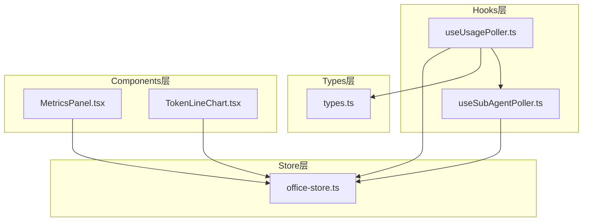
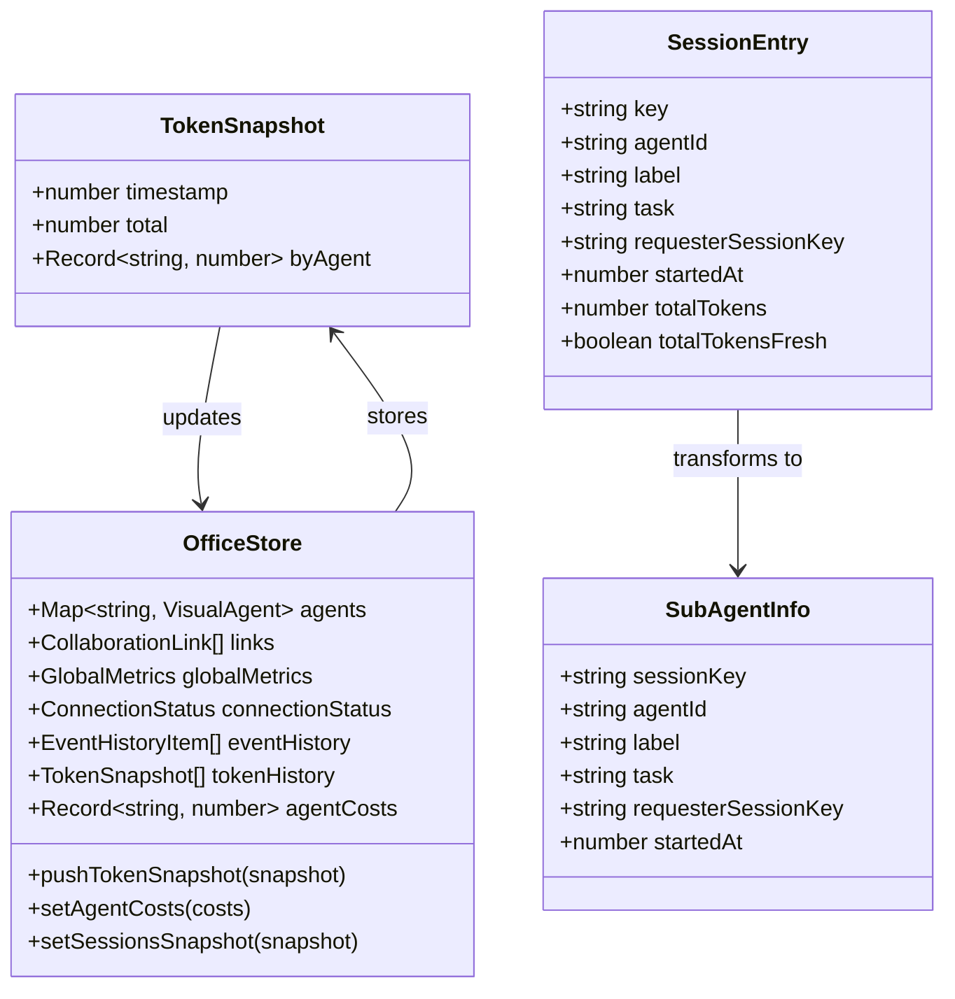
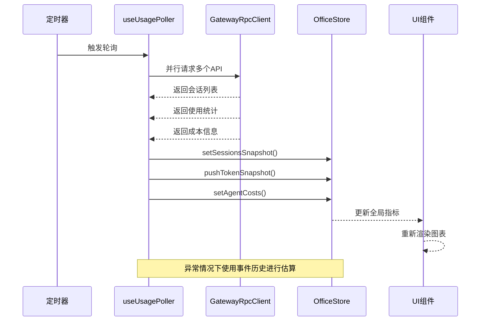
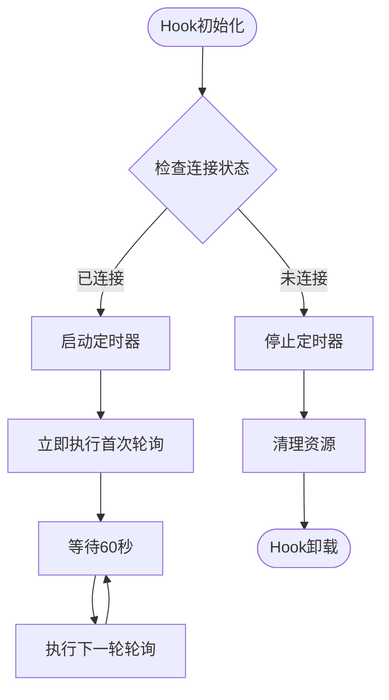
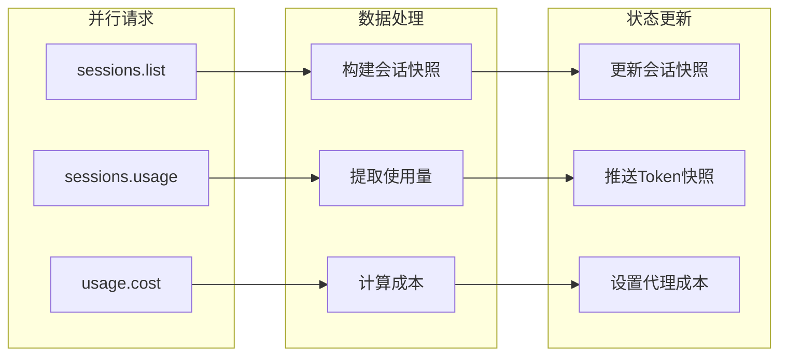
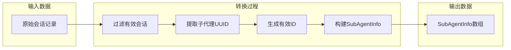
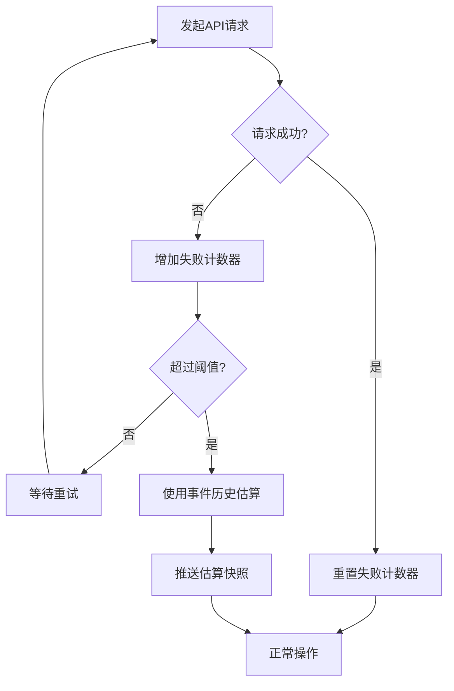
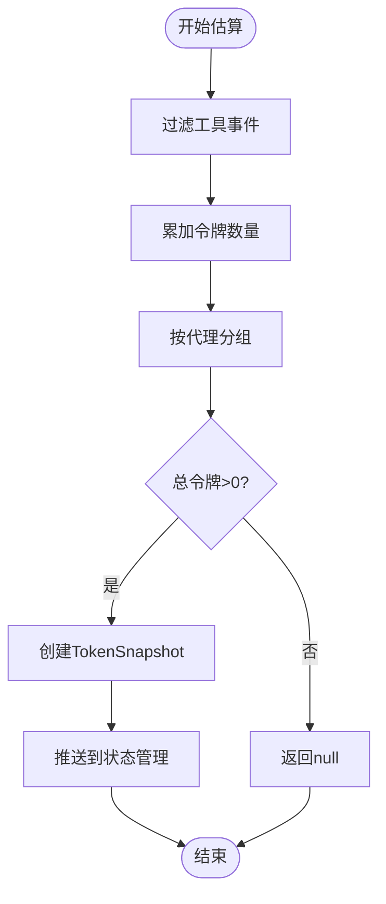
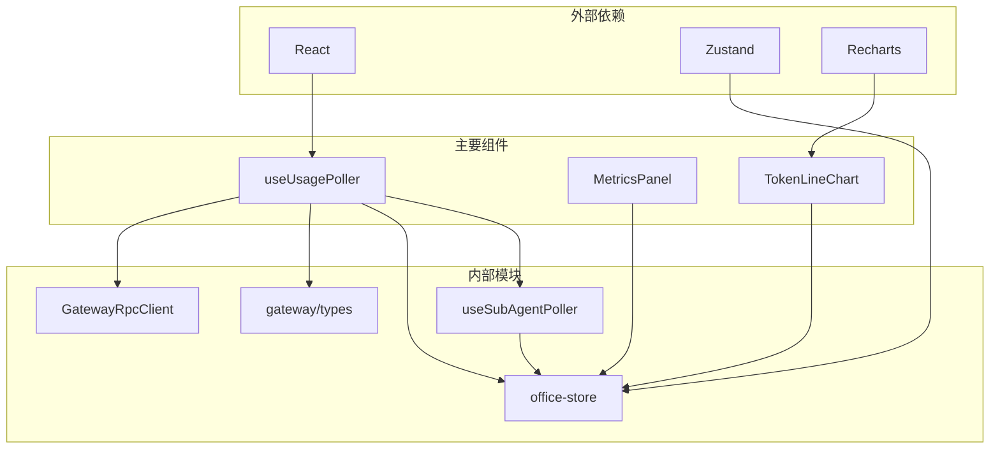
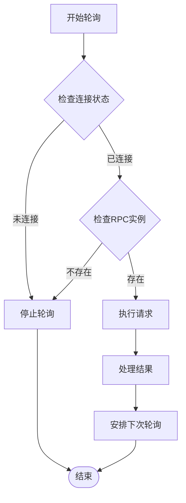

# 使用量轮询Hook

<cite>
**本文档引用的文件**
- [useUsagePoller.ts](file://src/hooks/useUsagePoller.ts)
- [useUsagePoller.test.ts](file://src/hooks/__tests__/useUsagePoller.test.ts)
- [types.ts](file://src/gateway/types.ts)
- [office-store.ts](file://src/store/office-store.ts)
- [useSubAgentPoller.ts](file://src/hooks/useSubAgentPoller.ts)
- [MetricsPanel.tsx](file://src/components/panels/MetricsPanel.tsx)
- [TokenLineChart.tsx](file://src/components/panels/TokenLineChart.tsx)
</cite>

## 目录
1. [简介](#简介)
2. [项目结构](#项目结构)
3. [核心组件](#核心组件)
4. [架构概览](#架构概览)
5. [详细组件分析](#详细组件分析)
6. [依赖关系分析](#依赖关系分析)
7. [性能考虑](#性能考虑)
8. [故障排除指南](#故障排除指南)
9. [结论](#结论)
10. [附录](#附录)

## 简介

useUsagePoller是一个专门设计用于监控和轮询使用量数据的React Hook。该Hook实现了高效的定时任务管理、智能的数据获取策略和完善的错误处理机制，为OpenClaw Office系统提供了实时的使用量统计和成本监控功能。

该Hook的核心功能包括：
- 定时轮询使用量数据（默认60秒间隔）
- 并行获取会话列表、使用统计和成本信息
- 实时更新全局指标和图表展示
- 异常情况下的降级处理和数据估算
- 与Zustand状态管理系统的深度集成

## 项目结构

useUsagePoller位于项目的Hooks目录下，与相关的状态管理和UI组件形成完整的数据流架构：



**图表来源**
- [useUsagePoller.ts:1-191](file://src/hooks/useUsagePoller.ts#L1-L191)
- [office-store.ts:286-370](file://src/store/office-store.ts#L286-L370)

**章节来源**
- [useUsagePoller.ts:1-191](file://src/hooks/useUsagePoller.ts#L1-L191)
- [office-store.ts:1-200](file://src/store/office-store.ts#L1-L200)

## 核心组件

### 主要接口定义

useUsagePoller定义了完整的数据结构和接口规范：



**图表来源**
- [types.ts:280-370](file://src/gateway/types.ts#L280-L370)
- [types.ts:226-238](file://src/gateway/types.ts#L226-L238)
- [office-store.ts:286-370](file://src/store/office-store.ts#L286-L370)

### 关键配置参数

Hook内部定义了重要的配置参数：

| 参数名称 | 默认值 | 用途描述 |
|---------|--------|----------|
| POLL_INTERVAL_MS | 60,000ms | 轮询间隔（1分钟） |
| FAILURE_THRESHOLD | 3次 | 失败阈值，超过此次数启用降级模式 |
| SUB_AGENT_MAX_IDLE_MS | 300,000ms | 子代理最大空闲时间（5分钟） |

**章节来源**
- [useUsagePoller.ts:7-8](file://src/hooks/useUsagePoller.ts#L7-L8)
- [useSubAgentPoller.ts:6](file://src/hooks/useSubAgentPoller.ts#L6)

## 架构概览

useUsagePoller采用分层架构设计，实现了清晰的关注点分离：



**图表来源**
- [useUsagePoller.ts:50-94](file://src/hooks/useUsagePoller.ts#L50-L94)
- [office-store.ts:1233-1252](file://src/store/office-store.ts#L1233-L1252)

## 详细组件分析

### 轮询机制设计

#### 定时任务管理

useUsagePoller实现了智能的定时任务管理，确保在连接状态变化时正确启动和停止轮询：



**图表来源**
- [useUsagePoller.ts:41-105](file://src/hooks/useUsagePoller.ts#L41-L105)

#### 并行数据获取策略

Hook采用Promise.all并行请求多个API端点，显著提升数据获取效率：



**图表来源**
- [useUsagePoller.ts:57-82](file://src/hooks/useUsagePoller.ts#L57-L82)

**章节来源**
- [useUsagePoller.ts:50-94](file://src/hooks/useUsagePoller.ts#L50-L94)

### 数据结构设计

#### TokenSnapshot数据模型

TokenSnapshot是使用量统计的核心数据结构：

| 字段名 | 类型 | 描述 | 示例值 |
|-------|------|------|--------|
| timestamp | number | 时间戳（毫秒） | 1700000000000 |
| total | number | 总使用量 | 15000 |
| byAgent | Record<string, number> | 按代理统计的使用量 | {main: 12000, reviewer: 3000} |

#### 会话数据转换

Hook实现了从原始会话数据到SubAgentInfo的智能转换：



**图表来源**
- [useSubAgentPoller.ts:48-67](file://src/hooks/useSubAgentPoller.ts#L48-L67)

**章节来源**
- [types.ts:280-284](file://src/gateway/types.ts#L280-L284)
- [useSubAgentPoller.ts:48-67](file://src/hooks/useSubAgentPoller.ts#L48-L67)

### 错误处理和降级策略

#### 失败阈值机制

当API调用失败达到阈值时，Hook会自动切换到降级模式：



**图表来源**
- [useUsagePoller.ts:83-93](file://src/hooks/useUsagePoller.ts#L83-L93)

#### 事件历史估算算法

当网络异常时，Hook会基于事件历史记录进行智能估算：



**图表来源**
- [useUsagePoller.ts:166-190](file://src/hooks/useUsagePoller.ts#L166-L190)

**章节来源**
- [useUsagePoller.ts:83-93](file://src/hooks/useUsagePoller.ts#L83-L93)
- [useUsagePoller.ts:166-190](file://src/hooks/useUsagePoller.ts#L166-L190)

## 依赖关系分析

### 组件间依赖关系



**图表来源**
- [useUsagePoller.ts:1-5](file://src/hooks/useUsagePoller.ts#L1-L5)
- [MetricsPanel.tsx:1-16](file://src/components/panels/MetricsPanel.tsx#L1-L16)

### 状态管理集成

useUsagePoller与Zustand状态管理系统的深度集成体现在多个方面：

| 状态字段 | 更新方式 | 数据来源 | 用途 |
|---------|----------|----------|------|
| tokenHistory | pushTokenSnapshot | TokenSnapshot数组 | 图表数据存储 |
| agentCosts | setAgentCosts | 成本映射 | 成本可视化 |
| lastSessionsSnapshot | setSessionsSnapshot | 会话快照 | 子代理管理 |
| globalMetrics | computeMetrics | 综合计算 | 全局指标展示 |

**章节来源**
- [office-store.ts:1233-1252](file://src/store/office-store.ts#L1233-L1252)
- [office-store.ts:1301-1305](file://src/store/office-store.ts#L1301-L1305)

## 性能考虑

### 轮询频率优化

#### 合理的轮询间隔

Hook选择了60秒的轮询间隔，这是在数据实时性和系统负载之间的平衡点：

- **优势**：减少服务器压力，降低网络开销
- **劣势**：数据延迟约1分钟
- **适用场景**：监控面板、趋势分析等不需要实时数据的场景

#### 并行请求优化

通过Promise.all并行执行多个API请求，显著提升了数据获取效率：

```mermaid
graph LR
subgraph "串行请求"
S1[等待S1完成]
S2[S1完成后等待S2]
S3[S2完成后等待S3]
TOTAL[总耗时: S1+S2+S3]
end
subgraph "并行请求"
P1[同时请求S1,S2,S3]
TOTAL2[总耗时: max(S1,S2,S3)]
end
TOTAL --> IMPROVEMENT[性能提升: (S1+S2+S3)/max(S1,S2,S3)]
```

### 缓存机制

#### 内存缓存策略

Hook利用浏览器内存作为缓存层，避免重复计算：

- **tokenHistory**：最多保留30个快照，自动滚动删除旧数据
- **eventHistory**：限制在200条以内，防止内存泄漏
- **会话映射**：通过sessionKeyMap快速查找父代理ID

#### 智能数据过滤

在数据处理阶段就进行过滤，减少不必要的计算：

- 跳过非新鲜的令牌统计
- 过滤无效的会话记录
- 排除不合法的成本数据

**章节来源**
- [office-store.ts:1237-1239](file://src/store/office-store.ts#L1237-L1239)
- [useUsagePoller.ts:112-125](file://src/hooks/useUsagePoller.ts#L112-L125)

### 避免重复请求

#### 连接状态检查

Hook在每次轮询前检查连接状态，避免在断开连接时发送请求：



**图表来源**
- [useUsagePoller.ts:41-48](file://src/hooks/useUsagePoller.ts#L41-L48)

## 故障排除指南

### 常见问题诊断

#### 轮询不生效

**症状**：界面没有更新使用量数据
**可能原因**：
1. 连接状态不是"connected"
2. RPC客户端实例为空
3. 定时器已被清理

**解决方案**：
- 检查连接状态是否为"connected"
- 确保传入的rpcRef引用有效
- 查看控制台是否有错误日志

#### 数据延迟严重

**症状**：使用量数据明显滞后
**可能原因**：
1. 轮询间隔过长
2. 服务器响应慢
3. 网络延迟高

**解决方案**：
- 调整POLL_INTERVAL_MS参数
- 检查服务器性能
- 优化网络连接

#### 成本数据缺失

**症状**：成本统计显示为0或空白
**可能原因**：
1. sessions.usage API返回null
2. usage.cost API返回无效数据
3. 成本数据格式不正确

**解决方案**：
- 检查两个API的可用性
- 验证数据格式符合预期
- 查看错误日志

### 调试技巧

#### 开启详细日志

在开发环境中可以添加调试信息：

```typescript
// 在关键节点添加console.log
console.log('轮询开始:', new Date().toISOString());
console.log('连接状态:', connectionStatus);
console.log('RPC实例:', rpcRef.current ? '存在' : '不存在');
```

#### 性能监控

监控轮询性能的关键指标：

- **轮询间隔**：实际执行时间与期望间隔的差异
- **请求成功率**：API调用的成功率
- **数据处理时间**：从接收数据到更新UI的时间

**章节来源**
- [useUsagePoller.test.ts:168-199](file://src/hooks/__tests__/useUsagePoller.test.ts#L168-L199)

## 结论

useUsagePoller是一个设计精良的使用量监控Hook，它在以下方面表现出色：

### 技术优势

1. **高效的数据获取**：通过并行请求和智能缓存，显著提升性能
2. **稳健的错误处理**：完善的降级机制确保系统稳定性
3. **灵活的配置选项**：可调整的轮询间隔和失败阈值
4. **深度的状态集成**：与Zustand状态管理系统的无缝对接

### 应用价值

- **实时监控**：为运营团队提供准确的使用量数据
- **成本控制**：帮助用户了解和控制AI使用成本
- **趋势分析**：支持长期使用模式的分析和预测
- **异常预警**：通过数据异常及时发现系统问题

### 改进建议

1. **动态轮询调整**：根据系统负载动态调整轮询频率
2. **增量更新**：实现更细粒度的数据更新机制
3. **多源数据融合**：整合更多数据源提供更全面的洞察
4. **性能指标监控**：内置性能监控和告警机制

## 附录

### 使用示例

#### 在监控面板中集成

```typescript
// 在MetricsPanel中使用
function MetricsPanel() {
  const tokenHistory = useOfficeStore((s) => s.tokenHistory);
  
  return (
    <div>
      <TokenLineChart />
      {/* 其他指标卡片 */}
    </div>
  );
}
```

#### 实时数据更新实现

```typescript
// 在组件中订阅状态变化
function UsageDisplay() {
  const tokenHistory = useOfficeStore((s) => s.tokenHistory);
  const globalMetrics = useOfficeStore((s) => s.globalMetrics);
  
  useEffect(() => {
    // 当tokenHistory变化时自动重新渲染
    console.log('最新使用量:', tokenHistory[tokenHistory.length - 1]);
  }, [tokenHistory]);
  
  return (
    <div>
      <div>总令牌: {globalMetrics.totalTokens}</div>
      <div>令牌速率: {globalMetrics.tokenRate}/min</div>
    </div>
  );
}
```

### 最佳实践指南

#### 轮询策略选择

- **高频监控**：15-30秒间隔，适用于实时控制系统
- **常规监控**：60秒间隔，适用于一般监控面板
- **低频监控**：5-10分钟间隔，适用于报表生成

#### 网络开销控制

- 使用HTTP/2或WebSocket以减少连接开销
- 实现请求去重和缓存策略
- 在移动设备上适当延长轮询间隔

#### 异常情况处理

- 设置合理的超时时间和重试机制
- 实现优雅降级，确保基本功能可用
- 提供用户可配置的错误通知