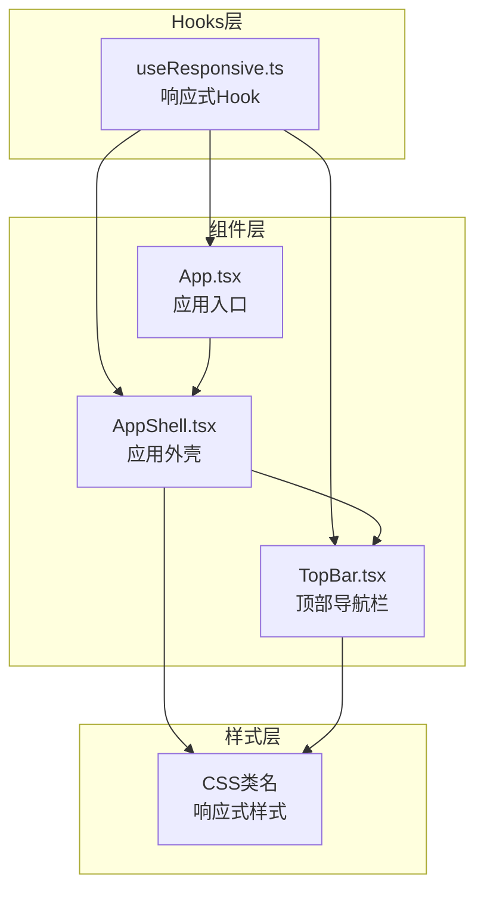
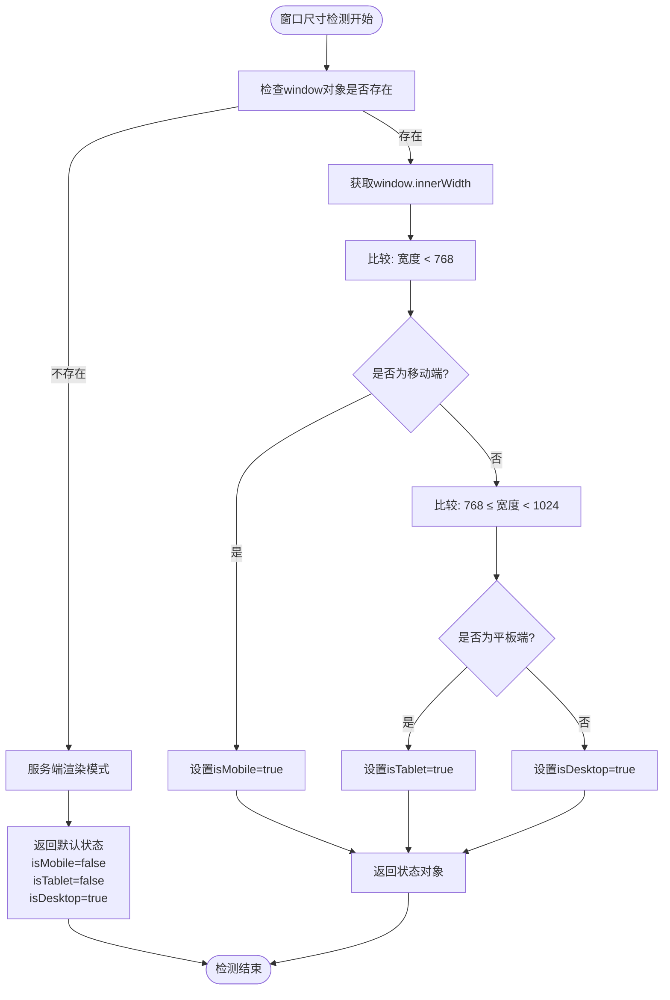
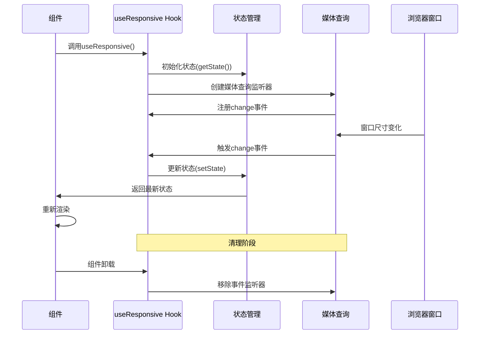
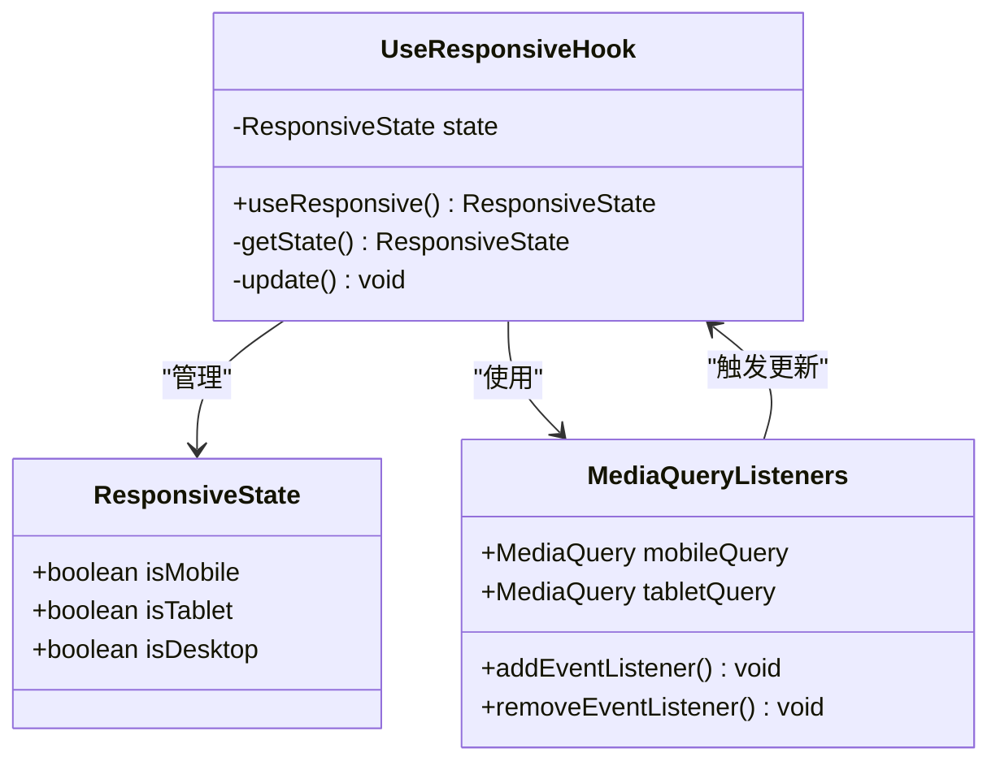
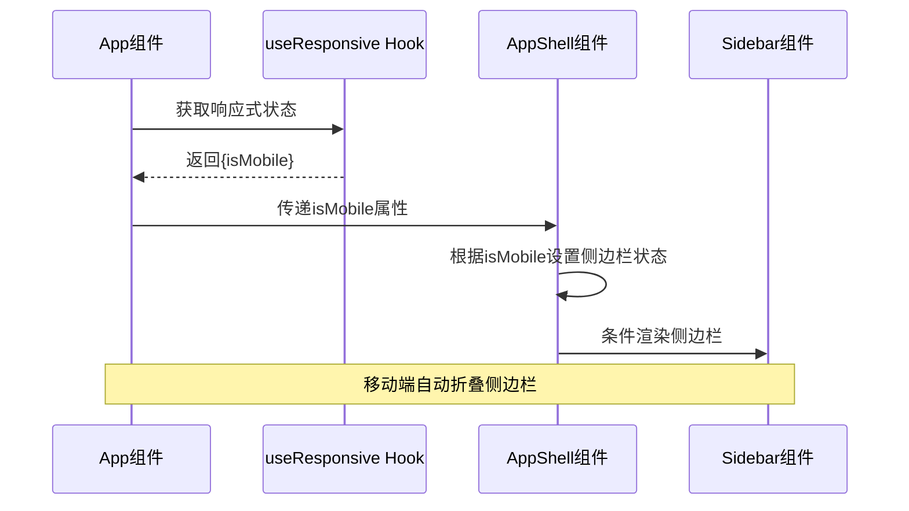
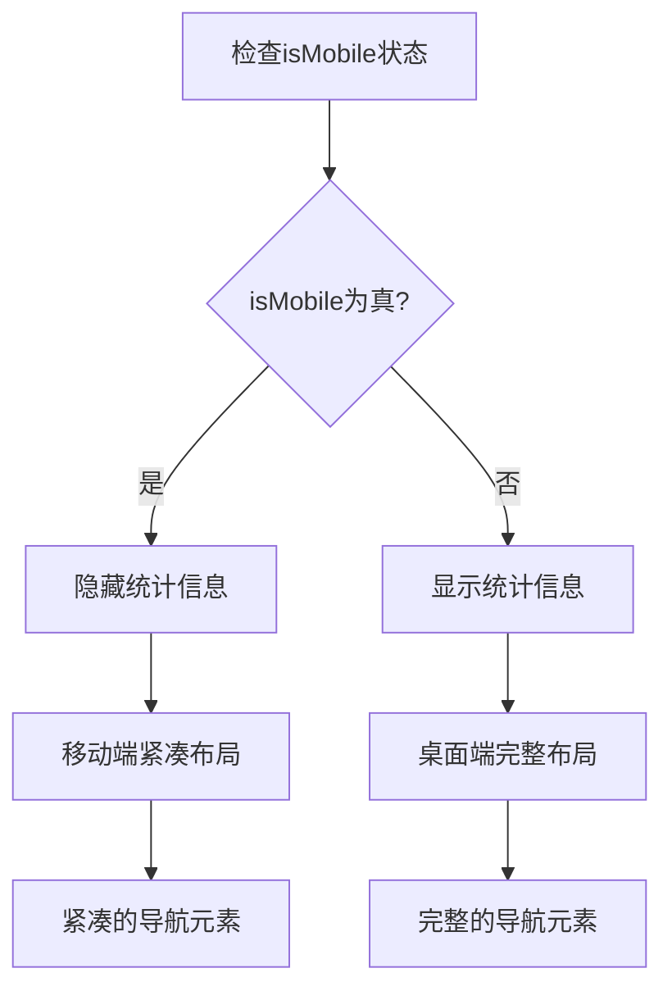
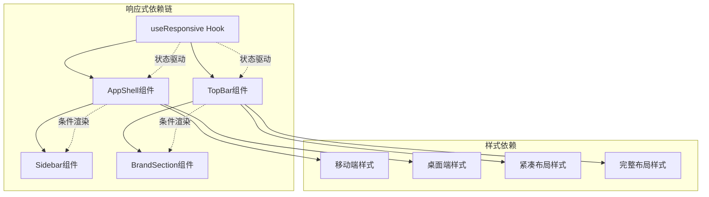
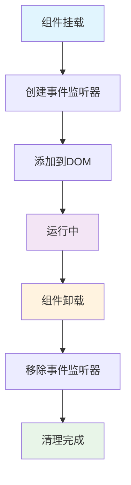
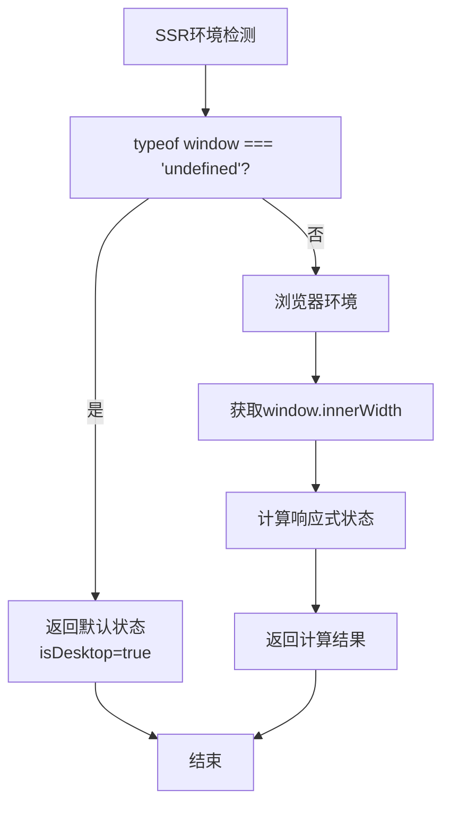

# 响应式设计Hook

<cite>
**本文档引用的文件**
- [useResponsive.ts](file://src/hooks/useResponsive.ts)
- [App.tsx](file://src/App.tsx)
- [AppShell.tsx](file://src/components/layout/AppShell.tsx)
- [TopBar.tsx](file://src/components/layout/TopBar.tsx)
</cite>

## 目录
1. [简介](#简介)
2. [项目结构](#项目结构)
3. [核心组件](#核心组件)
4. [架构概览](#架构概览)
5. [详细组件分析](#详细组件分析)
6. [依赖关系分析](#依赖关系分析)
7. [性能考虑](#性能考虑)
8. [故障排除指南](#故障排除指南)
9. [结论](#结论)
10. [附录](#附录)

## 简介

useResponsive是一个基于媒体查询的响应式设计React Hook，专门用于检测当前设备的屏幕尺寸并提供相应的状态管理。该Hook通过监听浏览器窗口尺寸变化事件，实时更新设备类型状态，为开发者提供简洁直观的响应式开发解决方案。

本Hook采用三段式断点策略（移动端、平板、桌面端），通过单一Hook暴露统一的状态接口，简化了复杂响应式逻辑的实现难度。其设计充分考虑了服务端渲染兼容性和内存泄漏防护，确保在各种运行环境中都能稳定工作。

## 项目结构

useResponsive Hook位于项目的Hooks目录下，作为独立的功能模块提供响应式能力：

**图表来源**
- [useResponsive.ts:1-42](file://src/hooks/useResponsive.ts#L1-L42)
- [App.tsx:16-17](file://src/App.tsx#L16-L17)
- [AppShell.tsx:12-15](file://src/components/layout/AppShell.tsx#L12-L15)
- [TopBar.tsx:21-23](file://src/components/layout/TopBar.tsx#L21-L23)

**章节来源**
- [useResponsive.ts:1-42](file://src/hooks/useResponsive.ts#L1-L42)
- [App.tsx:76-124](file://src/App.tsx#L76-L124)

## 核心组件

### 状态接口定义

useResponsive Hook返回一个包含三个布尔值的状态对象，每个属性代表不同的设备类型：

| 属性名称 | 类型 | 判断标准 | 使用场景 |
|---------|------|----------|----------|
| isMobile | boolean | 窗口宽度 < 768px | 移动设备界面布局、触摸交互优化 |
| isTablet | boolean | 768px ≤ 窗口宽度 < 1024px | 平板设备适配、中等屏幕显示 |
| isDesktop | boolean | 窗口宽度 ≥ 1024px | 桌面设备完整功能展示 |

### 断点策略

系统采用经典的三段式断点策略，基于业界标准的设备尺寸划分：

**图表来源**
- [useResponsive.ts:31-41](file://src/hooks/useResponsive.ts#L31-L41)

**章节来源**
- [useResponsive.ts:3-7](file://src/hooks/useResponsive.ts#L3-L7)
- [useResponsive.ts:31-41](file://src/hooks/useResponsive.ts#L31-L41)

## 架构概览

useResponsive Hook采用观察者模式与状态管理模式相结合的设计：

**图表来源**
- [useResponsive.ts:9-29](file://src/hooks/useResponsive.ts#L9-L29)

### 生命周期管理

Hook实现了完整的生命周期管理机制：

1. **初始化阶段**：调用getState()函数获取初始状态
2. **挂载阶段**：创建媒体查询监听器并注册change事件
3. **运行阶段**：监听窗口尺寸变化，实时更新状态
4. **卸载阶段**：清理事件监听器，防止内存泄漏

**章节来源**
- [useResponsive.ts:9-29](file://src/hooks/useResponsive.ts#L9-L29)

## 详细组件分析

### Hook实现原理

#### 状态管理逻辑

Hook内部使用React的useState和useEffect来管理响应式状态：

**图表来源**
- [useResponsive.ts:3-7](file://src/hooks/useResponsive.ts#L3-L7)
- [useResponsive.ts:9-29](file://src/hooks/useResponsive.ts#L9-L29)

#### 媒体查询机制

Hook使用原生的matchMedia API来监听设备断点变化：

| 媒体查询表达式 | 断点范围 | 监听目标 | 触发条件 |
|---------------|----------|----------|----------|
| `(max-width: 767px)` | 0 - 767px | 移动端断点 | 窗口宽度小于768px时 |
| `(min-width: 768px) and (max-width: 1023px)` | 768 - 1023px | 平板端断点 | 窗口宽度在768-1024px之间 |

**章节来源**
- [useResponsive.ts:12-26](file://src/hooks/useResponsive.ts#L12-L26)

### 实际应用场景

#### 应用外壳中的使用

在App.tsx中，useResponsive Hook被用于控制应用的整体布局行为：

**图表来源**
- [App.tsx:87-108](file://src/App.tsx#L87-L108)
- [AppShell.tsx:26-30](file://src/components/layout/AppShell.tsx#L26-L30)

#### 顶部导航栏的响应式处理

在TopBar.tsx中，响应式状态用于控制不同屏幕尺寸下的UI元素显示：

**图表来源**
- [TopBar.tsx:75-90](file://src/components/layout/TopBar.tsx#L75-L90)

**章节来源**
- [App.tsx:87-108](file://src/App.tsx#L87-L108)
- [AppShell.tsx:26-30](file://src/components/layout/AppShell.tsx#L26-L30)
- [TopBar.tsx:75-90](file://src/components/layout/TopBar.tsx#L75-L90)

## 依赖关系分析

### 组件间依赖关系

**图表来源**
- [useResponsive.ts:9-29](file://src/hooks/useResponsive.ts#L9-L29)
- [AppShell.tsx:49-78](file://src/components/layout/AppShell.tsx#L49-L78)
- [TopBar.tsx:75-90](file://src/components/layout/TopBar.tsx#L75-L90)

### 外部依赖分析

Hook的主要外部依赖包括：

1. **React核心API**：useState、useEffect用于状态管理和副作用处理
2. **浏览器API**：matchMedia用于媒体查询监听，window用于获取屏幕尺寸
3. **TypeScript类型系统**：定义清晰的类型接口确保类型安全

**章节来源**
- [useResponsive.ts:1-42](file://src/hooks/useResponsive.ts#L1-L42)

## 性能考虑

### 内存泄漏防护

Hook通过useEffect的清理函数确保事件监听器能够正确移除：

**图表来源**
- [useResponsive.ts:22-25](file://src/hooks/useResponsive.ts#L22-L25)

### 服务端渲染兼容性

Hook实现了完整的SSR支持，避免在服务器端访问window对象：

**图表来源**
- [useResponsive.ts:32-34](file://src/hooks/useResponsive.ts#L32-L34)

**章节来源**
- [useResponsive.ts:22-25](file://src/hooks/useResponsive.ts#L22-L25)
- [useResponsive.ts:32-34](file://src/hooks/useResponsive.ts#L32-L34)

## 故障排除指南

### 常见问题及解决方案

#### 1. 状态更新不及时

**问题描述**：窗口尺寸变化后状态没有立即更新

**解决方案**：
- 确保媒体查询监听器正确注册
- 检查update函数的调用时机
- 验证setState的调用频率

#### 2. 内存泄漏问题

**问题描述**：组件卸载后仍存在事件监听器

**解决方案**：
- 确保useEffect清理函数正确执行
- 检查removeEventListener的调用
- 验证监听器移除的完整性

#### 3. 服务端渲染错误

**问题描述**：SSR环境下访问window对象失败

**解决方案**：
- 确保Hook在客户端环境运行
- 验证typeof window检查逻辑
- 检查SSR环境下的默认状态处理

**章节来源**
- [useResponsive.ts:22-25](file://src/hooks/useResponsive.ts#L22-L25)
- [useResponsive.ts:32-34](file://src/hooks/useResponsive.ts#L32-L34)

## 结论

useResponsive Hook提供了一个简洁、高效且可靠的响应式设计解决方案。其设计特点包括：

1. **简单易用**：单一Hook暴露统一的状态接口
2. **性能优秀**：基于媒体查询的原生监听机制
3. **兼容性强**：完善的SSR支持和内存泄漏防护
4. **扩展灵活**：可根据需求调整断点策略

该Hook为OpenClaw Office项目提供了坚实的响应式基础，支持从移动端到桌面端的完整用户体验覆盖。

## 附录

### 使用最佳实践

#### 1. 断点配置优化

- **移动端断点**：767px以下适合触摸交互优化
- **平板断点**：768-1023px适合中等屏幕适配
- **桌面断点**：1024px以上适合完整功能展示

#### 2. 性能优化建议

- 避免在每次渲染中重复创建媒体查询
- 合理使用防抖机制减少状态更新频率
- 在不需要时移除不必要的事件监听器

#### 3. 与其他响应式方案对比

| 方案类型 | 优点 | 缺点 | 适用场景 |
|---------|------|------|----------|
| 媒体查询Hook | 简单易用、性能好 | 需要自定义断点 | 中小型项目 |
| CSS媒体查询 | 全局样式控制 | JS控制困难 | 样式为主的项目 |
| 第三方库 | 功能丰富 | 体积大、学习成本高 | 复杂响应式需求 |