# 网关连接管理Hook

<cite>
**本文档引用的文件**
- [useGatewayConnection.ts](file://src/hooks/useGatewayConnection.ts)
- [ws-client.ts](file://src/gateway/ws-client.ts)
- [rpc-client.ts](file://src/gateway/rpc-client.ts)
- [ws-adapter.ts](file://src/gateway/ws-adapter.ts)
- [types.ts](file://src/gateway/types.ts)
- [office-store.ts](file://src/store/office-store.ts)
- [auth-store.ts](file://src/store/auth-store.ts)
- [auth-credentials.ts](file://src/gateway/auth-credentials.ts)
- [App.tsx](file://src/App.tsx)
- [ws-client.test.ts](file://src/gateway/__tests__/ws-client.test.ts)
- [rpc-client.test.ts](file://src/gateway/__tests__/rpc-client.test.ts)
</cite>

## 更新摘要
**变更内容**
- 增强了认证阶段的错误处理逻辑
- 新增了引用机制来跟踪当前认证状态
- 确保在认证阶段的连接错误能正确标记认证失败并返回登录表单
- 改进了用户体验，防止UI卡在"连接中..."状态

## 目录
1. [简介](#简介)
2. [项目结构](#项目结构)
3. [核心组件](#核心组件)
4. [架构概览](#架构概览)
5. [详细组件分析](#详细组件分析)
6. [依赖关系分析](#依赖关系分析)
7. [性能考虑](#性能考虑)
8. [故障排除指南](#故障排除指南)
9. [结论](#结论)
10. [附录](#附录)

## 简介

useGatewayConnection是一个专门设计的React Hook，用于管理OpenClaw网关的WebSocket连接。该Hook提供了完整的连接生命周期管理，包括自动重连机制、状态监控、事件处理和配置同步等功能。

该Hook的核心目标是为前端应用提供一个可靠的网关连接抽象层，确保与OpenClaw Gateway的稳定通信，同时为上层组件提供简洁的使用接口。

**更新** 本次更新增强了认证阶段的错误处理机制，通过引入引用机制确保在认证过程中出现的连接错误能够正确识别并标记为认证失败，从而引导用户回到登录表单进行重新认证。

## 项目结构

OpenClaw-Office项目采用模块化的架构设计，主要分为以下几个层次：

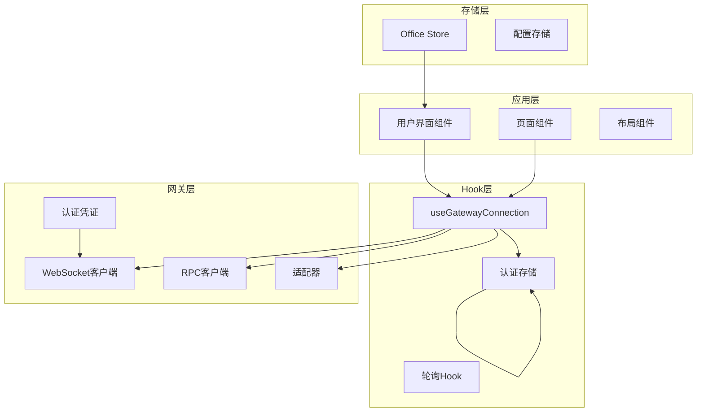

**图表来源**
- [useGatewayConnection.ts:1-299](file://src/hooks/useGatewayConnection.ts#L1-L299)
- [ws-client.ts:1-333](file://src/gateway/ws-client.ts#L1-L333)
- [rpc-client.ts:1-63](file://src/gateway/rpc-client.ts#L1-L63)
- [auth-store.ts:1-100](file://src/store/auth-store.ts#L1-L100)

**章节来源**
- [useGatewayConnection.ts:1-299](file://src/hooks/useGatewayConnection.ts#L1-L299)
- [App.tsx:76-124](file://src/App.tsx#L76-L124)

## 核心组件

### 连接状态管理

useGatewayConnection提供了完整的连接状态管理机制，支持以下状态：

- **connecting**: 正在建立连接
- **connected**: 连接已建立
- **reconnecting**: 正在重连
- **disconnected**: 连接已断开
- **error**: 连接发生错误

### 自动重连机制

系统实现了指数退避重连算法，具有以下特性：

- 最大重连尝试次数：20次
- 基础延迟：1秒
- 最大延迟：30秒
- 随机抖动：±1秒
- 断线检测：基于WebSocket关闭事件

### 引用机制增强的认证状态跟踪

**新增** 为了准确区分认证阶段和已认证后的连接错误，Hook引入了引用机制来跟踪当前认证状态：

- `authStatusRef`: 使用`useRef`创建的引用，保持对当前认证状态的实时访问
- **认证阶段保护**: 只有在"authenticating"阶段发生的错误才会被标记为认证失败
- **状态同步**: 每个渲染周期都会更新引用中的认证状态，确保回调函数能获取到最新的状态

### 事件处理系统

Hook集成了事件节流机制，有效处理高频率事件：

- 实时事件：立即处理
- 批量事件：合并处理
- 事件缓存：维护代理名称映射

**章节来源**
- [useGatewayConnection.ts:56-63](file://src/hooks/useGatewayConnection.ts#L56-L63)
- [useGatewayConnection.ts:154-166](file://src/hooks/useGatewayConnection.ts#L154-L166)
- [ws-client.ts:13-16](file://src/gateway/ws-client.ts#L13-L16)
- [ws-client.ts:270-288](file://src/gateway/ws-client.ts#L270-L288)

## 架构概览

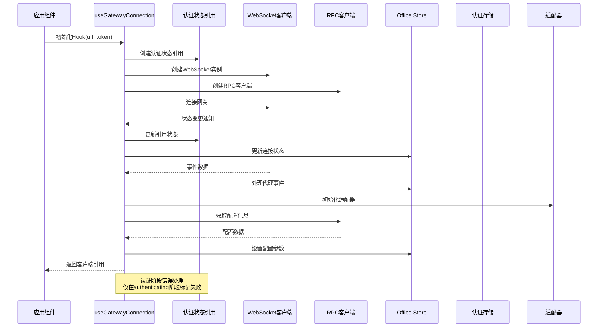

**图表来源**
- [useGatewayConnection.ts:42-212](file://src/hooks/useGatewayConnection.ts#L42-L212)
- [ws-client.ts:60-130](file://src/gateway/ws-client.ts#L60-L130)
- [rpc-client.ts:20-62](file://src/gateway/rpc-client.ts#L20-L62)

## 详细组件分析

### useGatewayConnection Hook实现

#### 核心功能架构

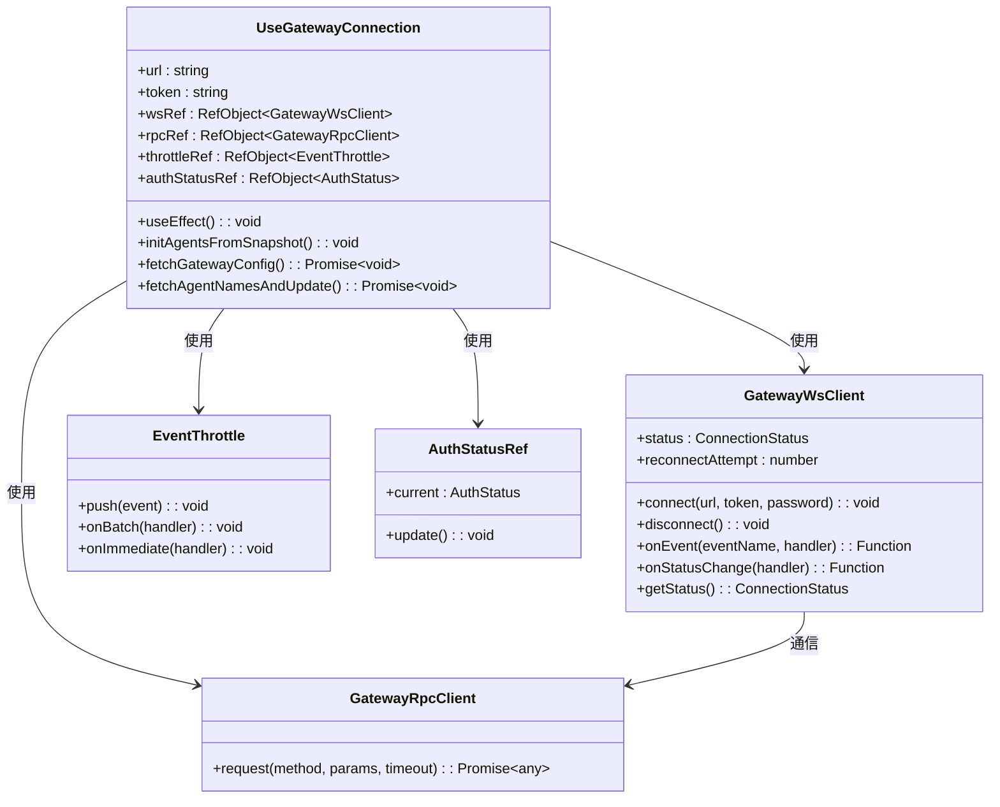

**图表来源**
- [useGatewayConnection.ts:42-212](file://src/hooks/useGatewayConnection.ts#L42-L212)
- [ws-client.ts:22-333](file://src/gateway/ws-client.ts#L22-L333)
- [rpc-client.ts:17-63](file://src/gateway/rpc-client.ts#L17-L63)

#### 连接生命周期管理

Hook的连接生命周期包含以下关键阶段：

1. **初始化阶段**：创建WebSocket和RPC客户端实例，初始化认证状态引用
2. **认证阶段**：处理连接挑战和设备身份验证，使用引用机制跟踪认证状态
3. **配置同步**：获取并应用网关配置
4. **事件监听**：注册事件处理器和状态监听器，实现精确的错误处理
5. **清理阶段**：组件卸载时的资源释放

#### 增强的事件处理流程

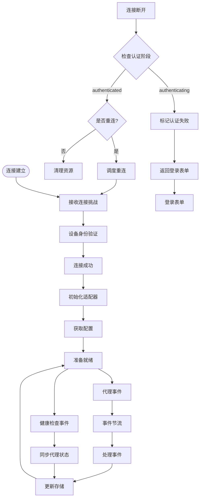

**图表来源**
- [useGatewayConnection.ts:141-166](file://src/hooks/useGatewayConnection.ts#L141-L166)
- [ws-client.ts:149-181](file://src/gateway/ws-client.ts#L149-L181)

**章节来源**
- [useGatewayConnection.ts:36-151](file://src/hooks/useGatewayConnection.ts#L36-L151)
- [ws-client.ts:104-130](file://src/gateway/ws-client.ts#L104-L130)

### WebSocket客户端实现

#### 连接状态管理

GatewayWsClient实现了完整的连接状态管理：

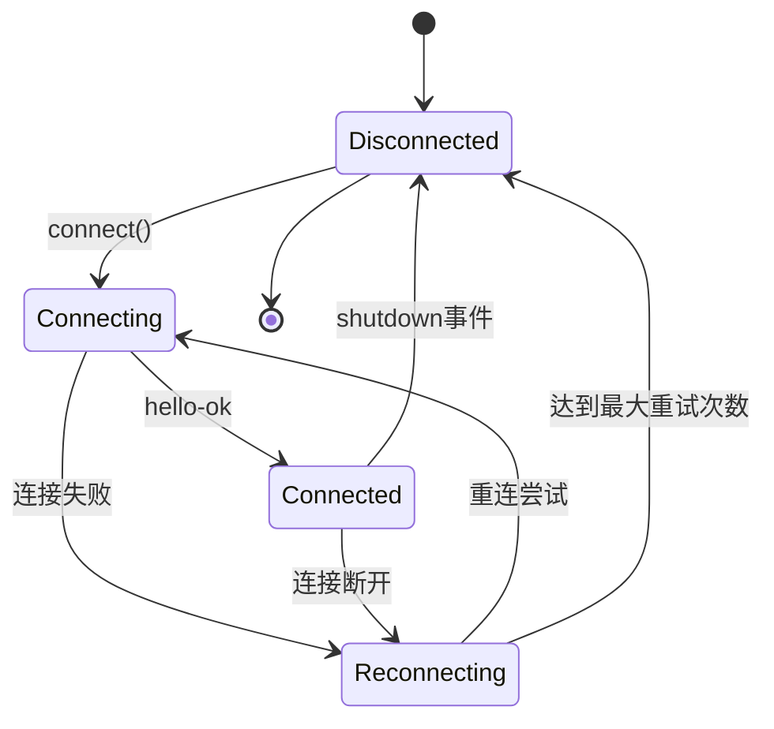

**图表来源**
- [ws-client.ts:26-58](file://src/gateway/ws-client.ts#L26-L58)
- [ws-client.ts:270-288](file://src/gateway/ws-client.ts#L270-L288)

#### 设备身份验证

系统支持两种认证模式：

1. **令牌认证**：使用提供的访问令牌
2. **设备身份认证**：在安全上下文中使用设备密钥对

设备身份验证仅在满足以下条件时启用：
- 浏览器支持WebCrypto API
- 页面运行在HTTPS环境下
- 用户代理支持必要的加密功能

**章节来源**
- [ws-client.ts:199-260](file://src/gateway/ws-client.ts#L199-L260)
- [ws-client.ts:222-252](file://src/gateway/ws-client.ts#L222-L252)

### RPC客户端实现

#### 请求响应机制

GatewayRpcClient实现了基于WebSocket的RPC调用：

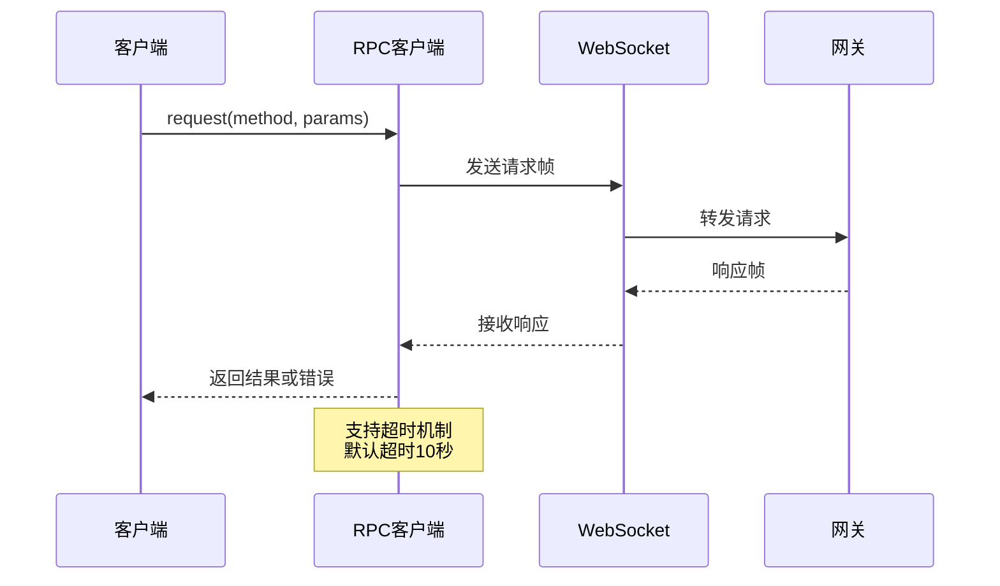

**图表来源**
- [rpc-client.ts:20-62](file://src/gateway/rpc-client.ts#L20-L62)

#### 错误处理策略

RPC客户端提供统一的错误处理：

- **连接错误**：NOT_CONNECTED - WebSocket未连接
- **超时错误**：TIMEOUT - 请求超时
- **业务错误**：从网关返回的具体错误代码和消息

**章节来源**
- [rpc-client.ts:7-15](file://src/gateway/rpc-client.ts#L7-L15)
- [rpc-client.ts:20-62](file://src/gateway/rpc-client.ts#L20-L62)

### 适配器模式实现

#### 事件适配器

WsAdapter实现了适配器模式，将WebSocket事件转换为统一的事件格式：

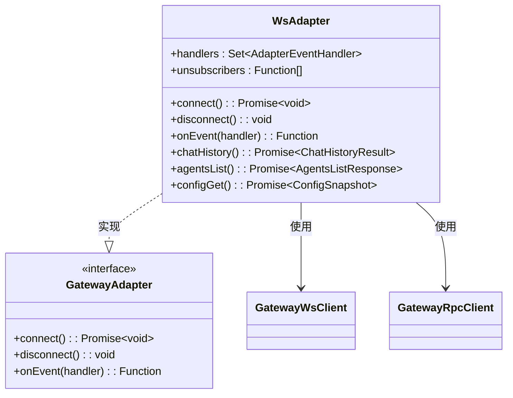

**图表来源**
- [ws-adapter.ts:40-83](file://src/gateway/ws-adapter.ts#L40-L83)
- [ws-adapter.ts:39-38](file://src/gateway/ws-adapter.ts#L39-L38)

**章节来源**
- [ws-adapter.ts:49-68](file://src/gateway/ws-adapter.ts#L49-L68)
- [ws-adapter.ts:39-38](file://src/gateway/ws-adapter.ts#L39-L38)

### 增强的认证状态管理

**新增** 认证状态引用机制确保了精确的错误分类处理：

#### 认证状态引用实现

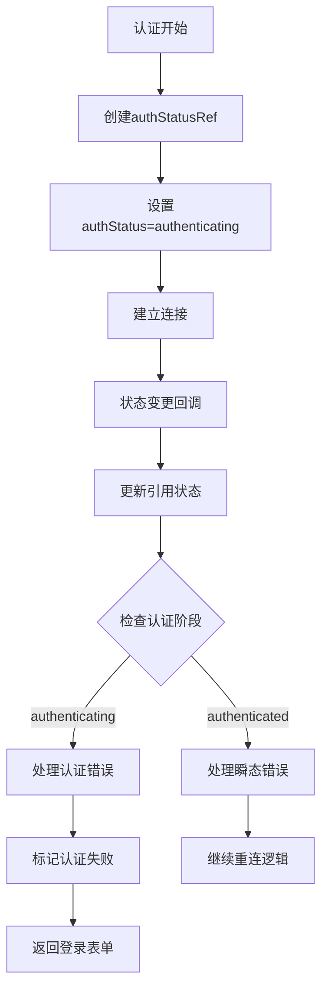

**图表来源**
- [useGatewayConnection.ts:56-63](file://src/hooks/useGatewayConnection.ts#L56-L63)
- [useGatewayConnection.ts:154-166](file://src/hooks/useGatewayConnection.ts#L154-L166)

#### 认证错误分类处理

系统实现了精确的认证错误分类：

1. **认证错误**：只有在"authenticating"阶段发生的错误才会被标记为认证失败
2. **瞬态网络错误**：已认证后的连接错误会被视为瞬态错误，继续重连逻辑
3. **错误信息脱敏**：敏感信息会被脱敏处理，保护用户隐私

**章节来源**
- [useGatewayConnection.ts:56-63](file://src/hooks/useGatewayConnection.ts#L56-L63)
- [useGatewayConnection.ts:154-166](file://src/hooks/useGatewayConnection.ts#L154-L166)
- [auth-store.ts:81-86](file://src/store/auth-store.ts#L81-L86)

## 依赖关系分析

### 组件耦合度分析

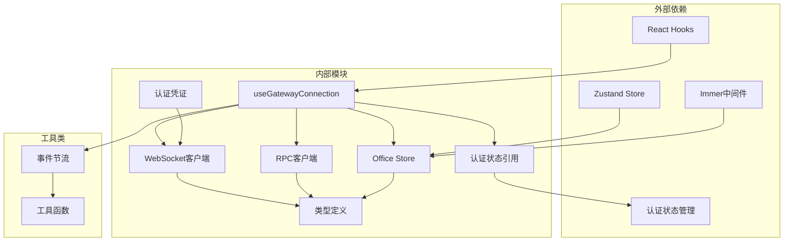

**图表来源**
- [useGatewayConnection.ts:1-16](file://src/hooks/useGatewayConnection.ts#L1-L16)
- [office-store.ts:1-8](file://src/store/office-store.ts#L1-L8)
- [auth-store.ts:1-100](file://src/store/auth-store.ts#L1-L100)

### 关键依赖关系

1. **Hook到客户端**：useGatewayConnection直接依赖WebSocket和RPC客户端
2. **Hook到认证状态引用**：新增的认证状态引用机制提供实时状态访问
3. **客户端到类型系统**：所有客户端都严格遵循类型定义
4. **Hook到存储**：通过Zustand状态管理连接状态和代理数据
5. **适配器到客户端**：适配器包装底层客户端以提供统一接口
6. **认证凭证到客户端**：认证凭证系统为客户端提供错误分类支持

**章节来源**
- [useGatewayConnection.ts:1-16](file://src/hooks/useGatewayConnection.ts#L1-L16)
- [office-store.ts:217-370](file://src/store/office-store.ts#L217-L370)

## 性能考虑

### 事件处理优化

系统采用了多种性能优化策略：

1. **事件节流**：批量处理高频事件，减少渲染压力
2. **内存管理**：及时清理事件处理器和定时器
3. **连接池**：复用WebSocket连接，避免频繁重建
4. **懒加载**：按需加载适配器和配置信息
5. **引用优化**：使用useRef避免不必要的重渲染

### 内存泄漏防护

Hook实现了完整的清理机制：

- 组件卸载时自动清理WebSocket连接
- 移除所有事件监听器
- 清空定时器引用
- 释放适配器资源
- 清理认证状态引用

**章节来源**
- [useGatewayConnection.ts:128-134](file://src/hooks/useGatewayConnection.ts#L128-L134)
- [ws-client.ts:68-77](file://src/gateway/ws-client.ts#L68-L77)

## 故障排除指南

### 常见连接问题诊断

#### 连接失败排查

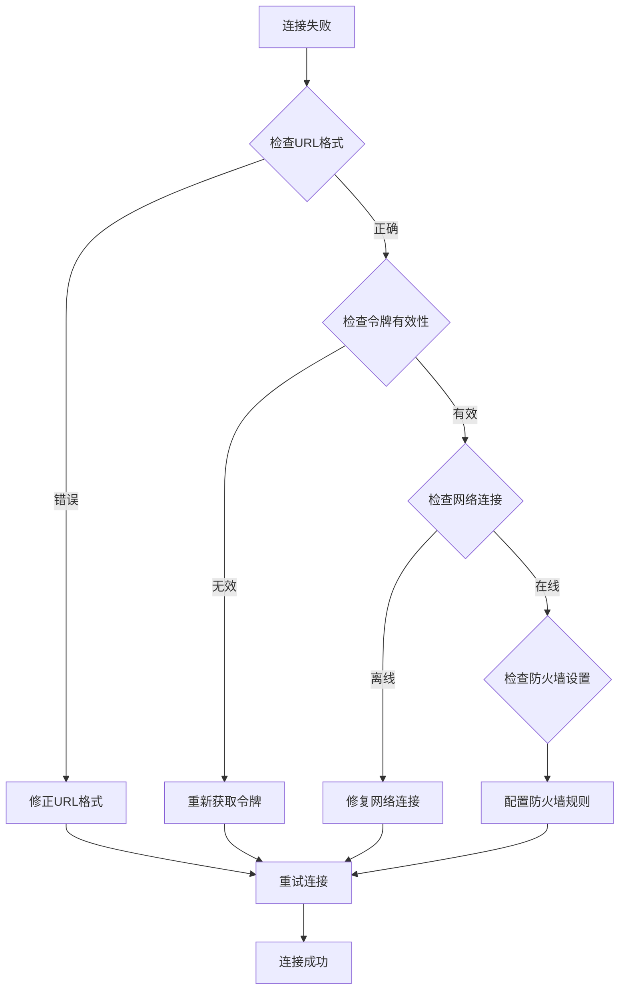

#### 重连机制问题

当遇到重连问题时，可以检查：

1. **重连计数**：确认是否达到最大重试次数
2. **延迟计算**：验证指数退避算法是否正常工作
3. **网络状态**：检查网络连接稳定性
4. **服务器状态**：确认网关服务正常运行

### 增强的错误处理最佳实践

#### 错误分类处理

系统将错误分为以下几类：

1. **网络错误**：连接中断、DNS解析失败
2. **认证错误**：令牌过期、权限不足、URL错误
3. **协议错误**：版本不兼容、消息格式错误
4. **业务错误**：网关返回的具体业务异常

**更新** 新增了认证阶段的精确错误分类：

- **认证阶段错误**：在"authenticating"状态下发生的任何错误都会被标记为认证失败
- **已认证后错误**：在"authenticated"状态下发生的错误被视为瞬态网络错误
- **错误信息脱敏**：敏感信息会被自动脱敏处理

#### 用户友好提示策略

针对不同类型的错误，提供相应的用户提示：

- **认证错误**：显示"认证失败"等明确提示，引导用户检查凭据
- **网络错误**：显示"网络连接异常"等提示，建议检查网络设置
- **配置错误**：引导用户检查配置设置
- **权限错误**：提供权限申请或联系管理员的指引

**章节来源**
- [ws-client.ts:194-196](file://src/gateway/ws-client.ts#L194-L196)
- [rpc-client.ts:41-48](file://src/gateway/rpc-client.ts#L41-L48)
- [auth-credentials.ts:90-101](file://src/gateway/auth-credentials.ts#L90-L101)

### 性能优化建议

#### 网络环境优化

1. **连接池优化**：合理设置连接数量，避免过度连接
2. **心跳机制**：配置合适的保活间隔
3. **压缩传输**：启用WebSocket压缩以减少带宽占用
4. **缓存策略**：利用快照数据减少重复请求

#### 内存优化

1. **事件清理**：定期清理不再使用的事件处理器
2. **定时器管理**：及时清除过期的定时器
3. **对象复用**：复用频繁创建的对象实例
4. **垃圾回收**：合理安排大型对象的销毁时机

## 结论

useGatewayConnection Hook为OpenClaw-Office提供了强大而可靠的网关连接管理能力。通过实现完整的连接生命周期管理、智能的自动重连机制和高效的事件处理系统，该Hook确保了前端应用与网关服务的稳定通信。

**更新** 本次更新的关键改进包括：

1. **增强的认证错误处理**：通过引用机制确保认证阶段的错误能正确识别和处理
2. **改进的用户体验**：防止UI卡在"连接中..."状态，及时引导用户回到登录表单
3. **精确的错误分类**：区分认证错误和瞬态网络错误，提供更准确的错误处理
4. **更好的安全性**：敏感信息自动脱敏，保护用户隐私

该实现的关键优势包括：

1. **可靠性**：完善的错误处理和重连机制
2. **性能**：事件节流和内存优化策略
3. **可维护性**：清晰的架构设计和模块化实现
4. **扩展性**：适配器模式支持灵活的功能扩展
5. **用户体验**：精确的错误处理和友好的用户提示

通过遵循本文档的使用指南和最佳实践，开发者可以充分利用该Hook的强大功能，构建高性能的网关连接应用。

## 附录

### 使用示例

#### 基本使用方式

```typescript
// 在组件中使用
const { wsClient, rpcClient } = useGatewayConnection({
  url: gatewayUrl,
  token: gatewayToken
});

// 使用WebSocket客户端
wsClient.current?.send({ /* 消息数据 */ });

// 使用RPC客户端
try {
  const result = await rpcClient.current?.request('agents.list');
} catch (error) {
  // 处理错误
}
```

#### 连接状态UI反馈

```typescript
// 监听连接状态变化
const connectionStatus = useOfficeStore(state => state.connectionStatus);
const connectionError = useOfficeStore(state => state.connectionError);

// 根据状态渲染不同的UI
return (
  <div className={`connection-status ${connectionStatus}`}>
    {connectionStatus === 'connected' && '✓ 已连接'}
    {connectionStatus === 'connecting' && '↻ 连接中...'}
    {connectionStatus === 'reconnecting' && '↻ 重连中...'}
    {connectionStatus === 'disconnected' && '✗ 已断开'}
    {connectionStatus === 'error' && `✗ 错误: ${connectionError}`}
  </div>
);
```

### 配置选项

#### 连接参数

| 参数名 | 类型 | 必需 | 描述 |
|--------|------|------|------|
| url | string | 是 | 网关WebSocket地址 |
| token | string | 否 | 访问令牌 |

#### 重连配置

| 配置项 | 默认值 | 描述 |
|--------|--------|------|
| 最大重连次数 | 20次 | 达到此次数后停止重连 |
| 基础延迟 | 1000ms | 指数退避的基础延迟 |
| 最大延迟 | 30000ms | 重连延迟的最大值 |
| 随机抖动 | ±1000ms | 防止同步重连的随机延迟 |

### 认证状态管理

#### 认证状态类型

| 状态 | 描述 | 行为 |
|------|------|------|
| unauthenticated | 未认证 | 允许连接尝试，显示登录表单 |
| authenticating | 认证中 | 阻止连接尝试，显示加载状态 |
| authenticated | 已认证 | 允许连接，显示主界面 |

#### 错误处理流程

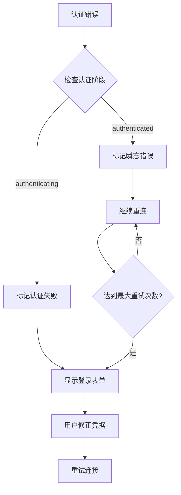