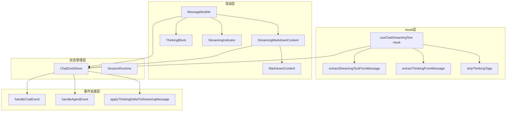
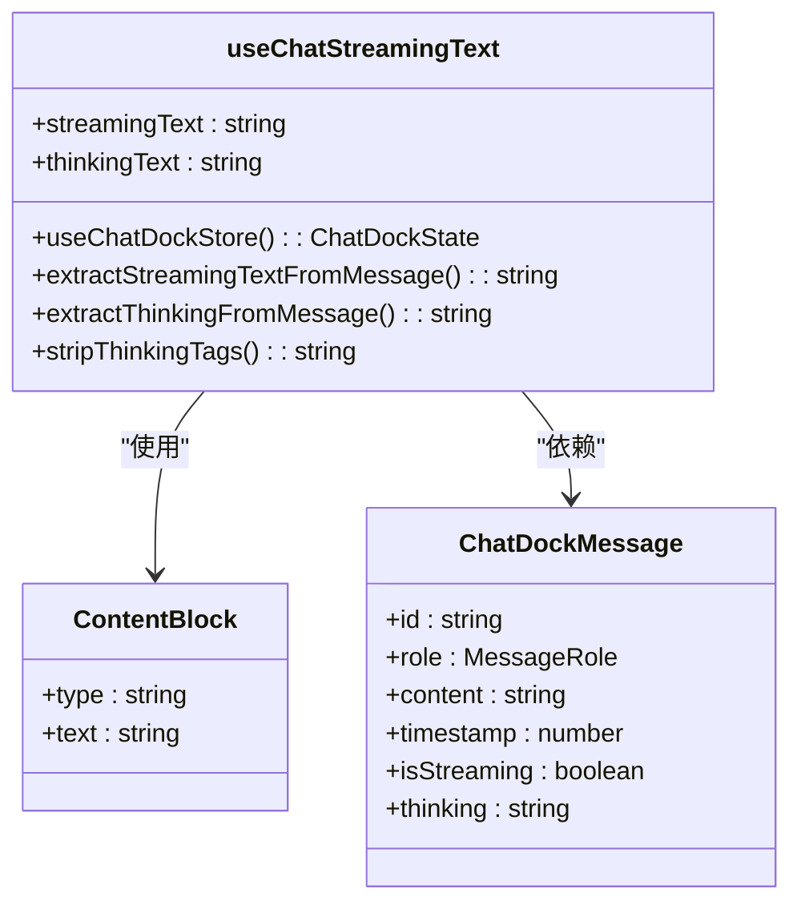
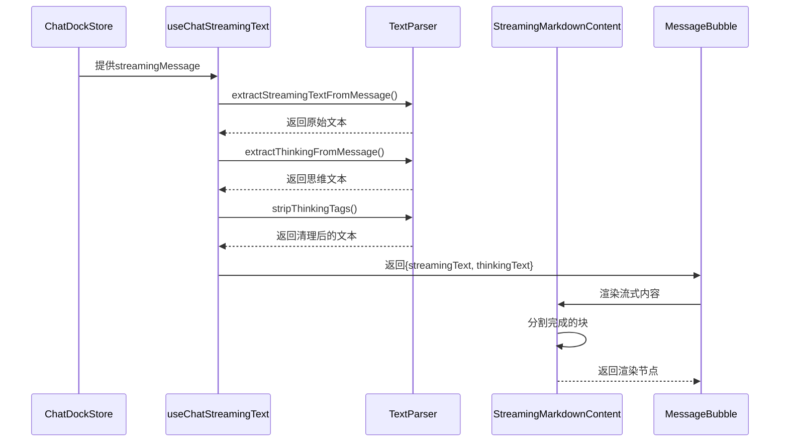
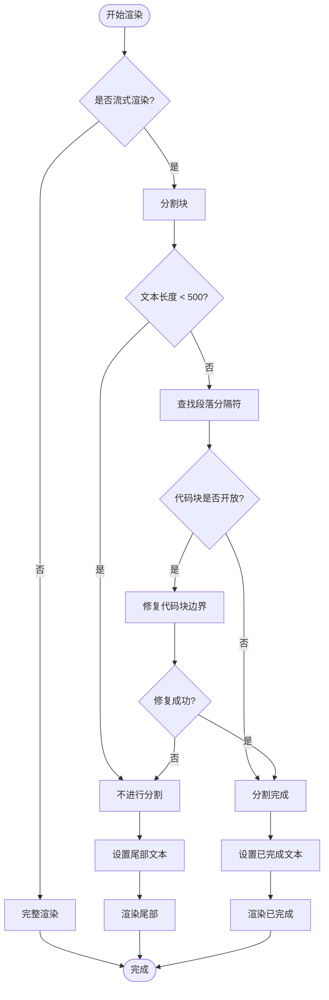
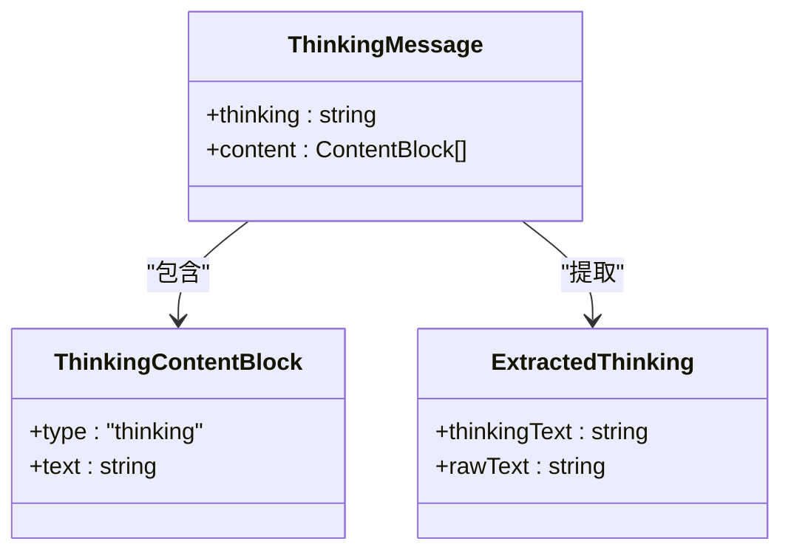
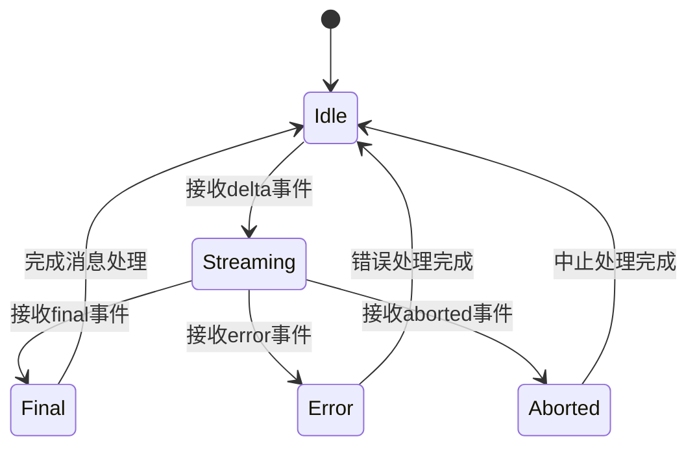
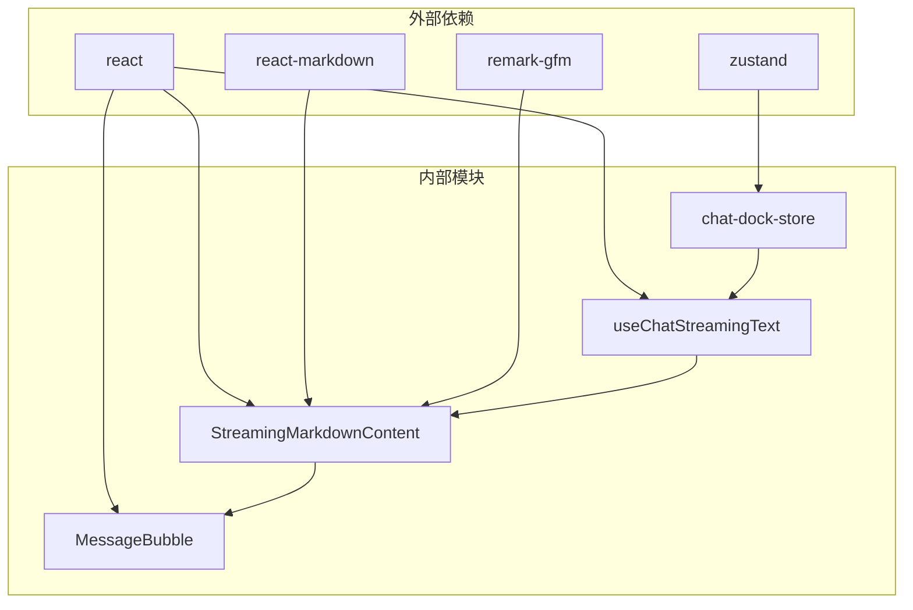
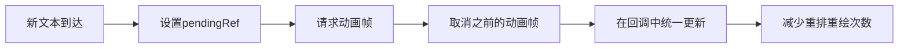

# 聊天流文本处理Hook

<cite>
**本文档引用的文件**
- [useChatStreamingText.ts](file://src/hooks/useChatStreamingText.ts)
- [StreamingMarkdownContent.tsx](file://src/components/chat/StreamingMarkdownContent.tsx)
- [MarkdownContent.tsx](file://src/components/chat/MarkdownContent.tsx)
- [MessageBubble.tsx](file://src/components/chat/MessageBubble.tsx)
- [chat-dock-store.ts](file://src/store/console-stores/chat-dock-store.ts)
- [ThinkingBlock.tsx](file://src/components/chat/ThinkingBlock.tsx)
- [StreamingIndicator.tsx](file://src/components/chat/StreamingIndicator.tsx)
- [ChatPage.tsx](file://src/components/pages/ChatPage.tsx)
- [useChatStreamingText.test.ts](file://src/hooks/__tests__/useChatStreamingText.test.ts)
</cite>

## 目录
1. [简介](#简介)
2. [项目结构](#项目结构)
3. [核心组件](#核心组件)
4. [架构概览](#架构概览)
5. [详细组件分析](#详细组件分析)
6. [依赖关系分析](#依赖关系分析)
7. [性能考虑](#性能考虑)
8. [故障排除指南](#故障排除指南)
9. [结论](#结论)

## 简介

useChatStreamingText是一个专门设计用于处理聊天流式文本的React Hook，它提供了智能的文本提取、思维过程分离和实时渲染功能。该Hook通过从聊天停靠存储中获取流式消息，自动解析可见文本内容，分离思维过程，并提供优化的渲染策略来确保流畅的用户体验。

这个系统支持多种消息格式，包括字符串内容、内容块数组以及传统的文本字段，同时能够处理结构化的思维过程内容和标记化的思维标签。

## 项目结构

聊天流文本处理系统由多个相互协作的组件组成，形成了一个完整的流式文本处理管道：

**图表来源**
- [useChatStreamingText.ts:75-87](file://src/hooks/useChatStreamingText.ts#L75-L87)
- [StreamingMarkdownContent.tsx:198-260](file://src/components/chat/StreamingMarkdownContent.tsx#L198-L260)
- [MessageBubble.tsx:160-257](file://src/components/chat/MessageBubble.tsx#L160-L257)
- [chat-dock-store.ts:1491-1703](file://src/store/console-stores/chat-dock-store.ts#L1491-L1703)

**章节来源**
- [useChatStreamingText.ts:1-88](file://src/hooks/useChatStreamingText.ts#L1-L88)
- [StreamingMarkdownContent.tsx:1-260](file://src/components/chat/StreamingMarkdownContent.tsx#L1-L260)
- [MessageBubble.tsx:1-257](file://src/components/chat/MessageBubble.tsx#L1-L257)
- [chat-dock-store.ts:1-1703](file://src/store/console-stores/chat-dock-store.ts#L1-L1703)

## 核心组件

### useChatStreamingText Hook

useChatStreamingText是整个流式文本处理系统的核心，它提供了三个主要功能：

1. **文本提取**：从各种消息格式中提取可见文本内容
2. **思维分离**：识别并分离思维过程内容
3. **实时渲染**：提供优化的渲染策略

**图表来源**
- [useChatStreamingText.ts:3-6](file://src/hooks/useChatStreamingText.ts#L3-L6)
- [useChatStreamingText.ts:29-43](file://src/hooks/useChatStreamingText.ts#L29-L43)

### 文本提取函数

系统实现了三种不同的文本提取策略：

1. **直接字符串提取**：最简单的情况，直接返回字符串内容
2. **内容块数组提取**：处理包含多种类型内容的消息
3. **回退机制**：当主要提取失败时，尝试其他可用字段

**章节来源**
- [useChatStreamingText.ts:12-32](file://src/hooks/useChatStreamingText.ts#L12-L32)
- [useChatStreamingText.ts:38-64](file://src/hooks/useChatStreamingText.ts#L38-L64)

## 架构概览

聊天流文本处理系统采用分层架构设计，每层都有明确的职责分工：

**图表来源**
- [chat-dock-store.ts:1491-1565](file://src/store/console-stores/chat-dock-store.ts#L1491-L1565)
- [useChatStreamingText.ts:78-87](file://src/hooks/useChatStreamingText.ts#L78-L87)
- [StreamingMarkdownContent.tsx:232-247](file://src/components/chat/StreamingMarkdownContent.tsx#L232-L247)

## 详细组件分析

### 流式Markdown内容组件

StreamingMarkdownContent组件实现了智能的分块渲染策略，通过以下机制优化性能：

#### 分块渲染算法

**图表来源**
- [StreamingMarkdownContent.tsx:32-61](file://src/components/chat/StreamingMarkdownContent.tsx#L32-L61)
- [StreamingMarkdownContent.tsx:232-247](file://src/components/chat/StreamingMarkdownContent.tsx#L232-L247)

#### 缓冲区管理策略

组件使用了多层缓存机制来优化渲染性能：

1. **批处理缓存**：使用requestAnimationFrame进行批处理渲染
2. **键值缓存**：基于已完成文本的键值缓存机制
3. **引用缓存**：使用ref进行状态持久化

**章节来源**
- [StreamingMarkdownContent.tsx:202-228](file://src/components/chat/StreamingMarkdownContent.tsx#L202-L228)
- [StreamingMarkdownContent.tsx:237-247](file://src/components/chat/StreamingMarkdownContent.tsx#L237-L247)

### 思维过程处理

系统支持两种思维过程的表示方式：

#### 结构化思维处理

**图表来源**
- [useChatStreamingText.ts:38-64](file://src/hooks/useChatStreamingText.ts#L38-L64)
- [chat-dock-store.ts:311-318](file://src/store/console-stores/chat-dock-store.ts#L311-L318)

#### 标记化思维处理

系统还支持HTML标记化的思维内容，如`<thinking>`和`<antThinking>`标签：

**章节来源**
- [useChatStreamingText.ts:57-63](file://src/hooks/useChatStreamingText.ts#L57-L63)
- [useChatStreamingText.ts:69-73](file://src/hooks/useChatStreamingText.ts#L69-L73)

### 状态管理机制

聊天停靠存储提供了完整的状态管理，包括：

#### 会话运行时状态

**图表来源**
- [chat-dock-store.ts:196-309](file://src/store/console-stores/chat-dock-store.ts#L196-L309)

#### 事件处理流程

系统通过复杂的事件处理机制来管理流式消息的状态转换：

**章节来源**
- [chat-dock-store.ts:1491-1565](file://src/store/console-stores/chat-dock-store.ts#L1491-L1565)
- [chat-dock-store.ts:1567-1647](file://src/store/console-stores/chat-dock-store.ts#L1567-L1647)

## 依赖关系分析

### 组件间依赖关系

**图表来源**
- [useChatStreamingText.ts:1](file://src/hooks/useChatStreamingText.ts#L1)
- [StreamingMarkdownContent.tsx:1-8](file://src/components/chat/StreamingMarkdownContent.tsx#L1-L8)

### 数据流向分析

系统中的数据流遵循严格的单向原则：

1. **事件驱动**：WebSocket事件驱动状态更新
2. **状态传播**：Zustand状态通过订阅者模式传播
3. **渲染触发**：状态变化触发React组件重新渲染
4. **用户交互**：用户操作触发新的事件流

**章节来源**
- [chat-dock-store.ts:1651-1666](file://src/store/console-stores/chat-dock-store.ts#L1651-L1666)
- [useChatStreamingText.ts:82-86](file://src/hooks/useChatStreamingText.ts#L82-L86)

## 性能考虑

### 渲染优化策略

#### 批处理渲染

系统使用requestAnimationFrame进行批处理渲染，避免频繁的DOM操作：

**图表来源**
- [StreamingMarkdownContent.tsx:207-228](file://src/components/chat/StreamingMarkdownContent.tsx#L207-L228)

#### 内存管理优化

1. **缓存键值系统**：基于已完成文本的键值缓存，避免重复渲染
2. **引用持久化**：使用ref保持状态引用，减少对象创建
3. **条件渲染**：只渲染必要的部分，避免全量重渲染

**章节来源**
- [StreamingMarkdownContent.tsx:202-206](file://src/components/chat/StreamingMarkdownContent.tsx#L202-L206)
- [StreamingMarkdownContent.tsx:237-247](file://src/components/chat/StreamingMarkdownContent.tsx#L237-L247)

### 大数据量处理

对于长文本的处理，系统采用了智能的分块策略：

#### 智能分块算法

1. **阈值检查**：超过500字符才进行分块
2. **段落边界**：基于双换行符进行自然分块
3. **代码块保护**：确保代码块完整性
4. **递归修复**：当代码块被截断时进行修复

**章节来源**
- [StreamingMarkdownContent.tsx:24-25](file://src/components/chat/StreamingMarkdownContent.tsx#L24-L25)
- [StreamingMarkdownContent.tsx:32-61](file://src/components/chat/StreamingMarkdownContent.tsx#L32-L61)

## 故障排除指南

### 常见问题诊断

#### 文本提取失败

当`extractStreamingTextFromMessage`返回空字符串时，可能的原因包括：

1. **消息格式不支持**：消息结构不符合预期
2. **内容为空**：消息内容确实为空
3. **类型不匹配**：content字段类型不是期望的类型

#### 思维内容显示异常

如果思维内容没有正确分离，检查：

1. **思维块类型**：确保思维块的type字段为"thinking"
2. **标签格式**：确认HTML标签格式正确
3. **文本清理**：验证stripThinkingTags函数正常工作

**章节来源**
- [useChatStreamingText.test.ts:8-44](file://src/hooks/__tests__/useChatStreamingText.test.ts#L8-L44)
- [useChatStreamingText.test.ts:46-78](file://src/hooks/__tests__/useChatStreamingText.test.ts#L46-L78)

### 性能问题排查

#### 渲染卡顿问题

1. **检查批处理**：确认requestAnimationFrame正确使用
2. **监控缓存命中率**：验证键值缓存的有效性
3. **分析DOM操作**：使用浏览器开发者工具分析重排重绘

#### 内存泄漏检测

1. **清理定时器**：确保动画帧在组件卸载时正确清理
2. **释放引用**：验证ref引用的正确释放
3. **监控内存使用**：使用性能面板监控内存增长

**章节来源**
- [StreamingMarkdownContent.tsx:222-228](file://src/components/chat/StreamingMarkdownContent.tsx#L222-L228)
- [StreamingMarkdownContent.tsx:202-206](file://src/components/chat/StreamingMarkdownContent.tsx#L202-L206)

## 结论

useChatStreamingText聊天流文本处理Hook提供了一个完整、高效且可扩展的解决方案，用于处理实时聊天流式文本。系统的设计充分考虑了性能优化、内存管理和用户体验，在保证功能完整性的同时实现了最佳的渲染性能。

通过分层架构设计、智能缓存策略和优化的渲染算法，该系统能够有效处理各种复杂场景，包括长文本分块、思维过程分离、实时更新等挑战性需求。测试覆盖确保了核心功能的可靠性，而清晰的错误处理机制为生产环境部署提供了保障。

对于开发者而言，该系统提供了良好的扩展点和自定义能力，可以根据具体需求进行进一步的优化和定制。