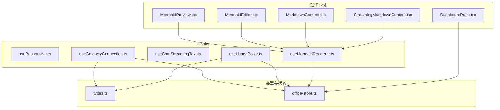
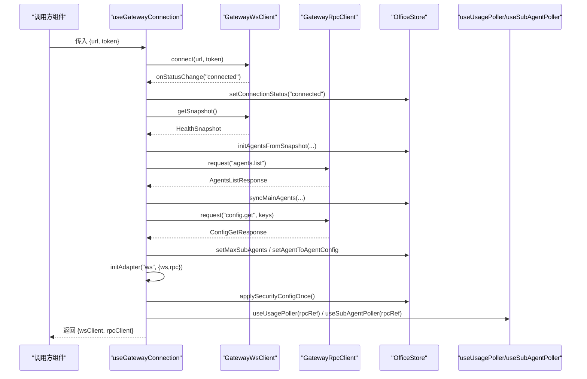
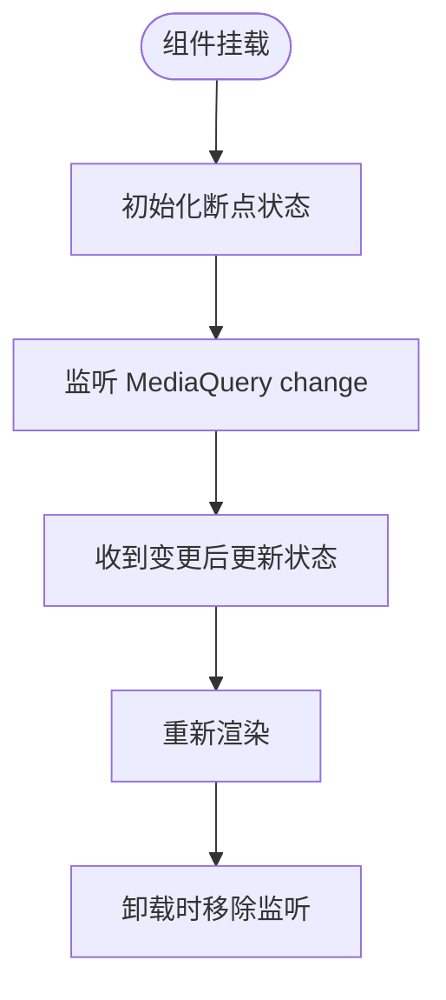
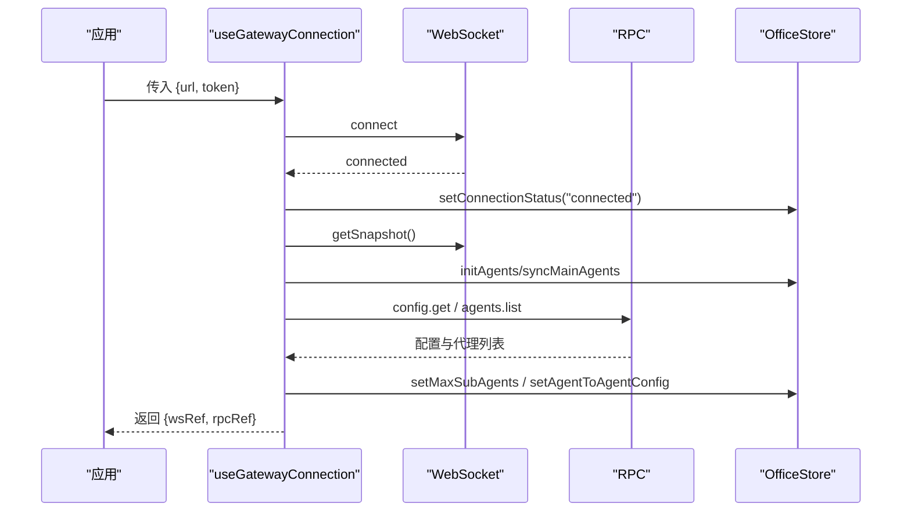
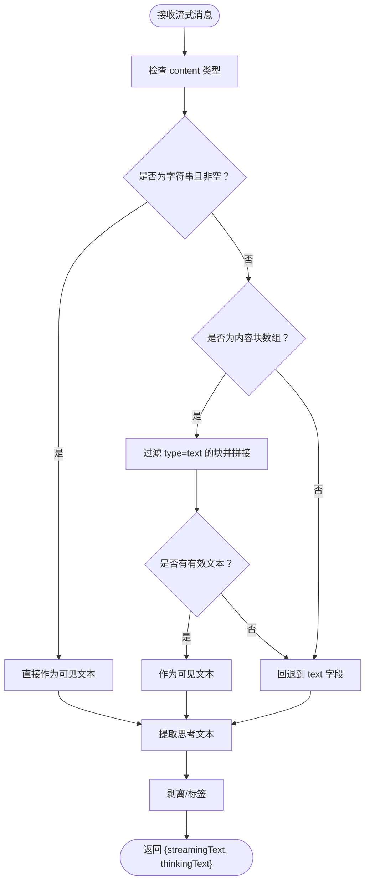
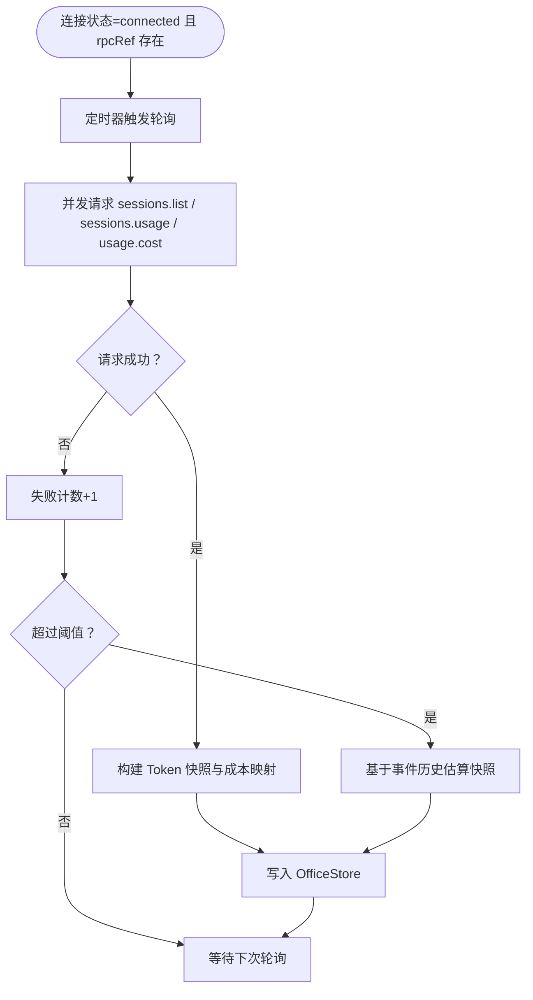
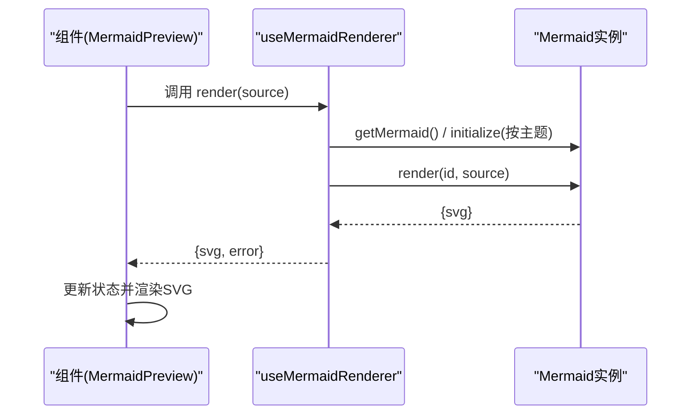
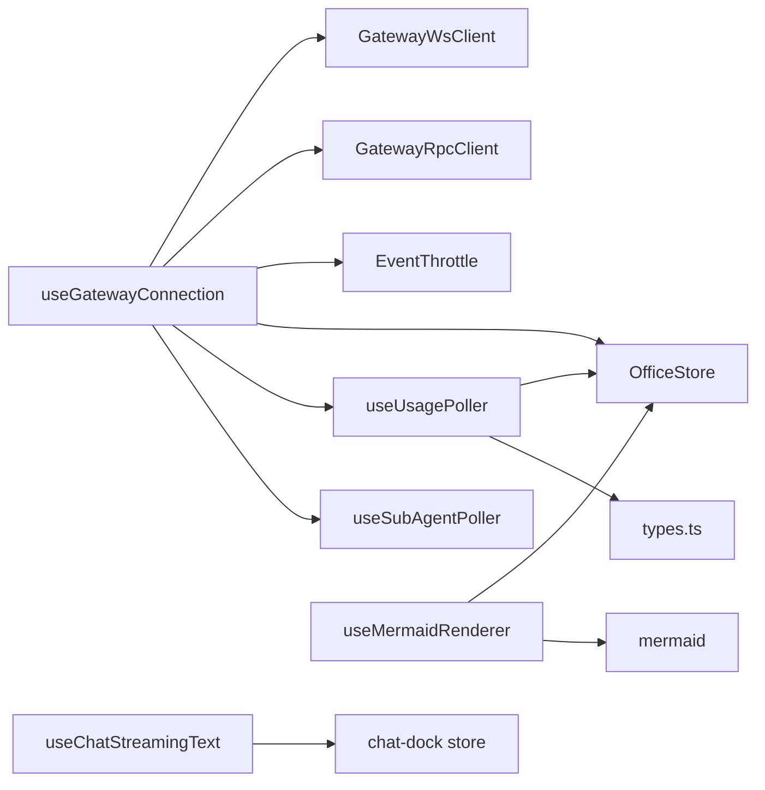

# 自定义Hooks

<cite>
**本文引用的文件**
- [useResponsive.ts](file://src/hooks/useResponsive.ts)
- [useGatewayConnection.ts](file://src/hooks/useGatewayConnection.ts)
- [useChatStreamingText.ts](file://src/hooks/useChatStreamingText.ts)
- [useUsagePoller.ts](file://src/hooks/useUsagePoller.ts)
- [useMermaidRenderer.ts](file://src/hooks/useMermaidRenderer.ts)
- [types.ts](file://src/gateway/types.ts)
- [office-store.ts](file://src/store/office-store.ts)
- [useSubAgentPoller.ts](file://src/hooks/useSubAgentPoller.ts)
- [MermaidPreview.tsx](file://src/components/shared/MermaidPreview.tsx)
- [MermaidEditor.tsx](file://src/components/console/skills/MermaidEditor.tsx)
- [MarkdownContent.tsx](file://src/components/chat/MarkdownContent.tsx)
- [StreamingMarkdownContent.tsx](file://src/components/chat/StreamingMarkdownContent.tsx)
- [DashboardPage.tsx](file://src/components/pages/DashboardPage.tsx)
- [useChatStreamingText.test.ts](file://src/hooks/__tests__/useChatStreamingText.test.ts)
- [useUsagePoller.test.ts](file://src/hooks/__tests__/useUsagePoller.test.ts)
</cite>

## 目录
1. [简介](#简介)
2. [项目结构](#项目结构)
3. [核心组件](#核心组件)
4. [架构总览](#架构总览)
5. [详细组件分析](#详细组件分析)
6. [依赖分析](#依赖分析)
7. [性能考虑](#性能考虑)
8. [故障排查指南](#故障排查指南)
9. [结论](#结论)
10. [附录](#附录)

## 简介
本文件系统性梳理并深入解析以下五个自定义Hook：
- 响应式设计Hook：useResponsive，负责断点管理与屏幕尺寸检测
- 网关连接管理：useGatewayConnection，负责WebSocket/RPC连接、事件节流、配置拉取与生命周期管理
- 聊天流文本处理：useChatStreamingText，负责从流式消息中提取可见文本与思考内容，并剥离思考标签
- 使用量轮询：useUsagePoller，负责会话与用量数据的定时轮询、失败退避与历史估算
- Mermaid渲染Hook：useMermaidRenderer，负责Mermaid图表的动态渲染、主题切换与DOM生命周期管理

同时给出每个Hook的使用场景、参数说明、返回值类型、最佳实践、具体使用示例与集成方法。

## 项目结构
这些Hook位于src/hooks目录下，分别服务于UI响应式布局、网关通信、聊天流解析、用量统计与图表渲染等场景；与之配套的类型定义在src/gateway/types.ts中，全局状态在src/store/office-store.ts中，部分组件如MermaidPreview、MermaidEditor、MarkdownContent等展示了这些Hook的实际使用方式。

图示来源
- [useResponsive.ts:1-42](file://src/hooks/useResponsive.ts#L1-L42)
- [useGatewayConnection.ts:1-238](file://src/hooks/useGatewayConnection.ts#L1-L238)
- [useChatStreamingText.ts:1-88](file://src/hooks/useChatStreamingText.ts#L1-L88)
- [useUsagePoller.ts:1-191](file://src/hooks/useUsagePoller.ts#L1-L191)
- [useMermaidRenderer.ts:1-52](file://src/hooks/useMermaidRenderer.ts#L1-L52)
- [types.ts:1-402](file://src/gateway/types.ts#L1-L402)
- [office-store.ts:1-200](file://src/store/office-store.ts#L1-L200)
- [MermaidPreview.tsx:1-65](file://src/components/shared/MermaidPreview.tsx#L1-L65)
- [MermaidEditor.tsx:1-46](file://src/components/console/skills/MermaidEditor.tsx#L1-L46)
- [MarkdownContent.tsx:1-20](file://src/components/chat/MarkdownContent.tsx#L1-L20)
- [StreamingMarkdownContent.tsx:168-196](file://src/components/chat/StreamingMarkdownContent.tsx#L168-L196)
- [DashboardPage.tsx:1-200](file://src/components/pages/DashboardPage.tsx#L1-L200)

章节来源
- [useResponsive.ts:1-42](file://src/hooks/useResponsive.ts#L1-L42)
- [useGatewayConnection.ts:1-238](file://src/hooks/useGatewayConnection.ts#L1-L238)
- [useChatStreamingText.ts:1-88](file://src/hooks/useChatStreamingText.ts#L1-L88)
- [useUsagePoller.ts:1-191](file://src/hooks/useUsagePoller.ts#L1-L191)
- [useMermaidRenderer.ts:1-52](file://src/hooks/useMermaidRenderer.ts#L1-L52)
- [types.ts:1-402](file://src/gateway/types.ts#L1-L402)
- [office-store.ts:1-200](file://src/store/office-store.ts#L1-L200)

## 核心组件
- useResponsive：返回当前设备断点状态（移动端、平板、桌面），基于window.innerWidth与MediaQuery监听变化
- useGatewayConnection：建立并维护Gateway连接，订阅事件，初始化适配器与配置，启动子代理轮询与用量轮询
- useChatStreamingText：从聊天流消息中抽取可见文本与思考文本，支持多种消息格式与标签解析
- useUsagePoller：周期性轮询会话列表、用量与成本数据，失败阈值触发历史估算
- useMermaidRenderer：延迟加载Mermaid，按主题初始化，渲染图表并返回SVG字符串

章节来源
- [useResponsive.ts:9-29](file://src/hooks/useResponsive.ts#L9-L29)
- [useGatewayConnection.ts:23-151](file://src/hooks/useGatewayConnection.ts#L23-L151)
- [useChatStreamingText.ts:78-87](file://src/hooks/useChatStreamingText.ts#L78-L87)
- [useUsagePoller.ts:32-106](file://src/hooks/useUsagePoller.ts#L32-L106)
- [useMermaidRenderer.ts:19-51](file://src/hooks/useMermaidRenderer.ts#L19-L51)

## 架构总览
下面的序列图展示useGatewayConnection的连接生命周期与关键交互：

图示来源
- [useGatewayConnection.ts:36-151](file://src/hooks/useGatewayConnection.ts#L36-L151)
- [types.ts:66-106](file://src/gateway/types.ts#L66-L106)
- [office-store.ts:286-370](file://src/store/office-store.ts#L286-L370)

章节来源
- [useGatewayConnection.ts:36-151](file://src/hooks/useGatewayConnection.ts#L36-L151)

## 详细组件分析

### 响应式设计Hook：useResponsive
- 功能概述
  - 基于window.innerWidth与MediaQuery监听，返回当前断点状态：isMobile、isTablet、isDesktop
  - 初始状态在无window环境下默认为桌面端
- 关键实现要点
  - 使用useState保存断点状态，useEffect注册MediaQuery change事件，清理时移除监听
  - getState函数根据窗口宽度计算断点
- 使用场景
  - UI布局自适应、条件渲染、样式切换
- 参数与返回值
  - 无参数
  - 返回值类型：{ isMobile: boolean; isTablet: boolean; isDesktop: boolean }
- 最佳实践
  - 在组件顶层调用，避免在渲染过程中频繁读取window
  - 结合CSS媒体查询或Tailwind类名进行样式控制
- 示例与集成
  - 在页面或组件中直接调用，依据断点状态切换布局或组件

图示来源
- [useResponsive.ts:9-29](file://src/hooks/useResponsive.ts#L9-L29)

章节来源
- [useResponsive.ts:1-42](file://src/hooks/useResponsive.ts#L1-L42)

### 网关连接管理：useGatewayConnection
- 功能概述
  - 建立Gateway WebSocket连接，封装RPC客户端
  - 订阅agent/health事件，使用EventThrottle进行事件节流
  - 初始化适配器（mock或ws），拉取默认配置与代理列表
  - 启动子代理轮询与用量轮询
- 关键实现要点
  - 支持mock模式与真实ws模式，mock模式下模拟事件与配置
  - 连接成功后从快照与RPC请求中同步代理信息
  - 通过OfficeStore设置连接状态、代理配置与权限范围
  - 清理阶段销毁节流器、断开WebSocket连接
- 使用场景
  - 控制台仪表盘、聊天工作区、技能工作台等需要实时代理状态与用量的界面
- 参数与返回值
  - 参数：{ url: string; token: string }
  - 返回值：{ wsClient: RefObject<GatewayWsClient>; rpcClient: RefObject<GatewayRpcClient> }
- 最佳实践
  - 在应用入口或路由层调用，确保连接状态贯穿整个应用
  - 将rpcRef传递给其他依赖RPC的Hook（如用量轮询）
- 示例与集成
  - 在页面组件中传入有效的url与token，随后在UI中读取OfficeStore的连接状态与代理信息

图示来源
- [useGatewayConnection.ts:23-151](file://src/hooks/useGatewayConnection.ts#L23-L151)
- [types.ts:250-284](file://src/gateway/types.ts#L250-L284)
- [office-store.ts:286-370](file://src/store/office-store.ts#L286-L370)

章节来源
- [useGatewayConnection.ts:1-238](file://src/hooks/useGatewayConnection.ts#L1-L238)
- [types.ts:1-402](file://src/gateway/types.ts#L1-L402)
- [office-store.ts:1-200](file://src/store/office-store.ts#L1-L200)

### 聊天流文本处理：useChatStreamingText
- 功能概述
  - 从聊天Dock的流式消息中提取可见文本与思考文本
  - 支持字符串内容、内容块数组、以及<thinking>/<antThinking>标签
  - 提供剥离思考标签的工具函数，保证消息气泡只显示实际回复
- 关键实现要点
  - extractStreamingTextFromMessage：优先取字符串content，其次取type为"text"的块拼接，最后回退到text字段
  - extractThinkingFromMessage：优先取thinking字段，其次取type为"thinking"的块，最后从可见文本中正则匹配标签
  - stripThinkingTags：移除<thinking>与<antThinking>标签
  - useChatStreamingText：从chat-dock store读取streamingMessage，组合visible与thinking文本
- 使用场景
  - 实时聊天消息展示、Markdown渲染、思考过程可视化
- 参数与返回值
  - 无参数
  - 返回值：{ streamingText: string; thinkingText: string }
- 最佳实践
  - 在消息渲染前先剥离思考标签，避免将内部推理内容暴露给用户
  - 对空消息与异常输入做好兜底处理
- 示例与集成
  - 在消息气泡组件中调用useChatStreamingText，分别渲染可见文本与思考文本

图示来源
- [useChatStreamingText.ts:12-87](file://src/hooks/useChatStreamingText.ts#L12-L87)

章节来源
- [useChatStreamingText.ts:1-88](file://src/hooks/useChatStreamingText.ts#L1-L88)
- [useChatStreamingText.test.ts:1-93](file://src/hooks/__tests__/useChatStreamingText.test.ts#L1-L93)

### 使用量轮询：useUsagePoller
- 功能概述
  - 定期轮询会话列表、会话用量与成本数据，聚合为Token快照与按代理的成本映射
  - 失败阈值触发历史事件估算，保障离线或异常情况下的数据可用性
- 关键实现要点
  - 轮询间隔固定为60秒，仅在连接状态为"connected"且rpcRef存在时执行
  - 并行请求sessions.list、sessions.usage、usage.cost，失败时捕获并累加失败计数
  - 成功时构建Token快照与成本映射，写入OfficeStore
  - 失败达到阈值后，基于事件历史估算Token快照
- 使用场景
  - 仪表盘令牌消耗统计、按代理成本汇总、Token趋势分析
- 参数与返回值
  - 参数：rpcRef: RefObject<GatewayRpcClient | null>
  - 返回值：无（副作用：更新OfficeStore）
- 最佳实践
  - 仅在连接建立后启用轮询，避免无效请求
  - 合理设置失败阈值，平衡数据准确性与鲁棒性
- 示例与集成
  - 在useGatewayConnection中将rpcRef传入useUsagePoller，即可自动开始轮询

图示来源
- [useUsagePoller.ts:32-106](file://src/hooks/useUsagePoller.ts#L32-L106)
- [useUsagePoller.ts:108-191](file://src/hooks/useUsagePoller.ts#L108-L191)
- [types.ts:280-284](file://src/gateway/types.ts#L280-L284)
- [office-store.ts:286-370](file://src/store/office-store.ts#L286-L370)

章节来源
- [useUsagePoller.ts:1-191](file://src/hooks/useUsagePoller.ts#L1-L191)
- [useUsagePoller.test.ts:1-201](file://src/hooks/__tests__/useUsagePoller.test.ts#L1-L201)
- [types.ts:280-284](file://src/gateway/types.ts#L280-L284)
- [office-store.ts:286-370](file://src/store/office-store.ts#L286-L370)

### Mermaid渲染Hook：useMermaidRenderer
- 功能概述
  - 延迟加载Mermaid，按主题初始化，渲染图表并返回SVG字符串
  - 维护渲染计数器与主题缓存，避免重复初始化
- 关键实现要点
  - getMermaid：首次调用时动态import mermaid并缓存实例
  - render：根据当前主题初始化Mermaid，生成唯一ID并调用render，返回{svg, error}
  - 返回renderRef与render函数，便于外部组件持有容器并触发渲染
- 使用场景
  - 技能工作台Mermaid编辑器、聊天Markdown内容中的Mermaid图表
- 参数与返回值
  - 参数：source: string
  - 返回值：{ renderRef: RefObject<HTMLDivElement>; render: (source: string) => Promise<{ svg: string; error: string | null }> }
- 最佳实践
  - 在MermaidPreview组件中异步调用render，处理loading与error状态
  - 主题切换时自动重新初始化Mermaid
- 示例与集成
  - 在MermaidPreview中调用render，将返回的SVG注入容器；在MermaidEditor中结合防抖更新源码并触发渲染

图示来源
- [useMermaidRenderer.ts:9-51](file://src/hooks/useMermaidRenderer.ts#L9-L51)
- [MermaidPreview.tsx:9-42](file://src/components/shared/MermaidPreview.tsx#L9-L42)
- [MermaidEditor.tsx:9-45](file://src/components/console/skills/MermaidEditor.tsx#L9-L45)

章节来源
- [useMermaidRenderer.ts:1-52](file://src/hooks/useMermaidRenderer.ts#L1-L52)
- [MermaidPreview.tsx:1-65](file://src/components/shared/MermaidPreview.tsx#L1-L65)
- [MermaidEditor.tsx:1-46](file://src/components/console/skills/MermaidEditor.tsx#L1-L46)

## 依赖分析
- useGatewayConnection依赖
  - WebSocket客户端、RPC客户端、事件节流器、OfficeStore、子代理轮询Hook、用量轮询Hook
  - 类型定义来自gateway/types.ts
- useUsagePoller依赖
  - OfficeStore（连接状态、快照与成本写入）、子代理信息转换工具
- useChatStreamingText依赖
  - chat-dock store（流式消息）
- useMermaidRenderer依赖
  - OfficeStore（主题）、Mermaid库

图示来源
- [useGatewayConnection.ts:1-16](file://src/hooks/useGatewayConnection.ts#L1-L16)
- [useUsagePoller.ts:1-5](file://src/hooks/useUsagePoller.ts#L1-L5)
- [useChatStreamingText.ts:1-1](file://src/hooks/useChatStreamingText.ts#L1-L1)
- [useMermaidRenderer.ts:1-2](file://src/hooks/useMermaidRenderer.ts#L1-L2)
- [types.ts:1-402](file://src/gateway/types.ts#L1-L402)
- [office-store.ts:1-200](file://src/store/office-store.ts#L1-L200)

章节来源
- [useGatewayConnection.ts:1-16](file://src/hooks/useGatewayConnection.ts#L1-L16)
- [useUsagePoller.ts:1-5](file://src/hooks/useUsagePoller.ts#L1-L5)
- [useChatStreamingText.ts:1-1](file://src/hooks/useChatStreamingText.ts#L1-L1)
- [useMermaidRenderer.ts:1-2](file://src/hooks/useMermaidRenderer.ts#L1-L2)
- [types.ts:1-402](file://src/gateway/types.ts#L1-L402)
- [office-store.ts:1-200](file://src/store/office-store.ts#L1-L200)

## 性能考虑
- useResponsive
  - 使用MediaQuery监听减少不必要的重排；初始状态在服务端渲染时安全回退
- useGatewayConnection
  - 事件节流降低高频事件对Store的压力；仅在连接成功后初始化适配器与配置
- useUsagePoller
  - 并行请求多个RPC接口；失败阈值与历史估算保障稳定性；60秒轮询频率平衡实时性与开销
- useMermaidRenderer
  - 延迟加载与主题缓存避免重复初始化；唯一ID确保渲染隔离

## 故障排查指南
- 连接问题
  - 检查DashboardPage中的连接状态提示，确认url与token正确
  - 观察OfficeStore的connectionStatus与connectionError
- 聊天文本异常
  - 确认消息格式符合预期，必要时使用stripThinkingTags剥离标签
  - 参考单元测试覆盖的边界场景
- 用量数据缺失
  - 确认连接状态为"connected"且rpcRef已赋值
  - 检查失败计数与历史估算逻辑
- Mermaid渲染失败
  - 捕获render返回的error，检查语法与主题配置

章节来源
- [DashboardPage.tsx:131-199](file://src/components/pages/DashboardPage.tsx#L131-L199)
- [useChatStreamingText.test.ts:1-93](file://src/hooks/__tests__/useChatStreamingText.test.ts#L1-L93)
- [useUsagePoller.test.ts:1-201](file://src/hooks/__tests__/useUsagePoller.test.ts#L1-L201)
- [useMermaidRenderer.ts:23-48](file://src/hooks/useMermaidRenderer.ts#L23-L48)

## 结论
上述五个Hook围绕响应式布局、网关连接、聊天流解析、用量统计与图表渲染构建了完整的前端数据与交互链路。通过事件节流、并发请求、失败退避与主题缓存等策略，在保证用户体验的同时兼顾了性能与稳定性。建议在实际项目中遵循最佳实践，结合组件示例进行集成与扩展。

## 附录
- 使用示例与集成路径
  - 响应式布局：在组件中调用useResponsive，依据断点切换布局
  - 网关连接：在应用入口调用useGatewayConnection，传入url与token，随后在各页面读取OfficeStore状态
  - 聊天流文本：在消息组件中调用useChatStreamingText，分别渲染可见文本与思考文本
  - 用量轮询：在useGatewayConnection中传入rpcRef，自动启用轮询
  - Mermaid渲染：在MermaidPreview中调用render，将SVG注入容器

章节来源
- [useResponsive.ts:9-29](file://src/hooks/useResponsive.ts#L9-L29)
- [useGatewayConnection.ts:23-151](file://src/hooks/useGatewayConnection.ts#L23-L151)
- [useChatStreamingText.ts:78-87](file://src/hooks/useChatStreamingText.ts#L78-L87)
- [useUsagePoller.ts:32-106](file://src/hooks/useUsagePoller.ts#L32-L106)
- [useMermaidRenderer.ts:19-51](file://src/hooks/useMermaidRenderer.ts#L19-L51)
- [MermaidPreview.tsx:9-42](file://src/components/shared/MermaidPreview.tsx#L9-L42)
- [MermaidEditor.tsx:9-45](file://src/components/console/skills/MermaidEditor.tsx#L9-L45)
- [MarkdownContent.tsx:1-20](file://src/components/chat/MarkdownContent.tsx#L1-L20)
- [StreamingMarkdownContent.tsx:168-196](file://src/components/chat/StreamingMarkdownContent.tsx#L168-L196)
- [DashboardPage.tsx:1-200](file://src/components/pages/DashboardPage.tsx#L1-L200)