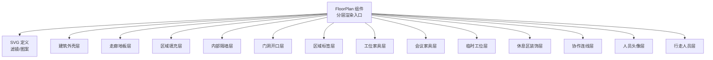
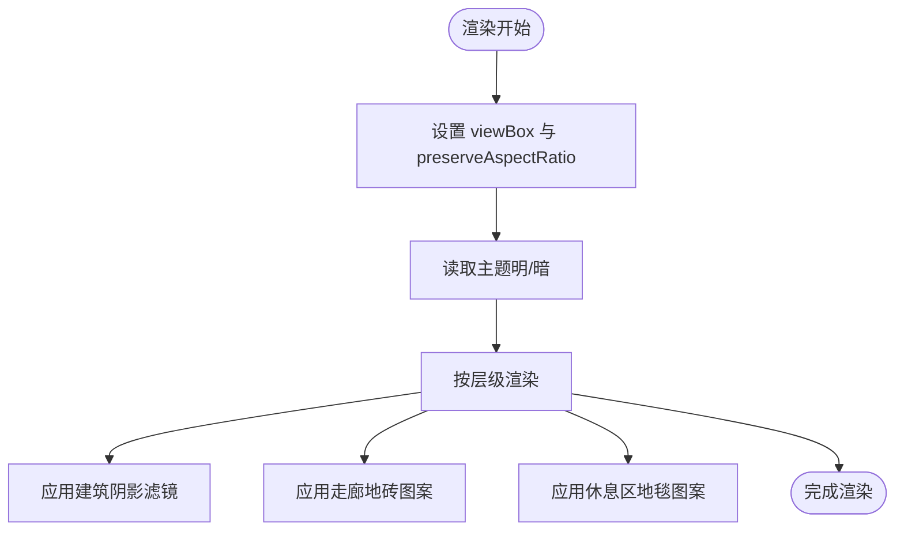
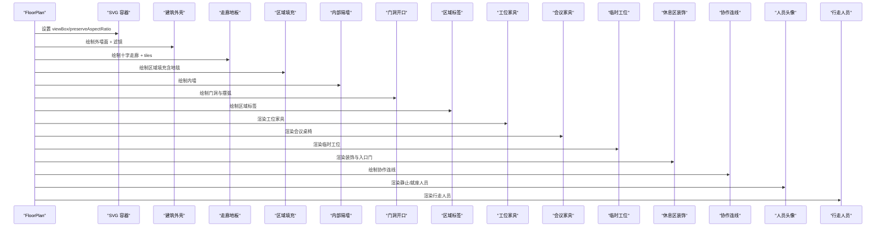
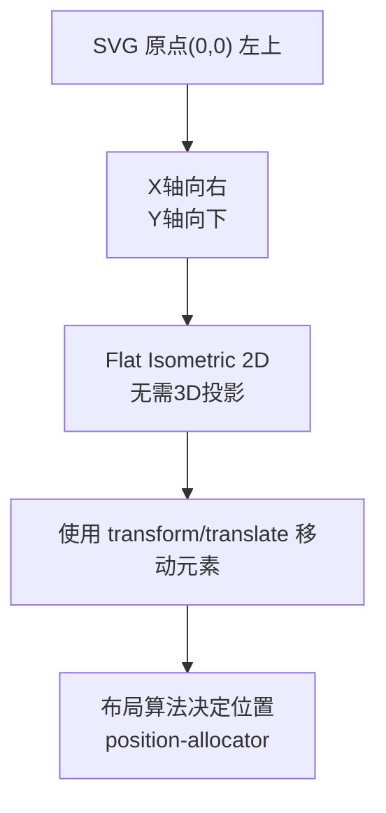
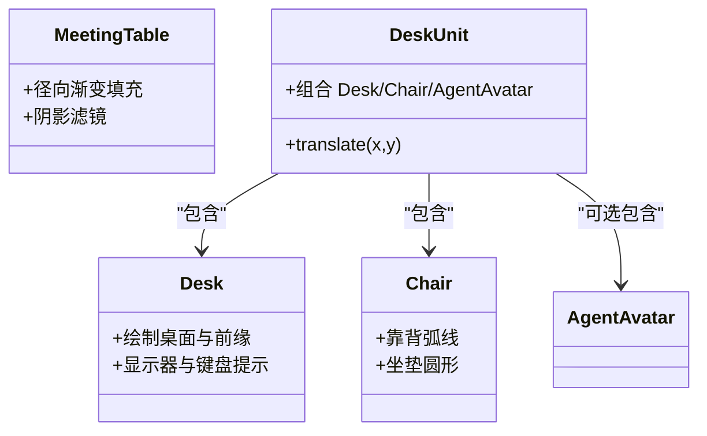
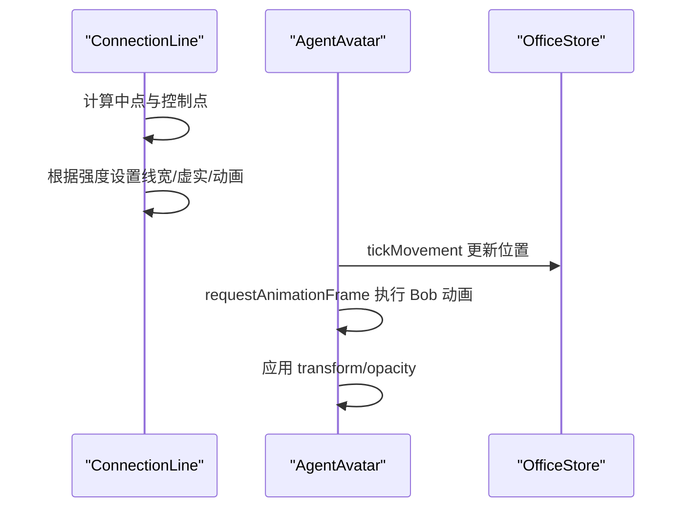
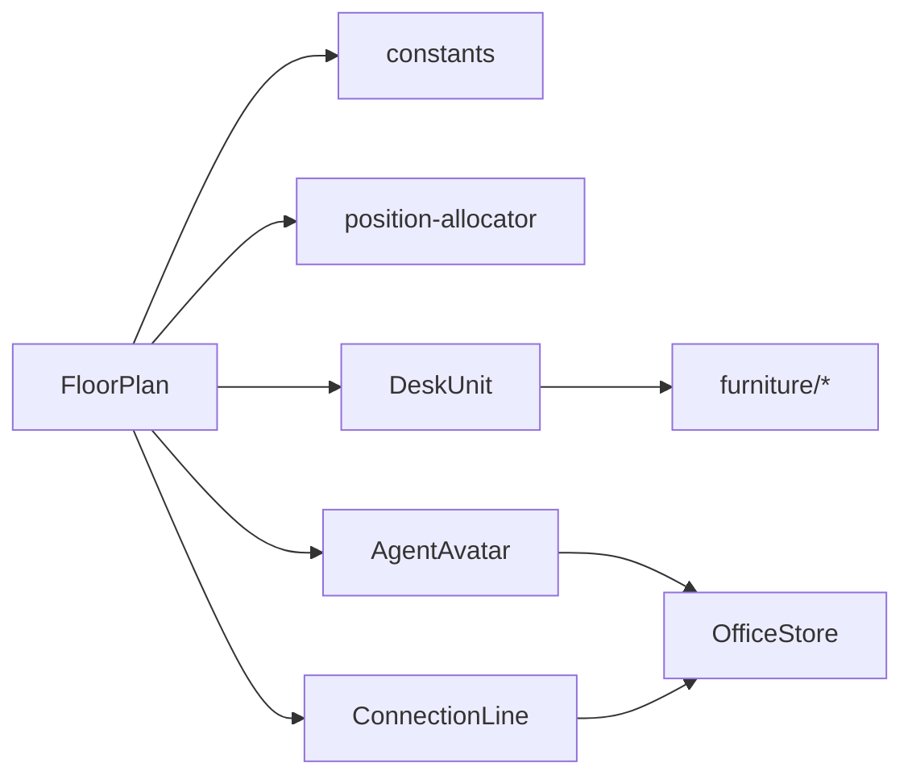

# 2D渲染架构

<cite>
**本文引用的文件**
- [src/components/office-2d/FloorPlan.tsx](file://src/components/office-2d/FloorPlan.tsx)
- [src/components/office-2d/DeskUnit.tsx](file://src/components/office-2d/DeskUnit.tsx)
- [src/components/office-2d/AgentAvatar.tsx](file://src/components/office-2d/AgentAvatar.tsx)
- [src/components/office-2d/ConnectionLine.tsx](file://src/components/office-2d/ConnectionLine.tsx)
- [src/components/office-2d/furniture/Desk.tsx](file://src/components/office-2d/furniture/Desk.tsx)
- [src/components/office-2d/furniture/Chair.tsx](file://src/components/office-2d/furniture/Chair.tsx)
- [src/components/office-2d/furniture/MeetingTable.tsx](file://src/components/office-2d/furniture/MeetingTable.tsx)
- [src/hooks/useResponsive.ts](file://src/hooks/useResponsive.ts)
- [src/lib/constants.ts](file://src/lib/constants.ts)
- [src/lib/position-allocator.ts](file://src/lib/position-allocator.ts)
</cite>

## 目录
1. [引言](#引言)
2. [项目结构](#项目结构)
3. [核心组件](#核心组件)
4. [架构总览](#架构总览)
5. [详细组件分析](#详细组件分析)
6. [依赖关系分析](#依赖关系分析)
7. [性能考量](#性能考量)
8. [故障排查指南](#故障排查指南)
9. [结论](#结论)
10. [附录](#附录)

## 引言
本技术文档聚焦于2D渲染架构，系统性阐述等距投影（Isometric）渲染在SVG中的实现方式与楼层平面（FloorPlan）的分层渲染体系。内容涵盖：
- 等距投影与SVG坐标系统转换、视口设置与比例缩放
- FloorPlan的分层渲染：建筑外壳、走廊地板、区域填充、内部隔墙、门洞开口等
- SVG滤镜与图案效果：建筑阴影、地毯纹理、瓷砖图案等
- 响应式设计：视口自适应、比例缩放与移动端兼容
- 性能优化建议与常见问题排查

## 项目结构
该功能位于 office-2d 子模块，采用“组件化 + 常量配置 + 布局算法”的分层组织：
- 视图层：FloorPlan 及其子组件（DeskUnit、AgentAvatar、ConnectionLine、家具组件）
- 配置层：constants 提供尺寸、颜色、比例等全局常量
- 布局层：position-allocator 提供工位槽位、会议座位等布局算法
- 响应式钩子：useResponsive 提供断点检测

图表来源
- [src/components/office-2d/FloorPlan.tsx:108-278](file://src/components/office-2d/FloorPlan.tsx#L108-L278)

章节来源
- [src/components/office-2d/FloorPlan.tsx:108-278](file://src/components/office-2d/FloorPlan.tsx#L108-L278)
- [src/lib/constants.ts:4-16](file://src/lib/constants.ts#L4-L16)
- [src/hooks/useResponsive.ts:9-29](file://src/hooks/useResponsive.ts#L9-L29)

## 核心组件
- FloorPlan：顶层容器，负责分层渲染、视口与滤镜定义、主题切换、数据聚合与布局计算
- DeskUnit：工位单元（Desk + Chair + AgentAvatar），使用 translate 平移组合
- AgentAvatar：人员头像，支持选中高亮、状态动画、占位与未确认态、行走动画
- ConnectionLine：协作连线，二次贝塞尔曲线、虚实与脉冲动画
- 家具组件：Desk、Chair、MeetingTable 等，均以 transform="translate(x,y)" 居中绘制
- 常量与布局：constants 提供尺寸与比例；position-allocator 提供布局算法

章节来源
- [src/components/office-2d/FloorPlan.tsx:20-278](file://src/components/office-2d/FloorPlan.tsx#L20-L278)
- [src/components/office-2d/DeskUnit.tsx:13-45](file://src/components/office-2d/DeskUnit.tsx#L13-L45)
- [src/components/office-2d/AgentAvatar.tsx:15-255](file://src/components/office-2d/AgentAvatar.tsx#L15-L255)
- [src/components/office-2d/ConnectionLine.tsx:9-53](file://src/components/office-2d/ConnectionLine.tsx#L9-L53)
- [src/components/office-2d/furniture/Desk.tsx:9-57](file://src/components/office-2d/furniture/Desk.tsx#L9-L57)
- [src/components/office-2d/furniture/Chair.tsx:9-27](file://src/components/office-2d/furniture/Chair.tsx#L9-L27)
- [src/components/office-2d/furniture/MeetingTable.tsx:10-37](file://src/components/office-2d/furniture/MeetingTable.tsx#L10-L37)
- [src/lib/constants.ts:4-16](file://src/lib/constants.ts#L4-L16)
- [src/lib/position-allocator.ts:131-159](file://src/lib/position-allocator.ts#L131-L159)

## 架构总览
等距投影与SVG坐标系统转换
- 视口与比例：SVG宽高固定，配合 viewBox 与 preserveAspectRatio 实现自适应缩放
- 坐标系统：Flat Isometric 2D（不进行3D投影变换），所有元素以SVG原生坐标绘制
- 比例常量：SCALE_X_2D_TO_3D、SCALE_Z_2D_TO_3D 保留用于3D测试或迁移场景

分层渲染与绘制顺序
- 从底层到顶层依次为：建筑外壳、走廊地板、区域填充、内部隔墙、门洞开口、区域标签、家具、协作连线、人员、行走人员
- 各层通过独立子函数组织，便于维护与扩展

SVG滤镜与图案
- 建筑阴影：feDropShadow，深色主题下更强
- 走廊地砖：pattern + 矩形描边，形成微细网格
- 休息区地毯：pattern + 小圆点，营造纹理感

响应式设计
- 使用 useResponsive 判断断点，结合 preserveAspectRatio 保证在不同屏幕尺寸下的正确显示

图表来源
- [src/components/office-2d/FloorPlan.tsx:110-138](file://src/components/office-2d/FloorPlan.tsx#L110-L138)
- [src/lib/constants.ts:133-141](file://src/lib/constants.ts#L133-L141)

章节来源
- [src/components/office-2d/FloorPlan.tsx:110-138](file://src/components/office-2d/FloorPlan.tsx#L110-L138)
- [src/hooks/useResponsive.ts:9-29](file://src/hooks/useResponsive.ts#L9-L29)
- [src/lib/constants.ts:133-141](file://src/lib/constants.ts#L133-L141)

## 详细组件分析

### FloorPlan 分层渲染架构
- 建筑外壳（Layer 0）：绘制建筑外轮廓，应用 drop-shadow 滤镜
- 走廊地板（Layer 1）：中央十字型走廊，使用 tiles pattern 填充
- 区域填充（Layer 2）：按区域绘制矩形，休息区使用地毯 pattern
- 内部隔墙（Layer 3）：双线风格墙体，矩形拼接
- 门洞开口（Layer 4）：在墙体上挖空并绘制门摆弧线
- 区域标签（Layer 5）：每个区域添加标签
- 家具层（Layer 5/5a/5b）：工位、会议室、临时工位、休息区装饰、入口门
- 协作连线（Layer 6）：基于 agent 关系绘制曲线连接
- 人员层（Layer 7/7b/8）：静止/就座人员、入口未确认人员、行走人员

图表来源
- [src/components/office-2d/FloorPlan.tsx:140-273](file://src/components/office-2d/FloorPlan.tsx#L140-L273)

章节来源
- [src/components/office-2d/FloorPlan.tsx:140-273](file://src/components/office-2d/FloorPlan.tsx#L140-L273)

### 等距投影与坐标系统
- Flat Isometric 2D：所有图形以二维坐标绘制，不进行3D投影矩阵变换
- 比例映射：保留 SCALE_X_2D_TO_3D、SCALE_Z_2D_TO_3D 常量，便于未来迁移或测试
- 布局算法：position-allocator 提供工位槽位与会议座位的等角分布

图表来源
- [src/lib/constants.ts:133-141](file://src/lib/constants.ts#L133-L141)
- [src/lib/position-allocator.ts:131-159](file://src/lib/position-allocator.ts#L131-L159)

章节来源
- [src/lib/constants.ts:133-141](file://src/lib/constants.ts#L133-L141)
- [src/lib/position-allocator.ts:131-159](file://src/lib/position-allocator.ts#L131-L159)

### 家具与装饰组件
- Desk：桌面、前缘深度、显示器提示、键盘提示
- Chair：靠背弧线、坐垫
- MeetingTable：径向渐变表面、阴影滤镜
- DeskUnit：组合 Desk + Chair，并在特定偏移处放置 AgentAvatar

图表来源
- [src/components/office-2d/furniture/Desk.tsx:9-57](file://src/components/office-2d/furniture/Desk.tsx#L9-L57)
- [src/components/office-2d/furniture/Chair.tsx:9-27](file://src/components/office-2d/furniture/Chair.tsx#L9-L27)
- [src/components/office-2d/furniture/MeetingTable.tsx:10-37](file://src/components/office-2d/furniture/MeetingTable.tsx#L10-L37)
- [src/components/office-2d/DeskUnit.tsx:13-45](file://src/components/office-2d/DeskUnit.tsx#L13-L45)

章节来源
- [src/components/office-2d/furniture/Desk.tsx:9-57](file://src/components/office-2d/furniture/Desk.tsx#L9-L57)
- [src/components/office-2d/furniture/Chair.tsx:9-27](file://src/components/office-2d/furniture/Chair.tsx#L9-L27)
- [src/components/office-2d/furniture/MeetingTable.tsx:10-37](file://src/components/office-2d/furniture/MeetingTable.tsx#L10-L37)
- [src/components/office-2d/DeskUnit.tsx:13-45](file://src/components/office-2d/DeskUnit.tsx#L13-L45)

### 协作连线与人员动画
- ConnectionLine：二次贝塞尔曲线，根据强度选择线宽、虚实与动画
- AgentAvatar：选中高光、状态环动画、占位/未确认透明度、行走时的 Bob 动画与缩放过渡

图表来源
- [src/components/office-2d/ConnectionLine.tsx:9-53](file://src/components/office-2d/ConnectionLine.tsx#L9-L53)
- [src/components/office-2d/AgentAvatar.tsx:46-95](file://src/components/office-2d/AgentAvatar.tsx#L46-L95)

章节来源
- [src/components/office-2d/ConnectionLine.tsx:9-53](file://src/components/office-2d/ConnectionLine.tsx#L9-L53)
- [src/components/office-2d/AgentAvatar.tsx:46-95](file://src/components/office-2d/AgentAvatar.tsx#L46-L95)

## 依赖关系分析
- FloorPlan 依赖常量与布局算法，聚合 agents/links 数据，拆分不同区域与移动状态的人员
- DeskUnit 依赖 OfficeStore 主题状态，组合家具与头像
- AgentAvatar 依赖 OfficeStore 的选中、移动与主题状态，内部管理动画循环
- 布局算法 position-allocator 依赖常量中的网格列数、最小宽度与比例常量

图表来源
- [src/components/office-2d/FloorPlan.tsx:1-20](file://src/components/office-2d/FloorPlan.tsx#L1-L20)
- [src/lib/position-allocator.ts:1-13](file://src/lib/position-allocator.ts#L1-L13)
- [src/components/office-2d/DeskUnit.tsx:1-5](file://src/components/office-2d/DeskUnit.tsx#L1-L5)
- [src/components/office-2d/AgentAvatar.tsx:1-6](file://src/components/office-2d/AgentAvatar.tsx#L1-L6)
- [src/components/office-2d/ConnectionLine.tsx:1-7](file://src/components/office-2d/ConnectionLine.tsx#L1-L7)

章节来源
- [src/components/office-2d/FloorPlan.tsx:1-20](file://src/components/office-2d/FloorPlan.tsx#L1-L20)
- [src/lib/position-allocator.ts:1-13](file://src/lib/position-allocator.ts#L1-L13)
- [src/components/office-2d/DeskUnit.tsx:1-5](file://src/components/office-2d/DeskUnit.tsx#L1-L5)
- [src/components/office-2d/AgentAvatar.tsx:1-6](file://src/components/office-2d/AgentAvatar.tsx#L1-L6)
- [src/components/office-2d/ConnectionLine.tsx:1-7](file://src/components/office-2d/ConnectionLine.tsx#L1-L7)

## 性能考量
- 渲染层级与顺序：合理分层减少重绘，将静态元素（外壳、地板、填充）置于较低层级
- 动画与 RAF：AgentAvatar 的行走动画使用 requestAnimationFrame，仅在需要时启动，避免不必要的帧更新
- 布局与记忆化：FloorPlan 中对人员分组与槽位计算使用 useMemo，降低重复计算
- 图案与滤镜：tiles 与 carpet pattern 体积小、复用性强；滤镜仅在必要元素上应用
- 响应式：preserveAspectRatio 与断点检测确保在不同设备上的稳定渲染

## 故障排查指南
- 视口显示异常
  - 检查 viewBox 与 preserveAspectRatio 是否正确设置
  - 确认容器尺寸变化是否触发重新渲染
- 元素遮挡或顺序错乱
  - 核对各层渲染顺序，确保高层元素（连线、人员、行走人员）在正确层级
- 动画卡顿
  - 检查 RAF 循环是否在移动状态下启动，避免在非移动状态持续运行
- 滤镜与图案不生效
  - 确认 defs 在 svg 内部定义且 ID 正确引用
- 断点样式不一致
  - 使用 useResponsive 检查断点判断逻辑，确认媒体查询事件绑定

章节来源
- [src/components/office-2d/FloorPlan.tsx:110-138](file://src/components/office-2d/FloorPlan.tsx#L110-L138)
- [src/components/office-2d/AgentAvatar.tsx:87-95](file://src/components/office-2d/AgentAvatar.tsx#L87-L95)
- [src/hooks/useResponsive.ts:12-26](file://src/hooks/useResponsive.ts#L12-L26)

## 结论
该2D渲染架构以 Flat Isometric 2D 为基础，通过清晰的分层渲染与合理的布局算法，实现了建筑外壳、走廊、区域填充、内部隔墙与门洞的完整表达。配合滤镜与图案，有效提升了视觉层次与真实感。结合响应式钩子与比例常量，系统具备良好的可扩展性与跨设备适配能力。后续可在保持现有分层结构的前提下，逐步引入更丰富的材质与交互反馈。

## 附录
- SVG 代码示例路径（不直接展示代码内容）
  - 建筑阴影滤镜定义：[src/components/office-2d/FloorPlan.tsx:116-118](file://src/components/office-2d/FloorPlan.tsx#L116-L118)
  - 走廊地砖 pattern：[src/components/office-2d/FloorPlan.tsx:120-132](file://src/components/office-2d/FloorPlan.tsx#L120-L132)
  - 休息区地毯 pattern：[src/components/office-2d/FloorPlan.tsx:134-137](file://src/components/office-2d/FloorPlan.tsx#L134-L137)
  - 建筑外壳绘制：[src/components/office-2d/FloorPlan.tsx:141-151](file://src/components/office-2d/FloorPlan.tsx#L141-L151)
  - 走廊地板绘制：[src/components/office-2d/FloorPlan.tsx:283-318](file://src/components/office-2d/FloorPlan.tsx#L283-L318)
  - 内部隔墙绘制：[src/components/office-2d/FloorPlan.tsx:322-362](file://src/components/office-2d/FloorPlan.tsx#L322-L362)
  - 门洞开口绘制：[src/components/office-2d/FloorPlan.tsx:365-426](file://src/components/office-2d/FloorPlan.tsx#L365-L426)
  - 会议桌渲染（径向渐变+阴影）：[src/components/office-2d/furniture/MeetingTable.tsx:22-34](file://src/components/office-2d/furniture/MeetingTable.tsx#L22-L34)
  - 协作连线（曲线+动画）：[src/components/office-2d/ConnectionLine.tsx:26-51](file://src/components/office-2d/ConnectionLine.tsx#L26-L51)
  - 响应式断点检测：[src/hooks/useResponsive.ts:9-29](file://src/hooks/useResponsive.ts#L9-L29)
  - 常量与比例：[src/lib/constants.ts:4-16](file://src/lib/constants.ts#L4-L16)
  - 布局算法（工位槽位）：[src/lib/position-allocator.ts:131-159](file://src/lib/position-allocator.ts#L131-L159)