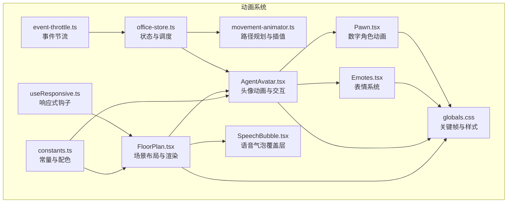
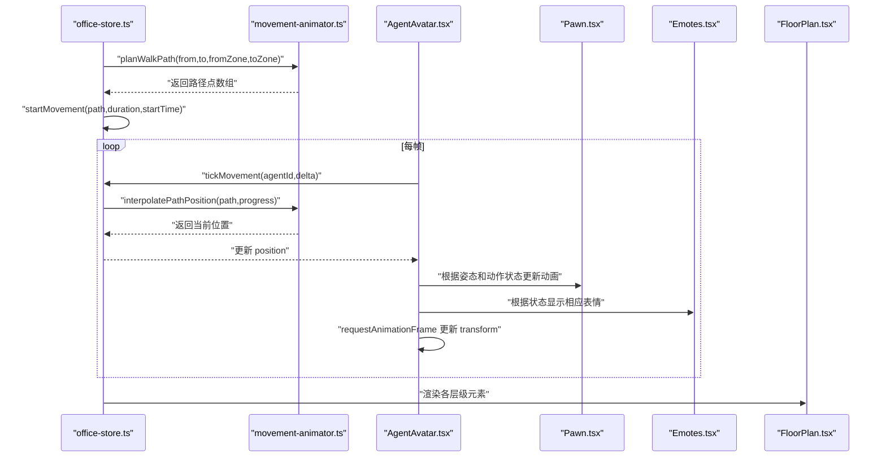
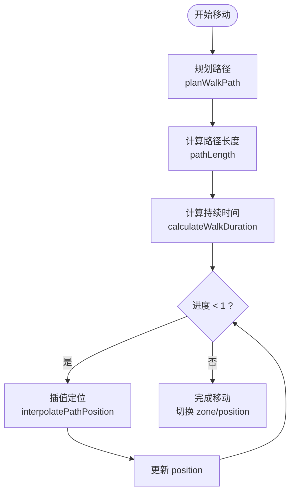
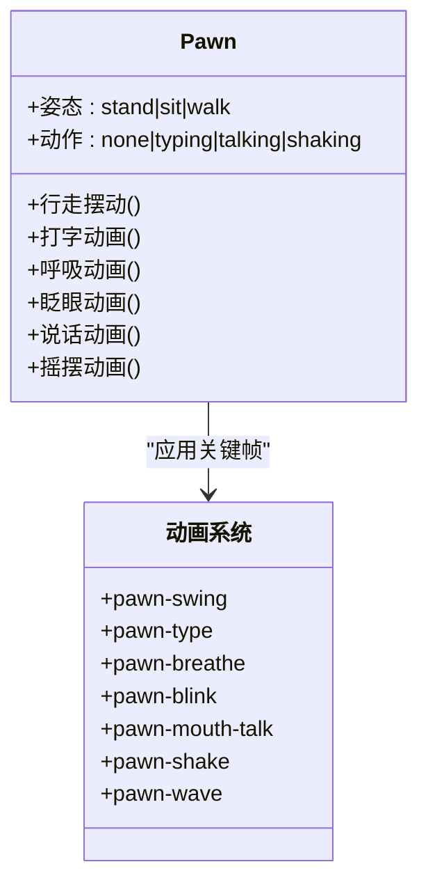
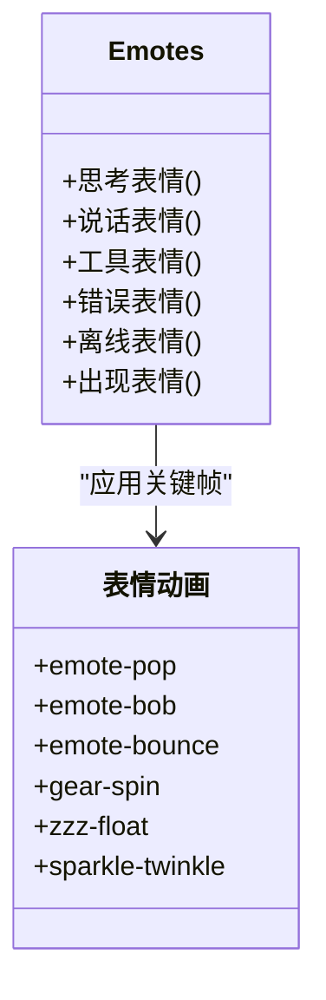
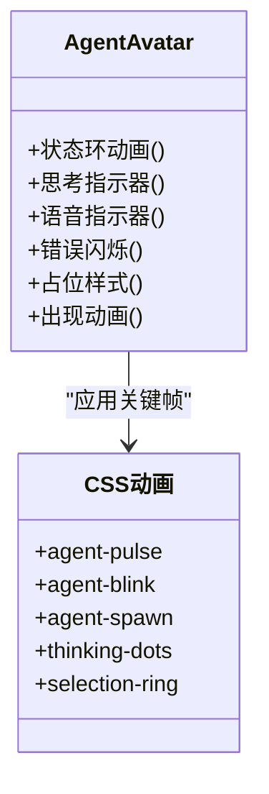
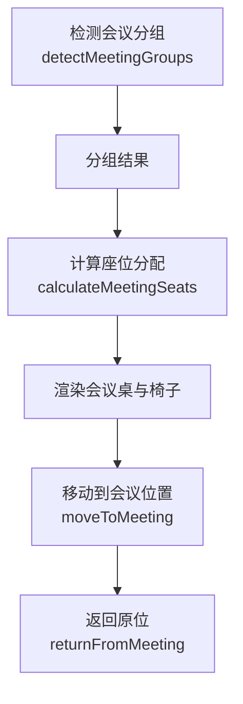
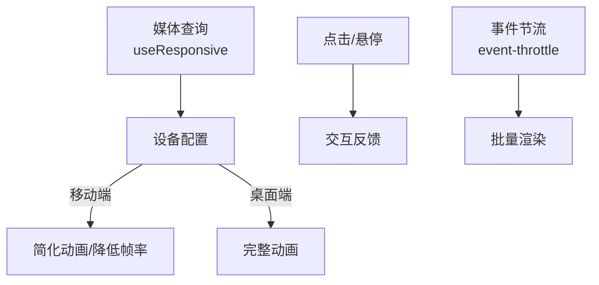
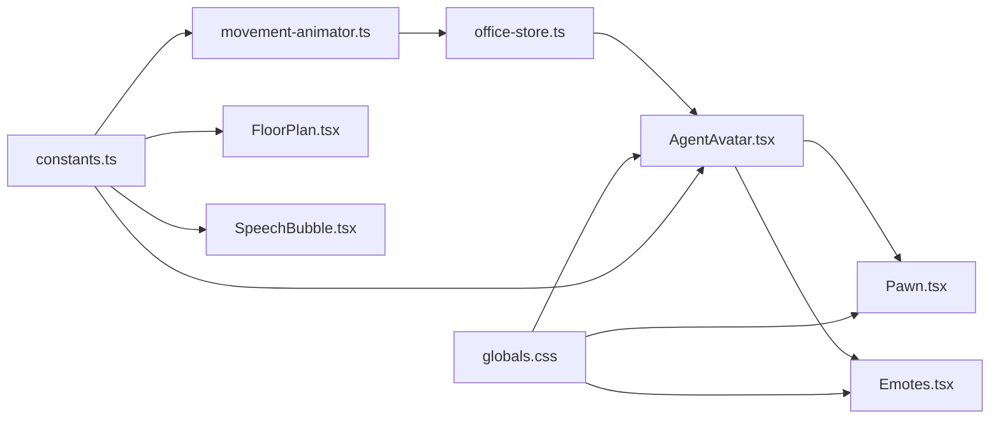

# 动画效果系统

<cite>
**本文档引用的文件**
- [README.md](file://README.md)
- [movement-animator.ts](file://src/lib/movement-animator.ts)
- [office-store.ts](file://src/store/office-store.ts)
- [AgentAvatar.tsx](file://src/components/office-2d/AgentAvatar.tsx)
- [Emotes.tsx](file://src/components/office-2d/Emotes.tsx)
- [Pawn.tsx](file://src/components/office-2d/Pawn.tsx)
- [FloorPlan.tsx](file://src/components/office-2d/FloorPlan.tsx)
- [constants.ts](file://src/lib/constants.ts)
- [globals.css](file://src/styles/globals.css)
- [useResponsive.ts](file://src/hooks/useResponsive.ts)
- [SpeechBubble.tsx](file://src/components/overlays/SpeechBubble.tsx)
- [event-throttle.ts](file://src/lib/event-throttle.ts)
</cite>

## 更新摘要
**变更内容**
- 新增完整的Pawn数字角色动画系统，包括行走、打字、呼吸、眨眼、说话、摇摆等动画
- 新增表情系统，支持思考、说话、工具使用、错误、离线、出现等表情动画
- 在globals.css中添加了emote-pop、emote-bob、emote-bounce、gear-spin、zzz-float、sparkle-twinkle等CSS动画效果
- 更新AgentAvatar.tsx以集成Pawn和表情系统
- 扩展了动画引擎以支持新的Pawn动画状态

## 目录
1. [简介](#简介)
2. [项目结构](#项目结构)
3. [核心组件](#核心组件)
4. [架构总览](#架构总览)
5. [详细组件分析](#详细组件分析)
6. [依赖关系分析](#依赖关系分析)
7. [性能考虑](#性能考虑)
8. [故障排除指南](#故障排除指南)
9. [结论](#结论)

## 简介
本系统为 OpenClaw Office 的动画效果子系统，负责在等距投影的虚拟办公室场景中实现智能体的各类动画效果。系统涵盖移动动画（从一个位置到另一个位置的平滑过渡）、状态切换动画（空闲到工作的状态变化）、协作动画（智能体间的互动效果）、会议室动画（会议开始和结束的场景变化），以及全新的Pawn数字角色动画和表情系统。动画引擎采用路径规划、插值算法、requestAnimationFrame 驱动的时间推进机制，配合 CSS 动画与 SVG 变换实现流畅的视觉体验。

## 项目结构
动画相关代码主要分布在以下模块：
- 路径与运动：src/lib/movement-animator.ts
- 状态与调度：src/store/office-store.ts
- 数字角色：src/components/office-2d/Pawn.tsx
- 表情系统：src/components/office-2d/Emotes.tsx
- 视觉呈现：src/components/office-2d/AgentAvatar.tsx、src/components/office-2d/FloorPlan.tsx
- 样式与关键帧：src/styles/globals.css
- 响应式与性能：src/hooks/useResponsive.ts、src/lib/event-throttle.ts
- 交互与覆盖层：src/components/overlays/SpeechBubble.tsx



**图表来源**
- [movement-animator.ts:1-163](file://src/lib/movement-animator.ts#L1-L163)
- [office-store.ts:1-200](file://src/store/office-store.ts#L1-L200)
- [Pawn.tsx:1-344](file://src/components/office-2d/Pawn.tsx#L1-L344)
- [Emotes.tsx:1-239](file://src/components/office-2d/Emotes.tsx#L1-L239)
- [AgentAvatar.tsx:1-268](file://src/components/office-2d/AgentAvatar.tsx#L1-L268)
- [FloorPlan.tsx:1-686](file://src/components/office-2d/FloorPlan.tsx#L1-L686)
- [SpeechBubble.tsx:1-185](file://src/components/overlays/SpeechBubble.tsx#L1-L185)
- [useResponsive.ts:1-42](file://src/hooks/useResponsive.ts#L1-L42)
- [event-throttle.ts:47-70](file://src/lib/event-throttle.ts#L47-L70)
- [globals.css:1-336](file://src/styles/globals.css#L1-L336)
- [constants.ts:1-141](file://src/lib/constants.ts#L1-L141)

**章节来源**
- [README.md:1-316](file://README.md#L1-L316)
- [movement-animator.ts:1-163](file://src/lib/movement-animator.ts#L1-L163)
- [office-store.ts:1-200](file://src/store/office-store.ts#L1-L200)

## 核心组件
- 路径规划与插值：提供从起点到终点的走廊穿越路径、路径长度计算、基于距离比例的插值定位，以及最小持续时间保证。
- 状态驱动的移动：通过 store 的 movement 字段描述一次移动的轨迹、进度、起始时间与目标区域；tickMovement 每帧推进进度并更新位置。
- 数字角色动画：Pawn组件提供完整的数字角色系统，包括行走、打字、呼吸、眨眼、说话、摇摆等动画，支持不同的姿态和动作状态。
- 表情系统：Emotes组件提供多种表情动画，包括思考云朵、说话气泡、工具齿轮、错误感叹号、离线Zzz、出现火花等。
- 头像动画与交互：基于 requestAnimationFrame 的循环，结合walk bob效果、缩放过渡、状态环动画、悬停与点击交互。
- 场景渲染：按层级绘制建筑外壳、走廊地砖、分区墙、门洞、家具与智能体，支持会议分组与座位分配。
- 语音气泡覆盖层：根据智能体状态显示/隐藏，支持展开/收起与视口内定位。
- 响应式与性能：媒体查询驱动的响应式判断，事件节流减少高频更新带来的性能压力。

**章节来源**
- [movement-animator.ts:85-163](file://src/lib/movement-animator.ts#L85-L163)
- [office-store.ts:504-580](file://src/store/office-store.ts#L504-L580)
- [Pawn.tsx:1-344](file://src/components/office-2d/Pawn.tsx#L1-L344)
- [Emotes.tsx:1-239](file://src/components/office-2d/Emotes.tsx#L1-L239)
- [AgentAvatar.tsx:46-95](file://src/components/office-2d/AgentAvatar.tsx#L46-L95)
- [FloorPlan.tsx:20-278](file://src/components/office-2d/FloorPlan.tsx#L20-L278)
- [SpeechBubble.tsx:10-185](file://src/components/overlays/SpeechBubble.tsx#L10-L185)
- [useResponsive.ts:9-42](file://src/hooks/useResponsive.ts#L9-L42)
- [event-throttle.ts:47-70](file://src/lib/event-throttle.ts#L47-L70)

## 架构总览
动画系统遵循"状态驱动 + 时间推进 + 视觉渲染"的分层架构：
- 状态层：Zustand store 维护 agents、movement、zone、position 等状态。
- 运动层：movement-animator 提供路径规划与插值；store 的 startMovement/completeMovement/tickMovement 管理生命周期。
- 角色层：Pawn组件管理数字角色的完整动画系统；Emotes组件提供表情动画。
- 视觉层：AgentAvatar整合Pawn和表情系统，使用requestAnimationFrame驱动变换；FloorPlan按层级渲染场景；globals.css定义关键帧。
- 交互层：AgentAvatar处理点击选择、悬停提示；SpeechBubble提供语音气泡交互；useResponsive适配不同设备。



**图表来源**
- [office-store.ts:504-580](file://src/store/office-store.ts#L504-L580)
- [movement-animator.ts:85-163](file://src/lib/movement-animator.ts#L85-L163)
- [AgentAvatar.tsx:46-95](file://src/components/office-2d/AgentAvatar.tsx#L46-L95)
- [Pawn.tsx:1-344](file://src/components/office-2d/Pawn.tsx#L1-L344)
- [Emotes.tsx:1-239](file://src/components/office-2d/Emotes.tsx#L1-L239)
- [FloorPlan.tsx:20-278](file://src/components/office-2d/FloorPlan.tsx#L20-L278)

## 详细组件分析

### 移动动画引擎
- 路径规划：在同一区域直接返回两点；跨区域通过门点与走廊中心连接，形成"起点→门点→走廊→门点→终点"的折线路径。
- 路径长度与持续时间：按路径总长度除以行走速度得到自然时长，并与最小持续时间取最大值，保证动画可观测性。
- 插值定位：按总长度的比例累计距离，在线段上进行线性插值，确保匀速但按距离比例前进。
- 进度推进：每帧将 delta 除以 duration 得到进度增量，累加至 progress，超过 1 时完成移动并切换 zone 与 position。



**图表来源**
- [movement-animator.ts:85-163](file://src/lib/movement-animator.ts#L85-L163)
- [office-store.ts:504-580](file://src/store/office-store.ts#L504-L580)

**章节来源**
- [movement-animator.ts:85-163](file://src/lib/movement-animator.ts#L85-L163)
- [office-store.ts:504-580](file://src/store/office-store.ts#L504-L580)

### Pawn数字角色动画系统
- 姿态管理：支持站立(stand)、坐着(sit)、行走(walk)三种基本姿态，根据智能体状态自动切换。
- 动作系统：支持无动作(none)、打字(typing)、说话(talking)、摇摆(shaking)四种动作状态。
- 关键动画：
  - 行走摆动(pawn-swing)：腿部围绕髋关节旋转，左右腿交替摆动
  - 打字动画(pawn-type)：手部快速交替上下移动
  - 呼吸动画(pawn-breathe)：躯干轻微起伏
  - 眨眼动画(pawn-blink)：眼睛定时眨动
  - 说话动画(pawn-mouth-talk)：嘴巴开合
  - 摇摆动画(pawn-shake)：整体轻微震动
  - 手势动画(pawn-wave)：说话时抬起手臂挥手



**图表来源**
- [Pawn.tsx:1-344](file://src/components/office-2d/Pawn.tsx#L1-L344)
- [globals.css:115-200](file://src/styles/globals.css#L115-L200)

**章节来源**
- [Pawn.tsx:1-344](file://src/components/office-2d/Pawn.tsx#L1-L344)
- [globals.css:115-200](file://src/styles/globals.css#L115-L200)

### 表情系统
- 表情类型：思考云朵、说话气泡、工具齿轮、错误感叹号、离线Zzz、出现火花六种表情。
- 动画组合：每个表情都有独特的动画序列，如emote-pop弹出、emote-bob摆动、emote-bounce弹跳等。
- 关键动画：
  - 弹出动画(emote-pop)：从小到大逐渐显现
  - 摆动画(emote-bob)：缓慢上下浮动
  - 旋转动画(gear-spin)：持续360度旋转
  - 弹跳动画(emote-bounce)：先上升后回弹
  - 浮动画(zzz-float)：向上飘浮并渐隐
  - 闪烁动画(sparkle-twinkle)：缩放和旋转交替



**图表来源**
- [Emotes.tsx:1-239](file://src/components/office-2d/Emotes.tsx#L1-L239)
- [globals.css:201-272](file://src/styles/globals.css#L201-L272)

**章节来源**
- [Emotes.tsx:1-239](file://src/components/office-2d/Emotes.tsx#L1-L239)
- [globals.css:201-272](file://src/styles/globals.css#L201-L272)

### 状态切换动画
- 状态环动画：根据状态类型应用不同的 CSS 动画（脉冲、闪烁、生成/消亡），在行走或占位状态下禁用动态效果。
- 思考指示器：三点按阶段延迟的脉冲动画，与状态环区分。
- 语音指示器：聊天气泡图标缩放与透明度交替，体现说话状态。
- 错误与占位：错误状态使用闪烁关键帧；占位智能体使用虚线描边与较低不透明度。
- 出现动画：智能体出现时使用agent-spawn缩放动画。



**图表来源**
- [AgentAvatar.tsx:259-305](file://src/components/office-2d/AgentAvatar.tsx#L259-L305)
- [globals.css:47-111](file://src/styles/globals.css#L47-L111)
- [globals.css:273-285](file://src/styles/globals.css#L273-L285)

**章节来源**
- [AgentAvatar.tsx:259-305](file://src/components/office-2d/AgentAvatar.tsx#L259-L305)
- [globals.css:47-111](file://src/styles/globals.css#L47-L111)
- [globals.css:273-285](file://src/styles/globals.css#L273-L285)

### 协作动画（智能体间连线）
- 连接线渲染：根据 collaboration links 的强度绘制连接线，随状态变化产生脉冲效果。
- 交互提示：连线采用带阴影的 SVG，鼠标悬停时增强对比度，便于识别协作关系。

```mermaid
sequenceDiagram
participant Store as "office-store.ts"
participant Scene as "FloorPlan.tsx"
participant Link as "ConnectionLine"
Store->>Scene : "提供 links 列表"
Scene->>Link : "为每对 agent 渲染连线"
Link-->>Scene : "根据强度绘制"
```

**图表来源**
- [FloorPlan.tsx:242-257](file://src/components/office-2d/FloorPlan.tsx#L242-L257)

**章节来源**
- [FloorPlan.tsx:242-257](file://src/components/office-2d/FloorPlan.tsx#L242-L257)

### 会议室动画
- 会议分组：detectMeetingGroups 基于协作关系与 agent 位置进行分组，每组渲染一张会议桌与对应座位。
- 座位分配：calculateMeetingSeats 依据分组内的 agent 位置分配坐席，支持多桌场景。
- 空闲状态：无会议时渲染默认单桌与空椅子装饰，保持场景丰富度。
- 会议移动：moveToMeeting 保存原始位置并触发移动动画；returnFromMeeting 恢复原位并返回工位或临时工位。



**图表来源**
- [FloorPlan.tsx:72-100](file://src/components/office-2d/FloorPlan.tsx#L72-L100)
- [office-store.ts:469-502](file://src/store/office-store.ts#L469-L502)

**章节来源**
- [FloorPlan.tsx:72-100](file://src/components/office-2d/FloorPlan.tsx#L72-L100)
- [office-store.ts:469-502](file://src/store/office-store.ts#L469-L502)

### 响应式动画与交互
- 响应式适配：useResponsive 基于媒体查询判断设备类型，可用于在移动端简化动画复杂度或降低帧率。
- 交互反馈：AgentAvatar 支持点击选择、悬停高亮与提示框；SpeechBubble 提供展开/收起与视口内定位，避免遮挡。
- 事件节流：event-throttle 使用 requestAnimationFrame 批处理高频事件，减少不必要的重绘与布局抖动。



**图表来源**
- [useResponsive.ts:9-42](file://src/hooks/useResponsive.ts#L9-L42)
- [AgentAvatar.tsx:97-115](file://src/components/office-2d/AgentAvatar.tsx#L97-L115)
- [SpeechBubble.tsx:17-92](file://src/components/overlays/SpeechBubble.tsx#L17-L92)
- [event-throttle.ts:47-70](file://src/lib/event-throttle.ts#L47-L70)

**章节来源**
- [useResponsive.ts:9-42](file://src/hooks/useResponsive.ts#L9-L42)
- [AgentAvatar.tsx:97-115](file://src/components/office-2d/AgentAvatar.tsx#L97-L115)
- [SpeechBubble.tsx:17-92](file://src/components/overlays/SpeechBubble.tsx#L17-L92)
- [event-throttle.ts:47-70](file://src/lib/event-throttle.ts#L47-L70)

## 依赖关系分析
- movement-animator.ts 依赖 constants.ts 中的办公区域与尺寸常量，提供路径规划与插值函数。
- office-store.ts 依赖 movement-animator.ts 的路径与插值能力，维护 agents、movement、zone 等状态。
- AgentAvatar.tsx 依赖 store 的 tickMovement，使用 requestAnimationFrame 驱动 transform 更新，集成了Pawn和Emotes组件。
- Pawn.tsx 依赖 globals.css 中的Pawn动画关键帧，根据姿态和动作状态应用相应的CSS动画。
- Emotes.tsx 依赖 globals.css 中的表情动画关键帧，根据智能体状态显示相应的表情。
- FloorPlan.tsx 依赖 constants.ts 的颜色与尺寸，按层级渲染场景与家具。
- globals.css 定义所有关键帧，被Pawn、Emotes、AgentAvatar等组件引用。
- SpeechBubble.tsx 依赖 constants.ts 的 SVG 尺寸，计算相对百分比定位。



**图表来源**
- [constants.ts:1-141](file://src/lib/constants.ts#L1-L141)
- [movement-animator.ts:1-163](file://src/lib/movement-animator.ts#L1-L163)
- [office-store.ts:1-200](file://src/store/office-store.ts#L1-L200)
- [AgentAvatar.tsx:1-268](file://src/components/office-2d/AgentAvatar.tsx#L1-L268)
- [Pawn.tsx:1-344](file://src/components/office-2d/Pawn.tsx#L1-L344)
- [Emotes.tsx:1-239](file://src/components/office-2d/Emotes.tsx#L1-L239)
- [FloorPlan.tsx:1-686](file://src/components/office-2d/FloorPlan.tsx#L1-L686)
- [globals.css:1-336](file://src/styles/globals.css#L1-L336)
- [SpeechBubble.tsx:1-185](file://src/components/overlays/SpeechBubble.tsx#L1-L185)

**章节来源**
- [constants.ts:1-141](file://src/lib/constants.ts#L1-L141)
- [movement-animator.ts:1-163](file://src/lib/movement-animator.ts#L1-L163)
- [office-store.ts:1-200](file://src/store/office-store.ts#L1-L200)
- [AgentAvatar.tsx:1-268](file://src/components/office-2d/AgentAvatar.tsx#L1-L268)
- [Pawn.tsx:1-344](file://src/components/office-2d/Pawn.tsx#L1-L344)
- [Emotes.tsx:1-239](file://src/components/office-2d/Emotes.tsx#L1-L239)
- [FloorPlan.tsx:1-686](file://src/components/office-2d/FloorPlan.tsx#L1-L686)
- [globals.css:1-336](file://src/styles/globals.css#L1-L336)
- [SpeechBubble.tsx:1-185](file://src/components/overlays/SpeechBubble.tsx#L1-L185)

## 性能考虑
- 帧率控制：使用 requestAnimationFrame 驱动动画循环，避免固定间隔导致的卡顿；每帧仅更新有 movement 的智能体。
- 路径与插值：路径长度与插值计算为 O(n)（n 为路径点数），在合理范围内保持高效；最小持续时间避免短距离动画过快不可见。
- 事件节流：高频事件通过 event-throttle 批处理，减少渲染压力。
- 响应式降级：在移动端可降低动画复杂度或帧率，使用 useResponsive 获取设备类型。
- 层级渲染：FloorPlan 按层级绘制，避免重复计算；占位与未确认智能体使用半透明或虚线，降低视觉负担。
- 动画优化：Pawn和Emotes使用CSS动画而非JavaScript动画，减少DOM操作开销；动画使用transform属性而非改变布局属性。

## 故障排除指南
- 移动动画不生效
  - 检查 store 的 movement 字段是否正确设置，startMovement 是否被调用。
  - 确认 tickMovement 是否在每帧被调用，且 delta 传入正确。
  - 参考：[office-store.ts:504-580](file://src/store/office-store.ts#L504-L580)
- 位置插值异常
  - 确保路径非空且 progress 在 [0,1] 区间，插值函数对边界进行钳制。
  - 参考：[movement-animator.ts:120-163](file://src/lib/movement-animator.ts#L120-L163)
- Pawn动画卡顿
  - 检查 requestAnimationFrame 循环是否被中断，gRef 是否存在。
  - 确认CSS动画关键帧是否正确加载，transformBox和transformOrigin设置是否正确。
  - 参考：[AgentAvatar.tsx:46-95](file://src/components/office-2d/AgentAvatar.tsx#L46-L95)
- 表情动画异常
  - 检查Emotes组件的状态映射是否正确，CSS动画名称是否匹配。
  - 确认globals.css中的动画关键帧定义是否存在且正确。
  - 参考：[Emotes.tsx:170-183](file://src/components/office-2d/Emotes.tsx#L170-L183)
- 会议室座位错乱
  - 确认 detectMeetingGroups 与 calculateMeetingSeats 的输入一致，分组与座位映射正确。
  - 参考：[FloorPlan.tsx:72-100](file://src/components/office-2d/FloorPlan.tsx#L72-L100)
- 语音气泡定位异常
  - 检查 SVG 尺寸常量与百分比计算，确保面板在视口内。
  - 参考：[SpeechBubble.tsx:30-92](file://src/components/overlays/SpeechBubble.tsx#L30-L92)

**章节来源**
- [office-store.ts:504-580](file://src/store/office-store.ts#L504-L580)
- [movement-animator.ts:120-163](file://src/lib/movement-animator.ts#L120-L163)
- [AgentAvatar.tsx:46-95](file://src/components/office-2d/AgentAvatar.tsx#L46-L95)
- [Emotes.tsx:170-183](file://src/components/office-2d/Emotes.tsx#L170-L183)
- [FloorPlan.tsx:72-100](file://src/components/office-2d/FloorPlan.tsx#L72-L100)
- [SpeechBubble.tsx:30-92](file://src/components/overlays/SpeechBubble.tsx#L30-L92)

## 结论
动画效果系统通过清晰的分层设计与高效的实现机制，实现了从路径规划、状态驱动到视觉渲染的完整闭环。新增的Pawn数字角色动画系统和表情系统进一步丰富了虚拟办公室的交互体验。移动动画、状态切换、协作连线、会议室场景以及Pawn动画均具备良好的可扩展性与性能表现。结合响应式与交互反馈，系统在不同设备与使用场景下均能提供流畅且直观的动画体验。