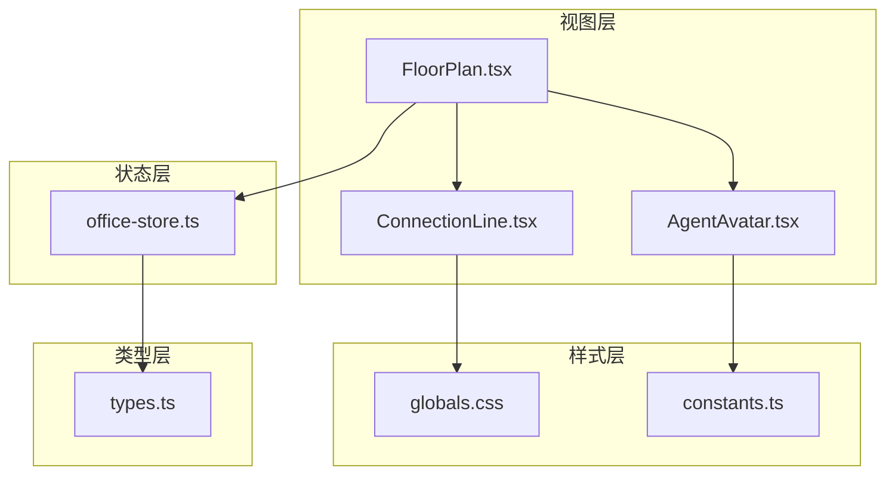
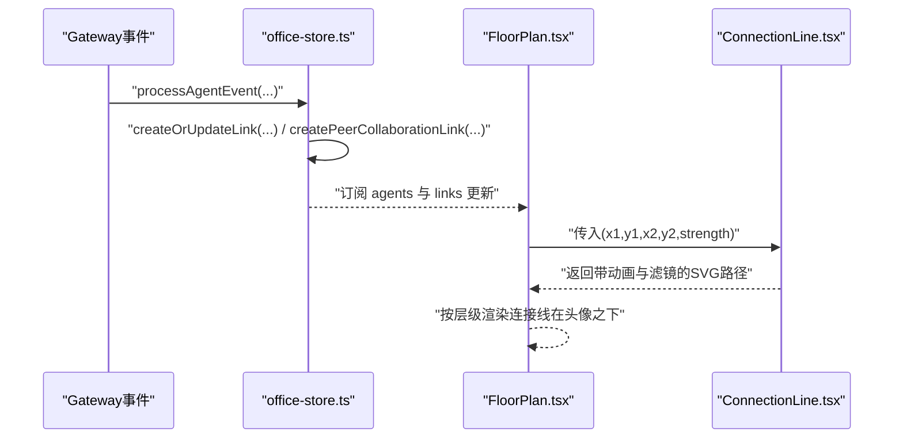
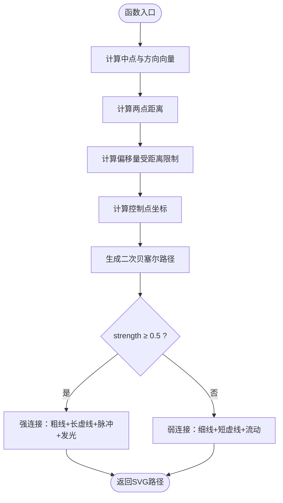
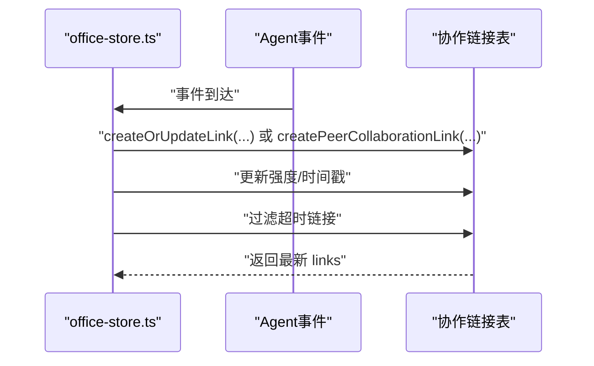
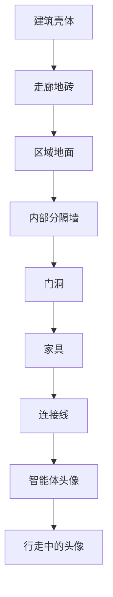
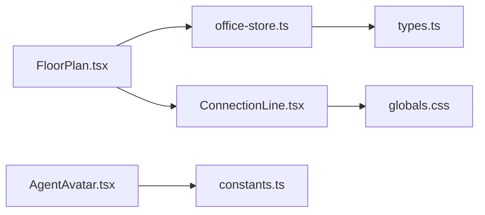

# 协作关系可视化

<cite>
**本文引用的文件**
- [ConnectionLine.tsx](file://src/components/office-2d/ConnectionLine.tsx)
- [FloorPlan.tsx](file://src/components/office-2d/FloorPlan.tsx)
- [AgentAvatar.tsx](file://src/components/office-2d/AgentAvatar.tsx)
- [office-store.ts](file://src/store/office-store.ts)
- [constants.ts](file://src/lib/constants.ts)
- [globals.css](file://src/styles/globals.css)
- [types.ts](file://src/gateway/types.ts)
</cite>

## 目录
1. [简介](#简介)
2. [项目结构](#项目结构)
3. [核心组件](#核心组件)
4. [架构总览](#架构总览)
5. [详细组件分析](#详细组件分析)
6. [依赖分析](#依赖分析)
7. [性能考虑](#性能考虑)
8. [故障排查指南](#故障排查指南)
9. [结论](#结论)
10. [附录](#附录)

## 简介
本技术文档聚焦于协作关系可视化系统中的“Agent间消息传递的可视化连接线”实现，围绕以下目标展开：
- 可视化连接线绘制算法：起点与终点坐标获取、曲线路径计算、弯曲效果实现
- 连接线强度（strength）参数对视觉效果的影响：线宽、透明度、虚线样式、发光与阴影等
- 协作网络的实时更新机制：状态变化与新增协作关系时的自动重绘与动画
- 连接线的层级管理：确保连接线位于智能体头像之下，避免遮挡
- 样式定制、动画过渡与性能优化策略

## 项目结构
协作关系可视化主要涉及以下模块：
- 视图层：FloorPlan 负责整体布局与分层渲染；AgentAvatar 渲染智能体头像；ConnectionLine 绘制连接线
- 状态层：office-store 维护 agents 与 links，并提供事件处理与协作关系维护逻辑
- 样式层：globals.css 提供动画与滤镜效果；constants.ts 提供主题色与尺寸常量
- 类型层：types.ts 定义 VisualAgent 与 CollaborationLink 等数据结构

**图表来源**
- [FloorPlan.tsx:20-278](file://src/components/office-2d/FloorPlan.tsx#L20-L278)
- [AgentAvatar.tsx:15-255](file://src/components/office-2d/AgentAvatar.tsx#L15-L255)
- [ConnectionLine.tsx:9-53](file://src/components/office-2d/ConnectionLine.tsx#L9-L53)
- [office-store.ts:217-370](file://src/store/office-store.ts#L217-L370)
- [globals.css:31-120](file://src/styles/globals.css#L31-L120)
- [constants.ts:68-130](file://src/lib/constants.ts#L68-L130)
- [types.ts:166-208](file://src/gateway/types.ts#L166-L208)

**章节来源**
- [FloorPlan.tsx:20-278](file://src/components/office-2d/FloorPlan.tsx#L20-L278)
- [office-store.ts:217-370](file://src/store/office-store.ts#L217-L370)

## 核心组件
- ConnectionLine：根据起点、终点与强度参数绘制贝塞尔曲线连接线，包含背景光晕与主线条，支持脉冲与流动动画
- FloorPlan：负责将所有元素按层级渲染，其中协作连接线位于第6层，智能体头像位于第7层及以上，确保连接线在头像之下
- AgentAvatar：渲染智能体头像及其状态指示器，支持行走动画与悬停提示
- office-store：维护 agents 与 links，提供协作关系的创建、衰减与更新逻辑
- globals.css：提供连接线动画（脉冲、流动）、滤镜（发光、阴影）等样式
- constants.ts：提供主题色、头像尺寸、区域颜色等常量
- types.ts：定义 VisualAgent 与 CollaborationLink 的数据结构

**章节来源**
- [ConnectionLine.tsx:9-53](file://src/components/office-2d/ConnectionLine.tsx#L9-L53)
- [FloorPlan.tsx:242-272](file://src/components/office-2d/FloorPlan.tsx#L242-L272)
- [AgentAvatar.tsx:15-255](file://src/components/office-2d/AgentAvatar.tsx#L15-L255)
- [office-store.ts:1502-1532](file://src/store/office-store.ts#L1502-L1532)
- [globals.css:113-120](file://src/styles/globals.css#L113-L120)
- [constants.ts:68-130](file://src/lib/constants.ts#L68-L130)
- [types.ts:166-208](file://src/gateway/types.ts#L166-L208)

## 架构总览
协作关系可视化采用“状态驱动渲染”的架构模式：
- 状态源：office-store 维护 agents 与 links，并在事件处理中更新协作关系强度与生命周期
- 渲染源：FloorPlan 读取 agents 与 links，按层级渲染连接线与智能体头像
- 视觉表现：ConnectionLine 将强度映射为线宽、透明度、虚线样式与动画；globals.css 提供滤镜与动画

**图表来源**
- [office-store.ts:1502-1532](file://src/store/office-store.ts#L1502-L1532)
- [office-store.ts:1539-1577](file://src/store/office-store.ts#L1539-L1577)
- [FloorPlan.tsx:242-257](file://src/components/office-2d/FloorPlan.tsx#L242-L257)
- [ConnectionLine.tsx:9-53](file://src/components/office-2d/ConnectionLine.tsx#L9-L53)

## 详细组件分析

### 连接线绘制算法与强度映射
- 起点与终点坐标：来自 agents 中对应智能体的 position 字段，FloorPlan 在渲染时直接传入
- 曲线路径计算：使用中点、方向向量与距离计算偏移量，生成二次贝塞尔曲线控制点，形成平滑弯曲
- 弯曲效果：偏移量受距离限制，保证曲线在近距离时不过度弯曲
- 强度（strength）映射：
  - 线宽：strength ≥ 0.5 时线宽较大，否则较细
  - 透明度：最小阈值保障弱连接仍可见
  - 虚线样式：强连接使用较长的虚线段组合，弱连接使用较短段
  - 动画：强连接使用脉冲动画，弱连接使用流动动画
  - 滤镜：强连接带有发光与阴影，弱连接无阴影

**图表来源**
- [ConnectionLine.tsx:9-53](file://src/components/office-2d/ConnectionLine.tsx#L9-L53)

**章节来源**
- [ConnectionLine.tsx:9-53](file://src/components/office-2d/ConnectionLine.tsx#L9-L53)
- [FloorPlan.tsx:242-257](file://src/components/office-2d/FloorPlan.tsx#L242-L257)

### 协作网络实时更新机制
- 事件驱动：office-store 在处理 Agent 事件时，为参与会话的主 Agent 之间创建或更新协作链接，强度随活动增加并随时间衰减
- Peer 链接：当检测到主 Agent 间的直接协作（如 A2A 工具），创建独立的 peer 链接，初始强度高于阈值
- 链接生命周期：超过超时时间后从列表中清理，避免陈旧连接影响渲染

**图表来源**
- [office-store.ts:1502-1532](file://src/store/office-store.ts#L1502-L1532)
- [office-store.ts:1539-1577](file://src/store/office-store.ts#L1539-L1577)

**章节来源**
- [office-store.ts:1502-1532](file://src/store/office-store.ts#L1502-L1532)
- [office-store.ts:1539-1577](file://src/store/office-store.ts#L1539-L1577)
- [types.ts:200-208](file://src/gateway/types.ts#L200-L208)

### 层级管理与遮挡控制
- 层级划分：FloorPlan 中明确划分了多个渲染层级，连接线位于第6层，智能体头像位于第7层及以上
- 渲染顺序：通过 SVG 子节点顺序控制前后关系，确保连接线在头像之下，避免遮挡头像与状态指示器
- 交互与提示：头像层包含悬停提示与工具栏，连接线层不干扰用户交互

**图表来源**
- [FloorPlan.tsx:140-277](file://src/components/office-2d/FloorPlan.tsx#L140-L277)

**章节来源**
- [FloorPlan.tsx:140-277](file://src/components/office-2d/FloorPlan.tsx#L140-L277)

### 样式定制与动画过渡
- 主题色：constants.ts 提供明暗主题下的区域与状态颜色，连接线颜色统一使用主题色变量
- 动画：globals.css 定义了连接线脉冲与流动动画，以及头像状态动画；ConnectionLine 根据强度选择不同动画
- 滤镜：强连接线启用发光与阴影滤镜，弱连接不启用，以突出强关系
- 虚线样式：强连接使用较长虚线段组合，弱连接使用较短段，提升可读性

**章节来源**
- [globals.css:113-120](file://src/styles/globals.css#L113-L120)
- [ConnectionLine.tsx:44-49](file://src/components/office-2d/ConnectionLine.tsx#L44-L49)
- [constants.ts:68-76](file://src/lib/constants.ts#L68-L76)

## 依赖分析
- ConnectionLine 依赖：
  - props：起点、终点坐标与强度
  - 样式：globals.css 中的动画与滤镜
- FloorPlan 依赖：
  - 数据：agents 与 links（来自 office-store）
  - 渲染：按层级组织子节点
- office-store 依赖：
  - 类型：VisualAgent 与 CollaborationLink
  - 逻辑：事件解析、链接创建与衰减
- 样式与常量：
  - globals.css：动画与滤镜
  - constants.ts：主题色与尺寸

**图表来源**
- [ConnectionLine.tsx:9-53](file://src/components/office-2d/ConnectionLine.tsx#L9-L53)
- [FloorPlan.tsx:20-278](file://src/components/office-2d/FloorPlan.tsx#L20-L278)
- [office-store.ts:217-370](file://src/store/office-store.ts#L217-L370)
- [globals.css:31-120](file://src/styles/globals.css#L31-L120)
- [constants.ts:68-130](file://src/lib/constants.ts#L68-L130)
- [types.ts:166-208](file://src/gateway/types.ts#L166-L208)

**章节来源**
- [ConnectionLine.tsx:9-53](file://src/components/office-2d/ConnectionLine.tsx#L9-L53)
- [FloorPlan.tsx:20-278](file://src/components/office-2d/FloorPlan.tsx#L20-L278)
- [office-store.ts:217-370](file://src/store/office-store.ts#L217-L370)
- [globals.css:31-120](file://src/styles/globals.css#L31-L120)
- [constants.ts:68-130](file://src/lib/constants.ts#L68-L130)
- [types.ts:166-208](file://src/gateway/types.ts#L166-L208)

## 性能考虑
- 渲染开销控制：
  - 连接线数量：仅渲染当前存在的协作链接，且在事件超时后及时清理
  - 路径计算：使用轻量的数学运算（中点、方向、距离、控制点），避免复杂几何计算
- 动画与滤镜：
  - 使用 CSS 动画与滤镜，交由浏览器硬件加速渲染
  - 强连接线启用发光与阴影，弱连接不启用，减少不必要的滤镜开销
- 状态更新：
  - office-store 通过事件驱动更新链接强度，避免频繁全量重算
- 层级渲染：
  - 通过层级划分减少重绘范围，连接线与头像分别位于不同层级，降低相互影响

[本节为通用性能建议，无需特定文件引用]

## 故障排查指南
- 连接线不显示或显示异常
  - 检查 agents 中是否存在缺失的 sourceId/targetId
  - 确认 links 列表未被过期清理
  - 核对 FloorPlan 渲染链路是否正确传入坐标与强度
- 强度变化不明显
  - 检查强度阈值（0.5）与线宽/透明度映射逻辑
  - 确认动画是否生效（脉冲 vs 流动）
- 动画卡顿
  - 检查是否有过多连接线同时播放动画
  - 减少滤镜使用或降低动画频率
- 层级遮挡问题
  - 确认连接线位于头像之下（第6层在第7层之前）

**章节来源**
- [FloorPlan.tsx:242-257](file://src/components/office-2d/FloorPlan.tsx#L242-L257)
- [office-store.ts:1502-1532](file://src/store/office-store.ts#L1502-L1532)
- [ConnectionLine.tsx:21-23](file://src/components/office-2d/ConnectionLine.tsx#L21-L23)

## 结论
该协作关系可视化系统通过“状态驱动 + 层级渲染 + 轻量动画”的设计，在保证视觉表达力的同时兼顾性能与可维护性。连接线绘制算法简洁高效，强度参数与视觉属性映射直观，配合实时更新机制与层级管理，实现了清晰、动态的协作网络可视化。

## 附录
- 关键数据结构
  - VisualAgent：包含位置、状态、所属区域等字段
  - CollaborationLink：包含 sourceId、targetId、sessionKey、strength、lastActivityAt、isPeer 等字段
- 常用常量
  - 头像半径、选中半径、状态颜色、区域颜色等

**章节来源**
- [types.ts:166-208](file://src/gateway/types.ts#L166-L208)
- [constants.ts:68-130](file://src/lib/constants.ts#L68-L130)