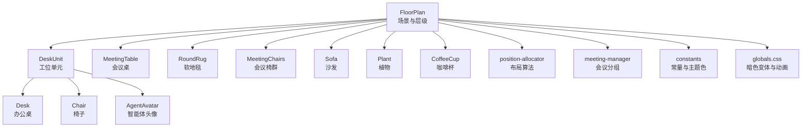
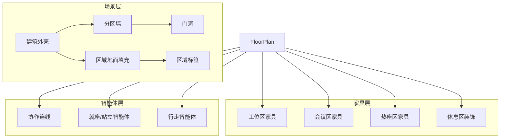
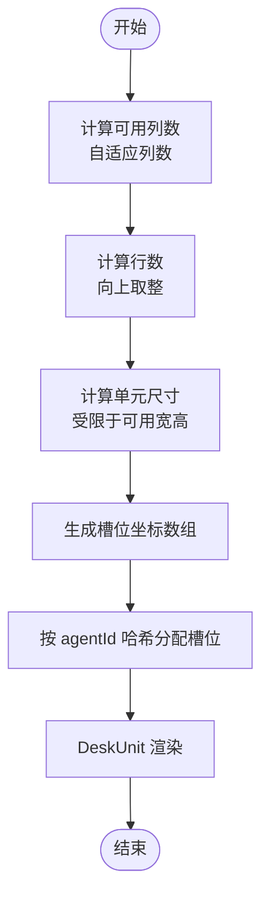
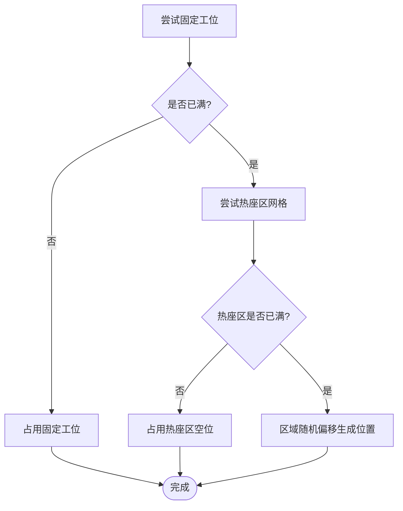
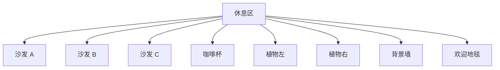
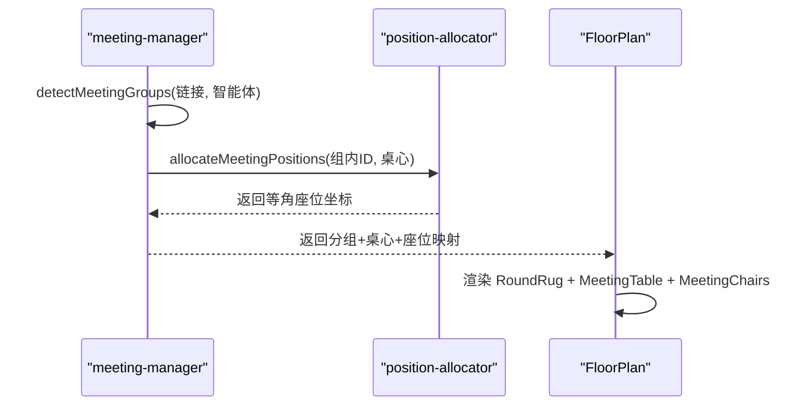
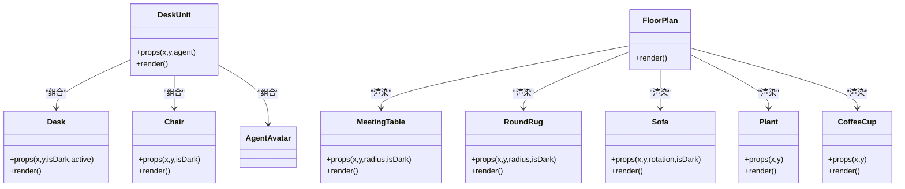
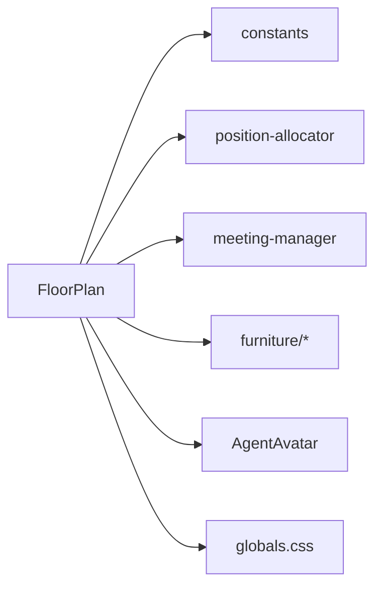

# 家具装饰系统

<cite>
**本文引用的文件**
- [src/components/office-2d/furniture/index.ts](file://src/components/office-2d/furniture/index.ts)
- [src/components/office-2d/FloorPlan.tsx](file://src/components/office-2d/FloorPlan.tsx)
- [src/components/office-2d/DeskUnit.tsx](file://src/components/office-2d/DeskUnit.tsx)
- [src/components/office-2d/AgentAvatar.tsx](file://src/components/office-2d/AgentAvatar.tsx)
- [src/components/office-2d/furniture/Desk.tsx](file://src/components/office-2d/furniture/Desk.tsx)
- [src/components/office-2d/furniture/Chair.tsx](file://src/components/office-2d/furniture/Chair.tsx)
- [src/components/office-2d/furniture/MeetingTable.tsx](file://src/components/office-2d/furniture/MeetingTable.tsx)
- [src/components/office-2d/furniture/Sofa.tsx](file://src/components/office-2d/furniture/Sofa.tsx)
- [src/components/office-2d/furniture/Plant.tsx](file://src/components/office-2d/furniture/Plant.tsx)
- [src/components/office-2d/furniture/CoffeeCup.tsx](file://src/components/office-2d/furniture/CoffeeCup.tsx)
- [src/lib/position-allocator.ts](file://src/lib/position-allocator.ts)
- [src/lib/constants.ts](file://src/lib/constants.ts)
- [src/store/meeting-manager.ts](file://src/store/meeting-manager.ts)
- [src/styles/globals.css](file://src/styles/globals.css)
- [src/components/office-2d/__tests__/DeskUnit.test.tsx](file://src/components/office-2d/__tests__/DeskUnit.test.tsx)
</cite>

## 目录
1. [简介](#简介)
2. [项目结构](#项目结构)
3. [核心组件](#核心组件)
4. [架构总览](#架构总览)
5. [详细组件分析](#详细组件分析)
6. [依赖分析](#依赖分析)
7. [性能考量](#性能考量)
8. [故障排查指南](#故障排查指南)
9. [结论](#结论)
10. [附录](#附录)

## 简介
本技术文档面向"家具装饰系统"，系统性阐述办公空间中各类家具组件（桌椅、咖啡杯、办公桌、会议桌、沙发、植物）的SVG绘制与布局逻辑，并深入解析家具在不同区域的放置算法（工位区、热座区、休息区、会议室），以及家具装饰的层级管理、主题适配（深色/浅色）、复用机制、动态加载与性能优化策略。读者可据此快速理解并扩展该系统的家具渲染与交互行为。

**更新** 本次更新反映了家具装饰系统的重大改进：Desk.tsx和MeetingTable.tsx完全重设计，从简单的平面设计升级为详细的木质纹理，包含显示器、键盘、咖啡杯、便利贴等真实装饰元素；新增RoundRug组件提供会议桌下的软地毯；DeskUnit.tsx增强以显示代理活动状态。

## 项目结构
家具装饰系统主要位于 office-2d 子模块中，采用"功能域+组件化"的组织方式：
- 布局与场景：FloorPlan 负责整体楼层与区域划分、分区墙、门洞、地面纹理、协作连线与智能体头像渲染。
- 家具组件：furniture 目录下提供 Desk、Chair、MeetingTable、Sofa、Plant、CoffeeCup 等可复用的SVG组件。
- 单元与装配：DeskUnit 将"办公桌+椅子+智能体"组合为一个工位单元，统一管理渲染层级与状态。
- 布局算法：position-allocator 提供工位槽位计算、会议座位分配、休息区锚点等算法。
- 主题与样式：constants 定义区域与颜色、尺寸常量；globals.css 提供暗色变体与动画；FloorPlan 根据主题切换颜色与阴影。
- 会议编排：meeting-manager 负责检测协作关系并生成会议分组，结合布局算法输出座位映射。

**图表来源**
- [src/components/office-2d/FloorPlan.tsx:187-221](file://src/components/office-2d/FloorPlan.tsx#L187-L221)
- [src/components/office-2d/DeskUnit.tsx:13-44](file://src/components/office-2d/DeskUnit.tsx#L13-L44)
- [src/components/office-2d/furniture/Desk.tsx:9-110](file://src/components/office-2d/furniture/Desk.tsx#L9-L110)
- [src/components/office-2d/furniture/Chair.tsx:9-27](file://src/components/office-2d/furniture/Chair.tsx#L9-L27)
- [src/components/office-2d/furniture/MeetingTable.tsx:10-77](file://src/components/office-2d/furniture/MeetingTable.tsx#L10-L77)
- [src/components/office-2d/furniture/Sofa.tsx:10-32](file://src/components/office-2d/furniture/Sofa.tsx#L10-L32)
- [src/components/office-2d/furniture/Plant.tsx:8-19](file://src/components/office-2d/furniture/Plant.tsx#L8-L19)
- [src/components/office-2d/furniture/CoffeeCup.tsx:8-31](file://src/components/office-2d/furniture/CoffeeCup.tsx#L8-L31)
- [src/lib/position-allocator.ts:131-159](file://src/lib/position-allocator.ts#L131-L159)
- [src/store/meeting-manager.ts:32-96](file://src/store/meeting-manager.ts#L32-L96)
- [src/lib/constants.ts:23-58](file://src/lib/constants.ts#L23-L58)
- [src/styles/globals.css:1-152](file://src/styles/globals.css#L1-L152)

**章节来源**
- [src/components/office-2d/FloorPlan.tsx:108-278](file://src/components/office-2d/FloorPlan.tsx#L108-L278)
- [src/components/office-2d/furniture/index.ts:1-7](file://src/components/office-2d/furniture/index.ts#L1-L7)

## 核心组件
- 家具组件导出入口：furniture/index.ts 将各家具组件集中导出，便于统一引入与复用。
- 办公桌 Desk：**已重设计** 采用详细的木质纹理，包含温暖的木纹效果、显示器、键盘、咖啡杯和便利贴等真实装饰元素，支持深色/浅色主题和活动状态指示。
- 椅子 Chair：顶视背靠弧线与坐垫圆形，主题色随 isDark 切换。
- 会议桌 MeetingTable：**已重设计** 采用圆形桌面，带有径向渐变填充和木纹环装饰，中心装饰有打开的笔记本电脑和文件，增强真实感。
- 软地毯 RoundRug：**新增组件** 为会议桌提供圆形软地毯，使用径向渐变和阴影效果，提升空间层次感。
- 沙发 Sofa：长条框架+坐垫+靠包，支持旋转角度以适配不同朝向。
- 植物 Plant：花盆路径+多片叶子椭圆，营造绿意。
- 咖啡杯 CoffeeCup：托盘+杯身+咖啡液面+杯柄+蒸汽，细节丰富。
- 工位单元 DeskUnit：**已增强** 将 Desk、Chair 与 AgentAvatar 组合，使用 memo 优化渲染，并新增代理活动状态检测功能。
- FloorPlan：整体场景，负责区域划分、分区墙、门洞、地面纹理、协作连线与家具渲染层级。

**章节来源**
- [src/components/office-2d/furniture/index.ts:1-7](file://src/components/office-2d/furniture/index.ts#L1-L7)
- [src/components/office-2d/furniture/Desk.tsx:9-110](file://src/components/office-2d/furniture/Desk.tsx#L9-L110)
- [src/components/office-2d/furniture/Chair.tsx:9-27](file://src/components/office-2d/furniture/Chair.tsx#L9-L27)
- [src/components/office-2d/furniture/MeetingTable.tsx:10-77](file://src/components/office-2d/furniture/MeetingTable.tsx#L10-L77)
- [src/components/office-2d/furniture/Sofa.tsx:10-32](file://src/components/office-2d/furniture/Sofa.tsx#L10-L32)
- [src/components/office-2d/furniture/Plant.tsx:8-19](file://src/components/office-2d/furniture/Plant.tsx#L8-L19)
- [src/components/office-2d/furniture/CoffeeCup.tsx:8-31](file://src/components/office-2d/furniture/CoffeeCup.tsx#L8-L31)
- [src/components/office-2d/DeskUnit.tsx:13-50](file://src/components/office-2d/DeskUnit.tsx#L13-L50)
- [src/components/office-2d/FloorPlan.tsx:108-278](file://src/components/office-2d/FloorPlan.tsx#L108-L278)

## 架构总览
系统采用"场景层 + 家具层 + 智能体层"的分层渲染思路：
- 场景层（FloorPlan）：建筑外壳、内部隔墙、门洞、区域地面纹理与标签。
- 家具层（Layer 5/5a/5b）：按区域渲染家具，控制渲染顺序与遮挡关系。
- 智能体层（Layer 6/7/7b/8）：协作连线、静止/就座/行走中的智能体头像。

**图表来源**
- [src/components/office-2d/FloorPlan.tsx:140-277](file://src/components/office-2d/FloorPlan.tsx#L140-L277)

**章节来源**
- [src/components/office-2d/FloorPlan.tsx:108-278](file://src/components/office-2d/FloorPlan.tsx#L108-L278)

## 详细组件分析

### 工位区：办公桌分配与布局
- 计算策略：根据区域宽度自适应列数，优先横向填满，再扩展行数；保证最小桌面宽度，至少4列起步。
- 稳定映射：通过 agentId 的哈希映射到稳定槽位索引，确保同一智能体始终落在同一工位。
- 渲染装配：DeskUnit 在每个槽位渲染 Desk、Chair，并在有智能体时叠加 AgentAvatar。

**图表来源**
- [src/lib/position-allocator.ts:115-159](file://src/lib/position-allocator.ts#L115-L159)
- [src/lib/position-allocator.ts:165-167](file://src/lib/position-allocator.ts#L165-L167)
- [src/components/office-2d/DeskUnit.tsx:13-44](file://src/components/office-2d/DeskUnit.tsx#L13-L44)
- [src/components/office-2d/FloorPlan.tsx:428-464](file://src/components/office-2d/FloorPlan.tsx#L428-L464)

**章节来源**
- [src/lib/position-allocator.ts:115-159](file://src/lib/position-allocator.ts#L115-L159)
- [src/lib/position-allocator.ts:165-167](file://src/lib/position-allocator.ts#L165-L167)
- [src/components/office-2d/DeskUnit.tsx:13-44](file://src/components/office-2d/DeskUnit.tsx#L13-L44)
- [src/components/office-2d/FloorPlan.tsx:428-464](file://src/components/office-2d/FloorPlan.tsx#L428-L464)

### 热座区：灵活布局与兜底策略
- 算法要点：当固定工位已满或主智能体不可用时，后备至热座区网格；若仍满，则在区域内随机偏移生成近似均匀分布。
- 兜底位置：fallback 区域为热座区，避免智能体无处安放。

**图表来源**
- [src/lib/position-allocator.ts:51-82](file://src/lib/position-allocator.ts#L51-L82)

**章节来源**
- [src/lib/position-allocator.ts:51-82](file://src/lib/position-allocator.ts#L51-L82)

### 休息区：沙发排列与装饰布置
- 沙发阵列：在休息区中心附近布置多把沙发，支持旋转角度以形成不同朝向组合。
- 装饰元素：咖啡杯、植物、接待台背景墙、欢迎地毯等，提升空间氛围。
- 主题适配：颜色随 isDark 切换，确保在深色模式下具有合适的对比度与层次感。

**图表来源**
- [src/components/office-2d/FloorPlan.tsx:522-615](file://src/components/office-2d/FloorPlan.tsx#L522-L615)

**章节来源**
- [src/components/office-2d/FloorPlan.tsx:522-615](file://src/components/office-2d/FloorPlan.tsx#L522-L615)

### 会议室：桌椅组合与座位分配
- 分组检测：基于协作强度与会话键聚合主智能体，最多3组并发会议。
- 多桌布局：会议区预设多个桌心坐标，按组号轮换使用，避免重叠。
- 座位分配：等角间隔围绕桌心布置，考虑2D到3D的比例缩放，使座位与真实尺度一致。
- 无会议时：渲染默认单桌与6把空椅作为装饰，**新增软地毯** 提升空间层次感。

**图表来源**
- [src/store/meeting-manager.ts:32-96](file://src/store/meeting-manager.ts#L32-L96)
- [src/lib/position-allocator.ts:85-101](file://src/lib/position-allocator.ts#L85-L101)
- [src/components/office-2d/FloorPlan.tsx:72-100](file://src/components/office-2d/FloorPlan.tsx#L72-L100)

**章节来源**
- [src/store/meeting-manager.ts:32-96](file://src/store/meeting-manager.ts#L32-L96)
- [src/lib/position-allocator.ts:85-101](file://src/lib/position-allocator.ts#L85-L101)
- [src/components/office-2d/FloorPlan.tsx:72-100](file://src/components/office-2d/FloorPlan.tsx#L72-L100)

### 家具SVG绘制与主题适配
- 颜色策略：各家具组件接收 isDark 参数，内部根据深色/浅色主题选择对应色板，保证在不同主题下视觉一致性。
- **木质纹理增强**：Desk 和 MeetingTable 采用详细的木质纹理效果，包括木纹线条、径向渐变和阴影，显著提升真实感。
- **活动状态指示**：Desk 组件新增 active 属性，当智能体处于思考、工具调用或说话状态时，显示器屏幕会显示蓝色发光效果和代码线条动画。
- 阴影与质感：建筑外壳使用 drop-shadow 滤镜；地面纹理采用 pattern 实现瓷砖与地毯效果；会议桌使用径向渐变增强立体感。
- 动态加载：通过 memo 包装的组件减少不必要的重渲染；DeskUnit 对 props 进行浅比较，仅在必要时更新。

**图表来源**
- [src/components/office-2d/furniture/Desk.tsx:9-110](file://src/components/office-2d/furniture/Desk.tsx#L9-L110)
- [src/components/office-2d/furniture/Chair.tsx:9-27](file://src/components/office-2d/furniture/Chair.tsx#L9-L27)
- [src/components/office-2d/furniture/MeetingTable.tsx:10-77](file://src/components/office-2d/furniture/MeetingTable.tsx#L10-L77)
- [src/components/office-2d/furniture/Sofa.tsx:10-32](file://src/components/office-2d/furniture/Sofa.tsx#L10-L32)
- [src/components/office-2d/furniture/Plant.tsx:8-19](file://src/components/office-2d/furniture/Plant.tsx#L8-L19)
- [src/components/office-2d/furniture/CoffeeCup.tsx:8-31](file://src/components/office-2d/furniture/CoffeeCup.tsx#L8-L31)
- [src/components/office-2d/DeskUnit.tsx:13-50](file://src/components/office-2d/DeskUnit.tsx#L13-L50)
- [src/components/office-2d/FloorPlan.tsx:108-278](file://src/components/office-2d/FloorPlan.tsx#L108-L278)

**章节来源**
- [src/components/office-2d/furniture/Desk.tsx:9-110](file://src/components/office-2d/furniture/Desk.tsx#L9-L110)
- [src/components/office-2d/furniture/Chair.tsx:9-27](file://src/components/office-2d/furniture/Chair.tsx#L9-L27)
- [src/components/office-2d/furniture/MeetingTable.tsx:10-77](file://src/components/office-2d/furniture/MeetingTable.tsx#L10-L77)
- [src/components/office-2d/furniture/Sofa.tsx:10-32](file://src/components/office-2d/furniture/Sofa.tsx#L10-L32)
- [src/components/office-2d/furniture/Plant.tsx:8-19](file://src/components/office-2d/furniture/Plant.tsx#L8-L19)
- [src/components/office-2d/furniture/CoffeeCup.tsx:8-31](file://src/components/office-2d/furniture/CoffeeCup.tsx#L8-L31)
- [src/components/office-2d/DeskUnit.tsx:13-50](file://src/components/office-2d/DeskUnit.tsx#L13-L50)
- [src/components/office-2d/FloorPlan.tsx:108-278](file://src/components/office-2d/FloorPlan.tsx#L108-L278)

### 层级管理与遮挡关系
- 渲染顺序：FloorPlan 中通过注释明确分层（如 Layer 5/5a/5b/6/7/7b/8），确保家具在正确层级显示，避免被智能体遮挡。
- **软地毯层级优化**：RoundRug 组件在会议桌渲染之前先铺地毯，避免地毯盖住相邻桌面，提升视觉层次。
- 智能体层级：协作连线在家具之上，就座/站立智能体在家具之上，行走智能体在走廊区域最上方，保证动线清晰。
- 透明与半透明：未确认/占位智能体采用较低不透明度，突出当前活跃状态。

**章节来源**
- [src/components/office-2d/FloorPlan.tsx:108-278](file://src/components/office-2d/FloorPlan.tsx#L108-L278)
- [src/components/office-2d/AgentAvatar.tsx:15-35](file://src/components/office-2d/AgentAvatar.tsx#L15-L35)

### 复用机制、动态加载与性能考虑
- 组件复用：furniture/index.ts 导出所有家具组件，统一引入，降低耦合。
- memo 优化：DeskUnit 对 props 进行浅比较，避免重复渲染；各家具组件使用 memo 包装，减少重绘。
- **代理活动状态检测**：DeskUnit 新增智能体工作状态检测，当智能体处于活跃状态时，Desk 组件会显示相应的活动指示效果。
- 动态加载：DeskUnit 根据 agent 是否存在动态决定是否渲染智能体头像，减少不必要的DOM节点。
- 布局算法：position-allocator 提供稳定的槽位与座位分配，避免频繁重排。

**章节来源**
- [src/components/office-2d/furniture/index.ts:1-7](file://src/components/office-2d/furniture/index.ts#L1-L7)
- [src/components/office-2d/DeskUnit.tsx:13-50](file://src/components/office-2d/DeskUnit.tsx#L13-L50)
- [src/lib/position-allocator.ts:131-159](file://src/lib/position-allocator.ts#L131-L159)

## 依赖分析
- FloorPlan 依赖：
  - constants：区域定义、颜色、尺寸常量与比例因子。
  - position-allocator：工位槽位、会议座位、休息区锚点。
  - meeting-manager：会议分组与座位映射。
  - furniture：Desk、Chair、MeetingTable、Sofa、Plant、CoffeeCup。
  - AgentAvatar：智能体头像与动画。
- 样式依赖：globals.css 提供暗色变体变量与关键动画，FloorPlan 根据主题切换颜色与阴影。

**图表来源**
- [src/components/office-2d/FloorPlan.tsx:1-18](file://src/components/office-2d/FloorPlan.tsx#L1-L18)
- [src/lib/constants.ts:1-141](file://src/lib/constants.ts#L1-L141)
- [src/lib/position-allocator.ts:1-13](file://src/lib/position-allocator.ts#L1-L13)
- [src/store/meeting-manager.ts:1-6](file://src/store/meeting-manager.ts#L1-L6)
- [src/styles/globals.css:1-152](file://src/styles/globals.css#L1-L152)

**章节来源**
- [src/components/office-2d/FloorPlan.tsx:1-18](file://src/components/office-2d/FloorPlan.tsx#L1-L18)
- [src/lib/constants.ts:1-141](file://src/lib/constants.ts#L1-L141)
- [src/lib/position-allocator.ts:1-13](file://src/lib/position-allocator.ts#L1-L13)
- [src/store/meeting-manager.ts:1-6](file://src/store/meeting-manager.ts#L1-L6)
- [src/styles/globals.css:1-152](file://src/styles/globals.css#L1-L152)

## 性能考量
- 渲染优化：memo 包装的组件与浅比较 props，减少不必要的重渲染；DeskUnit 仅在槽位或智能体变化时更新。
- **活动状态动画优化**：Desk 组件的显示器发光效果仅在智能体活跃时启用，避免不必要的动画开销。
- 布局算法：自适应列数与单元尺寸，避免超大循环与复杂计算；会议座位采用等角公式直接计算，时间复杂度 O(n)。
- 主题切换：颜色与阴影通过 isDark 条件分支，避免额外计算；CSS 变量与滤镜在渲染阶段一次性应用。
- 动画与交互：智能体行走采用 requestAnimationFrame，按帧更新 transform，避免高频重排。

**章节来源**
- [src/components/office-2d/DeskUnit.tsx:13-50](file://src/components/office-2d/DeskUnit.tsx#L13-L50)
- [src/lib/position-allocator.ts:115-159](file://src/lib/position-allocator.ts#L115-L159)
- [src/components/office-2d/FloorPlan.tsx:116-118](file://src/components/office-2d/FloorPlan.tsx#L116-L118)

## 故障排查指南
- 工位未分配：检查 calculateDeskSlots 的 slotCount 与 agentCount 关系，确认自适应列数与单元尺寸是否合理。
- 智能体错位：核对 agentSlotIndex 的哈希映射与 DeskUnit 的坐标传入，确保每个智能体的 position 与槽位一致。
- 会议座位异常：检查 detectMeetingGroups 的协作强度阈值与会话键聚合，确认 allocateMeetingPositions 的桌心坐标与半径。
- **活动状态不显示**：确认 Desk 组件的 active 属性是否正确传递，检查智能体状态判断逻辑。
- **软地毯层级问题**：检查 RoundRug 的渲染顺序，确保在会议桌之前渲染地毯。
- 主题色不一致：确认 FloorPlan 的 isDark 切换与各组件的 isDark 传递链路，检查 globals.css 的暗色变量覆盖。
- 性能抖动：观察 memo 优化是否生效，避免在渲染函数中创建新对象；检查动画 RAF 的清理与复用。

**章节来源**
- [src/lib/position-allocator.ts:131-159](file://src/lib/position-allocator.ts#L131-L159)
- [src/store/meeting-manager.ts:32-96](file://src/store/meeting-manager.ts#L32-L96)
- [src/components/office-2d/FloorPlan.tsx:26-27](file://src/components/office-2d/FloorPlan.tsx#L26-L27)
- [src/styles/globals.css:18-29](file://src/styles/globals.css#L18-L29)

## 结论
家具装饰系统通过"场景层 + 家具层 + 智能体层"的分层设计，结合自适应布局算法与主题适配机制，实现了在不同区域内的稳定、美观与高性能渲染。**本次重大更新** 将 Desk 和 MeetingTable 从简单的平面设计升级为详细的木质纹理，新增 RoundRug 软地毯组件，增强了系统的视觉真实感和空间层次感。DeskUnit 的活动状态检测功能进一步提升了系统的智能化水平。这些改进通过 memo 优化与合理的渲染层级，确保在大规模智能体场景下依然保持流畅体验。未来可在以下方向持续演进：更丰富的家具类型与材质库、动态主题切换的过渡动画、以及针对极端负载的批处理渲染策略。

## 附录
- 测试参考：DeskUnit.test.tsx 展示了空工位与有智能体工位的渲染断言，可用于回归测试与扩展验证。

**章节来源**
- [src/components/office-2d/__tests__/DeskUnit.test.tsx:27-47](file://src/components/office-2d/__tests__/DeskUnit.test.tsx#L27-L47)