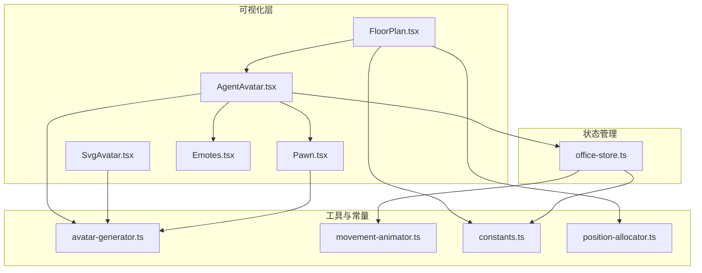
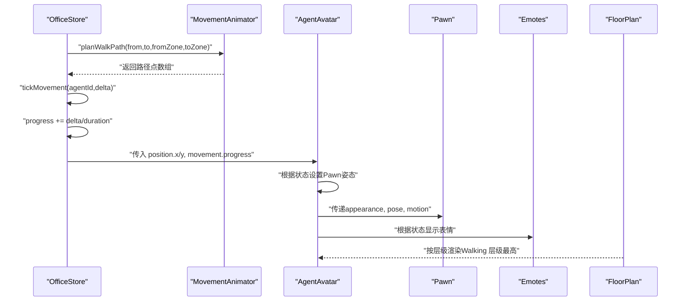
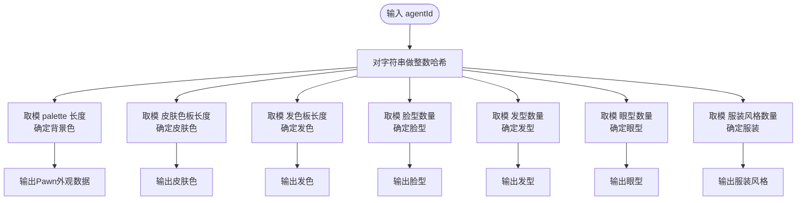
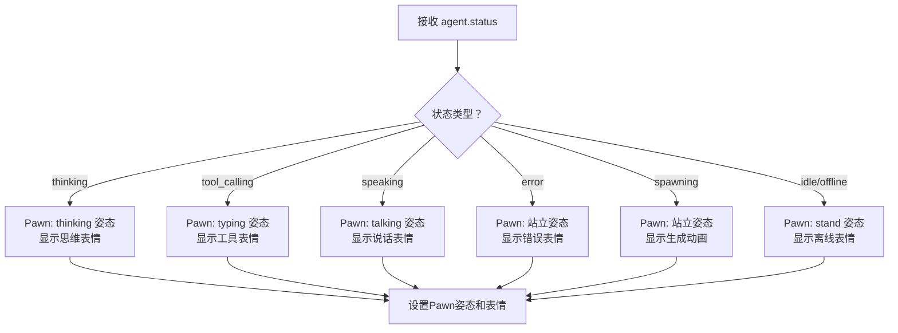
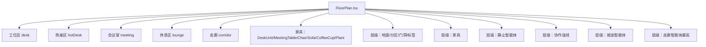
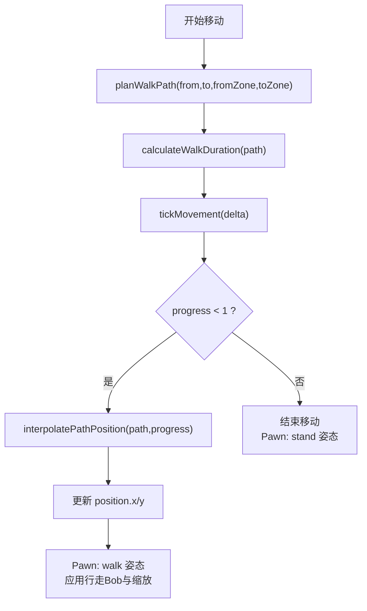
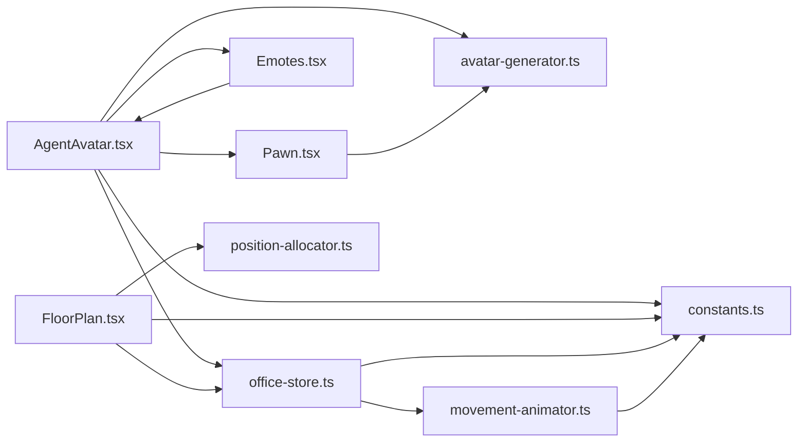

# 智能体可视化系统

<cite>
**本文档引用的文件**
- [src/lib/avatar-generator.ts](file://src/lib/avatar-generator.ts)
- [src/components/office-2d/AgentAvatar.tsx](file://src/components/office-2d/AgentAvatar.tsx)
- [src/components/office-2d/FloorPlan.tsx](file://src/components/office-2d/FloorPlan.tsx)
- [src/components/office-2d/Pawn.tsx](file://src/components/office-2d/Pawn.tsx)
- [src/components/office-2d/Emotes.tsx](file://src/components/office-2d/Emotes.tsx)
- [src/lib/movement-animator.ts](file://src/lib/movement-animator.ts)
- [src/lib/constants.ts](file://src/lib/constants.ts)
- [src/lib/position-allocator.ts](file://src/lib/position-allocator.ts)
- [src/store/office-store.ts](file://src/store/office-store.ts)
- [src/components/shared/SvgAvatar.tsx](file://src/components/shared/SvgAvatar.tsx)
</cite>

## 更新摘要
**所做更改**
- 新增Pawn系统核心组件Pawn.tsx，替代原有的SVG头像系统
- AgentAvatar.tsx完全重写，集成Pawn组件并支持姿态系统
- 新增Emotes.tsx组件提供完整的表情系统
- 更新头像生成算法，从generateSvgAvatar()迁移到generatePawnAppearance()
- 重新设计智能体状态动画系统，支持站立、坐姿、行走等姿态
- 更新运动映射逻辑，支持打字、说话、摇摆等动作

## 目录
1. [简介](#简介)
2. [项目结构](#项目结构)
3. [核心组件](#核心组件)
4. [架构总览](#架构总览)
5. [详细组件分析](#详细组件分析)
6. [依赖分析](#依赖分析)
7. [性能考虑](#性能考虑)
8. [故障排查指南](#故障排查指南)
9. [结论](#结论)
10. [附录](#附录)

## 简介
本文件为智能体可视化系统的全面技术文档，聚焦以下目标：
- 基于 agentId 的确定性Pawn外观生成算法：颜色哈希、姿态组合与个性化特征
- 智能体状态动画系统：空闲、工作中、发言中、工具调用中、错误状态等的视觉表现与动画效果
- 区域显示逻辑：工位区、热座区、休息区、会议室、走廊等区域的定位与层级关系
- 移动动画：从一个位置到另一个位置的平滑过渡效果
- UI 细节：头像尺寸调整、状态指示器、名称标签等

**更新** 本版本已从传统的SVG头像系统重构为基于Pawn的3D风格角色系统，提供更丰富的姿态和动画效果。

## 项目结构
该系统采用前端React + TypeScript构建，核心可视化位于office-2d组件与lib工具模块之间，配合store状态管理完成移动与状态驱动。新架构引入了Pawn组件系统和表情管理。

**图表来源**
- [src/components/office-2d/FloorPlan.tsx:108-278](file://src/components/office-2d/FloorPlan.tsx#L108-L278)
- [src/components/office-2d/AgentAvatar.tsx:15-255](file://src/components/office-2d/AgentAvatar.tsx#L15-L255)
- [src/components/office-2d/Pawn.tsx:1-350](file://src/components/office-2d/Pawn.tsx#L1-L350)
- [src/components/office-2d/Emotes.tsx:1-200](file://src/components/office-2d/Emotes.tsx#L1-L200)
- [src/components/shared/SvgAvatar.tsx:96-127](file://src/components/shared/SvgAvatar.tsx#L96-L127)
- [src/lib/avatar-generator.ts:38-89](file://src/lib/avatar-generator.ts#L38-L89)
- [src/lib/movement-animator.ts:85-163](file://src/lib/movement-animator.ts#L85-L163)
- [src/lib/constants.ts:1-141](file://src/lib/constants.ts#L1-L141)
- [src/lib/position-allocator.ts:51-82](file://src/lib/position-allocator.ts#L51-L82)
- [src/store/office-store.ts:528-542](file://src/store/office-store.ts#L528-L542)

**章节来源**
- [src/components/office-2d/FloorPlan.tsx:108-278](file://src/components/office-2d/FloorPlan.tsx#L108-L278)
- [src/lib/constants.ts:1-141](file://src/lib/constants.ts#L1-L141)

## 核心组件
- Pawn系统：新的3D风格角色表示组件，支持站立、坐姿、行走等姿态
- Emotes系统：完整的表情管理组件，支持思维、说话、工具调用、错误、离线、生成等表情
- 头像生成器：提供确定性Pawn外观数据，包括颜色、发型、服装等
- AgentAvatar：渲染单个智能体，集成Pawn组件和表情系统
- FloorPlan：组织楼层平面，按区域渲染家具与智能体，控制层级顺序
- MovementAnimator：路径规划、插值与步行动画时长计算
- Constants：统一尺寸、颜色、区域定义与状态映射
- PositionAllocator：工位/热座/会议室/休息区的布局与锚点分配
- OfficeStore：移动tick、状态变更与事件处理

**更新** 新增Pawn和Emotes组件，替代原有的SVG头像系统，提供更丰富的视觉表现。

**章节来源**
- [src/components/office-2d/Pawn.tsx:1-350](file://src/components/office-2d/Pawn.tsx#L1-L350)
- [src/components/office-2d/Emotes.tsx:1-200](file://src/components/office-2d/Emotes.tsx#L1-L200)
- [src/lib/avatar-generator.ts:38-89](file://src/lib/avatar-generator.ts#L38-L89)
- [src/components/office-2d/AgentAvatar.tsx:15-255](file://src/components/office-2d/AgentAvatar.tsx#L15-L255)
- [src/components/office-2d/FloorPlan.tsx:108-278](file://src/components/office-2d/FloorPlan.tsx#L108-L278)
- [src/lib/movement-animator.ts:85-163](file://src/lib/movement-animator.ts#L85-L163)
- [src/lib/constants.ts:68-130](file://src/lib/constants.ts#L68-L130)
- [src/lib/position-allocator.ts:51-82](file://src/lib/position-allocator.ts#L51-L82)
- [src/store/office-store.ts:528-542](file://src/store/office-store.ts#L528-L542)

## 架构总览
系统以"状态驱动 + 路径插值"的方式实现平滑移动与状态动画。OfficeStore负责推进移动进度与状态更新；AgentAvatar基于当前状态与移动进度执行视觉动画；FloorPlan控制区域与层级；avatar-generator提供确定性Pawn外观；movement-animator提供路径与时间参数。

**图表来源**
- [src/store/office-store.ts:528-542](file://src/store/office-store.ts#L528-L542)
- [src/lib/movement-animator.ts:85-163](file://src/lib/movement-animator.ts#L85-L163)
- [src/components/office-2d/AgentAvatar.tsx:46-95](file://src/components/office-2d/AgentAvatar.tsx#L46-L95)
- [src/components/office-2d/Pawn.tsx:30-180](file://src/components/office-2d/Pawn.tsx#L30-L180)
- [src/components/office-2d/Emotes.tsx:1-200](file://src/components/office-2d/Emotes.tsx#L1-L200)
- [src/components/office-2d/FloorPlan.tsx:269-272](file://src/components/office-2d/FloorPlan.tsx#L269-L272)

## 详细组件分析

### 基于 agentId 的确定性Pawn外观生成
- Pawn外观数据：generatePawnAppearance()生成完整的Pawn外观数据，包括颜色、发型、服装、姿态等
- 颜色哈希：对agentId做整数哈希，使用palette与皮肤/头发色板映射背景色与文本色
- 个性化特征：根据哈希选择脸型、发型、眼型、服装风格，确保每个agentId的外观稳定且多样
- 姿态系统：支持stand、sit、walk三种基本姿态，以及typing、talking、shaking等动作

**图表来源**
- [src/lib/avatar-generator.ts:16-23](file://src/lib/avatar-generator.ts#L16-L23)
- [src/lib/avatar-generator.ts:38-89](file://src/lib/avatar-generator.ts#L38-L89)

**章节来源**
- [src/lib/avatar-generator.ts:38-89](file://src/lib/avatar-generator.ts#L38-L89)
- [src/components/shared/SvgAvatar.tsx:96-127](file://src/components/shared/SvgAvatar.tsx#L96-L127)

### Pawn系统与姿态管理
- 基础姿态：stand（站立）、sit（坐姿）、walk（行走），通过PawnPose枚举定义
- 动作系统：typing（打字）、talking（说话）、shaking（摇摆），通过PawnMotion枚举定义
- 外观组件：Pawn组件包含头部、身体、四肢等基础几何形状
- 发型系统：Hair组件支持多种发型样式和颜色
- 眼睛系统：Eyes组件支持不同眼型和表情
- 服装系统：支持衬衫、领带、外套等服装部件

**更新** Pawn系统完全替代了原有的SVG头像系统，提供更丰富的3D风格外观和动画效果。

**章节来源**
- [src/components/office-2d/Pawn.tsx:1-350](file://src/components/office-2d/Pawn.tsx#L1-L350)

### 表情系统Emotes
- 表情类型：思维（thinking）、说话（speaking）、工具调用（tool_use）、错误（error）、离线（offline）、生成（spawning）
- 动画效果：每种表情都有对应的CSS动画和视觉效果
- 位置管理：表情相对于Pawn的位置进行精确控制
- 状态同步：表情与智能体状态实时同步更新

**新增** Emotes.tsx组件提供了完整的表情管理系统，替代了原有的状态环和指示器。

**章节来源**
- [src/components/office-2d/Emotes.tsx:1-200](file://src/components/office-2d/Emotes.tsx#L1-L200)

### 智能体状态动画系统
- 状态到姿态映射：STATUS_COLORS将状态映射为颜色，同时影响Pawn的姿态和表情
- 姿态切换：根据状态自动切换Pawn的站立、坐姿或行走姿态
- 表情动画：根据状态应用不同的CSS动画或虚线样式
- 思维表情：三小点脉冲动画，位于Pawn顶部右侧
- 发言表情：聊天气泡图标，带半径与透明度交替的动画
- 错误表情：红色感叹号徽章
- 工具调用：在Pawn下方显示当前工具名称标签
- 名称标签：支持模糊截断与背景毛玻璃效果

**更新** 状态动画系统已完全重构，从状态环改为基于Pawn的姿态和表情系统。

**图表来源**
- [src/components/office-2d/AgentAvatar.tsx:290-305](file://src/components/office-2d/AgentAvatar.tsx#L290-L305)
- [src/lib/constants.ts:68-86](file://src/lib/constants.ts#L68-L86)

**章节来源**
- [src/components/office-2d/AgentAvatar.tsx:117-184](file://src/components/office-2d/AgentAvatar.tsx#L117-L184)
- [src/lib/constants.ts:68-86](file://src/lib/constants.ts#L68-L86)

### 区域显示逻辑与层级关系
- 区域定义：工位区、热座区、会议室、休息区、走廊，均在常量中定义坐标与尺寸
- 楼层渲染：FloorPlan按层级绘制建筑外壳、走廊地砖、区域地面、内墙、门洞、区域标签
- 家具布置：工位区按DeskUnit计算网格；热座区按网格布局；会议室按多桌与座位分配；休息区布置沙发、咖啡杯、植物、前台等
- 智能体层级：休息区与走廊中的智能体先于会议区与热座区渲染，行走中的智能体在最顶层

**图表来源**
- [src/components/office-2d/FloorPlan.tsx:140-278](file://src/components/office-2d/FloorPlan.tsx#L140-L278)
- [src/lib/constants.ts:23-40](file://src/lib/constants.ts#L23-L40)
- [src/lib/position-allocator.ts:131-159](file://src/lib/position-allocator.ts#L131-L159)

**章节来源**
- [src/components/office-2d/FloorPlan.tsx:108-278](file://src/components/office-2d/FloorPlan.tsx#L108-L278)
- [src/lib/constants.ts:23-40](file://src/lib/constants.ts#L23-L40)

### 移动动画与路径规划
- 路径规划：planWalkPath基于起止区域与门点，生成从起点到终点的路径（可能经过走廊中心）
- 插值与时长：interpolatePathPosition按距离比例插值；calculateWalkDuration以速度与最小持续时间保障体验
- 移动推进：OfficeStore.tickMovement推进进度，结合requestAnimationFrame在AgentAvatar中应用位移与行走动画
- 姿态转换：移动时Pawn自动切换到行走姿态，停止时回到站立姿态

**图表来源**
- [src/lib/movement-animator.ts:85-163](file://src/lib/movement-animator.ts#L85-L163)
- [src/store/office-store.ts:528-542](file://src/store/office-store.ts#L528-L542)
- [src/components/office-2d/AgentAvatar.tsx:46-95](file://src/components/office-2d/AgentAvatar.tsx#L46-L95)

**章节来源**
- [src/lib/movement-animator.ts:85-163](file://src/lib/movement-animator.ts#L85-L163)
- [src/store/office-store.ts:528-542](file://src/store/office-store.ts#L528-L542)
- [src/components/office-2d/AgentAvatar.tsx:46-95](file://src/components/office-2d/AgentAvatar.tsx#L46-L95)

### UI 细节：尺寸、状态指示器与名称标签
- Pawn尺寸：通过Pawn组件的scale属性控制大小，支持普通与选中状态的尺寸变化
- 状态指示器：完全由表情系统替代，提供更直观的视觉反馈
- 名称标签：支持模糊截断、背景毛玻璃、暗色主题下的边框与阴影
- 工具标签：工具调用时在Pawn下方显示工具名，带圆角与背景色
- 占位与未确认：Pawn组件支持ghost模式，透明度降低，颜色为灰色

**更新** UI细节已完全重构，从传统的状态环改为基于Pawn的表情系统。

**章节来源**
- [src/lib/constants.ts:124-130](file://src/lib/constants.ts#L124-L130)
- [src/components/office-2d/AgentAvatar.tsx:117-217](file://src/components/office-2d/AgentAvatar.tsx#L117-L217)

## 依赖分析
- AgentAvatar依赖Pawn和Emotes组件，依赖avatar-generator生成Pawn外观数据
- Pawn组件依赖avatar-generator获取外观数据，支持独立渲染
- Emotes组件独立管理表情状态，与AgentAvatar解耦
- FloorPlan依赖constants定义区域与颜色，依赖position-allocator计算布局
- MovementAnimator依赖constants的区域与走廊入口，提供路径与插值函数
- OfficeStore依赖movement-animator进行路径推进，依赖constants进行颜色与区域判断

**更新** 依赖关系已完全重构，新增Pawn和Emotes组件的依赖关系。

**图表来源**
- [src/components/office-2d/AgentAvatar.tsx:3-6](file://src/components/office-2d/AgentAvatar.tsx#L3-L6)
- [src/components/office-2d/Pawn.tsx:1-350](file://src/components/office-2d/Pawn.tsx#L1-L350)
- [src/components/office-2d/Emotes.tsx:1-200](file://src/components/office-2d/Emotes.tsx#L1-L200)
- [src/components/office-2d/FloorPlan.tsx:1-18](file://src/components/office-2d/FloorPlan.tsx#L1-L18)
- [src/lib/movement-animator.ts:1-1](file://src/lib/movement-animator.ts#L1-L1)
- [src/store/office-store.ts:30-36](file://src/store/office-store.ts#L30-L36)

**章节来源**
- [src/components/office-2d/AgentAvatar.tsx:3-6](file://src/components/office-2d/AgentAvatar.tsx#L3-L6)
- [src/components/office-2d/Pawn.tsx:1-350](file://src/components/office-2d/Pawn.tsx#L1-L350)
- [src/components/office-2d/Emotes.tsx:1-200](file://src/components/office-2d/Emotes.tsx#L1-L200)
- [src/components/office-2d/FloorPlan.tsx:1-18](file://src/components/office-2d/FloorPlan.tsx#L1-L18)
- [src/lib/movement-animator.ts:1-1](file://src/lib/movement-animator.ts#L1-L1)
- [src/store/office-store.ts:30-36](file://src/store/office-store.ts#L30-L36)

## 性能考虑
- 确定性哈希：avatar-generator与position-allocator使用整数哈希，避免重复计算，提升稳定性
- requestAnimationFrame：AgentAvatar的行走动画仅在移动时启动，减少不必要的重绘
- 路径插值：MovementAnimator按距离比例插值，避免匀速但不等距的视觉偏差
- 层级渲染：FloorPlan明确层级，避免过度重排与闪烁
- 最小持续时间：移动动画设置最小持续时间，保证动画可感知且不抖动
- 组件优化：Pawn组件使用memo优化，避免不必要的重新渲染

**更新** 性能考虑已增加Pawn组件的memo优化策略。

## 故障排查指南
- Pawn外观异常：检查agentId是否为空或变化频繁；确认hashString与palette取模逻辑
- 表情不显示：确认agent.status是否为有效状态；检查Emotes组件的条件渲染
- 移动卡顿：检查tickMovement的delta是否过大；确认requestAnimationFrame循环是否被清理
- 姿态错乱：确认Pawn的pose和motion参数是否正确传递
- 名称标签截断：调整AVATAR.nameLabelMaxChars；检查外层容器宽度
- 工具标签不显示：确认agent.status为tool_calling且存在currentTool

**更新** 故障排查指南已增加Pawn和表情系统的相关问题。

**章节来源**
- [src/lib/avatar-generator.ts:16-23](file://src/lib/avatar-generator.ts#L16-L23)
- [src/components/office-2d/AgentAvatar.tsx:290-305](file://src/components/office-2d/AgentAvatar.tsx#L290-L305)
- [src/store/office-store.ts:528-542](file://src/store/office-store.ts#L528-L542)
- [src/lib/constants.ts:124-130](file://src/lib/constants.ts#L124-L130)

## 结论
该系统通过确定性哈希与模块化组件实现了稳定的智能体外观与流畅的移动/状态动画。Pawn系统的引入提供了更丰富的3D风格视觉效果，表情系统替代了传统状态环，提供更直观的状态指示。区域与层级设计清晰，便于扩展至更多场景。建议后续可引入缓存与更细粒度的状态过渡，进一步优化复杂场景下的性能与交互体验。

**更新** 结论已反映Pawn系统的重构成果和新架构的优势。

## 附录
- 关键常量与尺寸：见constants.ts中的AVATAR、ZONES、STATUS_COLORS等
- 布局算法：见position-allocator.ts中的网格与锚点分配
- 路径与插值：见movement-animator.ts中的路径规划与插值函数
- Pawn外观数据：见avatar-generator.ts中的generatePawnAppearance函数
- 表情系统：见Emotes.tsx中的表情管理和动画控制