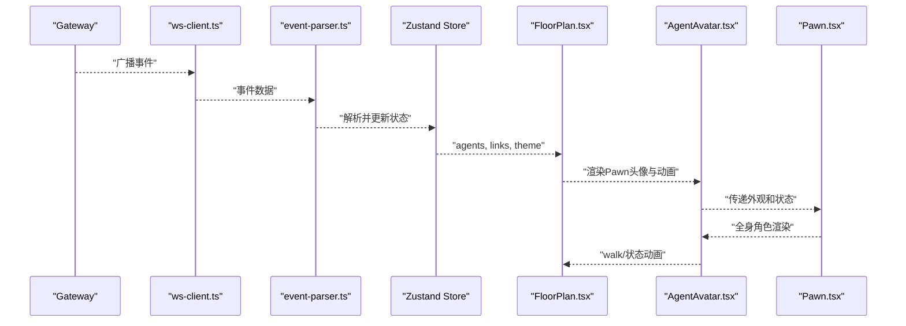
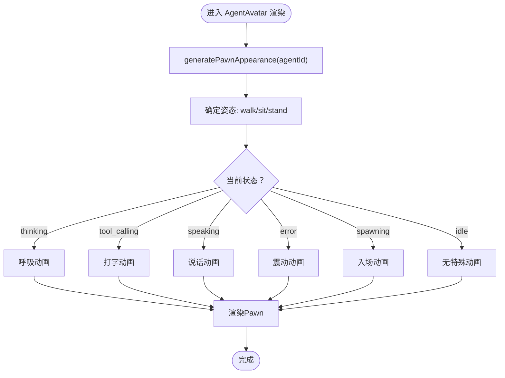
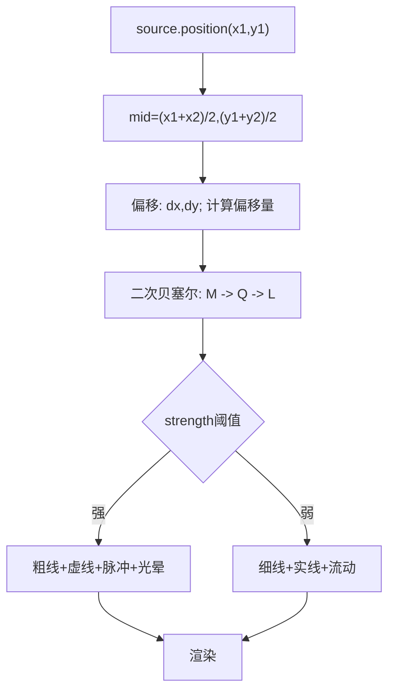
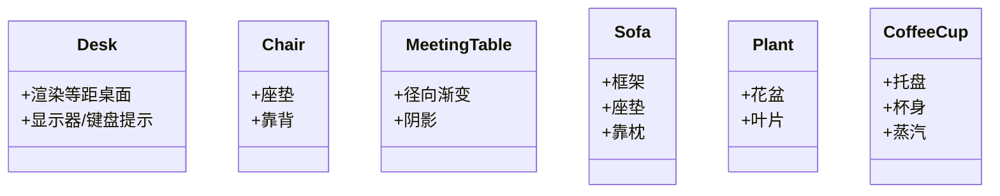
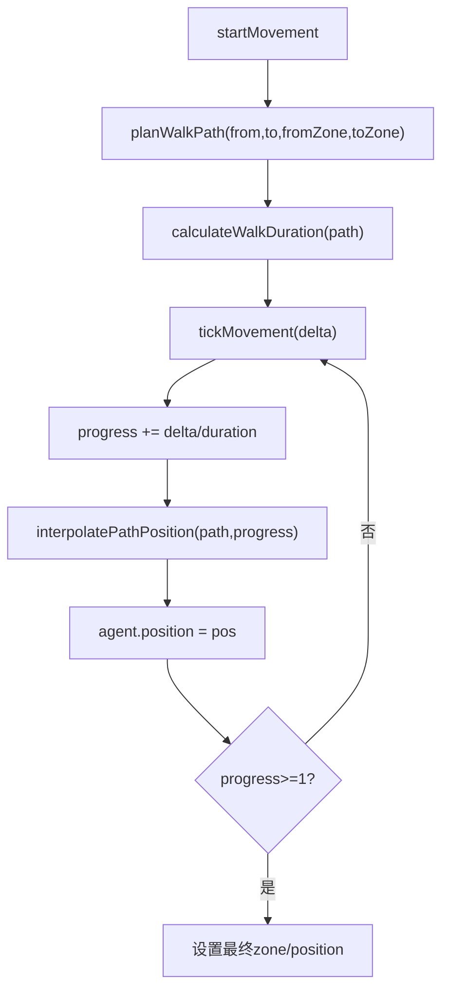
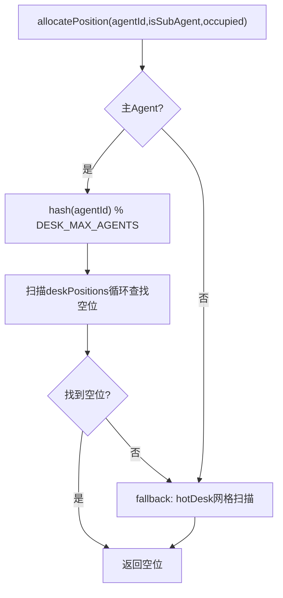
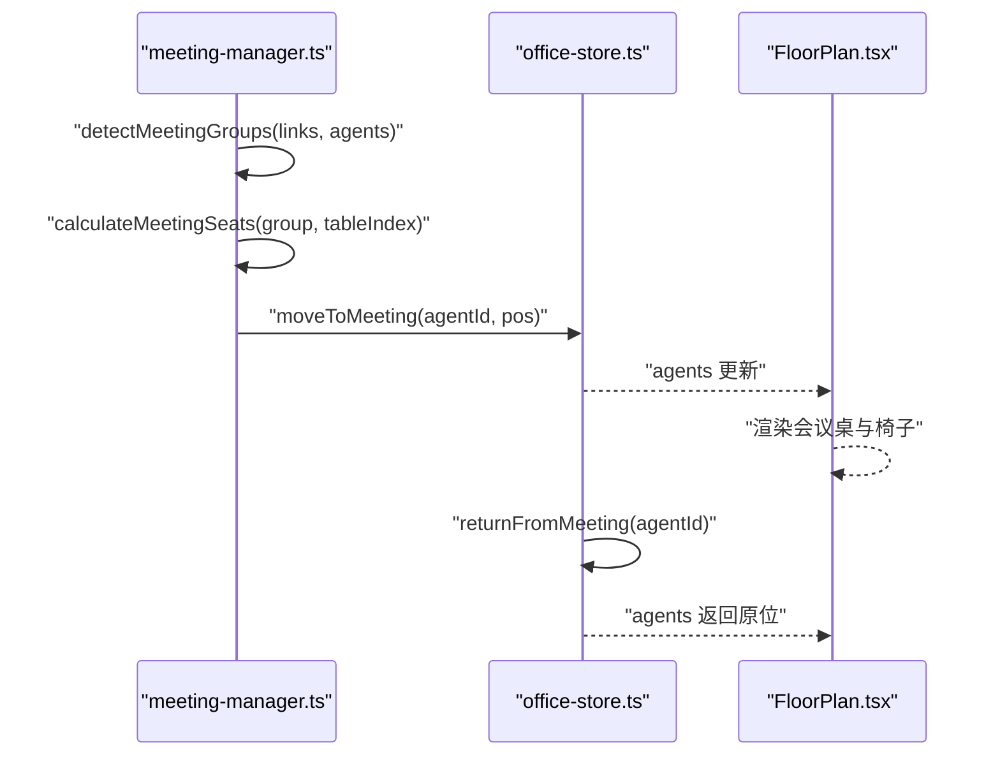
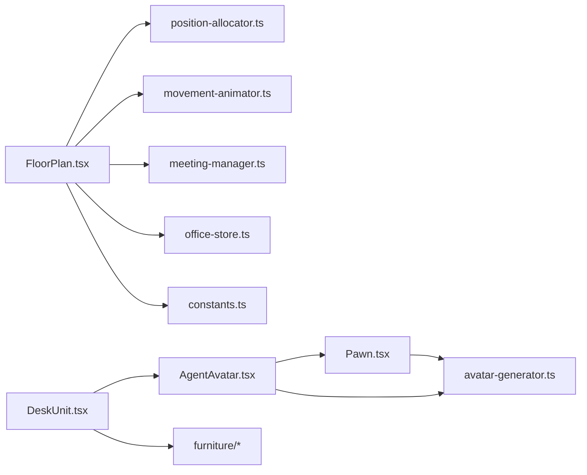

# 虚拟办公室系统

<cite>
**本文引用的文件**
- [README.md](file://README.md)
- [AgentAvatar.tsx](file://src/components/office-2d/AgentAvatar.tsx)
- [Pawn.tsx](file://src/components/office-2d/Pawn.tsx)
- [avatar-generator.ts](file://src/lib/avatar-generator.ts)
- [movement-animator.ts](file://src/lib/movement-animator.ts)
- [position-allocator.ts](file://src/lib/position-allocator.ts)
- [ConnectionLine.tsx](file://src/components/office-2d/ConnectionLine.tsx)
- [FloorPlan.tsx](file://src/components/office-2d/FloorPlan.tsx)
- [DeskUnit.tsx](file://src/components/office-2d/DeskUnit.tsx)
- [Desk.tsx](file://src/components/office-2d/furniture/Desk.tsx)
- [Chair.tsx](file://src/components/office-2d/furniture/Chair.tsx)
- [MeetingTable.tsx](file://src/components/office-2d/furniture/MeetingTable.tsx)
- [Sofa.tsx](file://src/components/office-2d/furniture/Sofa.tsx)
- [Plant.tsx](file://src/components/office-2d/furniture/Plant.tsx)
- [CoffeeCup.tsx](file://src/components/office-2d/furniture/CoffeeCup.tsx)
- [constants.ts](file://src/lib/constants.ts)
- [office-store.ts](file://src/store/office-store.ts)
- [meeting-manager.ts](file://src/store/meeting-manager.ts)
- [globals.css](file://src/styles/globals.css)
</cite>

## 更新摘要
**所做更改**
- 重构智能体可视化系统：从SVG头像迁移到游戏风格Pawn渲染架构
- 新增Pawn组件系统：包含全身角色渲染、姿态控制和动画系统
- 更新头像生成系统：保留SVG头像生成同时新增Pawn外观生成
- 重新组织2D渲染架构：AgentAvatar现在基于Pawn组件
- 新增游戏风格动画：包括走路摆动、打字、说话、摇晃等动画效果

## 目录
1. [简介](#简介)
2. [项目结构](#项目结构)
3. [核心组件](#核心组件)
4. [架构总览](#架构总览)
5. [详细组件分析](#详细组件分析)
6. [依赖分析](#依赖分析)
7. [性能考虑](#性能考虑)
8. [故障排查指南](#故障排查指南)
9. [结论](#结论)
10. [附录](#附录)

## 简介
本项目是 OpenClaw 多智能体系统的可视化监控与管理前端，采用等距投影（Isometric）风格的 2D SVG 场景，实时呈现 Agent 的工作状态、协作链路、工具调用与资源消耗，并提供完整的控制台管理界面与 Chat 对话工作区。系统通过 WebSocket 与 Gateway 通信，将 Agent 生命周期事件映射为可视化状态，在办公室场景中渲染。

**更新** 系统已完成从SVG头像到游戏风格Pawn渲染的重大架构升级，提供更加丰富和生动的智能体可视化体验。

## 项目结构
- 顶层 README 提供功能概览、技术栈、安装与启动说明。
- 2D 办公室场景位于 src/components/office-2d，包含 AgentAvatar、Pawn、家具、连接线、楼层平面等组件。
- 核心库位于 src/lib，包括头像生成、位置分配、移动动画、常量等。
- 状态管理位于 src/store，包含 office-store 与 meeting-manager。
- 资产与静态资源位于 assets/public。

```mermaid
graph TB
subgraph "2D 办公室"
FP["FloorPlan.tsx"]
DU["DeskUnit.tsx"]
AA["AgentAvatar.tsx"]
PAWN["Pawn.tsx"]
CL["ConnectionLine.tsx"]
FURN["furniture/*"]
END
subgraph "库"
POS["position-allocator.ts"]
MOV["movement-animator.ts"]
AVGEN["avatar-generator.ts"]
C["constants.ts"]
END
subgraph "状态"
OS["office-store.ts"]
MM["meeting-manager.ts"]
END
FP --> DU
FP --> AA
FP --> CL
FP --> FURN
DU --> AA
DU --> FURN
AA --> PAWN
AA --> AVGEN
PAWN --> AVGEN
FP --> POS
FP --> MOV
FP --> C
OS --> MOV
OS --> POS
OS --> MM
MM --> POS
```

**图表来源**
- [FloorPlan.tsx:1-727](file://src/components/office-2d/FloorPlan.tsx#L1-L727)
- [AgentAvatar.tsx:1-268](file://src/components/office-2d/AgentAvatar.tsx#L1-L268)
- [Pawn.tsx:1-343](file://src/components/office-2d/Pawn.tsx#L1-L343)
- [DeskUnit.tsx:1-45](file://src/components/office-2d/DeskUnit.tsx#L1-L45)
- [ConnectionLine.tsx:1-54](file://src/components/office-2d/ConnectionLine.tsx#L1-L54)
- [position-allocator.ts:1-209](file://src/lib/position-allocator.ts#L1-L209)
- [movement-animator.ts:1-163](file://src/lib/movement-animator.ts#L1-L163)
- [avatar-generator.ts:1-135](file://src/lib/avatar-generator.ts#L1-L135)
- [constants.ts:1-141](file://src/lib/constants.ts#L1-L141)
- [office-store.ts:1-800](file://src/store/office-store.ts#L1-L800)
- [meeting-manager.ts:1-136](file://src/store/meeting-manager.ts#L1-L136)

**章节来源**
- [README.md:1-316](file://README.md#L1-L316)

## 核心组件
- 等距投影与 SVG 渲染：通过 SVG + CSS 动画实现等距建筑、分区墙、走廊与家具渲染，配合主题切换与响应式视图。
- **游戏风格Pawn智能体系统**：基于 agentId 的确定性Pawn外观生成，支持全身角色渲染、多种姿态（站立/坐着/行走）、实时状态动画（空闲/思考/工具调用/回复/错误/创建中）。
- 协作关系可视化：根据协作链接强度绘制曲线连接线，支持脉冲与流动动画。
- 家具装饰系统：桌椅、沙发、植物、咖啡杯等组件，按区域布局与主题适配。
- 2D 动画效果：Agent 的移动路径规划、步行摆动与起坐动画、会议区交互与座位分配。
- 位置分配与布局：工位网格、临时工位网格、休息区锚点、会议区座位等确定性分配算法。
- 响应式设计：移动端优化与自动切换 2D 模式。

**更新** 智能体可视化系统已完全重构为游戏风格Pawn架构，提供更加丰富和生动的角色表现。

**章节来源**
- [README.md:13-60](file://README.md#L13-L60)
- [AgentAvatar.tsx:1-268](file://src/components/office-2d/AgentAvatar.tsx#L1-L268)
- [Pawn.tsx:1-343](file://src/components/office-2d/Pawn.tsx#L1-L343)
- [ConnectionLine.tsx:1-54](file://src/components/office-2d/ConnectionLine.tsx#L1-L54)
- [FloorPlan.tsx:1-727](file://src/components/office-2d/FloorPlan.tsx#L1-L727)
- [position-allocator.ts:1-209](file://src/lib/position-allocator.ts#L1-L209)
- [movement-animator.ts:1-163](file://src/lib/movement-animator.ts#L1-L163)
- [constants.ts:1-141](file://src/lib/constants.ts#L1-L141)

## 架构总览
系统通过 WebSocket 连接 Gateway，事件经解析后写入 Zustand Store，React 组件订阅状态并渲染 2D 场景。Office Store 负责 Agent 的生命周期、位置分配、移动动画与会议调度；Meeting Manager 负责协作分组与会议座位计算。



**图表来源**
- [README.md:274-284](file://README.md#L274-L284)
- [office-store.ts:1-800](file://src/store/office-store.ts#L1-L800)
- [FloorPlan.tsx:1-727](file://src/components/office-2d/FloorPlan.tsx#L1-L727)
- [AgentAvatar.tsx:1-268](file://src/components/office-2d/AgentAvatar.tsx#L1-L268)
- [Pawn.tsx:1-343](file://src/components/office-2d/Pawn.tsx#L1-L343)

## 详细组件分析

### 等距投影与 SVG 渲染
- 建筑外壳与内部隔墙：使用矩形与路径绘制等距墙体与门洞，配合渐变与阴影滤镜增强立体感。
- 走廊地板：使用图案填充实现瓷砖纹理，中心引导线提升空间定位。
- 区域着色：根据主题切换浅/深色系，区分工位、会议、临时工位、休息区与走廊。
- 响应式：SVG viewBox 与 preserveAspectRatio 保证不同屏幕尺寸下的正确缩放。

**章节来源**
- [FloorPlan.tsx:140-180](file://src/components/office-2d/FloorPlan.tsx#L140-L180)
- [constants.ts:7-59](file://src/lib/constants.ts#L7-L59)

### 游戏风格Pawn智能体系统
**更新** 智能体可视化系统已完全重构为游戏风格Pawn架构。

- **Pawn外观生成**：基于 agentId 的哈希，生成全身角色外观，包括头发样式、眼睛样式、皮肤颜色、头发颜色、衬衫颜色、裤子颜色和鞋子颜色，保证同一 agentId 永远生成相同外观。
- **姿态系统**：支持 stand（站立）、sit（坐着）、walk（行走）三种基本姿态，自动根据Agent状态和位置切换。
- **运动系统**：支持 typing（打字）、talking（说话）、shaking（错误震动）等运动状态，结合姿态产生相应的动画效果。
- **全身角色渲染**：包含头部、躯干、四肢的完整人体结构，使用SVG路径和形状元素精确构建。
- **实时状态动画**：
  - 思考：呼吸动画
  - 工具调用：打字动画
  - 回复：说话动画
  - 错误：震动动画
  - 创建中：入场动画
  - 步行：腿部摆动动画
- **选择高亮**：游戏风格的选择环效果，带发光和阴影效果。
- **名称标签与工具名标签**：使用 foreignObject 嵌入文本，支持模糊与半透明背景。
- **悬停提示**：选中态发光环与信息气泡。



**图表来源**
- [AgentAvatar.tsx:54-67](file://src/components/office-2d/AgentAvatar.tsx#L54-L67)
- [Pawn.tsx:31-37](file://src/components/office-2d/Pawn.tsx#L31-L37)
- [avatar-generator.ts:121-134](file://src/lib/avatar-generator.ts#L121-L134)

**章节来源**
- [AgentAvatar.tsx:1-268](file://src/components/office-2d/AgentAvatar.tsx#L1-L268)
- [Pawn.tsx:1-343](file://src/components/office-2d/Pawn.tsx#L1-L343)
- [avatar-generator.ts:90-134](file://src/lib/avatar-generator.ts#L90-L134)

### 协作关系可视化
- 连接线算法：以两端 Agent 位置为起点终点，计算中点与垂直偏移，生成二次贝塞尔曲线路径。
- 强度与样式：强度阈值决定是否绘制；强连接使用虚线与脉冲动画，弱连接使用实线与流动动画；带背景光晕增强视觉层次。
- 渲染时机：在 FloorPlan 中遍历 links，为每条协作关系绘制一条 ConnectionLine。



**图表来源**
- [ConnectionLine.tsx:9-54](file://src/components/office-2d/ConnectionLine.tsx#L9-L54)
- [FloorPlan.tsx:242-258](file://src/components/office-2d/FloorPlan.tsx#L242-L258)

**章节来源**
- [ConnectionLine.tsx:1-54](file://src/components/office-2d/ConnectionLine.tsx#L1-L54)
- [FloorPlan.tsx:242-258](file://src/components/office-2d/FloorPlan.tsx#L242-L258)

### 家具装饰系统
- 桌子：等距矩形桌面与前缘，带显示器与键盘提示。
- 椅子：圆座垫与弧形靠背。
- 会议桌：径向渐变圆形桌面，带阴影滤镜。
- 沙发：框架、座垫与靠枕。
- 植物与咖啡杯：简笔几何形状，营造办公氛围。



**图表来源**
- [Desk.tsx:1-58](file://src/components/office-2d/furniture/Desk.tsx#L1-L58)
- [Chair.tsx:1-28](file://src/components/office-2d/furniture/Chair.tsx#L1-L28)
- [MeetingTable.tsx:1-38](file://src/components/office-2d/furniture/MeetingTable.tsx#L1-L38)
- [Sofa.tsx:1-29](file://src/components/office-2d/furniture/Sofa.tsx#L1-L29)
- [Plant.tsx:1-20](file://src/components/office-2d/furniture/Plant.tsx#L1-L20)
- [CoffeeCup.tsx:1-33](file://src/components/office-2d/furniture/CoffeeCup.tsx#L1-L33)

**章节来源**
- [Desk.tsx:1-58](file://src/components/office-2d/furniture/Desk.tsx#L1-L58)
- [Chair.tsx:1-28](file://src/components/office-2d/furniture/Chair.tsx#L1-L28)
- [MeetingTable.tsx:1-38](file://src/components/office-2d/furniture/MeetingTable.tsx#L1-L38)
- [Sofa.tsx:1-29](file://src/components/office-2d/furniture/Sofa.tsx#L1-L29)
- [Plant.tsx:1-20](file://src/components/office-2d/furniture/Plant.tsx#L1-L20)
- [CoffeeCup.tsx:1-33](file://src/components/office-2d/furniture/CoffeeCup.tsx#L1-L33)

### 2D 动画效果与移动
- 路径规划：根据起止区域与门点，生成穿越走廊的折线路径；同臂区域直连，跨臂区域经中心点。
- 时间与插值：根据路径长度与速度计算持续时间，按距离比例插值位置。
- 步行动画：步行时附加正弦摆动与起坐缩放，起始阶段放大、结束阶段回弹。
- 状态驱动：Office Store 的 tickMovement 更新 Agent 位置，到达目标后切换 zone 与状态。



**图表来源**
- [movement-animator.ts:85-162](file://src/lib/movement-animator.ts#L85-L162)
- [office-store.ts:504-580](file://src/store/office-store.ts#L504-L580)

**章节来源**
- [movement-animator.ts:1-163](file://src/lib/movement-animator.ts#L1-L163)
- [office-store.ts:504-580](file://src/store/office-store.ts#L504-L580)
- [AgentAvatar.tsx:46-95](file://src/components/office-2d/AgentAvatar.tsx#L46-L95)

### 位置分配算法与布局
- 工位分配：对主 Agent 在 desk 区域按网格哈希分配，优先占用连续空位，不足时在区域内随机偏移。
- 临时工位：子 Agent 与占满的主 Agent 分配至 hotDesk 区域。
- 会议座位：按 equi-angular 布局围绕会议桌中心点分配，支持多桌。
- 休息区锚点：预设多个锚点供空闲子 Agent 使用，避免重叠装饰元素。
- 桌位单元：DeskUnit 结合 Desk、Chair 与 AgentAvatar，统一渲染。



**图表来源**
- [position-allocator.ts:51-82](file://src/lib/position-allocator.ts#L51-L82)
- [DeskUnit.tsx:13-24](file://src/components/office-2d/DeskUnit.tsx#L13-L24)

**章节来源**
- [position-allocator.ts:1-209](file://src/lib/position-allocator.ts#L1-L209)
- [DeskUnit.tsx:1-45](file://src/components/office-2d/DeskUnit.tsx#L1-L45)

### 协作分组与会议区交互
- 分组策略：按协作链接强度阈值与 sessionKey 聚合，仅主 Agent 参与，最多三组。
- 座位分配：为每组计算等角座位，映射到具体 position。
- 会议调度：applyMeetingGathering 将参与者移动到会议位置，离开会议后按最小停留时间返回原位。



**图表来源**
- [meeting-manager.ts:32-96](file://src/store/meeting-manager.ts#L32-L96)
- [office-store.ts:469-502](file://src/store/office-store.ts#L469-L502)
- [FloorPlan.tsx:184-226](file://src/components/office-2d/FloorPlan.tsx#L184-L226)

**章节来源**
- [meeting-manager.ts:1-136](file://src/store/meeting-manager.ts#L1-L136)
- [office-store.ts:469-502](file://src/store/office-store.ts#L469-L502)
- [FloorPlan.tsx:184-226](file://src/components/office-2d/FloorPlan.tsx#L184-L226)

## 依赖分析
- 组件耦合：
  - FloorPlan 依赖 constants、position-allocator、movement-animator、meeting-manager 与 office-store。
  - DeskUnit 依赖 Desk、Chair、AgentAvatar。
  - AgentAvatar 依赖 Pawn、avatar-generator、constants、office-store。
  - Pawn 依赖 avatar-generator。
  - ConnectionLine 依赖 agents 位置与 links。
- 外部依赖：Zustand 状态管理、Immer、i18n、Tailwind CSS、Recharts、WebSocket 客户端。



**图表来源**
- [FloorPlan.tsx:1-727](file://src/components/office-2d/FloorPlan.tsx#L1-L727)
- [DeskUnit.tsx:1-45](file://src/components/office-2d/DeskUnit.tsx#L1-L45)
- [AgentAvatar.tsx:1-268](file://src/components/office-2d/AgentAvatar.tsx#L1-L268)
- [Pawn.tsx:1-343](file://src/components/office-2d/Pawn.tsx#L1-L343)
- [position-allocator.ts:1-209](file://src/lib/position-allocator.ts#L1-L209)
- [movement-animator.ts:1-163](file://src/lib/movement-animator.ts#L1-L163)
- [meeting-manager.ts:1-136](file://src/store/meeting-manager.ts#L1-L136)
- [office-store.ts:1-800](file://src/store/office-store.ts#L1-L800)
- [constants.ts:1-141](file://src/lib/constants.ts#L1-L141)
- [avatar-generator.ts:1-135](file://src/lib/avatar-generator.ts#L1-L135)

**章节来源**
- [README.md:63-76](file://README.md#L63-L76)

## 性能考虑
- SVG 渲染优势：
  - 等距投影与矢量图形在缩放时保持清晰，适合大范围场景与多 Agent 高密度显示。
  - CSS 动画与 requestAnimationFrame 驱动的步行动画，减少重排与重绘开销。
  - **更新** Pawn组件使用memo优化，避免不必要的重渲染。
- 状态与渲染优化：
  - DeskUnit 使用 memo 与浅比较，避免不必要的重渲染。
  - FloorPlan 按区域与层级组织渲染，减少 DOM 节点数量。
  - **更新** Pawn组件内部使用memo优化，全身角色渲染性能更佳。
- 数据流优化：
  - Office Store 将高频移动与状态变更集中在 tickMovement，降低事件风暴影响。
  - sessions 同步改为低频 reconcile，减轻 Gateway 压力。

## 故障排查指南
- **更新** Pawn渲染问题：
  - 检查 agentId 是否变化导致外观重算；确认 generatePawnAppearance 与 generateSvgAvatar 的差异。
  - 确认Pawn组件的动画CSS类是否存在，检查globals.css中的pawn动画定义。
- 头像未更新或状态异常：
  - 检查 agentId 是否变化导致头像重算；确认 STATUS_COLORS 与状态映射一致。
- 移动卡顿或路径异常：
  - 核对 planWalkPath 与 interpolatePathPosition 的路径与进度计算；检查 WALK_SPEED_SVG 与 MIN_WALK_DURATION。
- 会议座位错乱：
  - 确认 detectMeetingGroups 的强度阈值与 allowList；检查 calculateMeetingSeats 的 tableIndex 与中心点。
- 协作连线不显示：
  - 检查 links 数据完整性与强度阈值；确认 ConnectionLine 的样式与动画开关。
- 响应式显示问题：
  - 检查 SVG viewBox 与 preserveAspectRatio 设置；确认主题切换逻辑。

**章节来源**
- [AgentAvatar.tsx:1-268](file://src/components/office-2d/AgentAvatar.tsx#L1-L268)
- [Pawn.tsx:1-343](file://src/components/office-2d/Pawn.tsx#L1-L343)
- [movement-animator.ts:1-163](file://src/lib/movement-animator.ts#L1-L163)
- [meeting-manager.ts:1-136](file://src/store/meeting-manager.ts#L1-L136)
- [ConnectionLine.tsx:1-54](file://src/components/office-2d/ConnectionLine.tsx#L1-L54)
- [constants.ts:1-141](file://src/lib/constants.ts#L1-L141)

## 结论
本系统通过等距投影与 SVG 渲染，将复杂的 Agent 协作关系与动态状态以直观的 2D 场景呈现。**更新** 系统已完成从SVG头像到游戏风格Pawn渲染的重大架构升级，提供更加丰富和生动的智能体可视化体验。确定性Pawn外观、路径规划与会议调度算法确保了可预测的用户体验；模块化的组件与状态管理便于扩展与维护。建议在大规模场景下进一步优化Pawn渲染层级与动画频率，以获得更流畅的交互体验。

## 附录
- 使用模式与最佳实践：
  - **更新** Pawn外观生成：使用 generatePawnAppearance 保证跨会话一致性。
  - 移动控制：通过 startMovement 与 tickMovement 驱动 Agent 行为。
  - 会议管理：利用 detectMeetingGroups 与 applyMeetingGathering 自动化协作流程。
  - 布局扩展：新增家具组件时遵循等距投影坐标体系与主题色彩规范。
  - **更新** 动画优化：Pawn组件已内置动画系统，无需额外配置即可获得丰富的动画效果。