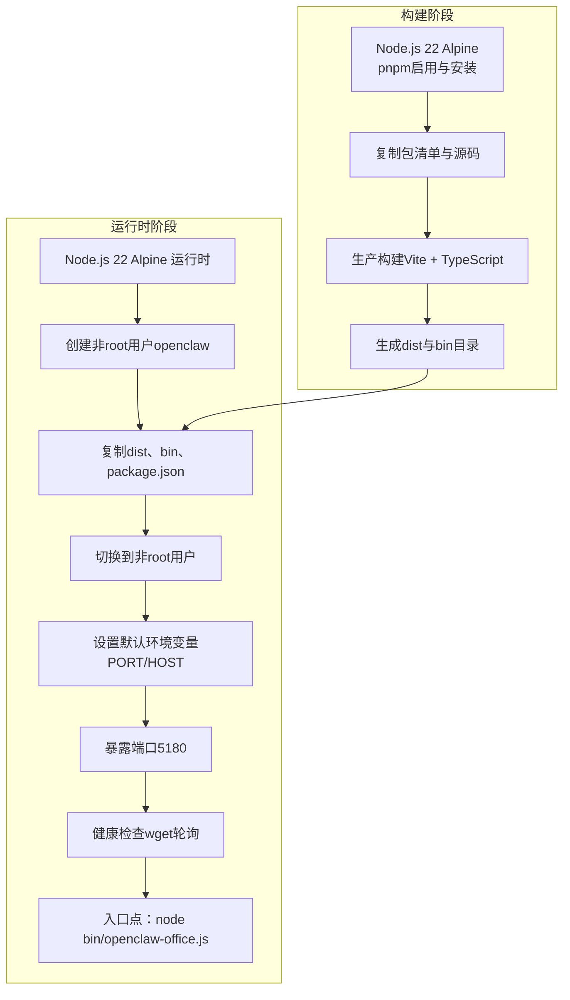
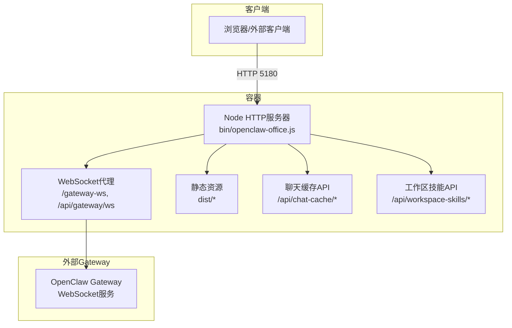
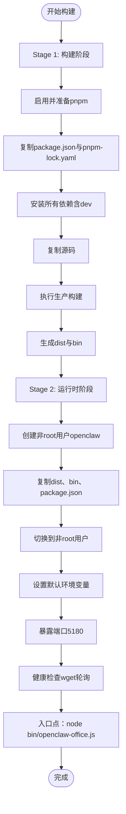
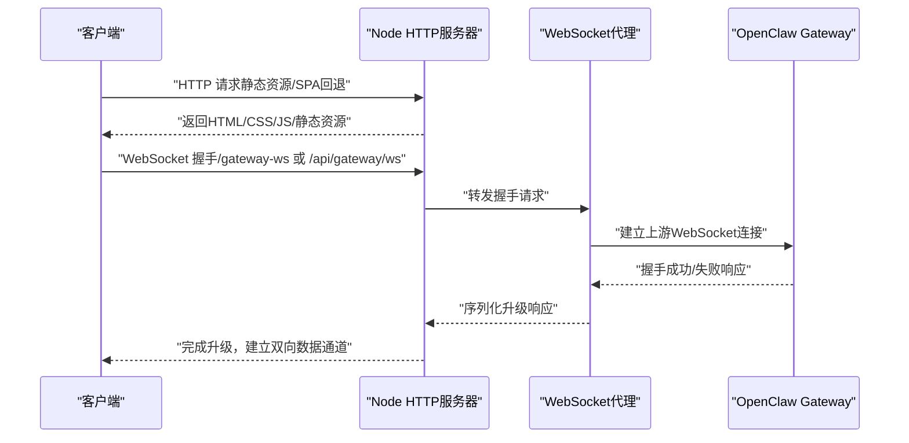
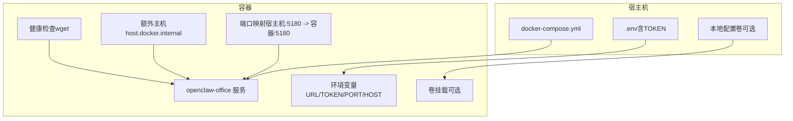
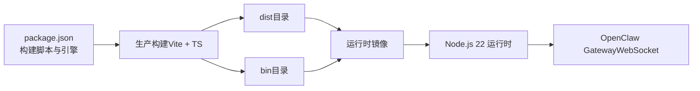

# Docker容器化部署

<cite>
**本文档引用的文件**
- [Dockerfile](file://Dockerfile)
- [docker-compose.yml](file://docker-compose.yml)
- [.dockerignore](file://.dockerignore)
- [DEPLOY.md](file://DEPLOY.md)
- [package.json](file://package.json)
- [bin/openclaw-office.js](file://bin/openclaw-office.js)
- [vite.config.js](file://vite.config.js)
- [README.md](file://README.md)
</cite>

## 目录
1. [简介](#简介)
2. [项目结构](#项目结构)
3. [核心组件](#核心组件)
4. [架构总览](#架构总览)
5. [详细组件分析](#详细组件分析)
6. [依赖关系分析](#依赖关系分析)
7. [性能考虑](#性能考虑)
8. [故障排除指南](#故障排除指南)
9. [结论](#结论)
10. [附录](#附录)

## 简介
本文件面向Docker容器化部署，围绕OpenClaw Office项目的多阶段Dockerfile构建、运行时镜像优化、安全配置与docker-compose编排进行深入技术说明。文档涵盖镜像构建流程、层缓存优化策略、非root用户运行、健康检查、环境变量配置、端口映射、卷挂载、镜像推送与版本管理、CI/CD集成最佳实践等内容，帮助运维与开发团队高效、安全地部署与维护该前端服务。

## 项目结构
OpenClaw Office的容器化部署涉及以下关键文件：
- Dockerfile：定义两阶段构建（构建阶段使用pnpm安装完整依赖并编译应用；运行时阶段仅复制必要文件并使用非root用户运行）
- docker-compose.yml：服务定义、环境变量、端口映射、卷挂载、健康检查与额外主机配置
- .dockerignore：构建与运行时不需要的文件与目录排除，避免污染镜像
- DEPLOY.md：部署与运维指南，包含环境变量说明、本地构建、多平台镜像构建与推送、反向代理、健康检查、升级回滚与常见问题
- package.json：项目元信息与脚本，包括构建脚本与Node引擎要求
- bin/openclaw-office.js：运行时主程序，负责静态资源服务、WebSocket代理、聊天缓存API与工作区技能API
- vite.config.js：开发时Vite配置，包含网关WebSocket代理与聊天缓存中间件，生产构建产物位于dist目录

图表来源
- [Dockerfile:1-56](file://Dockerfile#L1-L56)

章节来源
- [Dockerfile:1-56](file://Dockerfile#L1-L56)
- [docker-compose.yml:1-31](file://docker-compose.yml#L1-L31)
- [.dockerignore:1-52](file://.dockerignore#L1-L52)
- [DEPLOY.md:1-288](file://DEPLOY.md#L1-L288)

## 核心组件
- 多阶段Dockerfile：构建阶段安装pnpm并全量安装依赖，执行生产构建；运行时阶段仅复制dist、bin与最小化运行时依赖，使用非root用户运行，开启健康检查
- 运行时主程序：bin/openclaw-office.js提供静态资源服务、WebSocket代理至OpenClaw Gateway、聊天缓存API与工作区技能API
- docker-compose编排：定义服务、环境变量、端口映射、健康检查、额外主机以访问宿主机上的Gateway
- .dockerignore：排除node_modules、dist、测试输出、脚本、文档、日志等，确保镜像精简与安全
- 部署文档：提供环境变量说明、本地构建、多平台镜像构建与推送、反向代理、健康检查、升级回滚与常见问题

章节来源
- [Dockerfile:1-56](file://Dockerfile#L1-L56)
- [bin/openclaw-office.js:1-763](file://bin/openclaw-office.js#L1-L763)
- [docker-compose.yml:1-31](file://docker-compose.yml#L1-L31)
- [.dockerignore:1-52](file://.dockerignore#L1-L52)
- [DEPLOY.md:1-288](file://DEPLOY.md#L1-L288)

## 架构总览
OpenClaw Office容器化架构分为三层：
- 构建层：Node.js 22 Alpine + pnpm，安装完整依赖并执行生产构建，生成dist与bin
- 运行层：Node.js 22 Alpine，仅复制必要文件，非root用户运行，暴露端口5180，内置健康检查
- 网络层：容器通过端口映射对外提供HTTP服务，WebSocket路径"/gateway-ws"与"/api/gateway/ws"代理至Gateway

图表来源
- [bin/openclaw-office.js:151-763](file://bin/openclaw-office.js#L151-L763)
- [vite.config.js:331-361](file://vite.config.js#L331-L361)

## 详细组件分析

### 多阶段Dockerfile构建流程
- 构建阶段（builder）
  - 基础镜像：node:22-alpine
  - 启用并激活pnpm
  - 复制package.json与pnpm-lock.yaml，使用--frozen-lockfile确保依赖一致性
  - 复制源码后执行生产构建（Vite + TypeScript）
  - 产出dist与bin目录
- 运行时阶段（runtime）
  - 基础镜像：node:22-alpine
  - 创建非root用户openclaw并切换到该用户
  - 仅复制构建产物（dist、bin、package.json）
  - 设置默认环境变量（PORT=5180，HOST=0.0.0.0）
  - 暴露端口5180
  - 健康检查：使用wget轮询本地端口
  - 入口点：node bin/openclaw-office.js

图表来源
- [Dockerfile:1-56](file://Dockerfile#L1-L56)

章节来源
- [Dockerfile:1-56](file://Dockerfile#L1-L56)

### 运行时主程序（bin/openclaw-office.js）
- 配置解析：优先命令行参数，其次环境变量，最后从用户家目录配置文件自动读取
- HTTP服务器：提供静态资源服务，SPA路由回退到注入运行时配置的index.html
- WebSocket代理：将请求转发至OpenClaw Gateway，支持"/gateway-ws"与"/api/gateway/ws"
- 聊天缓存API：提供会话列表与消息的增删改查接口，按天分片存储在用户家目录
- 工作区技能API：列出与读取工作区技能文件
- 日志输出：启动时打印本地与网络访问地址、Gateway地址与Token加载状态

图表来源
- [bin/openclaw-office.js:151-763](file://bin/openclaw-office.js#L151-L763)

章节来源
- [bin/openclaw-office.js:1-763](file://bin/openclaw-office.js#L1-L763)

### docker-compose编排
- 服务定义：openclaw-office，镜像来自私有仓库，容器名openclaw-office
- 重启策略：unless-stopped
- 端口映射：将宿主机PORT（默认5180）映射到容器5180
- 环境变量：OPENCLAW_GATEWAY_URL（默认指向host.docker.internal），OPENCLAW_GATEWAY_TOKEN（必须通过.env提供），PORT与HOST
- 健康检查：使用wget轮询本地端口
- 额外主机：host.docker.internal:host-gateway，便于容器访问宿主机上的Gateway
- 卷挂载：注释掉的示例展示了将本地配置文件挂载到容器家目录，作为TOKEN替代方案

图表来源
- [docker-compose.yml:1-31](file://docker-compose.yml#L1-L31)

章节来源
- [docker-compose.yml:1-31](file://docker-compose.yml#L1-L31)

### .dockerignore排除策略
- 排除node_modules、.pnpm-store、dist、output、coverage、.nyc_output、.vscode、.idea、.git、.env*（除.env.example）、日志、CI脚本、tests、docs、assets、public/icons、测试文件与配置、README与变更日志、许可证等
- 目标：减少镜像体积、避免敏感信息进入镜像、提升构建缓存命中率

章节来源
- [.dockerignore:1-52](file://.dockerignore#L1-L52)

### 镜像构建与推送最佳实践
- 本地构建：docker build -t openclaw-office:dev .
- 多平台镜像：使用buildx，支持linux/amd64与linux/arm64，推送至私有仓库
- 版本标签：使用package.json中的版本号作为镜像标签，同时保留latest标签
- 验证：使用buildx imagetools inspect验证多架构Manifest

章节来源
- [DEPLOY.md:145-182](file://DEPLOY.md#L145-L182)
- [package.json:1-83](file://package.json#L1-L83)

### 环境变量与配置
- 必填项：OPENCLAW_GATEWAY_URL（WebSocket地址）、OPENCLAW_GATEWAY_TOKEN（认证令牌）
- 可选项：PORT（默认5180）、HOST（默认0.0.0.0）
- 配置来源顺序：命令行参数 > 环境变量 > 用户家目录配置文件
- .env文件：建议通过.env文件提供TOKEN，避免硬编码

章节来源
- [DEPLOY.md:113-126](file://DEPLOY.md#L113-L126)
- [bin/openclaw-office.js:122-149](file://bin/openclaw-office.js#L122-L149)

### 安全配置
- 非root用户：运行时阶段创建openclaw用户并切换，降低权限风险
- 健康检查：内置健康检查，定期轮询本地端口，便于编排系统自动恢复
- 凭据管理：通过环境变量或卷挂载提供TOKEN，不在镜像中存储敏感信息

章节来源
- [Dockerfile:28-43](file://Dockerfile#L28-L43)
- [Dockerfile:52-53](file://Dockerfile#L52-L53)
- [docker-compose.yml:22-27](file://docker-compose.yml#L22-L27)

### 部署命令示例
- docker compose：拉取镜像、以后台方式启动、查看状态与日志、停止
- 纯Docker命令：拉取镜像、运行容器、映射端口、添加宿主机路由、设置环境变量、指定版本
- 固定版本：在compose文件中指定具体版本号，便于生产环境稳定

章节来源
- [DEPLOY.md:38-110](file://DEPLOY.md#L38-L110)

### 反向代理配置
- Nginx：监听80，将请求代理至127.0.0.1:5180，支持WebSocket升级头
- Traefik：通过labels配置路由器与服务规则，负载均衡端口为5180

章节来源
- [DEPLOY.md:185-218](file://DEPLOY.md#L185-L218)

## 依赖关系分析
- 构建依赖：Node.js 22、pnpm、Vite、TypeScript、React生态
- 运行时依赖：仅Node内置模块（http、https、fs、path、os）与打包后的静态资源
- 网络依赖：OpenClaw Gateway（WebSocket），可通过host.docker.internal访问宿主机

图表来源
- [package.json:35-48](file://package.json#L35-L48)
- [Dockerfile:14-21](file://Dockerfile#L14-L21)
- [bin/openclaw-office.js:3-9](file://bin/openclaw-office.js#L3-L9)

章节来源
- [package.json:1-83](file://package.json#L1-L83)
- [Dockerfile:1-56](file://Dockerfile#L1-L56)
- [bin/openclaw-office.js:1-763](file://bin/openclaw-office.js#L1-L763)

## 性能考虑
- 层缓存优化：先复制包清单再安装依赖，利用Docker层缓存；构建产物dist与bin仅在最终阶段复制
- 镜像体积：仅复制dist、bin与package.json，不包含node_modules与源码，显著减小镜像大小
- 运行时性能：非root用户运行降低权限开销；健康检查确保服务可用性
- 网络性能：WebSocket代理直接转发，减少中间层处理

章节来源
- [Dockerfile:11-18](file://Dockerfile#L11-L18)
- [Dockerfile:33-36](file://Dockerfile#L33-L36)
- [Dockerfile:52-53](file://Dockerfile#L52-L53)

## 故障排除指南
- 容器启动后无法连接Gateway：检查OPENCLAW_GATEWAY_URL是否可达，若Gateway在宿主机，使用host.docker.internal并确保extra_hosts配置
- 控制台报超时：确认OPENCLAW_GATEWAY_TOKEN正确，必要时参考Gateway配置文档
- 端口冲突：修改.env中的PORT并同步修改docker-compose.yml的ports映射
- 查看日志：docker compose logs -f openclaw-office 或 docker logs -f openclaw-office
- 健康检查：docker inspect --format='{{.State.Health.Status}}' openclaw-office

章节来源
- [DEPLOY.md:269-288](file://DEPLOY.md#L269-L288)

## 结论
通过多阶段Dockerfile与精简的运行时镜像，OpenClaw Office实现了安全、高效的容器化部署。结合docker-compose编排、健康检查与环境变量管理，可在生产环境中实现稳定的对外服务。配合多平台镜像构建与推送、反向代理与CI/CD集成，可进一步提升交付效率与运维可靠性。

## 附录
- 开发与运行：README提供了快速启动、服务安装与Windows WSL一键启动等说明
- 网关代理：vite.config.js在开发时提供WebSocket代理，生产构建产物位于dist目录

章节来源
- [README.md:89-125](file://README.md#L89-L125)
- [vite.config.js:321-361](file://vite.config.js#L321-L361)