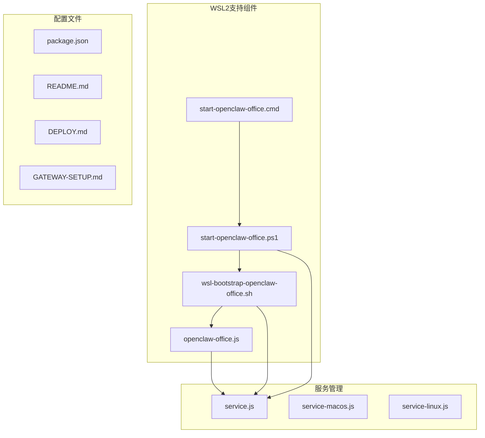
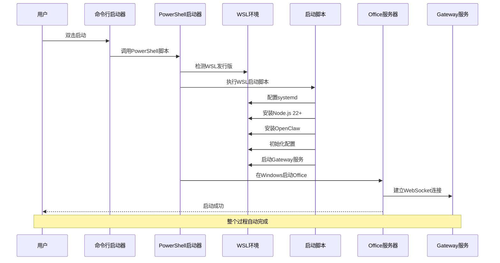
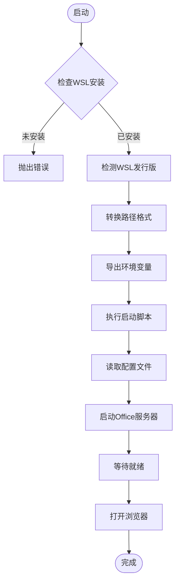
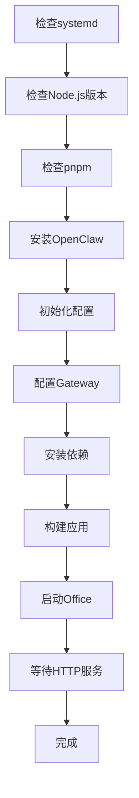
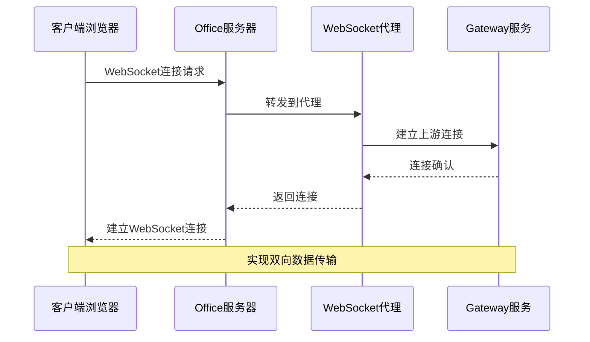
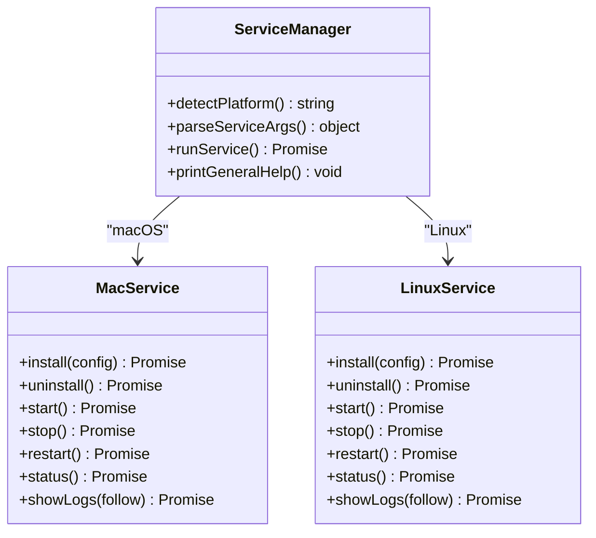
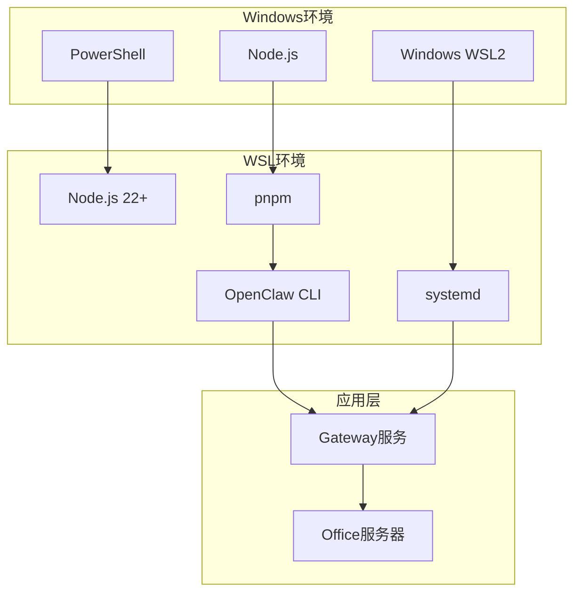
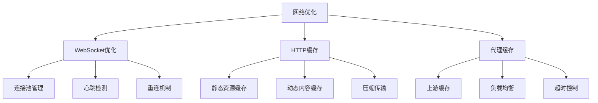

# WSL2支持

<cite>
**本文档引用的文件**
- [wsl-bootstrap-openclaw-office.sh](file://scripts/wsl-bootstrap-openclaw-office.sh)
- [start-openclaw-office.ps1](file://scripts/start-openclaw-office.ps1)
- [start-openclaw-office.cmd](file://start-openclaw-office.cmd)
- [openclaw-office.js](file://bin/openclaw-office.js)
- [service.js](file://bin/service.js)
- [service-macos.js](file://bin/service-macos.js)
- [service-linux.js](file://bin/service-linux.js)
- [README.md](file://README.md)
- [DEPLOY.md](file://DEPLOY.md)
- [GATEWAY-SETUP.md](file://GATEWAY-SETUP.md)
- [package.json](file://package.json)
</cite>

## 目录
1. [简介](#简介)
2. [项目结构](#项目结构)
3. [核心组件](#核心组件)
4. [架构概览](#架构概览)
5. [详细组件分析](#详细组件分析)
6. [依赖关系分析](#依赖关系分析)
7. [性能考虑](#性能考虑)
8. [故障排除指南](#故障排除指南)
9. [结论](#结论)
10. [附录](#附录)

## 简介

OpenClaw Office 提供了完整的 Windows 子系统 Linux (WSL2) 集成支持，实现了从 Ubuntu 发行版安装到一键启动的完整自动化流程。该系统通过三个主要组件协同工作：PowerShell 启动器负责 Windows 环境的协调，WSL 启动脚本负责 Linux 环境的配置，Node.js 服务器负责前端服务的运行。

WSL2 支持的核心目标是简化 Windows 用户的部署体验，通过自动化的环境检测、依赖安装和配置管理，让用户能够快速启动 OpenClaw Office 而无需手动配置复杂的开发环境。

## 项目结构

该项目采用模块化设计，WSL2 支持相关的文件主要集中在以下位置：

**图表来源**
- [start-openclaw-office.cmd:1-11](file://start-openclaw-office.cmd#L1-L11)
- [start-openclaw-office.ps1:1-281](file://scripts/start-openclaw-office.ps1#L1-L281)
- [wsl-bootstrap-openclaw-office.sh:1-321](file://scripts/wsl-bootstrap-openclaw-office.sh#L1-L321)

**章节来源**
- [README.md:160-193](file://README.md#L160-L193)
- [package.json:25-27](file://package.json#L25-L27)

## 核心组件

### Windows 启动器组件

Windows 启动器提供了两种启动方式：命令行启动器和 PowerShell 启动器。它们都通过统一的 PowerShell 脚本实现完整的部署流程。

### WSL 配置组件

WSL 配置组件负责在 Linux 环境中进行必要的系统配置，包括 systemd 启用、Node.js 版本检查和更新、依赖安装等。

### 服务管理组件

服务管理组件提供了跨平台的服务管理能力，支持 macOS 的 launchd 和 Linux 的 systemd，实现了服务的自动启动和状态管理。

**章节来源**
- [start-openclaw-office.cmd:1-11](file://start-openclaw-office.cmd#L1-L11)
- [start-openclaw-office.ps1:1-281](file://scripts/start-openclaw-office.ps1#L1-L281)
- [wsl-bootstrap-openclaw-office.sh:1-321](file://scripts/wsl-bootstrap-openclaw-office.sh#L1-L321)

## 架构概览

OpenClaw Office 的 WSL2 架构采用了分层设计，实现了 Windows 和 Linux 环境之间的无缝集成：

**图表来源**
- [start-openclaw-office.cmd:1-11](file://start-openclaw-office.cmd#L1-L11)
- [start-openclaw-office.ps1:216-281](file://scripts/start-openclaw-office.ps1#L216-L281)
- [wsl-bootstrap-openclaw-office.sh:297-321](file://scripts/wsl-bootstrap-openclaw-office.sh#L297-L321)

## 详细组件分析

### PowerShell 启动器 (start-openclaw-office.ps1)

PowerShell 启动器是整个 WSL2 支持的核心组件，提供了完整的自动化部署流程：

#### 主要功能特性

1. **WSL 发行版检测**：自动检测可用的 WSL 发行版，排除 docker-desktop
2. **路径转换**：将 Windows 路径转换为 WSL 可识别的路径格式
3. **环境变量传递**：将 PowerShell 参数转换为 Bash 环境变量
4. **远程命令执行**：通过 wsl.exe 执行 Linux 环境中的命令
5. **配置文件读取**：从 WSL 环境读取 OpenClaw 配置文件
6. **进程管理**：管理 Office 服务器的启动和停止

#### 核心函数分析

**图表来源**
- [start-openclaw-office.ps1:216-281](file://scripts/start-openclaw-office.ps1#L216-L281)

**章节来源**
- [start-openclaw-office.ps1:1-281](file://scripts/start-openclaw-office.ps1#L1-L281)

### WSL 启动脚本 (wsl-bootstrap-openclaw-office.sh)

WSL 启动脚本负责在 Linux 环境中进行完整的环境配置和应用启动：

#### 系统配置流程

1. **systemd 检测与启用**：检查并启用 systemd 支持
2. **Node.js 版本检查**：确保使用 Node.js 22.14 或更高版本
3. **pnpm 安装**：启用 Corepack 并安装 pnpm
4. **OpenClaw 安装**：安装指定版本的 OpenClaw CLI
5. **配置初始化**：自动生成 OpenClaw 配置文件
6. **Gateway 配置**：配置 Gateway 的安全设置
7. **Office 依赖**：安装 Office 前端依赖
8. **构建与启动**：构建生产版本并启动 Office 服务器

#### 关键配置点

**图表来源**
- [wsl-bootstrap-openclaw-office.sh:297-321](file://scripts/wsl-bootstrap-openclaw-office.sh#L297-L321)

**章节来源**
- [wsl-bootstrap-openclaw-office.sh:1-321](file://scripts/wsl-bootstrap-openclaw-office.sh#L1-L321)

### Office 服务器 (openclaw-office.js)

Office 服务器是前端应用的核心，提供了完整的 Web 服务功能：

#### WebSocket 代理功能

Office 服务器实现了智能的 WebSocket 代理功能，将客户端请求转发到 Gateway：

**图表来源**
- [openclaw-office.js:217-303](file://bin/openclaw-office.js#L217-L303)

#### 配置解析机制

Office 服务器支持多种配置来源，实现了灵活的配置管理：

| 配置来源 | 优先级 | 说明 |
|---------|--------|------|
| 命令行参数 | 最高 | 通过 --token、--gateway、--port 等参数指定 |
| 环境变量 | 中等 | OPENCLAW_GATEWAY_TOKEN、OPENCLAW_GATEWAY_URL、PORT |
| 配置文件 | 最低 | ~/.openclaw/openclaw.json |

**章节来源**
- [openclaw-office.js:102-149](file://bin/openclaw-office.js#L102-L149)

### 服务管理组件

服务管理组件提供了跨平台的服务管理能力，支持不同操作系统的服务启动和管理：

#### 平台检测与路由

**图表来源**
- [service.js:109-161](file://bin/service.js#L109-L161)
- [service-macos.js:42-284](file://bin/service-macos.js#L42-L284)

**章节来源**
- [service.js:1-213](file://bin/service.js#L1-L213)
- [service-macos.js:1-284](file://bin/service-macos.js#L1-L284)

## 依赖关系分析

### 环境依赖

WSL2 支持涉及多个层面的依赖关系：

**图表来源**
- [wsl-bootstrap-openclaw-office.sh:67-143](file://scripts/wsl-bootstrap-openclaw-office.sh#L67-L143)
- [package.json:79-82](file://package.json#L79-L82)

### 版本兼容性

| 组件 | 最低版本 | 推荐版本 | 说明 |
|------|----------|----------|------|
| Node.js | 22.14 | 22.14+ | 项目要求的最低版本 |
| OpenClaw | 2026.3.28 | 2026.3.28 | 默认安装版本 |
| WSL2 | Windows 10 21H2 | 最新版本 | 系统要求 |
| Ubuntu | 22.04 | 22.04+ | 推荐发行版 |

**章节来源**
- [wsl-bootstrap-openclaw-office.sh:5-8](file://scripts/wsl-bootstrap-openclaw-office.sh#L5-L8)
- [package.json:79-82](file://package.json#L79-L82)

## 性能考虑

### 启动性能优化

WSL2 支持在多个方面进行了性能优化：

1. **并行执行**：PowerShell 启动器和 WSL 启动脚本可以并行执行
2. **缓存机制**：Office 服务器实现了聊天历史的分片缓存
3. **懒加载**：静态资源和服务端点按需加载
4. **连接池**：WebSocket 连接的高效管理

### 内存管理

Office 服务器采用了高效的内存管理策略：

- **聊天缓存**：按天分片存储聊天历史，最多保留90天
- **文件系统访问**：严格的路径验证防止目录遍历攻击
- **资源清理**：及时释放不再使用的资源

### 网络优化

## 故障排除指南

### 常见问题诊断

#### WSL 环境问题

| 问题 | 症状 | 解决方案 |
|------|------|----------|
| systemd 未启用 | 启动失败，提示需要systemd | 手动启用systemd并重启WSL |
| Node.js 版本过低 | 安装失败或运行异常 | 升级到Node.js 22.14+ |
| sudo 权限不足 | 无法安装软件包 | 配置sudo免密权限 |
| 网络连接失败 | 无法访问Gateway | 检查防火墙和网络配置 |

#### PowerShell 启动器问题

| 问题 | 症状 | 解决方案 |
|------|------|----------|
| WSL未安装 | 报错提示未检测到WSL | 安装WSL2并重启系统 |
| 发行版检测失败 | 无法找到可用的WSL发行版 | 手动指定发行版名称 |
| 路径转换错误 | 无法找到脚本文件 | 检查路径格式和权限 |
| 端口占用 | Office无法启动 | 更改端口号或停止占用进程 |

#### Office 服务器问题

| 问题 | 症状 | 解决方案 |
|------|------|----------|
| WebSocket连接失败 | 控制台显示连接中 | 检查Gateway状态和token |
| 配置文件读取失败 | 无法获取Gateway token | 验证配置文件路径和权限 |
| 静态资源加载失败 | 页面显示空白 | 检查dist目录和文件权限 |
| 聊天缓存异常 | 历史记录丢失 | 清理缓存目录并重启服务 |

### 调试技巧

1. **查看日志文件**：检查 .runtime/ 目录下的日志文件
2. **网络诊断**：使用 curl 测试 Gateway 连接
3. **端口检查**：使用 netstat 检查端口占用情况
4. **权限验证**：确认文件和目录的访问权限

**章节来源**
- [start-openclaw-office.ps1:216-281](file://scripts/start-openclaw-office.ps1#L216-L281)
- [wsl-bootstrap-openclaw-office.sh:208-221](file://scripts/wsl-bootstrap-openclaw-office.sh#L208-L221)

## 结论

OpenClaw Office 的 WSL2 支持提供了一个完整的、自动化的部署解决方案，实现了 Windows 和 Linux 环境之间的无缝集成。通过精心设计的组件架构和完善的错误处理机制，用户可以轻松地在 Windows 系统上启动和运行 OpenClaw Office。

该系统的成功关键在于：

1. **自动化程度高**：从环境检测到应用启动的全流程自动化
2. **跨平台兼容**：支持 Windows、macOS 和 Linux 的服务管理
3. **错误处理完善**：提供了详细的错误诊断和解决方案
4. **性能优化**：在多个层面进行了性能优化和资源管理

未来可以考虑的改进方向包括：

- 增加更多的配置选项和自定义能力
- 提供更详细的性能监控和分析功能
- 支持更多的 Linux 发行版和 WSL 配置
- 增强与其他开发工具的集成能力

## 附录

### 配置参数参考

#### PowerShell 启动器参数

| 参数 | 类型 | 默认值 | 说明 |
|------|------|--------|------|
| Distro | string | "" | WSL 发行版名称，空则自动检测 |
| OpenClawVersion | string | "2026.3.28" | 要安装的 OpenClaw 版本 |
| OfficePort | int | 5180 | Office Server 端口 |
| GatewayPort | int | 18789 | Gateway 端口 |

#### 环境变量

| 变量名 | 默认值 | 说明 |
|--------|--------|------|
| OPENCLAW_VERSION | 2026.3.28 | OpenClaw 版本 |
| OPENCLAW_OFFICE_PORT | 5180 | Office 端口 |
| OPENCLAW_GATEWAY_PORT | 18789 | Gateway 端口 |
| OPENCLAW_SKIP_OFFICE_START | 0 | 跳过 Office 启动 |

#### 服务管理命令

| 命令 | 说明 | 示例 |
|------|------|------|
| install | 安装为系统服务 | openclaw-office service install --token <token> |
| uninstall | 卸载系统服务 | openclaw-office service uninstall |
| start | 启动服务 | openclaw-office service start |
| stop | 停止服务 | openclaw-office service stop |
| restart | 重启服务 | openclaw-office service restart |
| status | 查看状态 | openclaw-office service status |
| log | 查看日志 | openclaw-office service log --follow |