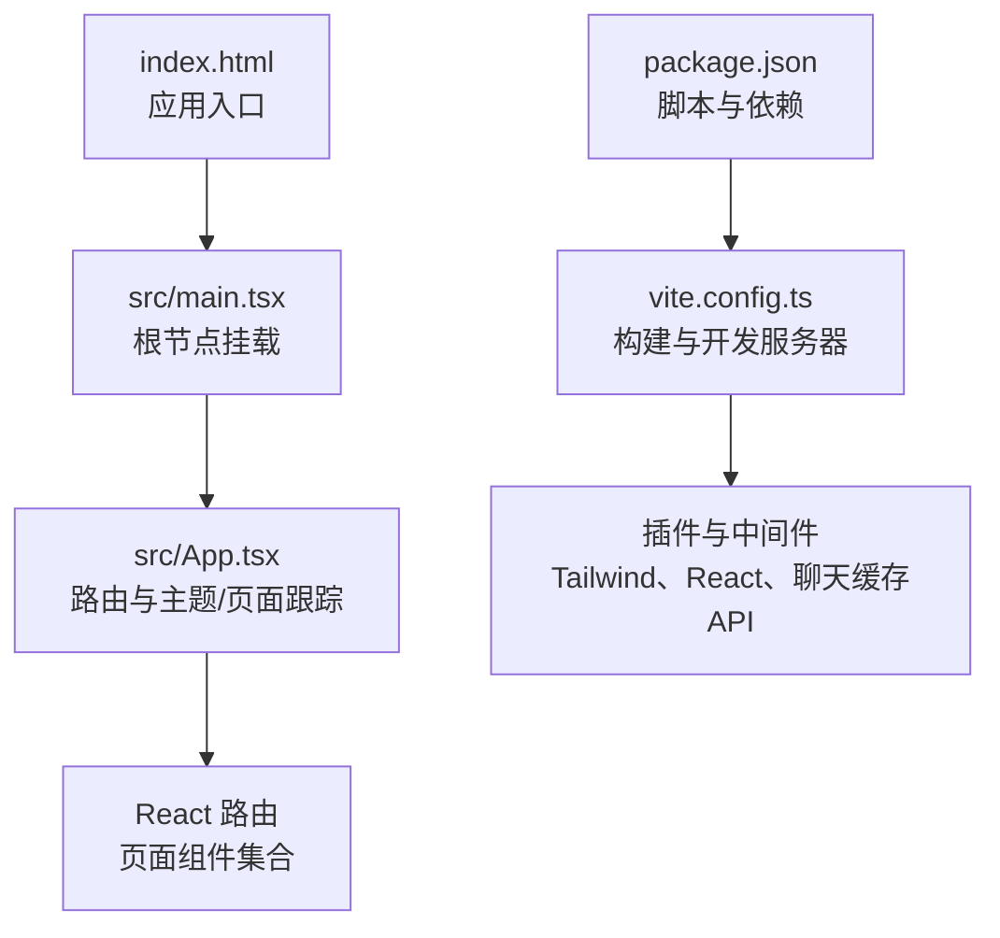
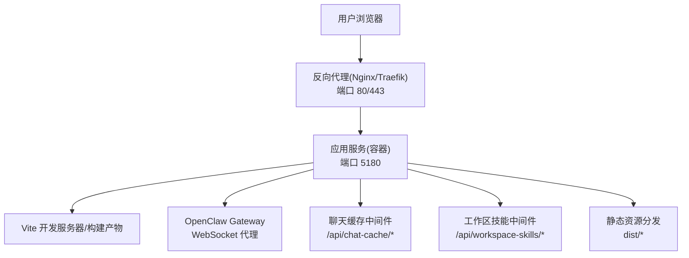
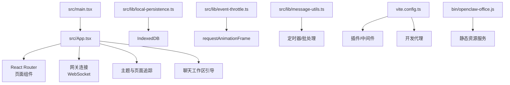

# 性能优化

<cite>
**本文引用的文件**
- [vite.config.ts](file://vite.config.ts)
- [package.json](file://package.json)
- [src/main.tsx](file://src/main.tsx)
- [index.html](file://index.html)
- [src/App.tsx](file://src/App.tsx)
- [src/hooks/useChatStreamingText.ts](file://src/hooks/useChatStreamingText.ts)
- [src/lib/local-persistence.ts](file://src/lib/local-persistence.ts)
- [src/lib/event-throttle.ts](file://src/lib/event-throttle.ts)
- [src/lib/message-utils.ts](file://src/lib/message-utils.ts)
- [DEPLOY.md](file://DEPLOY.md)
- [bin/openclaw-office.js](file://bin/openclaw-office.js)
</cite>

## 目录
1. [简介](#简介)
2. [项目结构](#项目结构)
3. [核心组件](#核心组件)
4. [架构总览](#架构总览)
5. [详细组件分析](#详细组件分析)
6. [依赖关系分析](#依赖关系分析)
7. [性能考量](#性能考量)
8. [故障排查指南](#故障排查指南)
9. [结论](#结论)
10. [附录](#附录)

## 简介
本文件面向性能优化目标，系统梳理 OpenClaw Office 前端在 Vite 构建、代码分割与懒加载、静态资源优化、缓存策略、内存管理、渲染性能、网络请求优化、性能监控与基准测试、以及生产部署与 CDN/负载均衡等方面的现状与改进建议。文档以仓库现有实现为基础，结合可落地的优化策略，帮助团队在不改变业务逻辑的前提下显著提升用户体验与系统稳定性。

## 项目结构
前端采用 Vite + React 技术栈，入口通过 index.html 加载 src/main.tsx，应用路由在 src/App.tsx 中定义。构建配置集中在 vite.config.ts，包含开发服务器、代理、插件与中间件等。生产环境通过 Docker 镜像提供，部署文档 DEPLOY.md 给出了 Nginx/Traefik 反代与健康检查等运维要点。

**图表来源**
- [index.html](file://index.html)
- [src/main.tsx](file://src/main.tsx)
- [src/App.tsx](file://src/App.tsx)
- [vite.config.ts](file://vite.config.ts)
- [package.json](file://package.json)

**章节来源**
- [index.html](file://index.html)
- [src/main.tsx](file://src/main.tsx)
- [src/App.tsx](file://src/App.tsx)
- [vite.config.ts](file://vite.config.ts)
- [package.json](file://package.json)

## 核心组件
- 构建与开发服务器：Vite 配置集中于 vite.config.ts，包含 React 插件、TailwindCSS 插件、开发代理、自定义中间件（聊天缓存 API、工作区技能 API）。
- 应用入口与路由：index.html 引入模块入口；src/main.tsx 使用 HashRouter 挂载根组件；src/App.tsx 定义页面映射、主题同步、页面追踪与网关连接。
- 性能相关库：local-persistence（IndexedDB 缓存）、event-throttle（帧调度节流）、message-utils（批量调度）、useChatStreamingText（流式文本处理）。

**章节来源**
- [vite.config.ts](file://vite.config.ts)
- [src/main.tsx](file://src/main.tsx)
- [src/App.tsx](file://src/App.tsx)
- [src/lib/local-persistence.ts](file://src/lib/local-persistence.ts)
- [src/lib/event-throttle.ts](file://src/lib/event-throttle.ts)
- [src/lib/message-utils.ts](file://src/lib/message-utils.ts)
- [src/hooks/useChatStreamingText.ts](file://src/hooks/useChatStreamingText.ts)

## 架构总览
下图展示从浏览器到后端网关的请求链路，包括 WebSocket 代理、静态资源服务与本地缓存协同。

**图表来源**
- [DEPLOY.md](file://DEPLOY.md)
- [vite.config.ts](file://vite.config.ts)
- [bin/openclaw-office.js](file://bin/openclaw-office.js)

**章节来源**
- [DEPLOY.md](file://DEPLOY.md)
- [vite.config.ts](file://vite.config.ts)
- [bin/openclaw-office.js](file://bin/openclaw-office.js)

## 详细组件分析

### Vite 构建与开发服务器优化
- 插件与别名
  - React 插件与 TailwindCSS 插件已启用，建议在生产构建中开启压缩与 Tree-Shaking（默认行为），并确保仅在开发阶段启用热更新。
  - 路径别名 @ 指向 src，有助于减少相对路径复杂度，利于 IDE 自动补全与重构。
- 开发代理
  - 将 /gateway-ws 与 /api/gateway/ws 代理至网关地址，WebSocket 透传，避免跨域与反向代理复杂性。
- 自定义中间件
  - 聊天缓存中间件：提供会话列表、消息读写、按会话删除等接口，支持本地离线缓存与分片存储，降低网关压力。
  - 工作区技能中间件：提供技能文件列表与读取，便于前端按需加载与缓存。

优化建议
- 生产构建
  - 启用最小化与作用域提升，确保第三方包被正确摇树。
  - 对大体积依赖（如 mermaid、recharts）进行按需引入或动态导入。
- 代码分割
  - 页面级路由组件（如 AgentsPage、SkillsPage 等）应使用 React.lazy 与 Suspense 实现懒加载。
  - 动态导入重型图表库与可视化组件，仅在进入对应页面时加载。
- 预构建优化
  - 保留 node_modules 预构建，但对大型依赖设置 external 并配合 CDN。
  - 使用 optimizeDeps.exclude 禁用不必要的预构建项，缩短冷启动时间。

**章节来源**
- [vite.config.ts](file://vite.config.ts)
- [package.json](file://package.json)

### 代码分割与懒加载
现状
- 路由组件在 App.tsx 中直接引入，未见 React.lazy 动态导入。
- 图表与可视化组件（recharts、mermaid）在 package.json 中声明为依赖，建议按需加载。

优化建议
- 使用 React.lazy 对每个页面组件进行动态导入，并在 Suspense 中提供骨架屏占位。
- 对重型库（如 mermaid）在需要渲染时再动态 import，避免首屏阻塞。
- 对第三方库进行 splitChunks 与 vendor 分包，提升缓存命中率。

**章节来源**
- [src/App.tsx](file://src/App.tsx)

### 静态资源优化
现状
- 构建产物位于 dist，由 bin/openclaw-office.js 提供静态文件服务与 MIME 类型映射。
- 未见明确的图片、字体、CSS 压缩与压缩策略配置。

优化建议
- 图片压缩
  - 使用 Vite 插件（如 @rollup/plugin-image 或 vite-plugin-imagemin）自动压缩 PNG/JPG/WebP。
  - 为不同 DPR 提供多尺寸资源，使用 <picture> 与 srcset。
- 字体优化
  - 使用 woff2 并禁用过时格式；按需加载字重与字符集。
  - 通过 font-display: swap 与字体子集化减少阻塞。
- CSS 优化
  - TailwindCSS 已启用，建议开启 purge/收集模式，移除未使用样式。
  - 将关键 CSS 内联，非关键 CSS 异步加载。
- JavaScript 压缩
  - 生产构建默认启用压缩，建议开启 brotli/gzip 并在反向代理启用压缩传输。

**章节来源**
- [bin/openclaw-office.js](file://bin/openclaw-office.js)
- [vite.config.ts](file://vite.config.ts)

### 缓存策略
现状
- 聊天缓存中间件：按会话分天存储 JSON 文件，限制最大天数，支持清理。
- 本地持久化：IndexedDB 封装，提供消息、事件、会话历史的增删查与容量阈值控制。

优化建议
- 浏览器缓存
  - 对静态资源设置长缓存（immutable），对 HTML 设置较短缓存并强制验证。
  - 对 API 接口使用 Cache-Control 与 ETag/Last-Modified。
- Service Worker
  - 为静态资源与 API 添加 SW 缓存策略（Cache First/Network Falling Back）。
  - 对聊天与事件数据采用 Stale-While-Revalidate。
- 本地存储优化
  - IndexedDB 清理过期数据与超限回收，建议在低配设备上降低保留条数。
  - 对消息与事件分别设置独立索引与过期策略，避免全表扫描。

**章节来源**
- [vite.config.ts](file://vite.config.ts)
- [src/lib/local-persistence.ts](file://src/lib/local-persistence.ts)

### 内存管理与渲染性能
现状
- 使用 requestAnimationFrame 进行批处理（StreamingMarkdownContent 与事件节流）。
- 事件节流使用 RAF 调度队列，避免高频更新导致的卡顿。
- 批量调度器（message-utils）对增量文本进行定时合并，减少渲染抖动。

优化建议
- React.memo 与 useMemo/useCallback
  - 对频繁渲染的组件（消息气泡、图表面板）使用 memo 化。
  - 对回调函数稳定化，避免子组件无谓重渲染。
- 虚拟滚动
  - 对长列表（消息历史、事件列表）采用虚拟滚动，仅渲染可视区域。
- 图形与动画
  - 对重型 3D/图表库使用懒加载与卸载策略，离开页面时释放资源。
- 内存泄漏防护
  - 在组件卸载时取消 RAF、定时器与订阅，确保 IndexedDB 事务完成。

**章节来源**
- [src/components/chat/StreamingMarkdownContent.tsx](file://src/components/chat/StreamingMarkdownContent.tsx)
- [src/lib/event-throttle.ts](file://src/lib/event-throttle.ts)
- [src/lib/message-utils.ts](file://src/lib/message-utils.ts)

### 网络请求优化
现状
- 开发代理将 WebSocket 请求转发至网关，避免跨域与反代复杂性。
- 聊天缓存中间件与工作区技能中间件提供本地化 API，降低远端依赖。

优化建议
- 请求合并与去抖
  - 对高频 API（如消息拉取）使用节流/去抖策略。
  - 对批量写入（保存会话、事件）使用队列合并。
- 优先级与并发
  - 将关键请求（页面首屏、网关握手）设为高优先级。
  - 控制并发数，避免资源争用。
- 错误与重试
  - 对临时错误（网络抖动）实施指数退避重试。
  - 对永久错误（鉴权失败）快速失败并引导用户修复。

**章节来源**
- [vite.config.ts](file://vite.config.ts)
- [src/lib/local-persistence.ts](file://src/lib/local-persistence.ts)

### 性能监控与基准测试
建议指标
- 首屏时间（FCP/LCP/CLS/INP）
- 首次有效绘制（TTFD）
- 交互延迟（FID/INP）
- 资源大小（JS/CSS/HTML/图片）
- 缓存命中率与 TTFB

基准测试方法
- 使用 Lighthouse/Audit 进行自动化评估。
- 使用 WebPageTest/SpeedCurve 进行跨地区与设备测试。
- 使用埋点记录关键路径耗时与错误率。

工具使用指南
- Chrome DevTools Performance/Network/Memory 面板。
- React DevTools Profiler 分析渲染热点。
- Lighthouse CLI 自动化报告。

[本节为通用指导，无需特定文件引用]

### 生产部署优化、CDN 与负载均衡
现状
- Docker 镜像提供静态资源服务与反代配置示例（Nginx/Traefik）。
- 环境变量驱动网关地址与认证令牌。

优化建议
- 镜像与分层
  - 使用多阶段构建，分离构建与运行时镜像。
  - 将静态资源与运行时二进制分离，便于缓存与更新。
- CDN 集成
  - 将 dist/* 静态资源托管至 CDN，设置全球边缘节点与缓存策略。
  - 对 HTML 与动态 API 配置就近回源。
- 负载均衡
  - 多实例部署，使用健康检查与自动扩缩容。
  - 对 WebSocket 连接做粘性会话或共享状态（如 Redis）。
- 反向代理
  - 启用 gzip/br 压缩与 HTTP/2。
  - 配置超时与限流，保护后端网关。

**章节来源**
- [DEPLOY.md](file://DEPLOY.md)
- [bin/openclaw-office.js](file://bin/openclaw-office.js)

## 依赖关系分析
下图展示前端关键模块之间的依赖与调用关系，突出构建、缓存与网关交互的关键路径。

**图表来源**
- [src/main.tsx](file://src/main.tsx)
- [src/App.tsx](file://src/App.tsx)
- [src/lib/local-persistence.ts](file://src/lib/local-persistence.ts)
- [src/lib/event-throttle.ts](file://src/lib/event-throttle.ts)
- [src/lib/message-utils.ts](file://src/lib/message-utils.ts)
- [vite.config.ts](file://vite.config.ts)
- [bin/openclaw-office.js](file://bin/openclaw-office.js)

**章节来源**
- [src/main.tsx](file://src/main.tsx)
- [src/App.tsx](file://src/App.tsx)
- [src/lib/local-persistence.ts](file://src/lib/local-persistence.ts)
- [src/lib/event-throttle.ts](file://src/lib/event-throttle.ts)
- [src/lib/message-utils.ts](file://src/lib/message-utils.ts)
- [vite.config.ts](file://vite.config.ts)
- [bin/openclaw-office.js](file://bin/openclaw-office.js)

## 性能考量
- 构建阶段
  - 优先启用压缩与 Tree-Shaking；对大依赖进行外部化与 CDN 化。
  - 合理拆分 chunk，避免单文件过大。
- 运行阶段
  - 使用懒加载与虚拟滚动；对高频更新使用 RAF 与批处理。
  - 严格控制 IndexedDB 写入频率与事务大小，避免主线程阻塞。
- 网络阶段
  - 静态资源长缓存；API 使用协商缓存；WebSocket 保持连接复用。
- 监控阶段
  - 建立端到端指标体系，持续回归测试，及时发现回归。

[本节为通用指导，无需特定文件引用]

## 故障排查指南
- 构建失败或包体积异常
  - 检查 vite.config.ts 插件与 optimizeDeps 配置，确认依赖版本兼容。
- 首屏慢
  - 使用 React Profiler 定位重渲染热点；检查是否缺少懒加载与关键 CSS 内联。
- WebSocket 断连
  - 检查反向代理升级头配置与超时设置；确认网关地址与令牌。
- IndexedDB 写入失败
  - 检查配额阈值与清理流程；确认事务完成后再写入。
- 缓存命中差
  - 检查静态资源缓存头与 CDN 配置；确认 HTML 未被缓存或强制刷新。

**章节来源**
- [vite.config.ts](file://vite.config.ts)
- [src/lib/local-persistence.ts](file://src/lib/local-persistence.ts)
- [DEPLOY.md](file://DEPLOY.md)

## 结论
通过在构建、资源、缓存、渲染与网络等维度的系统性优化，OpenClaw Office 可在保证功能完整性的同时显著提升性能与稳定性。建议优先落实代码分割与懒加载、静态资源压缩与 CDN、缓存策略与 IndexedDB 优化，并建立完善的性能监控与回归测试机制，持续迭代。

[本节为总结，无需特定文件引用]

## 附录
- 关键实现参考路径
  - 构建与代理：[vite.config.ts](file://vite.config.ts)
  - 应用入口与路由：[src/main.tsx](file://src/main.tsx)、[src/App.tsx](file://src/App.tsx)
  - 本地缓存：[src/lib/local-persistence.ts](file://src/lib/local-persistence.ts)
  - 事件节流与批处理：[src/lib/event-throttle.ts](file://src/lib/event-throttle.ts)、[src/lib/message-utils.ts](file://src/lib/message-utils.ts)
  - 流式文本处理：[src/hooks/useChatStreamingText.ts](file://src/hooks/useChatStreamingText.ts)
  - 部署与反代：[DEPLOY.md](file://DEPLOY.md)
  - 静态资源服务：[bin/openclaw-office.js](file://bin/openclaw-office.js)

[本节为附录，无需特定文件引用]