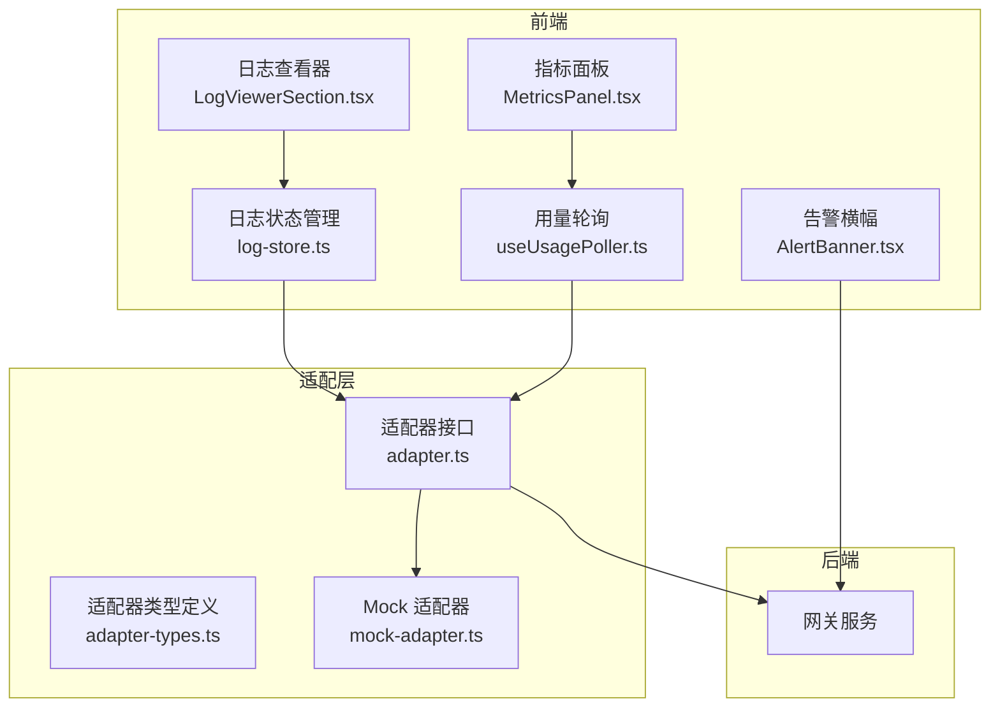
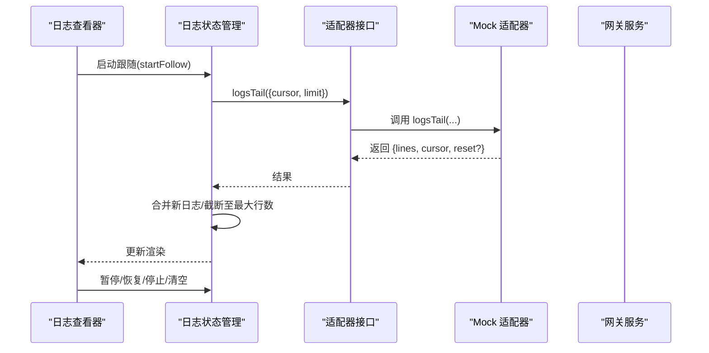
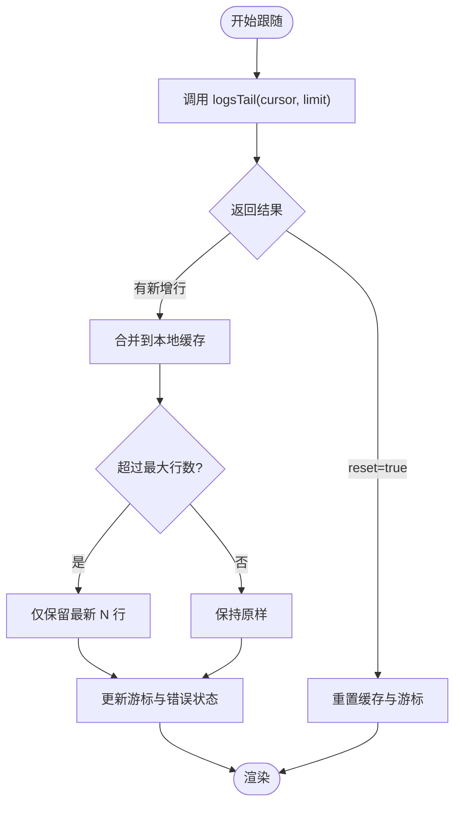
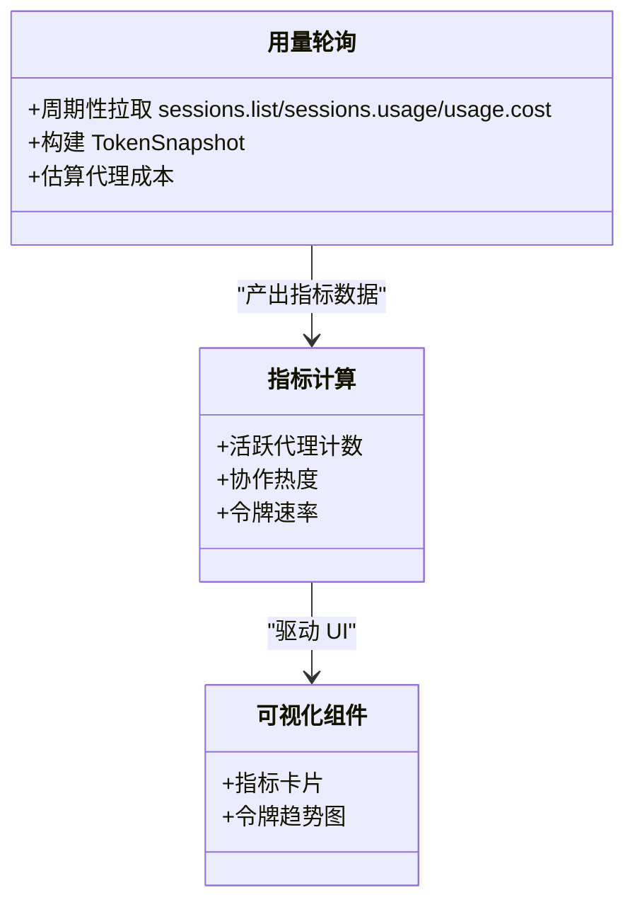
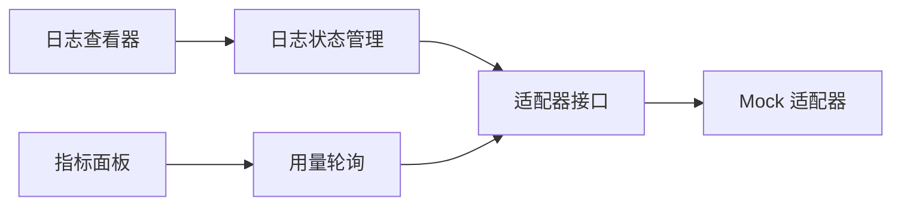

# 监控和日志

<cite>
**本文引用的文件**
- [src/components/console/settings/LogViewerSection.tsx](file://src/components/console/settings/LogViewerSection.tsx)
- [src/store/console-stores/log-store.ts](file://src/store/console-stores/log-store.ts)
- [src/gateway/adapter.ts](file://src/gateway/adapter.ts)
- [src/gateway/adapter-types.ts](file://src/gateway/adapter-types.ts)
- [src/gateway/mock-adapter.ts](file://src/gateway/mock-adapter.ts)
- [src/components/console/dashboard/AlertBanner.tsx](file://src/components/console/dashboard/AlertBanner.tsx)
- [src/store/console-stores/service-store.ts](file://src/store/console-stores/service-store.ts)
- [src/store/console-stores/config-store.ts](file://src/store/console-stores/config-store.ts)
- [src/components/panels/MetricsPanel.tsx](file://src/components/panels/MetricsPanel.tsx)
- [src/store/metrics-reducer.ts](file://src/store/metrics-reducer.ts)
- [src/components/panels/TokenLineChart.tsx](file://src/components/panels/TokenLineChart.tsx)
- [src/hooks/useUsagePoller.ts](file://src/hooks/useUsagePoller.ts)
- [src/store/console-stores/log-store.test.ts](file://src/store/console-stores/log-store.test.ts)
- [src/components/pages/SettingsPage.tsx](file://src/components/pages/SettingsPage.tsx)
- [src/components/pages/DashboardPage.tsx](file://src/components/pages/DashboardPage.tsx)
</cite>

## 目录
1. [简介](#简介)
2. [项目结构](#项目结构)
3. [核心组件](#核心组件)
4. [架构总览](#架构总览)
5. [详细组件分析](#详细组件分析)
6. [依赖关系分析](#依赖关系分析)
7. [性能考量](#性能考量)
8. [故障排查指南](#故障排查指南)
9. [结论](#结论)
10. [附录](#附录)

## 简介
本文件面向 OpenClaw-Office 的监控与日志体系，覆盖以下主题：
- 日志系统架构：前端日志收集、日志级别分类、日志格式标准化
- 日志查看器功能：实时日志显示、滚动与暂停控制、清空与状态指示
- 服务器端日志持久化：轮转与清理策略建议（基于现有接口能力）
- 性能监控指标：应用性能、资源使用、错误率统计
- 监控告警配置、日志分析工具、故障诊断流程
- 生产环境监控部署、日志聚合、分布式追踪的实现方案

## 项目结构
OpenClaw-Office 将“日志”抽象为统一的适配器接口，前端通过适配器拉取后端日志流；同时提供仪表盘与指标面板用于运行时监控。

图表来源
- [src/components/console/settings/LogViewerSection.tsx:1-156](file://src/components/console/settings/LogViewerSection.tsx#L1-L156)
- [src/store/console-stores/log-store.ts:1-108](file://src/store/console-stores/log-store.ts#L1-L108)
- [src/gateway/adapter.ts:1-113](file://src/gateway/adapter.ts#L1-L113)
- [src/gateway/adapter-types.ts:421-436](file://src/gateway/adapter-types.ts#L421-L436)
- [src/gateway/mock-adapter.ts:1209-1250](file://src/gateway/mock-adapter.ts#L1209-L1250)
- [src/components/console/dashboard/AlertBanner.tsx:1-38](file://src/components/console/dashboard/AlertBanner.tsx#L1-L38)
- [src/components/panels/MetricsPanel.tsx:1-61](file://src/components/panels/MetricsPanel.tsx#L1-L61)
- [src/hooks/useUsagePoller.ts:1-106](file://src/hooks/useUsagePoller.ts#L1-L106)

章节来源
- [src/components/pages/SettingsPage.tsx:1-26](file://src/components/pages/SettingsPage.tsx#L1-L26)
- [src/components/pages/DashboardPage.tsx:63-86](file://src/components/pages/DashboardPage.tsx#L63-L86)

## 核心组件
- 日志查看器与状态管理：负责实时拉取、滚动、暂停/恢复、清空日志，并在 UI 中展示状态与行数统计。
- 适配器接口与类型：定义统一的日志尾随接口与参数/结果结构，支持真实网关与 Mock 实现。
- 告警与服务状态：通过告警横幅提示连接或通道异常，服务状态管理提供平台可用性检测与启停操作。
- 指标面板与用量轮询：从会话与用量接口聚合令牌消耗趋势，估算成本并可视化。

章节来源
- [src/components/console/settings/LogViewerSection.tsx:1-156](file://src/components/console/settings/LogViewerSection.tsx#L1-L156)
- [src/store/console-stores/log-store.ts:1-108](file://src/store/console-stores/log-store.ts#L1-L108)
- [src/gateway/adapter.ts:110-112](file://src/gateway/adapter.ts#L110-L112)
- [src/gateway/adapter-types.ts:421-436](file://src/gateway/adapter-types.ts#L421-L436)
- [src/components/console/dashboard/AlertBanner.tsx:1-38](file://src/components/console/dashboard/AlertBanner.tsx#L1-L38)
- [src/store/console-stores/service-store.ts:1-205](file://src/store/console-stores/service-store.ts#L1-L205)
- [src/components/panels/MetricsPanel.tsx:1-61](file://src/components/panels/MetricsPanel.tsx#L1-L61)
- [src/hooks/useUsagePoller.ts:1-106](file://src/hooks/useUsagePoller.ts#L1-L106)

## 架构总览
前端通过适配器统一访问后端日志与状态信息。日志查看器以轮询方式拉取增量日志，结合游标与限流控制，避免内存膨胀；告警横幅与服务状态管理提供运行时健康度反馈；指标面板与用量轮询提供性能与成本维度的可视化。

图表来源
- [src/store/console-stores/log-store.ts:24-58](file://src/store/console-stores/log-store.ts#L24-L58)
- [src/gateway/adapter.ts:110-112](file://src/gateway/adapter.ts#L110-L112)
- [src/gateway/mock-adapter.ts:1211-1249](file://src/gateway/mock-adapter.ts#L1211-L1249)

## 详细组件分析

### 日志查看器与实时拉取
- 功能要点
  - 自动跟随：启动后以固定间隔轮询后端日志，合并新增行并限制最大行数。
  - 可见性控制：页面隐藏时自动暂停，回到前台恢复。
  - 用户交互：暂停/恢复、停止、清空、滚动到底部。
  - 状态指示：根据跟随与暂停状态显示状态点与颜色。
  - 行级高亮：按日志级别关键字进行颜色区分。
- 关键行为
  - 轮询间隔、每页拉取条数、最大缓存行数均在状态管理中集中配置。
  - 当后端返回 reset 标记时，强制重置本地缓存，确保一致性。
  - 错误捕获并写入状态，便于 UI 展示。

图表来源
- [src/store/console-stores/log-store.ts:24-58](file://src/store/console-stores/log-store.ts#L24-L58)

章节来源
- [src/components/console/settings/LogViewerSection.tsx:1-156](file://src/components/console/settings/LogViewerSection.tsx#L1-L156)
- [src/store/console-stores/log-store.ts:1-108](file://src/store/console-stores/log-store.ts#L1-L108)

### 日志级别与格式标准化
- 日志级别识别：UI 依据行内关键字进行颜色区分，便于快速定位错误与警告。
- 日志格式：Mock 适配器生成的标准格式包含时间戳、级别、来源与消息体，便于解析与过滤。
- 建议规范
  - 统一时间戳格式与时区标注。
  - 固定字段顺序：时间戳、级别、来源、消息。
  - 结构化字段（如 traceId、spanId、agentId、sessionId）便于检索与关联。

章节来源
- [src/components/console/settings/LogViewerSection.tsx:145-156](file://src/components/console/settings/LogViewerSection.tsx#L145-L156)
- [src/gateway/mock-adapter.ts:1211-1249](file://src/gateway/mock-adapter.ts#L1211-L1249)

### 服务器端日志持久化与轮转
- 接口能力
  - 适配器提供日志尾随接口，返回文件路径、游标、大小与行列表，支持 reset 标记。
- 存储策略建议
  - 文件轮转：按大小或时间轮转，保留最近 N 天/文件数量。
  - 清理规则：删除过期日志、压缩历史文件、保留关键错误日志。
  - 远程备份：将日志上传至对象存储或集中日志平台。
- 注意：当前仓库未包含后端日志实现细节，以上为基于接口能力的通用实践建议。

章节来源
- [src/gateway/adapter-types.ts:421-436](file://src/gateway/adapter-types.ts#L421-L436)
- [src/gateway/adapter.ts:110-112](file://src/gateway/adapter.ts#L110-L112)

### 性能监控指标
- 指标来源
  - 用量轮询：周期性从会话列表与用量接口聚合令牌消耗，估算成本。
  - 指标计算：活跃代理数、总代理数、协作热度、令牌速率等。
- 可视化
  - 指标卡片：展示活跃/总数、总令牌、协作百分比、令牌速率。
  - 令牌趋势图：按时间窗口绘制总令牌与前 N 高代理的曲线。

图表来源
- [src/hooks/useUsagePoller.ts:1-106](file://src/hooks/useUsagePoller.ts#L1-L106)
- [src/store/metrics-reducer.ts:1-27](file://src/store/metrics-reducer.ts#L1-L27)
- [src/components/panels/MetricsPanel.tsx:1-61](file://src/components/panels/MetricsPanel.tsx#L1-L61)
- [src/components/panels/TokenLineChart.tsx:1-124](file://src/components/panels/TokenLineChart.tsx#L1-L124)

章节来源
- [src/hooks/useUsagePoller.ts:1-106](file://src/hooks/useUsagePoller.ts#L1-L106)
- [src/store/metrics-reducer.ts:1-27](file://src/store/metrics-reducer.ts#L1-L27)
- [src/components/panels/MetricsPanel.tsx:1-61](file://src/components/panels/MetricsPanel.tsx#L1-L61)
- [src/components/panels/TokenLineChart.tsx:1-124](file://src/components/panels/TokenLineChart.tsx#L1-L124)

### 告警与服务状态
- 告警横幅：根据严重程度显示警告/错误样式，支持附加动作按钮。
- 服务状态：检查平台可用性、查询服务运行状态、启停/重启/安装/卸载服务。
- 配置生命周期：保存/应用配置时的状态机与重启调度提示。

章节来源
- [src/components/console/dashboard/AlertBanner.tsx:1-38](file://src/components/console/dashboard/AlertBanner.tsx#L1-L38)
- [src/store/console-stores/service-store.ts:1-205](file://src/store/console-stores/service-store.ts#L1-L205)
- [src/store/console-stores/config-store.ts:1-420](file://src/store/console-stores/config-store.ts#L1-L420)

### 测试与验证
- 日志状态管理测试：覆盖初始状态、启动/停止跟随、暂停切换等关键行为。
- 指标与用量轮询：通过测试验证指标面板的数据展示逻辑与轮询行为。

章节来源
- [src/store/console-stores/log-store.test.ts:1-48](file://src/store/console-stores/log-store.test.ts#L1-L48)
- [src/components/panels/__tests__/MetricsPanel.test.tsx:1-38](file://src/components/panels/__tests__/MetricsPanel.test.tsx#L1-L38)

## 依赖关系分析
- 组件耦合
  - 日志查看器强依赖日志状态管理；日志状态管理依赖适配器接口。
  - 指标面板与用量轮询通过 RPC 客户端访问后端接口，不直接依赖适配器。
- 外部依赖
  - 适配器接口与类型定义为跨模块契约，Mock 适配器提供开发/测试支撑。
- 循环依赖
  - 未发现循环依赖迹象；各模块职责清晰。

图表来源
- [src/components/console/settings/LogViewerSection.tsx:1-156](file://src/components/console/settings/LogViewerSection.tsx#L1-L156)
- [src/store/console-stores/log-store.ts:1-108](file://src/store/console-stores/log-store.ts#L1-L108)
- [src/gateway/adapter.ts:1-113](file://src/gateway/adapter.ts#L1-L113)
- [src/gateway/mock-adapter.ts:1209-1250](file://src/gateway/mock-adapter.ts#L1209-L1250)
- [src/components/panels/MetricsPanel.tsx:1-61](file://src/components/panels/MetricsPanel.tsx#L1-L61)
- [src/hooks/useUsagePoller.ts:1-106](file://src/hooks/useUsagePoller.ts#L1-L106)

## 性能考量
- 前端性能
  - 轮询间隔与每页拉取量需平衡实时性与网络负载。
  - 最大缓存行数限制可有效防止内存膨胀。
  - 页面不可见时暂停轮询，减少无意义请求。
- 后端性能
  - 日志轮转与清理应避免阻塞 IO。
  - 对高频查询建立索引，优化按时间/来源/级别的过滤。
- 指标计算
  - 用量轮询间隔建议大于 60 秒，避免对后端造成压力。
  - 估算成本与令牌趋势应异步处理，避免阻塞 UI。

## 故障排查指南
- 日志无法显示
  - 检查适配器是否成功初始化与连接。
  - 查看日志状态中的错误字段，确认轮询是否被暂停或停止。
  - 确认页面可见性未导致自动暂停。
- 告警提示
  - 网关断连或通道错误时，仪表盘与告警横幅会提示具体问题。
  - 使用服务状态管理检查平台可用性与服务运行状态。
- 指标异常
  - 若用量轮询失败达到阈值，系统会回退到基于事件历史的估算。
  - 检查 RPC 客户端连接状态与后端接口可用性。

章节来源
- [src/store/console-stores/log-store.ts:77-85](file://src/store/console-stores/log-store.ts#L77-L85)
- [src/components/pages/DashboardPage.tsx:78-86](file://src/components/pages/DashboardPage.tsx#L78-L86)
- [src/store/console-stores/service-store.ts:56-93](file://src/store/console-stores/service-store.ts#L56-L93)
- [src/hooks/useUsagePoller.ts:83-93](file://src/hooks/useUsagePoller.ts#L83-L93)

## 结论
OpenClaw-Office 的监控与日志体系以适配器为核心，实现了前端对后端日志与状态的统一访问。日志查看器具备实时跟随、暂停/恢复、清空与状态指示等能力；指标面板与用量轮询提供了性能与成本的可视化；告警与服务状态管理增强了运行时可观测性。建议在生产环境中完善后端日志轮转与清理策略，并引入集中日志平台与分布式追踪以进一步提升可观测性。

## 附录
- 日志格式示例（Mock 适配器生成）
  - 时间戳、级别、来源、消息
  - 示例：[时间戳] [级别] [来源] 消息内容
- 建议的结构化字段
  - traceId、spanId、agentId、sessionId、requestId
- 分布式追踪与日志聚合
  - 在后端为每个请求生成 traceId 并在日志中输出。
  - 使用集中日志平台（如 ELK、Grafana Loki）进行聚合与检索。
  - 在前端将 traceId 显示在告警与日志行中，便于关联。