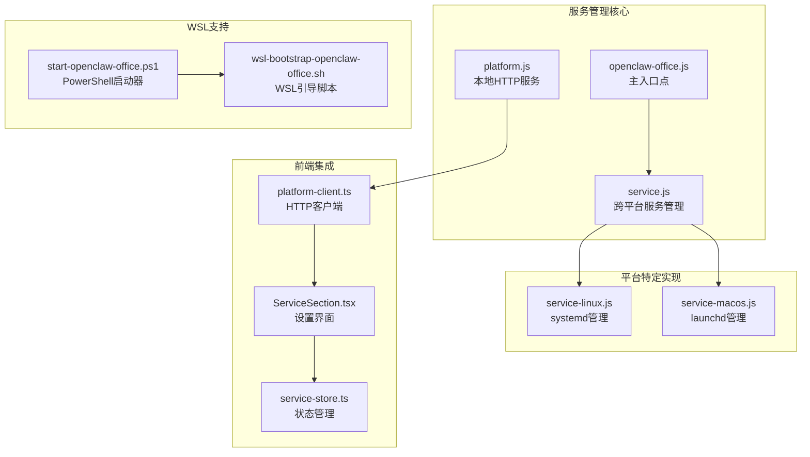
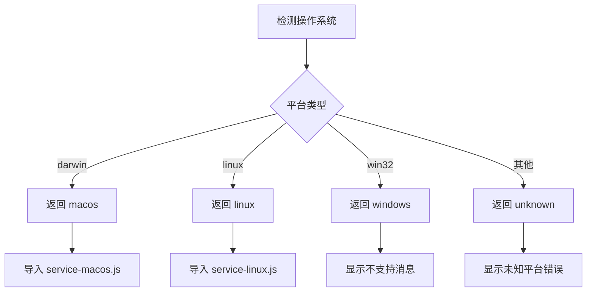
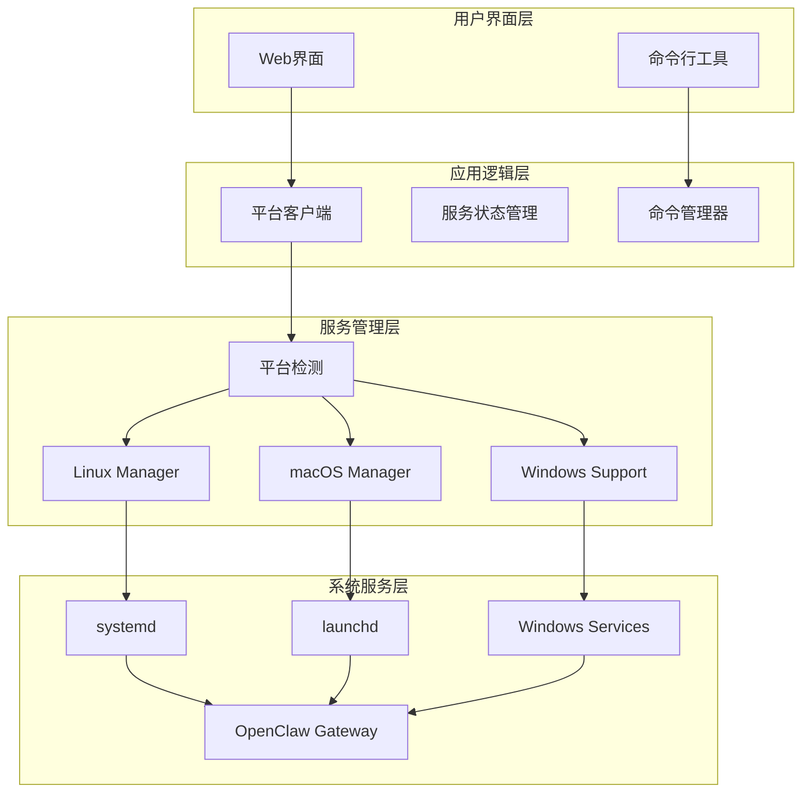
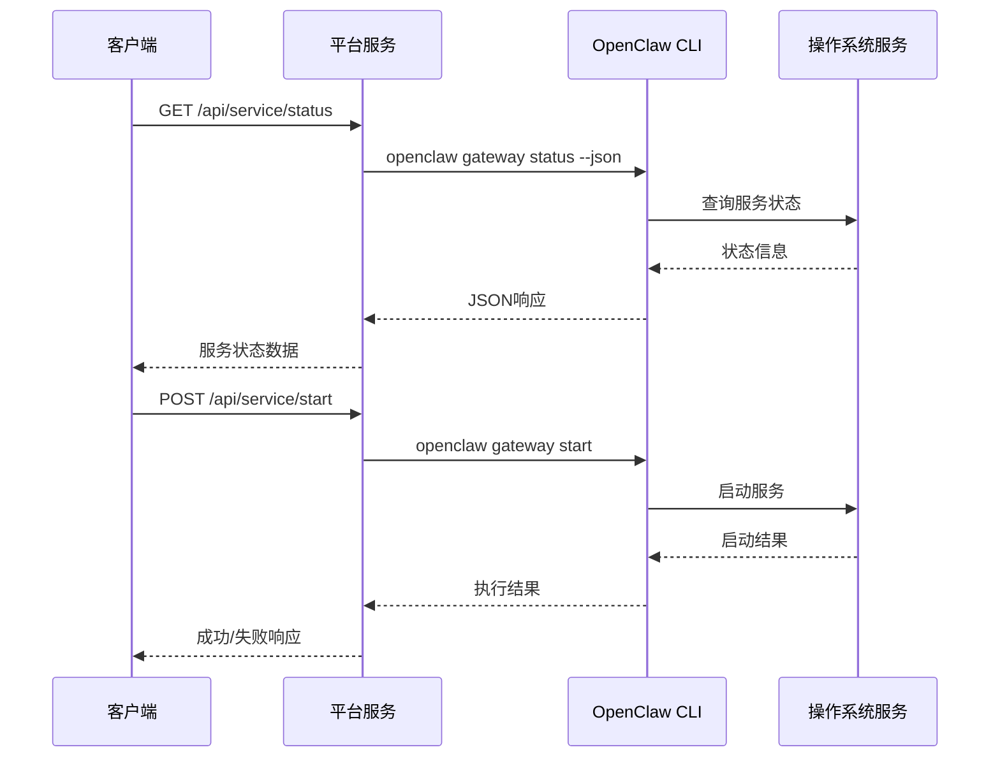
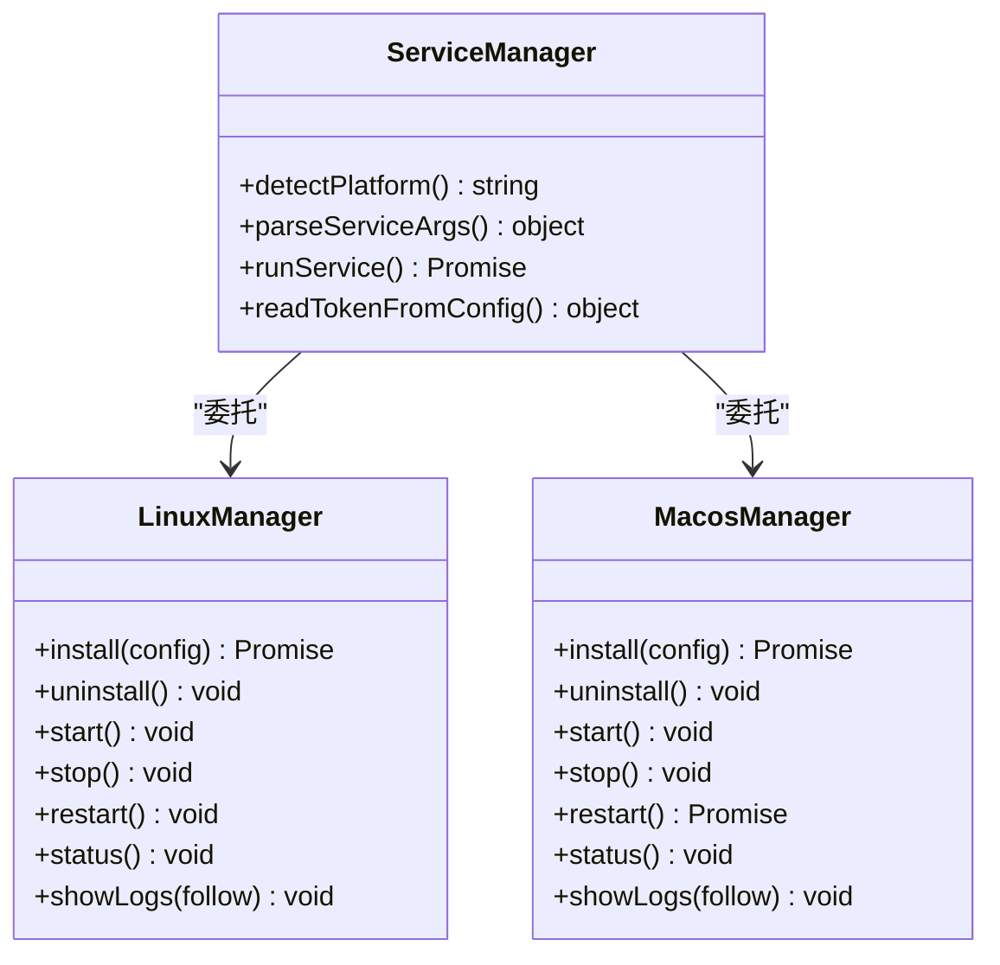
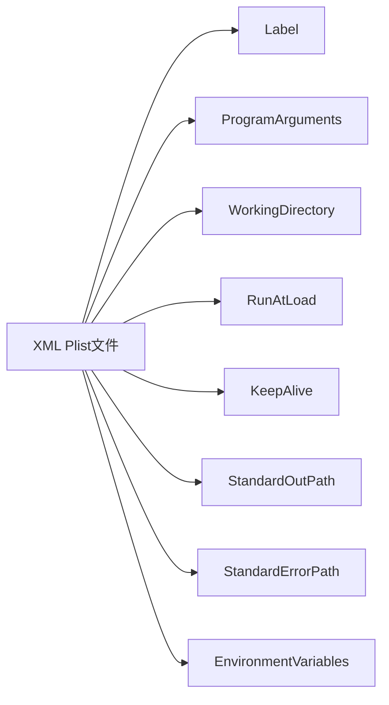
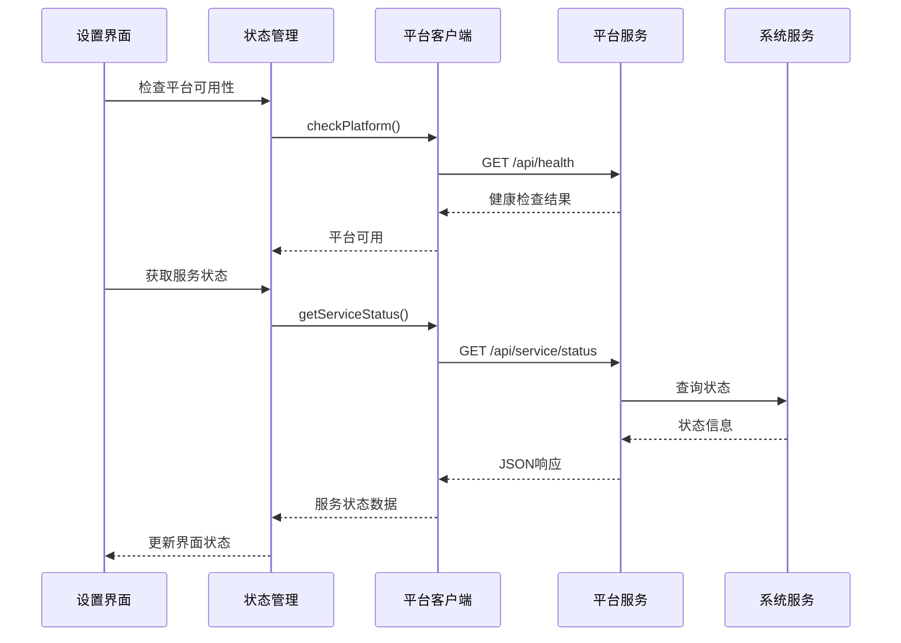
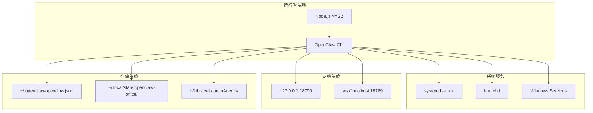
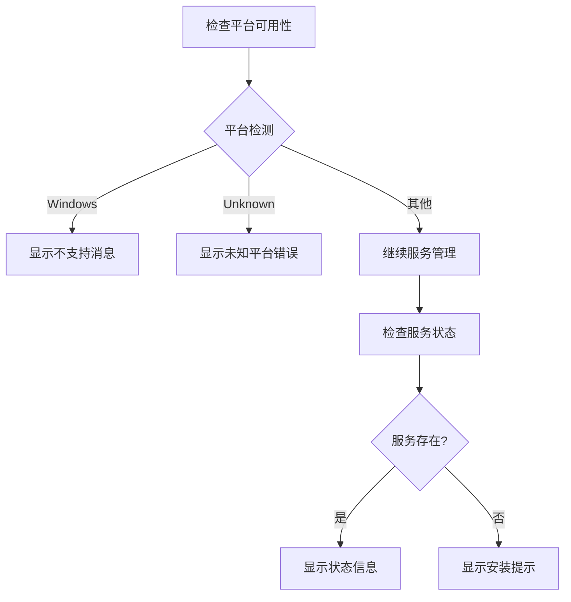

# 系统服务集成

<cite>
**本文档引用的文件**
- [platform.js](file://bin/platform.js)
- [service.js](file://bin/service.js)
- [service-linux.js](file://bin/service-linux.js)
- [service-macos.js](file://bin/service-macos.js)
- [openclaw-office.js](file://bin/openclaw-office.js)
- [platform-client.ts](file://src/gateway/platform-client.ts)
- [ServiceSection.tsx](file://src/components/console/settings/ServiceSection.tsx)
- [service-store.ts](file://src/store/console-stores/service-store.ts)
- [package.json](file://package.json)
- [start-openclaw-office.ps1](file://scripts/start-openclaw-office.ps1)
- [wsl-bootstrap-openclaw-office.sh](file://scripts/wsl-bootstrap-openclaw-office.sh)
- [start-openclaw-office.cmd](file://start-openclaw-office.cmd)
</cite>

## 目录
1. [简介](#简介)
2. [项目结构](#项目结构)
3. [核心组件](#核心组件)
4. [架构概览](#架构概览)
5. [详细组件分析](#详细组件分析)
6. [依赖关系分析](#依赖关系分析)
7. [性能考虑](#性能考虑)
8. [故障排除指南](#故障排除指南)
9. [结论](#结论)

## 简介

OpenClaw Office 系统服务集成为跨平台服务管理解决方案，支持 Windows 服务、macOS launchd 服务和 Linux systemd 服务的统一安装和配置。该系统通过轻量级的本地 HTTP 服务器（platform.js）提供统一的服务控制接口，实现了自动启动、重启策略、日志管理和进程监控等功能。

系统的核心设计目标是为 OpenClaw 多智能体系统提供可靠的本地监控前端服务，确保服务能够在不同操作系统上稳定运行并具备良好的用户体验。

## 项目结构

系统服务集成主要分布在以下关键文件中：



**图表来源**
- [openclaw-office.js:14-20](file://bin/openclaw-office.js#L14-L20)
- [service.js:38-46](file://bin/service.js#L38-L46)
- [platform.js:110-118](file://bin/platform.js#L110-L118)

**章节来源**
- [openclaw-office.js:1-763](file://bin/openclaw-office.js#L1-L763)
- [service.js:1-213](file://bin/service.js#L1-L213)
- [platform.js:1-161](file://bin/platform.js#L1-L161)

## 核心组件

### 平台检测机制

系统通过 `detectPlatform()` 函数实现精确的平台识别：



**图表来源**
- [service.js:40-46](file://bin/service.js#L40-L46)
- [service.js:120-126](file://bin/service.js#L120-L126)

### 服务控制接口

平台服务提供统一的 HTTP API 接口：

| 端点 | 方法 | 功能 | 返回值 |
|------|------|------|--------|
| `/api/health` | GET | 健康检查 | `{ok: true, service: "platform", pid: number}` |
| `/api/service/status` | GET | 获取服务状态 | `{installed: boolean, running: boolean, pid: number}` |
| `/api/service/start` | POST | 启动服务 | `{ok: boolean, action: "start"}` |
| `/api/service/stop` | POST | 停止服务 | `{ok: boolean, action: "stop"}` |
| `/api/service/restart` | POST | 重启服务 | `{ok: boolean, action: "restart"}` |
| `/api/service/install` | POST | 安装服务 | `{ok: boolean, action: "install"}` |
| `/api/service/uninstall` | POST | 卸载服务 | `{ok: boolean, action: "uninstall"}` |
| `/api/config/setup` | POST | 配置设置 | `{ok: boolean, results: array}` |

**章节来源**
- [platform.js:110-118](file://bin/platform.js#L110-L118)
- [platform.js:138-155](file://bin/platform.js#L138-L155)

## 架构概览

系统采用分层架构设计，实现了跨平台服务管理的统一抽象：



**图表来源**
- [platform-client.ts:1-63](file://src/gateway/platform-client.ts#L1-L63)
- [service.js:38-46](file://bin/service.js#L38-L46)
- [service-linux.js:1-324](file://bin/service-linux.js#L1-L324)
- [service-macos.js:1-299](file://bin/service-macos.js#L1-L299)

## 详细组件分析

### 平台服务控制器 (platform.js)

平台服务是一个轻量级的本地 HTTP 服务器，专门用于管理 OpenClaw Gateway 生命周期：



**图表来源**
- [platform.js:63-84](file://bin/platform.js#L63-L84)
- [platform.js:86-95](file://bin/platform.js#L86-L95)

#### 关键特性

1. **安全绑定**: 仅绑定到 127.0.0.1:18790，确保本地访问安全
2. **零外部依赖**: 使用纯 Node.js 内置模块
3. **CORS 支持**: 提供跨域资源共享支持
4. **超时控制**: 命令执行超时时间为 30 秒
5. **错误处理**: 完善的异常捕获和错误报告机制

**章节来源**
- [platform.js:1-161](file://bin/platform.js#L1-L161)

### 跨平台服务管理器 (service.js)

服务管理器实现了统一的跨平台服务控制接口：



**图表来源**
- [service.js:99-161](file://bin/service.js#L99-L161)
- [service-linux.js:109-157](file://bin/service-linux.js#L109-L157)
- [service-macos.js:118-165](file://bin/service-macos.js#L118-L165)

#### 参数解析机制

服务管理器支持多种参数传递方式：

| 参数 | 短选项 | 描述 | 默认值 |
|------|--------|------|--------|
| `--token` | `-t` | Gateway 认证令牌 | 从配置文件自动检测 |
| `--gateway` | `-g` | Gateway WebSocket URL | ws://localhost:18789 |
| `--port` | `-p` | 服务器端口 | 5180 |
| `--host` | 无 | 绑定地址 | 0.0.0.0 |
| `--follow` | `-f` | 跟随日志输出 | false |
| `--help` | `-h` | 显示帮助信息 | false |

**章节来源**
- [service.js:68-95](file://bin/service.js#L68-L95)
- [service.js:163-199](file://bin/service.js#L163-L199)

### Linux systemd 服务管理

Linux 实现基于 systemd --user，提供了完整的服务生命周期管理：

#### 服务配置文件生成


**图表来源**
- [service-linux.js:65-91](file://bin/service-linux.js#L65-L91)

#### 关键配置项

| 配置项 | 值 | 说明 |
|--------|-----|------|
| `Type` | `simple` | 简单服务类型 |
| `Restart` | `on-failure` | 失败时自动重启 |
| `RestartSec` | `5` | 重启延迟时间（秒） |
| `WorkingDirectory` | `$PWD` | 工作目录 |
| `Environment` | `HOME`, `PATH` | 环境变量 |
| `StandardOutput` | `append:stdout.log` | 标准输出日志 |
| `StandardError` | `append:error.log` | 错误输出日志 |

**章节来源**
- [service-linux.js:77-86](file://bin/service-linux.js#L77-L86)
- [service-linux.js:109-157](file://bin/service-linux.js#L109-L157)

### macOS launchd 服务管理

macOS 实现基于 launchd 用户级服务管理：

#### Plist 文件结构



**图表来源**
- [service-macos.js:73-111](file://bin/service-macos.js#L73-L111)

#### 自动重启策略

macOS 服务使用 `KeepAlive` 和 `RunAtLoad` 实现自动启动和重启：

| 策略 | 配置 | 行为 |
|------|------|------|
| 自动启动 | `RunAtLoad = true` | 登录时自动启动 |
| 持续运行 | `KeepAlive = true` | 进程退出时自动重启 |
| 服务监控 | `launchctl list` | 检查服务状态 |

**章节来源**
- [service-macos.js:94-97](file://bin/service-macos.js#L94-L97)
- [service-macos.js:118-165](file://bin/service-macos.js#L118-L165)

### 前端集成组件

系统提供了完整的前端服务管理界面：



**图表来源**
- [ServiceSection.tsx:30-35](file://src/components/console/settings/ServiceSection.tsx#L30-L35)
- [service-store.ts:95-165](file://src/store/console-stores/service-store.ts#L95-L165)
- [platform-client.ts:48-63](file://src/gateway/platform-client.ts#L48-L63)

**章节来源**
- [ServiceSection.tsx:1-36](file://src/components/console/settings/ServiceSection.tsx#L1-L36)
- [service-store.ts:95-165](file://src/store/console-stores/service-store.ts#L95-L165)
- [platform-client.ts:1-63](file://src/gateway/platform-client.ts#L1-L63)

## 依赖关系分析

系统服务集成涉及多个层面的依赖关系：



**图表来源**
- [package.json:79-82](file://package.json#L79-L82)
- [openclaw-office.js:102-120](file://bin/openclaw-office.js#L102-L120)
- [service-linux.js:18-25](file://bin/service-linux.js#L18-L25)
- [service-macos.js:20-28](file://bin/service-macos.js#L20-L28)

**章节来源**
- [package.json:1-83](file://package.json#L1-L83)
- [openclaw-office.js:100-149](file://bin/openclaw-office.js#L100-L149)

## 性能考虑

### 启动性能优化

1. **异步操作**: 所有服务管理操作都使用异步模式，避免阻塞主线程
2. **缓存机制**: 服务状态在内存中缓存，减少重复查询
3. **超时控制**: 命令执行设置合理超时时间，防止长时间阻塞

### 内存管理

- **流式日志**: 大文件日志采用流式读取，避免内存溢出
- **状态清理**: 服务停止时自动清理相关资源
- **错误恢复**: 异常情况下的资源自动释放

### 网络性能

- **本地通信**: 使用 127.0.0.1 回环接口，避免网络开销
- **连接复用**: HTTP 客户端连接池优化
- **超时设置**: 合理的请求超时和响应超时

## 故障排除指南

### 常见问题诊断

#### 服务安装失败

**症状**: `Token is required for service installation.`

**解决方法**:
1. 检查配置文件是否存在
   ```bash
   cat ~/.openclaw/openclaw.json
   ```
2. 手动提供令牌参数
   ```bash
   openclaw-office service install --token YOUR_TOKEN
   ```
3. 设置环境变量
   ```bash
   export OPENCLAW_GATEWAY_TOKEN=YOUR_TOKEN
   ```

#### 服务启动失败

**症状**: `Failed to start service. Check logs:`

**诊断步骤**:
1. 查看系统服务日志
   ```bash
   # Linux
   journalctl --user -u openclaw-office.service
   
   # macOS
   cat ~/Library/Logs/openclaw-office/openclaw-office.log
   ```
2. 检查端口占用
   ```bash
   lsof -i :5180
   ```
3. 验证 OpenClaw CLI 可用性
   ```bash
   openclaw --version
   ```

#### 权限问题

**症状**: `Permission denied` 或 `Operation not permitted`

**解决方法**:
1. Linux: 确保用户有 systemd 权限
   ```bash
   sudo loginctl enable-linger $USER
   ```
2. macOS: 检查文件权限
   ```bash
   ls -la ~/Library/LaunchAgents/com.user.openclaw-office.plist
   ```

#### 日志查看

**Linux 系统日志**:
```bash
# 实时查看日志
journalctl --user -u openclaw-office.service -f

# 查看最近日志
journalctl --user -u openclaw-office.service --no-pager -n 50

# 查看服务状态
systemctl --user status openclaw-office.service
```

**macOS 应用日志**:
```bash
# 查看标准输出日志
tail -f ~/Library/Logs/openclaw-office/openclaw-office.log

# 查看错误日志
tail -f ~/Library/Logs/openclaw-office/openclaw-office-error.log

# 查看 launchctl 状态
launchctl print gui/${USER} | grep openclaw-office
```

#### WSL 环境问题

**症状**: WSL 环境中服务无法启动

**诊断步骤**:
1. 检查 systemd 支持
   ```bash
   ps -p 1 -o comm=
   ```
2. 启用 systemd（如果未启用）
   ```bash
   echo "systemd=true" | sudo tee /etc/wsl.conf
   wsl --shutdown
   ```
3. 重新启动 WSL 实例

**章节来源**
- [service-linux.js:200-203](file://bin/service-linux.js#L200-L203)
- [service-macos.js:204-207](file://bin/service-macos.js#L204-L207)
- [start-openclaw-office.ps1:216-218](file://scripts/start-openclaw-office.ps1#L216-L218)

### 系统服务集成测试

#### 平台可用性检查



**图表来源**
- [service.js:107-118](file://bin/service.js#L107-L118)
- [ServiceSection.tsx:30-35](file://src/components/console/settings/ServiceSection.tsx#L30-L35)

#### 服务状态验证

前端界面提供了完整的状态验证机制：

1. **自动检测**: 页面加载时自动检查平台可用性
2. **实时更新**: 服务状态变化时自动刷新
3. **错误处理**: 服务不可用时提供清晰的错误信息
4. **操作反馈**: 所有服务操作都有明确的成功/失败反馈

**章节来源**
- [service-store.ts:95-165](file://src/store/console-stores/service-store.ts#L95-L165)
- [platform-client.ts:48-63](file://src/gateway/platform-client.ts#L48-L63)

## 结论

OpenClaw Office 系统服务集成为跨平台服务管理提供了完整、可靠且用户友好的解决方案。通过统一的 API 接口和平台特定的实现，系统成功解决了多平台服务管理的复杂性问题。

### 主要优势

1. **跨平台一致性**: 统一的 API 接口确保在不同平台上提供一致的用户体验
2. **自动化程度高**: 支持自动启动、自动重启和自动故障恢复
3. **监控完善**: 提供详细的日志管理和状态监控功能
4. **易于使用**: 简洁的命令行接口和直观的 Web 界面
5. **安全性**: 本地服务绑定和严格的权限控制

### 技术亮点

- **零外部依赖**: 使用纯 Node.js 内置模块实现
- **异步架构**: 完全基于异步操作，确保响应性
- **错误处理**: 全面的异常捕获和错误恢复机制
- **配置灵活**: 支持多种配置方式和参数传递

### 未来改进方向

1. **Windows 支持**: 当前版本暂不支持 Windows 服务管理，可考虑后续添加
2. **容器化支持**: 可以考虑添加 Docker 容器化部署选项
3. **集群管理**: 支持多节点服务集群管理
4. **告警通知**: 添加服务异常告警和通知功能

该系统为 OpenClaw 多智能体系统的本地部署提供了坚实的基础，确保了服务的稳定性和可靠性。