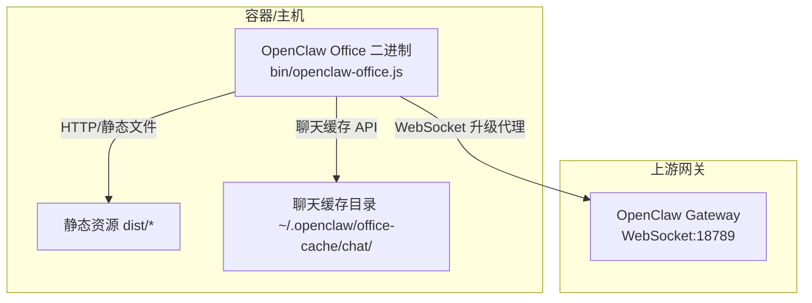
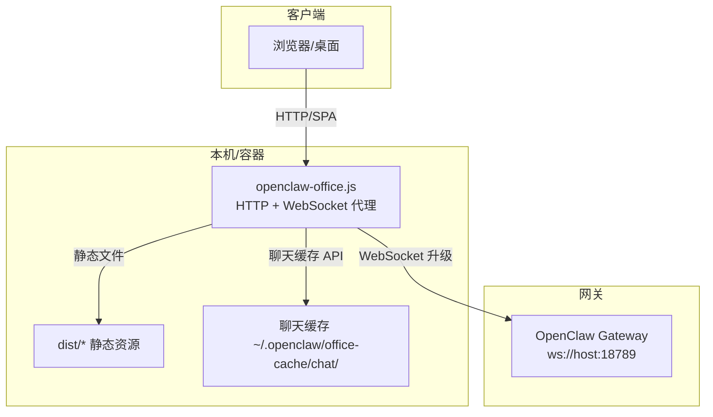
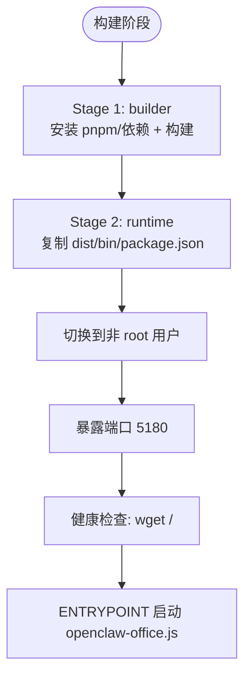
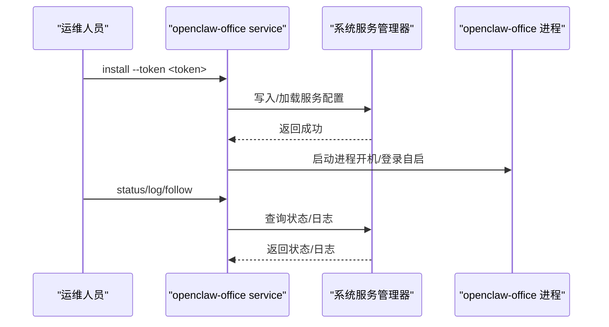
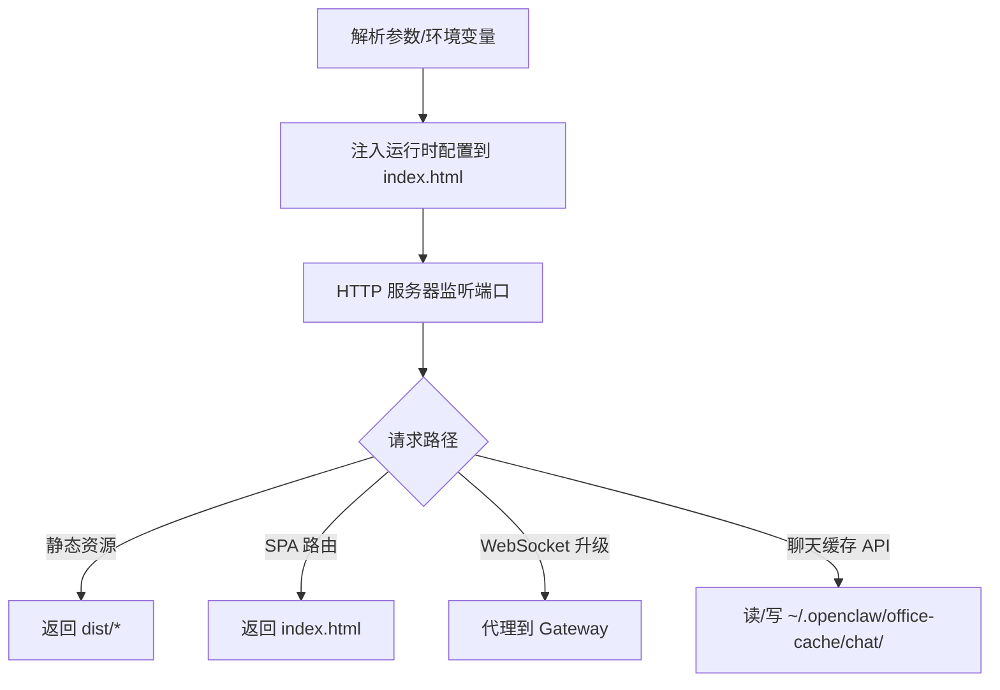
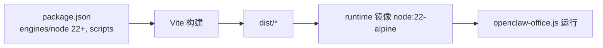

# 部署和运维

<cite>
**本文引用的文件**
- [Dockerfile](file://Dockerfile)
- [docker-compose.yml](file://docker-compose.yml)
- [DEPLOY.md](file://DEPLOY.md)
- [scripts/wsl-bootstrap-openclaw-office.sh](file://scripts/wsl-bootstrap-openclaw-office.sh)
- [scripts/start-openclaw-office.ps1](file://scripts/start-openclaw-office.ps1)
- [bin/service.js](file://bin/service.js)
- [bin/service-macos.js](file://bin/service-macos.js)
- [bin/service-linux.js](file://bin/service-linux.js)
- [bin/openclaw-office.js](file://bin/openclaw-office.js)
- [package.json](file://package.json)
- [README.md](file://README.md)
- [GATEWAY-SETUP.md](file://GATEWAY-SETUP.md)
- [start-openclaw-office.cmd](file://start-openclaw-office.cmd)
</cite>

## 目录
1. [简介](#简介)
2. [项目结构](#项目结构)
3. [核心组件](#核心组件)
4. [架构总览](#架构总览)
5. [详细组件分析](#详细组件分析)
6. [依赖关系分析](#依赖关系分析)
7. [性能考虑](#性能考虑)
8. [监控与日志](#监控与日志)
9. [安全配置与合规](#安全配置与合规)
10. [备份与灾难恢复](#备份与灾难恢复)
11. [部署示例](#部署示例)
12. [故障排除指南](#故障排除指南)
13. [结论](#结论)

## 简介
本文件面向运维与平台工程团队，提供 OpenClaw Office 的完整部署与运维指南。内容覆盖：
- Docker 容器化部署：镜像构建、容器编排、环境变量与健康检查
- 系统服务集成：macOS launchd、Linux systemd 的安装与管理
- Windows WSL2 支持：一键启动脚本、WSL 配置、端口映射与文件共享
- 性能优化：静态资源优化、缓存策略、CDN 集成建议
- 监控与日志：日志采集、健康检查、错误追踪
- 安全配置、备份策略与灾难恢复最佳实践
- 具体部署示例与故障排除清单

## 项目结构
OpenClaw Office 采用“静态站点 + 内置 HTTP/WebSocket 代理服务器”的轻量架构：
- 前端产物位于 dist 目录，由 Vite 构建
- 服务端二进制 openclaw-office.js 提供静态文件服务、SPA 回退、WebSocket 升级代理、聊天缓存 API 与工作区技能 API
- 通过环境变量或命令行参数解析 Gateway 连接信息与端口绑定
- 提供跨平台系统服务管理脚本，支持 macOS launchd 与 Linux systemd --user



图表来源
- [bin/openclaw-office.js:151-722](file://bin/openclaw-office.js#L151-L722)

章节来源
- [README.md:79-125](file://README.md#L79-L125)
- [bin/openclaw-office.js:1-120](file://bin/openclaw-office.js#L1-L120)

## 核心组件
- 容器镜像与编排
  - Dockerfile 使用两阶段构建：builder（安装 pnpm、构建）与 runtime（仅运行时依赖）
  - docker-compose.yml 定义服务、端口映射、环境变量、健康检查与 host.docker.internal 互通
- 系统服务管理
  - bin/service.js 路由到 macOS 或 Linux 平台管理器
  - macOS：bin/service-macos.js 生成并加载 LaunchAgent plist
  - Linux：bin/service-linux.js 生成并启用 systemd --user 服务与日志目录
- WSL2 一键启动
  - scripts/wsl-bootstrap-openclaw-office.sh：WSL 环境准备、OpenClaw 安装与 Gateway 启动、Office 构建与启动
  - scripts/start-openclaw-office.ps1：Windows 端 PowerShell 启动器，调用 WSL 脚本并启动 Windows 侧 Office
- 应用入口与配置
  - bin/openclaw-office.js：解析参数/环境变量、注入运行时配置、提供静态服务与 WebSocket 代理
  - package.json：脚本与引擎约束（Node 22+）

章节来源
- [Dockerfile:1-56](file://Dockerfile#L1-L56)
- [docker-compose.yml:1-31](file://docker-compose.yml#L1-L31)
- [bin/service.js:1-213](file://bin/service.js#L1-L213)
- [bin/service-macos.js:1-299](file://bin/service-macos.js#L1-L299)
- [bin/service-linux.js:1-324](file://bin/service-linux.js#L1-L324)
- [scripts/wsl-bootstrap-openclaw-office.sh:1-321](file://scripts/wsl-bootstrap-openclaw-office.sh#L1-L321)
- [scripts/start-openclaw-office.ps1:1-281](file://scripts/start-openclaw-office.ps1#L1-L281)
- [bin/openclaw-office.js:1-150](file://bin/openclaw-office.js#L1-L150)
- [package.json:1-83](file://package.json#L1-L83)

## 架构总览
OpenClaw Office 的运行时拓扑如下：



图表来源
- [bin/openclaw-office.js:151-722](file://bin/openclaw-office.js#L151-L722)
- [README.md:128-157](file://README.md#L128-L157)

## 详细组件分析

### Docker 容器化部署
- 镜像构建
  - builder 阶段：启用 Corepack 与 pnpm，复制依赖清单与源码，安装依赖并构建
  - runtime 阶段：以 node:22-alpine 为基础，非 root 用户 openclaw 运行，仅拷贝 dist、bin 与 package.json
  - 默认暴露 5180，健康检查通过 wget 访问根路径
- 容器编排
  - docker-compose.yml 指定镜像、端口映射、环境变量（OPENCLAW_GATEWAY_URL、OPENCLAW_GATEWAY_TOKEN、PORT、HOST）
  - 健康检查与 host.docker.internal 互通，便于容器访问宿主机上的 Gateway
- 环境变量
  - OPENCLAW_GATEWAY_URL：WebSocket 地址（默认 ws://host.docker.internal:18789）
  - OPENCLAW_GATEWAY_TOKEN：认证令牌（建议通过 .env 管理）
  - PORT/HOST：容器内监听端口与绑定地址



图表来源
- [Dockerfile:1-56](file://Dockerfile#L1-L56)

章节来源
- [Dockerfile:1-56](file://Dockerfile#L1-L56)
- [docker-compose.yml:1-31](file://docker-compose.yml#L1-L31)
- [DEPLOY.md:113-126](file://DEPLOY.md#L113-L126)

### 系统服务集成（macOS launchd / Linux systemd）
- 跨平台入口
  - bin/openclaw-office.js 解析参数与环境变量；若 argv[2] 为 service，则委托 bin/service.js
- macOS（launchd）
  - 自动生成 LaunchAgent plist，写入用户目录 ~/Library/LaunchAgents
  - 标准输出/错误日志写入 ~/Library/Logs/openclaw-office/
  - 支持 install/uninstall/start/stop/restart/status/log
- Linux（systemd --user）
  - 生成 ~/.config/systemd/user/openclaw-office.service
  - 日志目录 ~/.local/state/openclaw-office/
  - 支持 install/uninstall/start/stop/restart/status/log，含 journalctl 支持



图表来源
- [bin/service.js:99-161](file://bin/service.js#L99-L161)
- [bin/service-macos.js:118-165](file://bin/service-macos.js#L118-L165)
- [bin/service-linux.js:109-157](file://bin/service-linux.js#L109-L157)

章节来源
- [bin/service.js:1-213](file://bin/service.js#L1-L213)
- [bin/service-macos.js:1-299](file://bin/service-macos.js#L1-L299)
- [bin/service-linux.js:1-324](file://bin/service-linux.js#L1-L324)
- [README.md:128-157](file://README.md#L128-L157)

### Windows WSL2 支持（一键启动）
- PowerShell 启动器
  - scripts/start-openclaw-office.ps1：选择/确认 WSL 发行版，调用 WSL 脚本，读取 Gateway Token，启动 Windows 侧 Office
- WSL 部署脚本
  - scripts/wsl-bootstrap-openclaw-office.sh：检测/安装 Node.js 与 pnpm、安装/初始化 OpenClaw、配置 Gateway、启动 Gateway、构建并启动 Office
  - 自动等待服务就绪并通过 curl 检测健康状态
- 端口映射与文件共享
  - Office 默认 5180；Gateway 默认 18789
  - 通过 Windows 启动器在本机 127.0.0.1:5180 访问
  - 日志与 PID 文件保存在仓库根目录 .runtime/

```mermaid
sequenceDiagram
participant Win as "Windows"
participant PS as "start-openclaw-office.ps1"
participant WSL as "WSL : wsl-bootstrap-openclaw-office.sh"
participant GW as "OpenClaw Gateway"
participant OFF as "Office Server"
Win->>PS : 双击/PowerShell 调用
PS->>WSL : 以 bash 执行部署脚本带参数
WSL->>WSL : 检测/安装 Node/pnpm/OpenClaw
WSL->>GW : 初始化配置并启动
WSL->>OFF : 构建并启动 Office
PS->>Win : 读取 Gateway Token
PS->>OFF : 以 Node 启动Windows 侧
Win->>Win : 打开 http : //127.0.0.1 : 5180
```

图表来源
- [scripts/start-openclaw-office.ps1:247-277](file://scripts/start-openclaw-office.ps1#L247-L277)
- [scripts/wsl-bootstrap-openclaw-office.sh:297-321](file://scripts/wsl-bootstrap-openclaw-office.sh#L297-L321)

章节来源
- [scripts/start-openclaw-office.ps1:1-281](file://scripts/start-openclaw-office.ps1#L1-L281)
- [scripts/wsl-bootstrap-openclaw-office.sh:1-321](file://scripts/wsl-bootstrap-openclaw-office.sh#L1-L321)
- [start-openclaw-office.cmd:1-11](file://start-openclaw-office.cmd#L1-L11)
- [README.md:160-193](file://README.md#L160-L193)

### 应用入口与配置解析
- 参数与环境变量优先级
  - --token/--gateway/--port/--host
  - OPENCLAW_GATEWAY_TOKEN / OPENCLAW_GATEWAY_URL / PORT / HOST
  - 自动从 ~/.openclaw/openclaw.json 或 ~/.clawdbot/clawdbot.json 读取 token
- 运行时注入
  - 将网关地址与令牌注入 index.html 的全局脚本，供前端使用
- WebSocket 代理
  - 将 /gateway-ws 与 /api/gateway/ws 前缀升级为 WebSocket，转发至 Gateway
- 静态服务与 SPA 回退
  - 优先返回 dist/*；不存在时回退到 index.html，实现前端路由
- 聊天缓存 API
  - 提供会话列表与按日分片的消息持久化接口，支持清理与查询



图表来源
- [bin/openclaw-office.js:124-180](file://bin/openclaw-office.js#L124-L180)
- [bin/openclaw-office.js:673-722](file://bin/openclaw-office.js#L673-L722)

章节来源
- [bin/openclaw-office.js:1-150](file://bin/openclaw-office.js#L1-L150)
- [bin/openclaw-office.js:151-763](file://bin/openclaw-office.js#L151-L763)
- [README.md:102-125](file://README.md#L102-L125)

## 依赖关系分析
- 运行时依赖
  - Node.js 22+（package.json engines）
  - pnpm（Corepack 启用）
- 构建依赖
  - Vite、React、TailwindCSS 等（package.json dependencies/devDependencies）
- 容器镜像
  - node:22-alpine（Dockerfile）
  - 仅复制 dist、bin、package.json，不包含生产依赖（Dockerfile）



图表来源
- [package.json:1-83](file://package.json#L1-L83)
- [Dockerfile:1-56](file://Dockerfile#L1-L56)

章节来源
- [package.json:1-83](file://package.json#L1-L83)
- [Dockerfile:1-56](file://Dockerfile#L1-L56)

## 性能考虑
- 静态资源优化
  - 使用 Vite 构建，启用压缩与哈希命名；生产环境建议配合 CDN 与缓存头
- 缓存策略
  - 聊天缓存按日分片存储，支持清理旧文件；建议结合网关侧会话持久化策略
- CDN 集成
  - 将 dist/* 部署至 CDN，缩短首屏与资源加载延迟
- 反向代理
  - Nginx/Traefik 反代可提升并发与 TLS 终结能力；WebSocket 需要升级头透传

章节来源
- [bin/openclaw-office.js:305-494](file://bin/openclaw-office.js#L305-L494)
- [DEPLOY.md:185-218](file://DEPLOY.md#L185-L218)

## 监控与日志
- 健康检查
  - 容器内置健康检查：wget 访问根路径
  - docker-compose 健康检查：wget http://localhost:5180/
- 日志
  - macOS：~/Library/Logs/openclaw-office/*.log
  - Linux：~/.local/state/openclaw-office/*.log；优先使用 journalctl --user
  - Windows/WSL：.runtime/ 下的日志与 PID 文件
- 错误追踪
  - 通过服务日志定位启动失败、端口占用、Token 无效等问题

章节来源
- [Dockerfile:52-53](file://Dockerfile#L52-L53)
- [docker-compose.yml:22-27](file://docker-compose.yml#L22-L27)
- [bin/service-macos.js:253-268](file://bin/service-macos.js#L253-L268)
- [bin/service-linux.js:260-293](file://bin/service-linux.js#L260-L293)
- [DEPLOY.md:221-231](file://DEPLOY.md#L221-L231)

## 安全配置与合规
- 网关认证
  - 使用 OPENCLAW_GATEWAY_TOKEN 或配置文件自动检测；避免硬编码在镜像或命令行
  - Gateway 2026.3.23+ 需要 allowInsecureAuth 配合（如使用 dangerouslyDisableDeviceAuth）
- 端口与网络
  - 容器仅暴露 5180；反向代理负责 TLS 与外部访问
  - host.docker.internal 互通用于容器访问宿主机 Gateway
- 文件与权限
  - 容器以非 root 用户运行；服务日志目录按平台约定放置
- 环境变量管理
  - 使用 .env 管理敏感信息；CI/CD 中通过密钥管理注入

章节来源
- [docker-compose.yml:12-18](file://docker-compose.yml#L12-L18)
- [GATEWAY-SETUP.md:53-74](file://GATEWAY-SETUP.md#L53-L74)
- [Dockerfile:28-43](file://Dockerfile#L28-L43)

## 备份与灾难恢复
- 聊天缓存
  - 位于 ~/.openclaw/office-cache/chat/，按日分片；建议定期备份该目录
- 配置文件
  - ~/.openclaw/openclaw.json（含 Gateway Token）与 ~/.clawdbot/clawdbot.json
- 恢复流程
  - 备份上述目录；容器重建后恢复；确保 OPENCLAW_GATEWAY_TOKEN 一致
  - 若更换 Gateway，需重新获取 Token 并更新配置

章节来源
- [bin/openclaw-office.js:305-381](file://bin/openclaw-office.js#L305-L381)
- [GATEWAY-SETUP.md:18-52](file://GATEWAY-SETUP.md#L18-L52)

## 部署示例

### Docker Compose 快速启动
- 准备 .env（包含 OPENCLAW_GATEWAY_URL 与 OPENCLAW_GATEWAY_TOKEN）
- 拉取并启动
  - docker compose pull
  - docker compose up -d
- 验证
  - docker compose ps / logs
  - 浏览器访问 http://localhost:5180

章节来源
- [DEPLOY.md:38-77](file://DEPLOY.md#L38-L77)

### 纯 Docker 命令部署
- 拉取镜像并运行（宿主机 Gateway）
  - docker run -d --name openclaw-office --restart unless-stopped -p 5180:5180 -e OPENCLAW_GATEWAY_URL=ws://host.docker.internal:18789 -e OPENCLAW_GATEWAY_TOKEN=YOUR_TOKEN ccr.ccs.tencentyun.com/openclaw/openclaw-office:latest
- 指定版本（推荐生产）
  - 在镜像标签中指定版本号

章节来源
- [DEPLOY.md:80-110](file://DEPLOY.md#L80-L110)

### 系统服务安装（macOS / Linux）
- macOS
  - openclaw-office service install --token <token>
  - openclaw-office service status / log --follow
- Linux
  - openclaw-office service install --token <token>
  - systemctl --user start|stop|restart|status openclaw-office.service

章节来源
- [README.md:128-157](file://README.md#L128-L157)
- [bin/service.js:163-199](file://bin/service.js#L163-L199)
- [bin/service-macos.js:118-165](file://bin/service-macos.js#L118-L165)
- [bin/service-linux.js:109-157](file://bin/service-linux.js#L109-L157)

### Windows WSL2 一键启动
- 双击 start-openclaw-office.cmd 或 PowerShell 调用
  - 自动检测/安装 Node.js 与 OpenClaw，启动 Gateway 与 Office
  - 自动打开 http://127.0.0.1:5180

章节来源
- [README.md:160-193](file://README.md#L160-L193)
- [scripts/start-openclaw-office.ps1:247-277](file://scripts/start-openclaw-office.ps1#L247-L277)
- [scripts/wsl-bootstrap-openclaw-office.sh:297-321](file://scripts/wsl-bootstrap-openclaw-office.sh#L297-L321)
- [start-openclaw-office.cmd:1-11](file://start-openclaw-office.cmd#L1-L11)

## 故障排除指南
- 容器启动后无法连接 Gateway
  - 检查 OPENCLAW_GATEWAY_URL 是否可达；宿主机 Gateway 使用 host.docker.internal 并确保 extra_hosts
- 控制台报 hello-ok 超时
  - 检查 OPENCLAW_GATEWAY_TOKEN；必要时开启 gateway.controlUi.dangerouslyDisableDeviceAuth 与 allowInsecureAuth
- 端口冲突
  - 修改 .env 中的 PORT 并同步 docker-compose.yml 的 ports 映射
- 查看实时日志
  - docker compose logs -f openclaw-office 或 docker logs -f openclaw-office
- 服务无法启动（macOS/WSL/Linux）
  - 查看服务日志：openclaw-office service log --follow 或 journalctl --user -u openclaw-office.service

章节来源
- [DEPLOY.md:269-287](file://DEPLOY.md#L269-L287)
- [GATEWAY-SETUP.md:105-123](file://GATEWAY-SETUP.md#L105-L123)
- [bin/service-macos.js:253-268](file://bin/service-macos.js#L253-L268)
- [bin/service-linux.js:260-293](file://bin/service-linux.js#L260-L293)

## 结论
本指南提供了从容器到系统服务、从 Windows WSL2 一键启动到监控与安全运维的完整路径。建议在生产环境中：
- 使用固定镜像版本与 .env 管理敏感变量
- 通过反向代理统一接入与 TLS 终结
- 启用健康检查与日志归集
- 定期备份聊天缓存与网关配置
- 严格遵循 Gateway 的认证与权限配置