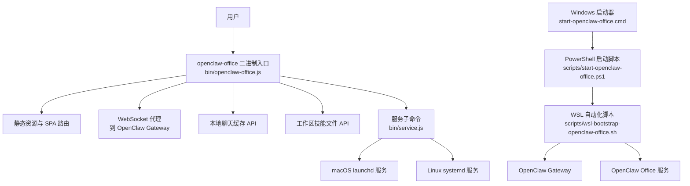
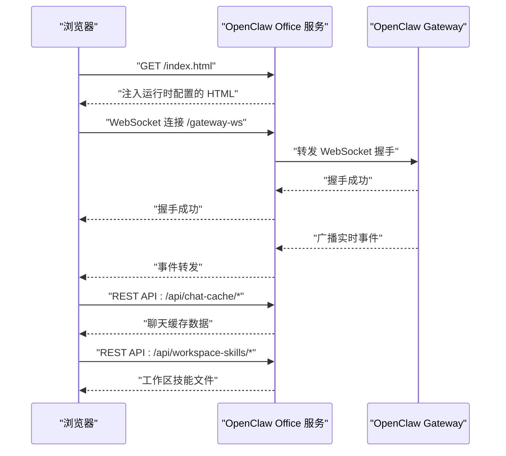

# 快速开始指南

<cite>
**本文档引用的文件**
- [README.md](file://README.md)
- [package.json](file://package.json)
- [bin/openclaw-office.js](file://bin/openclaw-office.js)
- [bin/service.js](file://bin/service.js)
- [bin/platform.js](file://bin/platform.js)
- [scripts/wsl-bootstrap-openclaw-office.sh](file://scripts/wsl-bootstrap-openclaw-office.sh)
- [scripts/start-openclaw-office.ps1](file://scripts/start-openclaw-office.ps1)
- [start-openclaw-office.cmd](file://start-openclaw-office.cmd)
- [DEPLOY.md](file://DEPLOY.md)
- [GATEWAY-SETUP.md](file://GATEWAY-SETUP.md)
- [docker-compose.yml](file://docker-compose.yml)
- [Dockerfile](file://Dockerfile)
</cite>

## 目录
1. [简介](#简介)
2. [项目结构](#项目结构)
3. [核心组件](#核心组件)
4. [架构总览](#架构总览)
5. [详细启动方式](#详细启动方式)
6. [依赖与前置条件](#依赖与前置条件)
7. [环境变量配置](#环境变量配置)
8. [Gateway 连接设置](#gateway-连接设置)
9. [命令行参数说明](#命令行参数说明)
10. [服务安装与管理](#服务安装与管理)
11. [Windows WSL2 一键启动](#windows-wsl2-一键启动)
12. [常见问题排查](#常见问题排查)
13. [性能与稳定性建议](#性能与稳定性建议)
14. [结论](#结论)

## 简介
OpenClaw Office 是 OpenClaw 多智能体系统的可视化监控与管理前端。它通过等距投影的虚拟办公室场景，实时展示 Agent 的工作状态、协作链路、工具调用与资源消耗，并提供完整的控制台管理界面与 Chat 对话工作区。本指南面向新用户，提供多种启动方式与完整配置说明，确保您能在最短时间内成功运行项目。

## 项目结构
- 二进制入口与服务管理：bin/openclaw-office.js、bin/service.js、bin/platform.js
- Windows 一键启动脚本：scripts/start-openclaw-office.ps1、start-openclaw-office.cmd
- WSL2 自动化部署：scripts/wsl-bootstrap-openclaw-office.sh
- 部署与容器化：Dockerfile、docker-compose.yml、DEPLOY.md
- 连接与权限配置：GATEWAY-SETUP.md
- 快速开始与 CLI 参数：README.md、package.json

**图表来源**
- [bin/openclaw-office.js:151-763](file://bin/openclaw-office.js#L151-L763)
- [bin/service.js:1-213](file://bin/service.js#L1-L213)
- [scripts/start-openclaw-office.ps1:1-281](file://scripts/start-openclaw-office.ps1#L1-L281)
- [scripts/wsl-bootstrap-openclaw-office.sh:1-321](file://scripts/wsl-bootstrap-openclaw-office.sh#L1-L321)

**章节来源**
- [README.md:1-316](file://README.md#L1-L316)
- [package.json:1-83](file://package.json#L1-L83)

## 核心组件
- 本地静态服务器与 SPA：负责提供前端页面、静态资源与路由回退。
- WebSocket 代理：将浏览器 WebSocket 连接透明代理至 OpenClaw Gateway。
- 本地聊天缓存 API：基于文件的按日分片缓存，支持会话列表与消息读写。
- 工作区技能文件 API：读取用户工作区内的技能文件列表与内容。
- 服务管理子命令：跨平台安装/卸载/启动/停止/重启/状态查询与日志查看。
- 平台服务：本地 HTTP 服务，封装 openclaw CLI，提供 Gateway 状态与控制接口。
- Windows 一键启动：PowerShell 脚本自动检测 WSL 发行版、安装依赖、启动 Gateway 与 Office。

**章节来源**
- [bin/openclaw-office.js:151-763](file://bin/openclaw-office.js#L151-L763)
- [bin/service.js:1-213](file://bin/service.js#L1-L213)
- [bin/platform.js:1-161](file://bin/platform.js#L1-L161)
- [scripts/start-openclaw-office.ps1:1-281](file://scripts/start-openclaw-office.ps1#L1-L281)
- [scripts/wsl-bootstrap-openclaw-office.sh:1-321](file://scripts/wsl-bootstrap-openclaw-office.sh#L1-L321)

## 架构总览
OpenClaw Office 通过 WebSocket 连接 OpenClaw Gateway，数据流如下：
- Gateway 广播实时事件（agent、presence、health、heartbeat）并响应 RPC 请求
- 前端通过 ws-client.ts -> event-parser.ts -> Zustand Store -> React 组件渲染
- Office 服务作为静态服务器与 WebSocket 代理，注入运行时配置并提供本地 API

**图表来源**
- [bin/openclaw-office.js:151-763](file://bin/openclaw-office.js#L151-L763)

**章节来源**
- [README.md:274-291](file://README.md#L274-L291)

## 详细启动方式

### 方式一：直接运行预构建版本（npx）
无需克隆仓库，最快速的运行方式：
- 直接运行（一次性使用）
  - npx @ww-ai-lab/openclaw-office
- 或全局安装后运行
  - npm install -g @ww-ai-lab/openclaw-office
  - openclaw-office

Gateway Token 自动检测：若本地已安装 OpenClaw，Token 会从 ~/.openclaw/openclaw.json 自动读取，无需手动配置。也可通过命令行参数或环境变量指定。

**章节来源**
- [README.md:89-124](file://README.md#L89-L124)

### 方式二：全局安装运行
- 全局安装
  - npm install -g @ww-ai-lab/openclaw-office
- 启动
  - openclaw-office
- 指定参数
  - openclaw-office --token <你的-gateway-token>
  - openclaw-office --gateway <ws://gateway-host:18789>
  - openclaw-office --port 5180
  - openclaw-office --host 0.0.0.0

**章节来源**
- [README.md:89-124](file://README.md#L89-L124)
- [bin/openclaw-office.js:41-98](file://bin/openclaw-office.js#L41-L98)

### 方式三：从源码安装开发
- 安装依赖
  - pnpm install
- 配置 Gateway 连接
  - 创建 .env.local 文件，填入 VITE_GATEWAY_URL 与 VITE_GATEWAY_TOKEN
  - 获取 Token：openclaw config get gateway.auth.token
- 启动 Gateway（确保在配置地址上运行）
  - OpenClaw macOS 应用
  - openclaw gateway run CLI 命令
  - 其他部署方式
- 启动开发服务器
  - pnpm dev
  - 在浏览器中打开 http://localhost:5180

Mock 模式（无需 Gateway）
- VITE_MOCK=true pnpm dev
- 使用模拟的 Agent 数据进行 UI 开发

**章节来源**
- [README.md:196-254](file://README.md#L196-L254)

### 方式四：Windows WSL2 一键启动方案
系统要求：Windows 10 21H2 / Windows 11 + WSL2，以及一个 Linux 发行版（如 Ubuntu）。

双击 start-openclaw-office.cmd 即可完成以下全部操作：
- 自动检测 WSL 发行版（自动跳过 docker-desktop）
- 自动安装 Node.js 22+ 和 OpenClaw（如尚未安装）
- 初始化配置 OpenClaw Gateway（首次运行自动生成 token）
- 启动 Gateway 服务（在 WSL 中以 systemd 方式运行）
- 启动 Office Server（在 Windows 本机以 Node.js 运行）
- 自动打开浏览器 http://127.0.0.1:5180

PowerShell 直接调用（支持自定义参数）：
- 指定 OpenClaw 版本和端口
  - .\scripts\start-openclaw-office.ps1 -OpenClawVersion "2026.3.28" -OfficePort 5180 -GatewayPort 18789
- 指定使用特定 WSL 发行版
  - .\scripts\start-openclaw-office.ps1 -Distro "Ubuntu-22.04"

**章节来源**
- [README.md:160-193](file://README.md#L160-L193)
- [scripts/start-openclaw-office.ps1:1-281](file://scripts/start-openclaw-office.ps1#L1-L281)
- [scripts/wsl-bootstrap-openclaw-office.sh:1-321](file://scripts/wsl-bootstrap-openclaw-office.sh#L1-L321)
- [start-openclaw-office.cmd:1-11](file://start-openclaw-office.cmd#L1-L11)

## 依赖与前置条件
- Node.js 22+
- pnpm（包管理器）
- OpenClaw 已安装并配置

说明：OpenClaw Office 是一个配套前端，连接到正在运行的 OpenClaw Gateway。它不会启动或管理 Gateway。

**章节来源**
- [README.md:79-86](file://README.md#L79-L86)
- [package.json:79-82](file://package.json#L79-L82)

## 环境变量配置
- VITE_GATEWAY_URL：Gateway WebSocket 地址（默认 ws://localhost:18789）
- VITE_GATEWAY_WS_PATH：浏览器侧反向代理 WS 路径（默认 /gateway-ws）
- VITE_GATEWAY_TOKEN：Gateway 认证 token（连接真实 Gateway 时必须）
- VITE_MOCK：启用 Mock 模式（不需要 Gateway，默认 false）

**章节来源**
- [README.md:237-245](file://README.md#L237-L245)

## Gateway 连接设置
- 获取 Token
  - 方法 A：从 dashboard 命令提取（推荐）
    - openclaw dashboard --no-open
    - 输出示例：Dashboard URL: http://127.0.0.1:18789/#token=<your-token>
    - 复制 URL 中 #token= 后面的值即为 Gateway Token
  - 方法 B：从配置文件读取
    - openclaw config file
    - 通常为 ~/.openclaw/openclaw.json
    - 提取 token

- 设备认证与不安全认证模式（Gateway 2026.2.15+）
  - openclaw config set gateway.controlUi.dangerouslyDisableDeviceAuth true
  - 配合使用（Gateway 2026.3.23+）
    - openclaw config set gateway.controlUi.allowInsecureAuth true

- 配置允许的源（可选）
  - openclaw config set gateway.controlUi.allowedOrigins '["http://localhost:18789","http://127.0.0.1:18789","http://localhost:5180","http://127.0.0.1:5180"]'

**章节来源**
- [GATEWAY-SETUP.md:16-81](file://GATEWAY-SETUP.md#L16-L81)

## 命令行参数说明
| 参数 | 说明 | 默认值 |
| --- | --- | --- |
| -t, --token <token> | Gateway 认证 token | 自动检测 |
| -g, --gateway <url> | Gateway WebSocket 地址 | ws://localhost:18789 |
| -p, --port <port> | 服务端口 | 5180 |
| --host <host> | 绑定地址 | 0.0.0.0 |
| -h, --help | 显示帮助 | — |

Token 自动检测顺序：
1. --token 命令行参数
2. OPENCLAW_GATEWAY_TOKEN 环境变量
3. 自动从 ~/.openclaw/openclaw.json 读取

**章节来源**
- [README.md:114-124](file://README.md#L114-L124)
- [bin/openclaw-office.js:41-98](file://bin/openclaw-office.js#L41-L98)
- [bin/openclaw-office.js:100-149](file://bin/openclaw-office.js#L100-L149)

## 服务安装与管理
将 OpenClaw Office 注册为系统服务后，可在开机/登录时自动启动，无需手动运行命令。支持 macOS（launchd）和 Linux（systemd --user）。

- 安装服务（token 自动检测，也可手动指定）
  - openclaw-office service install
  - openclaw-office service install --token <your-token> --port 3000

- 服务管理命令
  - openclaw-office service status
  - openclaw-office service stop
  - openclaw-office service start
  - openclaw-office service restart
  - openclaw-office service log
  - openclaw-office service log --follow
  - openclaw-office service uninstall

说明：安装为服务后，也可通过 Settings 页面的「服务管理」面板查看 Gateway 状态和执行重启等操作。

**章节来源**
- [README.md:128-157](file://README.md#L128-L157)
- [bin/service.js:1-213](file://bin/service.js#L1-L213)

## Windows WSL2 一键启动
双击 start-openclaw-office.cmd 即可完成以下全部操作：
- 自动检测 WSL 发行版（自动跳过 docker-desktop）
- 自动安装 Node.js 22+ 和 OpenClaw（如尚未安装）
- 初始化配置 OpenClaw Gateway（首次运行自动生成 token）
- 启动 Gateway 服务（在 WSL 中以 systemd 方式运行）
- 启动 Office Server（在 Windows 本机以 Node.js 运行）
- 自动打开浏览器 http://127.0.0.1:5180

PowerShell 直接调用（支持自定义参数）：
- 指定 OpenClaw 版本和端口
  - .\scripts\start-openclaw-office.ps1 -OpenClawVersion "2026.3.28" -OfficePort 5180 -GatewayPort 18789
- 指定使用特定 WSL 发行版
  - .\scripts\start-openclaw-office.ps1 -Distro "Ubuntu-22.04"

参数说明
| 参数 | 说明 | 默认值 |
| --- | --- | --- |
| -Distro | WSL 发行版名称（空则自动检测） | ""（自动） |
| -OpenClawVersion | 要安装的 OpenClaw 版本 | 2026.3.28 |
| -OfficePort | Office Server 端口 | 5180 |
| -GatewayPort | Gateway 端口 | 18789 |

运行时日志和 PID 文件保存在仓库根目录的 .runtime/ 目录下，已加入 .gitignore。

**章节来源**
- [README.md:160-193](file://README.md#L160-L193)
- [scripts/start-openclaw-office.ps1:1-281](file://scripts/start-openclaw-office.ps1#L1-L281)
- [scripts/wsl-bootstrap-openclaw-office.sh:1-321](file://scripts/wsl-bootstrap-openclaw-office.sh#L1-L321)
- [start-openclaw-office.cmd:1-11](file://start-openclaw-office.cmd#L1-L11)

## 常见问题排查
- 无法连接 Gateway
  - 检查 OPENCLAW_GATEWAY_URL 是否可达（在宿主机上测试 curl http://GATEWAY_HOST:18789）
  - 如果 Gateway 在宿主机，URL 使用 ws://host.docker.internal:18789 并确保添加了 extra_hosts

- 控制台报 hello-ok 超时
  - 检查 OPENCLAW_GATEWAY_TOKEN 是否正确
  - 确认 Gateway 已启用 gateway.controlUi.dangerouslyDisableDeviceAuth true（详见 GATEWAY-SETUP.md）

- 端口冲突
  - 修改 .env 中的 PORT 并同步修改 docker-compose.yml 的 ports 映射

- 如何查看实时日志
  - docker compose logs -f openclaw-office
  - 或 docker logs -f openclaw-office

- 连接状态一直显示「连接中...」
  - 确认 Gateway 是否在运行：openclaw status
  - 确认 token 是否有效：openclaw dashboard --no-open（应输出带 token 的 URL）
  - 检查 WebSocket 端口（默认 18789）是否可达

**章节来源**
- [DEPLOY.md:269-288](file://DEPLOY.md#L269-L288)
- [GATEWAY-SETUP.md:105-123](file://GATEWAY-SETUP.md#L105-L123)

## 性能与稳定性建议
- 使用服务安装方式在后台运行，避免频繁手动启动
- 在生产环境中固定版本，便于回滚与一致性管理
- 通过反向代理（Nginx/Traefik）提供 HTTPS 与负载均衡
- 合理设置日志轮转与磁盘空间，避免缓存目录占用过多空间

[本节为通用建议，无需具体文件分析]

## 结论
通过本指南，您可以在 Windows、macOS、Linux 上选择最适合的方式启动 OpenClaw Office。推荐优先使用 npx 一键运行或 Windows WSL2 一键启动方案，快速获得可用的可视化界面；在开发阶段使用源码安装方式，结合 Mock 模式进行 UI 开发与调试。遇到连接问题时，优先检查 Gateway 的 Token 与认证配置，并参考常见问题排查章节。