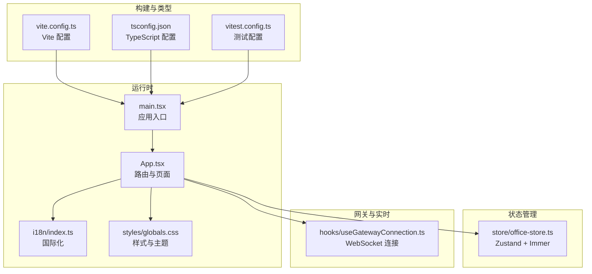
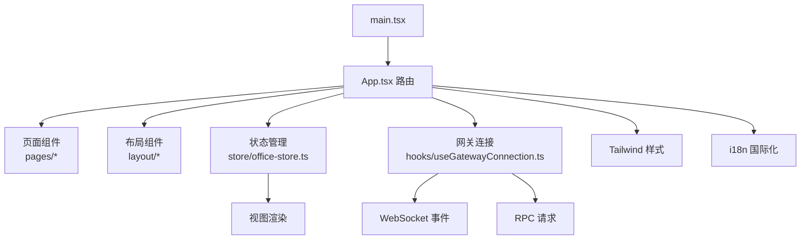
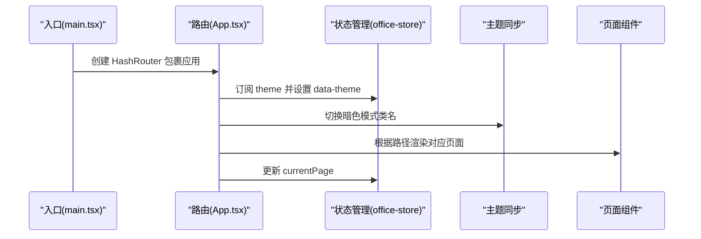
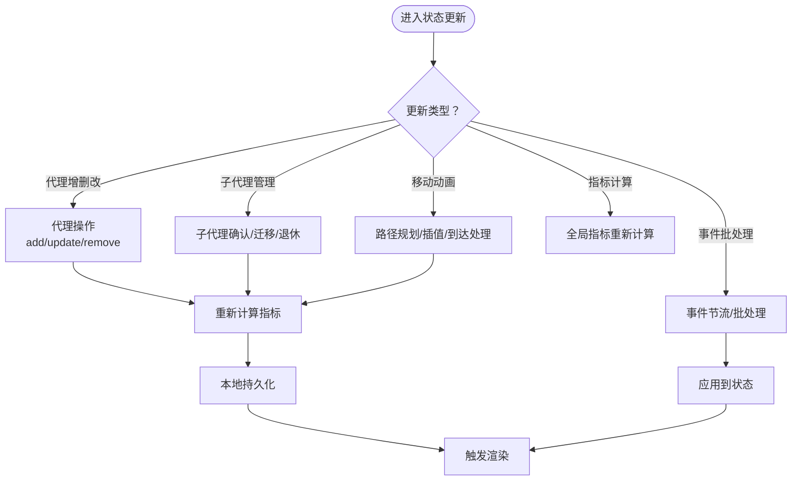
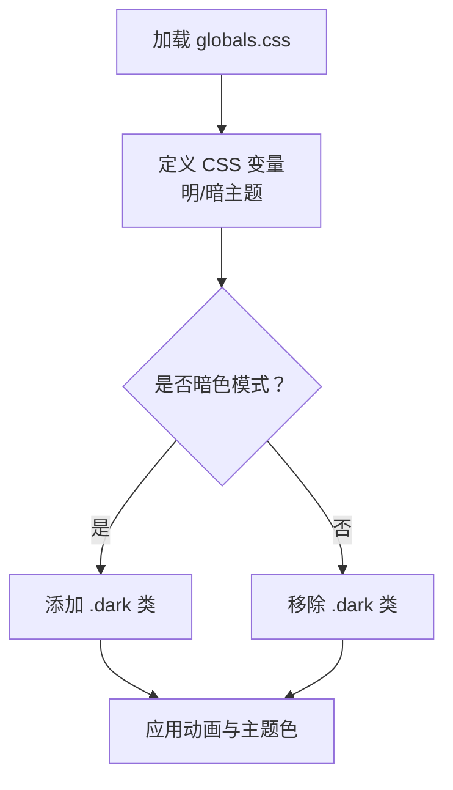
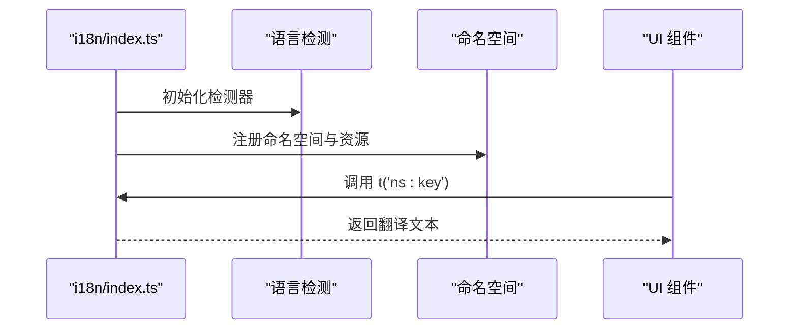
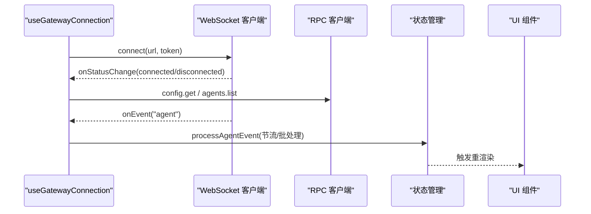
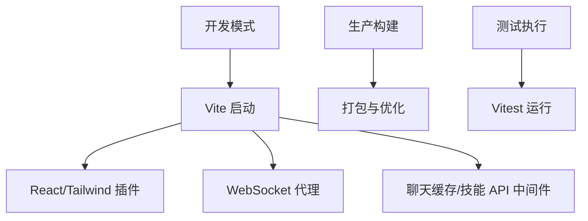
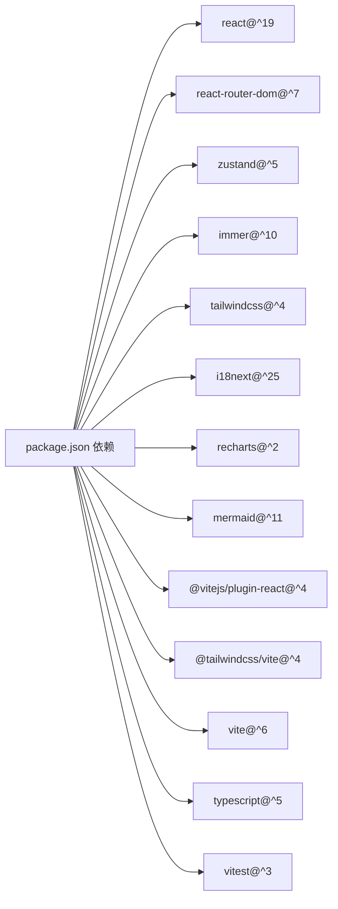

# 技术栈概览

<cite>
**本文档引用的文件**
- [package.json](file://package.json)
- [vite.config.ts](file://vite.config.ts)
- [tsconfig.json](file://tsconfig.json)
- [src/main.tsx](file://src/main.tsx)
- [src/App.tsx](file://src/App.tsx)
- [src/i18n/index.ts](file://src/i18n/index.ts)
- [src/store/office-store.ts](file://src/store/office-store.ts)
- [src/styles/globals.css](file://src/styles/globals.css)
- [src/hooks/useGatewayConnection.ts](file://src/hooks/useGatewayConnection.ts)
- [src/lib/constants.ts](file://src/lib/constants.ts)
- [vitest.config.ts](file://vitest.config.ts)
</cite>

## 目录
1. [引言](#引言)
2. [项目结构](#项目结构)
3. [核心组件](#核心组件)
4. [架构总览](#架构总览)
5. [详细组件分析](#详细组件分析)
6. [依赖关系分析](#依赖关系分析)
7. [性能考虑](#性能考虑)
8. [故障排除指南](#故障排除指南)
9. [结论](#结论)
10. [附录](#附录)

## 引言
本文件为 OpenClaw Office 的技术栈概览，面向技术决策者与开发者，系统阐述项目采用的现代前端技术栈及其选型理由、优势、在项目中的具体应用、权衡考量、性能表现与未来演进方向。技术栈包括：React 19 作为核心框架、Vite 6 构建工具、TypeScript 提供类型安全、Zustand 5 + Immer 实现轻量级状态管理、Tailwind CSS 4 负责样式系统、React Router 7 处理路由、Recharts 提供数据可视化、i18next 支持国际化、以及原生 WebSocket 实现实时通信。

## 项目结构
OpenClaw Office 前端采用模块化组织方式，围绕“页面-组件-布局-状态-网关”分层设计：
- 入口与路由：入口文件初始化 React 19、HashRouter、国际化与全局样式；App 组件定义路由与页面映射，并注入网关连接。
- 页面与布局：页面组件位于 components/pages，布局组件位于 components/layout，支撑多视图切换与响应式布局。
- 状态管理：使用 Zustand 5 结合 Immer 中间件集中管理全局状态，覆盖代理可视化、聊天会话、主题与页面状态等。
- 样式系统：Tailwind CSS 4 通过 Vite 插件启用，配合自定义 CSS 变量与暗色主题适配。
- 国际化：i18next 配置多语言资源与检测策略，按命名空间组织翻译。
- 实时通信：基于原生 WebSocket 与自定义网关客户端，结合事件节流与 RPC 客户端实现高吞吐事件处理。
- 构建与测试：Vite 6 提供开发服务器与生产构建，TypeScript 提供类型检查，Vitest 驱动前端测试。

**图表来源**
- [src/main.tsx:1-15](file://src/main.tsx#L1-L15)
- [src/App.tsx:1-124](file://src/App.tsx#L1-L124)
- [src/i18n/index.ts:1-59](file://src/i18n/index.ts#L1-L59)
- [src/styles/globals.css:1-152](file://src/styles/globals.css#L1-L152)
- [src/store/office-store.ts:1-800](file://src/store/office-store.ts#L1-L800)
- [src/hooks/useGatewayConnection.ts:1-238](file://src/hooks/useGatewayConnection.ts#L1-L238)
- [vite.config.ts:1-382](file://vite.config.ts#L1-L382)
- [tsconfig.json:1-29](file://tsconfig.json#L1-L29)
- [vitest.config.ts:1-20](file://vitest.config.ts#L1-L20)

**章节来源**
- [src/main.tsx:1-15](file://src/main.tsx#L1-L15)
- [src/App.tsx:1-124](file://src/App.tsx#L1-L124)
- [vite.config.ts:1-382](file://vite.config.ts#L1-L382)
- [tsconfig.json:1-29](file://tsconfig.json#L1-L29)
- [vitest.config.ts:1-20](file://vitest.config.ts#L1-L20)

## 核心组件
- React 19：作为应用核心框架，提供组件化与状态驱动的 UI 渲染能力，结合严格模式与 HashRouter 实现稳定运行与路由控制。
- Vite 6：提供快速热更新与高效打包，内置插件体系支持 React、Tailwind CSS 与自定义中间件（聊天缓存与工作区技能 API）。
- TypeScript：严格的类型系统贯穿全栈，提升代码可维护性与协作效率。
- Zustand 5 + Immer：轻量级状态管理，Immer 中间件简化不可变更新，适合复杂 UI 状态与高频事件驱动场景。
- Tailwind CSS 4：原子化样式与主题变量，支持暗色模式与动画，满足办公可视化界面需求。
- React Router 7：声明式路由与页面映射，结合页面跟踪与主题同步，提供一致的导航体验。
- Recharts：用于统计数据可视化，如 Token 使用趋势、成本分布等。
- i18next：多语言资源与检测策略，支持中英双语与命名空间组织。
- 原生 WebSocket：与后端网关建立实时连接，事件节流与 RPC 客户端保障高吞吐与稳定性。

**章节来源**
- [package.json:49-64](file://package.json#L49-L64)
- [src/main.tsx:1-15](file://src/main.tsx#L1-L15)
- [src/App.tsx:1-124](file://src/App.tsx#L1-L124)
- [src/store/office-store.ts:1-800](file://src/store/office-store.ts#L1-L800)
- [src/styles/globals.css:1-152](file://src/styles/globals.css#L1-L152)
- [src/i18n/index.ts:1-59](file://src/i18n/index.ts#L1-L59)
- [src/hooks/useGatewayConnection.ts:1-238](file://src/hooks/useGatewayConnection.ts#L1-L238)

## 架构总览
OpenClaw Office 前端采用“入口-路由-页面-状态-网关”的分层架构，强调实时性与可视化：
- 应用入口负责初始化路由、国际化与全局样式。
- App 组件定义页面路由映射，注入网关连接与主题同步。
- 状态管理集中于 office-store，覆盖代理可视化、聊天会话、主题与页面状态。
- 网关连接通过 WebSocket 与 RPC 客户端实现事件订阅与配置拉取。
- 样式系统通过 Tailwind 与自定义 CSS 变量实现主题切换与动画效果。

**图表来源**
- [src/main.tsx:1-15](file://src/main.tsx#L1-L15)
- [src/App.tsx:1-124](file://src/App.tsx#L1-L124)
- [src/store/office-store.ts:1-800](file://src/store/office-store.ts#L1-L800)
- [src/hooks/useGatewayConnection.ts:1-238](file://src/hooks/useGatewayConnection.ts#L1-L238)
- [src/styles/globals.css:1-152](file://src/styles/globals.css#L1-L152)
- [src/i18n/index.ts:1-59](file://src/i18n/index.ts#L1-L59)

## 详细组件分析

### React 19 与路由（React Router 7）
- 初始化：入口文件使用 HashRouter 包裹应用，确保静态部署与 SPA 路由兼容。
- 路由映射：App 组件定义页面路径到页面组件的映射，并在开发环境暴露调试接口。
- 主题同步：通过 store 订阅主题变化，动态设置 HTML 属性与类名，实现暗色模式切换。
- 页面跟踪：根据当前路径更新 store 中的 currentPage，便于页面级逻辑与埋点。

**图表来源**
- [src/main.tsx:1-15](file://src/main.tsx#L1-L15)
- [src/App.tsx:1-124](file://src/App.tsx#L1-L124)
- [src/store/office-store.ts:1-800](file://src/store/office-store.ts#L1-L800)

**章节来源**
- [src/main.tsx:1-15](file://src/main.tsx#L1-L15)
- [src/App.tsx:1-124](file://src/App.tsx#L1-L124)

### 状态管理（Zustand 5 + Immer）
- 设计原则：以功能域划分 store，使用 Immer 中间件简化不可变更新，避免样板代码。
- 关键能力：
  - 代理可视化：位置分配、移动动画、区域迁移、占位符管理。
  - 事件处理：事件历史、去抖与批处理、会话快照与消息缓存。
  - 全局指标：活跃代理数、总代理数、Token 总量与速率、协作热度。
  - 用户偏好：主题、侧边栏折叠、聊天面板高度、操作权限范围。
- 优化策略：Map/Set 优化查找与去重；定时器管理减少内存泄漏；本地持久化提升体验。

**图表来源**
- [src/store/office-store.ts:1-800](file://src/store/office-store.ts#L1-L800)

**章节来源**
- [src/store/office-store.ts:1-800](file://src/store/office-store.ts#L1-L800)

### 样式系统（Tailwind CSS 4）
- 主题变量：通过 CSS 自定义属性定义区域颜色、描边与提示色，支持明暗主题切换。
- 动画系统：内置脉冲、发光、闪烁、入场/出场等动画，用于代理状态与聊天对话框。
- 响应式与暗色模式：使用自定义变体 dark 实现条件样式，适配不同设备与用户偏好。

**图表来源**
- [src/styles/globals.css:1-152](file://src/styles/globals.css#L1-L152)

**章节来源**
- [src/styles/globals.css:1-152](file://src/styles/globals.css#L1-L152)

### 国际化（i18next）
- 资源组织：按命名空间（common、layout、office、panels、chat、console）组织中英双语资源。
- 检测策略：优先从 localStorage 读取语言，其次使用浏览器语言检测，支持回退语言。
- 使用方式：在常量与组件中通过 i18n.t 获取翻译文本，统一状态标签与区域标签。

**图表来源**
- [src/i18n/index.ts:1-59](file://src/i18n/index.ts#L1-L59)
- [src/lib/constants.ts:1-141](file://src/lib/constants.ts#L1-L141)

**章节来源**
- [src/i18n/index.ts:1-59](file://src/i18n/index.ts#L1-L59)
- [src/lib/constants.ts:1-141](file://src/lib/constants.ts#L1-L141)

### 实时通信（原生 WebSocket + 网关客户端）
- 连接管理：useGatewayConnection 封装 WebSocket 连接、事件订阅与 RPC 请求，支持 Mock 模式与真实网关。
- 事件处理：事件节流器对高频事件进行批处理与即时处理，降低渲染压力。
- 配置与健康：启动时拉取网关配置（最大并发子代理、A2A 工具允许列表），周期性同步主代理列表。
- 开发调试：在开发模式下向 window 暴露会议请求/解散接口，便于调试。

**图表来源**
- [src/hooks/useGatewayConnection.ts:1-238](file://src/hooks/useGatewayConnection.ts#L1-L238)
- [src/store/office-store.ts:1-800](file://src/store/office-store.ts#L1-L800)

**章节来源**
- [src/hooks/useGatewayConnection.ts:1-238](file://src/hooks/useGatewayConnection.ts#L1-L238)

### 数据可视化（Recharts）
- 使用场景：Token 使用趋势、成本分布、活动热力图等。
- 集成方式：在面板组件中引入 Recharts 图表，消费 store 中的指标数据，实现响应式更新。
- 优化建议：按需加载图表组件，避免一次性渲染过多图表导致性能下降。

**章节来源**
- [src/store/office-store.ts:1-800](file://src/store/office-store.ts#L1-L800)

### 构建与测试（Vite 6 + TypeScript + Vitest）
- Vite 配置：启用 React 插件与 Tailwind 插件，配置代理与自定义中间件（聊天缓存与工作区技能 API），设置别名与版本常量。
- TypeScript：严格模式与路径别名，确保类型安全与模块解析一致性。
- 测试：Vitest 配置 jsdom 环境与 setup 文件，支持组件测试与集成测试。

**图表来源**
- [vite.config.ts:1-382](file://vite.config.ts#L1-L382)
- [tsconfig.json:1-29](file://tsconfig.json#L1-L29)
- [vitest.config.ts:1-20](file://vitest.config.ts#L1-L20)

**章节来源**
- [vite.config.ts:1-382](file://vite.config.ts#L1-L382)
- [tsconfig.json:1-29](file://tsconfig.json#L1-L29)
- [vitest.config.ts:1-20](file://vitest.config.ts#L1-L20)

## 依赖关系分析
- 直接依赖：React 19、React Router 7、Zustand 5、Immer、Tailwind CSS 4、i18next、Recharts、Mermaid、原生 WebSocket。
- 开发依赖：Vite 6、TypeScript、@tailwindcss/vite、@vitejs/plugin-react、vitest、jsdom 等。
- 运行时脚本：构建、预览、开发、测试、格式化与类型检查。

**图表来源**
- [package.json:49-64](file://package.json#L49-L64)
- [package.json:65-78](file://package.json#L65-L78)

**章节来源**
- [package.json:1-83](file://package.json#L1-L83)

## 性能考虑
- 状态更新：Zustand + Immer 减少不必要的深拷贝与对象重建，提高渲染性能。
- 事件处理：事件节流与批处理降低高频事件对 UI 的冲击，避免过度重渲染。
- 样式系统：Tailwind 原子化类与 CSS 变量减少样式计算开销，暗色模式切换仅变更类名与变量。
- 构建优化：Vite 的模块预构建与按需加载提升开发与生产阶段的性能。
- 可视化：Recharts 图表按需渲染与数据分页，避免大数据集直接渲染导致卡顿。
- 网络层：WebSocket 代理与 RPC 请求分离，减少网络阻塞，提升交互响应速度。

## 故障排除指南
- 路由问题：确认 HashRouter 是否正确包裹应用，页面路径与映射是否一致。
- 状态异常：检查 Zustand store 的 reducer 是否正确使用 Immer 不可变更新，避免直接修改引用。
- 样式不生效：确认 Tailwind 插件已启用，CSS 变量与暗色类名是否正确设置。
- 国际化缺失：检查 i18n 初始化与命名空间注册，确保翻译键存在且拼写正确。
- WebSocket 连接失败：检查网关地址与令牌配置，确认代理与中间件是否正确转发 WebSocket 请求。
- 构建错误：核对 Vite 与 TypeScript 配置，确保路径别名与插件版本兼容。

**章节来源**
- [src/App.tsx:1-124](file://src/App.tsx#L1-L124)
- [src/store/office-store.ts:1-800](file://src/store/office-store.ts#L1-L800)
- [src/styles/globals.css:1-152](file://src/styles/globals.css#L1-L152)
- [src/i18n/index.ts:1-59](file://src/i18n/index.ts#L1-L59)
- [src/hooks/useGatewayConnection.ts:1-238](file://src/hooks/useGatewayConnection.ts#L1-L238)
- [vite.config.ts:1-382](file://vite.config.ts#L1-L382)
- [tsconfig.json:1-29](file://tsconfig.json#L1-L29)

## 结论
OpenClaw Office 的前端技术栈以 React 19 为核心，结合 Vite 6、TypeScript、Zustand 5 + Immer、Tailwind CSS 4、React Router 7、Recharts、i18next 与原生 WebSocket，形成高性能、可维护、可扩展的现代化前端架构。该选型在实时可视化、状态管理与国际化方面具备显著优势，同时通过事件节流、样式原子化与构建优化保障了良好的用户体验与开发效率。未来可关注状态分片、图表懒加载与服务端渲染等方向，进一步提升性能与可访问性。

## 附录
- 技术选型权衡：
  - React 19 vs 其他框架：生态成熟、社区活跃、并发特性与严格模式更契合复杂可视化场景。
  - Vite 6 vs Webpack：开发体验与构建速度更优，插件生态完善。
  - Zustand 5 + Immer vs Redux：更轻量、上手更快，适合中小型团队与快速迭代。
  - Tailwind CSS 4 vs CSS Modules：原子化样式提升开发效率，暗色主题适配更灵活。
  - i18next vs 其他方案：资源组织与检测策略成熟，适合多语言产品。
  - 原生 WebSocket vs 其他库：更低的抽象层，便于调试与性能优化。
- 未来演进方向：
  - 状态分片：将 store 按功能域拆分，减少单 store 体积与锁竞争。
  - 图表优化：按需加载与虚拟化渲染，支持大规模数据可视化。
  - SSR/SSG：在部分静态页面采用服务端渲染，提升首屏性能与 SEO。
  - 测试覆盖率：持续提升组件与集成测试覆盖率，保障质量。