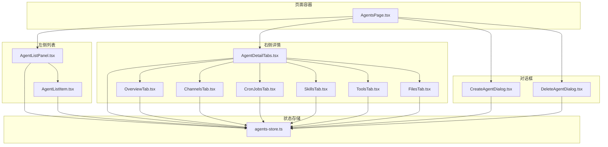
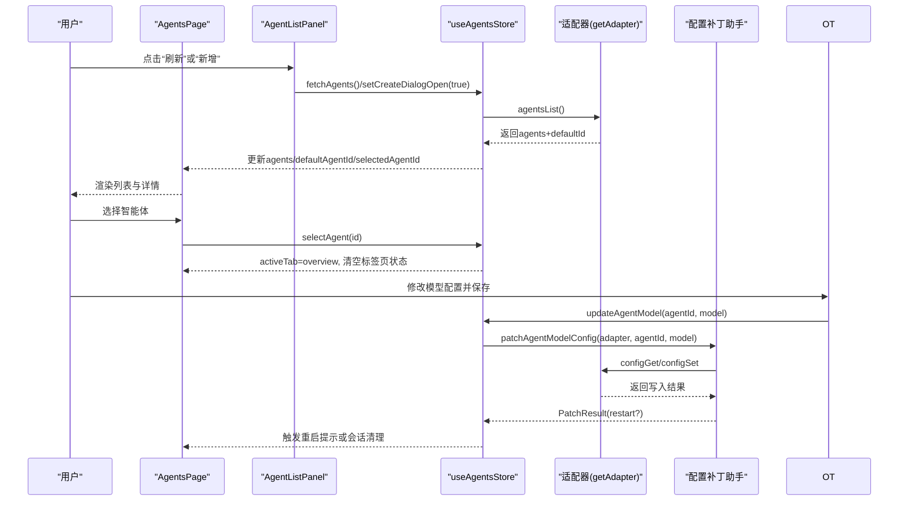
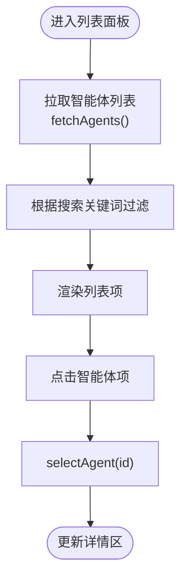
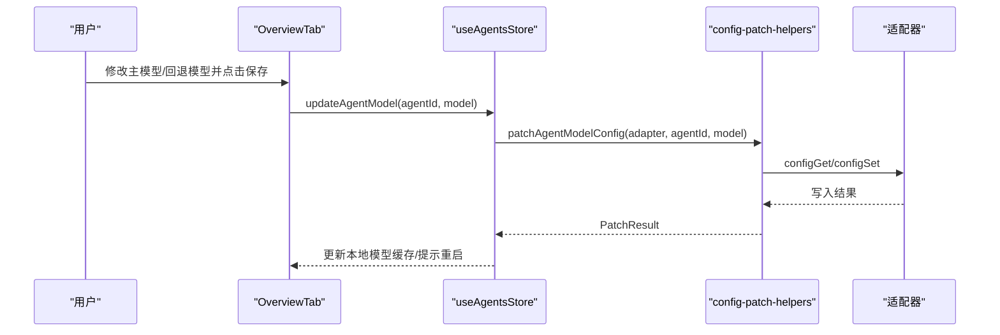
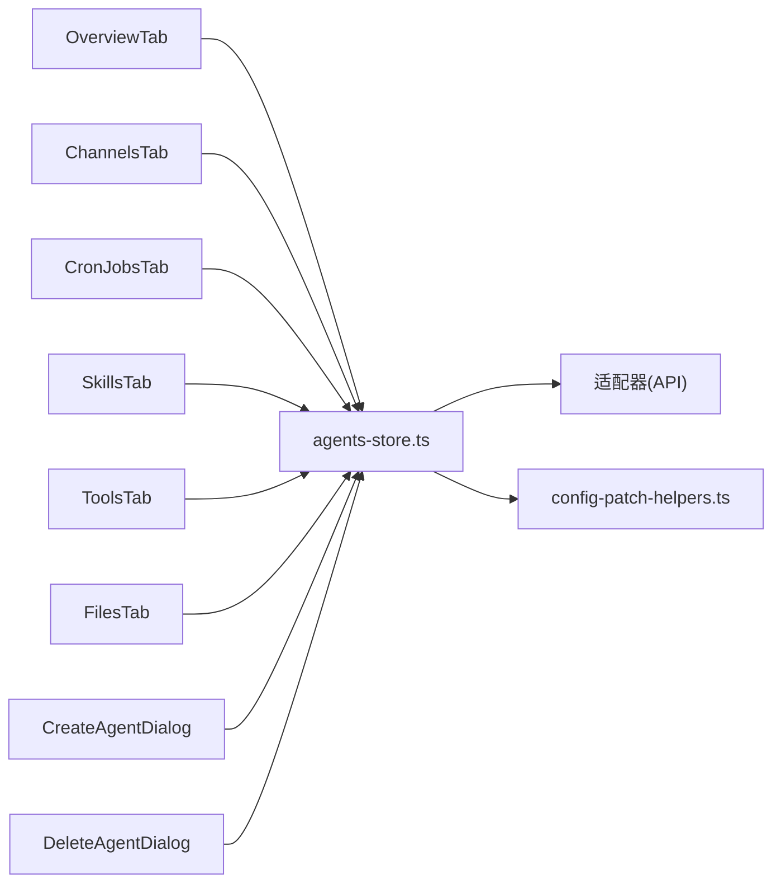

# Agents智能体管理

<cite>
**本文档引用的文件**
- [src/components/pages/AgentsPage.tsx](file://src/components/pages/AgentsPage.tsx)
- [src/components/console/agents/AgentListPanel.tsx](file://src/components/console/agents/AgentListPanel.tsx)
- [src/components/console/agents/AgentListItem.tsx](file://src/components/console/agents/AgentListItem.tsx)
- [src/components/console/agents/AgentDetailTabs.tsx](file://src/components/console/agents/AgentDetailTabs.tsx)
- [src/components/console/agents/tabs/OverviewTab.tsx](file://src/components/console/agents/tabs/OverviewTab.tsx)
- [src/components/console/agents/tabs/ChannelsTab.tsx](file://src/components/console/agents/tabs/ChannelsTab.tsx)
- [src/components/console/agents/tabs/CronJobsTab.tsx](file://src/components/console/agents/tabs/CronJobsTab.tsx)
- [src/components/console/agents/tabs/SkillsTab.tsx](file://src/components/console/agents/tabs/SkillsTab.tsx)
- [src/components/console/agents/tabs/ToolsTab.tsx](file://src/components/console/agents/tabs/ToolsTab.tsx)
- [src/components/console/agents/tabs/FilesTab.tsx](file://src/components/console/agents/tabs/FilesTab.tsx)
- [src/components/console/agents/CreateAgentDialog.tsx](file://src/components/console/agents/CreateAgentDialog.tsx)
- [src/components/console/agents/DeleteAgentDialog.tsx](file://src/components/console/agents/DeleteAgentDialog.tsx)
- [src/store/console-stores/agents-store.ts](file://src/store/console-stores/agents-store.ts)
- [src/lib/config-patch-helpers.ts](file://src/lib/config-patch-helpers.ts)
</cite>

## 目录
1. [简介](#简介)
2. [项目结构](#项目结构)
3. [核心组件](#核心组件)
4. [架构总览](#架构总览)
5. [详细组件分析](#详细组件分析)
6. [依赖关系分析](#依赖关系分析)
7. [性能考虑](#性能考虑)
8. [故障排除指南](#故障排除指南)
9. [结论](#结论)
10. [附录](#附录)

## 简介
本文件面向Agents智能体管理功能，系统性阐述智能体列表展示、创建与删除、详情页多标签页（概览/通道/定时任务/技能/工具/文件）的实现与交互；并深入解析状态管理、配置编辑、权限控制、批量操作能力，以及API调用逻辑与状态同步机制。文档提供可视化架构图与流程图，帮助开发者快速理解与扩展该功能。

## 项目结构
Agents管理功能由页面容器、列表面板、详情标签页、对话框与全局状态存储共同组成，采用“页面容器 + 组件 + 存储”的分层设计，确保职责清晰、可维护性强。

图表来源
- [src/components/pages/AgentsPage.tsx:11-54](file://src/components/pages/AgentsPage.tsx#L11-L54)
- [src/components/console/agents/AgentListPanel.tsx:6-91](file://src/components/console/agents/AgentListPanel.tsx#L6-L91)
- [src/components/console/agents/AgentDetailTabs.tsx:17-52](file://src/components/console/agents/AgentDetailTabs.tsx#L17-L52)
- [src/store/console-stores/agents-store.ts:141-641](file://src/store/console-stores/agents-store.ts#L141-L641)

章节来源
- [src/components/pages/AgentsPage.tsx:11-54](file://src/components/pages/AgentsPage.tsx#L11-L54)
- [src/components/console/agents/AgentListPanel.tsx:6-91](file://src/components/console/agents/AgentListPanel.tsx#L6-L91)
- [src/components/console/agents/AgentDetailTabs.tsx:17-52](file://src/components/console/agents/AgentDetailTabs.tsx#L17-L52)

## 核心组件
- 页面容器：负责初始化数据拉取与布局渲染，连接全局状态与子组件。
- 列表面板：提供搜索、刷新、新增入口，并渲染智能体列表项。
- 详情标签页：统一承载概览、通道、定时任务、技能、工具、文件六个标签页。
- 对话框：创建智能体与删除确认对话框，提供表单校验与异步提交。
- 全局状态存储：集中管理智能体数据、当前选中项、活动标签页、各标签页的加载状态与配置。

章节来源
- [src/components/pages/AgentsPage.tsx:11-54](file://src/components/pages/AgentsPage.tsx#L11-L54)
- [src/components/console/agents/AgentListPanel.tsx:6-91](file://src/components/console/agents/AgentListPanel.tsx#L6-L91)
- [src/components/console/agents/AgentDetailTabs.tsx:17-52](file://src/components/console/agents/AgentDetailTabs.tsx#L17-L52)
- [src/components/console/agents/CreateAgentDialog.tsx:6-125](file://src/components/console/agents/CreateAgentDialog.tsx#L6-L125)
- [src/components/console/agents/DeleteAgentDialog.tsx:6-81](file://src/components/console/agents/DeleteAgentDialog.tsx#L6-L81)
- [src/store/console-stores/agents-store.ts:141-641](file://src/store/console-stores/agents-store.ts#L141-L641)

## 架构总览
下图展示了从用户交互到后端适配器的完整调用链路，包括数据加载、配置变更与生命周期提示。

图表来源
- [src/components/pages/AgentsPage.tsx:16-18](file://src/components/pages/AgentsPage.tsx#L16-L18)
- [src/components/console/agents/AgentListPanel.tsx:46-53](file://src/components/console/agents/AgentListPanel.tsx#L46-L53)
- [src/store/console-stores/agents-store.ts:297-317](file://src/store/console-stores/agents-store.ts#L297-L317)
- [src/store/console-stores/agents-store.ts:403-449](file://src/store/console-stores/agents-store.ts#L403-L449)
- [src/lib/config-patch-helpers.ts:123-157](file://src/lib/config-patch-helpers.ts#L123-L157)

## 详细组件分析

### 智能体列表面板（AgentListPanel）
- 职责：渲染智能体列表、支持搜索过滤、提供刷新与新增入口。
- 关键行为：
  - 过滤逻辑：根据名称或ID进行大小写不敏感匹配。
  - 操作按钮：打开创建对话框、触发刷新。
  - 选中态：将当前选中智能体ID传给详情区域。
- 性能要点：列表项按需渲染，避免全量重绘。

图表来源
- [src/components/console/agents/AgentListPanel.tsx:20-25](file://src/components/console/agents/AgentListPanel.tsx#L20-L25)
- [src/components/console/agents/AgentListPanel.tsx:77-84](file://src/components/console/agents/AgentListPanel.tsx#L77-L84)
- [src/store/console-stores/agents-store.ts:297-317](file://src/store/console-stores/agents-store.ts#L297-L317)
- [src/store/console-stores/agents-store.ts:319-330](file://src/store/console-stores/agents-store.ts#L319-L330)

章节来源
- [src/components/console/agents/AgentListPanel.tsx:6-91](file://src/components/console/agents/AgentListPanel.tsx#L6-L91)
- [src/store/console-stores/agents-store.ts:297-330](file://src/store/console-stores/agents-store.ts#L297-L330)

### 智能体列表项（AgentListItem）
- 职责：展示智能体头像/表情、名称、ID，并响应点击事件。
- 特性：默认智能体显示徽章；选中态高亮边框。

章节来源
- [src/components/console/agents/AgentListItem.tsx:11-48](file://src/components/console/agents/AgentListItem.tsx#L11-L48)

### 详情标签页（AgentDetailTabs）
- 职责：统一管理六个标签页的切换与内容渲染。
- 行为：通过活动标签页状态决定渲染哪个子标签页。

章节来源
- [src/components/console/agents/AgentDetailTabs.tsx:17-52](file://src/components/console/agents/AgentDetailTabs.tsx#L17-L52)
- [src/store/console-stores/agents-store.ts:332](file://src/store/console-stores/agents-store.ts#L332)

### 概览标签页（OverviewTab）
- 功能：展示智能体基础信息与模型配置编辑。
- 配置项：主模型与回退模型；保存时进行规范化处理。
- 生命周期：保存成功后可能触发重启提示或会话清理。

图表来源
- [src/components/console/agents/tabs/OverviewTab.tsx:41-56](file://src/components/console/agents/tabs/OverviewTab.tsx#L41-L56)
- [src/store/console-stores/agents-store.ts:403-449](file://src/store/console-stores/agents-store.ts#L403-L449)
- [src/lib/config-patch-helpers.ts:123-157](file://src/lib/config-patch-helpers.ts#L123-L157)

章节来源
- [src/components/console/agents/tabs/OverviewTab.tsx:12-165](file://src/components/console/agents/tabs/OverviewTab.tsx#L12-L165)
- [src/store/console-stores/agents-store.ts:403-449](file://src/store/console-stores/agents-store.ts#L403-L449)
- [src/lib/config-patch-helpers.ts:32-50](file://src/lib/config-patch-helpers.ts#L32-L50)

### 通道标签页（ChannelsTab）
- 功能：展示所有可用通道的状态与配置情况。
- 行为：首次进入自动拉取通道状态；支持手动刷新。

章节来源
- [src/components/console/agents/tabs/ChannelsTab.tsx:33-89](file://src/components/console/agents/tabs/ChannelsTab.tsx#L33-L89)
- [src/store/console-stores/agents-store.ts:569-578](file://src/store/console-stores/agents-store.ts#L569-L578)

### 定时任务标签页（CronJobsTab）
- 功能：管理智能体的定时任务，支持增删改查、启用/禁用、立即执行与统计展示。
- 行为：使用独立对话框进行新增/编辑；保存后触发运行时提示。

章节来源
- [src/components/console/agents/tabs/CronJobsTab.tsx:14-124](file://src/components/console/agents/tabs/CronJobsTab.tsx#L14-L124)
- [src/store/console-stores/agents-store.ts:582-632](file://src/store/console-stores/agents-store.ts#L582-L632)

### 技能标签页（SkillsTab）
- 功能：支持“全部开放”与“仅选中”两种模式；可批量勾选/取消；锁定技能不可更改。
- 行为：保存时通过补丁助手写入允许清单；成功后更新配置快照与生命周期提示。

章节来源
- [src/components/console/agents/tabs/SkillsTab.tsx:14-234](file://src/components/console/agents/tabs/SkillsTab.tsx#L14-L234)
- [src/store/console-stores/agents-store.ts:520-565](file://src/store/console-stores/agents-store.ts#L520-L565)
- [src/lib/config-patch-helpers.ts:85-121](file://src/lib/config-patch-helpers.ts#L85-L121)

### 工具标签页（ToolsTab）
- 功能：编辑工具策略（预设档位、alsoAllow、deny），并展示工具目录。
- 行为：保存时通过补丁助手写入工具配置；成功后更新配置快照与生命周期提示。

章节来源
- [src/components/console/agents/tabs/ToolsTab.tsx:14-203](file://src/components/console/agents/tabs/ToolsTab.tsx#L14-L203)
- [src/store/console-stores/agents-store.ts:471-516](file://src/store/console-stores/agents-store.ts#L471-L516)
- [src/lib/config-patch-helpers.ts:52-83](file://src/lib/config-patch-helpers.ts#L52-L83)

### 文件标签页（FilesTab）
- 功能：列出智能体工作空间中的文件，支持选择、编辑、保存与撤销。
- 行为：选择文件后拉取内容；保存时仅在内容变化时触发写入。

章节来源
- [src/components/console/agents/tabs/FilesTab.tsx:31-144](file://src/components/console/agents/tabs/FilesTab.tsx#L31-L144)
- [src/store/console-stores/agents-store.ts:335-387](file://src/store/console-stores/agents-store.ts#L335-L387)

### 创建智能体对话框（CreateAgentDialog）
- 表单字段：名称（必填）、工作空间、表情符号。
- 校验规则：名称非空；工作空间为空时生成默认路径。
- 提交流程：调用创建接口，成功后自动选中并关闭对话框。

章节来源
- [src/components/console/agents/CreateAgentDialog.tsx:6-125](file://src/components/console/agents/CreateAgentDialog.tsx#L6-L125)
- [src/store/console-stores/agents-store.ts:389-401](file://src/store/console-stores/agents-store.ts#L389-L401)

### 删除智能体对话框（DeleteAgentDialog）
- 功能：删除确认，支持同时删除文件。
- 权限控制：默认智能体不可删除；删除后自动清空选中项并刷新列表。

章节来源
- [src/components/console/agents/DeleteAgentDialog.tsx:6-81](file://src/components/console/agents/DeleteAgentDialog.tsx#L6-L81)
- [src/store/console-stores/agents-store.ts:451-464](file://src/store/console-stores/agents-store.ts#L451-L464)

## 依赖关系分析
- 组件耦合：页面容器与列表/详情强关联；标签页通过统一状态驱动渲染。
- 外部依赖：适配器提供agentsList/agentsCreate/agentsDelete、channelsStatus、cronList/cronAdd/cronUpdate/cronRemove/cronRun、skillsStatus、toolsCatalog、configGet/configSet等能力。
- 配置补丁：通过补丁助手对配置进行深拷贝与合并，保证并发安全与冲突处理。

图表来源
- [src/store/console-stores/agents-store.ts:166-295](file://src/store/console-stores/agents-store.ts#L166-L295)
- [src/lib/config-patch-helpers.ts:52-157](file://src/lib/config-patch-helpers.ts#L52-L157)

章节来源
- [src/store/console-stores/agents-store.ts:166-295](file://src/store/console-stores/agents-store.ts#L166-L295)
- [src/lib/config-patch-helpers.ts:52-157](file://src/lib/config-patch-helpers.ts#L52-L157)

## 性能考虑
- 列表过滤：前端内存过滤，建议在数据量较大时引入服务端分页或搜索。
- 并行加载：系统模型与目录模型并行获取，减少等待时间。
- 状态最小化：每个标签页独立状态，避免跨页干扰；仅在必要时触发重渲染。
- 配置写入：基于快照哈希的乐观锁写入，降低冲突概率。

## 故障排除指南
- 列表为空：检查网络与适配器可用性；确认已调用刷新。
- 保存失败：查看补丁返回错误码；确认配置快照未被外部修改。
- 删除受限：默认智能体无法删除；检查是否尝试删除自身。
- 通道异常：关注通道状态与错误信息；必要时重新配置。

章节来源
- [src/store/console-stores/agents-store.ts:314-316](file://src/store/console-stores/agents-store.ts#L314-L316)
- [src/lib/config-patch-helpers.ts:76-78](file://src/lib/config-patch-helpers.ts#L76-L78)
- [src/components/console/agents/tabs/OverviewTab.tsx:150-163](file://src/components/console/agents/tabs/OverviewTab.tsx#L150-L163)

## 结论
Agents智能体管理以清晰的分层架构与完善的全局状态管理为基础，实现了从列表到详情、从配置到生命周期的闭环。通过补丁助手与适配器抽象，系统具备良好的扩展性与稳定性。后续可在批量操作、权限分级、审计日志等方面进一步增强。

## 附录

### 扩展建议
- 扩展配置项：在补丁助手与存储中增加新字段映射，保持与适配器一致的schema。
- 自定义详情页：新增标签页组件并在AgentDetailTabs注册，遵循现有状态与加载模式。
- 批量管理：在列表面板增加多选与批量操作入口，结合存储中的批量动作函数实现。

### API调用与状态同步要点
- 数据加载：统一通过适配器API获取，完成后更新全局状态。
- 配置写入：先configGet获取快照，再configSet写入，依据返回结果更新本地状态与生命周期提示。
- 状态同步：标签页状态与全局状态解耦，通过store暴露的方法进行联动。

章节来源
- [src/store/console-stores/agents-store.ts:297-317](file://src/store/console-stores/agents-store.ts#L297-L317)
- [src/lib/config-patch-helpers.ts:58-83](file://src/lib/config-patch-helpers.ts#L58-L83)