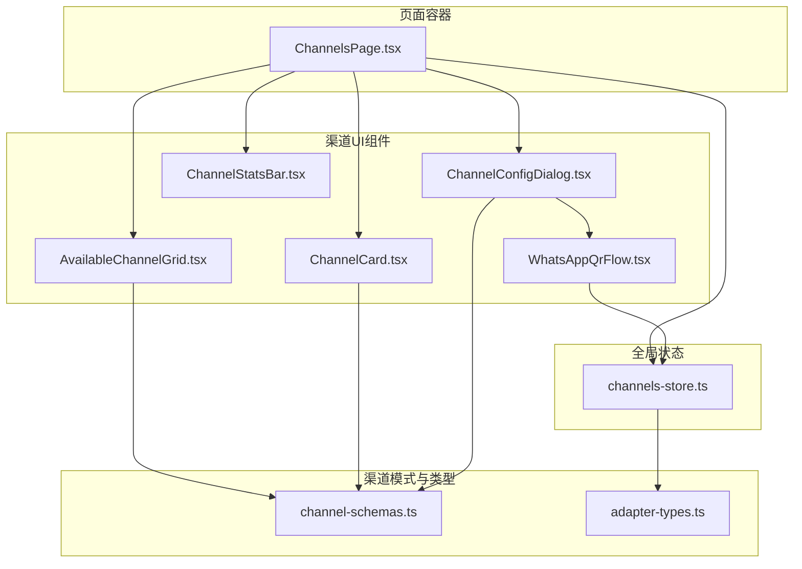
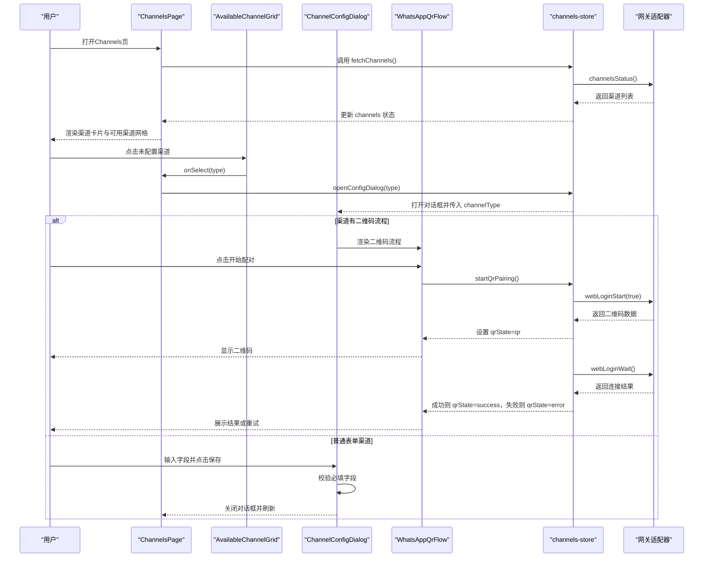
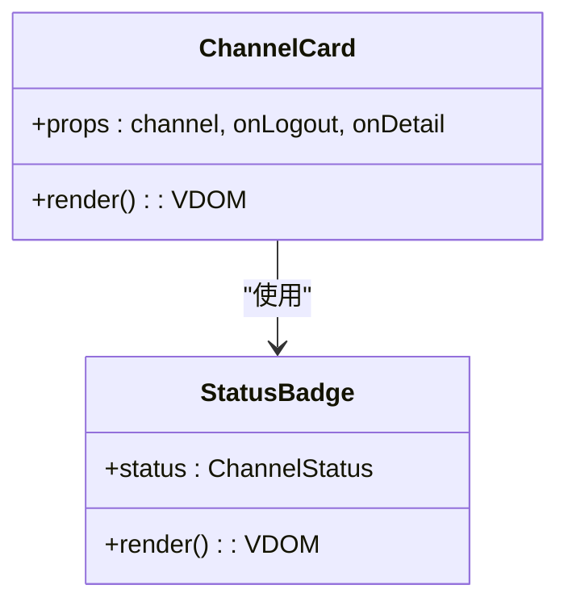
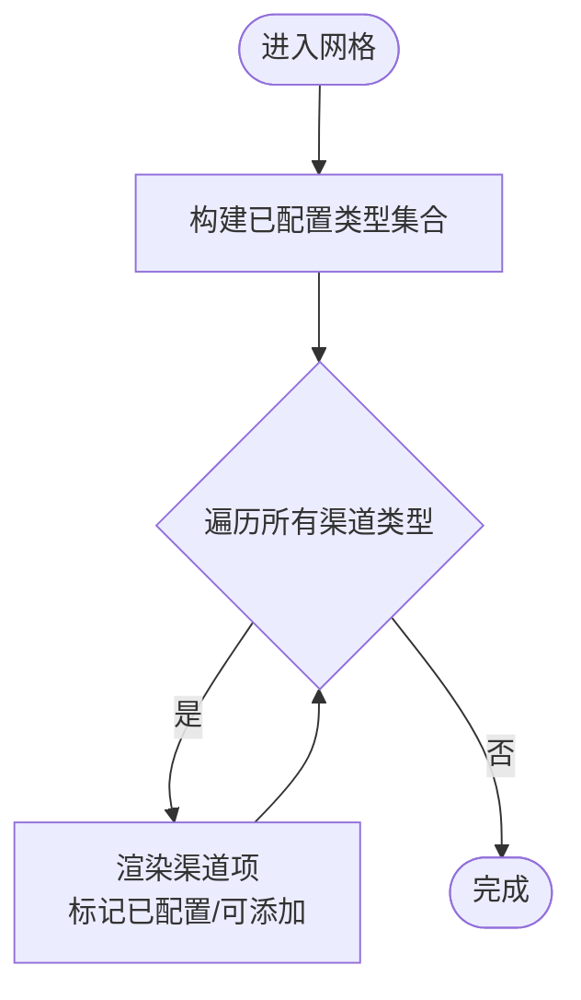
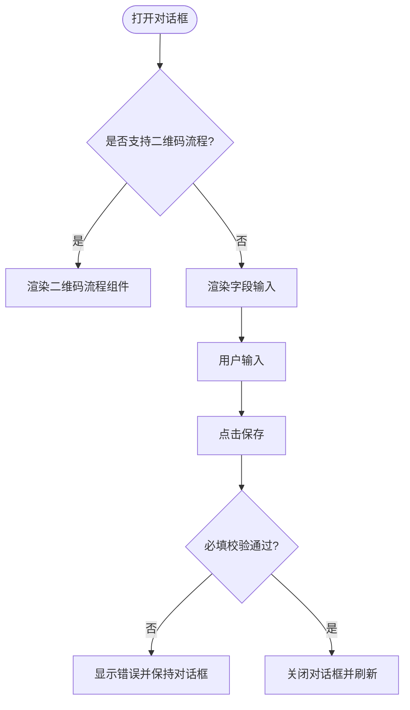
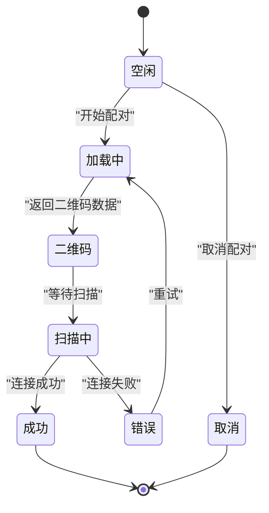
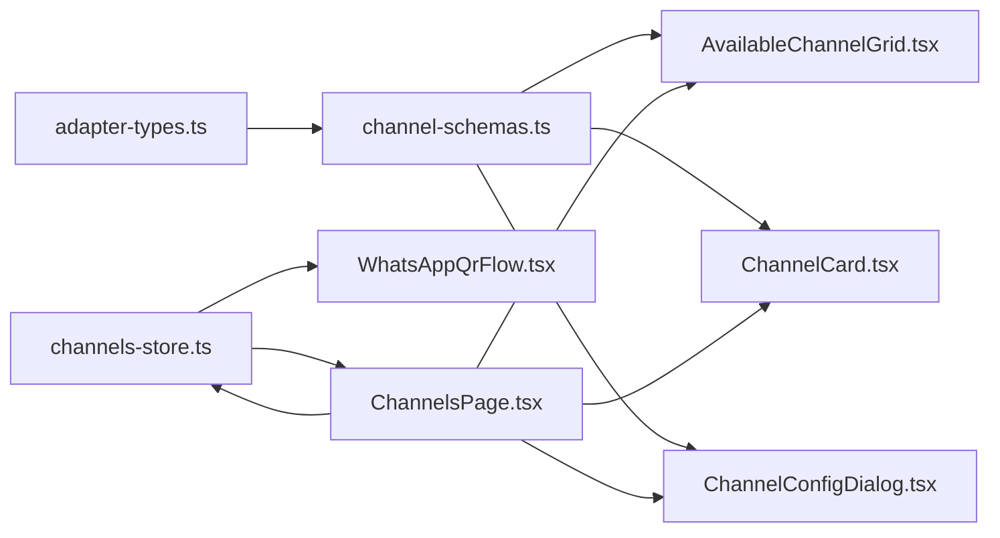

# Channels渠道配置

<cite>
**本文引用的文件**
- [AvailableChannelGrid.tsx](file://src/components/console/channels/AvailableChannelGrid.tsx)
- [ChannelCard.tsx](file://src/components/console/channels/ChannelCard.tsx)
- [ChannelConfigDialog.tsx](file://src/components/console/channels/ChannelConfigDialog.tsx)
- [WhatsAppQrFlow.tsx](file://src/components/console/channels/WhatsAppQrFlow.tsx)
- [ChannelStatsBar.tsx](file://src/components/console/channels/ChannelStatsBar.tsx)
- [ChannelsPage.tsx](file://src/components/pages/ChannelsPage.tsx)
- [channels-store.ts](file://src/store/console-stores/channels-store.ts)
- [channel-schemas.ts](file://src/lib/channel-schemas.ts)
- [adapter-types.ts](file://src/gateway/adapter-types.ts)
- [console.json](file://src/i18n/locales/en/console.json)
</cite>

## 目录
1. [简介](#简介)
2. [项目结构](#项目结构)
3. [核心组件](#核心组件)
4. [架构总览](#架构总览)
5. [详细组件分析](#详细组件分析)
6. [依赖关系分析](#依赖关系分析)
7. [性能考量](#性能考量)
8. [故障排查指南](#故障排查指南)
9. [结论](#结论)
10. [附录](#附录)

## 简介
本文件面向Channels渠道配置功能，提供从UI到状态管理与网关适配层的完整技术文档。重点覆盖以下方面：
- 渠道卡片展示与状态徽章
- 配置对话框的字段渲染与校验
- 统计信息展示
- WhatsApp二维码绑定流程
- 渠道类型管理与配置参数定义
- 连接状态监控与刷新
- 新增渠道类型与自定义配置参数的方法
- 渠道适配器集成与状态同步逻辑

## 项目结构
Channels相关功能由页面容器、UI组件、状态存储与渠道模式定义组成，采用“页面容器 + 组合子组件 + 全局状态 + 模式定义”的分层设计。

图表来源
- [ChannelsPage.tsx:15-118](file://src/components/pages/ChannelsPage.tsx#L15-L118)
- [AvailableChannelGrid.tsx:11-52](file://src/components/console/channels/AvailableChannelGrid.tsx#L11-L52)
- [ChannelCard.tsx:20-75](file://src/components/console/channels/ChannelCard.tsx#L20-L75)
- [ChannelConfigDialog.tsx:14-129](file://src/components/console/channels/ChannelConfigDialog.tsx#L14-L129)
- [WhatsAppQrFlow.tsx:9-92](file://src/components/console/channels/WhatsAppQrFlow.tsx#L9-L92)
- [ChannelStatsBar.tsx:8-33](file://src/components/console/channels/ChannelStatsBar.tsx#L8-L33)
- [channels-store.ts:27-103](file://src/store/console-stores/channels-store.ts#L27-L103)
- [channel-schemas.ts:20-205](file://src/lib/channel-schemas.ts#L20-L205)
- [adapter-types.ts:4-33](file://src/gateway/adapter-types.ts#L4-L33)

章节来源
- [ChannelsPage.tsx:15-118](file://src/components/pages/ChannelsPage.tsx#L15-L118)
- [AvailableChannelGrid.tsx:11-52](file://src/components/console/channels/AvailableChannelGrid.tsx#L11-L52)
- [ChannelCard.tsx:20-75](file://src/components/console/channels/ChannelCard.tsx#L20-L75)
- [ChannelConfigDialog.tsx:14-129](file://src/components/console/channels/ChannelConfigDialog.tsx#L14-L129)
- [WhatsAppQrFlow.tsx:9-92](file://src/components/console/channels/WhatsAppQrFlow.tsx#L9-L92)
- [ChannelStatsBar.tsx:8-33](file://src/components/console/channels/ChannelStatsBar.tsx#L8-L33)
- [channels-store.ts:27-103](file://src/store/console-stores/channels-store.ts#L27-L103)
- [channel-schemas.ts:20-205](file://src/lib/channel-schemas.ts#L20-L205)
- [adapter-types.ts:4-33](file://src/gateway/adapter-types.ts#L4-L33)

## 核心组件
- 可用渠道网格：展示所有支持的渠道类型，区分已配置与未配置状态，并触发配置对话框。
- 渠道卡片：展示单个渠道的名称、类型、连接状态、最近连接时间、错误信息以及登出按钮。
- 配置对话框：根据渠道类型动态渲染字段，进行必填校验；对支持二维码绑定的渠道，嵌入二维码流程。
- 二维码流程：生成并显示二维码，轮询扫描结果，成功后关闭对话框并刷新渠道列表。
- 渠道统计栏：展示总数、已连接数与错误数。
- 页面容器：统一加载、刷新、登出确认与对话框控制。

章节来源
- [AvailableChannelGrid.tsx:11-52](file://src/components/console/channels/AvailableChannelGrid.tsx#L11-L52)
- [ChannelCard.tsx:20-75](file://src/components/console/channels/ChannelCard.tsx#L20-L75)
- [ChannelConfigDialog.tsx:14-129](file://src/components/console/channels/ChannelConfigDialog.tsx#L14-L129)
- [WhatsAppQrFlow.tsx:9-92](file://src/components/console/channels/WhatsAppQrFlow.tsx#L9-L92)
- [ChannelStatsBar.tsx:8-33](file://src/components/console/channels/ChannelStatsBar.tsx#L8-L33)
- [ChannelsPage.tsx:15-118](file://src/components/pages/ChannelsPage.tsx#L15-L118)

## 架构总览
Channels配置功能遵循“页面容器 + 组合UI组件 + 全局状态 + 模式定义”的分层架构。页面容器负责生命周期与交互编排，UI组件负责展示与输入，全局状态负责数据与行为协调，模式定义负责渠道类型与字段规范。

图表来源
- [ChannelsPage.tsx:15-118](file://src/components/pages/ChannelsPage.tsx#L15-L118)
- [AvailableChannelGrid.tsx:11-52](file://src/components/console/channels/AvailableChannelGrid.tsx#L11-L52)
- [ChannelConfigDialog.tsx:14-129](file://src/components/console/channels/ChannelConfigDialog.tsx#L14-L129)
- [WhatsAppQrFlow.tsx:9-92](file://src/components/console/channels/WhatsAppQrFlow.tsx#L9-L92)
- [channels-store.ts:27-103](file://src/store/console-stores/channels-store.ts#L27-L103)

## 详细组件分析

### 渠道卡片展示（ChannelCard）
- 功能要点
  - 展示渠道图标、名称、类型标签
  - 使用状态徽章显示连接状态（connected/disconnected/connecting/error）
  - 显示最近连接时间与错误信息
  - 已连接状态下提供登出按钮
- 设计模式
  - 通过模式映射获取渠道图标与名称键值
  - 边框颜色按状态映射，增强可读性
- 复杂度
  - 渲染复杂度 O(n)，n为渠道数量
  - 状态切换时重新计算边框与徽章

图表来源
- [ChannelCard.tsx:20-75](file://src/components/console/channels/ChannelCard.tsx#L20-L75)
- [StatusBadge.tsx](file://src/components/console/shared/StatusBadge.tsx)

章节来源
- [ChannelCard.tsx:20-75](file://src/components/console/channels/ChannelCard.tsx#L20-L75)

### 可用渠道网格（AvailableChannelGrid）
- 功能要点
  - 列举所有渠道类型，基于已配置集合标记“已配置/添加”
  - 点击后触发选择回调，打开配置对话框
- 设计模式
  - 使用模式映射获取渠道图标与名称
  - 通过集合判断是否已配置，避免重复配置
- 复杂度
  - 渲染复杂度 O(m)，m为渠道类型总数

图表来源
- [AvailableChannelGrid.tsx:11-52](file://src/components/console/channels/AvailableChannelGrid.tsx#L11-L52)
- [channel-schemas.ts:20-205](file://src/lib/channel-schemas.ts#L20-L205)

章节来源
- [AvailableChannelGrid.tsx:11-52](file://src/components/console/channels/AvailableChannelGrid.tsx#L11-L52)
- [channel-schemas.ts:20-205](file://src/lib/channel-schemas.ts#L20-L205)

### 配置对话框（ChannelConfigDialog）
- 功能要点
  - 根据渠道类型动态渲染字段（文本、密码、多行文本、选择）
  - 必填字段校验，错误高亮提示
  - 对支持二维码流程的渠道，直接嵌入二维码流程组件
  - 支持密码显隐切换
- 设计模式
  - 使用模式定义驱动UI渲染与校验
  - 将对话框状态与全局状态解耦，仅在打开时初始化
- 复杂度
  - 字段渲染 O(k)，k为字段数量
  - 校验 O(k)

图表来源
- [ChannelConfigDialog.tsx:14-129](file://src/components/console/channels/ChannelConfigDialog.tsx#L14-L129)
- [channel-schemas.ts:20-205](file://src/lib/channel-schemas.ts#L20-L205)

章节来源
- [ChannelConfigDialog.tsx:14-129](file://src/components/console/channels/ChannelConfigDialog.tsx#L14-L129)
- [channel-schemas.ts:20-205](file://src/lib/channel-schemas.ts#L20-L205)

### WhatsApp二维码绑定流程（WhatsAppQrFlow）
- 功能要点
  - 提供“开始配对”入口，生成二维码并等待扫描
  - 显示加载、二维码、扫描中、成功、错误等状态
  - 错误时提供重试按钮
- 状态机
  - idle/loading/qr/scanning/success/error/cancel
- 与全局状态协作
  - 通过 channels-store 的 startQrPairing/cancelQrPairing 控制流程
  - 成功后自动刷新渠道列表

图表来源
- [WhatsAppQrFlow.tsx:9-92](file://src/components/console/channels/WhatsAppQrFlow.tsx#L9-L92)
- [channels-store.ts:81-102](file://src/store/console-stores/channels-store.ts#L81-L102)

章节来源
- [WhatsAppQrFlow.tsx:9-92](file://src/components/console/channels/WhatsAppQrFlow.tsx#L9-L92)
- [channels-store.ts:81-102](file://src/store/console-stores/channels-store.ts#L81-L102)

### 渠道统计栏（ChannelStatsBar）
- 功能要点
  - 统计总数、已连接数、错误数
  - 在存在错误时突出显示错误数
- 复杂度
  - 计算复杂度 O(n)，n为渠道数量

章节来源
- [ChannelStatsBar.tsx:8-33](file://src/components/console/channels/ChannelStatsBar.tsx#L8-L33)

### 页面容器（ChannelsPage）
- 功能要点
  - 生命周期：首次加载调用 fetchChannels
  - 交互：刷新、登出确认、打开配置对话框
  - 展示：统计栏、空态、渠道卡片、可用渠道网格、配置对话框、登出确认弹窗
- 与状态管理协作
  - 通过 channels-store 获取 channels、isLoading、error
  - 触发 logoutChannel、openConfigDialog、closeConfigDialog

章节来源
- [ChannelsPage.tsx:15-118](file://src/components/pages/ChannelsPage.tsx#L15-L118)
- [channels-store.ts:27-103](file://src/store/console-stores/channels-store.ts#L27-L103)

## 依赖关系分析
- 渠道类型与字段定义
  - 渠道类型枚举与状态枚举来自适配器类型定义
  - 渠道字段定义与图标、名称键值来自模式定义
- UI组件依赖
  - 渠道卡片与可用网格依赖模式映射
  - 配置对话框依赖模式映射与二维码流程
  - 二维码流程依赖全局状态
- 状态管理
  - channels-store 负责渠道列表、对话框状态、二维码流程状态与动作
  - 与网关适配器交互，封装通道状态查询与登录流程

图表来源
- [adapter-types.ts:4-33](file://src/gateway/adapter-types.ts#L4-L33)
- [channel-schemas.ts:20-205](file://src/lib/channel-schemas.ts#L20-L205)
- [AvailableChannelGrid.tsx:11-52](file://src/components/console/channels/AvailableChannelGrid.tsx#L11-L52)
- [ChannelCard.tsx:20-75](file://src/components/console/channels/ChannelCard.tsx#L20-L75)
- [ChannelConfigDialog.tsx:14-129](file://src/components/console/channels/ChannelConfigDialog.tsx#L14-L129)
- [WhatsAppQrFlow.tsx:9-92](file://src/components/console/channels/WhatsAppQrFlow.tsx#L9-L92)
- [ChannelsPage.tsx:15-118](file://src/components/pages/ChannelsPage.tsx#L15-L118)
- [channels-store.ts:27-103](file://src/store/console-stores/channels-store.ts#L27-L103)

章节来源
- [adapter-types.ts:4-33](file://src/gateway/adapter-types.ts#L4-L33)
- [channel-schemas.ts:20-205](file://src/lib/channel-schemas.ts#L20-L205)
- [AvailableChannelGrid.tsx:11-52](file://src/components/console/channels/AvailableChannelGrid.tsx#L11-L52)
- [ChannelCard.tsx:20-75](file://src/components/console/channels/ChannelCard.tsx#L20-L75)
- [ChannelConfigDialog.tsx:14-129](file://src/components/console/channels/ChannelConfigDialog.tsx#L14-L129)
- [WhatsAppQrFlow.tsx:9-92](file://src/components/console/channels/WhatsAppQrFlow.tsx#L9-L92)
- [ChannelsPage.tsx:15-118](file://src/components/pages/ChannelsPage.tsx#L15-L118)
- [channels-store.ts:27-103](file://src/store/console-stores/channels-store.ts#L27-L103)

## 性能考量
- 渲染优化
  - 渠道卡片与网格按需渲染，避免不必要的重绘
  - 使用集合快速判断已配置状态，降低渲染成本
- 状态更新
  - 全局状态集中管理，减少跨组件通信
  - 二维码流程状态机明确，避免冗余请求
- 数据获取
  - 首次加载统一调用 fetchChannels，避免重复请求
  - 登出后统一刷新，确保UI与状态一致

## 故障排查指南
- 无法看到渠道列表
  - 检查页面是否处于加载态或错误态
  - 确认网关连接正常，尝试刷新
- 二维码无法生成或扫描
  - 确认已点击“开始配对”，检查二维码状态是否进入“加载中/二维码/扫描中”
  - 若出现错误，使用“重试”按钮重新发起配对
- 保存配置失败
  - 检查必填字段是否为空，错误字段会高亮提示
  - 密码字段可切换显隐以便核对
- 登出后仍显示连接
  - 登出操作完成后会自动刷新渠道列表，请稍候片刻

章节来源
- [ChannelsPage.tsx:42-66](file://src/components/pages/ChannelsPage.tsx#L42-L66)
- [WhatsAppQrFlow.tsx:13-91](file://src/components/console/channels/WhatsAppQrFlow.tsx#L13-L91)
- [ChannelConfigDialog.tsx:58-71](file://src/components/console/channels/ChannelConfigDialog.tsx#L58-L71)
- [channels-store.ts:39-48](file://src/store/console-stores/channels-store.ts#L39-L48)

## 结论
Channels渠道配置功能通过清晰的分层设计实现了渠道发现、配置、绑定与状态监控的完整闭环。模式定义驱动UI渲染与校验，全局状态统一协调交互与数据流，二维码流程与普通表单流程并存，满足不同渠道的接入需求。新增渠道类型与自定义参数只需扩展模式定义与类型定义即可，具备良好的可扩展性。

## 附录

### 如何添加新的渠道类型
- 步骤
  - 在模式定义中新增渠道类型与字段定义
  - 在类型定义中扩展渠道类型枚举
  - 在页面或网格中引用新类型（如需）
- 示例参考路径
  - [channel-schemas.ts:20-205](file://src/lib/channel-schemas.ts#L20-L205)
  - [adapter-types.ts:4-15](file://src/gateway/adapter-types.ts#L4-L15)

章节来源
- [channel-schemas.ts:20-205](file://src/lib/channel-schemas.ts#L20-L205)
- [adapter-types.ts:4-15](file://src/gateway/adapter-types.ts#L4-L15)

### 自定义配置参数
- 支持的字段类型
  - 文本、密码、多行文本、选择
  - 必填与占位符由模式定义控制
- 参数验证
  - 必填字段在保存时进行校验
  - 错误字段高亮提示
- 示例参考路径
  - [ChannelConfigDialog.tsx:58-71](file://src/components/console/channels/ChannelConfigDialog.tsx#L58-L71)
  - [channel-schemas.ts:3-18](file://src/lib/channel-schemas.ts#L3-L18)

章节来源
- [ChannelConfigDialog.tsx:58-71](file://src/components/console/channels/ChannelConfigDialog.tsx#L58-L71)
- [channel-schemas.ts:3-18](file://src/lib/channel-schemas.ts#L3-L18)

### 实现渠道的动态启用/禁用
- 当前实现
  - 渠道状态通过网关适配器返回，包含连接状态与错误信息
  - 登出操作可断开连接并刷新状态
- 扩展建议
  - 在模式定义中增加“启用/禁用”开关字段
  - 在保存时将开关写入配置，并触发网关适配器的启用/禁用逻辑
- 示例参考路径
  - [channels-store.ts:50-57](file://src/store/console-stores/channels-store.ts#L50-L57)
  - [adapter-types.ts:19-33](file://src/gateway/adapter-types.ts#L19-L33)

章节来源
- [channels-store.ts:50-57](file://src/store/console-stores/channels-store.ts#L50-L57)
- [adapter-types.ts:19-33](file://src/gateway/adapter-types.ts#L19-L33)

### 渠道适配器集成与状态同步
- 状态同步
  - 页面首次加载调用 fetchChannels 获取最新状态
  - 登出、二维码配对成功后统一刷新
- 适配器方法
  - channelsStatus：获取渠道状态
  - channelsLogout：登出指定渠道
  - webLoginStart/webLoginWait：二维码配对流程
- 示例参考路径
  - [channels-store.ts:39-98](file://src/store/console-stores/channels-store.ts#L39-L98)

章节来源
- [channels-store.ts:39-98](file://src/store/console-stores/channels-store.ts#L39-L98)

### 国际化与文案
- 文案来源
  - 渠道类型名称、字段标签、占位符、对话框文案均来自国际化资源
- 查看路径
  - [console.json:38-119](file://src/i18n/locales/en/console.json#L38-L119)

章节来源
- [console.json:38-119](file://src/i18n/locales/en/console.json#L38-L119)