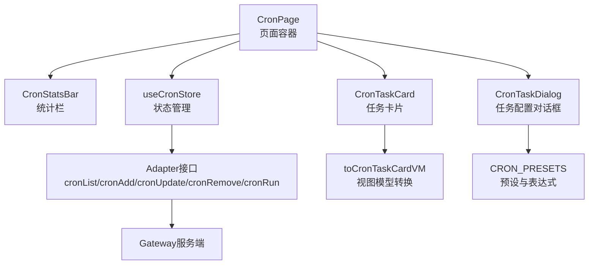
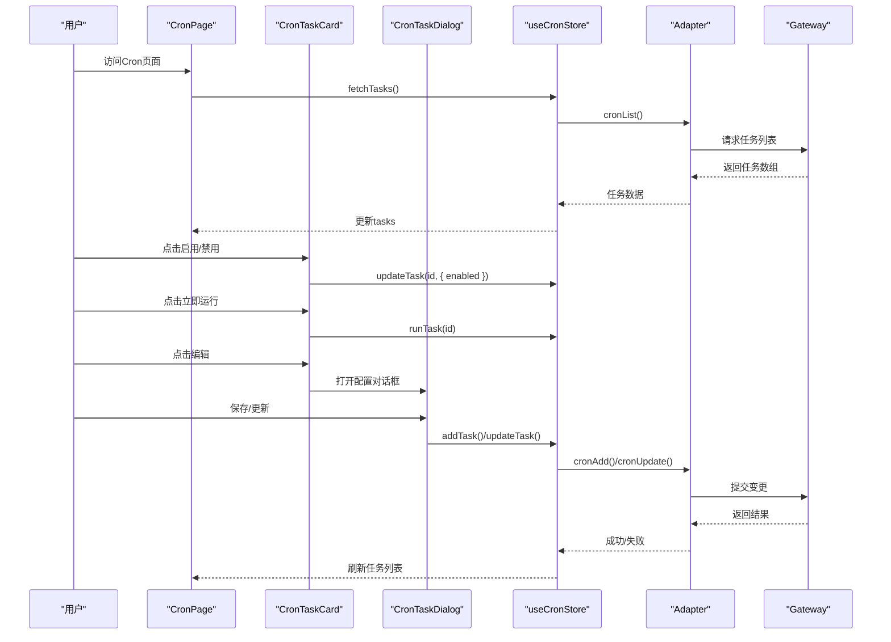
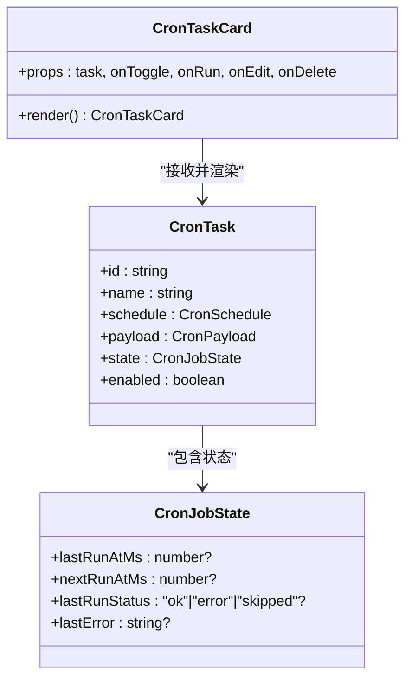
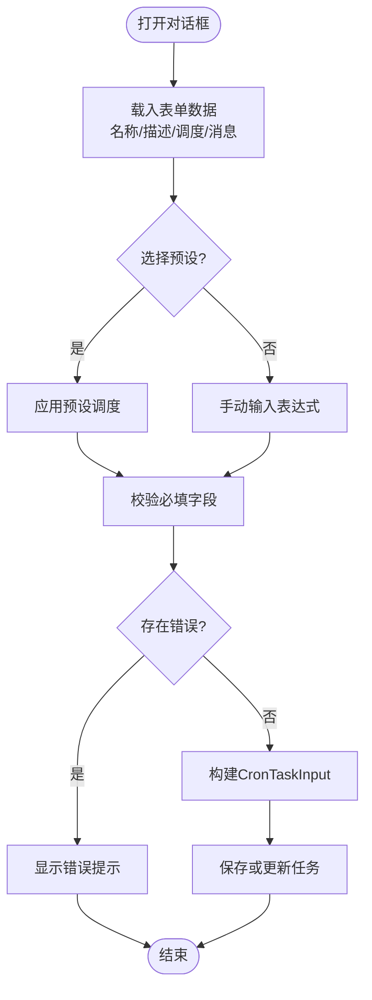
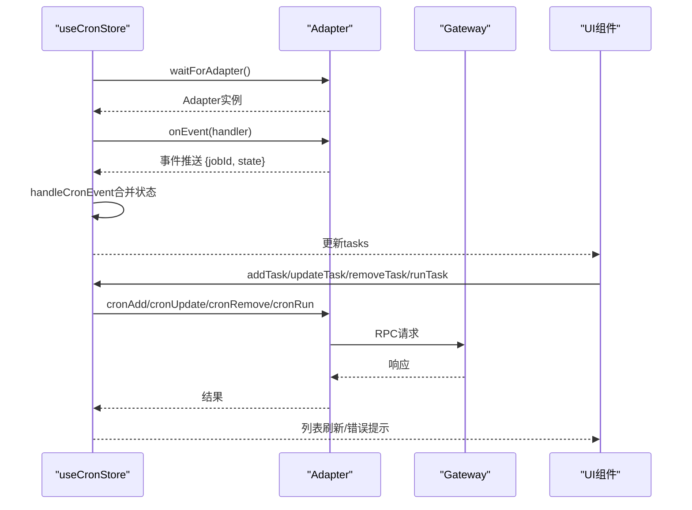
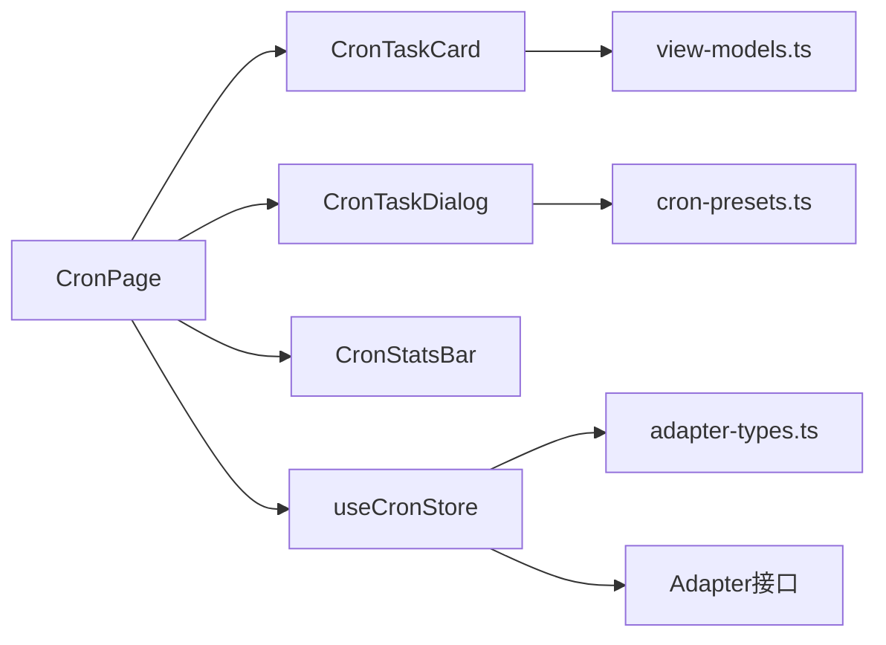
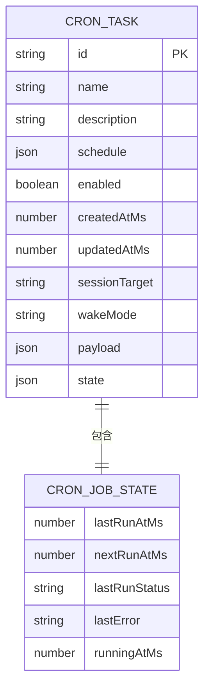

# Cron定时任务

<cite>
**本文档引用的文件**
- [CronTaskCard.tsx](file://src/components/console/cron/CronTaskCard.tsx)
- [CronTaskDialog.tsx](file://src/components/console/cron/CronTaskDialog.tsx)
- [CronStatsBar.tsx](file://src/components/console/cron/CronStatsBar.tsx)
- [cron-store.ts](file://src/store/console-stores/cron-store.ts)
- [adapter-types.ts](file://src/gateway/adapter-types.ts)
- [view-models.ts](file://src/lib/view-models.ts)
- [cron-presets.ts](file://src/lib/cron-presets.ts)
- [CronPage.tsx](file://src/components/pages/CronPage.tsx)
- [CronTaskDialog.test.ts](file://src/components/console/cron/CronTaskDialog.test.ts)
- [cron-store-phase-c.test.ts](file://src/store/__tests__/cron-store-phase-c.test.ts)
- [mock-adapter.ts](file://src/gateway/mock-adapter.ts)
</cite>

## 目录
1. [简介](#简介)
2. [项目结构](#项目结构)
3. [核心组件](#核心组件)
4. [架构总览](#架构总览)
5. [详细组件分析](#详细组件分析)
6. [依赖关系分析](#依赖关系分析)
7. [性能考虑](#性能考虑)
8. [故障排除指南](#故障排除指南)
9. [结论](#结论)
10. [附录](#附录)

## 简介
本文件面向Cron定时任务功能，提供从界面到存储层的完整技术文档。内容覆盖任务的创建、编辑、删除、运行、状态监控与统计展示；解释任务调度算法与执行历史记录；详述CronTaskCard的任务状态显示、CronTaskDialog的配置界面、CronStatsBar的统计展示等核心实现细节，并给出扩展新任务类型、自定义调度规则、批量操作的实践建议。

## 项目结构
Cron功能主要由以下层次构成：
- 页面层：CronPage负责整体布局、加载状态、错误处理、任务排序与弹窗控制
- 组件层：CronTaskCard用于单任务卡片展示与交互；CronTaskDialog用于任务配置与保存；CronStatsBar用于统计概览
- 存储层：useCronStore通过Zustand管理任务列表、对话框状态、事件监听与Adapter调用
- 类型与工具：adapter-types定义任务数据结构；view-models提供UI视图转换；cron-presets提供预设与表达式转换

**图表来源**
- [CronPage.tsx:13-151](file://src/components/pages/CronPage.tsx#L13-L151)
- [cron-store.ts:27-124](file://src/store/console-stores/cron-store.ts#L27-L124)
- [adapter-types.ts:95-123](file://src/gateway/adapter-types.ts#L95-L123)
- [view-models.ts:142-165](file://src/lib/view-models.ts#L142-L165)
- [cron-presets.ts:8-22](file://src/lib/cron-presets.ts#L8-L22)

**章节来源**
- [CronPage.tsx:13-151](file://src/components/pages/CronPage.tsx#L13-L151)
- [cron-store.ts:27-124](file://src/store/console-stores/cron-store.ts#L27-L124)

## 核心组件
- CronTaskCard：展示任务名称、调度标签、最近/下次运行时间、上次运行状态与错误信息，支持启用/禁用、立即运行、编辑、删除操作
- CronTaskDialog：提供任务表单（名称、描述、调度选择、消息内容），支持预设、手动表达式、校验与保存
- CronStatsBar：统计总数、启用/暂停、失败任务数量
- useCronStore：统一管理任务列表、加载状态、错误、对话框状态，封装Adapter调用与事件监听
- 视图模型：toCronTaskCardVM将CronTask转换为卡片视图所需字段，含调度描述与状态标签
- 预设与表达式：CRON_PRESETS提供常用调度预设，cronScheduleToExpr将调度对象转为人类可读字符串

**章节来源**
- [CronTaskCard.tsx:20-106](file://src/components/console/cron/CronTaskCard.tsx#L20-L106)
- [CronTaskDialog.tsx:37-227](file://src/components/console/cron/CronTaskDialog.tsx#L37-L227)
- [CronStatsBar.tsx:8-38](file://src/components/console/cron/CronStatsBar.tsx#L8-L38)
- [cron-store.ts:27-124](file://src/store/console-stores/cron-store.ts#L27-L124)
- [view-models.ts:142-165](file://src/lib/view-models.ts#L142-L165)
- [cron-presets.ts:8-22](file://src/lib/cron-presets.ts#L8-L22)

## 架构总览
Cron功能采用“页面-组件-存储-适配器”的分层设计。页面负责编排与状态展示，组件负责用户交互与输入校验，存储层负责与Adapter通信与事件订阅，类型系统保证数据一致性。

**图表来源**
- [CronPage.tsx:34-57](file://src/components/pages/CronPage.tsx#L34-L57)
- [cron-store.ts:35-87](file://src/store/console-stores/cron-store.ts#L35-L87)
- [adapter-types.ts:95-123](file://src/gateway/adapter-types.ts#L95-L123)

## 详细组件分析

### CronTaskCard 任务卡片组件
职责与行为
- 展示任务基本信息：名称、调度标签、消息摘要
- 显示运行状态：上次运行时间与状态图标、下次运行时间、最近错误
- 支持操作：启用/禁用切换、立即运行、编辑、删除
- 使用视图模型：toCronTaskCardVM提供格式化后的展示字段

实现要点
- 状态图标映射：ok/error/skipped对应不同图标
- 时间格式化：使用本地化日期字符串
- 可访问性：复选框使用语义化结构与标题提示

**图表来源**
- [CronTaskCard.tsx:20-106](file://src/components/console/cron/CronTaskCard.tsx#L20-L106)
- [adapter-types.ts:95-93](file://src/gateway/adapter-types.ts#L95-L93)

**章节来源**
- [CronTaskCard.tsx:20-106](file://src/components/console/cron/CronTaskCard.tsx#L20-L106)
- [view-models.ts:142-165](file://src/lib/view-models.ts#L142-L165)

### CronTaskDialog 任务配置对话框
职责与行为
- 表单字段：名称、描述、调度（预设/手动）、消息内容
- 校验规则：名称与消息必填，Cron表达式非空
- 预设选择：CRON_PRESETS提供常用模板
- 输入构建：buildCronTaskInput将表单数据转换为CronTaskInput

交互流程
- 编辑模式：载入现有任务数据，保持会话目标与唤醒模式
- 新建模式：初始化默认调度与消息
- 保存/更新：调用Store的addTask/updateTask

**图表来源**
- [CronTaskDialog.tsx:55-122](file://src/components/console/cron/CronTaskDialog.tsx#L55-L122)
- [cron-presets.ts:8-22](file://src/lib/cron-presets.ts#L8-L22)

**章节来源**
- [CronTaskDialog.tsx:37-227](file://src/components/console/cron/CronTaskDialog.tsx#L37-L227)
- [CronTaskDialog.test.ts:4-22](file://src/components/console/cron/CronTaskDialog.test.ts#L4-L22)
- [cron-presets.ts:8-22](file://src/lib/cron-presets.ts#L8-L22)

### CronStatsBar 统计展示
职责与行为
- 统计总数、启用（非错误）、暂停、失败任务数
- 失败任务存在时才显示失败统计
- 使用本地化文案与颜色标识

**章节来源**
- [CronStatsBar.tsx:8-38](file://src/components/console/cron/CronStatsBar.tsx#L8-L38)

### useCronStore 状态管理
职责与行为
- 任务生命周期：fetchTasks/addTask/updateTask/removeTask/runTask
- 对话框状态：openDialog/closeDialog
- 事件监听：initEventListeners订阅Adapter事件，handleCronEvent更新任务状态
- 配置应用：每次变更后标记runtimeCron为已应用

关键流程
- 初始化事件监听：等待Adapter就绪后注册onEvent回调
- 事件处理：根据jobId合并状态字段，避免全量替换
- 错误处理：捕获Adapter调用异常并设置error

**图表来源**
- [cron-store.ts:101-123](file://src/store/console-stores/cron-store.ts#L101-L123)
- [cron-store.ts:92-99](file://src/store/console-stores/cron-store.ts#L92-L99)
- [adapter-types.ts:95-123](file://src/gateway/adapter-types.ts#L95-L123)

**章节来源**
- [cron-store.ts:27-124](file://src/store/console-stores/cron-store.ts#L27-L124)

### 视图模型与调度描述
- toCronTaskCardVM：将CronTask转换为卡片视图模型，包含格式化后的调度字符串、状态标签等
- 调度描述：formatCronSchedule与describeCronSchedule将Cron表达式转为人类可读描述（如每日/每周）

**章节来源**
- [view-models.ts:142-199](file://src/lib/view-models.ts#L142-L199)

### 调度类型与预设
- CronSchedule：支持"at"（指定时间）、"every"（毫秒间隔）、"cron"（标准表达式）
- CRON_PRESETS：提供常用预设，cronScheduleToExpr用于将调度对象转为字符串

**章节来源**
- [adapter-types.ts:65-68](file://src/gateway/adapter-types.ts#L65-L68)
- [cron-presets.ts:8-22](file://src/lib/cron-presets.ts#L8-L22)

## 依赖关系分析
- 组件依赖：CronPage依赖CronTaskCard、CronTaskDialog、CronStatsBar与useCronStore
- 存储依赖：useCronStore依赖Adapter接口与配置存储，用于运行时配置应用
- 类型依赖：所有组件共享adapter-types中的CronTask、CronTaskInput、CronSchedule、CronPayload、CronJobState
- 视图模型：CronTaskCard依赖toCronTaskCardVM进行字段转换
- 工具依赖：CronTaskDialog依赖CRON_PRESETS与cronScheduleToExpr

**图表来源**
- [CronPage.tsx:13-29](file://src/components/pages/CronPage.tsx#L13-L29)
- [view-models.ts:142-165](file://src/lib/view-models.ts#L142-L165)
- [cron-presets.ts:8-22](file://src/lib/cron-presets.ts#L8-L22)
- [adapter-types.ts:95-123](file://src/gateway/adapter-types.ts#L95-L123)

**章节来源**
- [CronPage.tsx:13-29](file://src/components/pages/CronPage.tsx#L13-L29)
- [adapter-types.ts:95-123](file://src/gateway/adapter-types.ts#L95-L123)

## 性能考虑
- 事件驱动更新：通过Adapter事件流增量更新任务状态，避免全量重渲染
- 排序策略：按下次运行时间排序，便于用户关注即将执行的任务
- 加载与错误状态：在首次加载与错误场景下提供明确反馈，减少无效重试
- 表单校验：前端即时校验减少无效请求

## 故障排除指南
常见问题与定位
- 无法加载任务：检查Adapter是否就绪，查看useCronStore的error字段
- 事件不更新：确认initEventListeners已注册且Adapter.onEvent正常工作
- 保存失败：检查CronTaskDialog的必填校验与buildCronTaskInput构造的输入结构
- 运行无响应：确认runTask调用链路与Adapter cronRun实现

测试参考
- 单元测试：验证buildCronTaskInput的输入构建逻辑
- 集成测试：验证useCronStore在Mock Adapter下的任务增删改查与事件处理

**章节来源**
- [CronTaskDialog.test.ts:4-22](file://src/components/console/cron/CronTaskDialog.test.ts#L4-L22)
- [cron-store-phase-c.test.ts:17-41](file://src/store/__tests__/cron-store-phase-c.test.ts#L17-L41)
- [mock-adapter.ts:176-225](file://src/gateway/mock-adapter.ts#L176-L225)

## 结论
Cron定时任务功能通过清晰的分层设计实现了完整的任务生命周期管理：从页面编排、组件交互到存储与适配器通信。其核心优势在于事件驱动的状态更新、完善的表单校验与预设调度、以及直观的统计与状态展示。未来可在批量操作、自定义任务类型扩展、更丰富的调度规则等方面进一步增强。

## 附录

### 数据模型与状态流转

**图表来源**
- [adapter-types.ts:95-123](file://src/gateway/adapter-types.ts#L95-L123)

### 扩展与定制建议
- 新增任务类型：在CronPayload中扩展新的payload种类，并在CronTaskDialog中增加相应表单项与校验
- 自定义调度规则：在CRON_PRESETS中新增预设，或允许用户输入自定义表达式并通过cronScheduleToExpr转换
- 批量操作：在CronPage中引入多选与批量启用/禁用、批量删除、批量运行功能，结合useCronStore的批量API调用实现