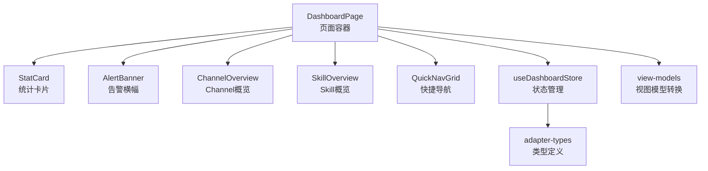
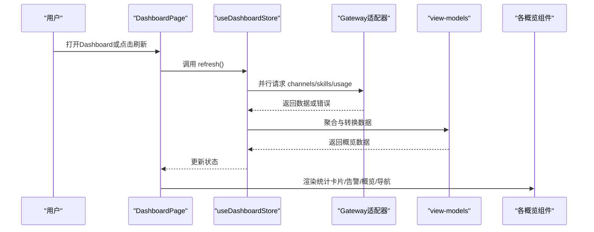
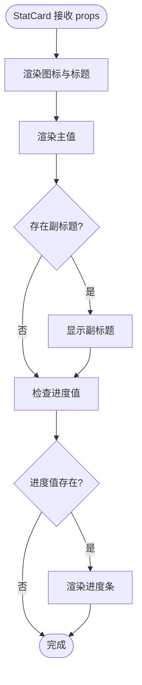
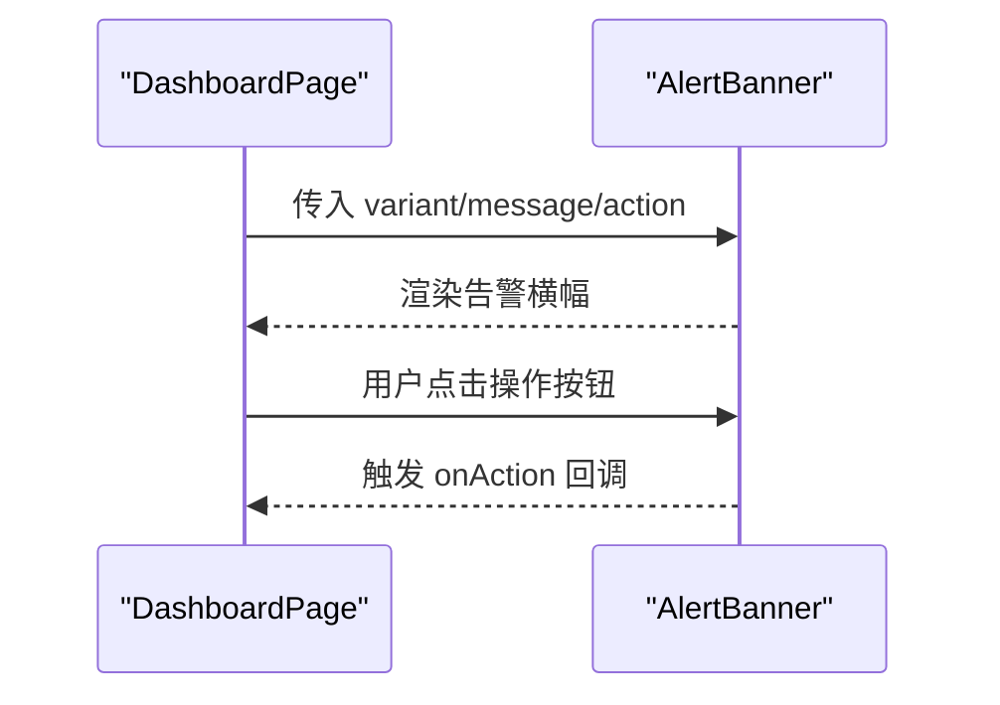
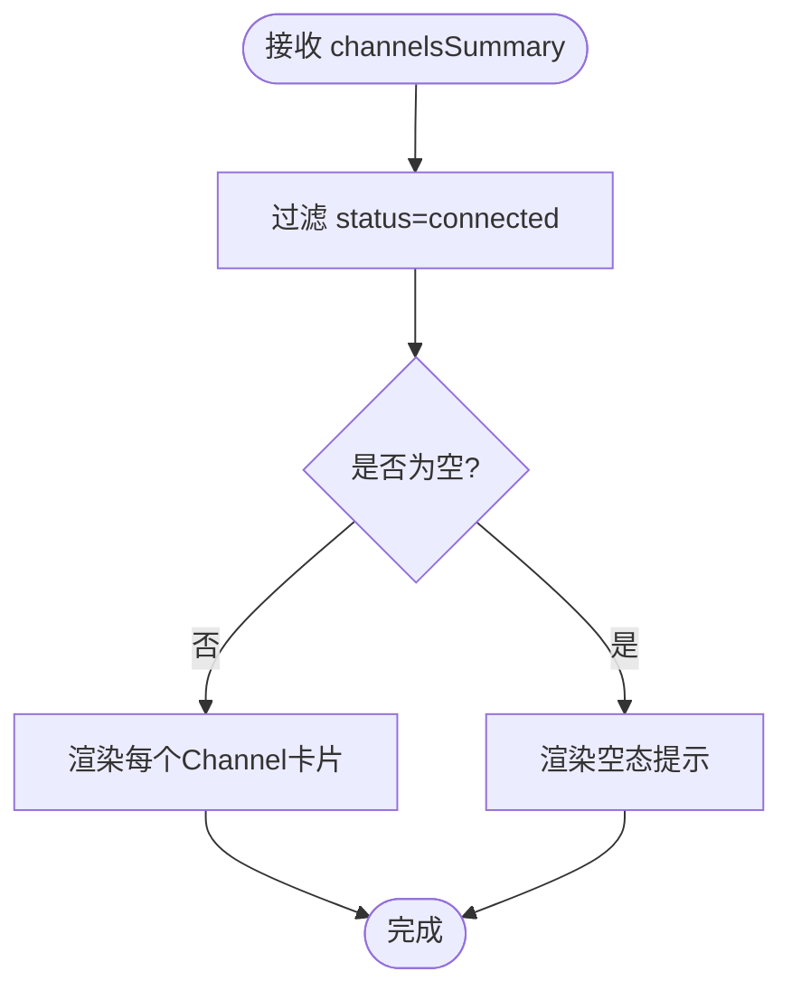
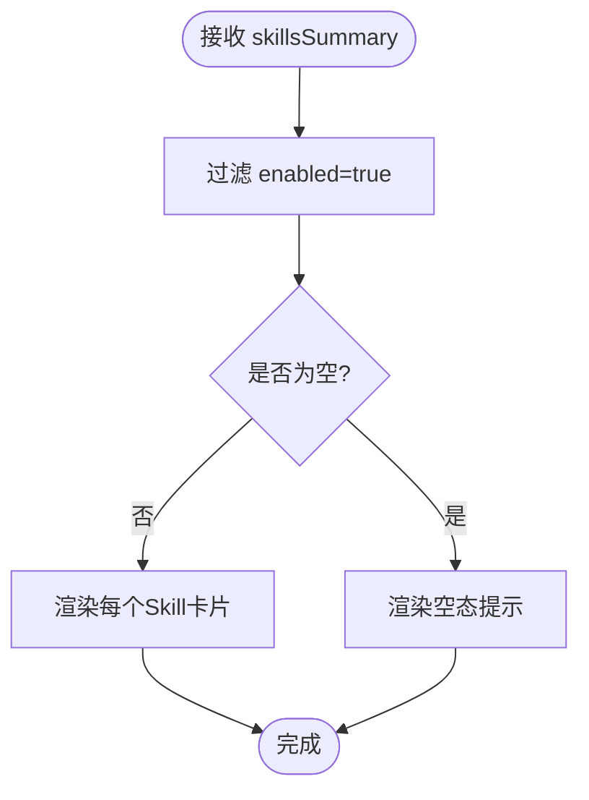
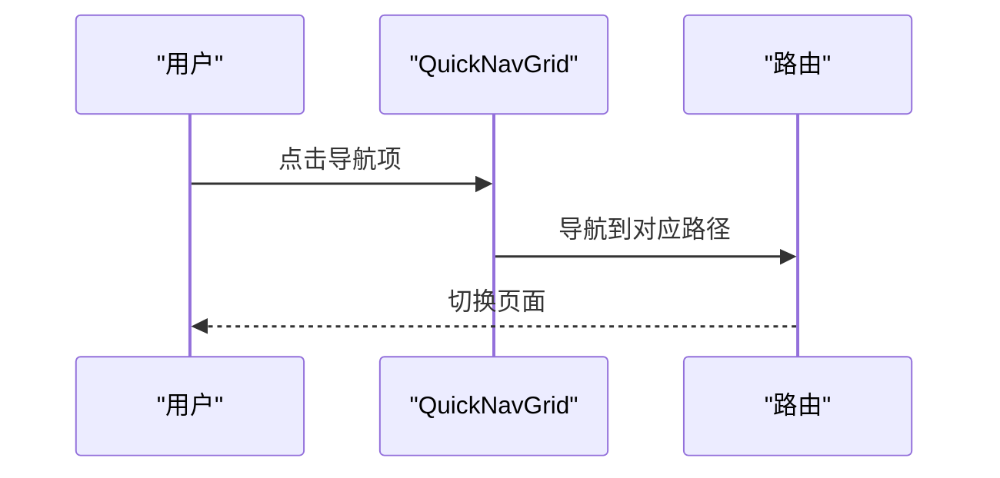
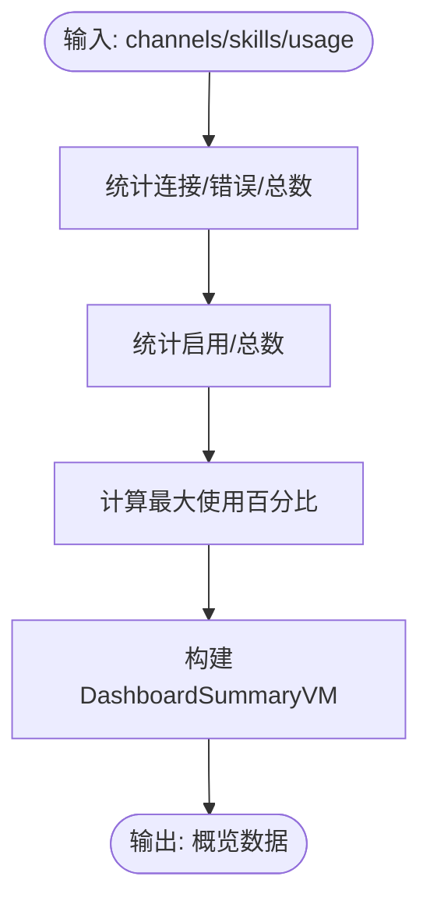
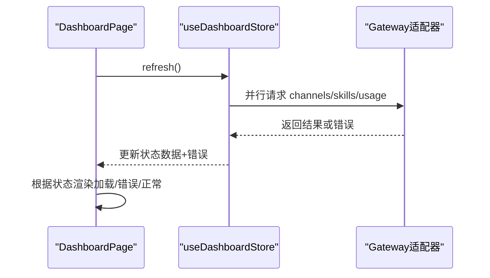
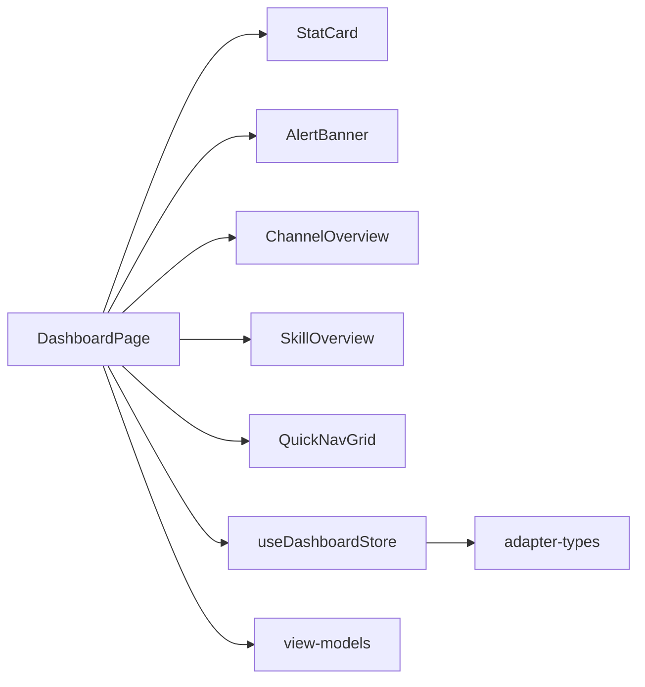

# Dashboard概览

<cite>
**本文档引用的文件**
- [src/components/pages/DashboardPage.tsx](file://src/components/pages/DashboardPage.tsx)
- [src/components/console/dashboard/StatCard.tsx](file://src/components/console/dashboard/StatCard.tsx)
- [src/components/console/dashboard/AlertBanner.tsx](file://src/components/console/dashboard/AlertBanner.tsx)
- [src/components/console/dashboard/ChannelOverview.tsx](file://src/components/console/dashboard/ChannelOverview.tsx)
- [src/components/console/dashboard/SkillOverview.tsx](file://src/components/console/dashboard/SkillOverview.tsx)
- [src/components/console/dashboard/QuickNavGrid.tsx](file://src/components/console/dashboard/QuickNavGrid.tsx)
- [src/store/console-stores/dashboard-store.ts](file://src/store/console-stores/dashboard-store.ts)
- [src/lib/view-models.ts](file://src/lib/view-models.ts)
- [src/gateway/adapter-types.ts](file://src/gateway/adapter-types.ts)
</cite>

## 目录
1. [简介](#简介)
2. [项目结构](#项目结构)
3. [核心组件](#核心组件)
4. [架构总览](#架构总览)
5. [详细组件分析](#详细组件分析)
6. [依赖关系分析](#依赖关系分析)
7. [性能考虑](#性能考虑)
8. [故障排除指南](#故障排除指南)
9. [结论](#结论)
10. [附录](#附录)

## 简介
本文件面向Dashboard概览功能，系统性阐述概览统计卡片、告警横幅、Channel/Skill概览展示与快捷导航的实现细节。重点包括：
- 统计数据的计算逻辑与实时更新机制
- 图表展示方式与可扩展性
- 概览组件实现、数据聚合算法与用户交互逻辑
- 如何添加新统计指标、自定义图表样式与实现更丰富的数据可视化
- 核心实现细节：StatCard的数据绑定、AlertBanner的告警处理、QuickNavGrid的导航逻辑

## 项目结构
Dashboard概览由页面容器、四个核心组件与状态管理共同构成，页面负责编排与刷新控制，组件负责渲染与交互，状态管理负责数据拉取与聚合。

**图表来源**
- [src/components/pages/DashboardPage.tsx:14-129](file://src/components/pages/DashboardPage.tsx#L14-L129)
- [src/components/console/dashboard/StatCard.tsx:1-39](file://src/components/console/dashboard/StatCard.tsx#L1-L39)
- [src/components/console/dashboard/AlertBanner.tsx:1-38](file://src/components/console/dashboard/AlertBanner.tsx#L1-L38)
- [src/components/console/dashboard/ChannelOverview.tsx:1-62](file://src/components/console/dashboard/ChannelOverview.tsx#L1-L62)
- [src/components/console/dashboard/SkillOverview.tsx:1-46](file://src/components/console/dashboard/SkillOverview.tsx#L1-L46)
- [src/components/console/dashboard/QuickNavGrid.tsx:1-59](file://src/components/console/dashboard/QuickNavGrid.tsx#L1-L59)
- [src/store/console-stores/dashboard-store.ts:1-55](file://src/store/console-stores/dashboard-store.ts#L1-L55)
- [src/lib/view-models.ts:82-100](file://src/lib/view-models.ts#L82-L100)
- [src/gateway/adapter-types.ts:19-57](file://src/gateway/adapter-types.ts#L19-L57)

**章节来源**
- [src/components/pages/DashboardPage.tsx:14-129](file://src/components/pages/DashboardPage.tsx#L14-L129)
- [src/store/console-stores/dashboard-store.ts:16-54](file://src/store/console-stores/dashboard-store.ts#L16-L54)

## 核心组件
- StatCard：通用统计卡片，支持图标、标题、数值、副标题与进度条展示，用于呈现连接数、启用数、使用率与在线时长等指标。
- AlertBanner：告警横幅，支持警告与错误两种变体，可选操作按钮，用于提示网关断开与Channel错误等状态。
- ChannelOverview：Channel概览，展示已连接的Channel列表及其状态徽标，为空时显示占位信息。
- SkillOverview：Skill概览，展示已启用的Skill列表，为空时显示占位信息。
- QuickNavGrid：快捷导航网格，提供快速跳转到Channels、Skills、Cron与Settings的入口。

**章节来源**
- [src/components/console/dashboard/StatCard.tsx:3-38](file://src/components/console/dashboard/StatCard.tsx#L3-L38)
- [src/components/console/dashboard/AlertBanner.tsx:3-37](file://src/components/console/dashboard/AlertBanner.tsx#L3-L37)
- [src/components/console/dashboard/ChannelOverview.tsx:20-61](file://src/components/console/dashboard/ChannelOverview.tsx#L20-L61)
- [src/components/console/dashboard/SkillOverview.tsx:5-45](file://src/components/console/dashboard/SkillOverview.tsx#L5-L45)
- [src/components/console/dashboard/QuickNavGrid.tsx:5-30](file://src/components/console/dashboard/QuickNavGrid.tsx#L5-L30)

## 架构总览
Dashboard概览采用“页面容器 + 组件 + 状态管理 + 视图模型”的分层设计。页面负责生命周期与刷新控制；状态管理通过适配器异步拉取Channel、Skill与Usage数据，并聚合为概览所需格式；视图模型将原始数据转换为UI友好的展示对象；组件以声明式方式渲染。

**图表来源**
- [src/components/pages/DashboardPage.tsx:19-21](file://src/components/pages/DashboardPage.tsx#L19-L21)
- [src/store/console-stores/dashboard-store.ts:24-53](file://src/store/console-stores/dashboard-store.ts#L24-L53)
- [src/lib/view-models.ts:82-100](file://src/lib/view-models.ts#L82-L100)

**章节来源**
- [src/components/pages/DashboardPage.tsx:14-129](file://src/components/pages/DashboardPage.tsx#L14-L129)
- [src/store/console-stores/dashboard-store.ts:16-54](file://src/store/console-stores/dashboard-store.ts#L16-L54)
- [src/lib/view-models.ts:82-100](file://src/lib/view-models.ts#L82-L100)

## 详细组件分析

### StatCard 统计卡片
- 设计要点
  - 支持图标、标题、主值、副标题与进度条
  - 进度条宽度受控在0-100之间，使用过渡动画
  - 深浅色主题适配
- 数据绑定
  - 通过属性传入图标、标题、数值、副标题与进度百分比
  - 颜色通过color参数控制
- 使用场景
  - 连接数/总数、启用数/总数、使用率、在线时长等

**图表来源**
- [src/components/console/dashboard/StatCard.tsx:12-38](file://src/components/console/dashboard/StatCard.tsx#L12-L38)

**章节来源**
- [src/components/console/dashboard/StatCard.tsx:3-38](file://src/components/console/dashboard/StatCard.tsx#L3-L38)
- [src/components/pages/DashboardPage.tsx:88-114](file://src/components/pages/DashboardPage.tsx#L88-L114)

### AlertBanner 告警横幅
- 变体与样式
  - warning：警告样式
  - error：错误样式
- 行为
  - 显示消息文本
  - 可选操作按钮，点击回调由父组件传入
- 在Dashboard中的应用
  - 网关断开时显示警告
  - 存在Channel错误时显示错误告警

**图表来源**
- [src/components/console/dashboard/AlertBanner.tsx:17-37](file://src/components/console/dashboard/AlertBanner.tsx#L17-L37)
- [src/components/pages/DashboardPage.tsx:78-86](file://src/components/pages/DashboardPage.tsx#L78-L86)

**章节来源**
- [src/components/console/dashboard/AlertBanner.tsx:3-37](file://src/components/console/dashboard/AlertBanner.tsx#L3-L37)
- [src/components/pages/DashboardPage.tsx:78-86](file://src/components/pages/DashboardPage.tsx#L78-L86)

### ChannelOverview Channel概览
- 功能
  - 展示已连接的Channel列表，包含类型图标、名称与状态徽标
  - 无连接Channel时显示空态提示
- 数据来源
  - 从状态管理获取 channelsSummary
- 本地化
  - 标题与空态文案通过翻译键获取

**图表来源**
- [src/components/console/dashboard/ChannelOverview.tsx:24-61](file://src/components/console/dashboard/ChannelOverview.tsx#L24-L61)
- [src/components/pages/DashboardPage.tsx:123-126](file://src/components/pages/DashboardPage.tsx#L123-L126)

**章节来源**
- [src/components/console/dashboard/ChannelOverview.tsx:20-61](file://src/components/console/dashboard/ChannelOverview.tsx#L20-L61)
- [src/components/pages/DashboardPage.tsx:123-126](file://src/components/pages/DashboardPage.tsx#L123-L126)

### SkillOverview Skill概览
- 功能
  - 展示已启用的Skill列表，包含图标、名称
  - 无启用Skill时显示空态提示
- 数据来源
  - 从状态管理获取 skillsSummary
- 本地化
  - 标题与空态文案通过翻译键获取

**图表来源**
- [src/components/console/dashboard/SkillOverview.tsx:9-45](file://src/components/console/dashboard/SkillOverview.tsx#L9-L45)
- [src/components/pages/DashboardPage.tsx:123-126](file://src/components/pages/DashboardPage.tsx#L123-L126)

**章节来源**
- [src/components/console/dashboard/SkillOverview.tsx:5-45](file://src/components/console/dashboard/SkillOverview.tsx#L5-L45)
- [src/components/pages/DashboardPage.tsx:123-126](file://src/components/pages/DashboardPage.tsx#L123-L126)

### QuickNavGrid 快捷导航
- 功能
  - 提供四宫格导航，分别指向Channels、Skills、Cron、Settings
  - 支持国际化标题与描述
- 交互
  - 点击按钮触发路由跳转

**图表来源**
- [src/components/console/dashboard/QuickNavGrid.tsx:32-58](file://src/components/console/dashboard/QuickNavGrid.tsx#L32-L58)
- [src/components/pages/DashboardPage.tsx:116-121](file://src/components/pages/DashboardPage.tsx#L116-L121)

**章节来源**
- [src/components/console/dashboard/QuickNavGrid.tsx:5-30](file://src/components/console/dashboard/QuickNavGrid.tsx#L5-L30)
- [src/components/pages/DashboardPage.tsx:116-121](file://src/components/pages/DashboardPage.tsx#L116-L121)

### 数据聚合与统计逻辑
- 统计指标
  - Channel连接数/总数：连接数与总数
  - Skill启用数/总数：启用数与总数
  - 使用率：取首个Provider的首个窗口的使用百分比
  - 在线时长：基于网关连接状态显示“在线”或“—”
- 计算位置
  - 页面内直接统计（连接数、启用数、在线时长）
  - 使用率通过UsageInfo计算（最大使用百分比）
- 视图模型转换
  - 将原始数据转换为DashboardSummaryVM，便于复用与扩展

**图表来源**
- [src/lib/view-models.ts:82-100](file://src/lib/view-models.ts#L82-L100)
- [src/components/pages/DashboardPage.tsx:59-67](file://src/components/pages/DashboardPage.tsx#L59-L67)

**章节来源**
- [src/lib/view-models.ts:82-100](file://src/lib/view-models.ts#L82-L100)
- [src/components/pages/DashboardPage.tsx:59-67](file://src/components/pages/DashboardPage.tsx#L59-L67)

### 实时更新机制
- 触发时机
  - 页面挂载后自动刷新一次
  - 用户点击刷新按钮时手动刷新
- 数据来源
  - 通过适配器并行请求channels/skills/usage
  - Promise.allSettled确保部分失败不影响整体
- 错误处理
  - 将适配器错误收集为字符串，统一显示
  - 网关断开时显示连接引导

**图表来源**
- [src/components/pages/DashboardPage.tsx:19-21](file://src/components/pages/DashboardPage.tsx#L19-L21)
- [src/store/console-stores/dashboard-store.ts:24-53](file://src/store/console-stores/dashboard-store.ts#L24-L53)

**章节来源**
- [src/components/pages/DashboardPage.tsx:19-57](file://src/components/pages/DashboardPage.tsx#L19-L57)
- [src/store/console-stores/dashboard-store.ts:24-53](file://src/store/console-stores/dashboard-store.ts#L24-L53)

## 依赖关系分析
- 组件间耦合
  - DashboardPage作为编排者，依赖四个概览组件与状态管理
  - 概览组件保持低耦合，仅依赖状态管理提供的数据
- 外部依赖
  - 网关适配器提供数据源
  - 视图模型提供数据转换
  - 国际化与路由参与交互与文案
- 类型安全
  - 通过adapter-types定义ChannelInfo、SkillInfo、UsageInfo等类型，保证数据结构一致性

**图表来源**
- [src/components/pages/DashboardPage.tsx:1-13](file://src/components/pages/DashboardPage.tsx#L1-L13)
- [src/store/console-stores/dashboard-store.ts:1-14](file://src/store/console-stores/dashboard-store.ts#L1-L14)
- [src/gateway/adapter-types.ts:19-57](file://src/gateway/adapter-types.ts#L19-L57)
- [src/lib/view-models.ts:1-6](file://src/lib/view-models.ts#L1-L6)

**章节来源**
- [src/components/pages/DashboardPage.tsx:1-13](file://src/components/pages/DashboardPage.tsx#L1-L13)
- [src/store/console-stores/dashboard-store.ts:1-14](file://src/store/console-stores/dashboard-store.ts#L1-L14)
- [src/gateway/adapter-types.ts:19-57](file://src/gateway/adapter-types.ts#L19-L57)
- [src/lib/view-models.ts:1-6](file://src/lib/view-models.ts#L1-L6)

## 性能考虑
- 并行拉取
  - 使用Promise.allSettled并行获取三类数据，减少总等待时间
- 局部更新
  - 统计卡片与概览组件按需渲染，避免全量重绘
- 进度条动画
  - 使用CSS过渡实现平滑进度变化，避免频繁强制布局
- 加载与错误分支
  - 页面根据状态分支渲染加载、错误或正常内容，避免无效计算

[本节为通用指导，无需具体文件分析]

## 故障排除指南
- 网关未连接
  - 现象：显示警告横幅与连接引导
  - 处理：按照引导步骤启动服务或检查网络
- 适配器调用失败
  - 现象：错误横幅显示，状态管理记录错误信息
  - 处理：查看错误详情，确认服务端可用性
- Channel错误
  - 现象：错误告警横幅显示错误数量
  - 处理：进入Channels页面排查具体Channel配置与状态
- 刷新无响应
  - 现象：点击刷新按钮无效
  - 处理：检查页面是否处于加载中，稍后再试

**章节来源**
- [src/components/pages/DashboardPage.tsx:78-86](file://src/components/pages/DashboardPage.tsx#L78-L86)
- [src/components/pages/DashboardPage.tsx:131-199](file://src/components/pages/DashboardPage.tsx#L131-L199)
- [src/store/console-stores/dashboard-store.ts:43-52](file://src/store/console-stores/dashboard-store.ts#L43-L52)

## 结论
Dashboard概览通过清晰的分层设计与组件化实现，提供了直观、可扩展的概览能力。页面负责编排与刷新，状态管理负责数据聚合，视图模型负责数据转换，四个核心组件分别承担统计、告警、概览与导航职责。该架构易于扩展新的统计指标与可视化形式，同时具备良好的错误处理与用户体验。

[本节为总结性内容，无需具体文件分析]

## 附录

### 如何添加新的统计指标
- 步骤
  - 在状态管理中新增字段与计算逻辑
  - 在视图模型中扩展转换函数
  - 在页面中渲染新的StatCard并传入数据
- 示例参考
  - 新增字段：在状态管理中添加新字段并在refresh中赋值
  - 视图模型：在转换函数中计算新指标
  - 页面：在网格中新增一个StatCard并设置图标、标题与数值

**章节来源**
- [src/store/console-stores/dashboard-store.ts:5-14](file://src/store/console-stores/dashboard-store.ts#L5-L14)
- [src/lib/view-models.ts:82-100](file://src/lib/view-models.ts#L82-L100)
- [src/components/pages/DashboardPage.tsx:88-114](file://src/components/pages/DashboardPage.tsx#L88-L114)

### 自定义图表样式与可视化
- 方案
  - 在现有StatCard基础上扩展进度条样式或颜色
  - 引入独立图表组件（如柱状图、饼图）替换或补充当前展示
  - 使用CSS变量或主题系统统一风格
- 注意事项
  - 保持与深浅色主题兼容
  - 控制动画与重绘开销

[本节为通用指导，无需具体文件分析]

### 数据类型与接口
- 关键类型
  - ChannelInfo：Channel状态与元信息
  - SkillInfo：Skill启用与元信息
  - UsageInfo：Provider与使用窗口信息
- 作用
  - 保障数据结构一致，便于视图模型转换与组件渲染

**章节来源**
- [src/gateway/adapter-types.ts:19-57](file://src/gateway/adapter-types.ts#L19-L57)
- [src/gateway/adapter-types.ts:254-257](file://src/gateway/adapter-types.ts#L254-L257)