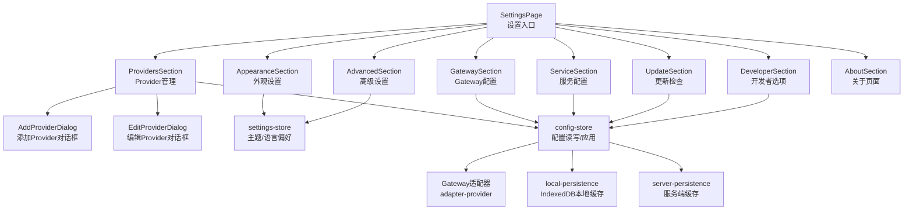
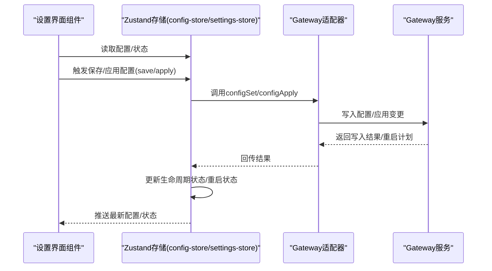
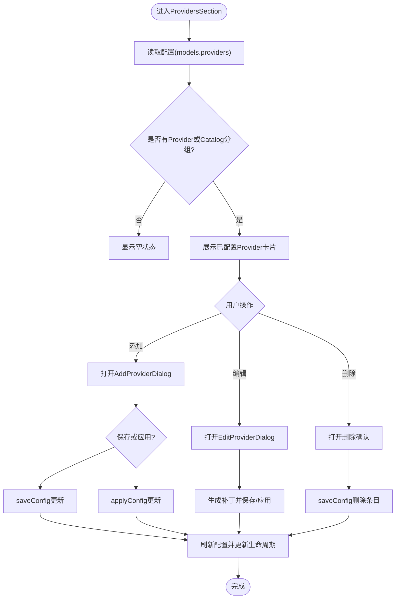
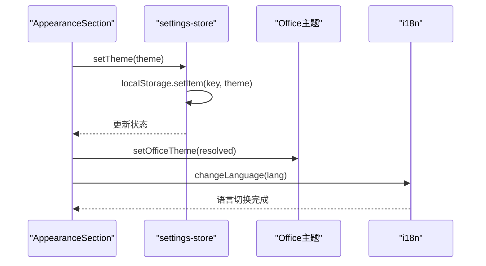
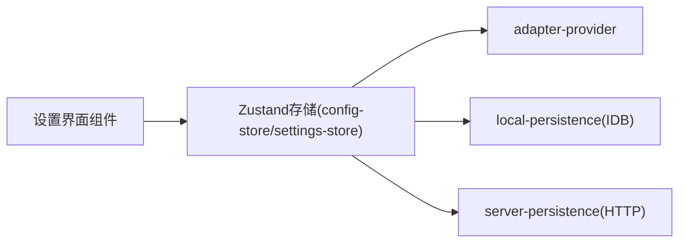

# Settings系统设置

<cite>
**本文档引用的文件**
- [SettingsPage.tsx](file://src/components/pages/SettingsPage.tsx)
- [ProvidersSection.tsx](file://src/components/console/settings/ProvidersSection.tsx)
- [AppearanceSection.tsx](file://src/components/console/settings/AppearanceSection.tsx)
- [GatewaySection.tsx](file://src/components/console/settings/GatewaySection.tsx)
- [ServiceSection.tsx](file://src/components/console/settings/ServiceSection.tsx)
- [AdvancedSection.tsx](file://src/components/console/settings/AdvancedSection.tsx)
- [DeveloperSection.tsx](file://src/components/console/settings/DeveloperSection.tsx)
- [AboutSection.tsx](file://src/components/console/settings/AboutSection.tsx)
- [UpdateSection.tsx](file://src/components/console/settings/UpdateSection.tsx)
- [AddProviderDialog.tsx](file://src/components/console/settings/AddProviderDialog.tsx)
- [EditProviderDialog.tsx](file://src/components/console/settings/EditProviderDialog.tsx)
- [config-store.ts](file://src/store/console-stores/config-store.ts)
- [settings-store.ts](file://src/store/console-stores/settings-store.ts)
- [local-persistence.ts](file://src/lib/local-persistence.ts)
- [server-persistence.ts](file://src/lib/server-persistence.ts)
</cite>

## 目录
1. [简介](#简介)
2. [项目结构](#项目结构)
3. [核心组件](#核心组件)
4. [架构总览](#架构总览)
5. [详细组件分析](#详细组件分析)
6. [依赖关系分析](#依赖关系分析)
7. [性能考虑](#性能考虑)
8. [故障排除指南](#故障排除指南)
9. [结论](#结论)
10. [附录](#附录)

## 简介
本文件为 Settings 系统设置功能的详细技术文档，覆盖 Provider 管理（添加/编辑/删除）、外观设置、Gateway 配置、开发者选项、高级设置、关于页面、更新检查等模块。文档深入解释配置项的验证、持久化存储与热重载机制，并提供设置界面实现、配置管理逻辑、状态同步机制的代码示例路径。同时包含如何添加新配置项、自定义设置页面、实现配置导入/导出的实践建议。

## 项目结构
Settings 页面由 SettingsPage 统一编排，按模块拆分为多个 Section 组件，每个 Section 负责特定领域的配置展示与操作；配置读写通过 config-store 进行统一管理；主题与语言偏好通过 settings-store 管理并持久化到本地存储；部分数据通过本地 IndexedDB 与服务端缓存进行持久化。

图表来源
- [SettingsPage.tsx:16-54](file://src/components/pages/SettingsPage.tsx#L16-L54)
- [ProvidersSection.tsx:35-198](file://src/components/console/settings/ProvidersSection.tsx#L35-L198)
- [AppearanceSection.tsx:24-90](file://src/components/console/settings/AppearanceSection.tsx#L24-L90)
- [GatewaySection.tsx:5-75](file://src/components/console/settings/GatewaySection.tsx#L5-L75)
- [ServiceSection.tsx:15-287](file://src/components/console/settings/ServiceSection.tsx#L15-L287)
- [UpdateSection.tsx:7-116](file://src/components/console/settings/UpdateSection.tsx#L7-L116)
- [AdvancedSection.tsx:4-42](file://src/components/console/settings/AdvancedSection.tsx#L4-L42)
- [DeveloperSection.tsx:7-86](file://src/components/console/settings/DeveloperSection.tsx#L7-L86)
- [AboutSection.tsx:5-51](file://src/components/console/settings/AboutSection.tsx#L5-L51)
- [AddProviderDialog.tsx:21-258](file://src/components/console/settings/AddProviderDialog.tsx#L21-L258)
- [EditProviderDialog.tsx:23-192](file://src/components/console/settings/EditProviderDialog.tsx#L23-L192)
- [config-store.ts:93-400](file://src/store/console-stores/config-store.ts#L93-L400)
- [settings-store.ts:31-50](file://src/store/console-stores/settings-store.ts#L31-L50)
- [local-persistence.ts:34-404](file://src/lib/local-persistence.ts#L34-L404)
- [server-persistence.ts:53-137](file://src/lib/server-persistence.ts#L53-L137)

章节来源
- [SettingsPage.tsx:16-54](file://src/components/pages/SettingsPage.tsx#L16-L54)

## 核心组件
- 设置入口与布局：SettingsPage 负责加载配置、触发状态刷新，并按顺序渲染各 Section。
- 外观设置：AppearanceSection 提供主题与语言切换，联动控制台主题与 i18n。
- Provider 管理：ProvidersSection 展示已配置 Provider 与可选 Catalog Provider，支持添加、编辑、删除；AddProviderDialog 与 EditProviderDialog 提供表单与模型列表编辑。
- Gateway 配置：GatewaySection 展示 Gateway 状态信息并支持手动刷新。
- 服务配置：ServiceSection 展示服务安装/运行状态，支持启动、停止、重启与安装。
- 更新检查：UpdateSection 支持检查更新、确认更新、显示结果。
- 高级设置：AdvancedSection 提供开发者模式开关。
- 开发者选项：DeveloperSection 展示网关令牌状态、配置路径、WebSocket 地址与原始配置。
- 关于页面：AboutSection 展示应用名称、标语、版本与外部链接。

章节来源
- [SettingsPage.tsx:16-54](file://src/components/pages/SettingsPage.tsx#L16-L54)
- [AppearanceSection.tsx:24-90](file://src/components/console/settings/AppearanceSection.tsx#L24-L90)
- [ProvidersSection.tsx:35-198](file://src/components/console/settings/ProvidersSection.tsx#L35-L198)
- [GatewaySection.tsx:5-75](file://src/components/console/settings/GatewaySection.tsx#L5-L75)
- [ServiceSection.tsx:15-287](file://src/components/console/settings/ServiceSection.tsx#L15-L287)
- [UpdateSection.tsx:7-116](file://src/components/console/settings/UpdateSection.tsx#L7-L116)
- [AdvancedSection.tsx:4-42](file://src/components/console/settings/AdvancedSection.tsx#L4-L42)
- [DeveloperSection.tsx:7-86](file://src/components/console/settings/DeveloperSection.tsx#L7-L86)
- [AboutSection.tsx:5-51](file://src/components/console/settings/AboutSection.tsx#L5-L51)

## 架构总览
Settings 的配置管理采用“界面组件 + Zustand 存储 + 网关适配器”的分层设计。界面组件通过 useConfigStore/useConsoleSettingsStore 读取与更新状态；保存与应用配置通过适配器调用实现；生命周期状态（如热重载、重启）通过生命周期状态机管理。

图表来源
- [config-store.ts:235-319](file://src/store/console-stores/config-store.ts#L235-L319)
- [config-store.ts:138-175](file://src/store/console-stores/config-store.ts#L138-L175)

## 详细组件分析

### ProvidersSection：Provider 管理
- 功能要点
  - 从配置中提取 providers 并分组展示
  - 支持添加（AddProviderDialog）、编辑（EditProviderDialog）、删除（ConfirmDialog）
  - 保存与应用两种模式：saveConfig 仅保存不重启，applyConfig 应用后可能触发重启
  - 从 Catalog 按未配置 Provider 分组展示可选模型
- 数据流
  - 读取：useConfigStore((s) => s.config/models/providers)
  - 写入：saveConfig/applyConfig 使用 updater 函数深拷贝当前配置并合并
  - 删除：在 models.providers 中删除对应键
- 验证与约束
  - 添加时校验 Provider ID 是否冲突
  - 编辑时保留现有密钥状态（通过 REDACTED_SENTINEL 判断）
- 界面交互
  - 添加/编辑弹窗提供 API 类型、Base URL、API Key、模型列表编辑
  - 删除前二次确认

图表来源
- [ProvidersSection.tsx:35-198](file://src/components/console/settings/ProvidersSection.tsx#L35-L198)
- [AddProviderDialog.tsx:21-258](file://src/components/console/settings/AddProviderDialog.tsx#L21-L258)
- [EditProviderDialog.tsx:23-192](file://src/components/console/settings/EditProviderDialog.tsx#L23-L192)
- [config-store.ts:77-90](file://src/store/console-stores/config-store.ts#L77-L90)

章节来源
- [ProvidersSection.tsx:35-198](file://src/components/console/settings/ProvidersSection.tsx#L35-L198)
- [AddProviderDialog.tsx:21-258](file://src/components/console/settings/AddProviderDialog.tsx#L21-L258)
- [EditProviderDialog.tsx:23-192](file://src/components/console/settings/EditProviderDialog.tsx#L23-L192)
- [config-store.ts:77-90](file://src/store/console-stores/config-store.ts#L77-L90)

### AppearanceSection：外观设置（主题/语言）
- 功能要点
  - 主题选择：light/dark/system，system 通过媒体查询解析
  - 语言切换：zh/en，通过 i18n.changeLanguage 实时切换
  - 主题偏好持久化到 localStorage，并同步到 Office 主题
- 状态同步
  - 主题偏好通过 settings-store 管理，setTheme/setLanguage 写入 localStorage
  - AppearanceSection 在 handleChange 中调用 setOfficeTheme 同步界面主题

图表来源
- [AppearanceSection.tsx:24-90](file://src/components/console/settings/AppearanceSection.tsx#L24-L90)
- [settings-store.ts:31-50](file://src/store/console-stores/settings-store.ts#L31-L50)

章节来源
- [AppearanceSection.tsx:24-90](file://src/components/console/settings/AppearanceSection.tsx#L24-L90)
- [settings-store.ts:31-50](file://src/store/console-stores/settings-store.ts#L31-L50)

### GatewaySection：Gateway 配置与状态
- 功能要点
  - 展示 Gateway 版本、端口、运行时长、模式、Node 版本、平台等信息
  - 支持手动刷新状态
  - 错误时提示未连接
- 数据来源
  - 通过 useConfigStore((s) => s.status) 获取状态摘要

章节来源
- [GatewaySection.tsx:5-75](file://src/components/console/settings/GatewaySection.tsx#L5-L75)
- [config-store.ts:361-370](file://src/store/console-stores/config-store.ts#L361-L370)

### ServiceSection：服务配置（安装/运行/重启）
- 功能要点
  - 平台检测：仅在可用平台显示服务控制
  - 状态展示：运行/停止、安装状态、PID、端口
  - 控制操作：启动、重启、停止（带二次确认）、安装
  - 加载状态：各操作按钮禁用与旋转动画
- 行为逻辑
  - handleAction 根据动作类型决定是否需要二次确认
  - 通过 useServiceStore 的方法执行具体操作

章节来源
- [ServiceSection.tsx:15-287](file://src/components/console/settings/ServiceSection.tsx#L15-L287)

### UpdateSection：更新检查与执行
- 功能要点
  - 显示当前版本与更新通道
  - 支持检查更新、确认更新、显示结果（成功/无更新/错误）
  - 执行更新时可配置重启延时
- 结果展示
  - 根据 updateResult 的状态显示不同颜色与图标

章节来源
- [UpdateSection.tsx:7-116](file://src/components/console/settings/UpdateSection.tsx#L7-L116)
- [config-store.ts:383-399](file://src/store/console-stores/config-store.ts#L383-L399)

### AdvancedSection：高级设置（开发者模式）
- 功能要点
  - 开关开发者模式，写入 localStorage 并更新 store
  - SettingsPage 条件渲染 DeveloperSection

章节来源
- [AdvancedSection.tsx:4-42](file://src/components/console/settings/AdvancedSection.tsx#L4-L42)
- [SettingsPage.tsx:48](file://src/components/pages/SettingsPage.tsx#L48)

### DeveloperSection：开发者选项
- 功能要点
  - 显示网关令牌状态（通过 REDACTED_SENTINEL 判断）
  - 显示配置路径与 WebSocket URL，并支持复制
  - 可展开显示原始配置文本（configRaw）

章节来源
- [DeveloperSection.tsx:7-86](file://src/components/console/settings/DeveloperSection.tsx#L7-L86)

### AboutSection：关于页面
- 功能要点
  - 展示应用名称、标语、版本
  - 提供文档与 GitHub 链接

章节来源
- [AboutSection.tsx:5-51](file://src/components/console/settings/AboutSection.tsx#L5-L51)

## 依赖关系分析
- 组件耦合
  - SettingsPage 作为容器，聚合各 Section，低耦合高内聚
  - ProvidersSection 依赖 AddProviderDialog/EditProviderDialog，形成“卡片-弹窗”模式
- 存储依赖
  - config-store 提供统一的配置读写、应用、生命周期状态管理
  - settings-store 管理主题/语言偏好与开发者模式
- 外部集成
  - 通过 adapter-provider 等待适配器可用后执行配置操作
  - 本地缓存使用 IndexedDB（local-persistence），服务端缓存使用 /api/chat-cache（server-persistence）

图表来源
- [config-store.ts:1-11](file://src/store/console-stores/config-store.ts#L1-L11)
- [local-persistence.ts:34-404](file://src/lib/local-persistence.ts#L34-L404)
- [server-persistence.ts:53-137](file://src/lib/server-persistence.ts#L53-L137)

章节来源
- [config-store.ts:1-11](file://src/store/console-stores/config-store.ts#L1-L11)
- [local-persistence.ts:34-404](file://src/lib/local-persistence.ts#L34-L404)
- [server-persistence.ts:53-137](file://src/lib/server-persistence.ts#L53-L137)

## 性能考虑
- 配置写入优化
  - saveConfig/applyConfig 均使用 structuredClone 深拷贝当前配置，避免直接修改引用
  - 写入失败时自动拉取最新配置，减少 UI 与后端状态不一致
- 生命周期状态机
  - 通过 setLifecycleFromWriteResult 区分“热重载”“重启”“CLI重启”等状态，便于 UI 反馈与用户引导
- 本地缓存
  - IndexedDB 写入采用批量清理与配额阈值控制，避免过度占用存储空间
  - 服务端缓存使用防抖策略，降低频繁写入压力

章节来源
- [config-store.ts:248-260](file://src/store/console-stores/config-store.ts#L248-L260)
- [config-store.ts:293-301](file://src/store/console-stores/config-store.ts#L293-L301)
- [local-persistence.ts:326-338](file://src/lib/local-persistence.ts#L326-L338)
- [server-persistence.ts:41-51](file://src/lib/server-persistence.ts#L41-L51)

## 故障排除指南
- 配置写入失败
  - 现象：返回 error 或提示“配置已更改”
  - 处理：自动重新拉取最新配置，确认 UI 与后端一致
- 适配器不可用
  - 现象：waitForAdapter 抛错
  - 处理：捕获异常并设置错误状态，确保 UI 不阻塞
- 服务控制失败
  - 现象：启动/停止/重启按钮禁用或报错
  - 处理：检查平台可用性与网络连通性，重试操作
- 更新执行异常
  - 现象：更新结果为 error
  - 处理：查看 updateResult.reason，按提示修复后重试

章节来源
- [config-store.ts:269-277](file://src/store/console-stores/config-store.ts#L269-L277)
- [config-store.ts:310-318](file://src/store/console-stores/config-store.ts#L310-L318)
- [config-store.ts:344-348](file://src/store/console-stores/config-store.ts#L344-L348)
- [ServiceSection.tsx:30-36](file://src/components/console/settings/ServiceSection.tsx#L30-L36)

## 结论
Settings 系统以清晰的模块划分与统一的状态管理为核心，实现了 Provider 管理、外观设置、Gateway 与服务状态、更新检查、开发者选项与关于页面的完整配置体系。通过生命周期状态机与热重载/重启机制，保证了配置变更的可控与可观测。本地与服务端缓存策略提升了用户体验与稳定性。后续扩展可通过新增 Section 与 Provider 类型元数据实现。

## 附录

### 配置验证与持久化存储
- 配置验证
  - Provider ID 冲突检测（添加时）
  - API Key 红色标记保护（编辑时）
- 持久化存储
  - 外观与语言偏好：localStorage
  - 配置写入：通过适配器写入后端，失败自动回滚并刷新
  - 本地缓存：IndexedDB（消息、事件、会话）
  - 服务端缓存：/api/chat-cache（消息、会话）

章节来源
- [AddProviderDialog.tsx:59-71](file://src/components/console/settings/AddProviderDialog.tsx#L59-L71)
- [EditProviderDialog.tsx:66-70](file://src/components/console/settings/EditProviderDialog.tsx#L66-L70)
- [settings-store.ts:31-50](file://src/store/console-stores/settings-store.ts#L31-L50)
- [config-store.ts:235-319](file://src/store/console-stores/config-store.ts#L235-L319)
- [local-persistence.ts:34-404](file://src/lib/local-persistence.ts#L34-L404)
- [server-persistence.ts:53-137](file://src/lib/server-persistence.ts#L53-L137)

### 热重载与重启机制
- 生命周期状态
  - effective-now：即时生效
  - saved-hot-reload：保存后热重载
  - saved-restart-required：保存后需重启
  - apply-restarting：应用后正在重启
- 重启状态
  - pending/disconnected/reconnecting/complete
- 安全配置一次性应用
  - 首次连接时对安全相关配置进行一次性补丁

章节来源
- [config-store.ts:13-75](file://src/store/console-stores/config-store.ts#L13-L75)
- [config-store.ts:117-215](file://src/store/console-stores/config-store.ts#L117-L215)
- [config-store.ts:402-420](file://src/store/console-stores/config-store.ts#L402-L420)

### 如何添加新的配置项
- 新增 Section
  - 在 SettingsPage 中引入并渲染新 Section
  - 在 config-store 中扩展 fetchConfig/saveConfig/applyConfig 的处理逻辑（如需要）
- 新增 Provider 类型
  - 在 provider-types 中扩展 ProviderTypeMeta 与默认值
  - 在 AddProviderDialog/EditProviderDialog 中完善表单与序列化
- 导入/导出
  - 导出：读取 configRaw 并提供下载
  - 导入：解析 JSON 后通过 patchConfig 或 saveConfig 合并

章节来源
- [SettingsPage.tsx:16-54](file://src/components/pages/SettingsPage.tsx#L16-L54)
- [config-store.ts:321-349](file://src/store/console-stores/config-store.ts#L321-L349)
- [AddProviderDialog.tsx:51-71](file://src/components/console/settings/AddProviderDialog.tsx#L51-L71)
- [EditProviderDialog.tsx:56-64](file://src/components/console/settings/EditProviderDialog.tsx#L56-L64)