# Skills技能管理

<cite>
**本文档引用的文件**
- [SkillBrowser.tsx](file://src/components/console/skills/SkillBrowser.tsx)
- [ClawHubInstallDialog.tsx](file://src/components/console/skills/ClawHubInstallDialog.tsx)
- [SkillDetailDialog.tsx](file://src/components/console/skills/SkillDetailDialog.tsx)
- [ClawHubDetailDialog.tsx](file://src/components/console/skills/ClawHubDetailDialog.tsx)
- [InstallOptionsDialog.tsx](file://src/components/console/skills/InstallOptionsDialog.tsx)
- [SkillCard.tsx](file://src/components/console/skills/SkillCard.tsx)
- [MarketplaceSkillCard.tsx](file://src/components/console/skills/MarketplaceSkillCard.tsx)
- [FlowchartPanel.tsx](file://src/components/console/skills/FlowchartPanel.tsx)
- [MermaidEditor.tsx](file://src/components/console/skills/MermaidEditor.tsx)
- [MermaidPreview.tsx](file://src/components/shared/MermaidPreview.tsx)
- [A2uiDebugPanel.tsx](file://src/components/console/skills/A2uiDebugPanel.tsx)
- [A2uiForm.tsx](file://src/components/chat/A2uiForm.tsx)
- [a2ui-schema.ts](file://src/lib/a2ui-schema.ts)
- [useMermaidRenderer.ts](file://src/hooks/useMermaidRenderer.ts)
- [workspace-skills-client.ts](file://src/gateway/workspace-skills-client.ts)
- [skill-workbench-store.ts](file://src/store/console-stores/skill-workbench-store.ts)
- [skills-store.ts](file://src/store/console-stores/skills-store.ts)
- [clawhub-store.ts](file://src/store/console-stores/clawhub-store.ts)
- [clawhub-client.ts](file://src/gateway/clawhub-client.ts)
- [adapter-types.ts](file://src/gateway/adapter-types.ts)
- [adapter-provider.ts](file://src/gateway/adapter-provider.ts)
- [SkillsPage.tsx](file://src/pages/SkillsPage.tsx)
- [SkillWorkbenchDetailPage.tsx](file://src/components/pages/SkillWorkbenchDetailPage.tsx)
- [SkillWorkbenchCreatePage.tsx](file://src/components/pages/SkillWorkbenchCreatePage.tsx)
- [SkillWorkbenchHomePage.tsx](file://src/components/pages/SkillWorkbenchHomePage.tsx)
- [WorkbenchLayout.tsx](file://src/components/pages/SkillWorkbenchLayout.tsx)
- [WorkbenchChat.tsx](file://src/components/console/skills/WorkbenchChat.tsx)
- [DetailFileSidebar.tsx](file://src/components/console/skills/DetailFileSidebar.tsx)
- [SKILL-WORKBENCH.md](file://SKILL-WORKBENCH.md)
- [a2ui-input-spec.md](file://bin/skills/skill-workbench-mermaid-guard/references/a2ui-input-spec.md)
- [evals.json](file://bin/skills/skill-workbench-mermaid-guard/evals/evals.json)
- [console.json](file://src/i18n/locales/zh/console.json)
- [chat.json](file://src/i18n/locales/zh/chat.json)
</cite>

## 更新摘要
**所做的更改**
- 新增A2UI表单调试系统章节，详细介绍A2uiDebugPanel组件的实时预览功能
- 更新技能工作台平台章节，包含A2UI表单生成、验证和提交机制
- 扩展状态管理章节，涵盖A2UI表单的生成、验证和提交状态管理
- 新增A2UI Schema解析和表单渲染系统的核心实现细节
- 更新架构总览以反映A2UI表单调试面板的集成

## 目录
1. [简介](#简介)
2. [项目结构](#项目结构)
3. [核心组件](#核心组件)
4. [架构总览](#架构总览)
5. [详细组件分析](#详细组件分析)
6. [依赖关系分析](#依赖关系分析)
7. [性能考虑](#性能考虑)
8. [故障排除指南](#故障排除指南)
9. [结论](#结论)
10. [附录](#附录)

## 简介
本文件面向Skills技能管理功能，系统性阐述技能市场浏览、安装选项配置、技能详情展示、ClawHub集成、安装/卸载流程、依赖关系管理与版本控制机制。**更新后的版本**重点介绍了技能工作台平台的重大重构，包括新的Markdown驱动的流程图渲染系统、工作区技能API客户端、技能前端解析系统，以及**新增的A2UI表单管理增强功能**。这些新功能使得技能开发从纯文本工作流升级为聊天驱动、可视预览、一键生成流程图和A2UI表单调试的现代化开发平台。

## 项目结构
Skills相关功能主要分布在控制台页面的"技能"模块中，前端采用React组件+Zustand状态管理，后端通过适配器与网关交互，支持本地工作区技能与ClawHub技能生态的统一管理。**新增的技能工作台平台采用三层嵌套路由结构**，并集成了A2UI表单调试面板：

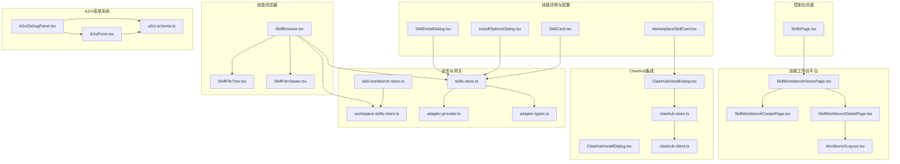

**图表来源**
- [SkillsPage.tsx](file://src/pages/SkillsPage.tsx)
- [SkillWorkbenchHomePage.tsx](file://src/components/pages/SkillWorkbenchHomePage.tsx)
- [SkillWorkbenchCreatePage.tsx](file://src/components/pages/SkillWorkbenchCreatePage.tsx)
- [SkillWorkbenchDetailPage.tsx](file://src/components/pages/SkillWorkbenchDetailPage.tsx)
- [WorkbenchLayout.tsx](file://src/components/pages/SkillWorkbenchLayout.tsx)
- [SkillBrowser.tsx](file://src/components/console/skills/SkillBrowser.tsx)
- [SkillDetailDialog.tsx](file://src/components/console/skills/SkillDetailDialog.tsx)
- [InstallOptionsDialog.tsx](file://src/components/console/skills/InstallOptionsDialog.tsx)
- [SkillCard.tsx](file://src/components/console/skills/SkillCard.tsx)
- [MarketplaceSkillCard.tsx](file://src/components/console/skills/MarketplaceSkillCard.tsx)
- [ClawHubDetailDialog.tsx](file://src/components/console/skills/ClawHubDetailDialog.tsx)
- [ClawHubInstallDialog.tsx](file://src/components/console/skills/ClawHubInstallDialog.tsx)
- [A2uiDebugPanel.tsx](file://src/components/console/skills/A2uiDebugPanel.tsx)
- [A2uiForm.tsx](file://src/components/chat/A2uiForm.tsx)
- [a2ui-schema.ts](file://src/lib/a2ui-schema.ts)
- [skills-store.ts](file://src/store/console-stores/skills-store.ts)
- [skill-workbench-store.ts](file://src/store/console-stores/skill-workbench-store.ts)
- [clawhub-store.ts](file://src/store/console-stores/clawhub-store.ts)
- [workspace-skills-client.ts](file://src/gateway/workspace-skills-client.ts)
- [clawhub-client.ts](file://src/gateway/clawhub-client.ts)
- [adapter-provider.ts](file://src/gateway/adapter-provider.ts)
- [adapter-types.ts](file://src/gateway/adapter-types.ts)

## 核心组件
- **技能浏览器**：提供工作区技能列表、搜索过滤、文件树与内容查看、编辑入口与流程图生成功能。
- **技能详情对话框**：展示技能信息、版本、作者、依赖检查、配置项（API Key、环境变量）与启用/禁用切换。
- **安装选项对话框**：在多安装源或变体场景下选择具体安装ID。
- **技能卡片**：统一展示技能状态、来源、版本、缺失依赖提示与操作按钮。
- **ClawHub详情与安装**：展示ClawHub技能详情、下载量/星数、版本变更日志、一键安装命令与确认流程。
- **技能工作台平台**：**新增**三层嵌套路由结构，支持技能创建、编辑和详情浏览，集成聊天驱动的开发体验。
- **A2UI表单调试面板**：**新增**专门的A2UI表单调试界面，支持ui.json的生成、预览、重新加载和表单提交。
- **A2UI表单组件**：**新增**完整的A2UI表单渲染和验证系统，支持8种字段类型和文件上传。
- **A2UI Schema解析器**：**新增**标准化的A2UI Schema解析、验证和序列化工具。
- **Markdown流程图渲染系统**：**新增**纯Markdown多图预览，支持多个Mermaid代码块的独立渲染。
- **工作区技能API客户端**：**新增**提供文件列表、内容获取、保存、提交等完整的文件操作接口。
- **Mermaid渲染器**：**新增**序列化的渲染队列，确保多个流程图的正确渲染和DOM状态管理。
- **状态存储**：技能状态、安装进度、筛选条件；ClawHub搜索/探索/详情缓存与离线模式；**新增**工作台模式、流程图状态管理和**A2UI表单状态管理**。

**章节来源**
- [SkillBrowser.tsx](file://src/components/console/skills/SkillBrowser.tsx)
- [SkillDetailDialog.tsx](file://src/components/console/skills/SkillDetailDialog.tsx)
- [InstallOptionsDialog.tsx](file://src/components/console/skills/InstallOptionsDialog.tsx)
- [SkillCard.tsx](file://src/components/console/skills/SkillCard.tsx)
- [MarketplaceSkillCard.tsx](file://src/components/console/skills/MarketplaceSkillCard.tsx)
- [ClawHubDetailDialog.tsx](file://src/components/console/skills/ClawHubDetailDialog.tsx)
- [ClawHubInstallDialog.tsx](file://src/components/console/skills/ClawHubInstallDialog.tsx)
- [FlowchartPanel.tsx](file://src/components/console/skills/FlowchartPanel.tsx)
- [MermaidEditor.tsx](file://src/components/console/skills/MermaidEditor.tsx)
- [MermaidPreview.tsx](file://src/components/shared/MermaidPreview.tsx)
- [A2uiDebugPanel.tsx](file://src/components/console/skills/A2uiDebugPanel.tsx)
- [A2uiForm.tsx](file://src/components/chat/A2uiForm.tsx)
- [a2ui-schema.ts](file://src/lib/a2ui-schema.ts)
- [useMermaidRenderer.ts](file://src/hooks/useMermaidRenderer.ts)
- [workspace-skills-client.ts](file://src/gateway/workspace-skills-client.ts)
- [skill-workbench-store.ts](file://src/store/console-stores/skill-workbench-store.ts)
- [skills-store.ts](file://src/store/console-stores/skills-store.ts)
- [clawhub-store.ts](file://src/store/console-stores/clawhub-store.ts)

## 架构总览
Skills功能以"页面容器 + 组件层 + 状态层 + 网关层"分层设计，组件负责UI与交互，状态层协调技能与ClawHub数据，网关层对接适配器与远程服务。**更新后的架构增加了技能工作台平台的三层路由结构和A2UI表单调试系统**：

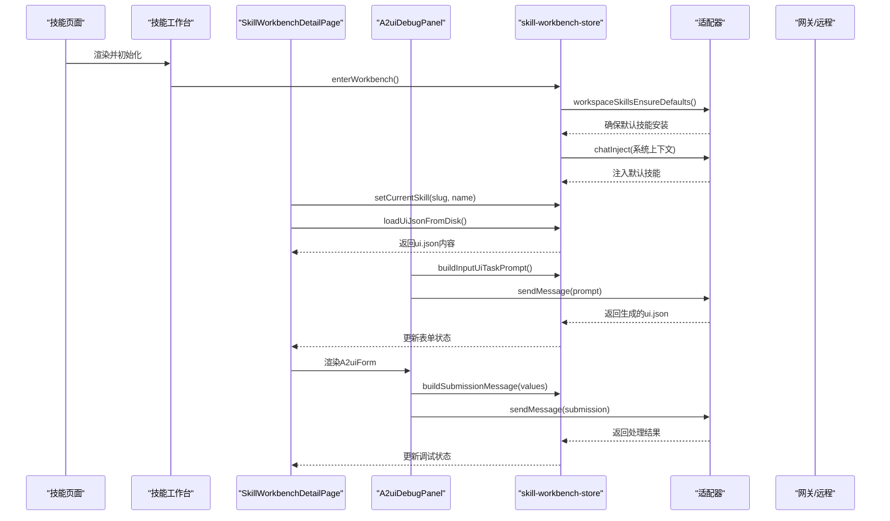

**图表来源**
- [skill-workbench-store.ts](file://src/store/console-stores/skill-workbench-store.ts)
- [SkillWorkbenchDetailPage.tsx](file://src/components/pages/SkillWorkbenchDetailPage.tsx)
- [A2uiDebugPanel.tsx](file://src/components/console/skills/A2uiDebugPanel.tsx)
- [adapter-provider.ts](file://src/gateway/adapter-provider.ts)
- [adapter-types.ts](file://src/gateway/adapter-types.ts)

## 详细组件分析

### 技能浏览器（SkillBrowser）
职责与特性
- 列表与搜索：按名称/描述/slug过滤工作区技能，区分内置与市场来源。
- 文件浏览：加载技能目录与文件内容，识别并渲染流程图（FLOWCHART.md）。
- 编辑与生成：进入工作台编辑模式，触发自动消息生成流程图。
- 状态管理：与技能工作台状态联动，设置当前技能、Mermaid源码与待发送消息。

关键流程（选择技能）
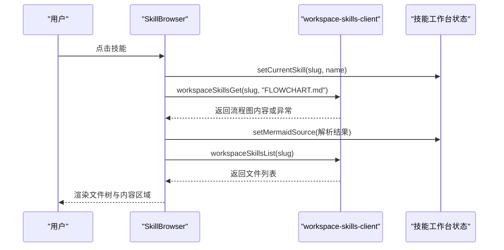

**图表来源**
- [SkillBrowser.tsx](file://src/components/console/skills/SkillBrowser.tsx)
- [workspace-skills-client.ts](file://src/gateway/workspace-skills-client.ts)

**章节来源**
- [SkillBrowser.tsx](file://src/components/console/skills/SkillBrowser.tsx)

### 技能详情对话框（SkillDetailDialog）
职责与特性
- 信息页：展示技能基本信息、来源、版本、作者、主页链接、依赖需求与缺失项。
- 配置页：支持API Key输入与显示切换、动态增删改环境变量、配置检查项可视化。
- 启用/禁用：通过适配器更新技能开关，触发运行时配置应用通知。

关键流程（保存配置）
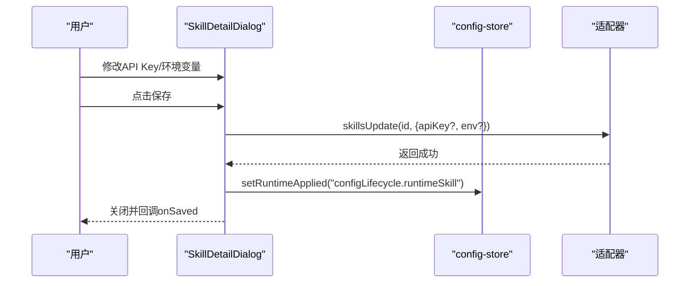

**图表来源**
- [SkillDetailDialog.tsx](file://src/components/console/skills/SkillDetailDialog.tsx)
- [adapter-provider.ts](file://src/gateway/adapter-provider.ts)

**章节来源**
- [SkillDetailDialog.tsx](file://src/components/console/skills/SkillDetailDialog.tsx)

### 安装选项对话框（InstallOptionsDialog）
职责与特性
- 在存在多种安装源或变体时，提供可选安装ID供用户选择。
- 与技能商店协作，传递所选安装ID给安装流程。

**章节来源**
- [InstallOptionsDialog.tsx](file://src/components/console/skills/InstallOptionsDialog.tsx)

### 技能卡片（SkillCard）与市场卡片（MarketplaceSkillCard）
职责与特性
- 统一展示技能状态、来源（内置/市场）、版本、图标与描述。
- 缺失依赖提示与操作按钮（配置、安装、启用/禁用）。
- 市场卡片额外提供"已安装/安装中"状态与"查看详情/安装"按钮。

**章节来源**
- [SkillCard.tsx](file://src/components/console/skills/SkillCard.tsx)
- [MarketplaceSkillCard.tsx](file://src/components/console/skills/MarketplaceSkillCard.tsx)

### ClawHub详情与安装（ClawHubDetailDialog、ClawHubInstallDialog）
职责与特性
- 详情页：展示技能摘要、作者头像/昵称、下载量/星数、最新版本与变更日志。
- 安装页：展示安全提示、安装命令、复制按钮、确认完成安装。
- 与ClawHub状态存储联动，支持离线模式与错误处理。

关键流程（ClawHub安装）
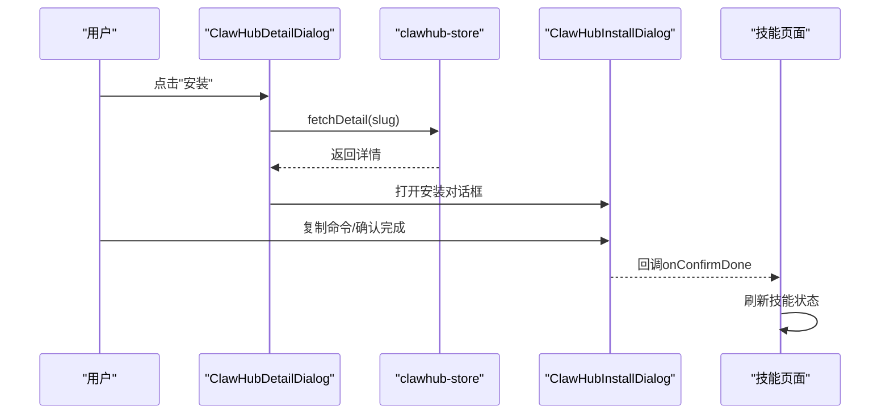

**图表来源**
- [ClawHubDetailDialog.tsx](file://src/components/console/skills/ClawHubDetailDialog.tsx)
- [ClawHubInstallDialog.tsx](file://src/components/console/skills/ClawHubInstallDialog.tsx)
- [clawhub-store.ts](file://src/store/console-stores/clawhub-store.ts)

**章节来源**
- [ClawHubDetailDialog.tsx](file://src/components/console/skills/ClawHubDetailDialog.tsx)
- [ClawHubInstallDialog.tsx](file://src/components/console/skills/ClawHubInstallDialog.tsx)
- [clawhub-store.ts](file://src/store/console-stores/clawhub-store.ts)

### 技能状态与安装流程（skills-store）
职责与特性
- 技能状态：加载、排序、过滤、启用/禁用切换、安装进度跟踪。
- 安装流程：发起安装请求、汇总stdout/stderr/warnings、更新技能列表、提示成功/失败。
- 运行时配置：安装/配置变更后通知运行时应用。

关键流程（安装）
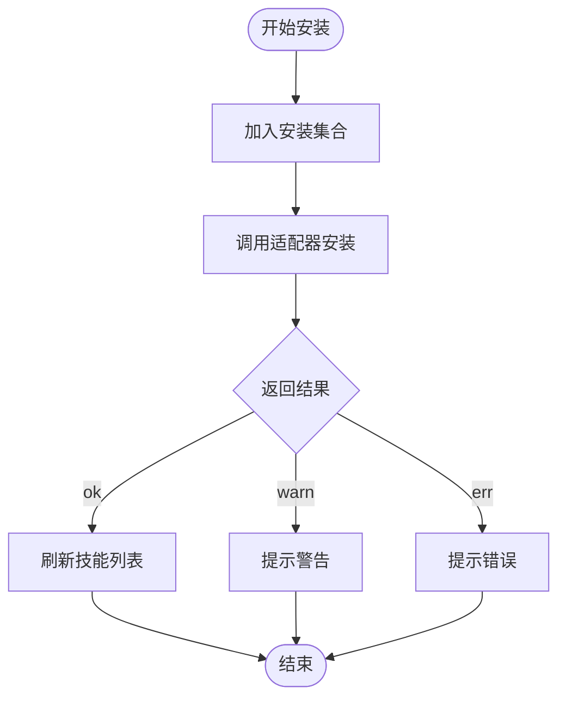

**图表来源**
- [skills-store.ts](file://src/store/console-stores/skills-store.ts)
- [adapter-provider.ts](file://src/gateway/adapter-provider.ts)

**章节来源**
- [skills-store.ts](file://src/store/console-stores/skills-store.ts)

### ClawHub状态与搜索（clawhub-store）
职责与特性
- 搜索：防抖延迟查询，支持错误与离线模式标记。
- 探索：分页加载，维护游标。
- 详情：按slug拉取技能详情，清理时清空缓存。

**章节来源**
- [clawhub-store.ts](file://src/store/console-stores/clawhub-store.ts)

### 技能工作台平台（SkillWorkbench）
**新增**技能工作台平台采用三层嵌套路由结构，提供完整的技能开发体验：

#### 三层路由结构
- **列表首页** (`/skill-workbench`)：展示本地已安装的Skills，提供创建入口和搜索
- **创建向导** (`/skill-workbench/create`)：与AI对话，基于需求描述生成全新的Skill骨架与SKILL.md
- **详情页** (`/skill-workbench/:slug`)：浏览/编辑某个Skill的全部文件，默认展示FLOWCHART.md预览

#### 工作台模式
- **创建模式** (`create`)：创建全新技能，注入默认创建技能作为系统上下文
- **浏览模式** (`browse`)：查看现有技能文件，不激活聊天会话
- **编辑模式** (`edit`)：通过聊天侧边栏修改技能，注入默认守卫技能作为系统上下文

关键流程（进入工作台）
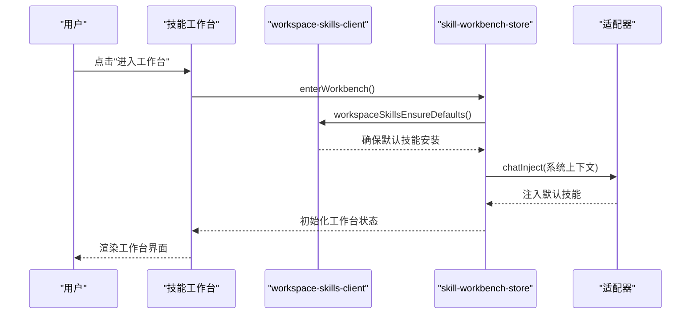

**图表来源**
- [skill-workbench-store.ts](file://src/store/console-stores/skill-workbench-store.ts)
- [workspace-skills-client.ts](file://src/gateway/workspace-skills-client.ts)

**章节来源**
- [skill-workbench-store.ts](file://src/store/console-stores/skill-workbench-store.ts)
- [SkillWorkbenchHomePage.tsx](file://src/components/pages/SkillWorkbenchHomePage.tsx)
- [SkillWorkbenchCreatePage.tsx](file://src/components/pages/SkillWorkbenchCreatePage.tsx)
- [SkillWorkbenchDetailPage.tsx](file://src/components/pages/SkillWorkbenchDetailPage.tsx)

### A2UI表单调试系统（A2uiDebugPanel, A2uiForm, a2ui-schema）
**新增**完整的A2UI表单管理增强系统，提供技能开发中的表单调试能力：

#### A2UI表单调试面板
- **实时预览**：将ui.json内容解析为可交互的A2uiForm，支持表单验证和文件上传
- **一键生成**：通过AI自动生成或重新生成ui.json，基于SKILL.md内容
- **状态管理**：跟踪生成状态、加载状态和表单提交状态
- **集成调试**：与工作台聊天侧边栏集成，支持表单提交到AI对话

#### A2UI表单组件
- **8种字段类型**：text、textarea、number、select、radio、checkbox、multiselect、file
- **文件上传**：支持单文件和多文件上传，自动转换为dataURL格式
- **验证机制**：必填字段验证、选项值验证、文件类型验证
- **状态管理**：表单值跟踪、验证状态、提交状态

#### A2UI Schema解析器
- **标准化解析**：将ui.json解析为结构化的表单模型
- **类型安全**：严格的类型检查和默认值处理
- **序列化支持**：将表单值序列化为AI可理解的消息格式
- **文件附件提取**：从表单值中提取文件附件用于AI处理

关键流程（A2UI表单生成）
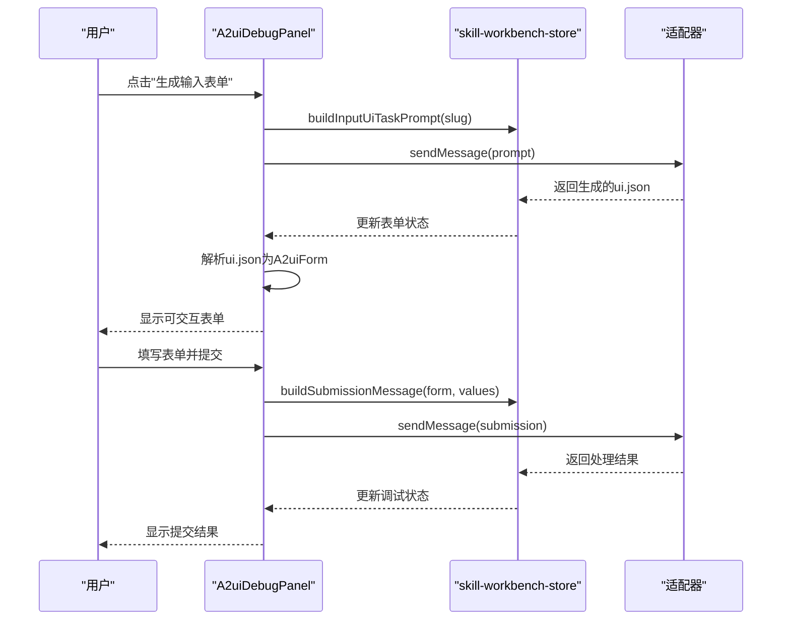

**图表来源**
- [A2uiDebugPanel.tsx](file://src/components/console/skills/A2uiDebugPanel.tsx)
- [A2uiForm.tsx](file://src/components/chat/A2uiForm.tsx)
- [a2ui-schema.ts](file://src/lib/a2ui-schema.ts)
- [skill-workbench-store.ts](file://src/store/console-stores/skill-workbench-store.ts)

**章节来源**
- [A2uiDebugPanel.tsx](file://src/components/console/skills/A2uiDebugPanel.tsx)
- [A2uiForm.tsx](file://src/components/chat/A2uiForm.tsx)
- [a2ui-schema.ts](file://src/lib/a2ui-schema.ts)

### Markdown流程图渲染系统（FlowchartPanel）
**新增**纯Markdown多图预览系统，支持多个Mermaid代码块的独立渲染：

#### 核心特性
- **整份FLOWCHART.md渲染**：不进行特殊裁剪，直接作为Markdown文档渲染
- **多图支持**：每个```mermaid
代码块独立渲染为独立SVG
- **结构化预览**：支持二级标题分隔不同阶段的子图
- **实时预览**：与MermaidEditor配合，提供实时渲染效果
关键流程流程图生成
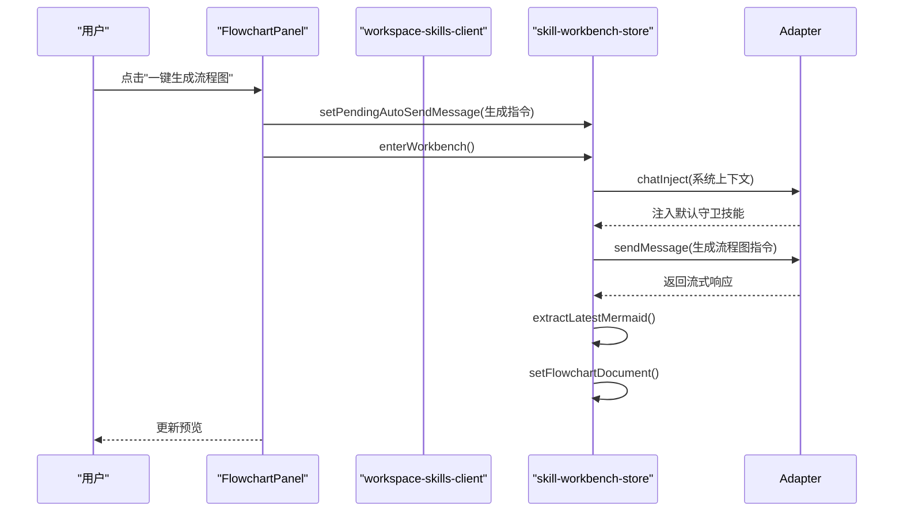

**图表来源**
- [FlowchartPanel.tsx](file://src/components/console/skills/FlowchartPanel.tsx)
- [skill-workbench-store.ts](file://src/store/console-stores/skill-workbench-store.ts)

**章节来源**
- [FlowchartPanel.tsx](file://src/components/console/skills/FlowchartPanel.tsx)

### Mermaid渲染器系统（MermaidEditor, MermaidPreview, useMermaidRenderer）
**新增**序列化的渲染队列系统，确保多个流程图的正确渲染：

#### 渲染器架构
- **序列化渲染**：通过单个Promise链确保渲染任务串行执行
- **主题适配**：根据当前主题自动初始化Mermaid配置
- **错误处理**：捕获渲染错误并提供友好的错误界面
- **DOM清理**：自动清理临时DOM元素，防止内存泄漏

关键流程（渲染队列）
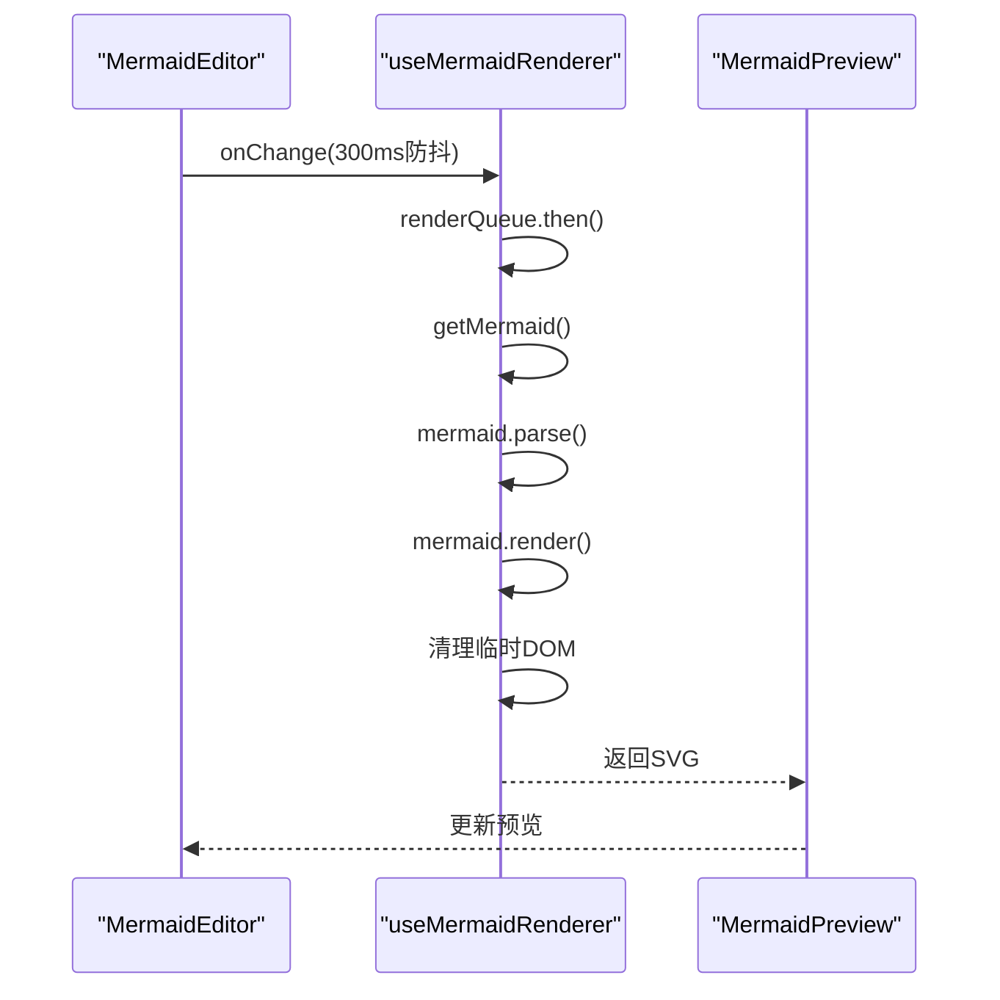

**图表来源**
- [MermaidEditor.tsx](file://src/components/console/skills/MermaidEditor.tsx)
- [MermaidPreview.tsx](file://src/components/shared/MermaidPreview.tsx)
- [useMermaidRenderer.ts](file://src/hooks/useMermaidRenderer.ts)

**章节来源**
- [MermaidEditor.tsx](file://src/components/console/skills/MermaidEditor.tsx)
- [MermaidPreview.tsx](file://src/components/shared/MermaidPreview.tsx)
- [useMermaidRenderer.ts](file://src/hooks/useMermaidRenderer.ts)

### 工作区技能API客户端（workspace-skills-client）
**新增**提供完整的文件操作接口，支持技能工作台的所有文件操作需求：

#### 核心API
- **文件列表** (`workspaceSkillsList`)：获取技能目录下的所有文件
- **文件获取** (`workspaceSkillsGet`)：读取指定文件的内容
- **文件保存** (`workspaceSkillsSave`)：保存文件内容到磁盘
- **Git提交** (`workspaceSkillsCommit`)：对文件进行Git提交
- **默认技能安装** (`workspaceSkillsEnsureDefaults`)：确保默认技能安装到工作区

关键流程（文件保存）
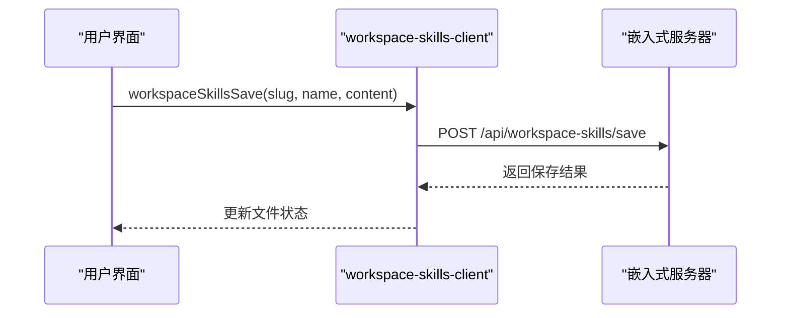

**图表来源**
- [workspace-skills-client.ts](file://src/gateway/workspace-skills-client.ts)

**章节来源**
- [workspace-skills-client.ts](file://src/gateway/workspace-skills-client.ts)

### 技能前端解析系统（skill-workbench-store）
**新增**专门的状态管理系统，处理技能工作台的各种复杂状态：

#### 核心功能
- **工作台模式管理**：create/browse/edit三种模式的切换
- **流程图状态管理**：Mermaid源码、文档内容、确认状态
- **文件系统状态**：文件树、选中文件、文件内容、加载状态
- **聊天会话管理**：保存原始会话、注入系统上下文、自动消息发送
- **A2UI表单状态管理**：ui.json内容、生成状态、表单验证状态

关键流程（模式切换）
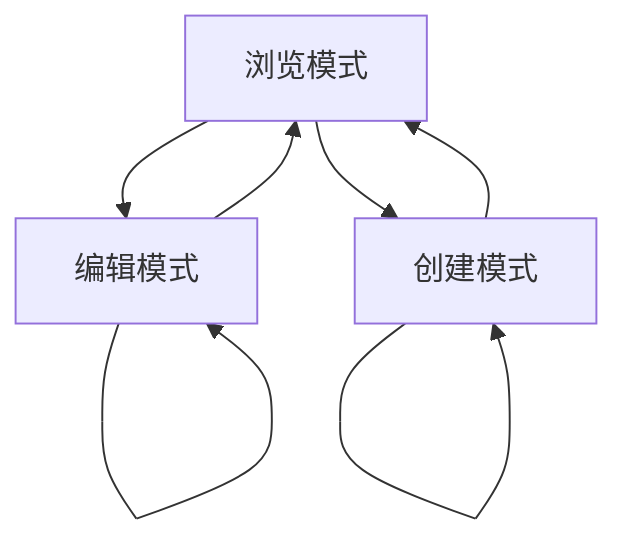

**图表来源**
- [skill-workbench-store.ts](file://src/store/console-stores/skill-workbench-store.ts)

**章节来源**
- [skill-workbench-store.ts](file://src/store/console-stores/skill-workbench-store.ts)

### A2UI表单调试面板（A2uiDebugPanel）
**新增**专门的A2UI表单调试界面，提供完整的表单生命周期管理：

#### 核心功能
- **ui.json加载**：从工作区技能目录加载ui.json文件内容
- **实时预览**：将ui.json解析为可交互的A2uiForm组件
- **一键生成**：通过AI自动生成或重新生成ui.json文件
- **重新加载**：从磁盘重新加载ui.json文件内容
- **表单提交**：将表单值构建为结构化消息并提交到AI对话

#### 交互流程
- **无ui.json时**：显示"一键生成输入表单"按钮，点击后触发AI生成
- **有ui.json时**：渲染A2uiForm进行实时预览，支持表单验证和文件上传
- **调试集成**：与WorkbenchChat集成，支持表单提交到AI对话进行调试

关键流程（A2UI表单调试）
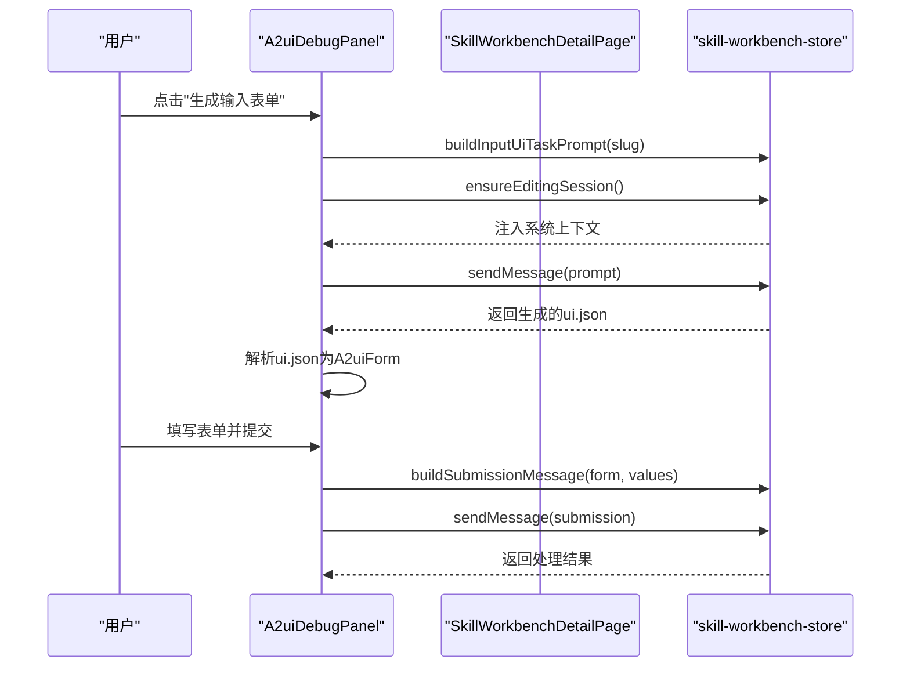

**图表来源**
- [A2uiDebugPanel.tsx](file://src/components/console/skills/A2uiDebugPanel.tsx)
- [SkillWorkbenchDetailPage.tsx](file://src/components/pages/SkillWorkbenchDetailPage.tsx)
- [skill-workbench-store.ts](file://src/store/console-stores/skill-workbench-store.ts)

**章节来源**
- [A2uiDebugPanel.tsx](file://src/components/console/skills/A2uiDebugPanel.tsx)

### A2UI表单组件（A2uiForm）
**新增**完整的A2UI表单渲染和验证系统：

#### 支持的字段类型
- **基础类型**：text、textarea、number
- **选择类型**：select、radio、multiselect
- **布尔类型**：checkbox
- **文件类型**：file（支持单文件和多文件上传）

#### 核心功能
- **表单验证**：必填字段验证、选项值验证、文件类型验证
- **文件上传**：支持拖拽上传、文件预览、文件移除
- **状态管理**：表单值跟踪、验证状态、提交状态
- **国际化支持**：完整的中英文翻译支持

#### 验证机制
- **必填验证**：检查required字段是否为空
- **选项验证**：验证选择值是否在options范围内
- **文件验证**：检查文件类型和大小限制
- **显示格式**：将表单值格式化为人类可读的字符串

**章节来源**
- [A2uiForm.tsx](file://src/components/chat/A2uiForm.tsx)

### A2UI Schema解析器（a2ui-schema）
**新增**标准化的A2UI Schema解析、验证和序列化工具：

#### Schema定义
- **版本控制**：version字段支持Schema版本管理
- **技能标识**：skill字段标识目标技能
- **表单标题**：title和description提供表单说明
- **字段定义**：fields数组定义表单字段
- **提交配置**：submit对象定义提交按钮

#### 解析功能
- **JSON解析**：解析ui.json内容为结构化表单模型
- **字段归一化**：标准化字段类型和选项
- **文件值处理**：处理文件上传的dataURL格式
- **块提取**：支持从```a2ui围栏代码块中提取JSON

#### 序列化功能
- **消息构建**：将表单值构建为结构化聊天消息
- **附件提取**：从表单值中提取文件附件
- **负载生成**：生成机器可读的JSON负载

**章节来源**
- [a2ui-schema.ts](file://src/lib/a2ui-schema.ts)

### 工作台聊天系统（WorkbenchChat）
**新增**与A2UI表单调试深度集成的聊天系统：

#### 核心功能
- **A2UI表单渲染**：支持```a2ui围栏代码块的动态表单渲染
- **表单验证**：在聊天中验证A2UI表单的正确性
- **调试集成**：与A2uiDebugPanel集成，避免重复渲染
- **附件支持**：支持文件附件的上传和传输

#### 交互特性
- **智能禁用**：在A2UI调试标签页中禁用重复的表单渲染
- **Scope提醒**：在编辑模式下自动添加技能范围提醒
- **流式渲染**：支持AI回复的流式渲染和Mermaid提取

**章节来源**
- [WorkbenchChat.tsx](file://src/components/console/skills/WorkbenchChat.tsx)

### 技能详情侧边栏（DetailFileSidebar）
**新增**支持A2UI调试标签的文件侧边栏：

#### 标签管理
- **流程图标签**：始终显示的FLOWCHART.md预览标签
- **A2UI调试标签**：新增的ui.json调试标签
- **文件树导航**：支持文件夹展开折叠的文件树

#### 交互功能
- **标签切换**：在流程图预览和A2UI调试之间切换
- **文件选择**：支持普通文件的查看和编辑
- **状态指示**：显示文件是否存在和加载状态

**章节来源**
- [DetailFileSidebar.tsx](file://src/components/console/skills/DetailFileSidebar.tsx)

## 依赖关系分析
- 组件到状态：技能浏览器、详情对话框、卡片组件均依赖skills-store；ClawHub详情依赖clawhub-store；**新增**工作台组件依赖skill-workbench-store；**新增**A2UI表单组件依赖a2ui-schema。
- 状态到网关：skills-store通过适配器调用skills接口；clawhub-store调用clawhub-client；**新增**skill-workbench-store调用workspace-skills-client；**新增**A2UI表单系统通过适配器与AI交互。
- 工作区技能：SkillBrowser使用workspace-skills-client读取技能文件与流程图；**新增**工作台详情页直接使用workspace-skills-client进行文件操作；**新增**A2UI表单系统通过workspace-skills-client读取和保存ui.json。
- 类型与适配器：adapter-types定义技能类型，adapter-provider提供适配器实例。
- **新增**渲染系统：MermaidEditor依赖MermaidPreview，useMermaidRenderer提供渲染服务；A2uiDebugPanel依赖A2uiForm，A2uiForm依赖a2ui-schema。
- **新增**国际化：A2UI相关文本通过i18n系统提供多语言支持。

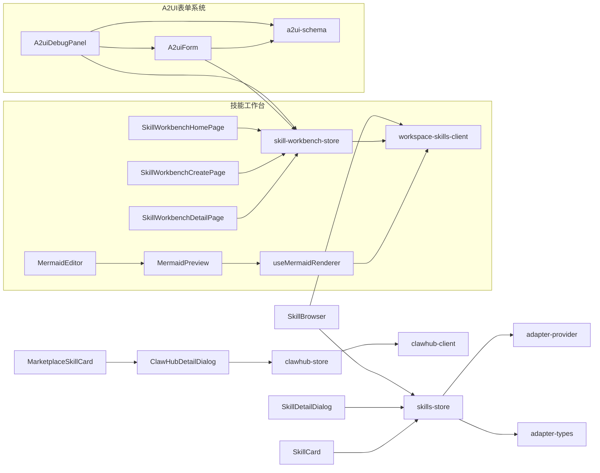

**图表来源**
- [SkillBrowser.tsx](file://src/components/console/skills/SkillBrowser.tsx)
- [SkillDetailDialog.tsx](file://src/components/console/skills/SkillDetailDialog.tsx)
- [SkillCard.tsx](file://src/components/console/skills/SkillCard.tsx)
- [MarketplaceSkillCard.tsx](file://src/components/console/skills/MarketplaceSkillCard.tsx)
- [ClawHubDetailDialog.tsx](file://src/components/console/skills/ClawHubDetailDialog.tsx)
- [skills-store.ts](file://src/store/console-stores/skills-store.ts)
- [clawhub-store.ts](file://src/store/console-stores/clawhub-store.ts)
- [workspace-skills-client.ts](file://src/gateway/workspace-skills-client.ts)
- [clawhub-client.ts](file://src/gateway/clawhub-client.ts)
- [adapter-provider.ts](file://src/gateway/adapter-provider.ts)
- [adapter-types.ts](file://src/gateway/adapter-types.ts)
- [skill-workbench-store.ts](file://src/store/console-stores/skill-workbench-store.ts)
- [MermaidEditor.tsx](file://src/components/console/skills/MermaidEditor.tsx)
- [MermaidPreview.tsx](file://src/components/shared/MermaidPreview.tsx)
- [useMermaidRenderer.ts](file://src/hooks/useMermaidRenderer.ts)
- [A2uiDebugPanel.tsx](file://src/components/console/skills/A2uiDebugPanel.tsx)
- [A2uiForm.tsx](file://src/components/chat/A2uiForm.tsx)
- [a2ui-schema.ts](file://src/lib/a2ui-schema.ts)

**章节来源**
- [skills-store.ts](file://src/store/console-stores/skills-store.ts)
- [clawhub-store.ts](file://src/store/console-stores/clawhub-store.ts)
- [adapter-provider.ts](file://src/gateway/adapter-provider.ts)
- [adapter-types.ts](file://src/gateway/adapter-types.ts)
- [workspace-skills-client.ts](file://src/gateway/workspace-skills-client.ts)
- [clawhub-client.ts](file://src/gateway/clawhub-client.ts)
- [skill-workbench-store.ts](file://src/store/console-stores/skill-workbench-store.ts)
- [MermaidEditor.tsx](file://src/components/console/skills/MermaidEditor.tsx)
- [MermaidPreview.tsx](file://src/components/shared/MermaidPreview.tsx)
- [useMermaidRenderer.ts](file://src/hooks/useMermaidRenderer.ts)
- [A2uiDebugPanel.tsx](file://src/components/console/skills/A2uiDebugPanel.tsx)
- [A2uiForm.tsx](file://src/components/chat/A2uiForm.tsx)
- [a2ui-schema.ts](file://src/lib/a2ui-schema.ts)

## 性能考虑
- 搜索防抖：ClawHub搜索使用300ms防抖，减少网络请求频率。
- 安装进度：安装集合去重与状态更新，避免重复安装与闪烁。
- 文件加载：仅在选择技能后加载文件列表与内容，降低首屏压力。
- 状态合并：安装成功后统一刷新技能列表，减少多次渲染。
- **新增**渲染优化：Mermaid渲染器使用序列化队列，避免并发渲染导致的DOM污染。
- **新增**防抖编辑：MermaidEditor使用300ms防抖，平衡实时预览与性能消耗。
- **新增**懒加载：Mermaid库按需加载，首次渲染时才初始化。
- **新增**表单优化：A2UI表单使用memo化组件，避免不必要的重新渲染。
- **新增**状态缓存：A2UI表单状态在组件卸载时保持，提升用户体验。
- **新增**文件上传优化：A2UI表单文件上传使用dataURL格式，避免大文件传输。

## 故障排除指南
- 安装失败：检查安装结果中的标准输出/错误输出与警告，结合toast提示定位问题。
- 离线模式：ClawHub搜索/探索在网络错误时进入离线模式，可稍后重试。
- 详情未加载：ClawHub详情加载失败会显示"未找到"，确认slug正确与网络可用。
- 配置未生效：保存配置后需等待运行时应用，可通过状态提示确认。
- **新增**流程图渲染失败：检查Mermaid语法是否正确，查看错误界面中的原始代码。
- **新增**工作台进入失败：检查默认技能是否正确安装，查看控制台中的警告信息。
- **新增**文件保存失败：确认工作区权限，检查嵌入式服务器状态。
- **新增**A2UI表单生成失败：检查AI对话是否正常，查看生成状态和错误提示。
- **新增**表单验证失败：检查必填字段是否填写，文件类型是否符合要求。
- **新增**表单提交失败：检查网络连接，确认AI对话会话是否有效。
- **新增**A2UI表单重复渲染：检查WorkbenchChat的disableA2uiForm属性设置。

**章节来源**
- [skills-store.ts](file://src/store/console-stores/skills-store.ts)
- [clawhub-store.ts](file://src/store/console-stores/clawhub-store.ts)
- [ClawHubDetailDialog.tsx](file://src/components/console/skills/ClawHubDetailDialog.tsx)
- [MermaidPreview.tsx](file://src/components/shared/MermaidPreview.tsx)
- [skill-workbench-store.ts](file://src/store/console-stores/skill-workbench-store.ts)
- [A2uiDebugPanel.tsx](file://src/components/console/skills/A2uiDebugPanel.tsx)

## 结论
Skills技能管理通过清晰的组件分层与状态管理，实现了从技能浏览、安装、配置到ClawHub生态的完整闭环。**更新后的版本**引入了技能工作台平台的重大重构，包括新的Markdown驱动的流程图渲染系统、工作区技能API客户端、技能前端解析系统，以及**新增的A2UI表单管理增强功能**。这些新功能使得技能开发从纯文本工作流升级为聊天驱动、可视预览、一键生成流程图和A2UI表单调试的现代化开发平台。

A2UI表单系统提供了完整的表单生命周期管理，包括表单生成、预览、验证、提交和调试功能。安装流程具备完善的错误与警告反馈，状态同步确保运行时一致性。扩展点包括安装选项、分类过滤与批量管理，均可基于现有状态与组件进行增量开发。

## 附录

### 实现要点与最佳实践
- 扩展安装选项：在安装前弹出InstallOptionsDialog，将用户选择的installId传入skills-install流程。
- 自定义技能分类：在skills-store中增加过滤字段（如category），在组件层暴露筛选控件并与状态联动。
- 批量管理：在技能列表上提供全选/反选与批量启用/禁用/安装，注意对核心技能的保护与不可修改状态。
- 版本控制：在详情页展示最新版本与变更日志，安装时选择对应installId；对已安装版本提供升级入口。
- 依赖关系：在详情页展示缺失依赖（二进制/环境变量），引导用户补齐后再启用。
- **新增**工作台集成：在技能详情中集成工作台入口，提供无缝的开发体验。
- **新增**流程图规范：严格遵循默认守卫技能的节点类型和颜色规范，确保流程图的一致性。
- **新增**文件操作：利用workspace-skills-client提供的完整文件操作API，实现复杂的文件管理功能。
- **新增**渲染优化：合理使用Mermaid渲染器的序列化队列，避免并发渲染问题。
- **新增**A2UI表单规范：严格遵循A2UI Schema规范，确保表单的兼容性和可维护性。
- **新增**表单验证：在前端实现完整的表单验证逻辑，提升用户体验和数据质量。
- **新增**调试集成：将A2UI表单调试面板与工作台聊天系统深度集成，提供一致的开发体验。
- **新增**国际化支持：完整的中英文翻译支持，确保多语言环境下的一致用户体验。
- **新增**错误处理：完善的错误边界和降级策略，确保系统稳定性。
- **新增**性能监控：在关键操作中添加性能指标，便于后续优化。