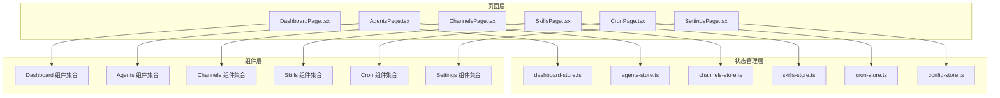
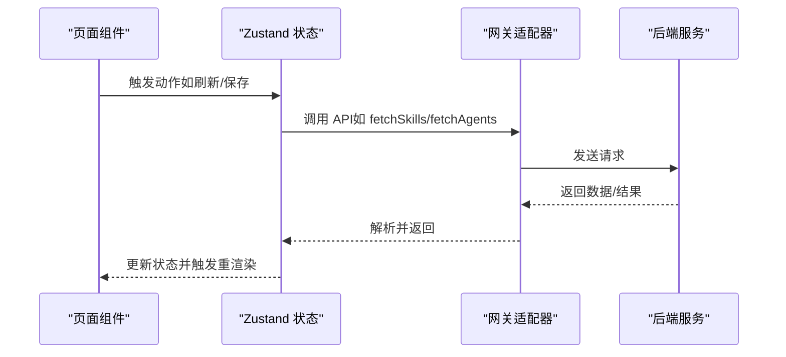
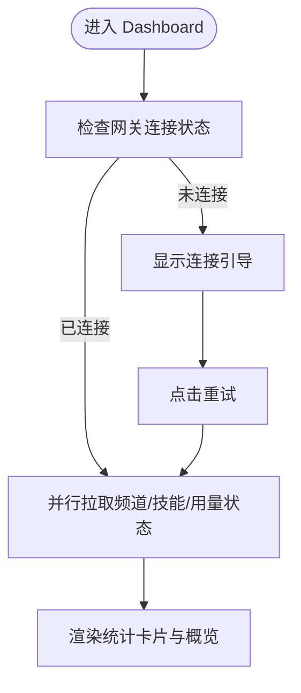
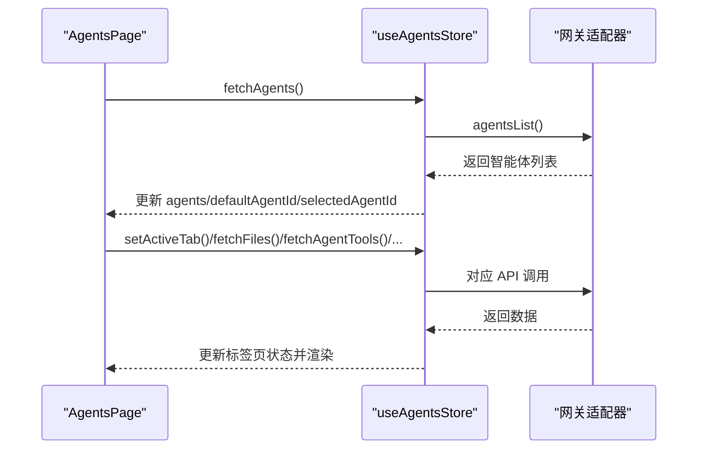
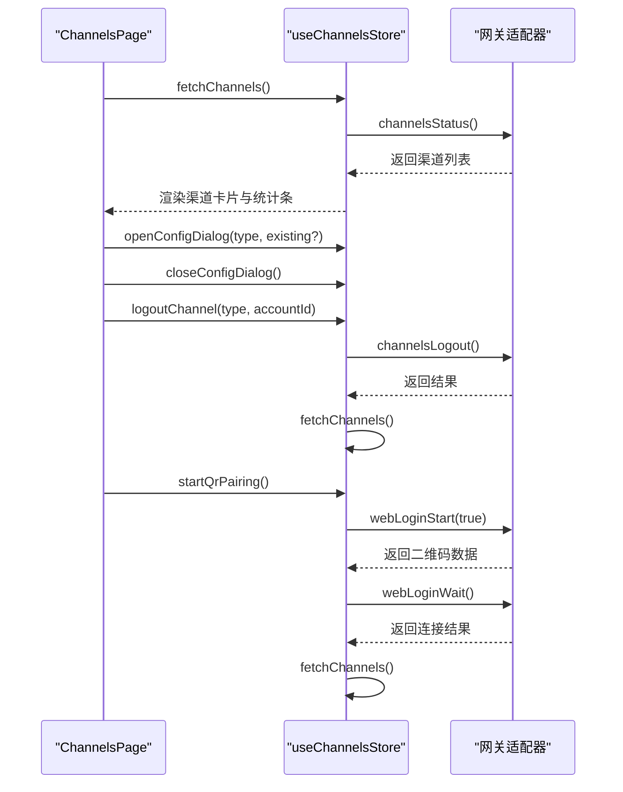
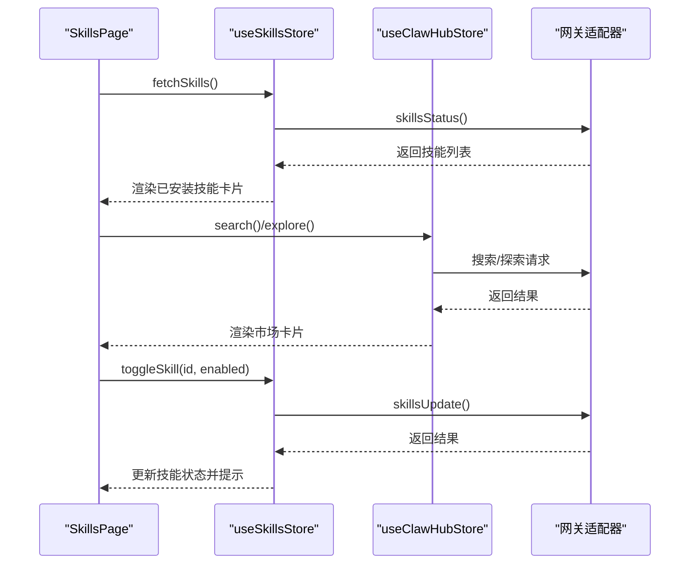
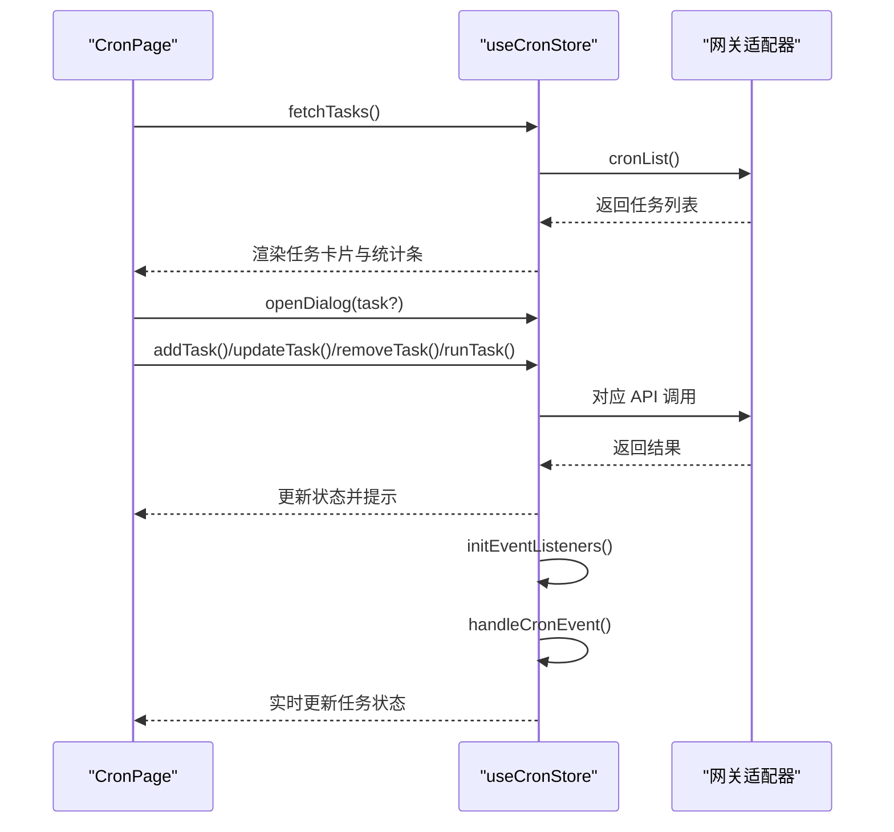
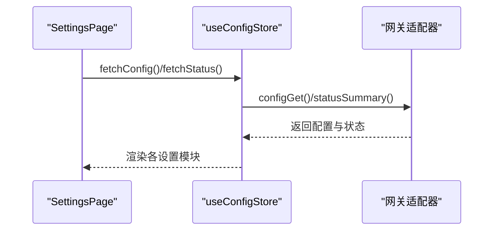
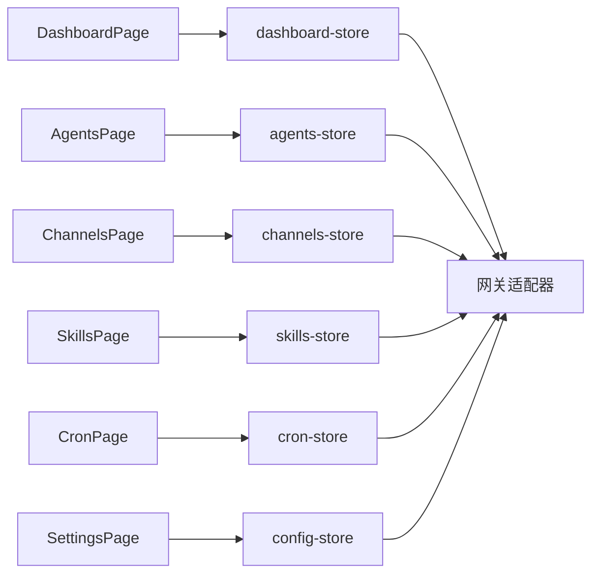

# 控制台管理界面

<cite>
**本文档引用的文件**
- [DashboardPage.tsx](file://src/components/pages/DashboardPage.tsx)
- [AgentsPage.tsx](file://src/components/pages/AgentsPage.tsx)
- [ChannelsPage.tsx](file://src/components/pages/ChannelsPage.tsx)
- [SkillsPage.tsx](file://src/components/pages/SkillsPage.tsx)
- [CronPage.tsx](file://src/components/pages/CronPage.tsx)
- [SettingsPage.tsx](file://src/components/pages/SettingsPage.tsx)
- [dashboard-store.ts](file://src/store/console-stores/dashboard-store.ts)
- [agents-store.ts](file://src/store/console-stores/agents-store.ts)
- [channels-store.ts](file://src/store/console-stores/channels-store.ts)
- [skills-store.ts](file://src/store/console-stores/skills-store.ts)
- [cron-store.ts](file://src/store/console-stores/cron-store.ts)
- [config-store.ts](file://src/store/console-stores/config-store.ts)
</cite>

## 目录
1. [简介](#简介)
2. [项目结构](#项目结构)
3. [核心组件](#核心组件)
4. [架构总览](#架构总览)
5. [详细组件分析](#详细组件分析)
6. [依赖关系分析](#依赖关系分析)
7. [性能考虑](#性能考虑)
8. [故障排除指南](#故障排除指南)
9. [结论](#结论)
10. [附录](#附录)

## 简介
本文件为 OpenClaw Office 控制台管理界面的详细功能文档，覆盖 Dashboard 概览统计、Agents 智能体管理、Channels 渠道配置、Skills 技能管理、Cron 定时任务、Settings 系统设置等核心页面。文档从系统架构、组件关系、数据流、处理逻辑、集成点、错误处理与性能特征等方面进行深入解析，并提供可扩展性建议和最佳实践。

## 项目结构
控制台管理界面采用按页面分层的组织方式，页面组件位于 `src/components/pages/`，页面级状态管理位于 `src/store/console-stores/`，页面内子组件位于 `src/components/console/` 对应目录下。页面通过 Zustand 状态库与网关适配器通信，实现数据拉取、状态更新与生命周期提示。

**图表来源**
- [DashboardPage.tsx:1-231](file://src/components/pages/DashboardPage.tsx#L1-L231)
- [AgentsPage.tsx:1-55](file://src/components/pages/AgentsPage.tsx#L1-L55)
- [ChannelsPage.tsx:1-150](file://src/components/pages/ChannelsPage.tsx#L1-L150)
- [SkillsPage.tsx:1-469](file://src/components/pages/SkillsPage.tsx#L1-L469)
- [CronPage.tsx:1-195](file://src/components/pages/CronPage.tsx#L1-L195)
- [SettingsPage.tsx:1-55](file://src/components/pages/SettingsPage.tsx#L1-L55)

**章节来源**
- [DashboardPage.tsx:1-231](file://src/components/pages/DashboardPage.tsx#L1-L231)
- [AgentsPage.tsx:1-55](file://src/components/pages/AgentsPage.tsx#L1-L55)
- [ChannelsPage.tsx:1-150](file://src/components/pages/ChannelsPage.tsx#L1-L150)
- [SkillsPage.tsx:1-469](file://src/components/pages/SkillsPage.tsx#L1-L469)
- [CronPage.tsx:1-195](file://src/components/pages/CronPage.tsx#L1-L195)
- [SettingsPage.tsx:1-55](file://src/components/pages/SettingsPage.tsx#L1-L55)

## 核心组件
- Dashboard 概览页：聚合渠道、技能、用量与运行状态，提供刷新与连接引导。
- Agents 智能体页：智能体列表与详情面板，支持创建、删除、切换标签页（概览、文件、工具、技能、渠道、定时任务）。
- Channels 渠道页：已配置渠道列表、统计条、配置对话框、登出确认与可用渠道网格。
- Skills 技能页：本地已安装技能与 ClawHub 市场，支持搜索、筛选、安装选项选择、详情查看与启用/禁用。
- Cron 定时任务页：任务列表、统计条、新增/编辑对话框、运行与删除确认。
- Settings 系统设置页：外观、提供商、网关、服务、日志、更新、高级、开发者、关于等模块化配置段落。

**章节来源**
- [DashboardPage.tsx:14-129](file://src/components/pages/DashboardPage.tsx#L14-L129)
- [AgentsPage.tsx:11-54](file://src/components/pages/AgentsPage.tsx#L11-L54)
- [ChannelsPage.tsx:15-118](file://src/components/pages/ChannelsPage.tsx#L15-L118)
- [SkillsPage.tsx:32-437](file://src/components/pages/SkillsPage.tsx#L32-L437)
- [CronPage.tsx:13-150](file://src/components/pages/CronPage.tsx#L13-L150)
- [SettingsPage.tsx:16-54](file://src/components/pages/SettingsPage.tsx#L16-L54)

## 架构总览
控制台采用“页面组件 + Zustand 状态 + 网关适配器”的三层架构：
- 页面组件负责渲染与用户交互；
- Zustand 状态管理负责数据获取、状态维护与副作用；
- 网关适配器提供统一的后端接口抽象，屏蔽底层差异。

**图表来源**
- [dashboard-store.ts:24-53](file://src/store/console-stores/dashboard-store.ts#L24-L53)
- [agents-store.ts:297-317](file://src/store/console-stores/agents-store.ts#L297-L317)
- [channels-store.ts:39-48](file://src/store/console-stores/channels-store.ts#L39-L48)
- [skills-store.ts:95-104](file://src/store/console-stores/skills-store.ts#L95-L104)
- [cron-store.ts:35-44](file://src/store/console-stores/cron-store.ts#L35-L44)

## 详细组件分析

### Dashboard 概览页
- 功能特性
  - 连接状态监控与断连引导：当网关未连接时显示警告横幅与连接指引。
  - 统计卡片：渠道连接数/总数、技能启用数/总数、用量百分比、在线时长。
  - 快速导航网格：快速进入常用功能入口。
  - 频道与技能概览：以卡片形式展示当前状态。
- 数据展示方式
  - 使用统计卡片组件展示数值与进度条。
  - 使用概览组件展示频道与技能列表摘要。
- 用户交互流程
  - 刷新按钮触发状态刷新；加载/错误状态分别渲染加载态或错误态。
  - 断连时提供连接指引与重试按钮。
- 权限控制机制
  - 通过网关适配器的统一鉴权与能力检查，页面仅展示具备权限的数据。
- 状态管理集成
  - 依赖 dashboard-store 的 refresh 方法并行拉取频道、技能、用量状态。
- API 调用逻辑
  - waitForAdapter 等待适配器就绪后并行调用 channelsStatus、skillsStatus、usageStatus。
- 扩展建议
  - 新增统计维度时，在 store 中增加字段并在页面中渲染对应卡片。

**图表来源**
- [DashboardPage.tsx:19-21](file://src/components/pages/DashboardPage.tsx#L19-L21)
- [dashboard-store.ts:24-53](file://src/store/console-stores/dashboard-store.ts#L24-L53)

**章节来源**
- [DashboardPage.tsx:14-129](file://src/components/pages/DashboardPage.tsx#L14-L129)
- [dashboard-store.ts:16-54](file://src/store/console-stores/dashboard-store.ts#L16-L54)

### Agents 智能体管理
- 功能特性
  - 智能体列表与详情面板联动：选中智能体后展示详情页。
  - 多标签页：概览、文件、工具、技能、渠道、定时任务。
  - 创建与删除对话框：支持新建与删除智能体。
- 数据展示方式
  - 列表项展示智能体基本信息；详情页根据标签页切换不同内容区域。
- 用户交互流程
  - 选择智能体 -> 自动切换到概览标签 -> 加载对应标签页数据。
- 状态管理集成
  - agents-store 提供智能体列表、默认智能体、选中智能体、活跃标签页、文件内容、工具/技能/渠道/定时任务等状态与方法。
- API 调用逻辑
  - 并行获取系统模型与智能体列表；按标签页异步加载工具、技能、渠道、定时任务等数据。
- 扩展建议
  - 新增标签页时在 store 中定义新状态字段与对应 fetch/save 方法。

**图表来源**
- [AgentsPage.tsx:11-54](file://src/components/pages/AgentsPage.tsx#L11-L54)
- [agents-store.ts:297-317](file://src/store/console-stores/agents-store.ts#L297-L317)
- [agents-store.ts:471-516](file://src/store/console-stores/agents-store.ts#L471-L516)
- [agents-store.ts:520-565](file://src/store/console-stores/agents-store.ts#L520-L565)
- [agents-store.ts:569-578](file://src/store/console-stores/agents-store.ts#L569-L578)
- [agents-store.ts:582-632](file://src/store/console-stores/agents-store.ts#L582-L632)

**章节来源**
- [AgentsPage.tsx:11-54](file://src/components/pages/AgentsPage.tsx#L11-L54)
- [agents-store.ts:141-641](file://src/store/console-stores/agents-store.ts#L141-L641)

### Channels 渠道配置
- 功能特性
  - 已配置渠道列表与状态卡片：显示连接状态、账号信息、操作按钮。
  - 渠道统计条：汇总连接状态分布。
  - 可用渠道网格：展示可添加的渠道类型与引导配置。
  - 登出确认：对特定渠道账号执行登出操作。
  - QR 扫码配对：支持通过二维码进行 Web 登录配对。
- 数据展示方式
  - 卡片式布局展示单个渠道；网格布局展示可用渠道类型。
- 用户交互流程
  - 点击“配置”打开配置对话框；填写参数后保存；点击“登出”弹出确认对话框。
- 状态管理集成
  - channels-store 管理渠道列表、加载状态、错误、配置对话框状态与 QR 状态机。
- API 调用逻辑
  - 获取渠道状态、登出渠道、启动/等待 Web 登录配对。
- 扩展建议
  - 新增渠道类型时在 store 中扩展 QR 状态机与对话框逻辑。

**图表来源**
- [ChannelsPage.tsx:15-118](file://src/components/pages/ChannelsPage.tsx#L15-L118)
- [channels-store.ts:39-103](file://src/store/console-stores/channels-store.ts#L39-L103)

**章节来源**
- [ChannelsPage.tsx:15-118](file://src/components/pages/ChannelsPage.tsx#L15-L118)
- [channels-store.ts:27-103](file://src/store/console-stores/channels-store.ts#L27-L103)

### Skills 技能管理
- 功能特性
  - 已安装技能：支持搜索、按来源过滤（全部/内置/市场）、启用/禁用、配置详情、安装。
  - 市场（ClawHub）：离线模式与在线模式切换，搜索、浏览最新、分页加载、安装。
  - 安全提示与离线横幅：提醒用户安全风险与离线状态。
- 数据展示方式
  - 已安装技能使用卡片展示；市场使用 ClawHub 卡片与网格布局。
- 用户交互流程
  - 在“已安装”页搜索与筛选；在“市场”页搜索或浏览；选择安装选项后执行安装。
- 状态管理集成
  - skills-store 管理技能列表、活动标签、来源过滤、详情对话框、安装中集合；clawhub-store 提供搜索与探索状态。
- API 调用逻辑
  - 获取技能状态、切换启用状态、安装技能、ClawHub 搜索与探索。
- 扩展建议
  - 新增技能来源时在 store 中扩展过滤逻辑与 UI 展示。

**图表来源**
- [SkillsPage.tsx:32-437](file://src/components/pages/SkillsPage.tsx#L32-L437)
- [skills-store.ts:95-132](file://src/store/console-stores/skills-store.ts#L95-L132)
- [skills-store.ts:134-166](file://src/store/console-stores/skills-store.ts#L134-L166)

**章节来源**
- [SkillsPage.tsx:32-437](file://src/components/pages/SkillsPage.tsx#L32-L437)
- [skills-store.ts:84-167](file://src/store/console-stores/skills-store.ts#L84-L167)

### Cron 定时任务
- 功能特性
  - 任务列表：按下次运行时间排序，支持启用/禁用、运行、编辑、删除。
  - 统计条：展示任务状态概览。
  - 对话框：新增/编辑任务表单。
  - 事件监听：实时更新任务状态。
- 数据展示方式
  - 列表卡片展示任务信息；统计条展示任务分布。
- 用户交互流程
  - 点击“创建”打开对话框；保存后刷新列表；运行/删除前弹出确认。
- 状态管理集成
  - cron-store 管理任务列表、加载状态、错误、对话框状态与事件处理器。
- API 调用逻辑
  - 获取任务列表、新增/更新/删除任务、手动运行任务；初始化事件监听。
- 扩展建议
  - 新增任务类型时在 store 中扩展输入校验与事件处理。

**图表来源**
- [CronPage.tsx:13-150](file://src/components/pages/CronPage.tsx#L13-L150)
- [cron-store.ts:35-124](file://src/store/console-stores/cron-store.ts#L35-L124)

**章节来源**
- [CronPage.tsx:13-150](file://src/components/pages/CronPage.tsx#L13-L150)
- [cron-store.ts:27-124](file://src/store/console-stores/cron-store.ts#L27-L124)

### Settings 系统设置
- 功能特性
  - 外观、提供商、网关、服务、日志、更新、高级、开发者、关于等模块化配置段落。
  - 开发者模式解锁后显示开发者专用段落。
- 数据展示方式
  - 各模块独立组件渲染，统一在 SettingsPage 下组合。
- 用户交互流程
  - 页面加载时拉取配置与状态；各模块内部自行处理保存与应用。
- 状态管理集成
  - SettingsPage 依赖 config-store 获取配置与状态；部分模块内部维护自身状态。
- API 调用逻辑
  - 通过 config-store 的 fetchConfig/fetchStatus 等方法获取基础信息。
- 扩展建议
  - 新增设置项时在对应模块中添加组件与保存逻辑。

**图表来源**
- [SettingsPage.tsx:16-54](file://src/components/pages/SettingsPage.tsx#L16-L54)
- [config-store.ts:217-381](file://src/store/console-stores/config-store.ts#L217-L381)

**章节来源**
- [SettingsPage.tsx:16-54](file://src/components/pages/SettingsPage.tsx#L16-L54)
- [config-store.ts:93-400](file://src/store/console-stores/config-store.ts#L93-L400)

## 依赖关系分析
- 页面到状态：每个页面通过对应的 store 访问状态与动作函数。
- 状态到适配器：store 内部通过 waitForAdapter 与 getAdapter 获取适配器实例，统一发起 API 请求。
- 状态到页面：store 更新后触发 React 重渲染，页面响应 UI 变化。
- 生命周期提示：config-store 提供生命周期状态（保存、重启、运行时生效等），用于向用户反馈配置变更的影响。

**图表来源**
- [dashboard-store.ts:27-32](file://src/store/console-stores/dashboard-store.ts#L27-L32)
- [agents-store.ts:300-301](file://src/store/console-stores/agents-store.ts#L300-L301)
- [channels-store.ts:42-43](file://src/store/console-stores/channels-store.ts#L42-L43)
- [skills-store.ts:98-99](file://src/store/console-stores/skills-store.ts#L98-L99)
- [cron-store.ts:38-39](file://src/store/console-stores/cron-store.ts#L38-L39)
- [config-store.ts:220-221](file://src/store/console-stores/config-store.ts#L220-L221)

**章节来源**
- [dashboard-store.ts:16-54](file://src/store/console-stores/dashboard-store.ts#L16-L54)
- [agents-store.ts:141-641](file://src/store/console-stores/agents-store.ts#L141-L641)
- [channels-store.ts:27-103](file://src/store/console-stores/channels-store.ts#L27-L103)
- [skills-store.ts:84-167](file://src/store/console-stores/skills-store.ts#L84-L167)
- [cron-store.ts:27-124](file://src/store/console-stores/cron-store.ts#L27-L124)
- [config-store.ts:93-400](file://src/store/console-stores/config-store.ts#L93-L400)

## 性能考虑
- 并行数据拉取：Dashboard 使用 Promise.allSettled 并行获取多个状态，减少首屏等待时间。
- 懒加载与条件渲染：Skills 根据标签页与离线状态动态加载市场数据；Channels/Agents/Cron 在空状态时渲染占位组件。
- 事件驱动更新：Cron 通过事件监听实时更新任务状态，避免轮询带来的开销。
- 状态缓存：Zustand store 缓存最近一次请求结果，减少重复请求。

[本节为通用性能讨论，无需具体文件分析]

## 故障排除指南
- 连接断开
  - 现象：Dashboard 显示断连警告与连接引导。
  - 处理：点击重试按钮重新连接；检查网关服务状态。
- 加载失败
  - 现象：页面显示错误状态并提供重试按钮。
  - 处理：查看错误消息，确认网络与权限；重试后刷新。
- 安装失败
  - 现象：安装技能时出现错误提示与详细输出。
  - 处理：根据提示修复配置或网络问题；查看日志定位原因。
- 配置写入冲突
  - 现象：保存配置时提示配置已变更。
  - 处理：重新拉取配置后合并修改；避免并发修改同一配置块。

**章节来源**
- [DashboardPage.tsx:41-57](file://src/components/pages/DashboardPage.tsx#L41-L57)
- [SkillsPage.tsx:158-179](file://src/components/pages/SkillsPage.tsx#L158-L179)
- [skills-store.ts:134-166](file://src/store/console-stores/skills-store.ts#L134-L166)
- [config-store.ts:235-278](file://src/store/console-stores/config-store.ts#L235-L278)

## 结论
控制台管理界面通过清晰的页面分层与集中式状态管理，实现了对智能体、渠道、技能、定时任务与系统设置的统一管理。其并行数据拉取、事件驱动更新与生命周期提示机制提升了用户体验与可维护性。基于现有架构，可以方便地扩展新的管理页面与配置项。

[本节为总结性内容，无需具体文件分析]

## 附录

### 如何扩展新的管理页面
- 新建页面组件：在 `src/components/pages/` 下创建新页面文件，定义渲染逻辑与交互。
- 定义状态管理：在 `src/store/console-stores/` 下创建对应 store，定义状态字段与动作函数。
- 注入 API 调用：在 store 中通过 waitForAdapter 与 getAdapter 调用网关 API。
- 集成路由与侧边栏：在应用路由与侧边栏中注册新页面入口。
- 设计 UI 组件：在 `src/components/console/<new-page>/` 下创建子组件，复用共享组件（如 LoadingState、ErrorState）。

[本节为通用指导，无需具体文件分析]

### 自定义数据展示格式
- 使用现有卡片与表格组件：如 StatCard、SkillCard、CronTaskCard 等。
- 扩展过滤与排序：参考 skills-store 的过滤函数模式，为新页面添加查询与筛选逻辑。
- 实时更新：参考 cron-store 的事件监听机制，订阅相关事件并更新状态。

[本节为通用指导，无需具体文件分析]

### 实现更强大的配置管理功能
- 生命周期提示：利用 config-store 的生命周期状态，向用户明确配置变更的影响（立即生效、需要重启等）。
- 配置回滚：在 store 中记录变更历史，提供一键回滚能力。
- 权限分级：在页面与 store 中区分只读与可写权限，动态隐藏不可用操作。

[本节为通用指导，无需具体文件分析]