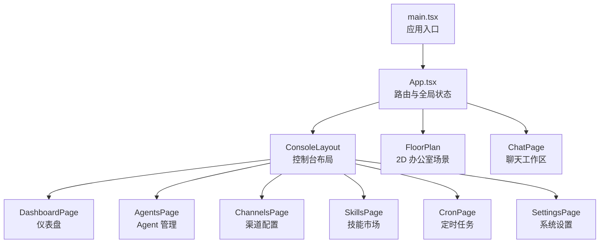
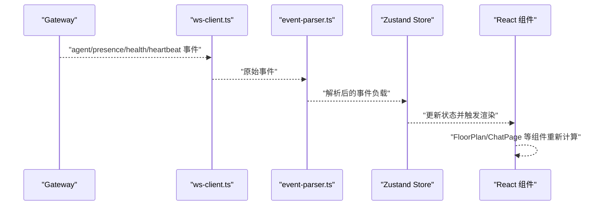
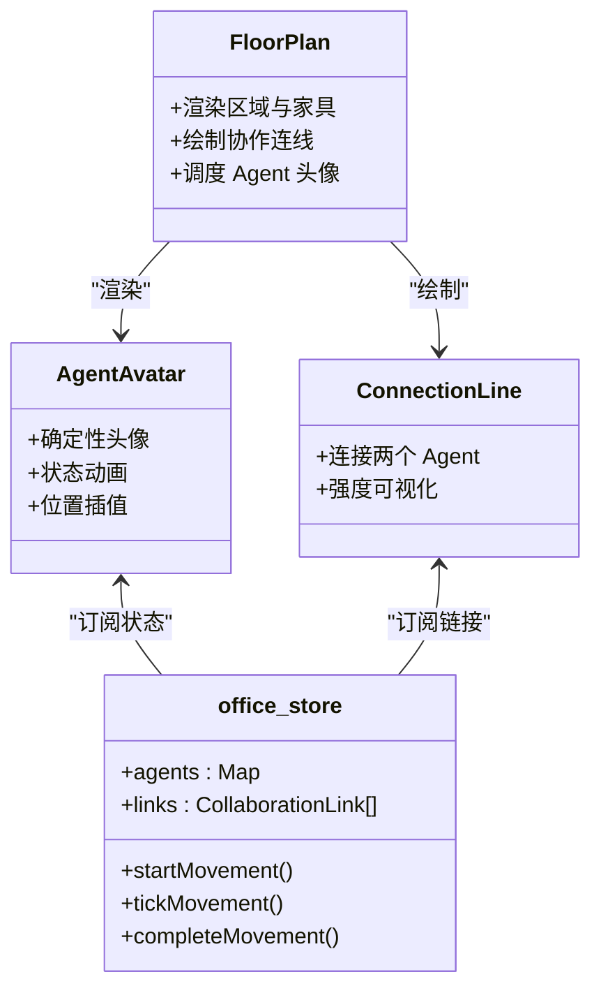
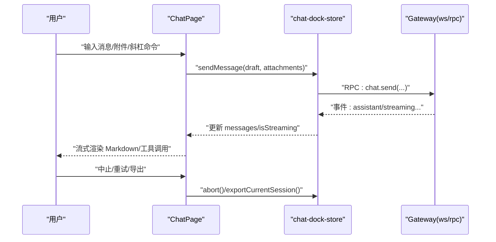
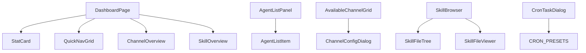
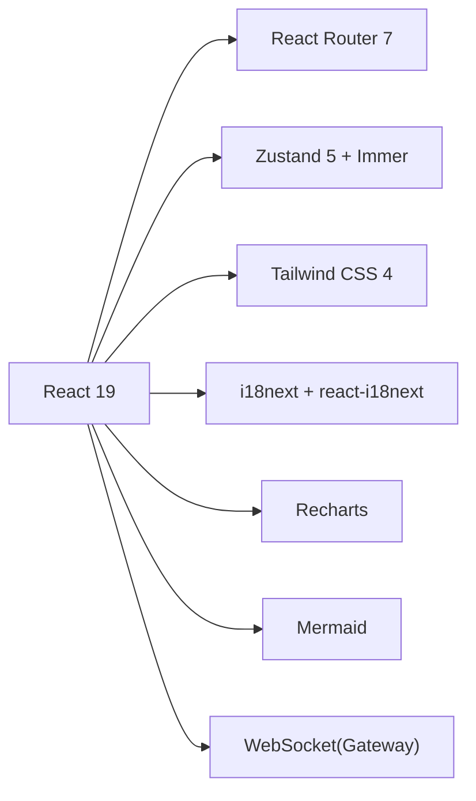

# 核心功能介绍

<cite>
**本文档引用的文件**
- [README.md](file://README.md)
- [App.tsx](file://src/App.tsx)
- [main.tsx](file://src/main.tsx)
- [package.json](file://package.json)
- [DashboardPage.tsx](file://src/components/pages/DashboardPage.tsx)
- [ChatPage.tsx](file://src/components/pages/ChatPage.tsx)
- [FloorPlan.tsx](file://src/components/office-2d/FloorPlan.tsx)
- [office-store.ts](file://src/store/office-store.ts)
- [chat-slash-commands.ts](file://src/lib/chat-slash-commands.ts)
- [StatCard.tsx](file://src/components/console/dashboard/StatCard.tsx)
- [AgentListPanel.tsx](file://src/components/console/agents/AgentListPanel.tsx)
- [AvailableChannelGrid.tsx](file://src/components/console/channels/AvailableChannelGrid.tsx)
- [SkillBrowser.tsx](file://src/components/console/skills/SkillBrowser.tsx)
- [CronTaskDialog.tsx](file://src/components/console/cron/CronTaskDialog.tsx)
</cite>

## 目录
1. [简介](#简介)
2. [项目结构](#项目结构)
3. [核心组件](#核心组件)
4. [架构总览](#架构总览)
5. [详细组件分析](#详细组件分析)
6. [依赖关系分析](#依赖关系分析)
7. [性能考量](#性能考量)
8. [故障排查指南](#故障排查指南)
9. [结论](#结论)

## 简介
OpenClaw Office 是 OpenClaw 多智能体系统的可视化监控与管理前端，通过等距投影风格的虚拟办公室场景，实时展示 Agent 的工作状态、协作链路、工具调用和资源消耗，同时提供完整的控制台管理界面与 Chat 对话工作区。其核心理念是将“Agent = 数字员工、办公室 = Agent 运行时、工位 = Session、会议室 = 协作上下文”的隐喻落地为可视化的交互体验。

## 项目结构
应用采用 React 19 + Vite 6 构建，使用 Zustand 5 + Immer 管理状态，Tailwind CSS 4 做样式，Recharts 做图表，i18next 做国际化，原生 WebSocket 连接 OpenClaw Gateway 实现实时事件推送。路由通过 React Router 7 管理页面级视图，应用入口在 main.tsx 中挂载 HashRouter 并渲染 App，App 负责路由分发与全局主题同步、页面追踪与 Gateway 连接初始化。

**图表来源**
- [main.tsx:1-15](file://src/main.tsx#L1-L15)
- [App.tsx:76-124](file://src/App.tsx#L76-L124)

**章节来源**
- [README.md:13-54](file://README.md#L13-L54)
- [package.json:35-48](file://package.json#L35-L48)

## 核心组件
- 虚拟办公室可视化监控系统：以 FloorPlan 为核心，渲染 SVG 场景、Agent 头像、协作连线、家具与区域标签；通过 office-store 管理 Agent 状态、位置与移动动画，实时反映 Gateway 事件。
- 实时聊天工作区：ChatPage 提供会话管理、流式转录、历史持久化、工具调用可视化与斜杠命令；结合 useChatStreamingText 实现流式文本渲染。
- 控制台管理界面：DashboardPage、Agents 管理、Channels 配置、Skills 管理、Cron 定时任务、Settings 设置等页面构成完整的系统管理中枢。

**章节来源**
- [README.md:15-54](file://README.md#L15-L54)
- [App.tsx:107-120](file://src/App.tsx#L107-L120)

## 架构总览
应用通过 WebSocket 与 OpenClaw Gateway 通信，事件经 ws-client.ts -> event-parser.ts -> Zustand Store -> React 组件渲染。Office Store 负责将 Agent 生命周期事件映射为可视化状态（idle/working/speaking/tool_calling/error），驱动 2D 场景渲染与动画。

**图表来源**
- [README.md:276-282](file://README.md#L276-L282)

**章节来源**
- [README.md:274-291](file://README.md#L274-L291)

## 详细组件分析

### 虚拟办公室可视化监控系统
- 2D 平面图：FloorPlan 基于 SVG 渲染，包含工位区、临时工位、会议区与丰富家具（桌椅/沙发/植物/咖啡杯），通过 Zone 区域与分区墙、门洞等元素构建空间感。
- Agent 头像：AgentAvatar 基于 agentId 确定性生成的 SVG 头像，支持实时状态动画（空闲/工作中/发言/工具调用/错误），并在行走时沿路径插值移动。
- 协作连线：ConnectionLine 连接两个 Agent 的位置，强度由链接强度决定，直观体现协作关系。
- 气泡面板：SpeechBubble 在 Agent 头像旁显示实时 Markdown 文本流与工具调用状态。
- 侧边面板：包含 Agent 详情、Token 折线图、成本饼图、活跃热力图、子 Agent 关系图、事件时间轴等。

**图表来源**
- [FloorPlan.tsx:20-278](file://src/components/office-2d/FloorPlan.tsx#L20-L278)
- [office-store.ts:504-624](file://src/store/office-store.ts#L504-L624)

**章节来源**
- [FloorPlan.tsx:20-278](file://src/components/office-2d/FloorPlan.tsx#L20-L278)
- [office-store.ts:217-800](file://src/store/office-store.ts#L217-L800)

### 实时聊天工作区
- 会话管理：支持创建新会话、切换历史会话、按 Agent 路由，多 Agent 并行对话；会话列表按最近活动排序。
- 实时流式转录：useChatStreamingText 提供流式文本与思考态渲染，支持中止/重发。
- 历史持久化：服务端按天分片缓存聊天记录，跨浏览器/设备/刷新稳定可见。
- 工具调用可视化：在对话流中嵌入工具调用状态（调用中/已完成），可折叠查看。
- 斜杠命令：支持 /help、/new、/reset、/model、/think、/export 等快捷指令，命令菜单动态过滤与补全。

**图表来源**
- [ChatPage.tsx:73-543](file://src/components/pages/ChatPage.tsx#L73-L543)
- [chat-slash-commands.ts:1-106](file://src/lib/chat-slash-commands.ts#L1-L106)

**章节来源**
- [ChatPage.tsx:73-543](file://src/components/pages/ChatPage.tsx#L73-L543)
- [chat-slash-commands.ts:26-58](file://src/lib/chat-slash-commands.ts#L26-L58)

### 控制台管理界面
- Dashboard 概览：StatCard 展示通道连接数/技能启用数/用量占比/在线时长等关键指标；QuickNavGrid 快速导航；ChannelOverview/SkillOverview 展示概览卡片。
- Agents 管理：AgentListPanel 支持搜索、刷新、创建与选择 Agent；AgentListItem 展示 Agent 详情与默认状态。
- Channels 配置：AvailableChannelGrid 展示可用渠道类型，标记已配置状态并支持新增。
- Skills 管理：SkillBrowser 支持搜索、文件树浏览、Mermaid 流程图生成与编辑。
- Cron 定时任务：CronTaskDialog 支持新建/编辑定时任务，提供常用预设与表达式校验。
- Settings 设置：Provider 管理、外观/Gateway/开发者/高级/关于/更新等模块化配置。

**图表来源**
- [DashboardPage.tsx:14-129](file://src/components/pages/DashboardPage.tsx#L14-L129)
- [StatCard.tsx:12-38](file://src/components/console/dashboard/StatCard.tsx#L12-L38)
- [AgentListPanel.tsx:6-92](file://src/components/console/agents/AgentListPanel.tsx#L6-L92)
- [AvailableChannelGrid.tsx:11-53](file://src/components/console/channels/AvailableChannelGrid.tsx#L11-L53)
- [SkillBrowser.tsx:22-259](file://src/components/console/skills/SkillBrowser.tsx#L22-L259)
- [CronTaskDialog.tsx:37-228](file://src/components/console/cron/CronTaskDialog.tsx#L37-L228)

**章节来源**
- [DashboardPage.tsx:14-129](file://src/components/pages/DashboardPage.tsx#L14-L129)
- [AgentListPanel.tsx:6-92](file://src/components/console/agents/AgentListPanel.tsx#L6-L92)
- [AvailableChannelGrid.tsx:11-53](file://src/components/console/channels/AvailableChannelGrid.tsx#L11-L53)
- [SkillBrowser.tsx:22-259](file://src/components/console/skills/SkillBrowser.tsx#L22-L259)
- [CronTaskDialog.tsx:37-228](file://src/components/console/cron/CronTaskDialog.tsx#L37-L228)

## 依赖关系分析
- 构建与运行：Vite 6、React 19、React Router 7、Zustand 5 + Immer、Tailwind CSS 4、i18next。
- 实时通信：原生 WebSocket（对接 OpenClaw Gateway）。
- 图表与可视化：Recharts、Mermaid。
- 国际化：react-i18next + i18next-browser-language-detector。
- 状态管理：Zustand 5（Immer middleware）。

**图表来源**
- [package.json:49-63](file://package.json#L49-L63)

**章节来源**
- [package.json:49-63](file://package.json#L49-L63)

## 性能考量
- 事件同步策略：通过 WebSocket 推送 Agent/Presence/Health/Heartbeat 事件，会话快照采用低频 reconciliation（约 60 秒）修复漏事件与断线恢复，降低 Gateway CPU 压力。
- 2D 渲染优化：SVG 渲染与路径插值移动，仅在状态变化时重绘相关节点；区域划分与家具批量渲染减少重排。
- 状态管理：Zustand + Immer 提供细粒度状态更新，避免不必要的组件重渲染。
- 图表与可视化：Recharts 按需渲染，Mermaid 流程图懒加载与缓存。

**章节来源**
- [README.md:286-291](file://README.md#L286-L291)
- [office-store.ts:504-624](file://src/store/office-store.ts#L504-L624)

## 故障排查指南
- 网关连接异常：DashboardPage 在连接断开时显示引导步骤，包含重连状态与重试按钮；可检查 Gateway Token 与地址配置。
- 会话加载失败：ChatPage 在历史加载时显示加载状态与错误提示，支持重试与错误清除。
- 控制台状态：DashboardPage 根据通道错误数量与连接状态显示告警横幅，便于快速定位问题。

**章节来源**
- [DashboardPage.tsx:131-199](file://src/components/pages/DashboardPage.tsx#L131-L199)
- [ChatPage.tsx:324-410](file://src/components/pages/ChatPage.tsx#L324-L410)

## 结论
OpenClaw Office 将多智能体系统的复杂状态转化为直观的 2D 办公室场景与交互式聊天工作区，配合完善的控制台管理界面，实现了从可视化监控到系统运维的全链路体验。通过合理的事件同步策略、状态管理与渲染优化，系统在保证实时性的同时兼顾性能与可维护性。