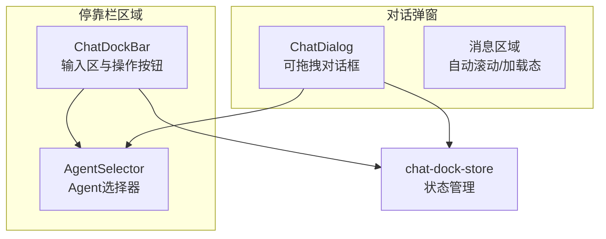
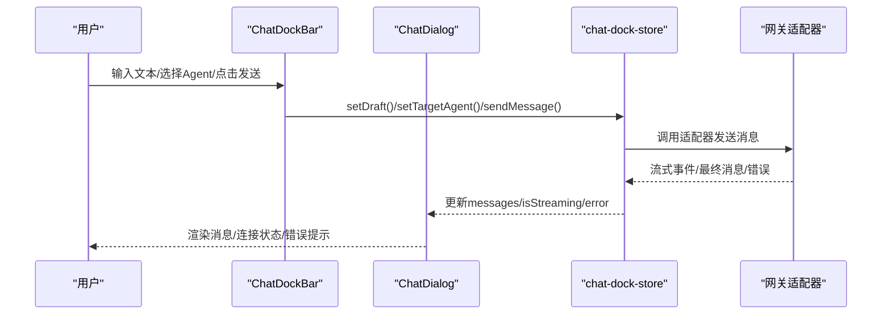
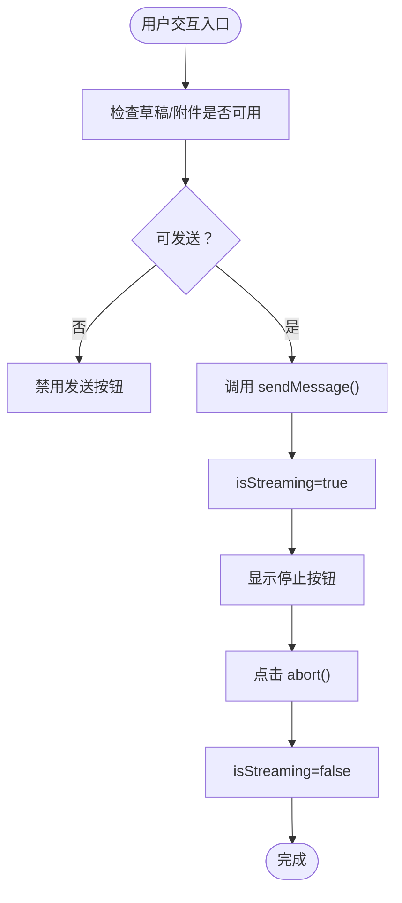
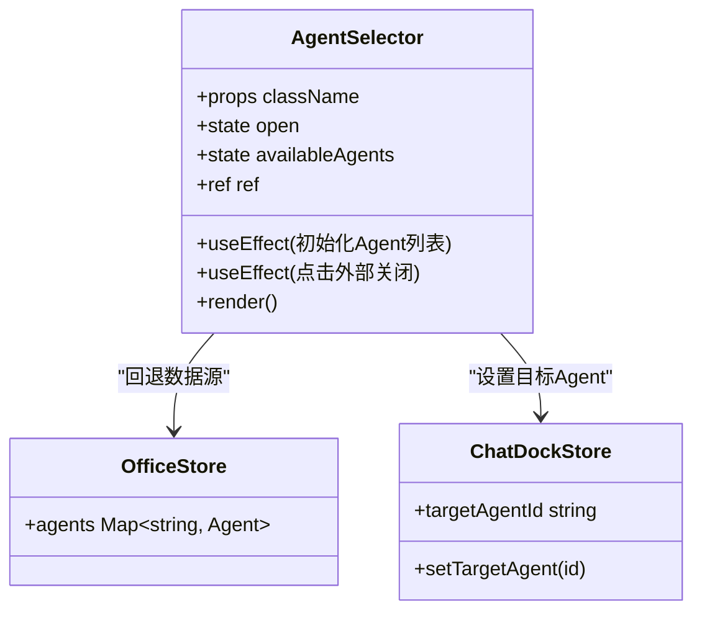
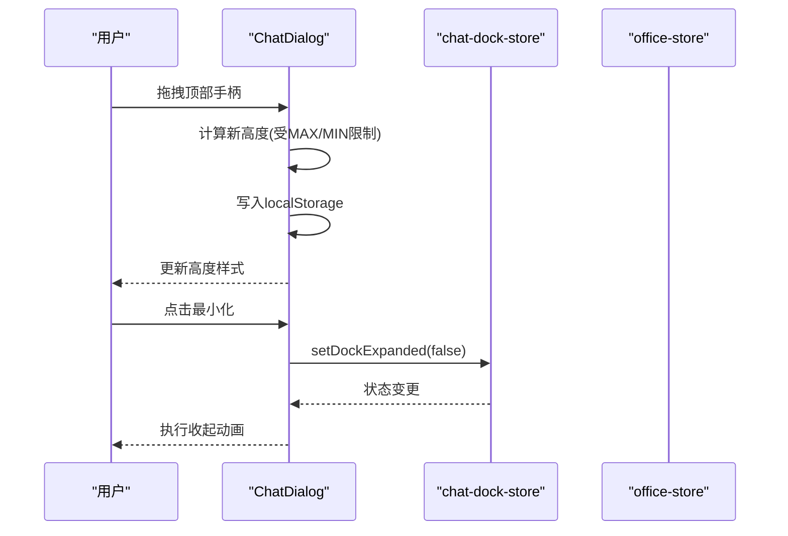
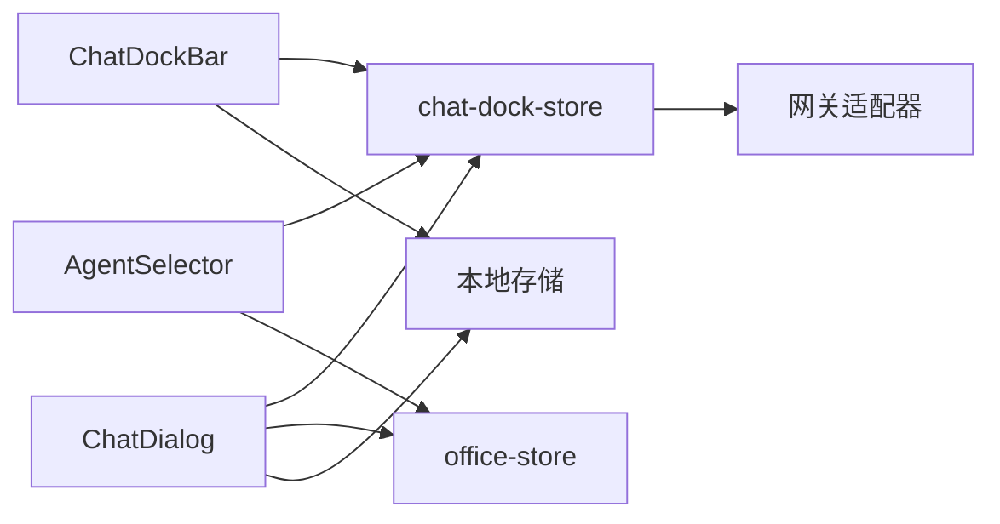

# 停靠栏界面

<cite>
**本文引用的文件**
- [ChatDockBar.tsx](file://src/components/chat/ChatDockBar.tsx)
- [AgentSelector.tsx](file://src/components/chat/AgentSelector.tsx)
- [ChatDialog.tsx](file://src/components/chat/ChatDialog.tsx)
- [chat-dock-store.ts](file://src/store/console-stores/chat-dock-store.ts)
- [useResponsive.ts](file://src/hooks/useResponsive.ts)
- [globals.css](file://src/styles/globals.css)
- [AgentSelector.test.tsx](file://src/components/chat/AgentSelector.test.tsx)
- [office-store.ts](file://src/store/office-store.ts)
</cite>

## 目录
1. [简介](#简介)
2. [项目结构](#项目结构)
3. [核心组件](#核心组件)
4. [架构总览](#架构总览)
5. [详细组件分析](#详细组件分析)
6. [依赖关系分析](#依赖关系分析)
7. [性能考量](#性能考量)
8. [故障排查指南](#故障排查指南)
9. [结论](#结论)
10. [附录](#附录)

## 简介
本文件为“停靠栏界面”的功能与实现文档，聚焦聊天停靠栏（Dock）的布局设计、Agent选择器、快捷操作按钮、状态指示器，以及响应式交互与视觉反馈机制。文档同时提供扩展新停靠功能、自定义操作按钮与优化移动端体验的实践建议。

## 项目结构
停靠栏界面由三个主要部分组成：
- 停靠栏输入区：位于页面底部，提供消息输入、附件上传、发送/停止控制与错误提示。
- 对话弹窗：在展开时以抽屉形式显示，支持拖拽调整高度、自动滚动、连接状态提示等。
- Agent选择器：用于切换当前会话关联的Agent，支持本地回退与远程适配器数据源。

图表来源
- [ChatDockBar.tsx:1-187](file://src/components/chat/ChatDockBar.tsx#L1-L187)
- [ChatDialog.tsx:1-432](file://src/components/chat/ChatDialog.tsx#L1-L432)
- [AgentSelector.tsx:1-141](file://src/components/chat/AgentSelector.tsx#L1-L141)
- [chat-dock-store.ts:1-800](file://src/store/console-stores/chat-dock-store.ts#L1-L800)

章节来源
- [ChatDockBar.tsx:1-187](file://src/components/chat/ChatDockBar.tsx#L1-L187)
- [ChatDialog.tsx:1-432](file://src/components/chat/ChatDialog.tsx#L1-L432)
- [AgentSelector.tsx:1-141](file://src/components/chat/AgentSelector.tsx#L1-L141)
- [chat-dock-store.ts:1-800](file://src/store/console-stores/chat-dock-store.ts#L1-L800)

## 核心组件
- ChatDockBar：停靠栏输入区，负责文本输入、附件上传、发送/停止控制、错误展示与Agent选择器集成。
- AgentSelector：Agent选择器，支持点击展开列表、点击切换目标Agent，并根据Agent ID生成颜色标识。
- ChatDialog：对话弹窗，支持拖拽调整高度、自动滚动、连接状态提示、消息渲染与输入控制。
- chat-dock-store：状态管理，集中管理消息、流式状态、会话、附件、草稿、错误等。

章节来源
- [ChatDockBar.tsx:1-187](file://src/components/chat/ChatDockBar.tsx#L1-L187)
- [AgentSelector.tsx:1-141](file://src/components/chat/AgentSelector.tsx#L1-L141)
- [ChatDialog.tsx:1-432](file://src/components/chat/ChatDialog.tsx#L1-L432)
- [chat-dock-store.ts:1-800](file://src/store/console-stores/chat-dock-store.ts#L1-L800)

## 架构总览
停靠栏采用“组件-状态”分层：
- 视图层：ChatDockBar、AgentSelector、ChatDialog
- 状态层：chat-dock-store（Zustand）
- 外部依赖：网关适配器（Agent列表）、本地存储（高度、会话键）

图表来源
- [ChatDockBar.tsx:1-187](file://src/components/chat/ChatDockBar.tsx#L1-L187)
- [ChatDialog.tsx:1-432](file://src/components/chat/ChatDialog.tsx#L1-L432)
- [chat-dock-store.ts:1-800](file://src/store/console-stores/chat-dock-store.ts#L1-L800)

## 详细组件分析

### ChatDockBar 组件
- 布局与交互
  - 左侧：AgentSelector + 展开按钮（最大化图标），用于切换Agent并展开完整对话。
  - 中间：附件按钮（回形针图标）触发文件选择，支持多选；TextareaAutosize作为输入框，支持多行与自动高度。
  - 右侧：发送/停止按钮，根据 isStreaming 切换行为；支持 Enter 发送、Shift+Enter 换行。
  - 底部：显示已添加的附件列表与一键清空。
- 错误展示
  - 当存在 error 时，顶部显示可关闭的错误横幅，点击“✕”清除。
- 状态与事件
  - 使用 chat-dock-store 的 sendMessage、abort、setDockExpanded、error、clearError、draft、attachments 等状态与方法。
  - canSend 逻辑：当 draft 非空或存在附件且未处于流式发送时允许发送。
- 视觉反馈
  - 发送按钮根据可用性禁用/启用；停止按钮使用红色强调。
  - 输入框在聚焦时边框高亮，暗色主题下有相应对比度。

图表来源
- [ChatDockBar.tsx:27-32](file://src/components/chat/ChatDockBar.tsx#L27-L32)
- [ChatDockBar.tsx:127-151](file://src/components/chat/ChatDockBar.tsx#L127-L151)
- [chat-dock-store.ts:80-101](file://src/store/console-stores/chat-dock-store.ts#L80-L101)

章节来源
- [ChatDockBar.tsx:1-187](file://src/components/chat/ChatDockBar.tsx#L1-L187)
- [chat-dock-store.ts:80-101](file://src/store/console-stores/chat-dock-store.ts#L80-L101)

### AgentSelector 组件
- 数据来源
  - 优先通过网关适配器获取 Agent 列表；若失败则回退到 office-store 中的本地 agents 映射。
  - 支持解析 Agent 的显示名称，优先 identity.name，其次 name，再回退 office-store 名称，最后回退到 ID。
- 交互行为
  - 点击按钮打开下拉列表；点击外部区域自动关闭。
  - 选择某 Agent 后更新 chat-dock-store 的 targetAgentId。
- 视觉反馈
  - 使用基于 Agent ID 的哈希算法生成颜色点，确保不同 Agent 的颜色稳定一致。
  - 选中项高亮，未选中项普通样式。

图表来源
- [AgentSelector.tsx:13-115](file://src/components/chat/AgentSelector.tsx#L13-L115)
- [AgentSelector.tsx:118-141](file://src/components/chat/AgentSelector.tsx#L118-L141)
- [chat-dock-store.ts:89](file://src/store/console-stores/chat-dock-store.ts#L89)

章节来源
- [AgentSelector.tsx:1-141](file://src/components/chat/AgentSelector.tsx#L1-L141)
- [AgentSelector.test.tsx:1-77](file://src/components/chat/AgentSelector.test.tsx#L1-L77)
- [chat-dock-store.ts:89](file://src/store/console-stores/chat-dock-store.ts#L89)

### ChatDialog 组件
- 展开/收起与动画
  - 通过 dockExpanded 控制是否显示；使用 CSS 动画实现滑入/滑出效果。
  - 收起时进行动画过渡，展开后延迟聚焦输入框。
- 消息渲染与滚动
  - 自动滚动至底部，当用户手动滚动至底部时恢复自动滚动。
  - 支持渲染历史消息、流式文本与思考态占位。
- 连接状态与错误
  - 根据 office-store 的 connectionStatus 展示不同颜色的连接状态条。
  - 错误横幅与 ChatDockBar 一致，支持一键清除。
- 拖拽调整高度
  - 顶部拖动手柄支持拖拽调整对话框高度，最大高度限制为视口高度的 70%，最小高度 220px。
  - 高度变化持久化到 localStorage，键值为固定字符串。

图表来源
- [ChatDialog.tsx:124-170](file://src/components/chat/ChatDialog.tsx#L124-L170)
- [ChatDialog.tsx:65-81](file://src/components/chat/ChatDialog.tsx#L65-L81)
- [office-store.ts:42-43](file://src/store/office-store.ts#L42-L43)

章节来源
- [ChatDialog.tsx:1-432](file://src/components/chat/ChatDialog.tsx#L1-L432)
- [office-store.ts:42-43](file://src/store/office-store.ts#L42-L43)

### 状态管理（chat-dock-store）
- 关键状态
  - messages、isStreaming、sessionStates、dockExpanded、targetAgentId、attachments、draft、error、isHistoryLoaded/Loading 等。
- 关键方法
  - sendMessage、abort、setDockExpanded、setTargetAgent、addAttachment/removeAttachment/clearAttachments、clearMessages、initEventListeners 等。
- 事件处理
  - handleChatEvent/handleAgentEvent 将网关事件映射为消息与流式状态，维护 activeRunId、hadToolEvents、thinkingLevel 等。
- 会话与历史
  - 支持加载历史、初始化历史、切换会话、持久化会话键与消息计数提示。

章节来源
- [chat-dock-store.ts:57-107](file://src/store/console-stores/chat-dock-store.ts#L57-L107)
- [chat-dock-store.ts:177-309](file://src/store/console-stores/chat-dock-store.ts#L177-L309)
- [chat-dock-store.ts:441-451](file://src/store/console-stores/chat-dock-store.ts#L441-L451)

## 依赖关系分析
- 组件耦合
  - ChatDockBar 与 ChatDialog 共享 chat-dock-store，形成双向状态驱动。
  - AgentSelector 依赖 office-store 与网关适配器，作为 Agent 数据的来源之一。
- 外部依赖
  - 网关适配器：提供 Agent 列表与消息事件。
  - 本地存储：高度、会话键、主题等。
- 样式与动画
  - globals.css 定义了连接状态脉冲、Agent 动画、对话框滑动动画等。

图表来源
- [ChatDockBar.tsx:1-187](file://src/components/chat/ChatDockBar.tsx#L1-L187)
- [ChatDialog.tsx:1-432](file://src/components/chat/ChatDialog.tsx#L1-L432)
- [AgentSelector.tsx:1-141](file://src/components/chat/AgentSelector.tsx#L1-L141)
- [chat-dock-store.ts:1-800](file://src/store/console-stores/chat-dock-store.ts#L1-L800)
- [globals.css:122-152](file://src/styles/globals.css#L122-L152)

章节来源
- [globals.css:122-152](file://src/styles/globals.css#L122-L152)

## 性能考量
- 渲染优化
  - 对话消息按需渲染，仅在状态变化时重绘；流式文本与思考态采用增量更新。
- 存储与缓存
  - 高度与会话键持久化到 localStorage，减少重复计算与网络请求。
- 事件处理
  - 使用 useCallback 包裹事件处理器，避免不必要的重渲染。
- 动画与滚动
  - 动画禁用时移除过渡，拖拽时禁用过渡以保证流畅性。

## 故障排查指南
- Agent 选择器无选项
  - 检查网关适配器是否可用；若不可用，确认 office-store 是否存在本地 Agent 数据。
- 发送按钮不可用
  - 确认 draft 非空或存在附件；检查 isStreaming 状态。
- 对话无法展开/收起
  - 检查 dockExpanded 状态与 setDockExpanded 方法调用链。
- 连接状态异常
  - 查看 office-store 的 connectionStatus 与 connectionError，必要时刷新页面重试。
- 移动端体验不佳
  - 使用 useResponsive 获取断点信息，针对 isMobile 调整布局与交互细节。

章节来源
- [AgentSelector.tsx:23-40](file://src/components/chat/AgentSelector.tsx#L23-L40)
- [ChatDockBar.tsx:27-32](file://src/components/chat/ChatDockBar.tsx#L27-L32)
- [ChatDialog.tsx:65-81](file://src/components/chat/ChatDialog.tsx#L65-L81)
- [useResponsive.ts:1-42](file://src/hooks/useResponsive.ts#L1-L42)

## 结论
停靠栏界面通过清晰的组件职责划分与集中状态管理，实现了简洁高效的聊天交互体验。其响应式设计与丰富的视觉反馈提升了可用性，同时具备良好的扩展性，便于新增停靠功能与自定义操作按钮。

## 附录

### 响应式设计与移动端优化
- 断点判断
  - 使用 useResponsive 提供 isMobile/isTablet/isDesktop 三档断点。
- 移动端建议
  - 在 isMobile 下减小输入框与按钮尺寸，合并操作按钮，隐藏非关键元素。
  - 为输入框增加触屏焦点优化，避免键盘遮挡。

章节来源
- [useResponsive.ts:1-42](file://src/hooks/useResponsive.ts#L1-L42)

### 视觉反馈与动画
- 对话框滑动动画：chat-slide-up/chat-slide-down。
- 连接状态脉冲：connection-pulse。
- Agent 动画：agent-pulse、agent-glow、agent-blink、agent-spawn/despawn。
- 思考态点阵：thinking-dots。

章节来源
- [globals.css:122-152](file://src/styles/globals.css#L122-L152)

### 扩展新停靠功能与自定义操作按钮
- 新增按钮步骤
  - 在 ChatDockBar 或 ChatDialog 的输入区添加按钮与事件处理。
  - 通过 chat-dock-store 的方法（如 setDraft/addAttachment/clearAttachments）与状态联动。
- 自定义 Agent 行为
  - 在 AgentSelector 中扩展显示名称解析或颜色策略。
  - 若需要远程 Agent 列表，确保网关适配器返回标准 AgentSummary。
- 会话与历史
  - 使用 chat-dock-store 的会话管理 API（newSession/switchSession/loadHistory）扩展多会话能力。

章节来源
- [ChatDockBar.tsx:84-93](file://src/components/chat/ChatDockBar.tsx#L84-L93)
- [ChatDialog.tsx:356-366](file://src/components/chat/ChatDialog.tsx#L356-L366)
- [chat-dock-store.ts:80-107](file://src/store/console-stores/chat-dock-store.ts#L80-L107)