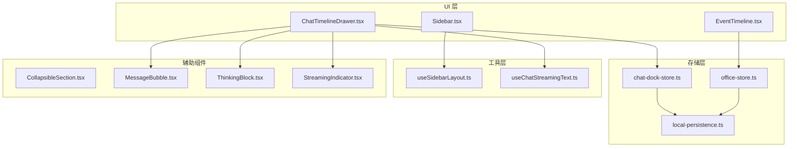
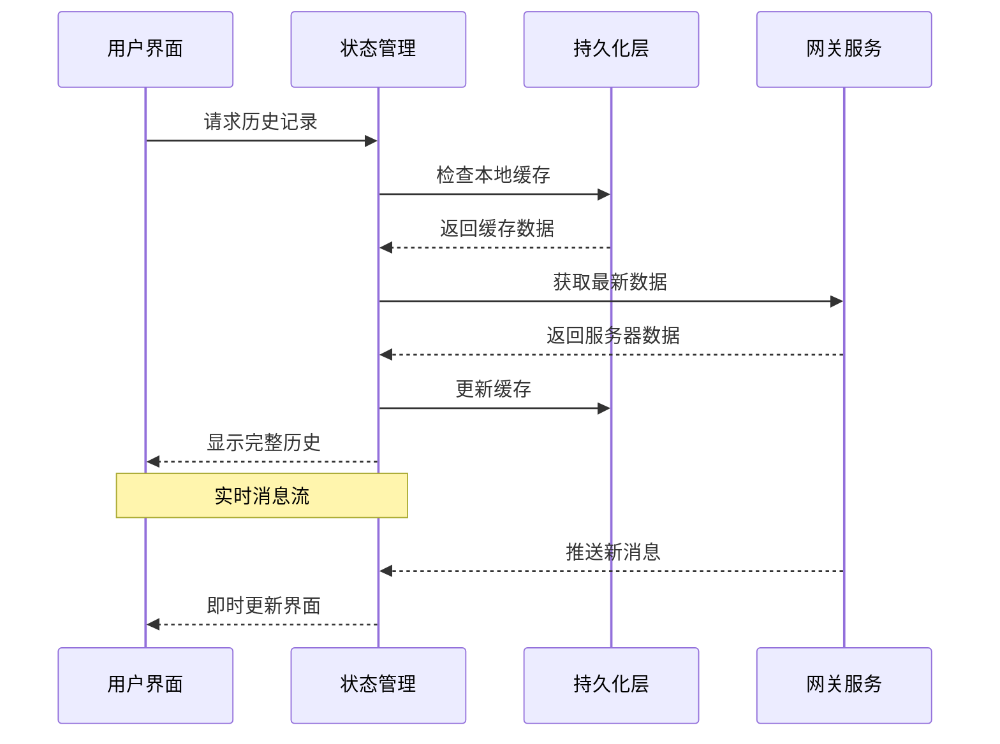
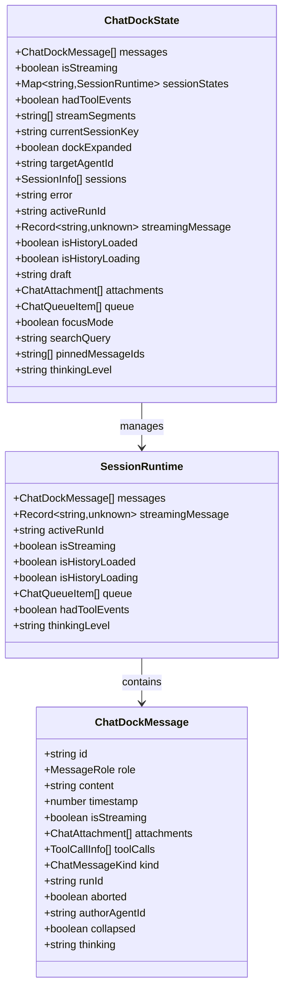
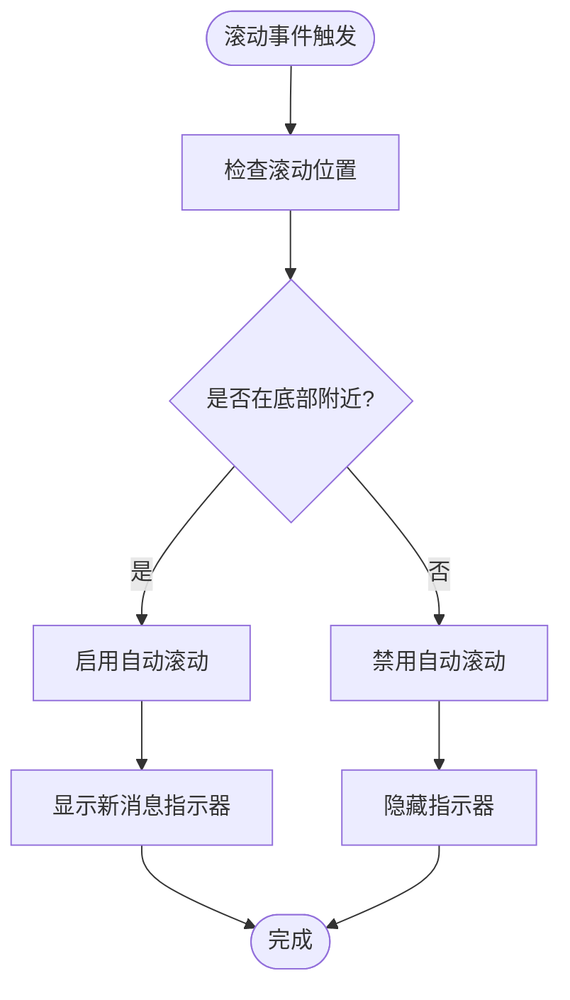
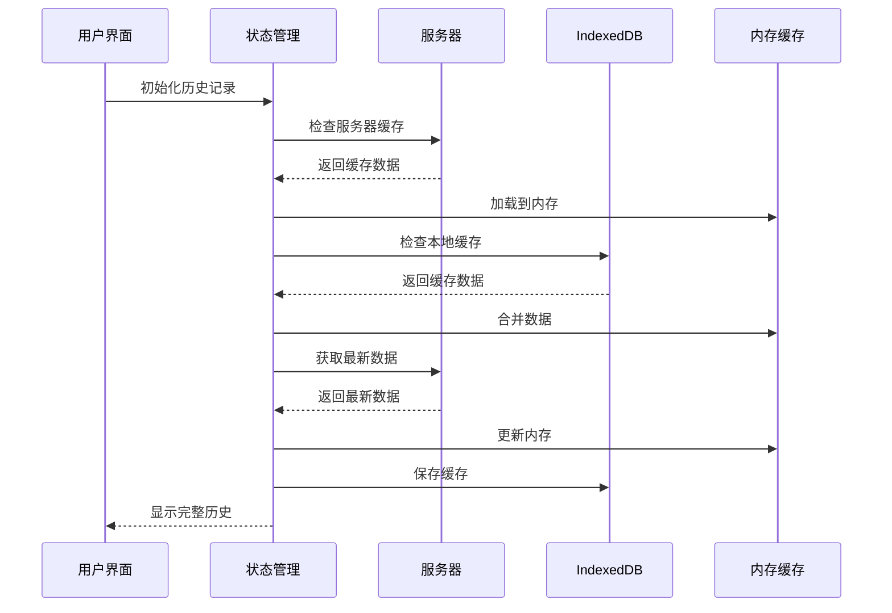
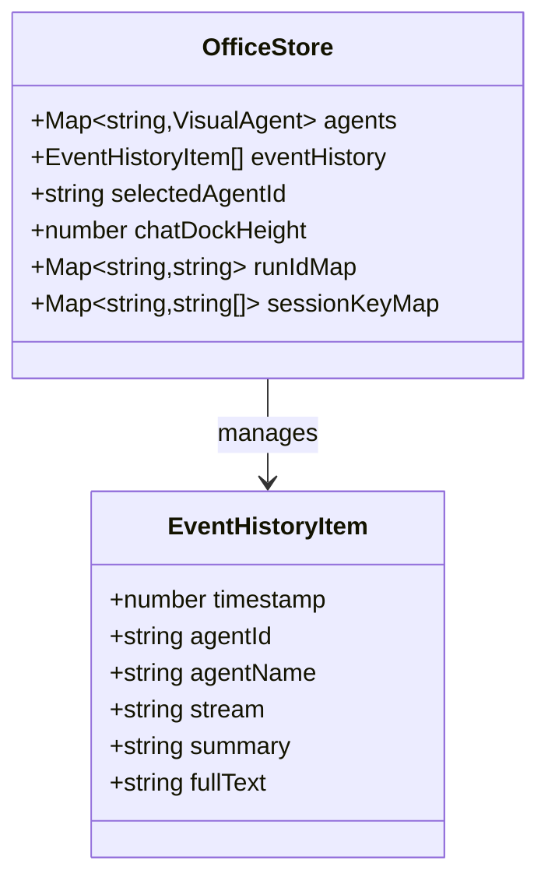
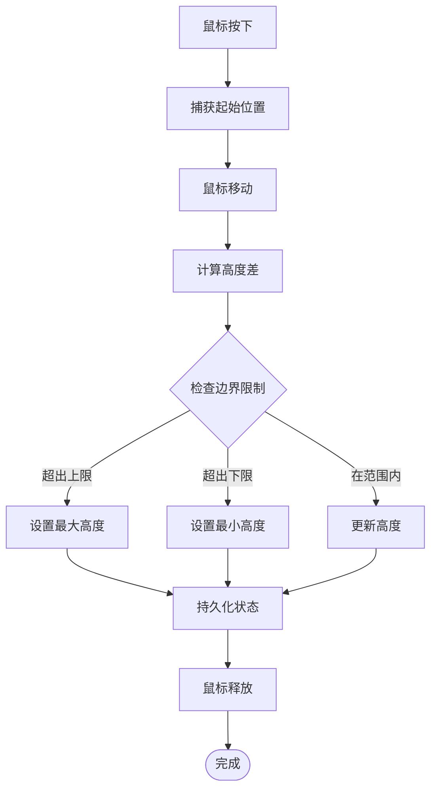
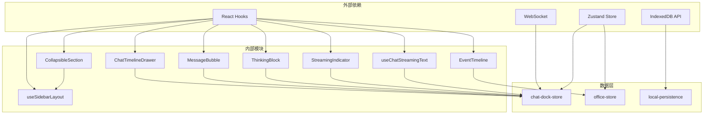

# 时间线抽屉

<cite>
**本文档引用的文件**
- [ChatTimelineDrawer.tsx](file://src/components/chat/ChatTimelineDrawer.tsx)
- [EventTimeline.tsx](file://src/components/panels/EventTimeline.tsx)
- [Sidebar.tsx](file://src/components/layout/Sidebar.tsx)
- [chat-dock-store.ts](file://src/store/console-stores/chat-dock-store.ts)
- [office-store.ts](file://src/store/office-store.ts)
- [local-persistence.ts](file://src/lib/local-persistence.ts)
- [useSidebarLayout.ts](file://src/hooks/useSidebarLayout.ts)
- [CollapsibleSection.tsx](file://src/components/shared/CollapsibleSection.tsx)
- [MessageBubble.tsx](file://src/components/chat/MessageBubble.tsx)
- [ThinkingBlock.tsx](file://src/components/chat/ThinkingBlock.tsx)
- [StreamingIndicator.tsx](file://src/components/chat/StreamingIndicator.tsx)
- [useChatStreamingText.ts](file://src/hooks/useChatStreamingText.ts)
</cite>

## 目录
1. [简介](#简介)
2. [项目结构](#项目结构)
3. [核心组件](#核心组件)
4. [架构概览](#架构概览)
5. [详细组件分析](#详细组件分析)
6. [依赖关系分析](#依赖关系分析)
7. [性能考虑](#性能考虑)
8. [故障排除指南](#故障排除指南)
9. [结论](#结论)

## 简介

时间线抽屉是 OpenClaw Office 中一个关键的功能模块，它提供了两种不同但互补的时间线视图：聊天时间线抽屉和事件时间线面板。这个系统实现了实时消息流的可视化、历史记录的高效管理、智能滚动控制以及用户友好的交互体验。

该功能的核心目标是为用户提供一个直观的方式来浏览和管理历史消息与系统事件，支持拖拽调整大小、自动滚动到最新内容、手动导航到特定时间点等功能。系统通过多层缓存策略确保在大规模历史数据场景下的性能表现。

## 项目结构

时间线抽屉功能分布在多个组件和存储层中，形成了一个完整的数据流架构：

**图表来源**
- [ChatTimelineDrawer.tsx:1-150](file://src/components/chat/ChatTimelineDrawer.tsx#L1-L150)
- [EventTimeline.tsx:1-165](file://src/components/panels/EventTimeline.tsx#L1-L165)
- [Sidebar.tsx:1-267](file://src/components/layout/Sidebar.tsx#L1-L267)

**章节来源**
- [ChatTimelineDrawer.tsx:1-150](file://src/components/chat/ChatTimelineDrawer.tsx#L1-L150)
- [EventTimeline.tsx:1-165](file://src/components/panels/EventTimeline.tsx#L1-L165)
- [Sidebar.tsx:1-267](file://src/components/layout/Sidebar.tsx#L1-L267)

## 核心组件

### 聊天时间线抽屉 (ChatTimelineDrawer)

聊天时间线抽屉是一个专门用于显示聊天消息的历史记录面板，具有以下关键特性：

- **实时消息流**: 支持实时显示正在生成的消息和思考过程
- **智能滚动**: 自动滚动到最新消息，同时允许用户手动导航
- **拖拽调整**: 用户可以通过拖拽手柄调整抽屉高度
- **状态管理**: 集成聊天状态、流式文本和思考内容的显示

### 事件时间线面板 (EventTimeline)

事件时间线面板专注于显示系统事件历史，提供：

- **事件分类**: 按事件类型（生命周期、工具调用、错误等）进行分类
- **时间戳显示**: 清晰的时间信息展示
- **展开详情**: 支持点击查看详情内容
- **自动滚动**: 新事件自动滚动到底部

### 布局管理系统

系统使用可折叠区域组件来管理时间线的布局：

- **高度持久化**: 用户调整的高度会保存到本地存储
- **响应式设计**: 支持不同屏幕尺寸的适配
- **灵活配置**: 可设置最小和最大高度限制

**章节来源**
- [ChatTimelineDrawer.tsx:16-150](file://src/components/chat/ChatTimelineDrawer.tsx#L16-L150)
- [EventTimeline.tsx:36-165](file://src/components/panels/EventTimeline.tsx#L36-L165)
- [CollapsibleSection.tsx:22-136](file://src/components/shared/CollapsibleSection.tsx#L22-L136)

## 架构概览

时间线抽屉系统采用分层架构设计，确保了良好的可维护性和扩展性：

**图表来源**
- [chat-dock-store.ts:1347-1449](file://src/store/console-stores/chat-dock-store.ts#L1347-L1449)
- [local-persistence.ts:97-151](file://src/lib/local-persistence.ts#L97-L151)

系统的核心数据流包括三个层次的缓存策略：

1. **服务器缓存**: 持久化的跨设备数据
2. **IndexedDB 缓存**: 浏览器本地存储
3. **内存缓存**: 应用程序运行时状态

**章节来源**
- [chat-dock-store.ts:1347-1449](file://src/store/console-stores/chat-dock-store.ts#L1347-L1449)
- [local-persistence.ts:53-86](file://src/lib/local-persistence.ts#L53-L86)

## 详细组件分析

### 聊天时间线抽屉实现

#### 数据结构设计

聊天时间线抽屉使用统一的消息数据结构来处理不同类型的内容：

**图表来源**
- [chat-dock-store.ts:29-107](file://src/store/console-stores/chat-dock-store.ts#L29-L107)
- [chat-dock-store.ts:45-55](file://src/store/console-stores/chat-dock-store.ts#L45-L55)

#### 滚动优化机制

系统实现了智能的滚动控制机制来优化用户体验：

**图表来源**
- [ChatTimelineDrawer.tsx:36-48](file://src/components/chat/ChatTimelineDrawer.tsx#L36-L48)
- [EventTimeline.tsx:54-59](file://src/components/panels/EventTimeline.tsx#L54-L59)

#### 动态加载策略

系统采用渐进式加载策略来处理大规模历史数据：

**图表来源**
- [chat-dock-store.ts:1347-1449](file://src/store/console-stores/chat-dock-store.ts#L1347-L1449)
- [local-persistence.ts:97-151](file://src/lib/local-persistence.ts#L97-L151)

**章节来源**
- [ChatTimelineDrawer.tsx:16-150](file://src/components/chat/ChatTimelineDrawer.tsx#L16-L150)
- [chat-dock-store.ts:29-107](file://src/store/console-stores/chat-dock-store.ts#L29-L107)

### 事件时间线面板实现

#### 事件数据模型

事件时间线面板使用专门的事件数据结构来组织系统事件：

**图表来源**
- [office-store.ts:16-24](file://src/store/office-store.ts#L16-L24)
- [office-store.ts:231](file://src/store/office-store.ts#L231)

#### 事件分类系统

系统支持多种事件类型的分类和显示：

| 事件类型 | 图标 | 中文标签 | 用途 |
|---------|------|----------|------|
| lifecycle | ● | 生命周期 | 代理状态变化 |
| tool | 🔧 | 工具调用 | 工具执行过程 |
| assistant | 💬 | 对话输出 | AI回复内容 |
| error | ⚠ | 异常 | 错误信息 |
| item | 📋 | 任务项 | 任务状态 |
| plan | 📝 | 计划 | 计划执行 |
| approval | 🔐 | 审批 | 审批流程 |
| command_output | ⌨ | 命令输出 | 命令执行结果 |
| patch | 📄 | 文件变更 | 文件修改记录 |
| thinking | 💭 | 思考 | 思考过程 |
| compaction | 🗜 | 上下文压缩 | 上下文优化 |

**章节来源**
- [EventTimeline.tsx:6-32](file://src/components/panels/EventTimeline.tsx#L6-L32)
- [EventTimeline.tsx:36-165](file://src/components/panels/EventTimeline.tsx#L36-L165)

### 交互体验设计

#### 拖拽调整大小

系统提供了直观的拖拽接口来调整时间线面板的高度：

**图表来源**
- [CollapsibleSection.tsx:43-74](file://src/components/shared/CollapsibleSection.tsx#L43-L74)
- [useSidebarLayout.ts:47-79](file://src/hooks/useSidebarLayout.ts#L47-L79)

#### 自动滚动控制

系统实现了智能的滚动行为来平衡用户体验：

- **底部检测**: 当滚动距离底部小于阈值时启用自动滚动
- **新消息指示**: 当用户滚动到中间时显示"新消息"按钮
- **手动控制**: 用户可以随时点击按钮回到最新消息

**章节来源**
- [ChatTimelineDrawer.tsx:23-83](file://src/components/chat/ChatTimelineDrawer.tsx#L23-L83)
- [EventTimeline.tsx:47-89](file://src/components/panels/EventTimeline.tsx#L47-L89)

## 依赖关系分析

时间线抽屉系统的依赖关系展现了清晰的分层架构：

**图表来源**
- [ChatTimelineDrawer.tsx:1-10](file://src/components/chat/ChatTimelineDrawer.tsx#L1-L10)
- [EventTimeline.tsx:1-5](file://src/components/panels/EventTimeline.tsx#L1-L5)
- [chat-dock-store.ts:1-18](file://src/store/console-stores/chat-dock-store.ts#L1-L18)

### 组件耦合度分析

系统在设计上实现了良好的低耦合高内聚：

- **UI 组件**: 专注于渲染逻辑，不直接操作数据
- **状态管理**: 集中处理业务逻辑和数据同步
- **持久化层**: 透明的数据存储抽象
- **工具函数**: 独立的功能模块，可复用性强

**章节来源**
- [Sidebar.tsx:220-233](file://src/components/layout/Sidebar.tsx#L220-L233)
- [useSidebarLayout.ts:42-79](file://src/hooks/useSidebarLayout.ts#L42-L79)

## 性能考虑

### 缓存策略优化

系统采用了三层缓存策略来确保最佳性能：

1. **服务器缓存**: 提供跨设备的持久化存储
2. **IndexedDB 缓存**: 浏览器本地存储，支持离线访问
3. **内存缓存**: 应用程序运行时的快速访问

### 内存管理

- **消息数量限制**: 默认每会话最多存储 500 条消息
- **事件历史限制**: 最多存储 1000 条事件记录
- **过期清理**: 自动清理过期数据（消息保留 30 天，事件保留 7 天）

### 渲染优化

- **虚拟滚动**: 对于大量历史数据，系统会限制显示数量
- **懒加载**: 事件详情采用点击展开的方式
- **防抖处理**: 滚动事件处理使用防抖技术减少重绘

**章节来源**
- [local-persistence.ts:24-28](file://src/lib/local-persistence.ts#L24-L28)
- [office-store.ts:39](file://src/store/office-store.ts#L39)
- [EventTimeline.tsx:34](file://src/components/panels/EventTimeline.tsx#L34)

## 故障排除指南

### 常见问题及解决方案

#### 历史记录加载失败

**症状**: 时间线显示为空或加载缓慢

**可能原因**:
1. IndexedDB 存储空间不足
2. 网络连接异常
3. 浏览器兼容性问题

**解决步骤**:
1. 检查浏览器存储使用情况
2. 确认网络连接状态
3. 尝试清除浏览器缓存
4. 在其他浏览器中测试

#### 消息流显示异常

**症状**: 实时消息不显示或显示不完整

**可能原因**:
1. WebSocket 连接断开
2. 流式文本解析错误
3. 状态同步问题

**解决步骤**:
1. 检查网络连接
2. 刷新页面重新建立连接
3. 查看浏览器开发者工具中的错误信息

#### 滚动行为异常

**症状**: 自动滚动失效或滚动位置不正确

**可能原因**:
1. DOM 元素未正确渲染
2. 滚动事件监听器冲突
3. 样式覆盖问题

**解决步骤**:
1. 确认容器元素的高度设置
2. 检查 CSS 样式冲突
3. 重新初始化滚动状态

**章节来源**
- [chat-dock-store.ts:1347-1449](file://src/store/console-stores/chat-dock-store.ts#L1347-L1449)
- [local-persistence.ts:88-93](file://src/lib/local-persistence.ts#L88-L93)

## 结论

时间线抽屉功能通过精心设计的架构和优化策略，成功地为用户提供了高效、流畅的历史记录浏览体验。系统的关键优势包括：

1. **多层次缓存**: 确保在各种网络条件下的稳定性能
2. **智能滚动控制**: 平衡自动跟踪和手动导航的需求
3. **模块化设计**: 良好的代码组织便于维护和扩展
4. **性能优化**: 针对大规模数据场景的专门优化

该系统为 OpenClaw Office 提供了一个坚实的基础，支持未来更多的功能扩展和性能改进。通过持续的监控和优化，时间线抽屉将继续为用户提供优秀的用户体验。