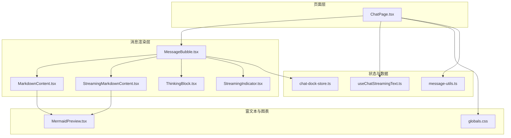
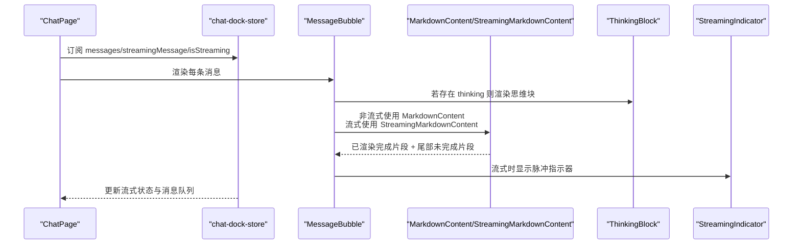
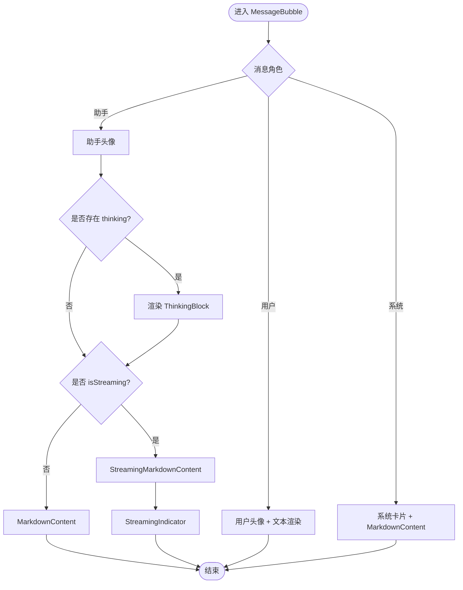
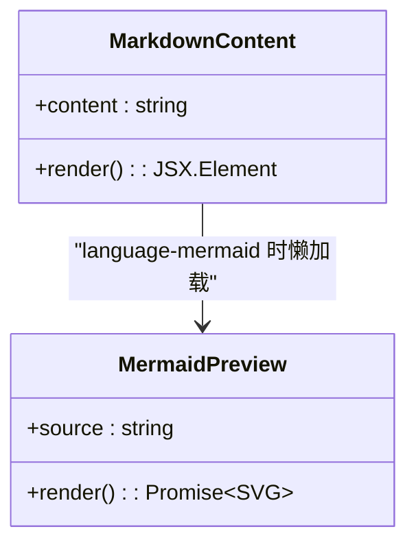
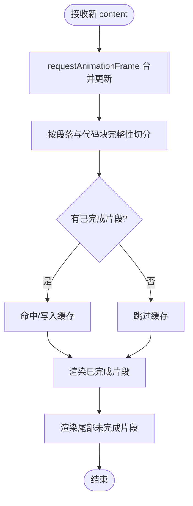
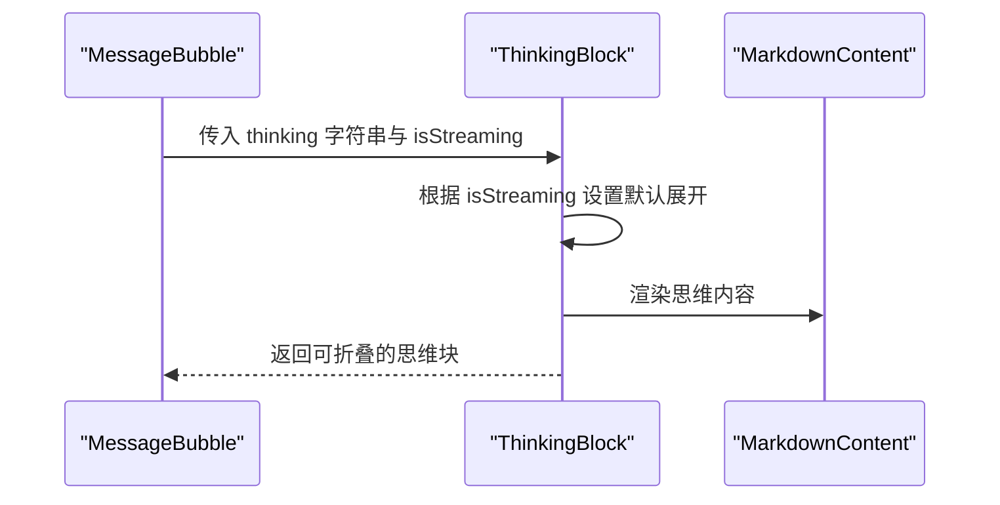
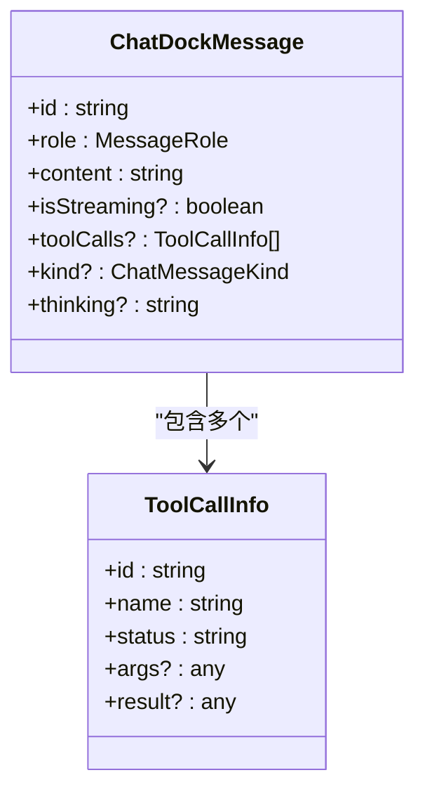
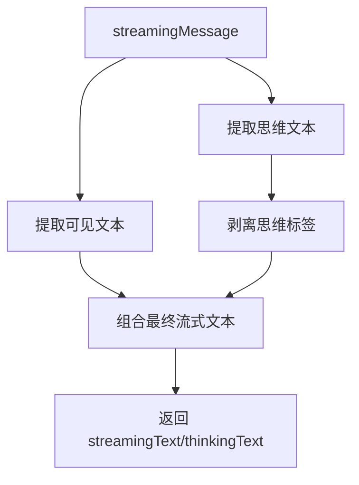
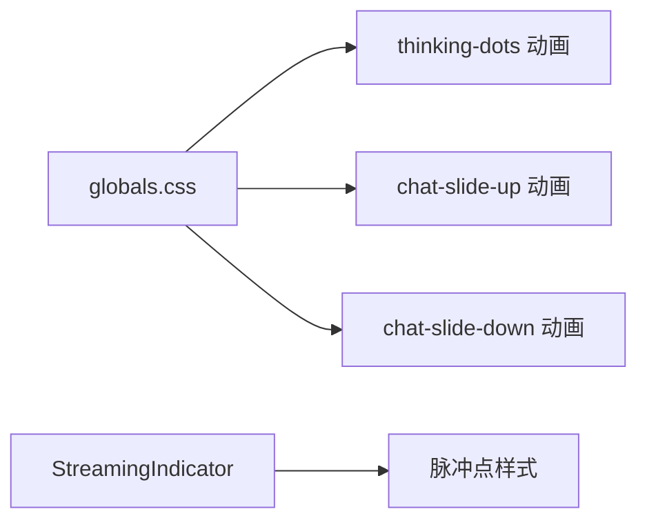
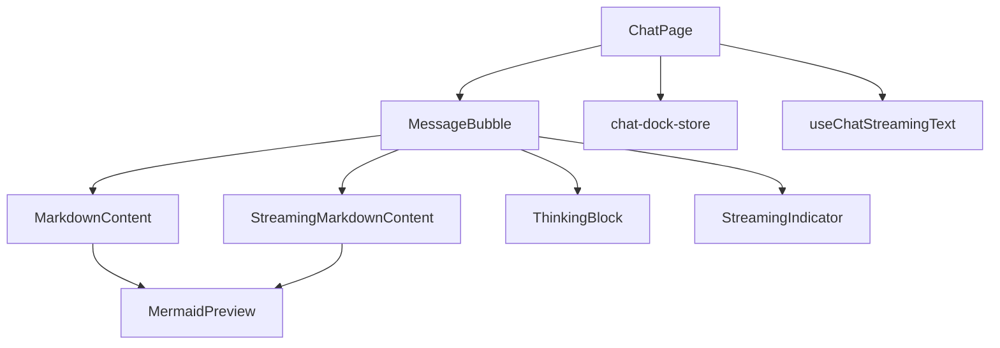

# 消息渲染引擎

<cite>
**本文引用的文件**
- [MessageBubble.tsx](file://src/components/chat/MessageBubble.tsx)
- [MarkdownContent.tsx](file://src/components/chat/MarkdownContent.tsx)
- [StreamingMarkdownContent.tsx](file://src/components/chat/StreamingMarkdownContent.tsx)
- [ThinkingBlock.tsx](file://src/components/chat/ThinkingBlock.tsx)
- [StreamingIndicator.tsx](file://src/components/chat/StreamingIndicator.tsx)
- [chat-dock-store.ts](file://src/store/console-stores/chat-dock-store.ts)
- [useChatStreamingText.ts](file://src/hooks/useChatStreamingText.ts)
- [MermaidPreview.tsx](file://src/components/shared/MermaidPreview.tsx)
- [globals.css](file://src/styles/globals.css)
- [ChatPage.tsx](file://src/components/pages/ChatPage.tsx)
- [message-utils.ts](file://src/lib/message-utils.ts)
</cite>

## 目录
1. [简介](#简介)
2. [项目结构](#项目结构)
3. [核心组件](#核心组件)
4. [架构总览](#架构总览)
5. [详细组件分析](#详细组件分析)
6. [依赖关系分析](#依赖关系分析)
7. [性能考量](#性能考量)
8. [故障排查指南](#故障排查指南)
9. [结论](#结论)
10. [附录](#附录)

## 简介
本文件面向“消息渲染引擎”的技术文档，聚焦以下目标：
- 深入解释消息气泡的渲染机制与消息类型区分（用户消息、AI回复、系统通知）
- 解析并展示 Markdown 内容，支持富文本格式与 Mermaid 图表
- 实现流式 Markdown 的增量渲染与动画指示器
- 可视化展示思维过程块（Thinking Block）
- 提供消息样式的定制方法、扩展新消息类型的路径，以及优化大量消息渲染性能的策略

## 项目结构
消息渲染引擎由页面容器、消息气泡、Markdown 渲染、流式渲染、思维块、工具调用活动气泡等模块组成，并通过状态存储驱动渲染。

**图示来源**
- [ChatPage.tsx:1-553](file://src/components/pages/ChatPage.tsx#L1-L553)
- [MessageBubble.tsx:1-257](file://src/components/chat/MessageBubble.tsx#L1-L257)
- [MarkdownContent.tsx:1-133](file://src/components/chat/MarkdownContent.tsx#L1-L133)
- [StreamingMarkdownContent.tsx:1-260](file://src/components/chat/StreamingMarkdownContent.tsx#L1-L260)
- [ThinkingBlock.tsx:1-54](file://src/components/chat/ThinkingBlock.tsx#L1-L54)
- [StreamingIndicator.tsx:1-6](file://src/components/chat/StreamingIndicator.tsx#L1-L6)
- [chat-dock-store.ts:1-800](file://src/store/console-stores/chat-dock-store.ts#L1-L800)
- [useChatStreamingText.ts:1-88](file://src/hooks/useChatStreamingText.ts#L1-L88)
- [MermaidPreview.tsx:1-66](file://src/components/shared/MermaidPreview.tsx#L1-L66)
- [globals.css:1-152](file://src/styles/globals.css#L1-L152)
- [message-utils.ts:1-112](file://src/lib/message-utils.ts#L1-L112)

**章节来源**
- [ChatPage.tsx:1-553](file://src/components/pages/ChatPage.tsx#L1-L553)
- [MessageBubble.tsx:1-257](file://src/components/chat/MessageBubble.tsx#L1-L257)
- [chat-dock-store.ts:1-800](file://src/store/console-stores/chat-dock-store.ts#L1-L800)

## 核心组件
- 消息气泡(MessageBubble)：根据消息角色与类型选择渲染路径，处理用户/系统/助手消息、工具调用活动、图片附件、思维块与流式指示器。
- Markdown 内容(MarkdownContent)：基于 react-markdown + remark-gfm，提供段落、标题、表格、代码块、行内代码、链接等默认样式与 Mermaid 支持。
- 流式 Markdown(StreamingMarkdownContent)：在流式场景下按帧批量更新已渲染完成部分，避免频繁重排；支持代码块完整性判断与 Mermaid 渲染。
- 思维块(ThinkingBlock)：可展开/折叠的思维过程区域，内置脉冲指示器，支持 Markdown 渲染。
- 流式指示器(StreamingIndicator)：三道脉冲点，提示正在流式生成。
- 状态与数据(chat-dock-store)：统一管理消息列表、流式消息、会话运行时、工具调用、思维内容、历史加载等。
- 工具函数(useChatStreamingText)：从流式事件中提取可见文本与思维文本，并剥离思维标签。
- 富文本与图表(MermaidPreview)：异步渲染 Mermaid 图表，错误回退与加载态处理。
- 样式(globals.css)：提供聊天对话框滑入/滑出动画、思考点脉冲动画等。

**章节来源**
- [MessageBubble.tsx:160-257](file://src/components/chat/MessageBubble.tsx#L160-L257)
- [MarkdownContent.tsx:22-133](file://src/components/chat/MarkdownContent.tsx#L22-L133)
- [StreamingMarkdownContent.tsx:198-260](file://src/components/chat/StreamingMarkdownContent.tsx#L198-L260)
- [ThinkingBlock.tsx:11-54](file://src/components/chat/ThinkingBlock.tsx#L11-L54)
- [StreamingIndicator.tsx:1-6](file://src/components/chat/StreamingIndicator.tsx#L1-L6)
- [chat-dock-store.ts:29-43](file://src/store/console-stores/chat-dock-store.ts#L29-L43)
- [useChatStreamingText.ts:12-88](file://src/hooks/useChatStreamingText.ts#L12-L88)
- [MermaidPreview.tsx:9-66](file://src/components/shared/MermaidPreview.tsx#L9-L66)
- [globals.css:102-151](file://src/styles/globals.css#L102-L151)

## 架构总览
消息渲染引擎采用“页面容器 + 组件分层 + 状态驱动”的架构：
- 页面(ChatPage)负责会话切换、输入、附件、滚动与错误提示
- 消息气泡(MessageBubble)根据消息属性决定渲染分支
- Markdown/流式渲染组件负责内容解析与增量更新
- 思维块与流式指示器提供交互反馈
- 状态存储(chat-dock-store)承载消息、流式状态、工具调用、历史加载等
- 工具函数(useChatStreamingText)抽取流式文本与思维文本
- MermaidPreview 与样式(globals.css)提供富文本与动画能力

**图示来源**
- [ChatPage.tsx:350-387](file://src/components/pages/ChatPage.tsx#L350-L387)
- [MessageBubble.tsx:204-220](file://src/components/chat/MessageBubble.tsx#L204-L220)
- [MarkdownContent.tsx:22-133](file://src/components/chat/MarkdownContent.tsx#L22-L133)
- [StreamingMarkdownContent.tsx:198-260](file://src/components/chat/StreamingMarkdownContent.tsx#L198-L260)
- [ThinkingBlock.tsx:11-54](file://src/components/chat/ThinkingBlock.tsx#L11-L54)
- [StreamingIndicator.tsx:1-6](file://src/components/chat/StreamingIndicator.tsx#L1-L6)
- [chat-dock-store.ts:792-800](file://src/store/console-stores/chat-dock-store.ts#L792-L800)

## 详细组件分析

### 消息气泡(MessageBubble)渲染机制
- 角色与类型判定
  - 用户消息：右对齐，显示用户头像，直接渲染纯文本
  - 系统通知：居中卡片，使用 MarkdownContent 渲染
  - 助手消息：左对齐，显示助手头像；若存在 thinking 则先渲染思维块
  - 工具调用(kind=tool)：独立工具活动气泡，支持展开/折叠与状态高亮
- 流式与非流式分支
  - 非流式：使用 MarkdownContent 渲染完整 Markdown
  - 流式：使用 StreamingMarkdownContent 增量渲染已完成片段，尾部实时渲染
- 附加功能
  - 图片附件网格展示
  - 工具调用标签展示
  - 固定消息按钮与国际化文案

**图示来源**
- [MessageBubble.tsx:160-257](file://src/components/chat/MessageBubble.tsx#L160-L257)
- [ThinkingBlock.tsx:11-54](file://src/components/chat/ThinkingBlock.tsx#L11-L54)
- [StreamingMarkdownContent.tsx:198-260](file://src/components/chat/StreamingMarkdownContent.tsx#L198-L260)
- [MarkdownContent.tsx:22-133](file://src/components/chat/MarkdownContent.tsx#L22-L133)
- [StreamingIndicator.tsx:1-6](file://src/components/chat/StreamingIndicator.tsx#L1-L6)

**章节来源**
- [MessageBubble.tsx:160-257](file://src/components/chat/MessageBubble.tsx#L160-L257)

### Markdown 内容解析与显示
- 使用 react-markdown + remark-gfm
- 自定义组件映射：段落、标题、引用、表格、单元格、代码块、行内代码、链接
- 行内代码与代码块样式差异化；代码块中的 language-mermaid 自动转为 MermaidPreview
- Mermaid 渲染采用 Suspense 异步加载，失败时回退到纯文本代码块

**图示来源**
- [MarkdownContent.tsx:22-133](file://src/components/chat/MarkdownContent.tsx#L22-L133)
- [MermaidPreview.tsx:9-66](file://src/components/shared/MermaidPreview.tsx#L9-L66)

**章节来源**
- [MarkdownContent.tsx:22-133](file://src/components/chat/MarkdownContent.tsx#L22-L133)
- [MermaidPreview.tsx:9-66](file://src/components/shared/MermaidPreview.tsx#L9-L66)

### 流式 Markdown 增量渲染
- 批处理策略
  - 使用 requestAnimationFrame 合并多次更新，减少重排
  - 通过缓存已完成片段，避免重复渲染
- 片段切分
  - 以双换行符为段落边界进行切分
  - 检测代码块是否闭合，确保不打断代码块
- 渲染流程
  - completed 使用预渲染节点缓存
  - tail 实时渲染未完成片段
  - 代码块中的 language-mermaid 同样走 MermaidPreview

**图示来源**
- [StreamingMarkdownContent.tsx:207-228](file://src/components/chat/StreamingMarkdownContent.tsx#L207-L228)
- [StreamingMarkdownContent.tsx:232-247](file://src/components/chat/StreamingMarkdownContent.tsx#L232-L247)
- [StreamingMarkdownContent.tsx:252-257](file://src/components/chat/StreamingMarkdownContent.tsx#L252-L257)

**章节来源**
- [StreamingMarkdownContent.tsx:198-260](file://src/components/chat/StreamingMarkdownContent.tsx#L198-L260)

### 思维过程块(ThinkingBlock)可视化
- 默认展开于流式阶段，支持点击折叠/展开
- 展示脉冲指示器表示仍在思考
- 折叠后仅保留标题与简要提示
- 内容使用 MarkdownContent 渲染

**图示来源**
- [ThinkingBlock.tsx:11-54](file://src/components/chat/ThinkingBlock.tsx#L11-L54)
- [MessageBubble.tsx:209-211](file://src/components/chat/MessageBubble.tsx#L209-L211)

**章节来源**
- [ThinkingBlock.tsx:11-54](file://src/components/chat/ThinkingBlock.tsx#L11-L54)

### 消息类型区分与系统通知
- 角色(MessageRole)：user、assistant、system
- 类型(ChatMessageKind)：message、tool、command
- 系统通知：居中卡片样式，适合提示性内容
- 工具调用：kind=tool 的系统消息，独立气泡展示工具名、参数与结果

**图示来源**
- [chat-dock-store.ts:29-43](file://src/store/console-stores/chat-dock-store.ts#L29-L43)

**章节来源**
- [chat-dock-store.ts:19-43](file://src/store/console-stores/chat-dock-store.ts#L19-L43)

### 流式文本提取与思维标签剥离
- 从流式事件中提取可见文本与思维文本
- 支持 content-block 数组与 fallback text 字段
- 剥离思维标签，保证消息气泡只显示实际回复

**图示来源**
- [useChatStreamingText.ts:12-88](file://src/hooks/useChatStreamingText.ts#L12-L88)

**章节来源**
- [useChatStreamingText.ts:12-88](file://src/hooks/useChatStreamingText.ts#L12-L88)

### 动画效果实现
- 脉冲点动画：thinking-dots，用于思维块与 2D 场景
- 对话框滑入/滑出：chat-slide-up/chat-slide-down
- 流式指示器：三道脉冲点，蓝色背景

**图示来源**
- [globals.css:102-151](file://src/styles/globals.css#L102-L151)
- [StreamingIndicator.tsx:1-6](file://src/components/chat/StreamingIndicator.tsx#L1-L6)

**章节来源**
- [globals.css:102-151](file://src/styles/globals.css#L102-L151)
- [StreamingIndicator.tsx:1-6](file://src/components/chat/StreamingIndicator.tsx#L1-L6)

## 依赖关系分析
- 组件耦合
  - MessageBubble 依赖 MarkdownContent/StreamingMarkdownContent/ThinkingBlock/StreamingIndicator
  - MarkdownContent/StreamingMarkdownContent 依赖 MermaidPreview 进行图表渲染
  - ChatPage 依赖 chat-dock-store 与 useChatStreamingText 获取渲染数据
- 外部依赖
  - react-markdown、remark-gfm：Markdown 解析与渲染
  - Suspense：MermaidPreview 异步渲染
- 状态依赖
  - chat-dock-store 提供 messages、streamingMessage、isStreaming、toolCalls、thinking 等

**图示来源**
- [MessageBubble.tsx:1-10](file://src/components/chat/MessageBubble.tsx#L1-L10)
- [MarkdownContent.tsx:1-7](file://src/components/chat/MarkdownContent.tsx#L1-L7)
- [StreamingMarkdownContent.tsx:1-8](file://src/components/chat/StreamingMarkdownContent.tsx#L1-L8)
- [ChatPage.tsx:16-24](file://src/components/pages/ChatPage.tsx#L16-L24)
- [chat-dock-store.ts:1-800](file://src/store/console-stores/chat-dock-store.ts#L1-L800)
- [useChatStreamingText.ts:1-88](file://src/hooks/useChatStreamingText.ts#L1-L88)

**章节来源**
- [MessageBubble.tsx:1-10](file://src/components/chat/MessageBubble.tsx#L1-L10)
- [MarkdownContent.tsx:1-7](file://src/components/chat/MarkdownContent.tsx#L1-L7)
- [StreamingMarkdownContent.tsx:1-8](file://src/components/chat/StreamingMarkdownContent.tsx#L1-L8)
- [ChatPage.tsx:16-24](file://src/components/pages/ChatPage.tsx#L16-L24)

## 性能考量
- 流式渲染批处理
  - 使用 requestAnimationFrame 合并更新，降低重排频率
  - 缓存已完成片段，避免重复渲染
- 段落与代码块完整性
  - 以双换行与代码围栏计数确保不打断代码块
- 懒加载与错误回退
  - MermaidPreview 使用 Suspense 异步渲染，失败时回退到纯文本代码块
- 大消息列表优化建议
  - 使用虚拟滚动或分页加载
  - 对历史消息采用懒加载与占位骨架屏
  - 合理拆分 Markdown 渲染任务，避免主线程阻塞
  - 控制并发 Mermaid 渲染数量，必要时延迟渲染

[本节为通用性能指导，无需列出章节来源]

## 故障排查指南
- Mermaid 渲染失败
  - 现象：MermaidPreview 显示错误信息与原始源码
  - 排查：检查语言标识是否为 language-mermaid；确认源码语法正确
  - 参考：MermaidPreview 错误回退与加载态处理
- 流式渲染卡顿
  - 现象：大量增量更新导致掉帧
  - 排查：确认 requestAnimationFrame 是否被频繁触发；检查切分逻辑是否合理
  - 参考：StreamingMarkdownContent 的批处理与缓存策略
- 思维块无法展开/折叠
  - 现象：点击无效或状态异常
  - 排查：确认 isStreaming 与 thinking 字段传递正确
  - 参考：ThinkingBlock 的展开/折叠逻辑
- 系统通知样式异常
  - 现象：系统消息样式不符合预期
  - 排查：确认消息角色为 system 且 content 为 Markdown
  - 参考：MessageBubble 的系统消息渲染分支

**章节来源**
- [MermaidPreview.tsx:43-66](file://src/components/shared/MermaidPreview.tsx#L43-L66)
- [StreamingMarkdownContent.tsx:207-228](file://src/components/chat/StreamingMarkdownContent.tsx#L207-L228)
- [ThinkingBlock.tsx:16-20](file://src/components/chat/ThinkingBlock.tsx#L16-L20)
- [MessageBubble.tsx:176-187](file://src/components/chat/MessageBubble.tsx#L176-L187)

## 结论
消息渲染引擎通过清晰的组件分层与状态驱动，实现了：
- 多类型消息的差异化渲染与样式定制
- Markdown 内容的丰富展示与 Mermaid 图表支持
- 流式内容的高效增量渲染与动画反馈
- 思维过程块的可视化与交互体验优化
结合批处理、缓存与懒加载等策略，可在大规模消息场景下保持流畅体验。后续可通过虚拟滚动、并发控制与主题化样式进一步增强性能与可扩展性。

[本节为总结性内容，无需列出章节来源]

## 附录

### 扩展新消息类型的步骤
- 在状态模型中新增类型字段与默认值
  - 参考：[chat-dock-store.ts:19-43](file://src/store/console-stores/chat-dock-store.ts#L19-L43)
- 在消息气泡中添加对应渲染分支
  - 参考：[MessageBubble.tsx:172-174](file://src/components/chat/MessageBubble.tsx#L172-L174)
- 如需富文本或特殊交互，新增专用组件并接入 Markdown 渲染管线
  - 参考：[MarkdownContent.tsx:22-133](file://src/components/chat/MarkdownContent.tsx#L22-L133)

### 自定义渲染样式的方法
- 全局样式：通过 globals.css 定义动画与通用样式
  - 参考：[globals.css:102-151](file://src/styles/globals.css#L102-L151)
- 组件级样式：在各组件内部通过 className 覆盖默认样式
  - 参考：[MessageBubble.tsx:189-255](file://src/components/chat/MessageBubble.tsx#L189-L255)
- Markdown 组件映射：在 MarkdownContent/StreamingMarkdownContent 中调整标签样式
  - 参考：[MarkdownContent.tsx:27-126](file://src/components/chat/MarkdownContent.tsx#L27-L126)

### 优化大量消息渲染性能的实践
- 流式渲染批处理与缓存
  - 参考：[StreamingMarkdownContent.tsx:207-247](file://src/components/chat/StreamingMarkdownContent.tsx#L207-L247)
- 分段与代码块完整性切分
  - 参考：[StreamingMarkdownContent.tsx:32-61](file://src/components/chat/StreamingMarkdownContent.tsx#L32-L61)
- 懒加载与错误回退
  - 参考：[MermaidPreview.tsx:33-41](file://src/components/shared/MermaidPreview.tsx#L33-L41)