# 聊天历史持久化

<cite>
**本文档引用的文件**
- [src/lib/local-persistence.ts](file://src/lib/local-persistence.ts)
- [src/lib/server-persistence.ts](file://src/lib/server-persistence.ts)
- [src/lib/chat-export.ts](file://src/lib/chat-export.ts)
- [src/store/console-stores/chat-dock-store.ts](file://src/store/console-stores/chat-dock-store.ts)
- [src/gateway/adapter-types.ts](file://src/gateway/adapter-types.ts)
- [src/gateway/types.ts](file://src/gateway/types.ts)
- [src/components/pages/ChatPage.tsx](file://src/components/pages/ChatPage.tsx)
- [src/lib/__tests__/local-persistence.test.ts](file://src/lib/__tests__/local-persistence.test.ts)
</cite>

## 目录
1. [简介](#简介)
2. [项目结构](#项目结构)
3. [核心组件](#核心组件)
4. [架构概览](#架构概览)
5. [详细组件分析](#详细组件分析)
6. [依赖关系分析](#依赖关系分析)
7. [性能考虑](#性能考虑)
8. [故障排除指南](#故障排除指南)
9. [结论](#结论)

## 简介

OpenClaw Office 的聊天历史持久化系统提供了完整的本地和服务器端历史存储解决方案。该系统支持多层缓存策略，包括浏览器本地存储、IndexedDB 本地数据库和服务器端缓存，确保聊天历史在各种场景下的可靠性和性能。

系统的核心目标是提供：
- **多层持久化**：本地 IndexedDB + 服务器端缓存 + 网关历史
- **高性能访问**：智能缓存策略和索引优化
- **数据一致性**：跨设备同步和冲突解决
- **可扩展性**：支持大量历史数据的高效管理

## 项目结构

聊天历史持久化功能主要分布在以下模块中：

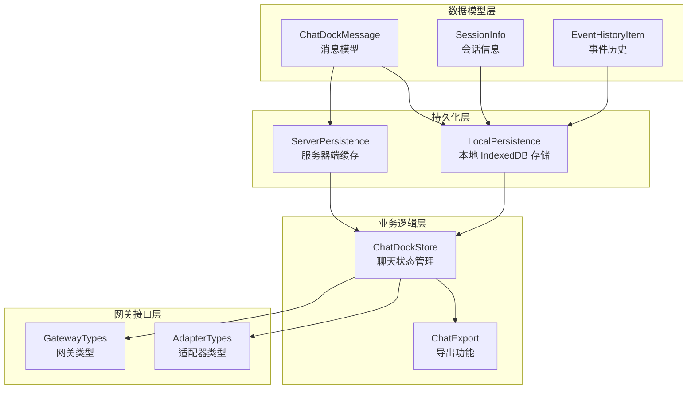

**图表来源**
- [src/lib/local-persistence.ts:1-408](file://src/lib/local-persistence.ts#L1-L408)
- [src/lib/server-persistence.ts:1-138](file://src/lib/server-persistence.ts#L1-L138)
- [src/store/console-stores/chat-dock-store.ts:1-1703](file://src/store/console-stores/chat-dock-store.ts#L1-L1703)

**章节来源**
- [src/lib/local-persistence.ts:1-408](file://src/lib/local-persistence.ts#L1-L408)
- [src/lib/server-persistence.ts:1-138](file://src/lib/server-persistence.ts#L1-L138)
- [src/store/console-stores/chat-dock-store.ts:1-1703](file://src/store/console-stores/chat-dock-store.ts#L1-L1703)

## 核心组件

### LocalPersistence - 本地持久化组件

LocalPersistence 是基于 IndexedDB 的本地存储解决方案，提供以下核心功能：

#### 主要特性
- **多存储容器**：维护三个独立的对象存储空间
- **智能索引**：为查询优化建立复合索引
- **容量管理**：自动清理过期数据和超限数据
- **事务处理**：确保数据一致性的事务操作

#### 存储结构
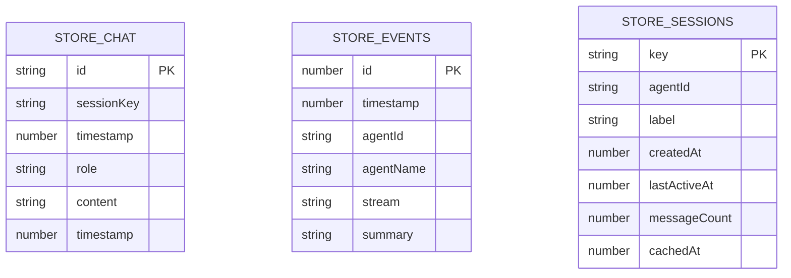

**图表来源**
- [src/lib/local-persistence.ts:30-32](file://src/lib/local-persistence.ts#L30-L32)
- [src/lib/local-persistence.ts:14-20](file://src/lib/local-persistence.ts#L14-L20)

#### 关键配置参数
- **默认数据库名称**：`openclaw-office-cache`
- **默认版本号**：2
- **每会话最大消息数**：500条
- **事件历史上限**：1000条
- **消息过期时间**：30天
- **事件过期时间**：7天

**章节来源**
- [src/lib/local-persistence.ts:5-28](file://src/lib/local-persistence.ts#L5-L28)
- [src/lib/local-persistence.ts:30-32](file://src/lib/local-persistence.ts#L30-L32)

### ServerPersistence - 服务器端持久化

ServerPersistence 提供基于 HTTP API 的服务器端缓存服务：

#### 缓存策略
- **防抖机制**：2秒内多次保存合并为一次请求
- **异步保存**：不阻塞用户交互
- **即时保存**：必要时立即同步保存

#### API 接口
- `/api/chat-cache/messages` - 消息缓存
- `/api/chat-cache/sessions` - 会话缓存
- `/api/chat-cache/all-messages` - 全部消息统计

**章节来源**
- [src/lib/server-persistence.ts:25-26](file://src/lib/server-persistence.ts#L25-L26)
- [src/lib/server-persistence.ts:41-51](file://src/lib/server-persistence.ts#L41-L51)

### ChatDockStore - 聊天状态管理

ChatDockStore 是整个聊天历史持久化的协调中心，负责：

#### 多层加载策略
1. **服务器缓存优先**：快速获取最近历史
2. **本地 IndexedDB 回退**：确保离线可用性
3. **网关 RPC 最终一致性**：获取最新完整历史

#### 实时同步机制
- **增量更新**：仅同步新增或修改的消息
- **冲突解决**：智能合并不同来源的数据
- **状态保持**：在切换会话时保持消息状态

**章节来源**
- [src/store/console-stores/chat-dock-store.ts:1347-1454](file://src/store/console-stores/chat-dock-store.ts#L1347-L1454)
- [src/store/console-stores/chat-dock-store.ts:979-1012](file://src/store/console-stores/chat-dock-store.ts#L979-L1012)

## 架构概览

聊天历史持久化采用三层缓存架构，确保最佳的性能和可靠性：

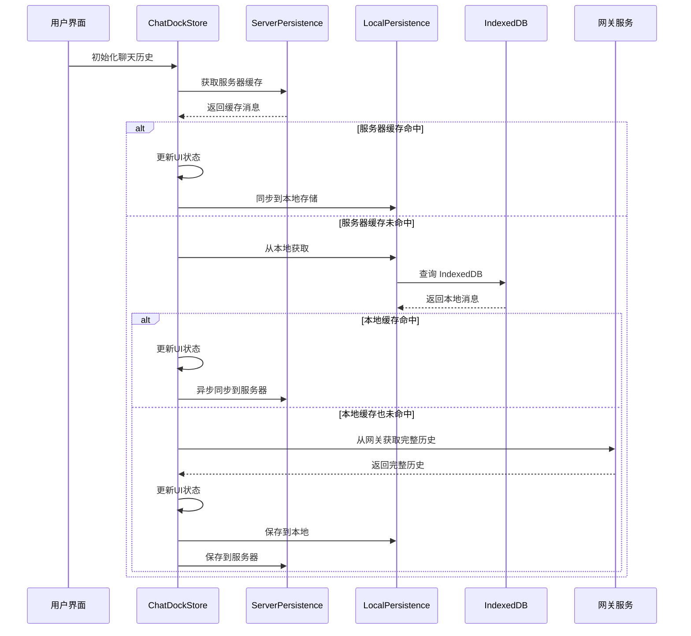

**图表来源**
- [src/store/console-stores/chat-dock-store.ts:1347-1454](file://src/store/console-stores/chat-dock-store.ts#L1347-L1454)
- [src/lib/server-persistence.ts:54-63](file://src/lib/server-persistence.ts#L54-L63)
- [src/lib/local-persistence.ts:97-109](file://src/lib/local-persistence.ts#L97-L109)

### 数据流架构

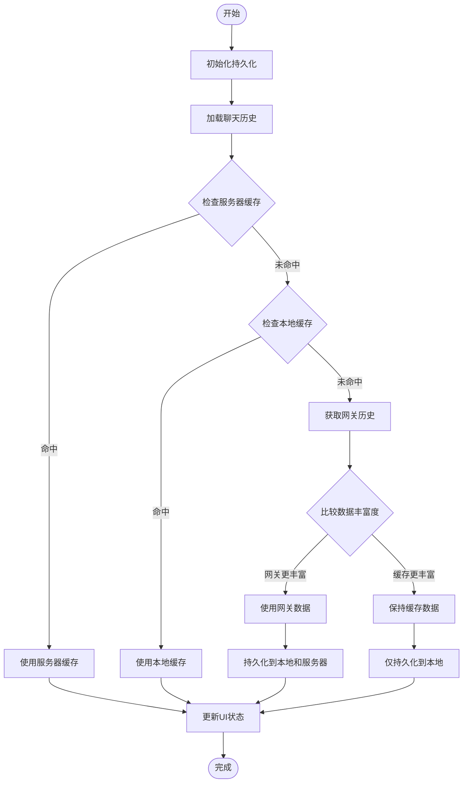

**图表来源**
- [src/store/console-stores/chat-dock-store.ts:1347-1454](file://src/store/console-stores/chat-dock-store.ts#L1347-L1454)
- [src/lib/local-persistence.ts:1383-1400](file://src/lib/local-persistence.ts#L1383-L1400)

## 详细组件分析

### LocalPersistence 组件详解

#### 数据模型设计

LocalPersistence 使用三个专门的对象存储来组织不同类型的数据：

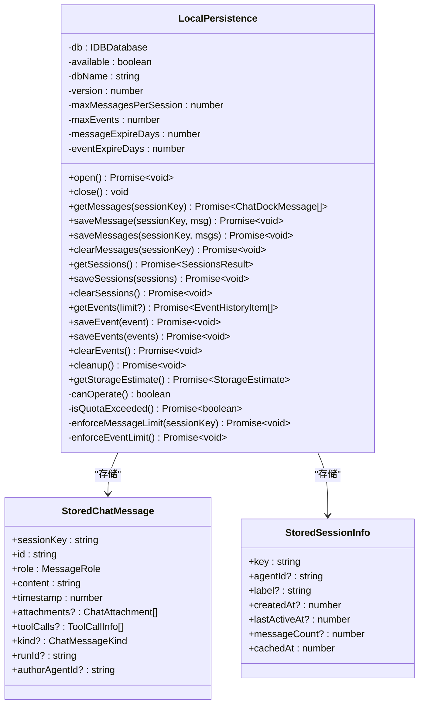

**图表来源**
- [src/lib/local-persistence.ts:34-42](file://src/lib/local-persistence.ts#L34-L42)
- [src/lib/local-persistence.ts:14-20](file://src/lib/local-persistence.ts#L14-L20)

#### 索引优化策略

为了支持高效的查询，LocalPersistence 为每个存储建立了专门的索引：

| 存储名称 | 主键 | 索引字段 | 查询用途 |
|---------|------|----------|----------|
| chat_messages | id | sessionKey, timestamp, [sessionKey, timestamp] | 会话查询、时间排序、范围查询 |
| event_history | 自增ID | timestamp | 时间排序、范围查询 |
| chat_sessions | key | lastActiveAt, cachedAt | 活跃度排序、缓存时间排序 |

**章节来源**
- [src/lib/local-persistence.ts:64-78](file://src/lib/local-persistence.ts#L64-L78)
- [src/lib/local-persistence.ts:102-105](file://src/lib/local-persistence.ts#L102-L105)

#### 容量管理机制

LocalPersistence 实现了多层次的容量管理：

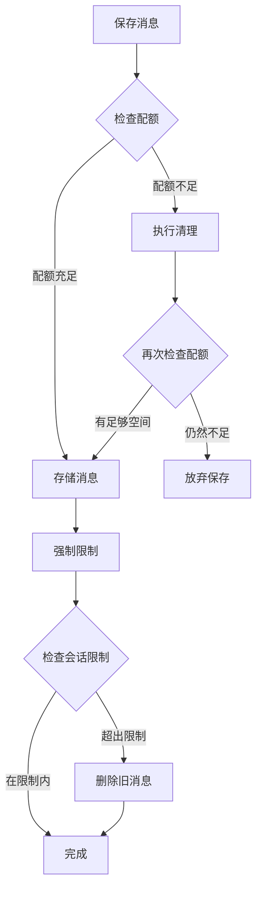

**图表来源**
- [src/lib/local-persistence.ts:326-338](file://src/lib/local-persistence.ts#L326-L338)
- [src/lib/local-persistence.ts:340-357](file://src/lib/local-persistence.ts#L340-L357)

**章节来源**
- [src/lib/local-persistence.ts:275-306](file://src/lib/local-persistence.ts#L275-L306)
- [src/lib/local-persistence.ts:326-385](file://src/lib/local-persistence.ts#L326-L385)

### ServerPersistence 组件详解

#### 防抖机制实现

ServerPersistence 使用防抖机制来优化网络请求：

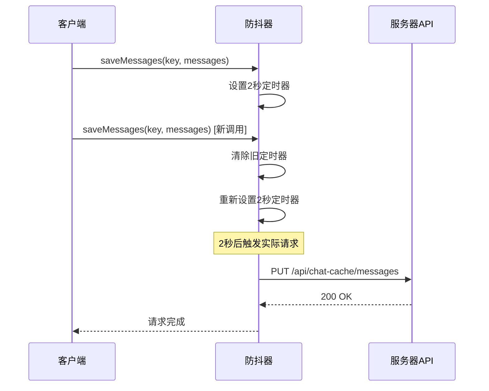

**图表来源**
- [src/lib/server-persistence.ts:41-51](file://src/lib/server-persistence.ts#L41-L51)
- [src/lib/server-persistence.ts:65-72](file://src/lib/server-persistence.ts#L65-L72)

#### API 接口规范

| 接口 | 方法 | 参数 | 返回值 | 描述 |
|------|------|------|--------|------|
| `/api/chat-cache/messages` | GET | `sessionKey` | `ServerCacheMessagesResponse` | 获取指定会话的历史消息 |
| `/api/chat-cache/messages` | PUT | `sessionKey, messages, agentId` | `void` | 保存消息到服务器缓存 |
| `/api/chat-cache/messages` | DELETE | `sessionKey` | `void` | 清空指定会话的缓存 |
| `/api/chat-cache/sessions` | GET | 无 | `ServerCacheSessionsResponse` | 获取所有会话信息 |
| `/api/chat-cache/sessions` | PUT | `sessions` | `void` | 保存会话列表到服务器缓存 |
| `/api/chat-cache/all-messages` | GET | 无 | `ServerCacheAllMessagesResponse` | 获取所有会话的消息计数 |

**章节来源**
- [src/lib/server-persistence.ts:4-24](file://src/lib/server-persistence.ts#L4-L24)
- [src/lib/server-persistence.ts:54-127](file://src/lib/server-persistence.ts#L54-L127)

### ChatDockStore 组件详解

#### 初始化历史流程

ChatDockStore 的 initializeHistory 方法实现了复杂的多层加载策略：

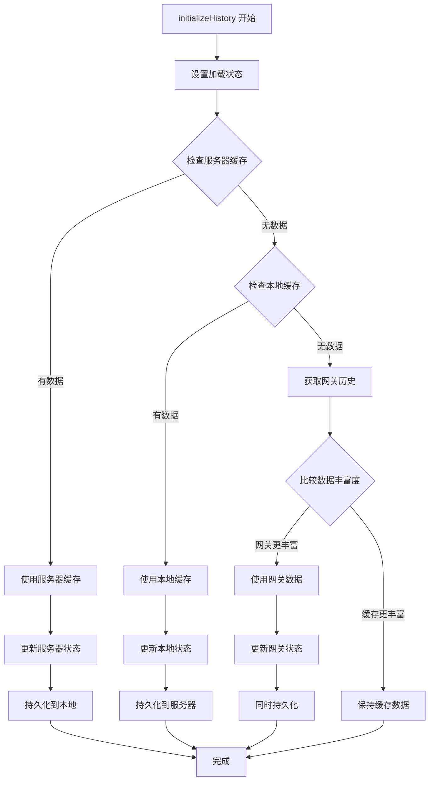

**图表来源**
- [src/store/console-stores/chat-dock-store.ts:1347-1454](file://src/store/console-stores/chat-dock-store.ts#L1347-L1454)

#### 实时事件处理

ChatDockStore 能够实时处理来自网关的各种事件：

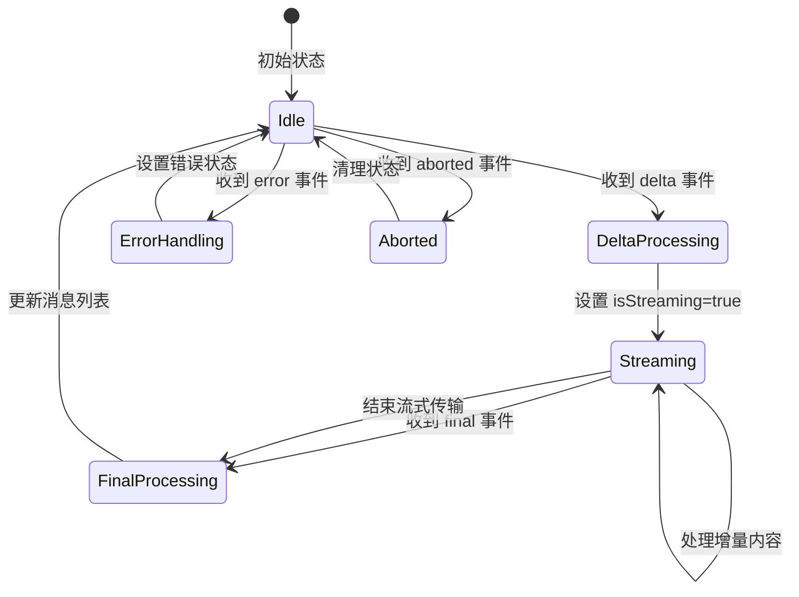

**图表来源**
- [src/store/console-stores/chat-dock-store.ts:177-309](file://src/store/console-stores/chat-dock-store.ts#L177-L309)

**章节来源**
- [src/store/console-stores/chat-dock-store.ts:1347-1544](file://src/store/console-stores/chat-dock-store.ts#L1347-L1544)
- [src/store/console-stores/chat-dock-store.ts:1491-1544](file://src/store/console-stores/chat-dock-store.ts#L1491-L1544)

## 依赖关系分析

### 组件间依赖关系

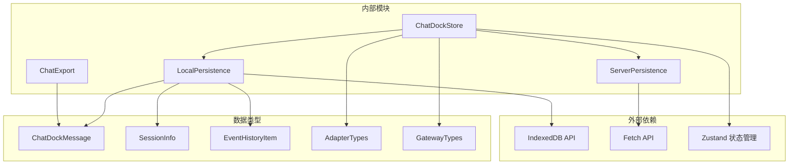

**图表来源**
- [src/lib/local-persistence.ts:1-408](file://src/lib/local-persistence.ts#L1-L408)
- [src/lib/server-persistence.ts:1-138](file://src/lib/server-persistence.ts#L1-L138)
- [src/store/console-stores/chat-dock-store.ts:1-1703](file://src/store/console-stores/chat-dock-store.ts#L1-L1703)

### 数据类型依赖

系统使用 TypeScript 接口来确保类型安全：

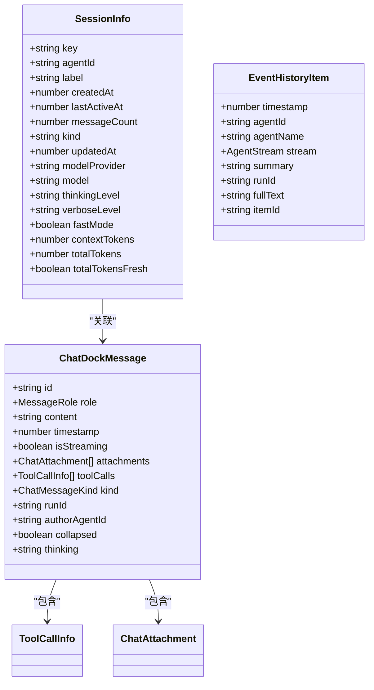

**图表来源**
- [src/gateway/adapter-types.ts:149-161](file://src/gateway/adapter-types.ts#L149-L161)
- [src/gateway/adapter-types.ts:195-212](file://src/gateway/adapter-types.ts#L195-L212)
- [src/gateway/types.ts:210-222](file://src/gateway/types.ts#L210-L222)

**章节来源**
- [src/gateway/adapter-types.ts:1-458](file://src/gateway/adapter-types.ts#L1-L458)
- [src/gateway/types.ts:1-402](file://src/gateway/types.ts#L1-L402)

## 性能考虑

### 查询优化策略

#### 索引使用策略

LocalPersistence 通过精心设计的索引来优化查询性能：

1. **会话查询优化**：使用复合索引 `[sessionKey, timestamp]` 实现 O(log n) 的范围查询
2. **时间排序优化**：单独的 `timestamp` 索引支持高效的排序操作
3. **会话活跃度排序**：`lastActiveAt` 和 `cachedAt` 索引支持会话列表的快速排序

#### 内存管理

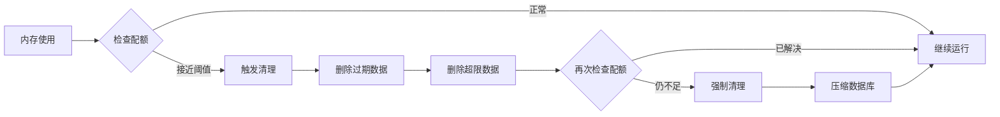

**图表来源**
- [src/lib/local-persistence.ts:326-338](file://src/lib/local-persistence.ts#L326-L338)
- [src/lib/local-persistence.ts:275-306](file://src/lib/local-persistence.ts#L275-L306)

### 网络优化

#### 防抖机制效果

ServerPersistence 的防抖机制显著减少了网络请求次数：

- **批量合并**：连续的保存操作被合并为单个请求
- **延迟提交**：2秒延迟确保最后一次操作被提交
- **内存效率**：避免频繁的网络往返

#### 缓存策略

多层缓存策略确保了最佳的用户体验：

1. **服务器缓存**：最快的响应时间（毫秒级）
2. **本地缓存**：离线可用性（毫秒级）
3. **网关缓存**：最终一致性（秒级）

**章节来源**
- [src/lib/server-persistence.ts:26-27](file://src/lib/server-persistence.ts#L26-L27)
- [src/lib/local-persistence.ts:28-28](file://src/lib/local-persistence.ts#L28-L28)

## 故障排除指南

### 常见问题诊断

#### IndexedDB 不可用

当浏览器不支持 IndexedDB 或用户禁用了本地存储时：

1. **检测机制**：LocalPersistence 会检测环境并降级为内存模式
2. **功能限制**：只能使用服务器缓存，无法进行本地持久化
3. **用户提示**：应用会优雅地处理此情况

#### 存储配额不足

当存储空间接近 80% 阈值时：

1. **自动清理**：系统会自动删除过期数据
2. **容量监控**：定期检查存储使用情况
3. **用户通知**：在极端情况下可能影响功能

#### 网络连接问题

服务器缓存不可用时的处理流程：

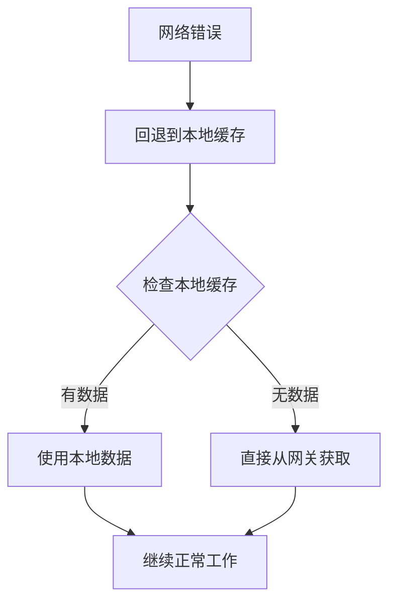

**图表来源**
- [src/store/console-stores/chat-dock-store.ts:1361-1378](file://src/store/console-stores/chat-dock-store.ts#L1361-L1378)

### 调试工具

#### 测试覆盖

项目包含全面的测试用例，涵盖：

- **本地持久化测试**：验证 IndexedDB 操作的正确性
- **会话管理测试**：确保会话状态的一致性
- **历史加载测试**：验证多层缓存策略的有效性

#### 开发者工具

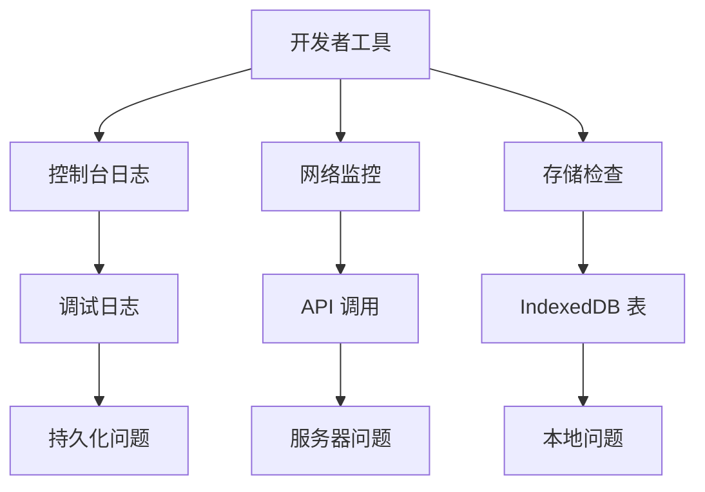

**章节来源**
- [src/lib/__tests__/local-persistence.test.ts:1-202](file://src/lib/__tests__/local-persistence.test.ts#L1-L202)

## 结论

OpenClaw Office 的聊天历史持久化系统通过精心设计的多层缓存架构，实现了高性能、高可靠性的聊天历史管理。系统的主要优势包括：

### 技术亮点

1. **智能缓存策略**：结合服务器端缓存、本地存储和网关数据，确保最佳性能
2. **类型安全**：完整的 TypeScript 类型定义确保数据一致性
3. **容错机制**：多层降级策略确保系统稳定性
4. **性能优化**：索引优化、防抖机制和容量管理提升用户体验

### 应用场景

该系统适用于以下场景：
- **多设备同步**：服务器端缓存确保跨设备一致性
- **离线支持**：本地 IndexedDB 提供离线可用性
- **大数据量处理**：智能清理和限制机制处理大量历史数据
- **实时协作**：高效的增量更新支持多人协作场景

### 未来改进方向

1. **加密存储**：考虑添加本地数据加密功能
2. **增量备份**：实现历史数据的增量备份和恢复
3. **搜索功能**：添加基于内容的搜索能力
4. **数据迁移**：提供向后兼容的数据迁移工具

通过持续优化和扩展，该聊天历史持久化系统将为用户提供更加稳定、高效、安全的聊天体验。