# 聊天工作区

<cite>
**本文引用的文件**
- [ChatWorkspaceBootstrap.tsx](file://src/components/chat/ChatWorkspaceBootstrap.tsx)
- [chat-dock-store.ts](file://src/store/console-stores/chat-dock-store.ts)
- [ChatDialog.tsx](file://src/components/chat/ChatDialog.tsx)
- [MessageBubble.tsx](file://src/components/chat/MessageBubble.tsx)
- [MarkdownContent.tsx](file://src/components/chat/MarkdownContent.tsx)
- [useChatStreamingText.ts](file://src/hooks/useChatStreamingText.ts)
- [chat-slash-commands.ts](file://src/lib/chat-slash-commands.ts)
- [chat-export.ts](file://src/lib/chat-export.ts)
- [message-utils.ts](file://src/lib/message-utils.ts)
- [local-persistence.ts](file://src/lib/local-persistence.ts)
- [server-persistence.ts](file://src/lib/server-persistence.ts)
- [ws-client.ts](file://src/gateway/ws-client.ts)
- [SessionSwitcher.tsx](file://src/components/chat/SessionSwitcher.tsx)
- [AgentSelector.tsx](file://src/components/chat/AgentSelector.tsx)
- [session-key-utils.ts](file://src/lib/session-key-utils.ts)
</cite>

## 目录
1. [简介](#简介)
2. [项目结构](#项目结构)
3. [核心组件](#核心组件)
4. [架构总览](#架构总览)
5. [详细组件分析](#详细组件分析)
6. [依赖关系分析](#依赖关系分析)
7. [性能考量](#性能考量)
8. [故障排查指南](#故障排查指南)
9. [结论](#结论)
10. [附录：扩展与定制指南](#附录扩展与定制指南)

## 简介
本文件面向OpenClaw Office的“聊天工作区”，系统性阐述其独立的前端架构、会话管理、实时流式转录、历史持久化、工具调用可视化、斜杠命令系统、消息渲染引擎、附件处理、搜索与导出、专注模式等能力，并提供扩展指引（新增斜杠命令、自定义消息格式、新附件类型支持）。同时解释与WebSocket通信层的集成方式与性能优化策略。

## 项目结构
聊天工作区由“UI组件层”“状态与业务逻辑层（Zustand Store）”“通信层（WebSocket）”“持久化层（IndexedDB + 服务端缓存）”四部分组成，采用模块化组织，便于扩展与维护。

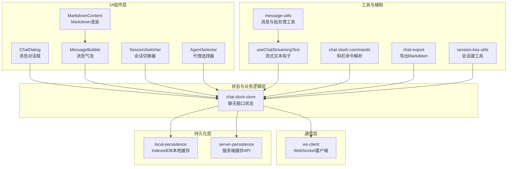

图表来源
- [ChatDialog.tsx:30-432](file://src/components/chat/ChatDialog.tsx#L30-L432)
- [MessageBubble.tsx:160-257](file://src/components/chat/MessageBubble.tsx#L160-L257)
- [MarkdownContent.tsx:22-133](file://src/components/chat/MarkdownContent.tsx#L22-L133)
- [SessionSwitcher.tsx:28-187](file://src/components/chat/SessionSwitcher.tsx#L28-L187)
- [AgentSelector.tsx:13-141](file://src/components/chat/AgentSelector.tsx#L13-L141)
- [chat-dock-store.ts:1-1703](file://src/store/console-stores/chat-dock-store.ts#L1-L1703)
- [ws-client.ts:22-304](file://src/gateway/ws-client.ts#L22-L304)
- [local-persistence.ts:34-408](file://src/lib/local-persistence.ts#L34-L408)
- [server-persistence.ts:53-138](file://src/lib/server-persistence.ts#L53-L138)
- [useChatStreamingText.ts:78-88](file://src/hooks/useChatStreamingText.ts#L78-L88)
- [chat-slash-commands.ts:60-106](file://src/lib/chat-slash-commands.ts#L60-L106)
- [chat-export.ts:7-44](file://src/lib/chat-export.ts#L7-L44)
- [message-utils.ts:55-112](file://src/lib/message-utils.ts#L55-L112)
- [session-key-utils.ts:15-54](file://src/lib/session-key-utils.ts#L15-L54)

章节来源
- [ChatDialog.tsx:30-432](file://src/components/chat/ChatDialog.tsx#L30-L432)
- [chat-dock-store.ts:1-1703](file://src/store/console-stores/chat-dock-store.ts#L1-L1703)

## 核心组件
- 聊天舱口状态（chat-dock-store）
  - 统一管理消息、会话、流式状态、队列、错误、草稿、附件、聚焦模式、搜索词、置顶消息等。
  - 提供发送消息、中止、切换会话、新建会话、加载历史、初始化事件监听、导出当前会话等功能。
- 实时流式文本钩子（useChatStreamingText）
  - 从store中派生当前流式文本与思考文本，剥离思考标签，供UI渲染。
- 消息渲染引擎（MessageBubble + MarkdownContent）
  - 支持用户/助手/系统消息、工具活动气泡、Markdown渲染、Mermaid图预览、图片附件、思考块、流式指示器。
- 会话管理（SessionSwitcher + AgentSelector + ChatWorkspaceBootstrap）
  - 会话列表、快速新建、按代理筛选；代理选择；连接后自动设置目标代理并初始化事件监听。
- 斜杠命令系统（chat-slash-commands）
  - 内置命令集与帮助构建；解析输入中的斜杠命令并执行本地行为。
- 导出与搜索（chat-export + store搜索字段）
  - 将当前会话导出为Markdown；支持搜索词过滤显示。
- 附件处理（ChatDialog + store）
  - 文件读取为DataURL，支持图片预览与清空。
- 持久化（local-persistence + server-persistence）
  - IndexedDB本地缓存消息与会话；服务端缓存API进行去抖保存与批量清理。
- WebSocket通信（ws-client）
  - 连接管理、鉴权挑战、事件分发、重连策略、状态回调。

章节来源
- [chat-dock-store.ts:57-107](file://src/store/console-stores/chat-dock-store.ts#L57-L107)
- [useChatStreamingText.ts:78-88](file://src/hooks/useChatStreamingText.ts#L78-L88)
- [MessageBubble.tsx:160-257](file://src/components/chat/MessageBubble.tsx#L160-L257)
- [MarkdownContent.tsx:22-133](file://src/components/chat/MarkdownContent.tsx#L22-L133)
- [SessionSwitcher.tsx:28-187](file://src/components/chat/SessionSwitcher.tsx#L28-L187)
- [AgentSelector.tsx:13-141](file://src/components/chat/AgentSelector.tsx#L13-L141)
- [ChatWorkspaceBootstrap.tsx:10-51](file://src/components/chat/ChatWorkspaceBootstrap.tsx#L10-L51)
- [chat-slash-commands.ts:60-106](file://src/lib/chat-slash-commands.ts#L60-L106)
- [chat-export.ts:7-44](file://src/lib/chat-export.ts#L7-L44)
- [local-persistence.ts:34-408](file://src/lib/local-persistence.ts#L34-L408)
- [server-persistence.ts:53-138](file://src/lib/server-persistence.ts#L53-L138)
- [ws-client.ts:22-304](file://src/gateway/ws-client.ts#L22-L304)

## 架构总览
聊天工作区以Zustand Store为核心，围绕“消息-会话-工具-命令-渲染-持久化-通信”闭环展开。UI组件通过store暴露的方法与派生数据驱动交互；store通过适配器与WebSocket与后端通信；消息与会话通过本地IndexedDB与服务端缓存协同持久化。

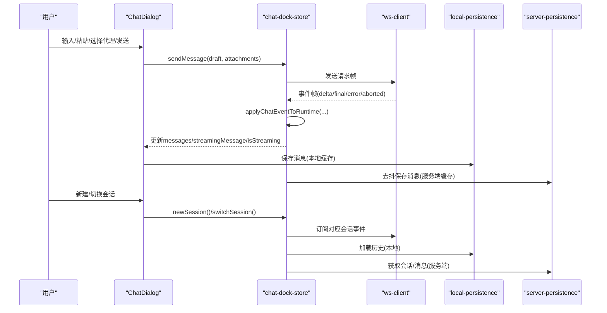

图表来源
- [ChatDialog.tsx:172-176](file://src/components/chat/ChatDialog.tsx#L172-L176)
- [chat-dock-store.ts:177-309](file://src/store/console-stores/chat-dock-store.ts#L177-L309)
- [ws-client.ts:79-96](file://src/gateway/ws-client.ts#L79-L96)
- [local-persistence.ts:111-151](file://src/lib/local-persistence.ts#L111-L151)
- [server-persistence.ts:65-84](file://src/lib/server-persistence.ts#L65-L84)

## 详细组件分析

### 会话管理系统（创建/切换/路由）
- 会话键规范与命名空间
  - 主代理会话键：agent:<agentId>:main
  - 子代理会话键：agent:<parentId>:subagent:<uuid>
  - 命名空间提取、父命名空间提取、agentId提取等工具方法确保跨页面/跨会话路由一致。
- 会话创建与切换
  - 新建会话：根据目标代理生成会话键，合并到会话列表并更新当前会话。
  - 切换会话：加载对应会话的历史消息，恢复滚动位置与草稿。
- 目标代理与路由
  - 连接建立后自动设置目标代理；当选择主面板选中的代理时同步到目标代理，保证消息路由正确。

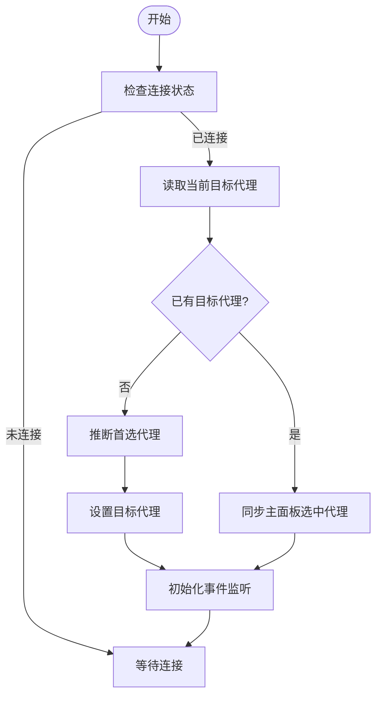

图表来源
- [ChatWorkspaceBootstrap.tsx:17-47](file://src/components/chat/ChatWorkspaceBootstrap.tsx#L17-L47)
- [session-key-utils.ts:15-54](file://src/lib/session-key-utils.ts#L15-L54)

章节来源
- [ChatWorkspaceBootstrap.tsx:10-51](file://src/components/chat/ChatWorkspaceBootstrap.tsx#L10-L51)
- [session-key-utils.ts:15-54](file://src/lib/session-key-utils.ts#L15-L54)
- [chat-dock-store.ts:397-451](file://src/store/console-stores/chat-dock-store.ts#L397-L451)

### 实时流式转录机制
- 流式事件解析
  - delta：增量文本/内容，进入streamingMessage，标记isStreaming=true。
  - final：拼接增量，写入messages，清除streamingMessage，停止流式。
  - error/aborted：清理流式状态，必要时触发历史重载。
- 思考文本与可见文本分离
  - 从content或text字段抽取思考块，剥离思考标签后作为可见回复。
- 批量调度与节流
  - 使用批处理调度器合并短间隔增量，避免频繁重渲染。

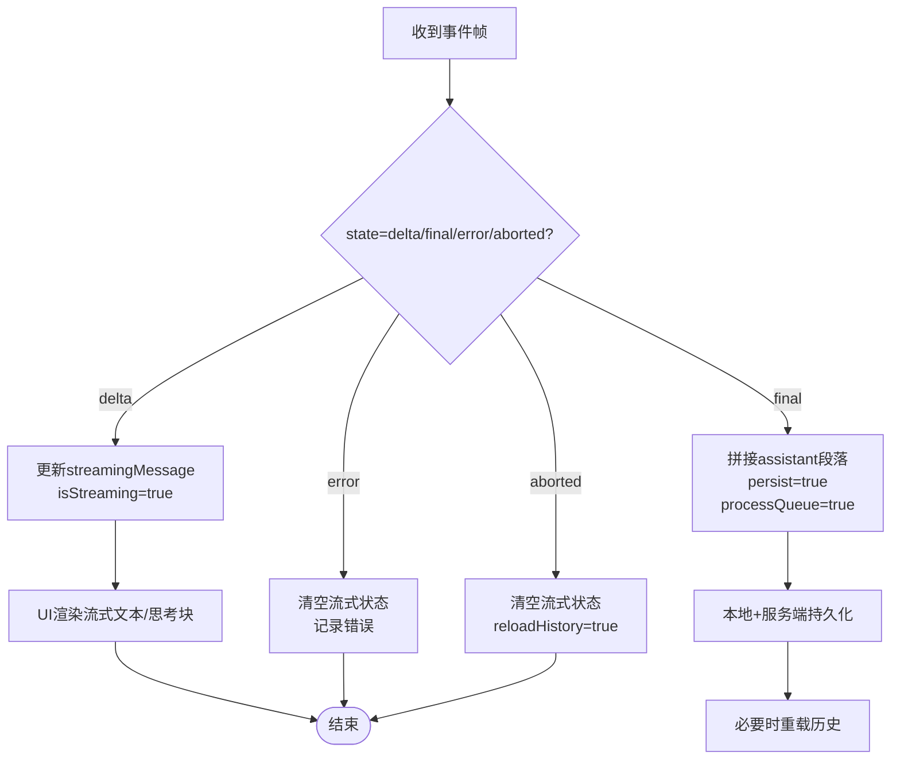

图表来源
- [chat-dock-store.ts:177-309](file://src/store/console-stores/chat-dock-store.ts#L177-L309)
- [useChatStreamingText.ts:78-88](file://src/hooks/useChatStreamingText.ts#L78-L88)
- [message-utils.ts:55-112](file://src/lib/message-utils.ts#L55-L112)

章节来源
- [chat-dock-store.ts:177-309](file://src/store/console-stores/chat-dock-store.ts#L177-L309)
- [useChatStreamingText.ts:78-88](file://src/hooks/useChatStreamingText.ts#L78-L88)
- [message-utils.ts:55-112](file://src/lib/message-utils.ts#L55-L112)

### 聊天历史持久化策略
- 本地持久化（IndexedDB）
  - 存储消息、会话、事件历史；按会话键索引；限制每会话消息数量；定期清理过期消息与事件。
- 服务端持久化（HTTP API）
  - 去抖保存消息与会话；支持立即保存；批量获取消息计数用于提示。
- 启动流程
  - 模块加载即尝试打开DB；首次加载会话时从本地与服务端合并加载。

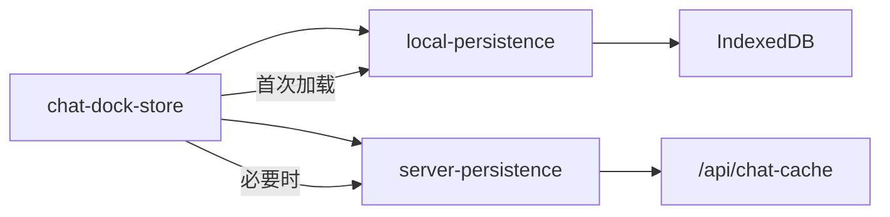

图表来源
- [local-persistence.ts:34-408](file://src/lib/local-persistence.ts#L34-L408)
- [server-persistence.ts:53-138](file://src/lib/server-persistence.ts#L53-L138)
- [chat-dock-store.ts:792-799](file://src/store/console-stores/chat-dock-store.ts#L792-L799)

章节来源
- [local-persistence.ts:34-408](file://src/lib/local-persistence.ts#L34-L408)
- [server-persistence.ts:53-138](file://src/lib/server-persistence.ts#L53-L138)
- [chat-dock-store.ts:792-799](file://src/store/console-stores/chat-dock-store.ts#L792-L799)

### 工具调用可视化展示
- 工具活动消息
  - 当存在toolCalls时，系统消息以“工具活动”气泡展示，支持展开查看参数与结果。
- 运行状态
  - running/done/error三种状态，分别高亮不同边框与背景色。
- 事件驱动
  - 代理事件（phase=start/finish）触发工具消息插入与状态更新。

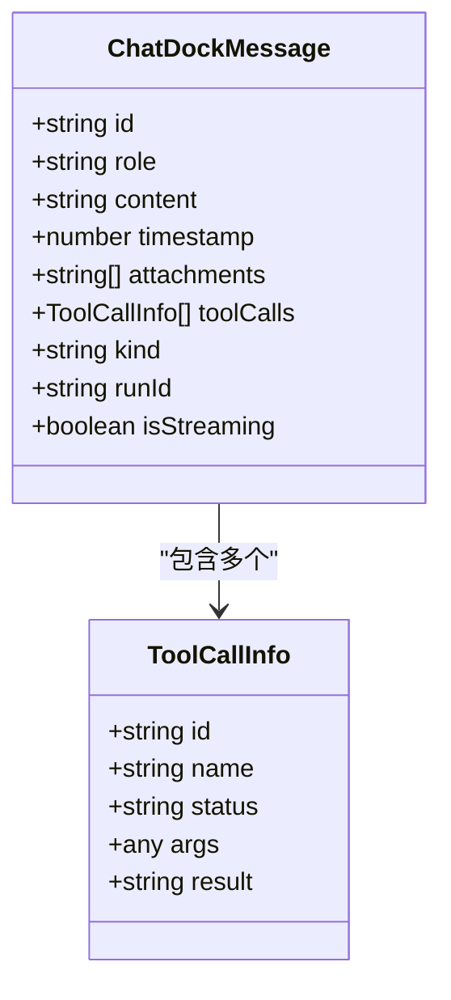

图表来源
- [chat-dock-store.ts:29-43](file://src/store/console-stores/chat-dock-store.ts#L29-L43)
- [MessageBubble.tsx:75-158](file://src/components/chat/MessageBubble.tsx#L75-L158)

章节来源
- [chat-dock-store.ts:320-395](file://src/store/console-stores/chat-dock-store.ts#L320-L395)
- [MessageBubble.tsx:75-158](file://src/components/chat/MessageBubble.tsx#L75-L158)

### 斜杠命令系统实现
- 命令定义
  - 内置命令集合（help/new/reset/stop/clear/focus/export/agents/model/think/verbose/fast/compact等），支持参数与选项。
- 解析与执行
  - 解析输入前缀“/”及首个空白/冒号后的参数；匹配命令后返回命令定义与参数。
- 帮助文本
  - 动态构建斜杠命令帮助文本，用于提示用户。

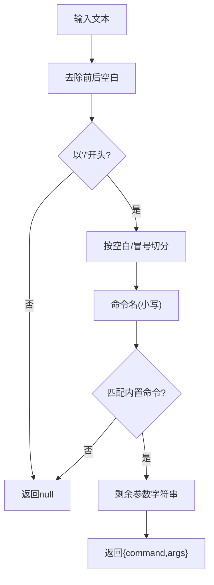

图表来源
- [chat-slash-commands.ts:72-94](file://src/lib/chat-slash-commands.ts#L72-L94)
- [chat-slash-commands.ts:60-106](file://src/lib/chat-slash-commands.ts#L60-L106)

章节来源
- [chat-slash-commands.ts:3-58](file://src/lib/chat-slash-commands.ts#L3-L58)
- [chat-slash-commands.ts:72-94](file://src/lib/chat-slash-commands.ts#L72-L94)
- [chat-slash-commands.ts:96-106](file://src/lib/chat-slash-commands.ts#L96-L106)

### 消息渲染引擎与附件处理
- 渲染引擎
  - 用户消息直接渲染；助手消息支持Markdown、表格、Mermaid图、代码块、链接等；支持流式渲染与思考块。
- 附件处理
  - 图片附件以DataURL形式存储与渲染；支持多附件网格展示；支持清空附件。
- 专注模式
  - store中提供focusMode开关，可配合UI样式隐藏非关键元素，提升专注度。

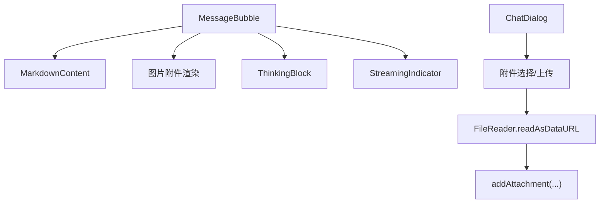

图表来源
- [MessageBubble.tsx:160-257](file://src/components/chat/MessageBubble.tsx#L160-L257)
- [MarkdownContent.tsx:22-133](file://src/components/chat/MarkdownContent.tsx#L22-L133)
- [ChatDialog.tsx:177-192](file://src/components/chat/ChatDialog.tsx#L177-L192)

章节来源
- [MessageBubble.tsx:160-257](file://src/components/chat/MessageBubble.tsx#L160-L257)
- [MarkdownContent.tsx:22-133](file://src/components/chat/MarkdownContent.tsx#L22-L133)
- [ChatDialog.tsx:177-192](file://src/components/chat/ChatDialog.tsx#L177-L192)

### 搜索与导出功能
- 搜索
  - store中维护searchQuery，可在渲染层结合该字段对消息进行过滤显示（具体过滤逻辑在渲染侧实现）。
- 导出
  - 将当前会话消息序列化为Markdown，自动下载文件，文件名为会话键的规范化版本。

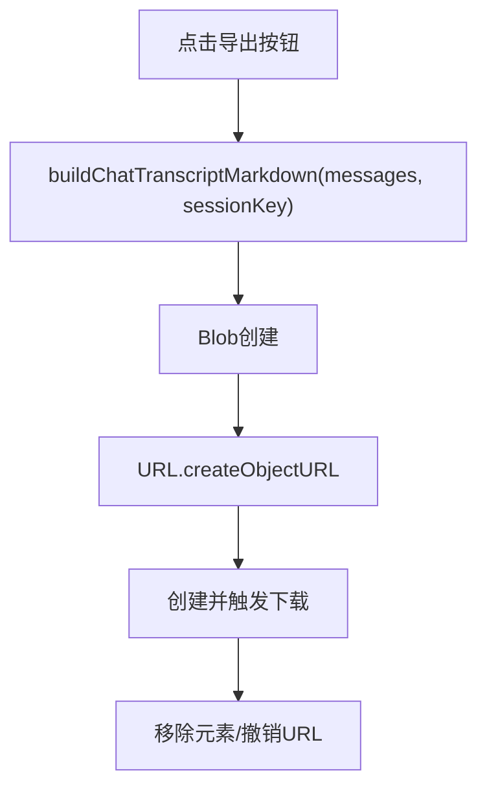

图表来源
- [chat-export.ts:7-44](file://src/lib/chat-export.ts#L7-L44)
- [chat-dock-store.ts:106-106](file://src/store/console-stores/chat-dock-store.ts#L106-L106)

章节来源
- [chat-export.ts:7-44](file://src/lib/chat-export.ts#L7-L44)
- [chat-dock-store.ts:106-106](file://src/store/console-stores/chat-dock-store.ts#L106-L106)

### 与WebSocket通信层的集成
- 连接与认证
  - 客户端在connect阶段发送“connect”请求，携带角色、能力、设备身份签名等；服务端返回“hello-ok”确认。
- 事件订阅
  - store通过initEventListeners注册事件处理器，接收delta/final/error/aborted等事件帧。
- 重连策略
  - 指数退避+抖动，最大延迟上限；关闭时清理定时器。

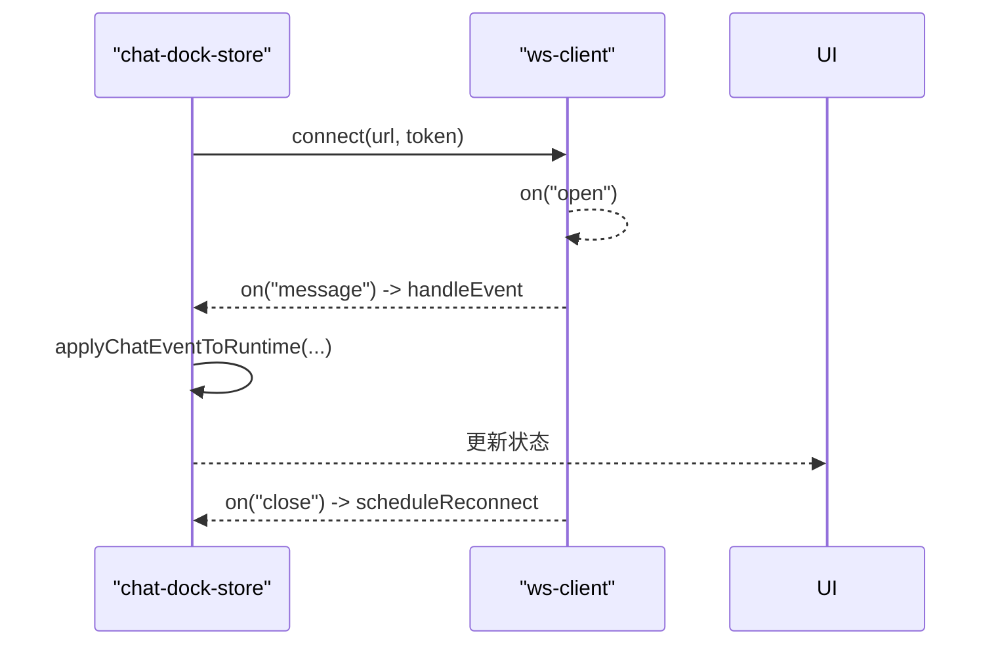

图表来源
- [ws-client.ts:60-130](file://src/gateway/ws-client.ts#L60-L130)
- [ws-client.ts:149-181](file://src/gateway/ws-client.ts#L149-L181)
- [ws-client.ts:270-288](file://src/gateway/ws-client.ts#L270-L288)
- [chat-dock-store.ts:93-97](file://src/store/console-stores/chat-dock-store.ts#L93-L97)

章节来源
- [ws-client.ts:22-304](file://src/gateway/ws-client.ts#L22-L304)
- [chat-dock-store.ts:93-97](file://src/store/console-stores/chat-dock-store.ts#L93-L97)

## 依赖关系分析
- 组件耦合
  - ChatDialog高度依赖chat-dock-store派生数据与动作；MessageBubble仅消费消息模型；MarkdownContent为纯渲染组件。
- 外部依赖
  - IndexedDB（本地缓存）、服务端API（远端缓存）、WebSocket（实时事件）、i18n（文案）、react-markdown/remarkGfm（渲染）。
- 可能的循环依赖
  - 通过store集中状态，避免组件间直接互相依赖；工具函数（如session-key-utils）无状态，低耦合。

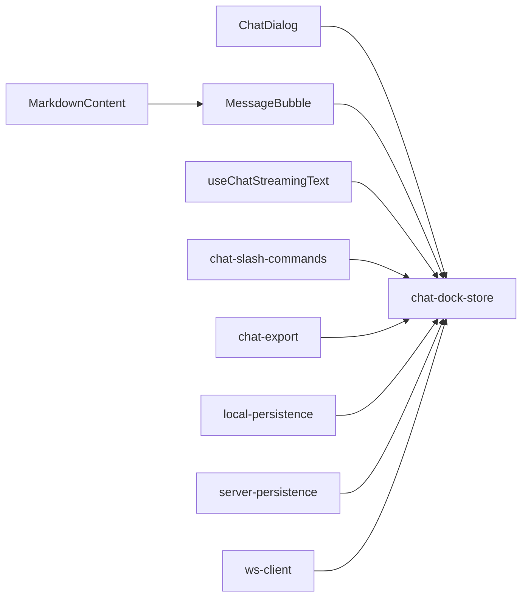

图表来源
- [ChatDialog.tsx:30-50](file://src/components/chat/ChatDialog.tsx#L30-L50)
- [MessageBubble.tsx:160-166](file://src/components/chat/MessageBubble.tsx#L160-L166)
- [MarkdownContent.tsx:22-25](file://src/components/chat/MarkdownContent.tsx#L22-L25)
- [useChatStreamingText.ts:78-82](file://src/hooks/useChatStreamingText.ts#L78-L82)
- [chat-slash-commands.ts:60-65](file://src/lib/chat-slash-commands.ts#L60-L65)
- [chat-export.ts:7-11](file://src/lib/chat-export.ts#L7-L11)
- [local-persistence.ts:34-51](file://src/lib/local-persistence.ts#L34-L51)
- [server-persistence.ts:53-66](file://src/lib/server-persistence.ts#L53-L66)
- [ws-client.ts:22-58](file://src/gateway/ws-client.ts#L22-L58)

章节来源
- [ChatDialog.tsx:30-50](file://src/components/chat/ChatDialog.tsx#L30-L50)
- [MessageBubble.tsx:160-166](file://src/components/chat/MessageBubble.tsx#L160-L166)
- [MarkdownContent.tsx:22-25](file://src/components/chat/MarkdownContent.tsx#L22-L25)
- [useChatStreamingText.ts:78-82](file://src/hooks/useChatStreamingText.ts#L78-L82)
- [chat-slash-commands.ts:60-65](file://src/lib/chat-slash-commands.ts#L60-L65)
- [chat-export.ts:7-11](file://src/lib/chat-export.ts#L7-L11)
- [local-persistence.ts:34-51](file://src/lib/local-persistence.ts#L34-L51)
- [server-persistence.ts:53-66](file://src/lib/server-persistence.ts#L53-L66)
- [ws-client.ts:22-58](file://src/gateway/ws-client.ts#L22-L58)

## 性能考量
- 渲染性能
  - 使用memo包裹MessageBubble，减少不必要的重渲染；流式渲染使用批处理调度器合并增量。
- 通信性能
  - WebSocket事件按需订阅；错误/中止时及时清理流式状态，避免无效渲染。
- 存储性能
  - IndexedDB按会话键索引查询；消息与事件数量上限控制；定期清理过期数据；服务端缓存去抖保存。
- UI体验
  - 自动滚动至底部、拖拽调整高度、输入防抖发送、连接状态提示与重试按钮。

章节来源
- [MessageBubble.tsx:160-166](file://src/components/chat/MessageBubble.tsx#L160-L166)
- [useChatStreamingText.ts:78-88](file://src/hooks/useChatStreamingText.ts#L78-L88)
- [message-utils.ts:55-112](file://src/lib/message-utils.ts#L55-L112)
- [local-persistence.ts:340-357](file://src/lib/local-persistence.ts#L340-L357)
- [server-persistence.ts:41-51](file://src/lib/server-persistence.ts#L41-L51)
- [ChatDialog.tsx:92-110](file://src/components/chat/ChatDialog.tsx#L92-L110)

## 故障排查指南
- 连接问题
  - 检查连接状态回调与重连日志；确认WebSocket URL与令牌；查看设备身份签名是否可用。
- 流式渲染异常
  - 确认事件帧state字段与message结构；检查thinking标签剥离逻辑；验证批处理调度器是否被销毁。
- 历史加载失败
  - 检查本地IndexedDB可用性与事务完成；核对服务端缓存API响应；确认会话键格式。
- 工具调用未显示
  - 确认代理事件是否到达；检查toolCalls字段与系统消息kind标注；验证collapsed默认值。
- 导出失败
  - 检查window/document可用性；确认Blob与URL对象创建；核对文件名规范化规则。

章节来源
- [ws-client.ts:297-302](file://src/gateway/ws-client.ts#L297-L302)
- [chat-dock-store.ts:177-309](file://src/store/console-stores/chat-dock-store.ts#L177-L309)
- [local-persistence.ts:322-338](file://src/lib/local-persistence.ts#L322-L338)
- [server-persistence.ts:28-37](file://src/lib/server-persistence.ts#L28-L37)
- [MessageBubble.tsx:75-158](file://src/components/chat/MessageBubble.tsx#L75-L158)
- [chat-export.ts:25-43](file://src/lib/chat-export.ts#L25-L43)

## 结论
OpenClaw Office的聊天工作区以清晰的分层设计实现了完整的会话生命周期管理、实时流式转录、工具调用可视化、命令与导出、以及本地与服务端双重持久化。通过Zustand集中状态、React组件化渲染、WebSocket事件驱动与IndexedDB/服务端缓存协同，系统具备良好的扩展性与运行效率。后续可通过新增斜杠命令、自定义消息格式与附件类型进一步增强用户体验。

## 附录：扩展与定制指南

### 如何扩展新的斜杠命令
- 在命令定义数组中添加新命令项，指定名称、描述键、参数与可选参数列表。
- 在解析函数中无需修改即可识别新命令；如需本地执行逻辑，可在store中新增分支处理。
- 在帮助文本构建函数中自动包含新命令。

参考路径
- [chat-slash-commands.ts:26-58](file://src/lib/chat-slash-commands.ts#L26-L58)
- [chat-slash-commands.ts:60-106](file://src/lib/chat-slash-commands.ts#L60-L106)

### 如何自定义消息格式
- 在消息模型中增加字段（如kind、collapsed、thinking等），并在渲染组件中补充UI。
- 对于工具调用，保持toolCalls结构不变，系统会自动渲染工具活动气泡。
- 对于思考块，确保content中包含思考标签或thinking字段，渲染层会自动剥离标签。

参考路径
- [chat-dock-store.ts:29-43](file://src/store/console-stores/chat-dock-store.ts#L29-L43)
- [MessageBubble.tsx:209-218](file://src/components/chat/MessageBubble.tsx#L209-L218)

### 如何实现新的附件类型支持
- 在附件处理处扩展支持的mimeType与渲染逻辑（如视频/音频/文件图标）。
- 在消息渲染处增加对应类型的预览组件。
- 若需要服务端缓存，请在服务端API中扩展对应字段与序列化逻辑。

参考路径
- [ChatDialog.tsx:177-192](file://src/components/chat/ChatDialog.tsx#L177-L192)
- [MessageBubble.tsx:238-251](file://src/components/chat/MessageBubble.tsx#L238-L251)