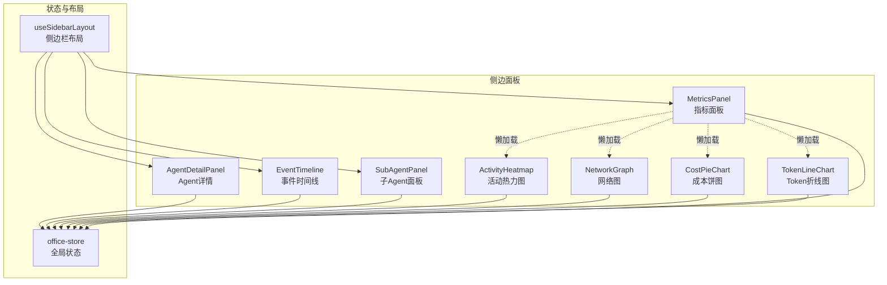
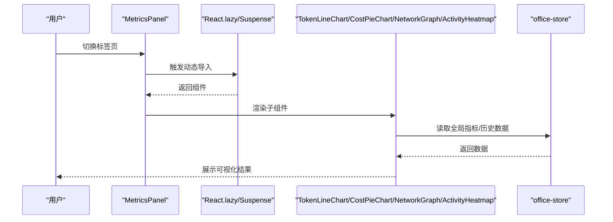
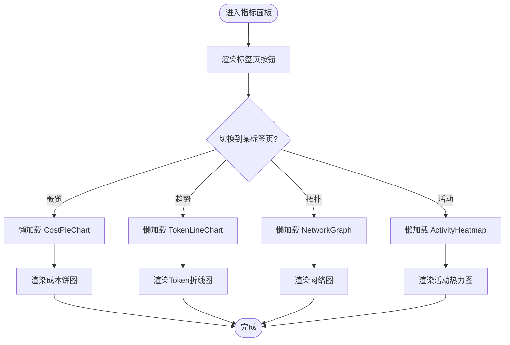
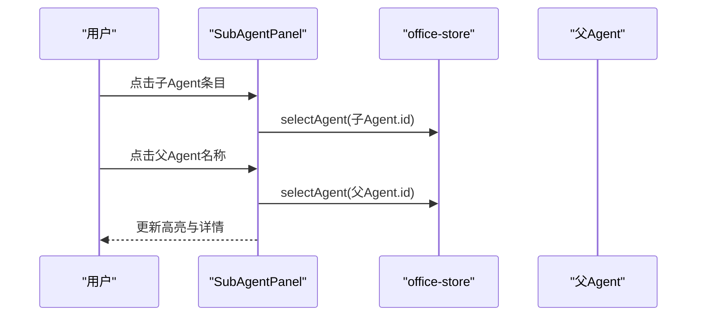
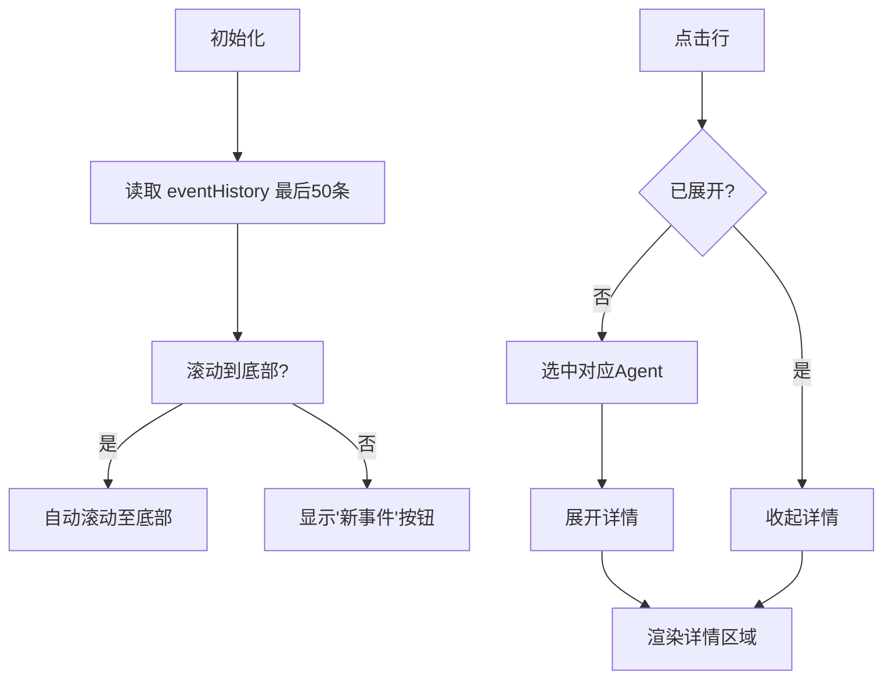
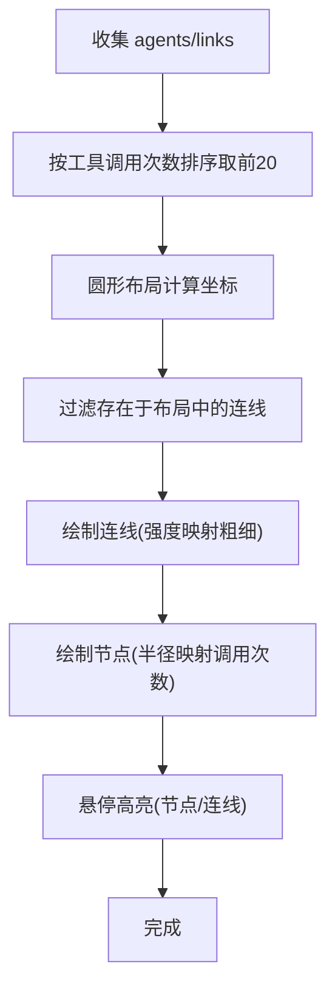
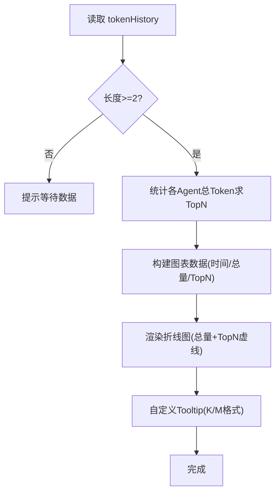
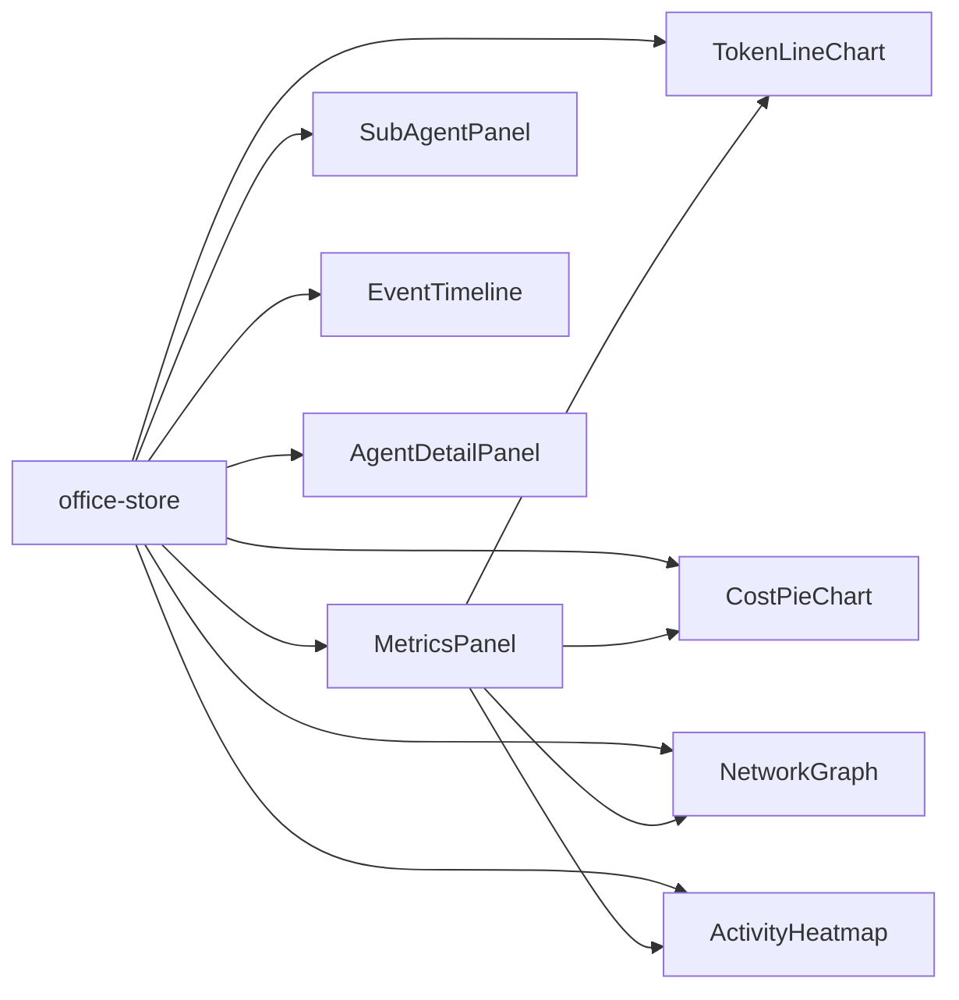

# 侧边面板系统

<cite>
**本文引用的文件**
- [MetricsPanel.tsx](file://src/components/panels/MetricsPanel.tsx)
- [SubAgentPanel.tsx](file://src/components/panels/SubAgentPanel.tsx)
- [EventTimeline.tsx](file://src/components/panels/EventTimeline.tsx)
- [NetworkGraph.tsx](file://src/components/panels/NetworkGraph.tsx)
- [TokenLineChart.tsx](file://src/components/panels/TokenLineChart.tsx)
- [CostPieChart.tsx](file://src/components/panels/CostPieChart.tsx)
- [ActivityHeatmap.tsx](file://src/components/panels/ActivityHeatmap.tsx)
- [AgentDetailPanel.tsx](file://src/components/panels/AgentDetailPanel.tsx)
- [office-store.ts](file://src/store/office-store.ts)
- [useSidebarLayout.ts](file://src/hooks/useSidebarLayout.ts)
</cite>

## 目录
1. [简介](#简介)
2. [项目结构](#项目结构)
3. [核心组件](#核心组件)
4. [架构总览](#架构总览)
5. [组件详解](#组件详解)
6. [依赖关系分析](#依赖关系分析)
7. [性能考量](#性能考量)
8. [故障排查指南](#故障排查指南)
9. [结论](#结论)
10. [附录](#附录)

## 简介
本文件面向“侧边面板系统”的功能与实现，聚焦以下能力：
- 数据面板：全局指标卡片与多标签页切换
- 指标面板：Token 使用趋势、成本分布、网络拓扑、活动热力图
- 事件时间线：事件流滚动、自动滚动、展开查看详情
- 子Agent面板：状态管理、父子关系导航、运行时长格式化
- 布局系统：可折叠、可调整高度的侧边栏分节
- 数据聚合与渲染优化：按需懒加载、数据裁剪、主题适配
- 扩展与定制：如何新增面板类型、自定义数据展示格式、处理大数据量渲染

## 项目结构
侧边面板系统由一组独立的面板组件构成，通过统一的状态存储与布局钩子进行组织与驱动。

**图表来源**
- [MetricsPanel.tsx:1-129](file://src/components/panels/MetricsPanel.tsx#L1-L129)
- [SubAgentPanel.tsx:1-94](file://src/components/panels/SubAgentPanel.tsx#L1-L94)
- [EventTimeline.tsx:1-165](file://src/components/panels/EventTimeline.tsx#L1-L165)
- [NetworkGraph.tsx:1-146](file://src/components/panels/NetworkGraph.tsx#L1-L146)
- [TokenLineChart.tsx:1-125](file://src/components/panels/TokenLineChart.tsx#L1-L125)
- [CostPieChart.tsx:1-100](file://src/components/panels/CostPieChart.tsx#L1-L100)
- [ActivityHeatmap.tsx:1-150](file://src/components/panels/ActivityHeatmap.tsx#L1-L150)
- [AgentDetailPanel.tsx:1-79](file://src/components/panels/AgentDetailPanel.tsx#L1-L79)
- [office-store.ts:217-244](file://src/store/office-store.ts#L217-L244)
- [useSidebarLayout.ts:1-80](file://src/hooks/useSidebarLayout.ts#L1-L80)

**章节来源**
- [MetricsPanel.tsx:1-129](file://src/components/panels/MetricsPanel.tsx#L1-L129)
- [useSidebarLayout.ts:1-80](file://src/hooks/useSidebarLayout.ts#L1-L80)

## 核心组件
- 指标面板（MetricsPanel）：提供概览卡片与四个标签页（概览/趋势/拓扑/活动），通过 Suspense 懒加载子图表组件。
- 子Agent面板（SubAgentPanel）：列出所有子Agent，支持点击选中父Agent、显示运行时长与状态徽标。
- 事件时间线（EventTimeline）：滚动展示事件历史，支持自动滚动、展开详情、点击跳转到对应Agent。
- 网络图（NetworkGraph）：以圆形布局展示Top-N Agent节点，节点大小映射工具调用次数，连线强度可视化关系。
- Token折线图（TokenLineChart）：按时间序列展示总量与Top-N Agent的Token使用趋势。
- 成本饼图（CostPieChart）：按Agent展示成本占比与绝对值。
- 活动热力图（ActivityHeatmap）：按Agent与过去24小时每小时的事件计数绘制热力格。
- Agent详情（AgentDetailPanel）：展示被选中Agent的头像、状态、当前工具、气泡消息与工具调用历史。

**章节来源**
- [MetricsPanel.tsx:28-118](file://src/components/panels/MetricsPanel.tsx#L28-L118)
- [SubAgentPanel.tsx:7-79](file://src/components/panels/SubAgentPanel.tsx#L7-L79)
- [EventTimeline.tsx:36-154](file://src/components/panels/EventTimeline.tsx#L36-L154)
- [NetworkGraph.tsx:41-144](file://src/components/panels/NetworkGraph.tsx#L41-L144)
- [TokenLineChart.tsx:22-111](file://src/components/panels/TokenLineChart.tsx#L22-L111)
- [CostPieChart.tsx:22-98](file://src/components/panels/CostPieChart.tsx#L22-L98)
- [ActivityHeatmap.tsx:69-148](file://src/components/panels/ActivityHeatmap.tsx#L69-L148)
- [AgentDetailPanel.tsx:7-77](file://src/components/panels/AgentDetailPanel.tsx#L7-L77)

## 架构总览
侧边面板系统采用“组件-状态-布局”三层结构：
- 组件层：各面板组件负责UI与交互
- 状态层：Zustand Store 提供全局数据与动作（agents、links、eventHistory、tokenHistory、agentCosts、globalMetrics等）
- 布局层：自定义Hook持久化侧边栏分节的折叠与高度

**图表来源**
- [MetricsPanel.tsx:5-16](file://src/components/panels/MetricsPanel.tsx#L5-L16)
- [TokenLineChart.tsx:22-111](file://src/components/panels/TokenLineChart.tsx#L22-L111)
- [CostPieChart.tsx:22-98](file://src/components/panels/CostPieChart.tsx#L22-L98)
- [NetworkGraph.tsx:41-144](file://src/components/panels/NetworkGraph.tsx#L41-L144)
- [ActivityHeatmap.tsx:69-148](file://src/components/panels/ActivityHeatmap.tsx#L69-L148)
- [office-store.ts:217-244](file://src/store/office-store.ts#L217-L244)

## 组件详解

### 指标面板（MetricsPanel）
- 功能要点
  - 概览卡片：活跃/总数Agent、Token总量、协作热度、Token速率
  - 标签页切换：概览（成本饼图）、趋势（Token折线图）、拓扑（网络图）、活动（热力图）
  - 懒加载：通过 React.lazy 与 Suspense 按需加载子组件，减少首屏体积
  - 国际化：标签与单位通过 i18n 面板命名空间加载
- 数据绑定
  - 从全局状态读取 globalMetrics 与主题
  - 通过 useOfficeStore 订阅 tokenHistory、agentCosts、agents、links 等
- 性能优化
  - 按标签页懒加载，避免同时渲染多个重型图表
  - 卡片数值格式化（K/M）

**图表来源**
- [MetricsPanel.tsx:28-118](file://src/components/panels/MetricsPanel.tsx#L28-L118)

**章节来源**
- [MetricsPanel.tsx:28-129](file://src/components/panels/MetricsPanel.tsx#L28-L129)

### 子Agent面板（SubAgentPanel）
- 功能要点
  - 过滤出 isSubAgent 的Agent列表
  - 显示状态徽标、父Agent链接、最近气泡消息、运行时长
  - 支持点击父Agent跳转与其关联
- 数据绑定
  - 从全局状态读取 agents、selectAgent
  - 使用常量映射状态颜色
- 交互响应
  - 点击子Agent：选中该Agent
  - 点击父Agent名称：选中父Agent
  - 键盘回车支持父Agent跳转

**图表来源**
- [SubAgentPanel.tsx:7-79](file://src/components/panels/SubAgentPanel.tsx#L7-L79)
- [office-store.ts:217-244](file://src/store/office-store.ts#L217-L244)

**章节来源**
- [SubAgentPanel.tsx:7-94](file://src/components/panels/SubAgentPanel.tsx#L7-L94)

### 事件时间线（EventTimeline）
- 功能要点
  - 仅展示最近N条事件（MAX_DISPLAY=50）
  - 自动滚动至底部，当不在底部时显示“新事件”提示
  - 行点击展开：显示事件类型、Agent、时间、详情文本
  - 点击行可选中对应Agent
- 数据绑定
  - 从全局状态读取 eventHistory、selectAgent
- 交互响应
  - 滚动监听：判断是否在底部，控制自动滚动
  - 展开/收起：记录当前展开索引，避免重复渲染

**图表来源**
- [EventTimeline.tsx:36-154](file://src/components/panels/EventTimeline.tsx#L36-L154)

**章节来源**
- [EventTimeline.tsx:36-165](file://src/components/panels/EventTimeline.tsx#L36-L165)

### 网络图（NetworkGraph）
- 功能要点
  - 圆形布局：Top-N Agent 按工具调用次数映射半径
  - 连线：根据 links 过滤并按强度绘制，悬停高亮
  - 节点：悬停放大、描边高亮；名称截断显示
- 数据绑定
  - 从全局状态读取 agents、links、theme
- 性能优化
  - 仅渲染Top-N节点，降低连线数量
  - 悬停计算仅在需要时进行

**图表来源**
- [NetworkGraph.tsx:41-144](file://src/components/panels/NetworkGraph.tsx#L41-L144)

**章节来源**
- [NetworkGraph.tsx:41-146](file://src/components/panels/NetworkGraph.tsx#L41-L146)

### Token折线图（TokenLineChart）
- 功能要点
  - 若历史不足两条，提示等待数据
  - 选取Top-N Agent用于趋势对比
  - X轴为时间（HH:mm），Y轴为Token数（K/M）
  - ToolTip：显示总量与各Agent分量
- 数据绑定
  - 从全局状态读取 tokenHistory
- 性能优化
  - 仅保留Top-N曲线，避免过多线条干扰
  - 使用 Recharts 响应式容器与格式化器

**图表来源**
- [TokenLineChart.tsx:22-111](file://src/components/panels/TokenLineChart.tsx#L22-L111)

**章节来源**
- [TokenLineChart.tsx:22-125](file://src/components/panels/TokenLineChart.tsx#L22-L125)

### 成本饼图（CostPieChart）
- 功能要点
  - 过滤非零成本项，计算总成本
  - 饼图内环显示总成本，外环按Agent占比切分
  - ToolTip：显示金额与百分比
- 数据绑定
  - 从全局状态读取 agentCosts、agents
- 性能优化
  - 仅渲染有成本的Agent，避免空扇区
  - 颜色生成基于Agent ID，保证一致性

**章节来源**
- [CostPieChart.tsx:22-100](file://src/components/panels/CostPieChart.tsx#L22-L100)

### 活动热力图（ActivityHeatmap）
- 功能要点
  - 24列（最近24小时）、10行（Top-10 Agent）
  - 每格代表一小时事件计数，颜色深浅表示活跃度
  - ToolTip：显示Agent名、小时区间、事件数
- 数据绑定
  - 从全局状态读取 eventHistory、theme
- 性能优化
  - 仅统计最近24小时内的事件
  - 颜色分级预设，避免运行时复杂计算

**章节来源**
- [ActivityHeatmap.tsx:69-150](file://src/components/panels/ActivityHeatmap.tsx#L69-L150)

### Agent详情（AgentDetailPanel）
- 功能要点
  - 展示选中Agent头像、状态徽标、当前工具、气泡消息
  - 工具调用历史：名称与时间
  - 支持取消选择
- 数据绑定
  - 从全局状态读取 selectedAgentId、agents、selectAgent

**章节来源**
- [AgentDetailPanel.tsx:7-79](file://src/components/panels/AgentDetailPanel.tsx#L7-L79)

## 依赖关系分析
- 组件对状态的依赖
  - 各面板均通过 useOfficeStore 订阅所需字段，避免跨组件传递props
  - 全局状态包括 agents、links、eventHistory、tokenHistory、agentCosts、globalMetrics、theme 等
- 组件间耦合
  - MetricsPanel 作为容器，内部通过懒加载解耦具体图表
  - EventTimeline 与 NetworkGraph 等组件彼此独立，无直接耦合
- 外部依赖
  - Recharts 用于图表渲染
  - i18n 用于多语言文案
  - 常量映射状态颜色

**图表来源**
- [office-store.ts:217-244](file://src/store/office-store.ts#L217-L244)
- [MetricsPanel.tsx:5-16](file://src/components/panels/MetricsPanel.tsx#L5-L16)

**章节来源**
- [office-store.ts:217-244](file://src/store/office-store.ts#L217-L244)

## 性能考量
- 懒加载与按需渲染
  - MetricsPanel 对子图表使用 React.lazy 与 Suspense，仅在激活标签页时加载
- 数据裁剪
  - EventTimeline 仅渲染最近50条事件
  - NetworkGraph 仅渲染Top-N Agent与存在坐标的连线
  - ActivityHeatmap 仅统计最近24小时与Top-10 Agent
- 主题与样式
  - 通过 theme 字段切换明暗主题，避免重复计算颜色
- 交互优化
  - EventTimeline 在非底部时仅显示“新事件”提示，减少不必要的滚动
  - NetworkGraph 悬停高亮使用Set快速查找，避免全量遍历

[本节为通用性能建议，不直接分析具体文件]

## 故障排查指南
- 事件时间线无数据
  - 检查全局状态 eventHistory 是否为空或长度小于阈值
  - 确认 MAX_DISPLAY 常量与渲染逻辑一致
- 网络图无连线或节点
  - 检查 links 中 sourceId/targetId 是否存在于 agents 坐标映射中
  - 确认 Circular 布局是否成功计算坐标
- Token折线图未显示
  - 确认 tokenHistory 至少两条快照
  - 检查 getTopAgentIds 是否返回有效Agent集合
- 成本饼图空白
  - 确认 agentCosts 中存在正值项
  - 检查 agents 映射是否存在对应Agent
- 活动热力图无数据
  - 确认 eventHistory 时间戳在最近24小时内
  - 检查 COLOR_SCALE 的颜色分级是否覆盖计数范围
- 子Agent面板为空
  - 确认 agents 中 isSubAgent 标记正确
  - 检查 selectAgent 是否正确更新选中状态

**章节来源**
- [EventTimeline.tsx:36-154](file://src/components/panels/EventTimeline.tsx#L36-L154)
- [NetworkGraph.tsx:41-144](file://src/components/panels/NetworkGraph.tsx#L41-L144)
- [TokenLineChart.tsx:22-111](file://src/components/panels/TokenLineChart.tsx#L22-L111)
- [CostPieChart.tsx:22-98](file://src/components/panels/CostPieChart.tsx#L22-L98)
- [ActivityHeatmap.tsx:69-148](file://src/components/panels/ActivityHeatmap.tsx#L69-L148)
- [SubAgentPanel.tsx:7-79](file://src/components/panels/SubAgentPanel.tsx#L7-L79)

## 结论
侧边面板系统通过清晰的组件边界、稳定的全局状态与灵活的懒加载机制，实现了高效的数据可视化与交互体验。其布局系统支持用户自定义折叠与高度，满足不同场景下的信息密度需求。针对大数据量场景，系统采用“裁剪+Top-N+按需渲染”的策略，在保证可观测性的同时兼顾性能。

[本节为总结性内容，不直接分析具体文件]

## 附录

### 如何扩展新的面板类型
- 新建组件文件：在 src/components/panels 下新增面板组件
- 订阅状态：通过 useOfficeStore 读取所需字段
- 注册到布局：在 useSidebarLayout 默认状态中添加新分节
- 在 MetricsPanel 或其他容器中注册标签页与懒加载
- 国际化：在 i18n 面板命名空间中添加文案键

**章节来源**
- [useSidebarLayout.ts:13-19](file://src/hooks/useSidebarLayout.ts#L13-L19)
- [MetricsPanel.tsx:5-16](file://src/components/panels/MetricsPanel.tsx#L5-L16)

### 自定义数据展示格式
- 数值格式化：如 K/M、货币小数位、百分比
- 时间格式化：本地化时间字符串、相对时间
- 文本截断：名称过长时截断并加省略号
- ToolTip：统一格式化器，确保跨图表一致

**章节来源**
- [TokenLineChart.tsx:7-20](file://src/components/panels/TokenLineChart.tsx#L7-L20)
- [CostPieChart.tsx:6-20](file://src/components/panels/CostPieChart.tsx#L6-L20)
- [ActivityHeatmap.tsx:25-33](file://src/components/panels/ActivityHeatmap.tsx#L25-L33)

### 处理大数据量的渲染性能问题
- 限制显示窗口：如 EventTimeline 的 MAX_DISPLAY
- 降采样与聚合：如 NetworkGraph 的 Top-N、ActivityHeatmap 的24小时窗口
- 惰性渲染：使用 Suspense 与 React.lazy
- 事件委托与最小重绘：如 NetworkGraph 的悬停高亮使用Set查找

**章节来源**
- [EventTimeline.tsx:34-52](file://src/components/panels/EventTimeline.tsx#L34-L52)
- [NetworkGraph.tsx:49-70](file://src/components/panels/NetworkGraph.tsx#L49-L70)
- [ActivityHeatmap.tsx:35-67](file://src/components/panels/ActivityHeatmap.tsx#L35-L67)