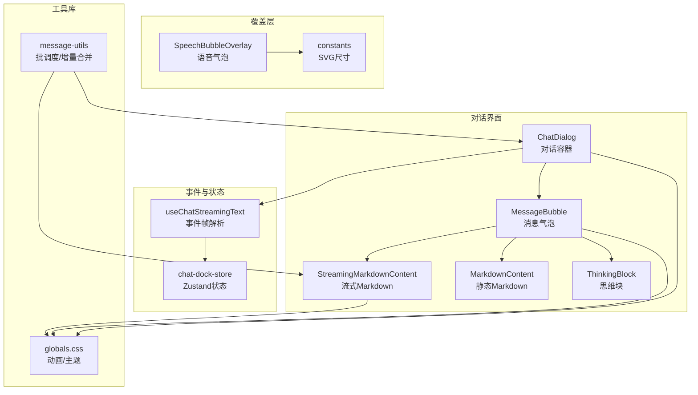
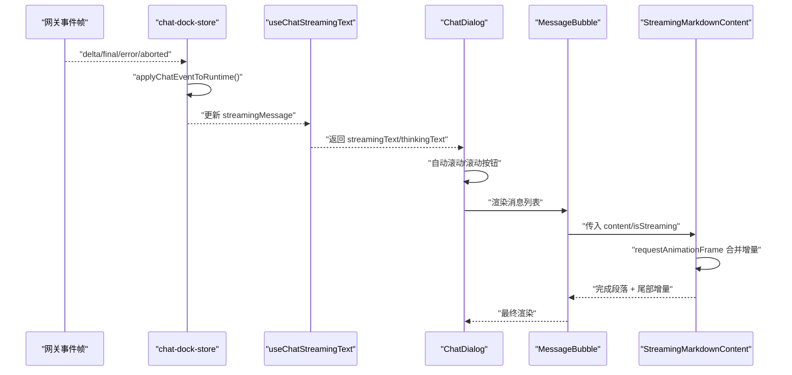
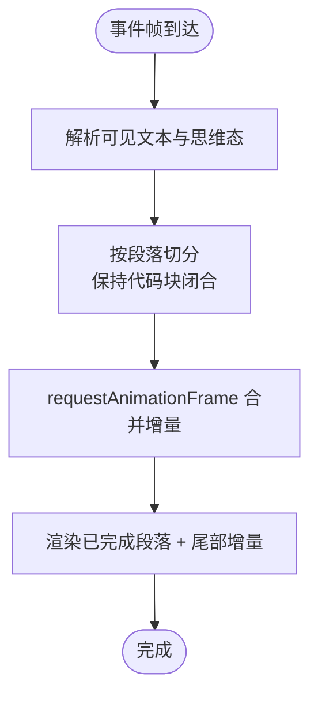
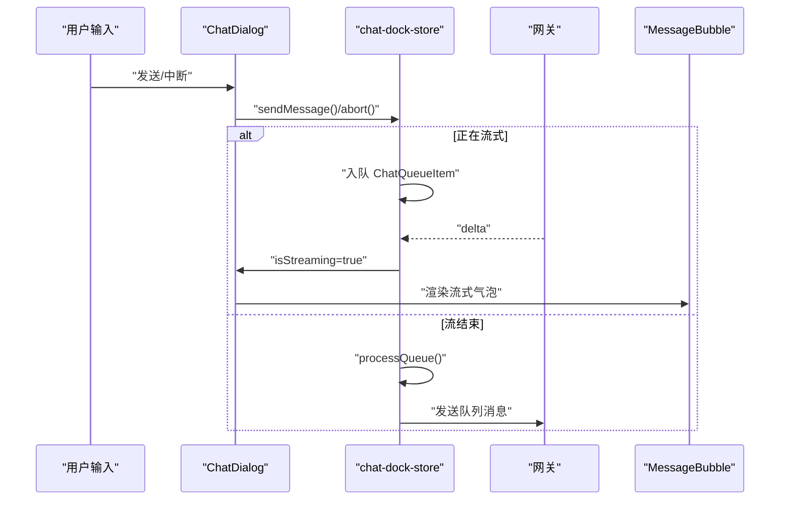
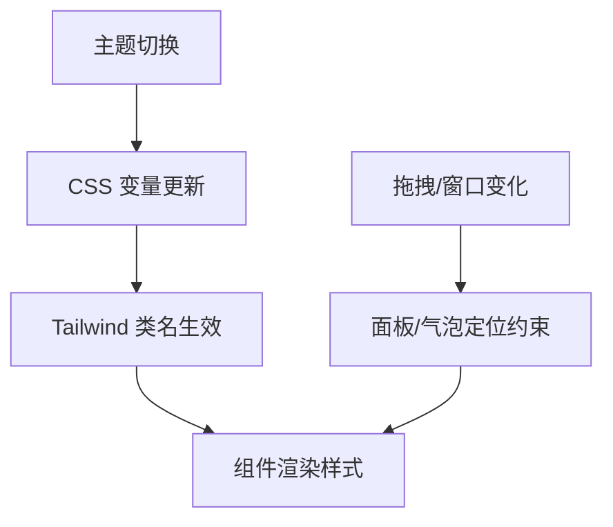
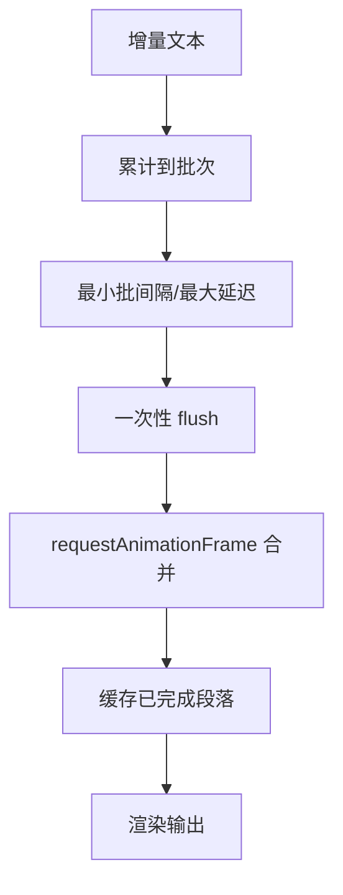
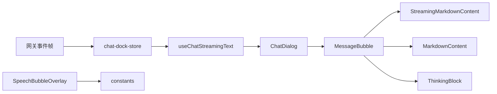

# 气泡面板系统

<cite>
**本文档引用的文件**
- [src/components/chat/MessageBubble.tsx](file://src/components/chat/MessageBubble.tsx)
- [src/components/chat/ChatDialog.tsx](file://src/components/chat/ChatDialog.tsx)
- [src/components/chat/StreamingMarkdownContent.tsx](file://src/components/chat/StreamingMarkdownContent.tsx)
- [src/components/chat/ThinkingBlock.tsx](file://src/components/chat/ThinkingBlock.tsx)
- [src/components/chat/MarkdownContent.tsx](file://src/components/chat/MarkdownContent.tsx)
- [src/components/overlays/SpeechBubble.tsx](file://src/components/overlays/SpeechBubble.tsx)
- [src/hooks/useChatStreamingText.ts](file://src/hooks/useChatStreamingText.ts)
- [src/store/console-stores/chat-dock-store.ts](file://src/store/console-stores/chat-dock-store.ts)
- [src/lib/message-utils.ts](file://src/lib/message-utils.ts)
- [src/lib/constants.ts](file://src/lib/constants.ts)
- [src/styles/globals.css](file://src/styles/globals.css)
</cite>

## 目录
1. [简介](#简介)
2. [项目结构](#项目结构)
3. [核心组件](#核心组件)
4. [架构总览](#架构总览)
5. [详细组件分析](#详细组件分析)
6. [依赖关系分析](#依赖关系分析)
7. [性能考量](#性能考量)
8. [故障排查指南](#故障排查指南)
9. [结论](#结论)
10. [附录](#附录)

## 简介
本文件面向“气泡面板系统”，聚焦于以下能力与实现细节：
- 实时文本流处理：从事件帧解析增量内容、合并思维态与正文、批处理渲染。
- 气泡面板显示逻辑：用户/助手/系统/工具活动等多形态气泡的差异化展示。
- 消息队列管理：出站消息排队、并发控制与历史加载策略。
- 自动滚动与定位算法：基于滚动位置的智能跟随、拖拽调整高度、气泡面板在二维场景中的定位与视口约束。
- 样式配置与主题适配：明暗主题、动画过渡、尺寸自适应与 Markdown 渲染。
- DOM 操作优化与性能监控：requestAnimationFrame 批处理、懒渲染、缓存与节流。
- 大规模并发消息处理：批调度器、增量合并、懒加载与内存限制。

## 项目结构
气泡面板系统由“对话容器 + 消息气泡 + 流式渲染 + 事件解析 + 存储状态”构成，核心文件分布如下：
- 对话容器与交互：ChatDialog 负责布局、输入、滚动、拖拽与错误提示。
- 消息气泡渲染：MessageBubble 统一渲染用户/助手/系统/工具活动气泡，并组合 ThinkingBlock、MarkdownContent、StreamingMarkdownContent。
- 流式文本处理：useChatStreamingText 解析事件帧中的文本与思维态；StreamingMarkdownContent 增量渲染与段落切分。
- 语音气泡覆盖层：SpeechBubbleOverlay 在二维场景中根据 Agent 状态显示/隐藏、展开/收起与定位。
- 状态与队列：chat-dock-store 管理消息、流式状态、会话、队列与事件处理。
- 工具与常量：message-utils 提供批调度器与增量合并；constants 提供 SVG 尺寸与定位基准。

**图表来源**
- [src/components/chat/ChatDialog.tsx:30-422](file://src/components/chat/ChatDialog.tsx#L30-L422)
- [src/components/chat/MessageBubble.tsx:160-257](file://src/components/chat/MessageBubble.tsx#L160-L257)
- [src/components/chat/StreamingMarkdownContent.tsx:198-260](file://src/components/chat/StreamingMarkdownContent.tsx#L198-L260)
- [src/components/chat/MarkdownContent.tsx:22-133](file://src/components/chat/MarkdownContent.tsx#L22-L133)
- [src/components/chat/ThinkingBlock.tsx:11-54](file://src/components/chat/ThinkingBlock.tsx#L11-L54)
- [src/hooks/useChatStreamingText.ts:78-88](file://src/hooks/useChatStreamingText.ts#L78-L88)
- [src/store/console-stores/chat-dock-store.ts:1-1703](file://src/store/console-stores/chat-dock-store.ts#L1-L1703)
- [src/components/overlays/SpeechBubble.tsx:10-185](file://src/components/overlays/SpeechBubble.tsx#L10-L185)
- [src/lib/constants.ts:4-5](file://src/lib/constants.ts#L4-L5)
- [src/lib/message-utils.ts:55-112](file://src/lib/message-utils.ts#L55-L112)
- [src/styles/globals.css:1-152](file://src/styles/globals.css#L1-L152)

**章节来源**
- [src/components/chat/ChatDialog.tsx:30-422](file://src/components/chat/ChatDialog.tsx#L30-L422)
- [src/components/chat/MessageBubble.tsx:160-257](file://src/components/chat/MessageBubble.tsx#L160-L257)
- [src/components/chat/StreamingMarkdownContent.tsx:198-260](file://src/components/chat/StreamingMarkdownContent.tsx#L198-L260)
- [src/components/chat/MarkdownContent.tsx:22-133](file://src/components/chat/MarkdownContent.tsx#L22-L133)
- [src/components/chat/ThinkingBlock.tsx:11-54](file://src/components/chat/ThinkingBlock.tsx#L11-L54)
- [src/hooks/useChatStreamingText.ts:78-88](file://src/hooks/useChatStreamingText.ts#L78-L88)
- [src/store/console-stores/chat-dock-store.ts:1-1703](file://src/store/console-stores/chat-dock-store.ts#L1-L1703)
- [src/components/overlays/SpeechBubble.tsx:10-185](file://src/components/overlays/SpeechBubble.tsx#L10-L185)
- [src/lib/constants.ts:4-5](file://src/lib/constants.ts#L4-L5)
- [src/lib/message-utils.ts:55-112](file://src/lib/message-utils.ts#L55-L112)
- [src/styles/globals.css:1-152](file://src/styles/globals.css#L1-L152)

## 核心组件
- 对话容器 ChatDialog
  - 负责布局、输入、附件、发送/中断、滚动与拖拽调整高度。
  - 自动滚动：监听消息与流式文本变化，当处于底部时自动滚动到底部。
  - 滚动按钮：未处于底部时显示“回到底部”按钮，点击恢复自动滚动。
  - 高度持久化：本地存储对话框高度，支持拖拽调整并保存。
- 消息气泡 MessageBubble
  - 用户/助手/系统/工具活动四类气泡差异化渲染。
  - 助手气泡支持思维态块、流式 Markdown、工具调用标签与图片附件网格。
  - 支持置顶气泡的切换回调。
- 流式 Markdown 渲染 StreamingMarkdownContent
  - 使用 requestAnimationFrame 合并增量，避免频繁重排。
  - 按段落切分，确保代码块完整性，优先渲染已完成段落。
  - 支持 Mermaid 懒加载预览。
- 思维块 ThinkingBlock
  - 展示助手的思维态内容，支持展开/折叠与流式指示。
- Markdown 内容 MarkdownContent
  - 静态 Markdown 渲染，统一表格、代码块、链接等样式。
- 语音气泡覆盖层 SpeechBubbleOverlay
  - 根据 Agent 的说话状态显示/隐藏、展开/收起。
  - 计算面板绝对定位，保证在视口内且不溢出。
- 流式文本钩子 useChatStreamingText
  - 从事件帧提取可见文本与思维态，剥离思维态标签以仅显示回复正文。
- 状态与队列 chat-dock-store
  - 维护 messages、isStreaming、streamingMessage、queue、会话信息与运行态。
  - 事件帧解析：delta/final/error/aborted 等状态机转换。
  - 队列：在流式期间将出站消息入队，待流结束或中断后处理。
- 工具与常量 message-utils、constants
  - 批调度器：批量合并增量文本，设置最小批间隔与最大延迟。
  - 增量合并：将新增量追加到现有内容末尾。
  - SVG 尺寸：提供二维场景尺寸，用于计算 Agent 位置百分比与气泡面板定位。
- 样式与动画 globals.css
  - 明暗主题变量与动画：滑入/滑出、脉冲、连接状态等。
  - 气泡与 Markdown 组件的通用样式类。

**章节来源**
- [src/components/chat/ChatDialog.tsx:30-422](file://src/components/chat/ChatDialog.tsx#L30-L422)
- [src/components/chat/MessageBubble.tsx:160-257](file://src/components/chat/MessageBubble.tsx#L160-L257)
- [src/components/chat/StreamingMarkdownContent.tsx:198-260](file://src/components/chat/StreamingMarkdownContent.tsx#L198-L260)
- [src/components/chat/ThinkingBlock.tsx:11-54](file://src/components/chat/ThinkingBlock.tsx#L11-L54)
- [src/components/chat/MarkdownContent.tsx:22-133](file://src/components/chat/MarkdownContent.tsx#L22-L133)
- [src/components/overlays/SpeechBubble.tsx:10-185](file://src/components/overlays/SpeechBubble.tsx#L10-L185)
- [src/hooks/useChatStreamingText.ts:78-88](file://src/hooks/useChatStreamingText.ts#L78-L88)
- [src/store/console-stores/chat-dock-store.ts:177-309](file://src/store/console-stores/chat-dock-store.ts#L177-L309)
- [src/lib/message-utils.ts:55-112](file://src/lib/message-utils.ts#L55-L112)
- [src/lib/constants.ts:4-5](file://src/lib/constants.ts#L4-L5)
- [src/styles/globals.css:122-152](file://src/styles/globals.css#L122-L152)

## 架构总览
气泡面板系统围绕 Zustand 状态中心与事件驱动模型构建，关键流程如下：

**图表来源**
- [src/store/console-stores/chat-dock-store.ts:177-309](file://src/store/console-stores/chat-dock-store.ts#L177-L309)
- [src/hooks/useChatStreamingText.ts:78-88](file://src/hooks/useChatStreamingText.ts#L78-L88)
- [src/components/chat/ChatDialog.tsx:91-110](file://src/components/chat/ChatDialog.tsx#L91-L110)
- [src/components/chat/MessageBubble.tsx:160-257](file://src/components/chat/MessageBubble.tsx#L160-L257)
- [src/components/chat/StreamingMarkdownContent.tsx:198-260](file://src/components/chat/StreamingMarkdownContent.tsx#L198-L260)

## 详细组件分析

### 组件 A：实时文本流处理与批调度
- 事件帧解析
  - useChatStreamingText 从 streamingMessage 中提取可见文本与思维态，支持字符串、内容块数组与回退字段。
  - 思维态可来自显式 thinking 字段或 content 中 type 为 thinking 的块，亦可从文本中匹配特定标签。
  - 剥离思维态标签，仅保留回复正文。
- 增量合并与批处理
  - StreamingMarkdownContent 使用 requestAnimationFrame 合并增量，避免频繁渲染。
  - 按段落切分，确保代码块闭合完整性，优先渲染已完成段落，尾部增量实时显示。
- 批调度器
  - message-utils 提供批调度器：设定最小批间隔与最大延迟，累积增量后一次性 flush。
  - destroy 时强制 flush 剩余增量，防止丢失。

**图表来源**
- [src/hooks/useChatStreamingText.ts:12-73](file://src/hooks/useChatStreamingText.ts#L12-L73)
- [src/components/chat/StreamingMarkdownContent.tsx:32-61](file://src/components/chat/StreamingMarkdownContent.tsx#L32-L61)
- [src/lib/message-utils.ts:55-112](file://src/lib/message-utils.ts#L55-L112)

**章节来源**
- [src/hooks/useChatStreamingText.ts:12-73](file://src/hooks/useChatStreamingText.ts#L12-L73)
- [src/components/chat/StreamingMarkdownContent.tsx:32-61](file://src/components/chat/StreamingMarkdownContent.tsx#L32-L61)
- [src/lib/message-utils.ts:55-112](file://src/lib/message-utils.ts#L55-L112)

### 组件 B：气泡面板显示逻辑与消息队列
- 消息气泡类型
  - 用户：纯文本气泡，右侧头像与时间戳。
  - 助手：支持思维块、流式 Markdown、工具调用标签、图片附件网格。
  - 系统：居中提示气泡，支持置顶按钮。
  - 工具活动：独立气泡，展示运行/完成状态与参数/结果详情。
- 滚动与定位
  - ChatDialog 自动滚动：当滚动条接近底部时自动滚动到底部。
  - 滚动按钮：未处于底部时显示“回到底部”，点击恢复自动滚动。
  - 语音气泡：根据 Agent 位置百分比定位，计算面板绝对坐标并在视口内约束。
- 队列管理
  - chat-dock-store 在 isStreaming 期间将出站消息入队，等待流结束或中断后处理。
  - 事件帧状态机：delta/final/error/aborted 控制 isStreaming 与 streamingMessage 更新。

**图表来源**
- [src/components/chat/ChatDialog.tsx:172-205](file://src/components/chat/ChatDialog.tsx#L172-L205)
- [src/store/console-stores/chat-dock-store.ts:196-309](file://src/store/console-stores/chat-dock-store.ts#L196-L309)

**章节来源**
- [src/components/chat/MessageBubble.tsx:160-257](file://src/components/chat/MessageBubble.tsx#L160-L257)
- [src/components/chat/ChatDialog.tsx:91-110](file://src/components/chat/ChatDialog.tsx#L91-L110)
- [src/components/overlays/SpeechBubble.tsx:30-88](file://src/components/overlays/SpeechBubble.tsx#L30-L88)
- [src/store/console-stores/chat-dock-store.ts:196-309](file://src/store/console-stores/chat-dock-store.ts#L196-L309)

### 组件 C：样式配置、主题适配与尺寸自适应
- 主题适配
  - globals.css 定义明暗主题变量与动画，组件使用 Tailwind 类名实现深色/浅色切换。
- 尺寸自适应
  - ChatDialog 支持拖拽调整高度，最大高度为窗口高度的固定比例，高度值持久化到 localStorage。
  - 语音气泡面板宽度/最大高度固定，定位时在父容器范围内进行水平与垂直边界约束。
- 动画过渡
  - 对话框滑入/滑出动画、脉冲与连接状态动画，提升交互反馈。
- Markdown 样式
  - MarkdownContent/StreamingMarkdownContent 统一样式：段落间距、表格、代码块、链接等。

**图表来源**
- [src/styles/globals.css:1-152](file://src/styles/globals.css#L1-L152)
- [src/components/chat/ChatDialog.tsx:124-171](file://src/components/chat/ChatDialog.tsx#L124-L171)
- [src/components/overlays/SpeechBubble.tsx:30-88](file://src/components/overlays/SpeechBubble.tsx#L30-L88)

**章节来源**
- [src/styles/globals.css:1-152](file://src/styles/globals.css#L1-L152)
- [src/components/chat/ChatDialog.tsx:124-171](file://src/components/chat/ChatDialog.tsx#L124-L171)
- [src/components/chat/MarkdownContent.tsx:22-133](file://src/components/chat/MarkdownContent.tsx#L22-L133)
- [src/components/overlays/SpeechBubble.tsx:30-88](file://src/components/overlays/SpeechBubble.tsx#L30-L88)

### 组件 D：DOM 操作优化与性能监控
- requestAnimationFrame 合并
  - StreamingMarkdownContent 使用 rAF 合并增量，减少重排与重绘。
- 懒加载与缓存
  - Mermaid 代码块懒加载预览，fallback 降级渲染。
  - 已完成段落节点缓存，避免重复渲染。
- 批调度器
  - message-utils 的批调度器在高频增量场景下降低渲染频率。
- 滚动优化
  - 仅在需要时更新 scrollTop，避免不必要的滚动计算。
- 性能监控建议
  - 可在关键路径埋点（事件帧到达 → 合并 → 渲染完成），统计帧耗时与丢帧率。

**图表来源**
- [src/lib/message-utils.ts:55-112](file://src/lib/message-utils.ts#L55-L112)
- [src/components/chat/StreamingMarkdownContent.tsx:198-260](file://src/components/chat/StreamingMarkdownContent.tsx#L198-L260)

**章节来源**
- [src/lib/message-utils.ts:55-112](file://src/lib/message-utils.ts#L55-L112)
- [src/components/chat/StreamingMarkdownContent.tsx:198-260](file://src/components/chat/StreamingMarkdownContent.tsx#L198-L260)

## 依赖关系分析
- 组件耦合
  - ChatDialog 依赖 useChatStreamingText 与 chat-dock-store，负责整体交互与滚动。
  - MessageBubble 依赖 MarkdownContent/StreamingMarkdownContent/ThinkingBlock，承担渲染职责。
  - SpeechBubbleOverlay 依赖 constants 的 SVG 尺寸，负责二维场景定位。
- 数据流
  - 网关事件帧 → chat-dock-store.applyChatEventToRuntime → useChatStreamingText → ChatDialog → MessageBubble → StreamingMarkdownContent。
- 外部依赖
  - react-markdown + remark-gfm：Markdown 渲染。
  - react-textarea-autosize：自适应文本域。
  - Zustand：状态管理。

**图表来源**
- [src/store/console-stores/chat-dock-store.ts:177-309](file://src/store/console-stores/chat-dock-store.ts#L177-L309)
- [src/hooks/useChatStreamingText.ts:78-88](file://src/hooks/useChatStreamingText.ts#L78-L88)
- [src/components/chat/ChatDialog.tsx:30-422](file://src/components/chat/ChatDialog.tsx#L30-L422)
- [src/components/chat/MessageBubble.tsx:160-257](file://src/components/chat/MessageBubble.tsx#L160-L257)
- [src/components/chat/StreamingMarkdownContent.tsx:198-260](file://src/components/chat/StreamingMarkdownContent.tsx#L198-L260)
- [src/components/chat/MarkdownContent.tsx:22-133](file://src/components/chat/MarkdownContent.tsx#L22-L133)
- [src/components/chat/ThinkingBlock.tsx:11-54](file://src/components/chat/ThinkingBlock.tsx#L11-L54)
- [src/components/overlays/SpeechBubble.tsx:10-185](file://src/components/overlays/SpeechBubble.tsx#L10-L185)
- [src/lib/constants.ts:4-5](file://src/lib/constants.ts#L4-L5)

**章节来源**
- [src/store/console-stores/chat-dock-store.ts:177-309](file://src/store/console-stores/chat-dock-store.ts#L177-L309)
- [src/hooks/useChatStreamingText.ts:78-88](file://src/hooks/useChatStreamingText.ts#L78-L88)
- [src/components/chat/ChatDialog.tsx:30-422](file://src/components/chat/ChatDialog.tsx#L30-L422)
- [src/components/chat/MessageBubble.tsx:160-257](file://src/components/chat/MessageBubble.tsx#L160-L257)
- [src/components/overlays/SpeechBubble.tsx:10-185](file://src/components/overlays/SpeechBubble.tsx#L10-L185)

## 性能考量
- 渲染路径优化
  - 使用 requestAnimationFrame 合并与段落切分，降低主线程压力。
  - 缓存已完成段落节点，避免重复解析与渲染。
- 文本处理
  - 批调度器在高频增量场景下显著降低渲染次数。
  - 增量合并采用字符串拼接，复杂度 O(n)。
- DOM 操作
  - 仅在滚动条件变化时更新 scrollTop，避免无谓滚动。
  - 语音气泡面板使用绝对定位与 requestAnimationFrame 重新计算，减少布局抖动。
- 存储与内存
  - 本地 IndexedDB 限制每会话消息数量，避免无限增长导致内存压力。
- 建议
  - 对超长会话启用虚拟滚动（如需）。
  - 对高并发事件帧增加节流/去抖策略（如需）。
  - 埋点统计：事件帧到达时间、合并耗时、渲染耗时、丢帧率。

[本节为通用指导，无需列出具体文件来源]

## 故障排查指南
- 无法自动滚动
  - 检查 ChatDialog 的滚动监听与 autoScroll 状态更新逻辑。
  - 确认消息列表渲染完成后再触发滚动。
- 流式文本不显示或卡顿
  - 检查 useChatStreamingText 是否正确提取 streamingText/thinkingText。
  - 确认 StreamingMarkdownContent 的 rAF 合并与段落切分逻辑正常。
- 语音气泡面板位置异常
  - 检查 SpeechBubbleOverlay 的 recalcPanelPosition 与父容器 offsetParent。
  - 确认 constants 中 SVG_WIDTH/HEIGHT 与实际场景一致。
- 队列消息未发送
  - 检查 chat-dock-store 的 isStreaming 与 queue 状态机。
  - 确认 final/error/aborted 事件后是否执行 processQueue。
- 样式异常或主题不生效
  - 检查 globals.css 的明暗主题变量与 Tailwind 类名。
  - 确认组件未被覆盖样式影响。

**章节来源**
- [src/components/chat/ChatDialog.tsx:91-110](file://src/components/chat/ChatDialog.tsx#L91-L110)
- [src/hooks/useChatStreamingText.ts:78-88](file://src/hooks/useChatStreamingText.ts#L78-L88)
- [src/components/chat/StreamingMarkdownContent.tsx:198-260](file://src/components/chat/StreamingMarkdownContent.tsx#L198-L260)
- [src/components/overlays/SpeechBubble.tsx:30-88](file://src/components/overlays/SpeechBubble.tsx#L30-L88)
- [src/store/console-stores/chat-dock-store.ts:196-309](file://src/store/console-stores/chat-dock-store.ts#L196-L309)
- [src/styles/globals.css:1-152](file://src/styles/globals.css#L1-L152)

## 结论
气泡面板系统通过事件驱动与状态中心，实现了：
- 高效的实时文本流处理与渲染，兼顾完整性和性能。
- 多形态消息气泡与丰富的交互体验（自动滚动、展开/收起、定位约束）。
- 队列与状态机保障在并发与异常场景下的稳定性。
- 主题适配、尺寸自适应与动画过渡提升视觉一致性与流畅度。
建议在大规模并发与超长会话场景下进一步引入虚拟滚动与更细粒度的性能埋点，持续优化渲染与内存占用。

[本节为总结性内容，无需列出具体文件来源]

## 附录
- 关键实现路径参考
  - 实时文本解析：[useChatStreamingText.ts:12-73](file://src/hooks/useChatStreamingText.ts#L12-L73)
  - 流式渲染：[StreamingMarkdownContent.tsx:198-260](file://src/components/chat/StreamingMarkdownContent.tsx#L198-L260)
  - 消息气泡渲染：[MessageBubble.tsx:160-257](file://src/components/chat/MessageBubble.tsx#L160-L257)
  - 对话容器交互：[ChatDialog.tsx:91-110](file://src/components/chat/ChatDialog.tsx#L91-L110)
  - 事件状态机：[chat-dock-store.ts:177-309](file://src/store/console-stores/chat-dock-store.ts#L177-L309)
  - 批调度器：[message-utils.ts:55-112](file://src/lib/message-utils.ts#L55-L112)
  - 语音气泡定位：[SpeechBubble.tsx:30-88](file://src/components/overlays/SpeechBubble.tsx#L30-L88)
  - 样式与动画：[globals.css:122-152](file://src/styles/globals.css#L122-L152)

[本节为索引性内容，无需列出具体文件来源]