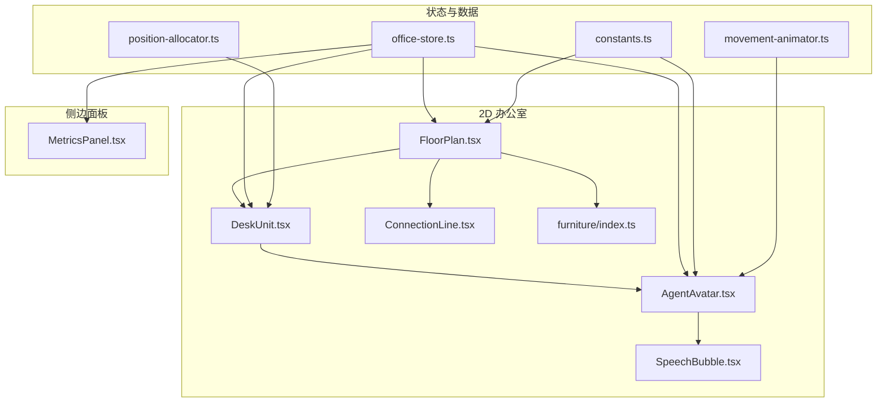
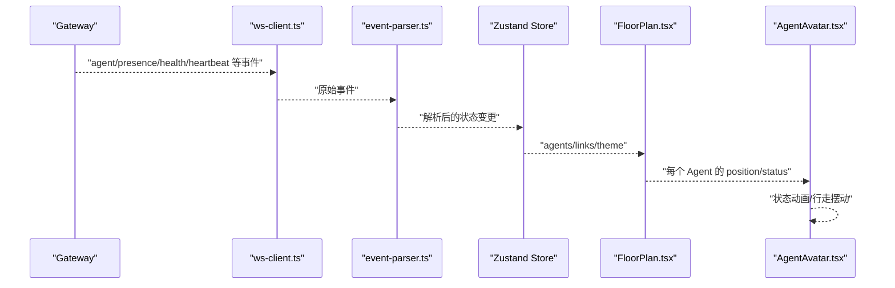
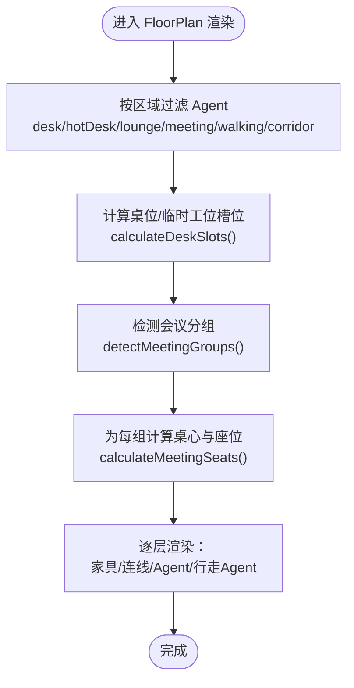
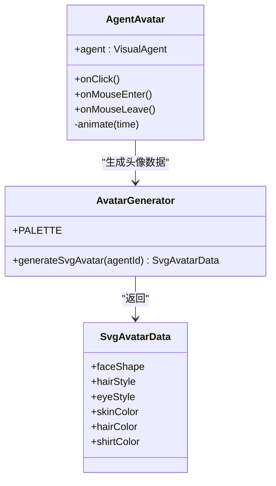
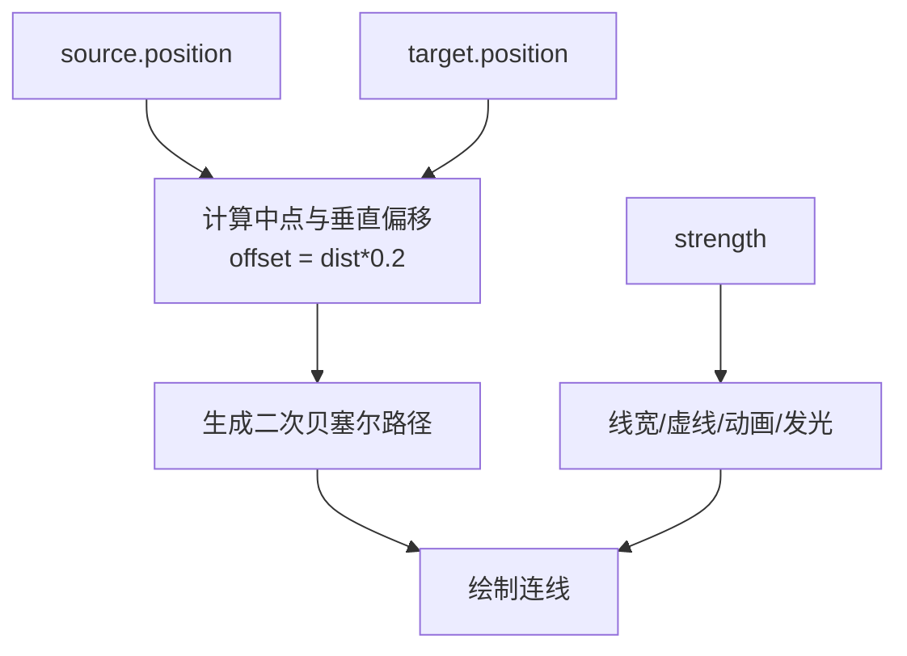
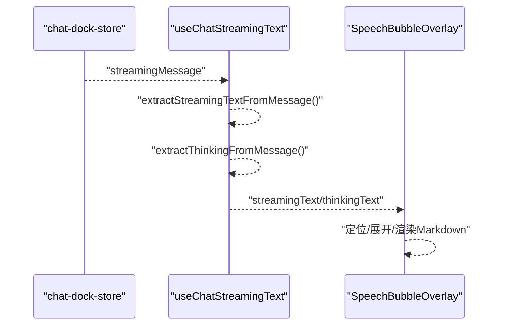
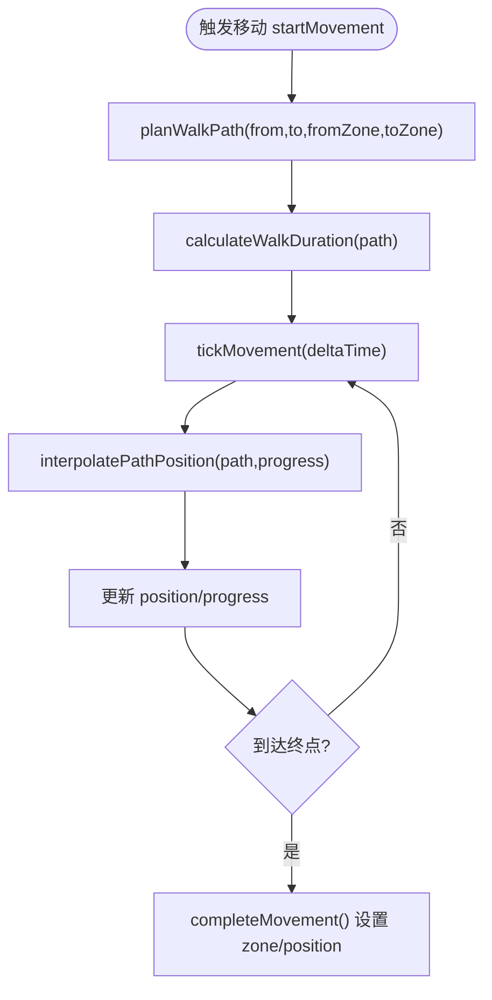
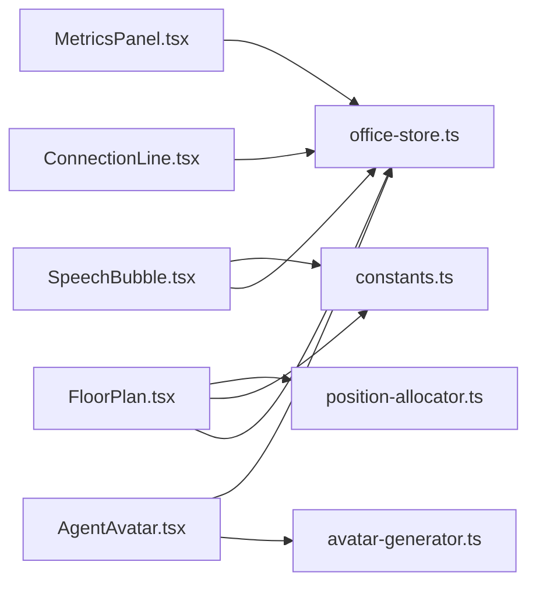

# 虚拟办公室系统

<cite>
**本文引用的文件**
- [README.md](file://README.md)
- [FloorPlan.tsx](file://src/components/office-2d/FloorPlan.tsx)
- [AgentAvatar.tsx](file://src/components/office-2d/AgentAvatar.tsx)
- [ConnectionLine.tsx](file://src/components/office-2d/ConnectionLine.tsx)
- [avatar-generator.ts](file://src/lib/avatar-generator.ts)
- [furniture/index.ts](file://src/components/office-2d/furniture/index.ts)
- [DeskUnit.tsx](file://src/components/office-2d/DeskUnit.tsx)
- [SpeechBubble.tsx](file://src/components/overlays/SpeechBubble.tsx)
- [useChatStreamingText.ts](file://src/hooks/useChatStreamingText.ts)
- [office-store.ts](file://src/store/office-store.ts)
- [constants.ts](file://src/lib/constants.ts)
- [position-allocator.ts](file://src/lib/position-allocator.ts)
- [movement-animator.ts](file://src/lib/movement-animator.ts)
- [MetricsPanel.tsx](file://src/components/panels/MetricsPanel.tsx)
</cite>

## 目录
1. [简介](#简介)
2. [项目结构](#项目结构)
3. [核心组件](#核心组件)
4. [架构总览](#架构总览)
5. [详细组件分析](#详细组件分析)
6. [依赖关系分析](#依赖关系分析)
7. [性能考量](#性能考量)
8. [故障排查指南](#故障排查指南)
9. [结论](#结论)
10. [附录](#附录)

## 简介
OpenClaw Office 是 OpenClaw 多智能体系统的可视化监控与管理前端，采用等距投影（Isometric）风格的 2D SVG 办公室场景，实时呈现 Agent 的工作状态、协作链路、工具调用与资源消耗，并提供完整的控制台管理界面与 Chat 对话工作区。其核心目标是将“Agent = 数字员工、办公室 = Agent 运行时、工位 = Session、会议室 = 协作上下文”的隐喻具象化为可观察、可交互的数字孪生空间。

## 项目结构
- 2D 办公室场景位于 src/components/office-2d，包含地板平面、家具、Agent 头像、协作连线与区域标签等。
- 侧边面板位于 src/components/panels，提供指标卡、Token 趋势、成本分布、网络拓扑与活动热力图等聚合视图。
- 实时数据与状态管理位于 src/store/office-store.ts，负责 Agent 生命周期、位置迁移、协作链接与全局指标计算。
- 常量与布局位于 src/lib/constants.ts、位置分配与路径规划位于 src/lib/position-allocator.ts 与 src/lib/movement-animator.ts。
- 聊天流式文本处理位于 src/hooks/useChatStreamingText.ts，配合 src/components/overlays/SpeechBubble.tsx 实现气泡面板的实时文本流展示。
- 头像生成位于 src/lib/avatar-generator.ts，提供基于 agentId 的确定性 SVG 头像。

**图表来源**
- [FloorPlan.tsx:10-278](file://src/components/office-2d/FloorPlan.tsx#L10-L278)
- [DeskUnit.tsx:13-45](file://src/components/office-2d/DeskUnit.tsx#L13-L45)
- [AgentAvatar.tsx:15-255](file://src/components/office-2d/AgentAvatar.tsx#L15-L255)
- [ConnectionLine.tsx:9-54](file://src/components/office-2d/ConnectionLine.tsx#L9-L54)
- [SpeechBubble.tsx:10-185](file://src/components/overlays/SpeechBubble.tsx#L10-L185)
- [furniture/index.ts:1-7](file://src/components/office-2d/furniture/index.ts#L1-L7)
- [office-store.ts:217-800](file://src/store/office-store.ts#L217-L800)
- [constants.ts:4-141](file://src/lib/constants.ts#L4-L141)
- [position-allocator.ts:51-82](file://src/lib/position-allocator.ts#L51-L82)
- [movement-animator.ts:85-163](file://src/lib/movement-animator.ts#L85-L163)
- [MetricsPanel.tsx:28-118](file://src/components/panels/MetricsPanel.tsx#L28-L118)

**章节来源**
- [README.md:1-316](file://README.md#L1-L316)
- [FloorPlan.tsx:10-278](file://src/components/office-2d/FloorPlan.tsx#L10-L278)
- [office-store.ts:217-800](file://src/store/office-store.ts#L217-L800)

## 核心组件
- 2D 办公室场景：通过 FloorPlan.tsx 组织各层 SVG 内容，渲染建筑外壳、分区墙、门洞、区域标签与家具；根据 Agent 的 zone 与 movement 渲染不同层级的 Agent 与协作连线。
- Agent 头像系统：AgentAvatar.tsx 基于 agentId 的确定性生成 SVG 头像，结合状态颜色与动画（脉冲、闪烁、行走摆动）展示实时状态。
- 协作连线：ConnectionLine.tsx 基于两个 Agent 的位置与链接强度绘制曲线连线，带发光与流动/脉冲动画。
- 气泡面板：SpeechBubble.tsx 将 Agent 的语音内容以气泡形式显示，支持展开/收起与视口内定位。
- 侧边面板：MetricsPanel.tsx 聚合全局指标并提供趋势、拓扑、活动等子面板。
- 状态管理：office-store.ts 负责 Agent 的生命周期、位置迁移、协作链接、全局指标与主题等状态。

**章节来源**
- [AgentAvatar.tsx:15-255](file://src/components/office-2d/AgentAvatar.tsx#L15-L255)
- [ConnectionLine.tsx:9-54](file://src/components/office-2d/ConnectionLine.tsx#L9-L54)
- [SpeechBubble.tsx:10-185](file://src/components/overlays/SpeechBubble.tsx#L10-L185)
- [MetricsPanel.tsx:28-118](file://src/components/panels/MetricsPanel.tsx#L28-L118)
- [office-store.ts:217-800](file://src/store/office-store.ts#L217-L800)

## 架构总览
系统通过 WebSocket 与 OpenClaw Gateway 通信，事件经解析后写入 Zustand Store，再驱动 React 组件渲染。Office Store 负责：
- 解析 Agent 事件并维护 agents、links、globalMetrics 等状态
- 规划 Agent 的移动路径与动画插值
- 计算协作链接强度与可视化
- 提供选择态、主题、会话映射等上下文

**图表来源**
- [README.md:274-284](file://README.md#L274-L284)
- [office-store.ts:762-800](file://src/store/office-store.ts#L762-L800)
- [FloorPlan.tsx:20-278](file://src/components/office-2d/FloorPlan.tsx#L20-L278)
- [AgentAvatar.tsx:15-255](file://src/components/office-2d/AgentAvatar.tsx#L15-L255)

## 详细组件分析

### 2D 办公室场景与布局
- FloorPlan.tsx 将 SVG 分为多个图层：建筑外壳、走廊地砖、区域填充、分区墙、门洞、区域标签、家具、协作连线、Agent 与行走 Agent。通过 ZONES、OFFICE、SVG_WIDTH/HEIGHT 等常量统一布局。
- 桌位与临时工位：DeskUnit.tsx 结合 Desk 与 Chair，按 deskSlots 计算位置；DeskUnit 对 AgentAvatar 进行局部坐标变换，使头像与工位对齐。
- 会议室：根据协作链接与会议分组，动态计算会议桌中心与座位，支持多桌布局与空椅装饰。
- 区域装饰：LoungeDecor、EntranceDoor 等组件在对应区域布置沙发、植物、咖啡杯、前台与入口门。

**图表来源**
- [FloorPlan.tsx:29-100](file://src/components/office-2d/FloorPlan.tsx#L29-L100)
- [DeskUnit.tsx:13-45](file://src/components/office-2d/DeskUnit.tsx#L13-L45)
- [position-allocator.ts:131-159](file://src/lib/position-allocator.ts#L131-L159)

**章节来源**
- [FloorPlan.tsx:10-278](file://src/components/office-2d/FloorPlan.tsx#L10-L278)
- [DeskUnit.tsx:13-45](file://src/components/office-2d/DeskUnit.tsx#L13-L45)
- [position-allocator.ts:131-159](file://src/lib/position-allocator.ts#L131-L159)

### Agent 头像生成系统（基于 agentId 的确定性生成）
- 头像数据：avatar-generator.ts 基于 agentId 的哈希生成面型、发型、眼睛、肤色、发色与衬衫色，保证相同 agentId 生成一致的头像。
- 头像渲染：AgentAvatar.tsx 使用 clipPath 与分层图形（衬衫、脸、头发、眼睛）组合成 SVG 面部；根据主题与状态设置颜色与透明度。
- 状态指示器：脉冲/闪烁动画（thinking/tool_calling/speaking/error/spawning），选中态高亮环，子 Agent 徽章，工具名标签，姓名标签与悬停提示。
- 行走动画：通过 requestAnimationFrame 与 movement 插值，实现摆动与坐/站过渡效果。

**图表来源**
- [avatar-generator.ts:76-89](file://src/lib/avatar-generator.ts#L76-L89)
- [AgentAvatar.tsx:15-255](file://src/components/office-2d/AgentAvatar.tsx#L15-L255)

**章节来源**
- [avatar-generator.ts:1-89](file://src/lib/avatar-generator.ts#L1-L89)
- [AgentAvatar.tsx:15-255](file://src/components/office-2d/AgentAvatar.tsx#L15-L255)

### 协作连线的可视化展示
- ConnectionLine.tsx 根据两点位置与距离计算控制点，绘制二次贝塞尔曲线；强度越高线宽越大、虚线越粗、并带有脉冲或流动动画。
- FloorPlan.tsx 依据 store 中 links 为每条协作链路绘制连线，强度来源于协作强度字段。

**图表来源**
- [ConnectionLine.tsx:9-54](file://src/components/office-2d/ConnectionLine.tsx#L9-L54)
- [FloorPlan.tsx:242-257](file://src/components/office-2d/FloorPlan.tsx#L242-L257)

**章节来源**
- [ConnectionLine.tsx:9-54](file://src/components/office-2d/ConnectionLine.tsx#L9-L54)
- [FloorPlan.tsx:242-257](file://src/components/office-2d/FloorPlan.tsx#L242-L257)

### 气泡面板的实时文本流处理
- useChatStreamingText.ts 提供从流式消息中提取可见文本与思考内容的方法，支持字符串、内容块数组与标记包裹的思考文本。
- SpeechBubble.tsx 将 Agent 的 speechBubble.text 渲染为 Markdown 气泡，支持展开查看完整内容，自动计算在视口内的位置，避免溢出。

**图表来源**
- [useChatStreamingText.ts:12-88](file://src/hooks/useChatStreamingText.ts#L12-L88)
- [SpeechBubble.tsx:10-185](file://src/components/overlays/SpeechBubble.tsx#L10-L185)

**章节来源**
- [useChatStreamingText.ts:12-88](file://src/hooks/useChatStreamingText.ts#L12-L88)
- [SpeechBubble.tsx:10-185](file://src/components/overlays/SpeechBubble.tsx#L10-L185)

### 侧边面板的数据聚合展示
- MetricsPanel.tsx 提供指标卡（活跃 Agent/总 Agent、总 Token、协作热度、Token 速率）与四个标签页：概览（成本分布）、趋势（Token 趋势）、拓扑（网络图）、活动（热力图）。
- 指标数据来自 office-store.ts 的 globalMetrics，图表组件懒加载以优化首屏。

**章节来源**
- [MetricsPanel.tsx:28-118](file://src/components/panels/MetricsPanel.tsx#L28-L118)
- [office-store.ts:217-240](file://src/store/office-store.ts#L217-L240)

### 办公室布局设计与家具装饰系统
- 常量定义：constants.ts 提供 OFFICE、ZONES、SVG 尺寸与颜色、家具尺寸、Agent 头像半径等基础参数。
- 家具导出：furniture/index.ts 统一导出 Desk、Chair、MeetingTable、Sofa、Plant、CoffeeCup 等组件，便于在 FloorPlan.tsx 中按区域渲染。
- 布局策略：position-allocator.ts 提供工位网格、临时工位网格、会议室座位与休息区锚点，确保 Agent 与家具的稳定布局。

**章节来源**
- [constants.ts:4-141](file://src/lib/constants.ts#L4-L141)
- [furniture/index.ts:1-7](file://src/components/office-2d/furniture/index.ts#L1-L7)
- [position-allocator.ts:24-82](file://src/lib/position-allocator.ts#L24-L82)

### Agent 移动动画与状态指示器
- 移动动画：movement-animator.ts 提供路径规划（planWalkPath）、长度计算（pathLength）、时长计算（calculateWalkDuration）与插值（interpolatePathPosition），支持跨区域穿越走廊的最优路径。
- 状态指示器：AgentAvatar.tsx 根据状态应用不同动画与样式，行走时附加摆动与坐/站过渡，错误状态闪烁，思考/说话状态脉冲。

**图表来源**
- [movement-animator.ts:85-163](file://src/lib/movement-animator.ts#L85-L163)
- [office-store.ts:504-580](file://src/store/office-store.ts#L504-L580)

**章节来源**
- [movement-animator.ts:85-163](file://src/lib/movement-animator.ts#L85-L163)
- [office-store.ts:504-580](file://src/store/office-store.ts#L504-L580)
- [AgentAvatar.tsx:46-95](file://src/components/office-2d/AgentAvatar.tsx#L46-L95)

## 依赖关系分析
- FloorPlan.tsx 依赖 office-store 的 agents、links、theme，依赖 constants 的 ZONES/OFFICE/尺寸，依赖 position-allocator 的 deskSlots 与 meetingSeat 计算。
- AgentAvatar.tsx 依赖 avatar-generator 的确定性头像数据，依赖 office-store 的选中态与移动 tick。
- ConnectionLine.tsx 依赖 agents 的位置与 links 的强度。
- SpeechBubble.tsx 依赖 Agent 的 speechBubble 与 position，依赖 constants 的 SVG 尺寸进行百分比定位。
- MetricsPanel.tsx 依赖 office-store 的 globalMetrics 与懒加载图表组件。

**图表来源**
- [FloorPlan.tsx:1-20](file://src/components/office-2d/FloorPlan.tsx#L1-L20)
- [AgentAvatar.tsx:1-7](file://src/components/office-2d/AgentAvatar.tsx#L1-L7)
- [ConnectionLine.tsx:1-7](file://src/components/office-2d/ConnectionLine.tsx#L1-L7)
- [SpeechBubble.tsx:1-8](file://src/components/overlays/SpeechBubble.tsx#L1-L8)
- [MetricsPanel.tsx:1-17](file://src/components/panels/MetricsPanel.tsx#L1-L17)
- [office-store.ts:1-37](file://src/store/office-store.ts#L1-L37)
- [constants.ts:1-141](file://src/lib/constants.ts#L1-L141)
- [position-allocator.ts:1-13](file://src/lib/position-allocator.ts#L1-L13)
- [avatar-generator.ts:1-6](file://src/lib/avatar-generator.ts#L1-L6)

## 性能考量
- 渲染分层与裁剪：FloorPlan.tsx 通过多层 SVG 与 clipPath 减少不必要的重绘；AgentAvatar 使用 transform 与 clipPath 控制绘制范围。
- 动画优化：Agent 行走动画使用 requestAnimationFrame 与增量进度，避免高频 setState；状态动画使用 CSS 动画而非 JS 驱动。
- 懒加载与节流：MetricsPanel.tsx 对图表组件懒加载；Office Store 对会话同步采用低频 reconciliation 与定时器节流，减少 Gateway 压力。
- 布局计算：position-allocator 与 movement-animator 的计算集中在 store 与工具函数，避免在渲染路径中重复计算。

[本节为通用性能建议，不直接分析具体文件]

## 故障排查指南
- 无法看到 Agent 头像：检查 office-store 的 agents 是否正确写入，确认 Agent 的 position 与 zone 是否有效；检查 AgentAvatar 的 isPlaceholder/confirmed 条件。
- 协作连线不显示：确认 links 是否存在且 sourceId/targetId 对应的 Agent 存在；检查 ConnectionLine 的强度与透明度。
- 气泡面板不出现：确认 Agent 的 speechBubble 是否存在且 status 为 speaking；检查 SpeechBubbleOverlay 的可见性与定位逻辑。
- 移动动画不生效：检查 startMovement 是否被调用，movement 是否被 tickMovement 更新；确认 interpolatePathPosition 的 progress 是否推进。
- 主题异常：检查 office-store 的 theme 与 constants 的明暗色板，确认 SVG 渲染颜色是否随主题变化。

**章节来源**
- [office-store.ts:504-580](file://src/store/office-store.ts#L504-L580)
- [AgentAvatar.tsx:15-255](file://src/components/office-2d/AgentAvatar.tsx#L15-L255)
- [ConnectionLine.tsx:9-54](file://src/components/office-2d/ConnectionLine.tsx#L9-L54)
- [SpeechBubble.tsx:10-185](file://src/components/overlays/SpeechBubble.tsx#L10-L185)

## 结论
OpenClaw Office 通过 2D SVG 场景与确定性头像生成，将 Agent 的协作与状态以直观的方式呈现。借助 Office Store 的状态管理与路径动画，实现了流畅的移动与协作可视化；侧边面板提供多维度的指标聚合。整体架构清晰、模块职责明确，具备良好的扩展性与性能表现。

[本节为总结性内容，不直接分析具体文件]

## 附录

### 扩展指南

- 扩展新的家具类型
  - 在 src/components/office-2d/furniture 下新增组件（参考现有 Desk/Chair/MeetingTable/Sofa/Plant/CoffeeCup），并在 furniture/index.ts 导出。
  - 在 FloorPlan.tsx 的相应区域调用新组件，传入 x/y/isDark 等参数。
  - 在 constants.ts 的 FURNITURE 常量中补充尺寸参数，以便布局计算使用。
  - 参考路径：[furniture/index.ts:1-7](file://src/components/office-2d/furniture/index.ts#L1-L7)、[constants.ts:106-114](file://src/lib/constants.ts#L106-L114)

- 自定义 Agent 外观
  - 修改 avatar-generator.ts 的 SvgAvatarData 字段与生成逻辑，确保基于 agentId 的确定性输出。
  - 如需调整头像尺寸与样式，可在 AgentAvatar.tsx 中修改 clip、transform 与状态动画样式。
  - 参考路径：[avatar-generator.ts:76-89](file://src/lib/avatar-generator.ts#L76-L89)、[AgentAvatar.tsx:15-255](file://src/components/office-2d/AgentAvatar.tsx#L15-L255)

- 实现新的动画效果
  - 在 AgentAvatar.tsx 的状态动画函数中添加新状态的动画样式，或在 CSS 中新增关键帧。
  - 若需要更复杂的路径动画，可在 movement-animator.ts 扩展路径规划策略，并在 office-store.ts 的 tickMovement 中应用。
  - 参考路径：[movement-animator.ts:85-163](file://src/lib/movement-animator.ts#L85-L163)、[AgentAvatar.tsx:290-305](file://src/components/office-2d/AgentAvatar.tsx#L290-L305)

- 与状态管理系统集成
  - 在 office-store.ts 中新增状态字段与 reducer 方法，确保事件解析后能正确更新 store。
  - 在 FloorPlan.tsx/AgentAvatar.tsx 中订阅所需的状态片段，避免过度渲染。
  - 参考路径：[office-store.ts:217-800](file://src/store/office-store.ts#L217-L800)

- 性能优化策略
  - 使用 memo 与浅比较优化组件重渲染（如 DeskUnit 的 props 比较）。
  - 对大列表渲染使用虚拟滚动或分页；对懒加载组件使用 Suspense。
  - 合理使用 requestAnimationFrame 与节流定时器，避免高频重绘。
  - 参考路径：[DeskUnit.tsx:25-44](file://src/components/office-2d/DeskUnit.tsx#L25-L44)、[README.md:286-291](file://README.md#L286-L291)