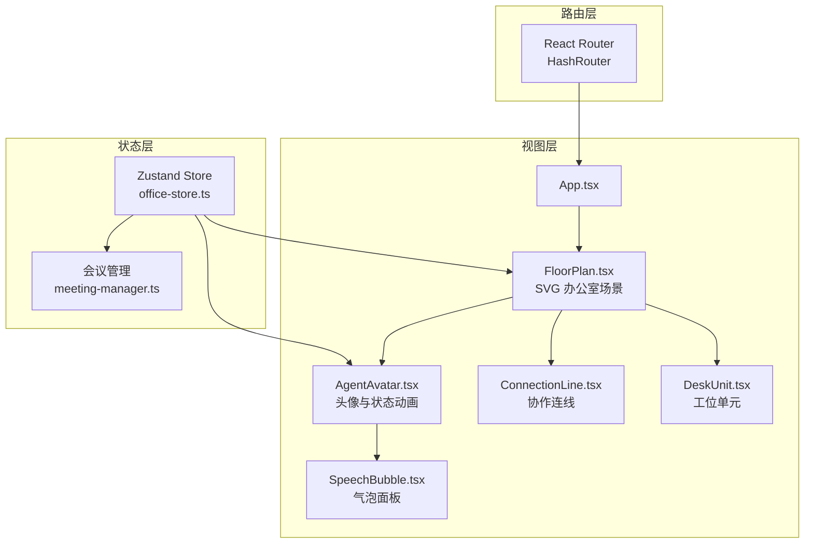
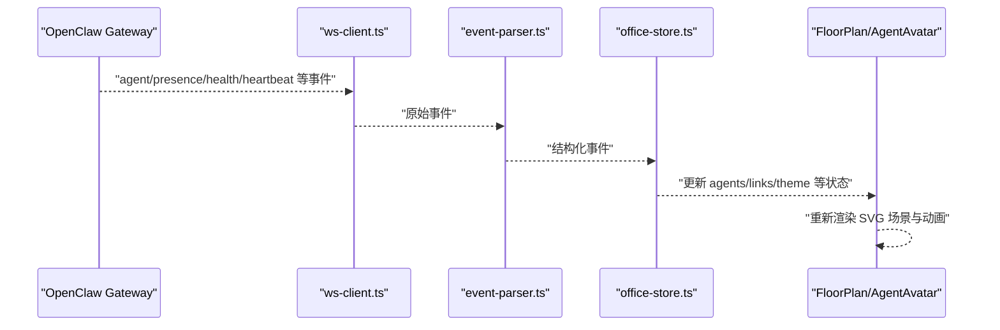
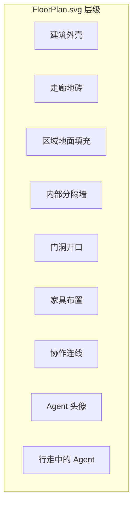
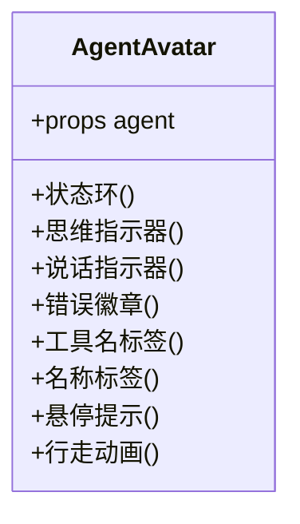
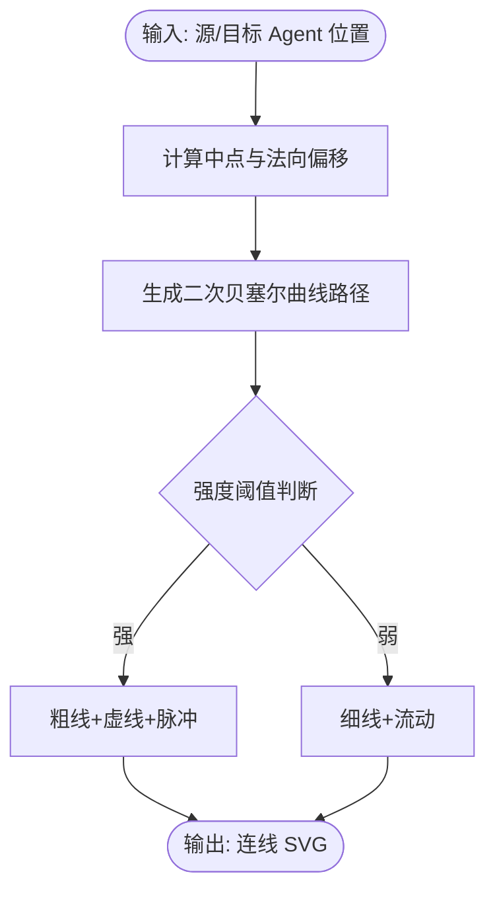
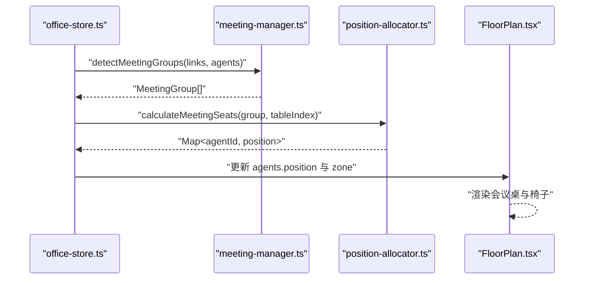
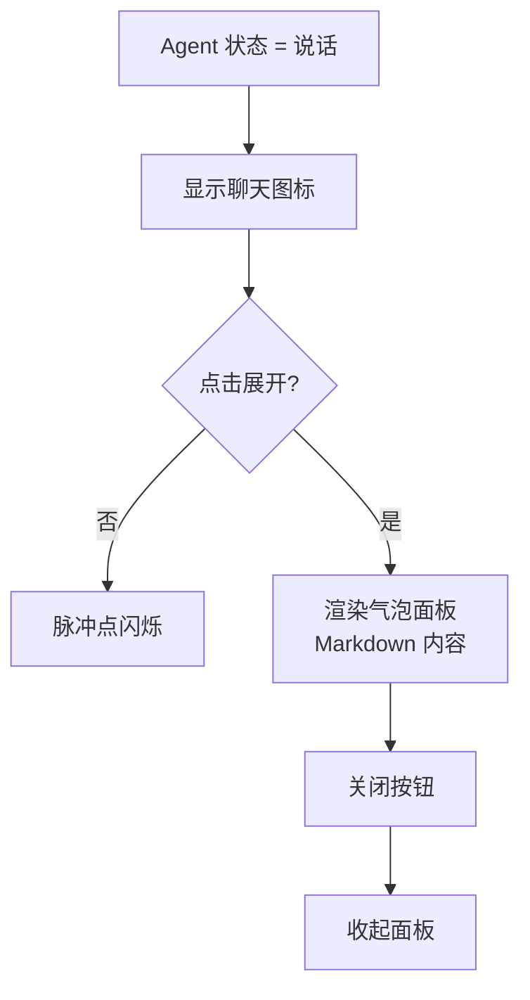
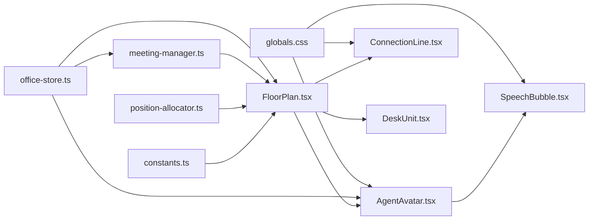

# 设计理念阐述

<cite>
**本文档引用的文件**
- [README.md](file://README.md)
- [src/App.tsx](file://src/App.tsx)
- [src/main.tsx](file://src/main.tsx)
- [src/components/office-2d/FloorPlan.tsx](file://src/components/office-2d/FloorPlan.tsx)
- [src/components/office-2d/AgentAvatar.tsx](file://src/components/office-2d/AgentAvatar.tsx)
- [src/components/office-2d/DeskUnit.tsx](file://src/components/office-2d/DeskUnit.tsx)
- [src/components/office-2d/ConnectionLine.tsx](file://src/components/office-2d/ConnectionLine.tsx)
- [src/components/overlays/SpeechBubble.tsx](file://src/components/overlays/SpeechBubble.tsx)
- [src/lib/constants.ts](file://src/lib/constants.ts)
- [src/lib/avatar-generator.ts](file://src/lib/avatar-generator.ts)
- [src/lib/position-allocator.ts](file://src/lib/position-allocator.ts)
- [src/store/office-store.ts](file://src/store/office-store.ts)
- [src/store/meeting-manager.ts](file://src/store/meeting-manager.ts)
- [src/styles/globals.css](file://src/styles/globals.css)
- [src/i18n/index.ts](file://src/i18n/index.ts)
</cite>

## 目录
1. [引言](#引言)
2. [项目结构](#项目结构)
3. [核心组件](#核心组件)
4. [架构总览](#架构总览)
5. [详细组件分析](#详细组件分析)
6. [依赖关系分析](#依赖关系分析)
7. [性能考量](#性能考量)
8. [故障排查指南](#故障排查指南)
9. [结论](#结论)
10. [附录](#附录)

## 引言
OpenClaw Office 的核心设计理念是将 AI 智能体的协作逻辑具象化为一个实时的数字孪生办公室。该项目通过“等距投影 + SVG”的视觉隐喻，将 Agent 视为“数字员工”、办公室视为“Agent 运行时”、工位视为“Session”、会议室视为“协作上下文”，从而让复杂的人工智能协作关系变得直观可感。

- **核心隐喻**：Agent = 数字员工 | 办公室 = Agent 运行时 | 工位 = Session | 会议室 = 协作上下文
- **渲染技术**：采用等距投影风格的 SVG 渲染，结合 CSS 动画实现状态可视化与流畅的运动过渡
- **实时状态展示**：通过 SVG 动画与气泡面板，实时呈现 AI 的思考、工具调用、说话与错误等状态
- **直观性原则**：以可视化的办公场景降低认知门槛，使非技术用户也能理解 AI 协作关系

**章节来源**
- [README.md:5-23](file://README.md#L5-L23)

## 项目结构
项目采用前端单页应用架构，围绕“路由 + 状态管理 + 可视化渲染”的三层组织方式：
- 路由层：HashRouter 管理页面路径，区分“办公室场景”和“控制台页面”
- 状态层：Zustand + Immer 管理 Agent、协作链接、主题、会话等全局状态
- 视图层：SVG 场景渲染 + 组件化 UI，包括 FloorPlan、AgentAvatar、ConnectionLine、SpeechBubble 等

**图表来源**
- [src/main.tsx:8-14](file://src/main.tsx#L8-L14)
- [src/App.tsx:76-123](file://src/App.tsx#L76-L123)
- [src/components/office-2d/FloorPlan.tsx:20-278](file://src/components/office-2d/FloorPlan.tsx#L20-L278)
- [src/store/office-store.ts:217-240](file://src/store/office-store.ts#L217-L240)

**章节来源**
- [src/main.tsx:1-15](file://src/main.tsx#L1-L15)
- [src/App.tsx:76-123](file://src/App.tsx#L76-L123)

## 核心组件
- FloorPlan：等距投影的 SVG 办公室场景，负责区域划分、家具布置、Agent 渲染与协作连线绘制
- AgentAvatar：每个 Agent 的 SVG 头像，承载状态指示器、名称标签、工具名标签、思维/说话/错误等可视化元素
- ConnectionLine：基于 Agent 间协作强度绘制的曲线连线，带脉冲/流动动画
- SpeechBubble：实时语音/文本输出的气泡面板，支持展开/收起与位置自适应
- DeskUnit：工位单元组合（Desk + Chair + AgentAvatar），统一布局与交互
- constants：统一的尺寸、颜色、区域、状态映射等常量
- position-allocator：确定 Agent 在不同区域的稳定位置与座位分配
- meeting-manager：根据协作强度检测会议分组并计算座位
- office-store：全局状态管理，处理 Agent 生命周期、移动、会议调度、主题切换等

**章节来源**
- [src/components/office-2d/FloorPlan.tsx:20-278](file://src/components/office-2d/FloorPlan.tsx#L20-L278)
- [src/components/office-2d/AgentAvatar.tsx:15-255](file://src/components/office-2d/AgentAvatar.tsx#L15-L255)
- [src/components/office-2d/ConnectionLine.tsx:9-53](file://src/components/office-2d/ConnectionLine.tsx#L9-L53)
- [src/components/overlays/SpeechBubble.tsx:10-184](file://src/components/overlays/SpeechBubble.tsx#L10-L184)
- [src/components/office-2d/DeskUnit.tsx:13-44](file://src/components/office-2d/DeskUnit.tsx#L13-L44)
- [src/lib/constants.ts:4-141](file://src/lib/constants.ts#L4-L141)
- [src/lib/position-allocator.ts:51-101](file://src/lib/position-allocator.ts#L51-L101)
- [src/store/meeting-manager.ts:32-96](file://src/store/meeting-manager.ts#L32-L96)
- [src/store/office-store.ts:217-240](file://src/store/office-store.ts#L217-L240)

## 架构总览
系统通过 WebSocket 与 OpenClaw Gateway 通信，事件经解析后写入 Zustand Store，再驱动 React 组件渲染。整体数据流如下：

**图表来源**
- [README.md:276-282](file://README.md#L276-L282)
- [src/store/office-store.ts:762-800](file://src/store/office-store.ts#L762-L800)

**章节来源**
- [README.md:274-291](file://README.md#L274-L291)

## 详细组件分析

### 等距投影与 SVG 渲染
- 等距投影选择的原因
  - 符合“平面图”语义：在二维平面上表达三维空间关系，便于用户理解 Agent 的相对位置与移动路径
  - 适合办公场景：工位、走廊、会议室等区域的几何关系清晰，利于定位与导航
  - 性能友好：SVG 具备硬件加速潜力，且在大量元素时仍保持可预期的渲染开销
- 渲染层次
  - 建筑外壳与分区墙：体现空间边界与门洞
  - 区域地面纹理：地毯/瓷砖等材质差异增强空间识别
  - 家具布置：工位、沙发、植物、咖啡杯等细节提升场景真实感
  - 协作连线：曲线连接反映 Agent 间的协作强度
  - Agent 头像：状态环、名称标签、工具名标签、思维/说话/错误指示器
  - 气泡面板：实时语音/文本输出的浮动面板

**图表来源**
- [src/components/office-2d/FloorPlan.tsx:140-273](file://src/components/office-2d/FloorPlan.tsx#L140-L273)

**章节来源**
- [src/components/office-2d/FloorPlan.tsx:108-278](file://src/components/office-2d/FloorPlan.tsx#L108-L278)

### Agent 头像与状态可视化
- 头像生成
  - 基于 agentId 的确定性哈希，生成面部形状、发型、眼睛样式、肤色、发色与衬衫颜色
  - 保证同一 Agent 在不同会话中具有稳定的视觉标识
- 状态指示器
  - 状态环：不同状态对应不同的脉冲/闪烁/描边样式
  - 思维指示器：三点动画表示“思考中”
  - 说话指示器：聊天气泡图标配合脉冲动画
  - 错误徽章：红色感叹号标识异常
  - 工具名标签：显示当前工具名称
  - 名称标签：半透明背景与模糊滤镜，确保可读性
- 动画与交互
  - 行走动画：使用 requestAnimationFrame 实现摇摆与缩放效果
  - 选中高亮：选中态带有光晕与阴影
  - 悬停提示：显示名称与状态文本

**图表来源**
- [src/components/office-2d/AgentAvatar.tsx:15-255](file://src/components/office-2d/AgentAvatar.tsx#L15-L255)
- [src/lib/avatar-generator.ts:76-88](file://src/lib/avatar-generator.ts#L76-L88)

**章节来源**
- [src/components/office-2d/AgentAvatar.tsx:15-255](file://src/components/office-2d/AgentAvatar.tsx#L15-L255)
- [src/lib/avatar-generator.ts:1-89](file://src/lib/avatar-generator.ts#L1-L89)

### 协作连线与强度可视化
- 连线算法
  - 基于两点坐标与距离计算控制点，形成平滑曲线
  - 线宽与虚线样式随强度变化，强关联使用脉冲动画
  - 背景辉光与阴影增强视觉层次
- 强度阈值
  - 通过阈值筛选参与会议的 Agent，避免弱关联干扰

**图表来源**
- [src/components/office-2d/ConnectionLine.tsx:9-53](file://src/components/office-2d/ConnectionLine.tsx#L9-L53)
- [src/store/meeting-manager.ts:5-6](file://src/store/meeting-manager.ts#L5-L6)

**章节来源**
- [src/components/office-2d/ConnectionLine.tsx:9-53](file://src/components/office-2d/ConnectionLine.tsx#L9-L53)
- [src/store/meeting-manager.ts:32-77](file://src/store/meeting-manager.ts#L32-L77)

### 会议室与座位分配
- 分组策略
  - 基于协作强度与会话键聚合，最多允许三组并发会议
  - 子 Agent 不参与会议，仅主 Agent 可进入会议室
- 座位分配
  - 按等角分布计算圆形座位，确保视觉平衡
  - 多桌布局：每组分配一个会议桌中心点，最多三桌
- 返回机制
  - 会议结束后，Agent 按原路径返回工位或临时工位

**图表来源**
- [src/store/meeting-manager.ts:32-96](file://src/store/meeting-manager.ts#L32-L96)
- [src/lib/position-allocator.ts:84-101](file://src/lib/position-allocator.ts#L84-L101)
- [src/components/office-2d/FloorPlan.tsx:72-100](file://src/components/office-2d/FloorPlan.tsx#L72-L100)

**章节来源**
- [src/store/meeting-manager.ts:105-135](file://src/store/meeting-manager.ts#L105-L135)
- [src/lib/position-allocator.ts:84-101](file://src/lib/position-allocator.ts#L84-L101)

### 气泡面板与实时状态展示
- 气泡面板
  - 点击聊天图标展开完整消息，支持 Markdown 渲染
  - 自动定位，避免越界；支持展开/收起
- 实时状态
  - 说话状态：显示聊天气泡图标与脉冲点
  - 错误状态：红色错误徽章
  - 工具调用：工具名标签悬浮显示

**图表来源**
- [src/components/overlays/SpeechBubble.tsx:10-184](file://src/components/overlays/SpeechBubble.tsx#L10-L184)
- [src/components/office-2d/AgentAvatar.tsx:141-156](file://src/components/office-2d/AgentAvatar.tsx#L141-L156)

**章节来源**
- [src/components/overlays/SpeechBubble.tsx:10-184](file://src/components/overlays/SpeechBubble.tsx#L10-L184)
- [src/components/office-2d/AgentAvatar.tsx:141-156](file://src/components/office-2d/AgentAvatar.tsx#L141-L156)

### 主题与国际化
- 主题同步
  - 通过设置 HTML 属性与类名实现明暗主题切换
- 国际化
  - 支持中英双语，按命名空间组织翻译资源，自动检测语言偏好

**章节来源**
- [src/App.tsx:20-33](file://src/App.tsx#L20-L33)
- [src/i18n/index.ts:22-56](file://src/i18n/index.ts#L22-L56)

## 依赖关系分析
- 组件耦合
  - FloorPlan 依赖 constants、position-allocator、meeting-manager、AgentAvatar、ConnectionLine
  - AgentAvatar 依赖 constants、avatar-generator、store（选中/移动）
  - SpeechBubble 依赖 store（状态）与 constants（尺寸）
- 状态管理
  - office-store 负责 Agent 生命周期、移动、会议、主题、指标等
  - meeting-manager 与 position-allocator 作为纯函数被 store 调用
- 动画与样式
  - CSS 动画定义在全局样式中，统一管理 Agent 状态、连线与气泡面板的动画

**图表来源**
- [src/components/office-2d/FloorPlan.tsx:1-18](file://src/components/office-2d/FloorPlan.tsx#L1-L18)
- [src/store/office-store.ts:217-240](file://src/store/office-store.ts#L217-L240)
- [src/styles/globals.css:31-152](file://src/styles/globals.css#L31-L152)

**章节来源**
- [src/components/office-2d/FloorPlan.tsx:1-18](file://src/components/office-2d/FloorPlan.tsx#L1-L18)
- [src/store/office-store.ts:217-240](file://src/store/office-store.ts#L217-L240)

## 性能考量
- 渲染性能
  - SVG 元素数量与层级控制：通过分层渲染与条件渲染减少不必要的重绘
  - 动画优化：使用 requestAnimationFrame 控制行走动画，避免每帧重复计算
  - 线条与气泡面板：采用 CSS 动画与滤镜，避免昂贵的 JavaScript 动画
- 状态与事件
  - 事件去抖与合并：对高频事件进行节流与批处理，降低渲染压力
  - 会话同步策略：采用低频 reconciliation 修复断线与事件丢失，避免全量扫描
- 布局与定位
  - 固定网格与等角布局：预先计算位置，减少运行时布局计算
  - 适配窗口大小：使用 preserveAspectRatio 与百分比定位，保证在不同分辨率下的可读性

**章节来源**
- [README.md:286-291](file://README.md#L286-L291)
- [src/lib/position-allocator.ts:131-159](file://src/lib/position-allocator.ts#L131-L159)
- [src/components/office-2d/AgentAvatar.tsx:46-95](file://src/components/office-2d/AgentAvatar.tsx#L46-L95)

## 故障排查指南
- 无法连接 Gateway
  - 检查环境变量与注入配置是否正确
  - 确认 WebSocket 地址与 Token 设置
- Agent 未出现或位置异常
  - 检查 sessions 同步与 reconciliation 是否正常
  - 确认 position-allocator 的占用集合是否正确
- 会议未触发或座位错乱
  - 检查协作强度阈值与会话键过滤
  - 确认 meeting-manager 的分组与座位分配逻辑
- 动画卡顿
  - 检查是否有过多元素同时动画
  - 确认 CSS 动画与 requestAnimationFrame 的使用是否合理

**章节来源**
- [src/App.tsx:76-89](file://src/App.tsx#L76-L89)
- [src/store/office-store.ts:504-580](file://src/store/office-store.ts#L504-L580)
- [src/store/meeting-manager.ts:32-77](file://src/store/meeting-manager.ts#L32-L77)

## 结论
OpenClaw Office 通过“等距投影 + SVG”的可视化隐喻，将 AI 智能体的协作关系转化为直观的办公场景。其设计哲学强调：
- **直观性**：以熟悉的办公空间降低理解成本
- **实时性**：通过 SVG 动画与气泡面板即时反馈状态变化
- **可扩展性**：模块化组件与纯函数工具易于扩展新的协作模式与可视化元素
- **性能与体验**：在保证视觉表现的同时，兼顾渲染效率与交互流畅度

该设计理念为设计师与开发者提供了清晰的落地路径：先以场景与隐喻建立共识，再以组件与状态管理实现细节，最终以动画与交互完善用户体验。

## 附录
- 设计决策要点
  - 选择等距投影而非 3D 引擎：兼顾可维护性与性能
  - 选择 SVG + CSS 动画：在 Web 环境下获得最佳的可移植性与可控性
  - 采用“状态环 + 指示器”的组合：在有限空间内传达丰富信息
- 用户体验优化
  - 明暗主题自动切换与记忆
  - 国际化与无障碍访问支持
  - 响应式布局与移动端适配
- 可扩展性设计
  - 新增区域与家具：通过 constants 与 FloorPlan 的分层渲染即可扩展
  - 新增状态：在 constants 与 CSS 动画中新增映射与动画
  - 新增协作模式：通过 meeting-manager 与 position-allocator 的接口扩展