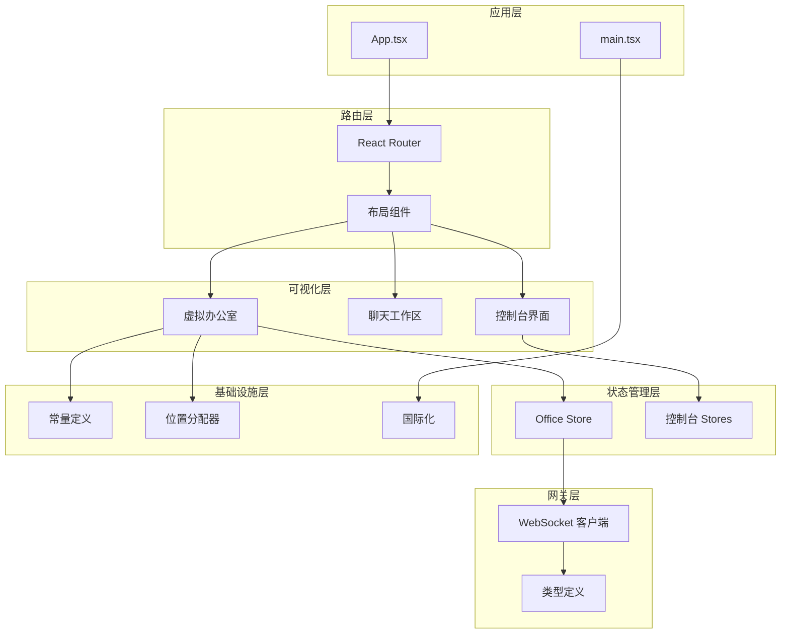
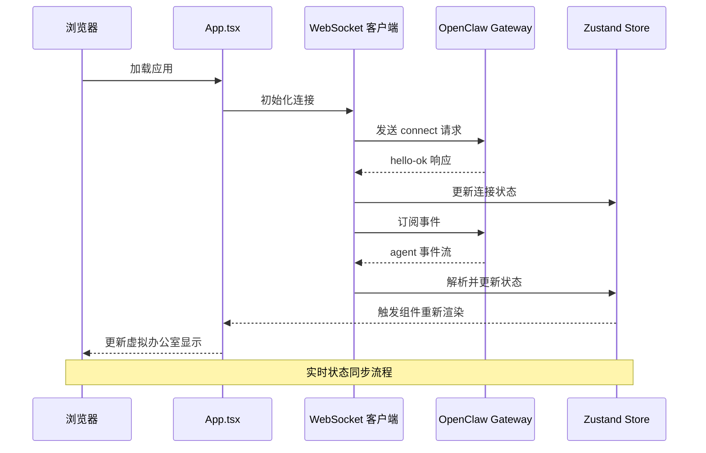
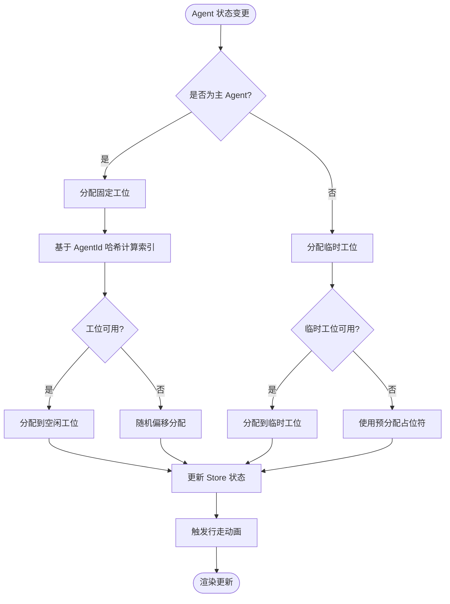
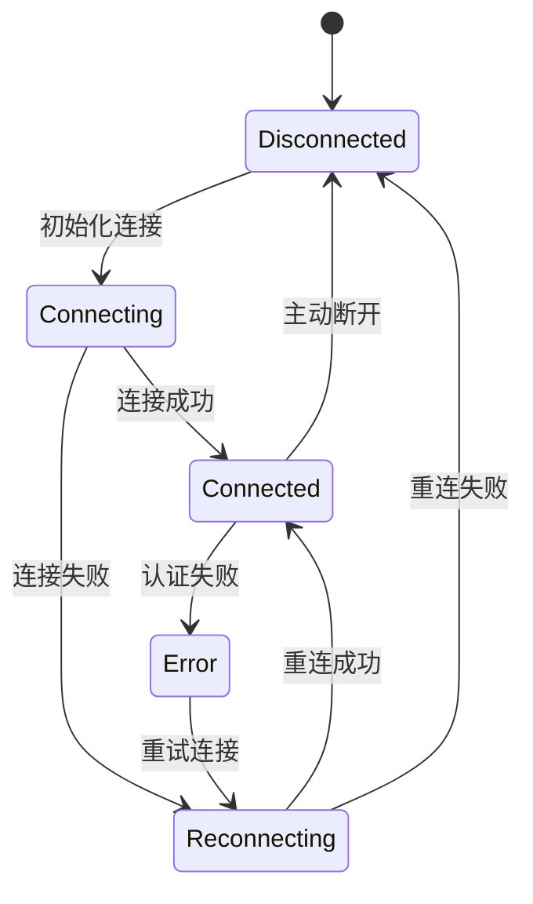
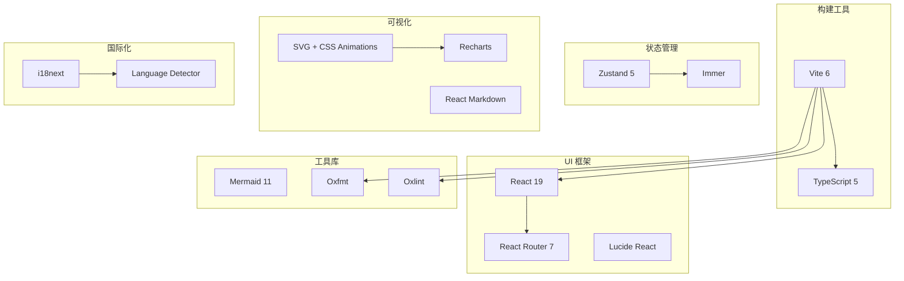

# 项目概述

<cite>
**本文档引用的文件**
- [README.md](file://README.md)
- [package.json](file://package.json)
- [src/App.tsx](file://src/App.tsx)
- [src/main.tsx](file://src/main.tsx)
- [src/components/office-2d/FloorPlan.tsx](file://src/components/office-2d/FloorPlan.tsx)
- [src/lib/constants.ts](file://src/lib/constants.ts)
- [src/store/office-store.ts](file://src/store/office-store.ts)
- [src/gateway/ws-client.ts](file://src/gateway/ws-client.ts)
- [src/gateway/types.ts](file://src/gateway/types.ts)
- [src/lib/position-allocator.ts](file://src/lib/position-allocator.ts)
- [src/components/pages/DashboardPage.tsx](file://src/components/pages/DashboardPage.tsx)
- [src/store/console-stores/agents-store.ts](file://src/store/console-stores/agents-store.ts)
- [src/i18n/index.ts](file://src/i18n/index.ts)
</cite>

## 目录
1. [引言](#引言)
2. [项目结构](#项目结构)
3. [核心组件](#核心组件)
4. [架构总览](#架构总览)
5. [详细组件分析](#详细组件分析)
6. [依赖分析](#依赖分析)
7. [性能考虑](#性能考虑)
8. [故障排除指南](#故障排除指南)
9. [结论](#结论)
10. [附录](#附录)

## 引言

OpenClaw Office 是 OpenClaw 多智能体系统的可视化监控与管理前端，其核心价值主张是将 AI 智能体的协作逻辑具象化为实时的数字孪生办公室。该项目通过等距投影（Isometric）风格的虚拟办公室场景，实时展示 Agent 的工作状态、协作链路、工具调用和资源消耗，同时提供完整的控制台管理界面和 Chat 对话工作区。

**核心隐喻**：Agent = 数字员工 | 办公室 = Agent 运行时 | 工位 = Session | 会议室 = 协作上下文

## 项目结构

项目采用模块化的前端架构，主要分为以下几个层次：



**图表来源**
- [src/App.tsx:76-124](file://src/App.tsx#L76-L124)
- [src/main.tsx:1-15](file://src/main.tsx#L1-L15)
- [src/components/office-2d/FloorPlan.tsx:20-278](file://src/components/office-2d/FloorPlan.tsx#L20-L278)

**章节来源**
- [README.md:63-76](file://README.md#L63-L76)
- [package.json:1-83](file://package.json#L1-L83)

## 核心组件

### 虚拟办公室系统

虚拟办公室是项目最具特色的组件，采用等距投影渲染技术，通过 SVG 实现高保真的 2D 办公室场景。

**技术亮点**：
- **等距投影渲染**：使用 SVG 实现 3D 视觉效果，支持 1200×700 像素画布
- **动态状态可视化**：Agent 头像支持实时状态动画（空闲/工作中/发言/工具调用/错误）
- **协作关系可视化**：通过连接线展示 Agent 间的消息传递关系
- **智能位置分配**：基于哈希算法的确定性工位分配，确保相同 Agent 总在同一位置

### 实时聊天工作区

提供独立的 Chat 工作区，支持多 Agent 并行对话和实时流式转录。

**核心功能**：
- 顶部导航直达的独立 Chat 工作区
- 会话管理：创建新会话、切换历史会话、按 Agent 路由
- 实时流式转录：流式展示 AI 回复，支持中止/重发
- 聊天历史持久化：服务端按天分片缓存聊天记录

### 控制台管理界面

完整的系统管理界面，提供 Dashboard、Agents、Channels、Skills、Cron、Settings 等页面。

**页面概览**：
- **Dashboard**：概览统计卡片、告警横幅、Channel/Skill 概览、快捷导航
- **Agents**：Agent 列表/创建/删除，详情多 Tab（Overview/Channels/Cron/Skills/Tools/Files）
- **Channels**：渠道卡片、配置对话框、统计、WhatsApp QR 绑定流程
- **Skills**：技能市场、安装选项、技能详情
- **Cron**：定时任务管理和统计
- **Settings**：Provider 管理、外观/Gateway/开发者/高级/关于/更新

**章节来源**
- [README.md:13-54](file://README.md#L13-L54)
- [src/components/pages/DashboardPage.tsx:14-129](file://src/components/pages/DashboardPage.tsx#L14-L129)

## 架构总览

项目采用前后端分离架构，通过 WebSocket 与 OpenClaw Gateway 实时通信。



**图表来源**
- [src/App.tsx:76-124](file://src/App.tsx#L76-L124)
- [src/gateway/ws-client.ts:60-130](file://src/gateway/ws-client.ts#L60-L130)
- [src/gateway/types.ts:124-131](file://src/gateway/types.ts#L124-L131)

**章节来源**
- [README.md:274-291](file://README.md#L274-L291)
- [src/gateway/ws-client.ts:1-304](file://src/gateway/ws-client.ts#L1-L304)

## 详细组件分析

### 虚拟办公室渲染引擎

FloorPlan 组件是整个可视化系统的核心，负责渲染整个办公室场景。

```mermaid
classDiagram
class FloorPlan {
+agents Map~VisualAgent~
+links CollaborationLink[]
+theme ThemeMode
+render() JSX.Element
+renderDeskZone() JSX.Element
+renderMeetingZone() JSX.Element
+renderHotDeskZone() JSX.Element
+renderLoungeZone() JSX.Element
}
class VisualAgent {
+id string
+name string
+status AgentVisualStatus
+position {x, y}
+zone AgentZone
+movement MovementState
+render() JSX.Element
}
class CollaborationLink {
+sourceId string
+targetId string
+strength number
+render() JSX.Element
}
class OfficeStore {
+agents Map~VisualAgent~
+links CollaborationLink[]
+addAgent(agent) void
+updateAgent(id, patch) void
+processAgentEvent(event) void
+startMovement(agentId, toZone) void
}
FloorPlan --> VisualAgent : "渲染"
FloorPlan --> CollaborationLink : "渲染"
FloorPlan --> OfficeStore : "订阅状态"
OfficeStore --> VisualAgent : "管理"
OfficeStore --> CollaborationLink : "管理"
```

**图表来源**
- [src/components/office-2d/FloorPlan.tsx:20-278](file://src/components/office-2d/FloorPlan.tsx#L20-L278)
- [src/store/office-store.ts:217-370](file://src/store/office-store.ts#L217-L370)
- [src/gateway/types.ts:166-193](file://src/gateway/types.ts#L166-L193)

#### 等距投影实现

项目采用等距投影技术实现 3D 视觉效果，通过 SVG 的 viewBox 和 preserveAspectRatio 属性实现精确的坐标映射。

**技术特点**：
- **坐标系统**：SVG 1200×700 像素映射到 16×12 的世界单位
- **比例转换**：SCALE_X_2D_TO_3D = 16/1200，SCALE_Z_2D_TO_3D = 12/700
- **深度感知**：通过颜色深浅和阴影效果营造空间层次感

#### 智能位置分配算法



**图表来源**
- [src/lib/position-allocator.ts:51-82](file://src/lib/position-allocator.ts#L51-L82)
- [src/store/office-store.ts:504-580](file://src/store/office-store.ts#L504-L580)

**章节来源**
- [src/components/office-2d/FloorPlan.tsx:1-686](file://src/components/office-2d/FloorPlan.tsx#L1-L686)
- [src/lib/position-allocator.ts:1-209](file://src/lib/position-allocator.ts#L1-L209)

### 状态管理系统

项目采用 Zustand + Immer 的组合实现高效的状态管理。



**状态管理特性**：
- **连接状态管理**：支持连接、重连、错误、断开四种状态
- **事件历史记录**：维护最近 200 条事件历史
- **会话快照同步**：60 秒一次的低频 reconciliation
- **主题持久化**：支持明暗主题切换和持久化

**章节来源**
- [src/store/office-store.ts:1-800](file://src/store/office-store.ts#L1-L800)
- [src/gateway/types.ts:250-258](file://src/gateway/types.ts#L250-L258)

### 国际化系统

项目支持中英文双语，通过 i18next 实现运行时语言切换。

**国际化架构**：
- **命名空间**：common、layout、office、panels、chat、console
- **检测机制**：localStorage → navigator → fallback
- **动态加载**：按需加载对应语言包

**章节来源**
- [src/i18n/index.ts:1-59](file://src/i18n/index.ts#L1-L59)

## 依赖分析

项目采用现代化的前端技术栈，各依赖之间的关系如下：



**图表来源**
- [package.json:49-78](file://package.json#L49-L78)

**章节来源**
- [package.json:1-83](file://package.json#L1-L83)

## 性能考虑

### 渲染性能优化

1. **SVG 渲染优化**：使用 React 19 的并发特性，避免不必要的重渲染
2. **状态分层**：Office Store 独立管理可视化状态，减少全局重渲染
3. **事件节流**：WebSocket 事件按需处理，避免频繁状态更新

### 内存管理

1. **对象池模式**：使用 Map/Set 结构管理 Agent 状态，支持快速查找和清理
2. **定时器管理**：统一管理各种定时器，避免内存泄漏
3. **占位符机制**：预分配临时工位，减少动态分配开销

### 网络优化

1. **连接复用**：单个 WebSocket 连接承载所有事件和 RPC 通信
2. **增量更新**：只更新变化的状态部分，减少渲染负担
3. **断线重连**：指数退避算法，最大延迟 30 秒

## 故障排除指南

### 常见问题诊断

**连接问题**：
- 检查 Gateway Token 配置是否正确
- 验证 WebSocket 地址可达性
- 查看浏览器控制台网络面板

**渲染异常**：
- 确认 SVG 坐标系统计算正确
- 检查主题切换是否影响样式
- 验证动画状态机逻辑

**状态不同步**：
- 检查事件解析器是否正确处理
- 验证会话快照同步机制
- 确认定时器是否正常运行

**章节来源**
- [src/gateway/ws-client.ts:270-288](file://src/gateway/ws-client.ts#L270-L288)
- [src/store/office-store.ts:762-800](file://src/store/office-store.ts#L762-L800)

## 结论

OpenClaw Office 通过创新的数字孪生办公室概念，成功地将复杂的 AI 智能体协作逻辑转化为直观可视化的办公场景。项目不仅在技术架构上采用了现代化的前端技术栈，在用户体验设计上也体现了深度的工程思考。

**核心优势**：
1. **概念创新**：将抽象的 Agent 协作具象化为具体的办公场景
2. **技术先进**：采用等距投影、实时动画、状态管理等前沿技术
3. **生态集成**：与 OpenClaw 生态系统无缝集成，提供完整的管理体验
4. **扩展性强**：模块化架构支持功能扩展和定制化需求

该项目为 AI 多智能体系统的可视化监控和管理提供了优秀的参考实现，既适合初学者理解概念，也为有经验的开发者提供了深入的技术分析素材。

## 附录

### 快速启动指南

```bash
# 直接运行（一次性使用）
npx @ww-ai-lab/openclaw-office

# 或全局安装
npm install -g @ww-ai-lab/openclaw-office
openclaw-office

# 安装为系统服务
openclaw-office service install
```

### 开发环境设置

```bash
# 安装依赖
pnpm install

# 启动开发服务器
pnpm dev

# 构建生产版本
pnpm build

# 运行测试
pnpm test
```

**章节来源**
- [README.md:89-125](file://README.md#L89-L125)
- [README.md:258-272](file://README.md#L258-L272)