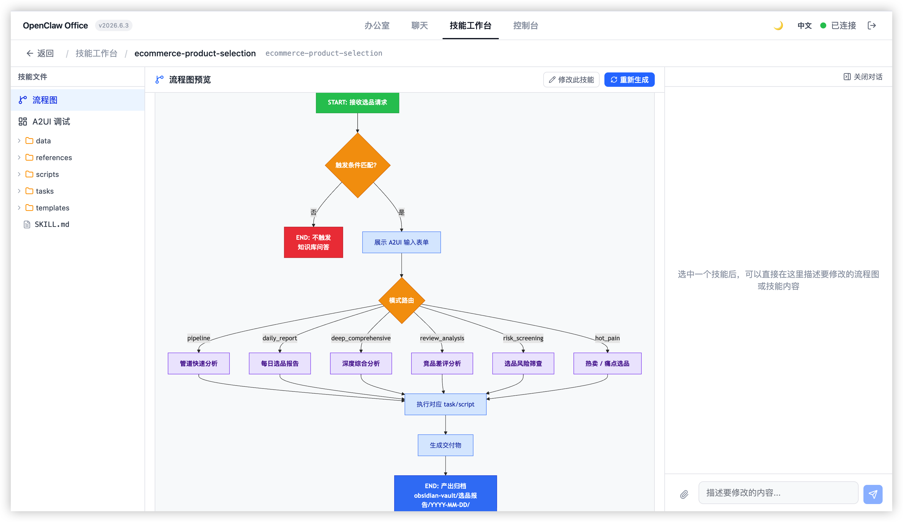
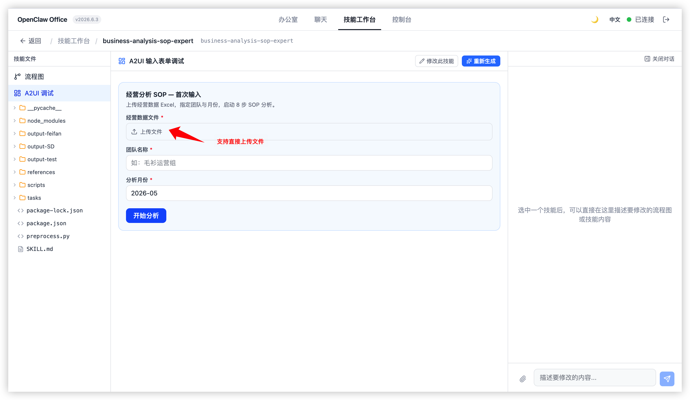
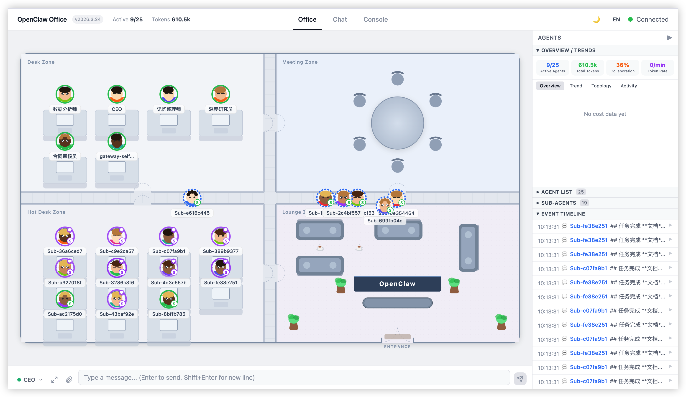
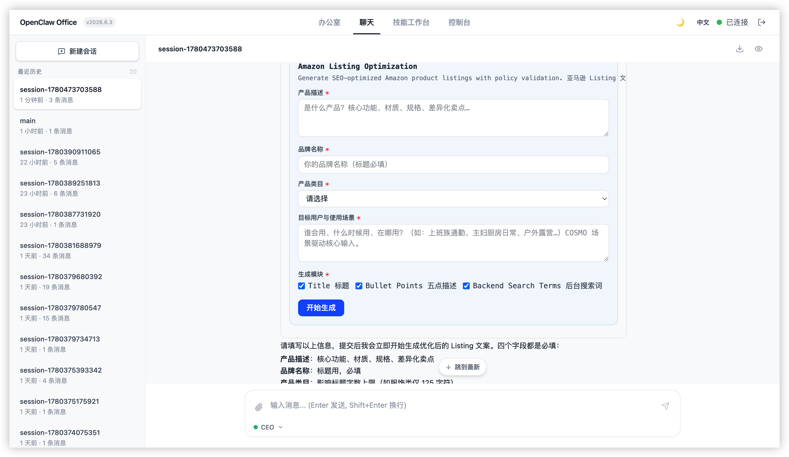
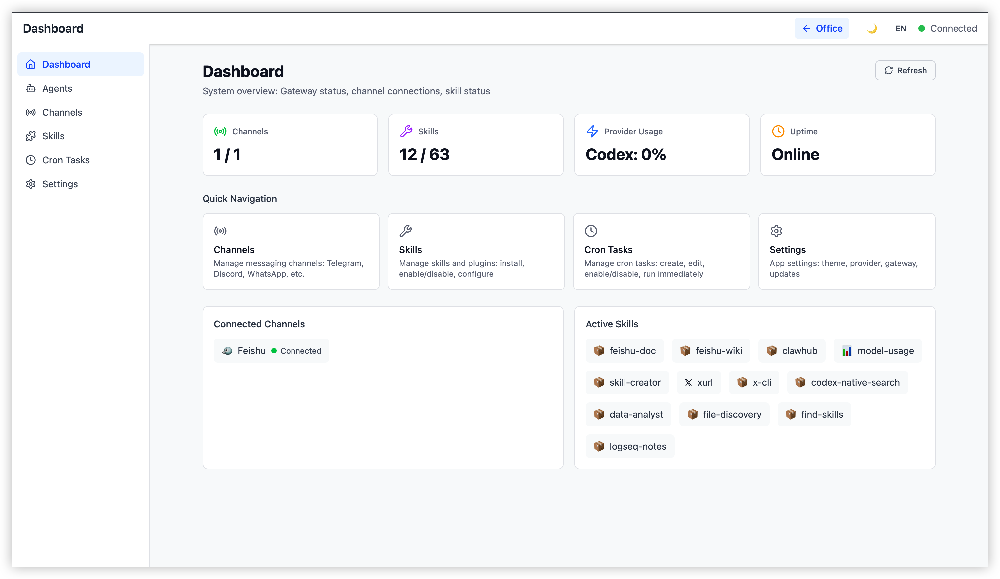
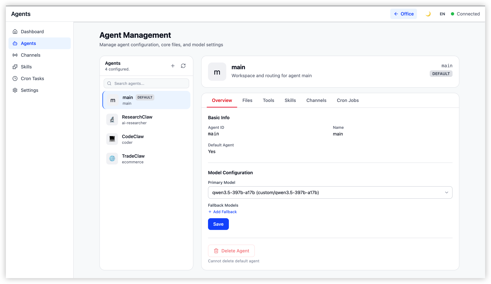
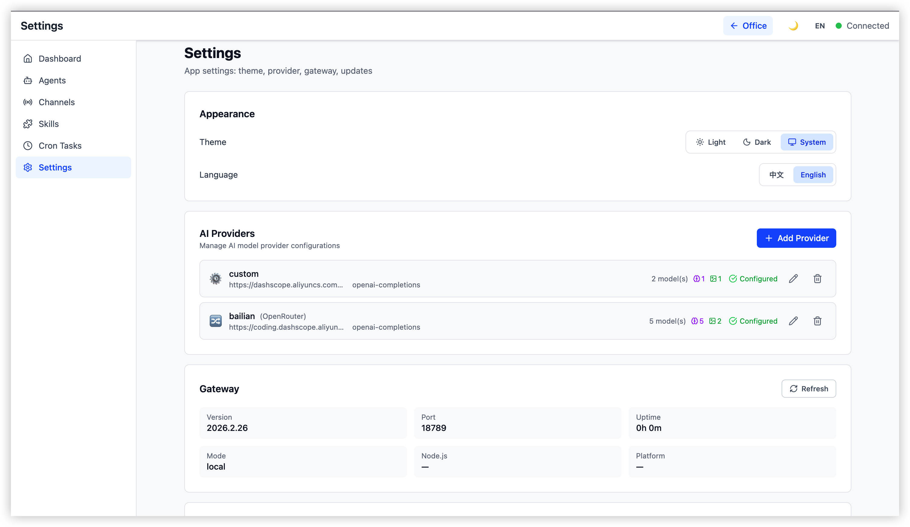

# OpenClaw Office

> [English](./README.en.md)

> 将 AI 智能体的协作逻辑具象化为实时的数字孪生办公室。

**OpenClaw Office** 是 [OpenClaw](https://github.com/openclaw/openclaw) Multi-Agent 系统的可视化监控与管理前端。它通过等距投影风格的虚拟办公室场景，实时展示 Agent 的工作状态、协作链路、工具调用和资源消耗，同时提供完整的控制台管理界面和 Chat 对话工作区。

**核心隐喻：** Agent = 数字员工 | 办公室 = Agent 运行时 | 工位 = Session | 会议室 = 协作上下文

> **OpenClaw Office 让 OpenClaw 从一个聊天机器人进化为一套 Skills 系统。**
> 不只是对话——而是创建、开发、调试和部署可复用的技能，让每个 Agent 都能掌握专业能力并协同完成复杂任务。

---

## 功能亮点

### ✨ Skill Workbench — Skills 开发平台

Skill Workbench 是 OpenClaw Office 的核心差异化功能——把「创建 Skill / 修改 Skill / 生成流程图 / A2UI 输入表单」整合成一个完整的 **AI 协作开发环境**，让 OpenClaw 真正成为一个可编程的 Skills 系统：

- **三页面嵌套路由**：`/skill-workbench`（列表）→ `/skill-workbench/create`（创建向导）→ `/skill-workbench/:slug`（详情）
- **聊天侧边栏驱动开发**：在侧边栏与 AI 对话即可创建、修改 Skill，文件变动实时同步磁盘
- **FLOWCHART.md 自动生成**：内置 `skill-workbench-mermaid-guard` 守卫技能，一键生成符合规范的彩色 Mermaid 流程图，支持单图与多图模式
- **纯 Markdown 多图预览**：流程图预览完全走 Markdown 渲染链路，一次渲染多个 Mermaid 代码块
- **A2UI 可视化输入表单**：声明式表单 Schema，Chat 中的 ` ```a2ui ` 代码块自动渲染为交互式表单，详情页提供「A2UI 调试」选项卡一键生成和预览
- **默认技能自动安装**：首次进入工作台时，嵌入式服务端自动把 npm 包内置的默认 Skill 拷贝到 `~/.openclaw/workspace/skills/`，无需手工安装

详细使用指南见 [SKILL-WORKBENCH.md](./SKILL-WORKBENCH.md)。





### 虚拟办公室

- **2D 平面图** — SVG 渲染的等距办公室场景，包含工位区、临时工位、会议区和丰富的家具（桌椅/沙发/植物/咖啡杯）
- **Agent 头像** — 基于 agentId 确定性生成的 SVG 头像，支持实时状态动画（空闲/工作中/发言/工具调用/错误）
- **协作连线** — Agent 间消息传递的可视化连接
- **气泡面板** — 实时 Markdown 文本流和工具调用展示
- **侧边面板** — Agent 详情、Token 折线图、成本饼图、活跃热力图、子 Agent 关系图、事件时间轴



### Chat 对话工作区

- 顶部导航可直达的独立 Chat 工作区（`/#/chat`），底部停靠栏保留为快捷入口
- 会话管理 — 创建新会话、切换历史会话、按 Agent 路由，支持多 Agent 并行对话
- 实时流式转录 — 流式展示 AI 回复，支持中止/重发
- 聊天历史持久化 — 服务端按天分片缓存聊天记录，跨浏览器/设备/刷新稳定可见
- 工具调用可视化 — 在对话流中嵌入 Agent 工具调用状态，可折叠查看
- 斜杠命令 — `/help`、`/new`、`/reset`、`/model`、`/think`、`/export` 等快捷指令
- 附件支持 — 支持图片及任意文件附件
- 辅助功能 — 搜索、导出 Markdown、专注模式、消息置顶引用
- 动态表单交互（A2UI）— AI 回复中的 ` ```a2ui ` 代码块自动渲染为结构化表单，支持文本、选择、文件上传等多种字段类型，提交后以结构化消息回发 Agent



### 控制台

完整的系统管理界面：

| 页面                | 功能                                                                                                                 |
| ------------------- | -------------------------------------------------------------------------------------------------------------------- |
| **Dashboard**       | 概览统计卡片、告警横幅、Channel/Skill 概览、快捷导航                                                                 |
| **Agents**          | Agent 列表/创建/删除，详情多 Tab（Overview/Channels/Cron/Skills/Tools/Files）                                        |
| **Channels**        | 渠道卡片、配置对话框、统计、WhatsApp QR 绑定流程                                                                     |
| **Skills**          | 技能市场、安装选项、技能详情                                                                                         |
| **Skill Workbench** ✨ | Skills 开发平台（详见上方介绍）                                                                                      |
| **Cron**            | 定时任务管理和统计                                                                                                   |
| **Settings**        | Provider 管理（添加/编辑/模型编辑器）、外观/Gateway/开发者/高级/关于/更新                                            |







### 其他特性

- **国际化** — 完整的中英文双语支持，运行时语言切换
- **Mock 模式** — 无需连接 Gateway 即可开发
- **响应式** — 移动端优化，自动切换 2D 模式

---

## 技术栈

| 层       | 技术                                        |
| -------- | ------------------------------------------- |
| 构建工具 | Vite 6                                      |
| UI 框架  | React 19                                    |
| 2D 渲染  | SVG + CSS Animations                        |
| 状态管理 | Zustand 5 + Immer                           |
| 样式     | Tailwind CSS 4                              |
| 路由     | React Router 7                              |
| 图表     | Recharts                                    |
| 国际化   | i18next + react-i18next                     |
| 实时通信 | 原生 WebSocket（对接 OpenClaw Gateway）     |

---

## 前提条件

- **Node.js 22+**
- **[OpenClaw](https://github.com/openclaw/openclaw)** 已安装并运行

OpenClaw Office 是 OpenClaw 的配套前端，连接到正在运行的 OpenClaw Gateway。它**不会**启动或管理 Gateway 本身。

---

## 快捷启动

无需克隆仓库，最快速的运行方式：

```bash
# 直接运行（一次性使用）
npx @ww-ai-lab/openclaw-office

# 或全局安装
npm install -g @ww-ai-lab/openclaw-office
openclaw-office
```

### Gateway 认证

启动后，浏览器会显示 OpenClaw Office 的**登录界面**，需要你输入 Gateway 连接信息进行认证：

1. **Gateway URL** — Gateway WebSocket 地址，默认 `ws://localhost:18789`（预填自后端注入配置）
2. **Access Token** — Gateway 认证令牌（从 OpenClaw 配置文件 `~/.openclaw/openclaw.json` 中的 `gateway.auth.token` 字段获取）
3. **Password**（可选）— Gateway 密码（如果启用了密码认证）

填写后点击「连接」即可进入系统。

> **说明：** 本地部署若未启用认证，Gateway URL 保持默认、Token 留空，直接点击「连接」即可。

### CLI 参数

| 参数                  | 说明                   | 默认值                 |
| --------------------- | ---------------------- | ---------------------- |
| `-t, --token <token>` | Gateway 认证 token     | 自动检测               |
| `-g, --gateway <url>` | Gateway WebSocket 地址 | `ws://localhost:18789` |
| `-p, --port <port>`   | 服务端口               | `5180`                 |
| `--host <host>`       | 绑定地址               | `0.0.0.0`              |
| `-h, --help`          | 显示帮助               | —                      |

> **说明：** 此方式运行的是预构建的生产版本。如需热重载开发，请参见下方 [开发](#开发) 部分。

---

## 安装为系统服务（后台运行）

将 OpenClaw Office 注册为系统服务后，它会在开机/登录时自动启动，无需手动运行命令。支持 macOS（launchd）和 Linux（systemd --user）。

### 安装服务

```bash
# 安装为系统服务（token 自动检测，也可手动指定）
openclaw-office service install

# 指定 token 和端口
openclaw-office service install --token <your-token> --port 3000
```

安装完成后，服务会**立即启动**并在后台运行。后续每次开机/登录，服务将自动拉起。

### 服务管理命令

```bash
openclaw-office service status              # 查看服务状态
openclaw-office service stop                # 停止服务
openclaw-office service start               # 启动服务
openclaw-office service restart             # 重启服务
openclaw-office service log                 # 查看服务日志
openclaw-office service log --follow        # 实时跟踪日志
openclaw-office service uninstall           # 卸载系统服务
```

> **提示：** 安装为服务后，也可通过 Settings 页面的「服务管理」面板查看 Gateway 状态和执行重启等操作。

---

## Windows（WSL2）一键启动

> **系统要求：** Windows 10 21H2 / Windows 11 + WSL2，以及一个 Linux 发行版（如 Ubuntu）。

对于 Windows 用户，OpenClaw Office 提供了基于 WSL2 的一键部署方案，无需手动在 WSL 中配置依赖：

**双击 `start-openclaw-office.cmd`** — 即可完成以下全部操作：

1. **自动检测** WSL 发行版（自动跳过 docker-desktop）
2. **自动安装** Node.js 22+ 和 OpenClaw（如果 WSL 中尚未安装）
3. **初始化配置** OpenClaw Gateway（首次运行自动生成 token）
4. **启动 Gateway** 服务（在 WSL 中以 systemd 方式运行）
5. **启动 Office Server**（在 Windows 本机以 Node.js 运行）
6. **自动打开浏览器** `http://127.0.0.1:5180`

也可通过 PowerShell 直接调用（支持自定义参数）：

```powershell
# 指定 OpenClaw 版本和端口
.\scripts\start-openclaw-office.ps1 -OpenClawVersion "2026.3.28" -OfficePort 5180 -GatewayPort 18789

# 指定使用特定 WSL 发行版
.\scripts\start-openclaw-office.ps1 -Distro "Ubuntu-22.04"
```

| 参数                  | 说明                              | 默认值        |
| --------------------- | --------------------------------- | ------------- |
| `-Distro`             | WSL 发行版名称（空则自动检测）    | `""`（自动）  |
| `-OpenClawVersion`    | 要安装的 OpenClaw 版本            | `2026.3.28`   |
| `-OfficePort`         | Office Server 端口                | `5180`        |
| `-GatewayPort`        | Gateway 端口                      | `18789`       |

---

## 快速开始（从源码）

### 1. 安装依赖

```bash
pnpm install
```

### 2. 启动 Gateway

确保 OpenClaw Gateway 在默认地址上运行（`localhost:18789`）。可通过以下方式启动：

- OpenClaw macOS 应用
- `openclaw gateway run` CLI 命令
- 其他部署方式（参见 [OpenClaw 文档](https://github.com/openclaw/openclaw)）

> **提示：** 认证 Token 无需提前配置——启动后在浏览器登录界面输入即可。

### 3. 启动开发服务器

```bash
pnpm dev
```

在浏览器中打开 `http://localhost:5180`，在登录界面输入 Gateway Token 后连接即可进入。

如需连接非默认地址的 Gateway（例如远程服务器），创建 `.env.local` 文件（已在 `.gitignore` 中，不会被提交）：

```bash
cat > .env.local << 'EOF'
VITE_GATEWAY_URL=ws://192.168.1.100:18789
EOF
```

### 环境变量

| 变量                    | 必须 | 默认值                 | 说明                                       |
| ----------------------- | ---- | ---------------------- | ------------------------------------------ |
| `VITE_GATEWAY_URL`      | 否   | `ws://localhost:18789` | Gateway WebSocket 地址                     |
| `VITE_GATEWAY_WS_PATH`  | 否   | `/gateway-ws`          | 浏览器侧反向代理 WS 路径                   |
| `VITE_GATEWAY_TOKEN`    | 否   | —                      | 预填登录表单的 Token（可选，认证在登录时完成）|
| `VITE_MOCK`             | 否   | `false`                | 启用 Mock 模式（不需要 Gateway）            |

### Mock 模式（无需 Gateway）

如需在没有运行中的 Gateway 的情况下开发，启用 Mock 模式：

```bash
VITE_MOCK=true pnpm dev
```

这会使用模拟的 Agent 数据进行 UI 开发。

---

## 开发

### 命令

```bash
pnpm install              # 安装依赖
pnpm dev                  # 启动开发服务器 (port 5180)
pnpm build                # 构建生产版本
pnpm test                 # 运行测试
pnpm test:watch           # 测试 watch 模式
pnpm typecheck            # TypeScript 类型检查
pnpm lint                 # Oxlint 检查
pnpm format               # Oxfmt 格式化
pnpm check                # lint + format 检查
```

### 架构

OpenClaw Office 通过 WebSocket 连接 Gateway，数据流如下：

```
OpenClaw Gateway  ──WebSocket──>  ws-client.ts  ──>  event-parser.ts  ──>  Zustand Store  ──>  React 组件
     │                                                                          │
     └── RPC (agents.list, chat.send, ...)  ──>  rpc-client.ts  ──────────────>─┘
```

Gateway 广播实时事件（`agent`、`presence`、`health`、`heartbeat`）并响应 RPC 请求。前端将 Agent 生命周期事件映射为可视化状态（idle/working/speaking/tool_calling/error），在办公室场景中渲染。

### Session 同步策略

- Agent 与子 Agent 的实时状态、2D 办公室小人走动和会议区移动效果，默认由 WebSocket `agent` 事件直接驱动
- `sessions.list` 不再用于高频实时驱动，而是作为连接建立后的立即同步和 **60 秒一次** 的低频 reconciliation，用于修复漏事件、断线恢复后的 session 漂移
- 该策略用于降低 Gateway CPU 压力，避免高频全量扫描影响其他 RPC probe

---

## 联系交流

可以通过邮箱联系我：toxingwang@gmail.com

也欢迎关注公众号：旺哥聊AI

---

## 贡献

欢迎任何贡献！无论是新的可视化效果、控制台功能还是性能优化。

1. Fork 本仓库
2. 创建特性分支 (`git checkout -b feature/cool-effect`)
3. 提交更改（使用 [Conventional Commits](https://www.conventionalcommits.org/) 格式）
4. 开启 Pull Request

---

## 许可证

[MIT](./LICENSE)
