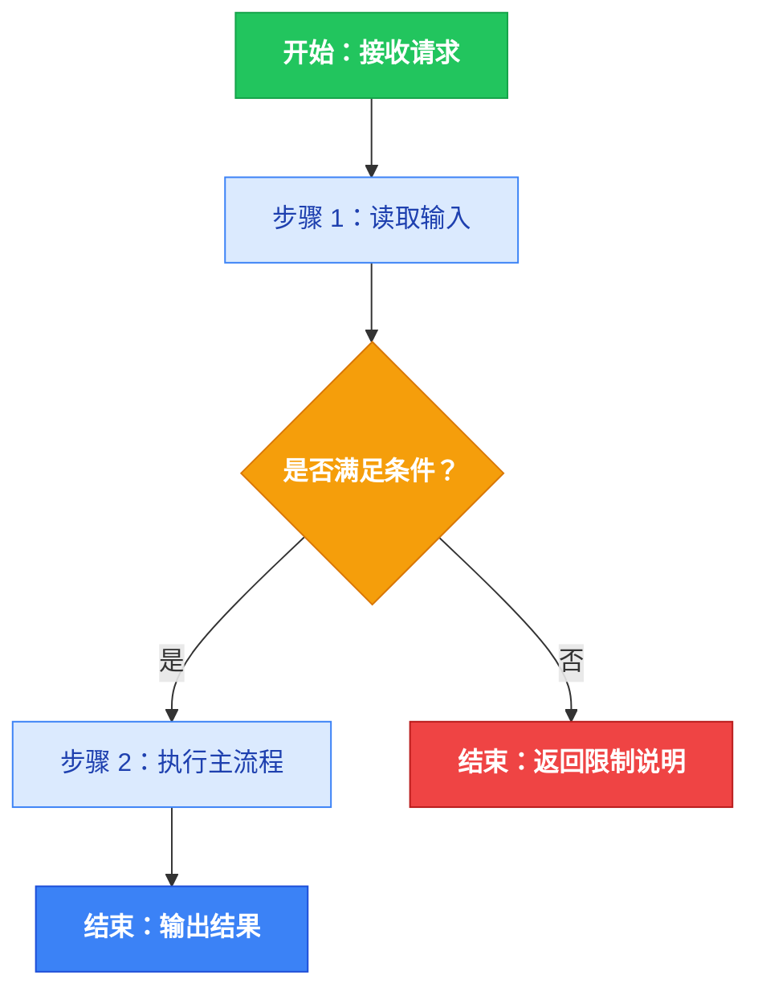

# Mermaid 归一化速查（易错写法 → 修正）

本文件是写入 FLOWCHART.md 前的语法收敛速查表，与 `SKILL.md` 的规范保持一致：
**总览图 + 按需若干彩色子图**，每个 Mermaid 块都带完整 classDef 配色。
（颜色/结构的完整规则以 SKILL.md 为准，本文件只给"危险写法 → 正确写法"对照。）

## 一、结构

- 第一个 Mermaid 块是总览图，首行固定 `flowchart TD`。
- 复杂 Skill 可在总览图后追加子图（子图首行 `flowchart TD` 或 `flowchart LR`），每个子图前一个 `##` 标题；子图数量 ≤ 6。
- 简单 Skill 只输出单张总览图，不要硬拆。
- 每个 Mermaid 块各自独立渲染，不跨块引用节点 ID。

## 二、节点命名

- 节点 ID：仅 ASCII 字母 / 数字 / 下划线（`START`、`STEP_1`、`DECIDE_1`）。
- 节点文本含中文/特殊符号时必须双引号，并加颜色类：
  - `START["开始：接收请求"]:::startNode`
  - `STEP_1["步骤 1：读取 SKILL.md"]:::process`
  - `DECIDE_1{"FLOWCHART.md 是否存在？"}:::decision`
  - `END_OK["结束：返回流程图"]:::endOk`

## 三、危险写法 → 修正

- 错误：`A[阶段 1：结构感知 perceive]`　正确：`A["阶段 1：结构感知 perceive"]:::phase`
- 错误：`B{是否继续执行?}`　正确：`B{"是否继续执行？"}:::decision`
- 错误：节点文本里直接换行　正确：`C["读取 SKILL.md<br/>并分析"]:::process`
- 错误：`EDGE -->|读取 SKILL.md / 判断是否可复用| NEXT`　正确：拆成节点
  `EDGE --> STEP_READ["读取 SKILL.md"]:::process` 再 `STEP_READ --> DECIDE{"是否可复用？"}:::decision`
- 错误：菱形漏颜色类 `DECIDE_1{"..."}`　正确：`DECIDE_1{"..."}:::decision`
- 错误：类名拼错 `:::start` / `:::ok`（静默丢色）　正确：只用 `startNode / endOk / endErr / decision / process / phase`

## 四、边标签

- 只保留短标签：是、否、成功、失败、存在、不存在、通过、不通过。
- 任何长句 / 带标点 / 带斜杠的边标签都改写为节点。

## 五、写入前确认

1. 每个 Mermaid 块的 ```mermaid 与 ``` 都闭合，且只含一种 diagram type？
2. 每个块都完整声明了 6 个 classDef，且所有节点都加了正确的 `:::className`？
3. 所有中文/特殊符号标签都用了双引号？换行只用 `<br/>`？
4. 节点 ID 在同一块内唯一、可读，且无跨块引用？
5. 每个 Mermaid 块前恰有一个 `##` 标题，图与图之间没有夹带自然语言摘要？

## 六、最小总览模板（含颜色）

